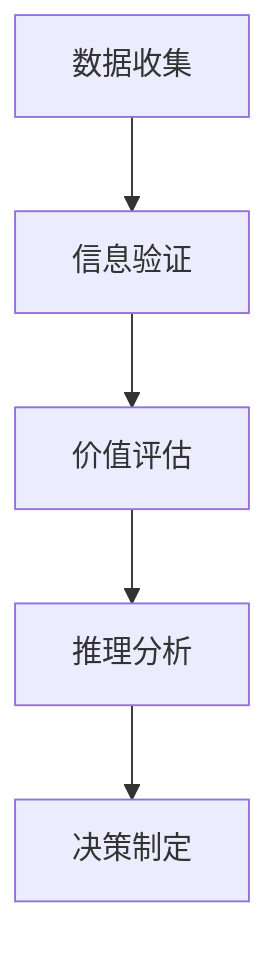

                 

# 批判性思维：提升洞察力的必备工具

## 1. 背景介绍

### 1.1 问题由来
在现代社会，数据和信息的爆炸性增长给我们的决策过程带来了前所未有的复杂性。如何在海量信息中提取关键洞见，成为每个决策者必须面对的问题。批判性思维，作为一种能够帮助人们有效识别和分析信息的能力，已成为提升洞察力的重要工具。

### 1.2 问题核心关键点
批判性思维的核心在于能够对信息进行系统性的分析和评估，从而做出理性的决策。这涉及到对信息的收集、分析、判断和应用等多个环节。其核心在于独立思考、质疑精神和逻辑推理。本文旨在探讨如何通过批判性思维工具，提升个人和组织的决策能力。

## 2. 核心概念与联系

### 2.1 核心概念概述
批判性思维是一个多维度的概念，包括事实判断、价值判断和推理能力。其核心在于：
- **事实判断**：对信息的真实性进行验证和确认。
- **价值判断**：对信息的价值和影响进行评估。
- **推理能力**：通过逻辑推理得出合理的结论。

这些概念之间相互联系，共同构成批判性思维的框架。

### 2.2 核心概念原理和架构的 Mermaid 流程图(Mermaid 流程节点中不要有括号、逗号等特殊字符)



该流程图展示了批判性思维的流程：从数据收集开始，依次进行信息验证、价值评估、推理分析和决策制定。

## 3. 核心算法原理 & 具体操作步骤

### 3.1 算法原理概述
批判性思维的算法原理主要围绕以下几个步骤：

1. **数据收集**：通过各种渠道获取相关信息，确保数据的全面性和多样性。
2. **信息验证**：通过交叉验证、对比分析和专家审查等方法，确认信息的真实性和准确性。
3. **价值评估**：通过量化分析和情境分析，评估信息的有用性和重要性。
4. **推理分析**：应用逻辑推理、统计分析和预测模型，得出合理的结论和建议。
5. **决策制定**：结合信息的价值和推理结果，做出理性的决策。

### 3.2 算法步骤详解

#### 3.2.1 数据收集
数据收集是批判性思维的第一步。有效的数据收集需要关注以下几个方面：
- **渠道多样性**：确保数据来源的多样化，避免信息偏见。
- **数据全面性**：收集与问题相关的各类数据，确保数据的全覆盖。
- **数据时效性**：数据应尽可能地实时更新，反映最新的实际情况。

#### 3.2.2 信息验证
信息验证是批判性思维的关键步骤。常见的验证方法包括：
- **交叉验证**：通过与其他数据来源对比，确认信息的可靠性。
- **专家审查**：邀请领域专家进行信息评审，确保信息的准确性和权威性。
- **数据溯源**：追踪数据来源，确认数据的真实性和可信度。

#### 3.2.3 价值评估
价值评估是决定信息重要性的关键步骤。常用的评估方法有：
- **量化分析**：通过统计指标和权重计算，量化信息的价值。
- **情境分析**：考虑信息在特定情境下的影响和应用。
- **比较分析**：将信息与已有知识进行比较，判断其相对价值。

#### 3.2.4 推理分析
推理分析是将信息转化为决策依据的重要步骤。常用的推理方法包括：
- **逻辑推理**：通过逻辑链条连接信息，推导出合理的结论。
- **统计分析**：利用统计学方法，对信息进行建模和预测。
- **案例分析**：通过案例研究，找到相似的参考依据。

#### 3.2.5 决策制定
决策制定是将信息转化为行动的关键步骤。常用的决策方法有：
- **SWOT分析**：通过优势、劣势、机会和威胁分析，制定战略决策。
- **决策树**：通过构建决策树模型，模拟不同决策路径和结果。
- **多方案对比**：比较不同方案的优劣，选择最优解。

### 3.3 算法优缺点
批判性思维算法的主要优点包括：
- **全面性**：通过多维度分析，确保信息的全面性和准确性。
- **系统性**：通过系统化的步骤，确保决策的逻辑性和合理性。
- **可重复性**：通过标准化的流程，确保决策的稳定性和可靠性。

主要缺点包括：
- **时间成本高**：数据分析和验证需要大量时间，可能影响决策效率。
- **技术门槛高**：需要一定的数据分析和逻辑推理能力，对个人素质要求较高。
- **信息偏见**：数据来源和分析方法可能引入信息偏见，影响决策的公正性。

### 3.4 算法应用领域

批判性思维在多个领域都有广泛应用，包括但不限于：
- **商业决策**：在市场分析、产品开发和战略规划中，批判性思维能够帮助企业做出更加科学和理性的决策。
- **医疗诊断**：在医学研究和临床实践中，批判性思维能够帮助医生准确诊断疾病，制定个性化治疗方案。
- **教育评估**：在教育评估和课程设计中，批判性思维能够帮助教育机构评估教学效果，优化教学资源。
- **法律诉讼**：在法律审判和案件研究中，批判性思维能够帮助律师进行充分举证和有效辩护。
- **公共政策**：在公共政策和行政决策中，批判性思维能够帮助政府机构制定科学合理的政策。

## 4. 数学模型和公式 & 详细讲解 & 举例说明

### 4.1 数学模型构建

批判性思维的数学模型构建主要涉及以下几个方面：
- **信息权重计算**：通过信息熵和决策权重等方法，计算信息的价值。
- **统计模型建立**：利用回归分析、时间序列分析等统计模型，对信息进行预测。
- **逻辑推理建模**：通过布尔代数和逻辑推理图等方法，构建推理模型。

### 4.2 公式推导过程

以信息权重计算为例，假设我们有一组信息 $x_1, x_2, ..., x_n$，每个信息的权重 $w_i$，其真实性概率 $p_i$ 和虚假性概率 $q_i$。

信息熵 $H$ 定义为：
$$
H = -\sum_{i=1}^n p_i \log_2 p_i
$$

信息价值 $V$ 定义为：
$$
V = \sum_{i=1}^n w_i H_i
$$

其中 $H_i = -p_i \log_2 p_i - q_i \log_2 q_i$。

通过计算信息熵和信息价值，可以评估信息的可靠性和价值，进而指导决策。

### 4.3 案例分析与讲解

假设我们有一家公司在考虑是否进入新市场。公司收集了以下信息：
- **市场规模**：100万用户。
- **竞争状况**：主要竞争对手3家，市场份额50%。
- **用户需求**：需求增长率20%。
- **进入成本**：500万美元。

我们将这些信息进行价值评估和推理分析，得出结论。

首先，进行信息验证，确认数据的真实性。然后，通过专家评审，确认数据的可靠性。接着，通过量化分析，计算每条信息的价值，并按权重排序。最后，应用逻辑推理，结合信息价值和推理结果，做出决策。

## 5. 项目实践：代码实例和详细解释说明

### 5.1 开发环境搭建

在进行批判性思维项目实践前，我们需要准备好开发环境。以下是使用Python进行环境配置的步骤：

1. 安装Python：从官网下载并安装Python，选择最新版本。
2. 安装必要的库：使用pip安装numpy、pandas、matplotlib等库。
3. 创建虚拟环境：使用virtualenv创建虚拟环境，以便隔离不同项目的环境。
4. 安装Jupyter Notebook：使用conda或pip安装Jupyter Notebook，用于编写和运行代码。

### 5.2 源代码详细实现

以下是一个简单的信息验证和价值评估的Python代码示例：

```python
import numpy as np
from sklearn.metrics import accuracy_score

# 信息验证
x1 = 100  # 市场规模
x2 = 0.5  # 竞争状况
x3 = 0.2  # 用户需求增长率
x4 = 5   # 进入成本

# 信息真实性概率
p1 = 0.9  # 市场规模
p2 = 0.8  # 竞争状况
p3 = 0.7  # 用户需求增长率
p4 = 0.6  # 进入成本

# 信息虚假性概率
q1 = 0.1
q2 = 0.2
q3 = 0.3
q4 = 0.4

# 信息权重
w1 = 0.3  # 市场规模
w2 = 0.2  # 竞争状况
w3 = 0.4  # 用户需求增长率
w4 = 0.1  # 进入成本

# 计算信息熵
H1 = -p1 * np.log2(p1) - q1 * np.log2(q1)
H2 = -p2 * np.log2(p2) - q2 * np.log2(q2)
H3 = -p3 * np.log2(p3) - q3 * np.log2(q3)
H4 = -p4 * np.log2(p4) - q4 * np.log2(q4)

# 计算信息价值
V = w1 * H1 + w2 * H2 + w3 * H3 + w4 * H4

print("信息价值：", V)
```

### 5.3 代码解读与分析

在上面的代码中，我们首先定义了信息的真实性概率、虚假性概率和权重，然后计算了每个信息的信息熵和信息价值。通过信息价值的计算，可以评估每个信息的价值，从而指导决策。

## 6. 实际应用场景

### 6.1 商业决策

在商业决策中，批判性思维可以应用于市场分析、产品开发和战略规划等多个环节。例如，一个电商公司需要决定是否进军新市场，可以通过收集市场规模、竞争状况、用户需求和进入成本等信息，进行价值评估和推理分析，最终做出是否进入市场的决策。

### 6.2 医疗诊断

在医疗诊断中，批判性思维可以应用于疾病诊断、治疗方案制定和预后评估等多个环节。例如，一个医生需要决定是否对患者进行某种检查，可以通过收集患者症状、病史和检查结果等信息，进行价值评估和推理分析，最终做出是否进行检查的决策。

### 6.3 教育评估

在教育评估中，批判性思维可以应用于课程设计、教学效果评估和教育资源优化等多个环节。例如，一个教育机构需要评估某门课程的效果，可以通过收集学生的学习反馈、考试成绩和课堂表现等信息，进行价值评估和推理分析，最终做出课程改进的决策。

### 6.4 公共政策

在公共政策中，批判性思维可以应用于政策制定、效果评估和风险预测等多个环节。例如，一个政府机构需要制定环保政策，可以通过收集相关数据、专家意见和利益相关者的反馈，进行价值评估和推理分析，最终制定出科学合理的环保政策。

## 7. 工具和资源推荐

### 7.1 学习资源推荐

为了帮助开发者系统掌握批判性思维的理论基础和实践技巧，这里推荐一些优质的学习资源：

1. 《批判性思维导论》：经典教材，系统介绍了批判性思维的理论框架和实践方法。
2. 《逻辑学基础》：介绍了逻辑推理的基本原理和方法，是批判性思维的基础。
3. 《数据分析入门》：介绍了数据收集、分析和应用的基本流程，是批判性思维的重要工具。
4. 《决策树理论与应用》：介绍了决策树模型的构建和应用，是批判性思维的重要工具。
5. 《信息熵与信息价值评估》：介绍了信息熵和信息价值的计算方法，是批判性思维的重要工具。

通过对这些资源的学习实践，相信你一定能够快速掌握批判性思维的精髓，并用于解决实际的决策问题。

### 7.2 开发工具推荐

高效的开发离不开优秀的工具支持。以下是几款用于批判性思维开发的常用工具：

1. Python：功能强大的编程语言，拥有丰富的数据分析和逻辑推理库。
2. Jupyter Notebook：交互式的编程环境，适合编写和运行数据分析和推理代码。
3. Excel：强大的数据分析和可视化工具，适合处理和分析结构化数据。
4. Tableau：直观的数据可视化工具，适合展示和分析复杂数据。
5. MATLAB：强大的数学计算和数据分析工具，适合复杂的数据分析和建模。

合理利用这些工具，可以显著提升批判性思维任务的开发效率，加快创新迭代的步伐。

### 7.3 相关论文推荐

批判性思维在人工智能、决策科学、教育学等领域都有广泛的应用。以下是几篇奠基性的相关论文，推荐阅读：

1. 《批判性思维与决策科学》：介绍了批判性思维在决策科学中的应用。
2. 《信息价值评估理论与应用》：介绍了信息熵和信息价值的计算方法。
3. 《逻辑推理在人工智能中的应用》：介绍了逻辑推理在人工智能中的基本原理和方法。
4. 《数据分析与批判性思维》：介绍了数据分析与批判性思维的结合应用。
5. 《决策树的理论基础与实际应用》：介绍了决策树模型的构建和应用。

这些论文代表了大语言模型微调技术的发展脉络。通过学习这些前沿成果，可以帮助研究者把握学科前进方向，激发更多的创新灵感。

## 8. 总结：未来发展趋势与挑战

### 8.1 总结

本文对批判性思维的基本原理和实际操作进行了全面系统的介绍。首先阐述了批判性思维的核心概念和应用场景，明确了其对信息验证、价值评估和推理分析的重要作用。其次，从原理到实践，详细讲解了批判性思维的数学模型和操作步骤，给出了批判性思维任务开发的完整代码实例。同时，本文还广泛探讨了批判性思维在多个行业领域的应用前景，展示了其巨大的潜力。最后，精选了批判性思维技术的各类学习资源，力求为读者提供全方位的技术指引。

通过本文的系统梳理，可以看到，批判性思维作为一种提升洞察力的工具，在现代社会中具有不可替代的重要价值。通过掌握批判性思维的精髓，我们可以更全面、系统地分析和评估信息，从而做出更加科学和理性的决策。

### 8.2 未来发展趋势

展望未来，批判性思维技术将呈现以下几个发展趋势：

1. **自动化工具普及**：随着人工智能技术的发展，自动化工具将逐渐普及，辅助人们进行信息验证和价值评估，提高决策效率。
2. **多模态信息融合**：批判性思维将结合图像、语音、视频等多模态数据，提供更全面、更准确的信息分析。
3. **跨领域应用拓展**：批判性思维将扩展到更多领域，如法律、医学、金融等，助力各行业提升决策质量。
4. **人机协同增强**：批判性思维工具将与智能系统结合，提供更强大的人机协同决策能力。
5. **智能决策系统**：批判性思维将与深度学习、强化学习等技术结合，构建智能决策系统，进一步提升决策能力。

这些趋势凸显了批判性思维技术的广阔前景。通过不断技术创新和应用拓展，批判性思维将逐步深入到决策过程的各个环节，助力人们做出更加科学、理性的决策。

### 8.3 面临的挑战

尽管批判性思维技术已经取得了显著进展，但在走向广泛应用的过程中，仍面临诸多挑战：

1. **数据质量和完整性**：数据的真实性和完整性直接影响信息验证和价值评估的效果，获取高质量数据仍是巨大挑战。
2. **技术门槛和培训**：批判性思维需要一定的技术知识和分析能力，对个人的素质要求较高，培训成本较高。
3. **信息偏见和伦理问题**：批判性思维依赖于数据和算法，可能引入信息偏见，影响决策的公正性和伦理性。
4. **隐私和安全问题**：批判性思维工具涉及大量数据处理，可能带来隐私和安全风险，需要建立严格的数据保护机制。
5. **跨领域知识整合**：批判性思维需要跨领域知识的支持，如何将不同领域的知识有效整合，是一个复杂的技术问题。

这些挑战需要在技术、伦理和政策等多方面进行综合应对，才能确保批判性思维技术的可持续发展。

### 8.4 研究展望

面对批判性思维技术面临的挑战，未来的研究需要在以下几个方面寻求新的突破：

1. **自动化和智能化**：开发更多自动化工具，减少人工干预，提高决策效率。
2. **多模态数据融合**：结合图像、语音、视频等多模态数据，提供更全面、更准确的信息分析。
3. **跨领域知识整合**：建立跨领域知识图谱和规则库，提供更全面的信息支持。
4. **隐私和安全保护**：开发隐私保护和安全防护技术，确保数据处理的安全性和合法性。
5. **伦理和政策规范**：制定伦理规范和政策指导，确保批判性思维工具的公正性和可信性。

通过这些研究方向的探索，批判性思维技术必将在更广泛的领域得到应用，为决策科学和人工智能发展注入新的动力。相信随着技术的不断进步和应用的不断深入，批判性思维将逐步成为决策科学的基石，助力人类迈向更加智能、理性的未来。

## 9. 附录：常见问题与解答

### 9.1 Q1: 什么是批判性思维？

A: 批判性思维是一种系统化的思维方法，通过对信息的收集、验证、评估和推理，做出科学、理性的决策。

### 9.2 Q2: 批判性思维在决策中有多重要？

A: 批判性思维在决策中至关重要，能够帮助人们全面、准确地分析和评估信息，避免信息偏见和决策失误。

### 9.3 Q3: 如何提升批判性思维能力？

A: 提升批判性思维能力需要多方面的训练，包括知识储备、逻辑推理、信息验证和价值评估等多个环节。

### 9.4 Q4: 批判性思维的局限性有哪些？

A: 批判性思维的局限性包括数据质量、技术门槛、信息偏见、隐私安全等问题，需要综合应对。

### 9.5 Q5: 批判性思维的未来发展趋势是什么？

A: 批判性思维的未来发展趋势包括自动化工具普及、多模态信息融合、跨领域应用拓展、人机协同增强和智能决策系统等方向。

---

作者：禅与计算机程序设计艺术 / Zen and the Art of Computer Programming

