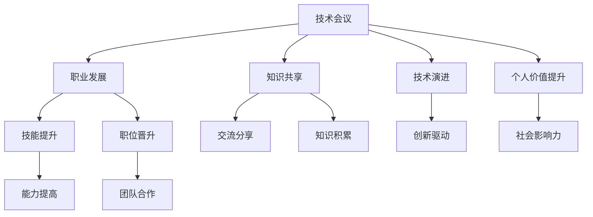

                 

# 技术会议演讲：提升个人价值

> 关键词：技术会议,技术演进,职业发展,个人价值提升,知识共享,技术交流

## 1. 背景介绍

### 1.1 问题由来
在当今这个快速发展的技术时代，个人技术的提升已经成为了一个不可逆转的趋势。无论是在工作中还是在职业发展中，技术的更新换代速度之快，要求我们必须不断学习、不断进步，才能跟上时代的步伐。而技术会议作为交流技术思想、分享最佳实践的重要平台，无疑是提升个人价值的重要途径。

### 1.2 问题核心关键点
技术会议的核心在于汇聚全球顶尖的技术专家、学者、工程师，通过交流分享，探讨最新技术动态，发现和解决问题。技术会议提供了一个平台，让参与者能够接触到最新的技术、最前沿的思考，推动技术的发展和应用，同时也是提升个人价值、拓展职业发展的重要场所。

### 1.3 问题研究意义
对于技术人员而言，参加技术会议具有重要意义：
- 及时掌握最新技术动态：技术会议汇集了世界各地的技术专家，能够分享最前沿的技术和思想。
- 拓展职业网络：通过与同行交流，建立广泛的技术联系网络，有助于职业发展。
- 提升个人技能：通过学习新技术、新方法，提升自己的技术水平和能力。
- 增强问题解决能力：技术会议的讨论和辩论环节，能够锻炼思维能力和问题解决能力。
- 促进知识共享：技术会议是知识共享的重要渠道，通过演讲、论文等形式，可以将自己的研究成果分享给更多人。

## 2. 核心概念与联系

### 2.1 核心概念概述

本节将介绍几个与技术会议密切相关的核心概念：

- **技术会议**：以技术交流和分享为主要目的的会议，通常由技术协会或研究机构组织。
- **技术演进**：指技术领域内的新技术、新方法的涌现和发展。
- **职业发展**：指个人在职业生涯中的成长和进步，包括技能提升、职位晋升等。
- **个人价值提升**：指个人在技术、知识、能力等方面的提高，从而在社会和职业中占据更重要的位置。
- **知识共享**：指通过交流、分享等方式，使知识和经验得以广泛传播，促进技术社区的发展。

这些核心概念之间的逻辑关系可以通过以下Mermaid流程图来展示：



这个流程图展示了技术会议与其他概念之间的联系：

1. 技术会议推动技术演进，是新技术发展的催化剂。
2. 技术会议促进职业发展，为个人提供技能提升、职位晋升的机会。
3. 技术会议提升个人价值，通过学习和分享，使个人在技术领域中占据重要地位。
4. 技术会议促进知识共享，使知识和经验得以广泛传播，推动技术社区的进步。

这些概念共同构成了技术会议的价值链，使得技术会议成为提升个人价值的不可或缺的平台。

## 3. 核心算法原理 & 具体操作步骤

### 3.1 算法原理概述

技术会议的核心在于汇聚专家、学者、工程师等，通过交流和分享，推动技术的发展和应用。核心算法原理可概括为以下几个方面：

- **会议组织与策划**：通过合理的会议组织和策划，确保会议的高效进行。
- **技术分享与讨论**：通过演讲、小组讨论、工作坊等方式，分享最新技术和思想，促进知识传播。
- **问题解决与挑战**：通过面对面的交流，探讨和解决技术难题，推动技术创新。
- **知识积累与沉淀**：通过会议记录、论文发表等方式，积累和沉淀知识，促进技术社区的成长。

### 3.2 算法步骤详解

技术会议的组织和实施通常包括以下几个关键步骤：

**Step 1: 会议策划与筹备**
- 确定会议主题和目标。
- 选择合适的会议地点和时间。
- 邀请和确认演讲嘉宾和参会者。
- 制定会议议程和时间安排。

**Step 2: 技术分享与交流**
- 进行技术演讲，分享最新研究成果和最佳实践。
- 安排小组讨论和技术沙龙，促进深入交流。
- 举办工作坊和实践课程，提供实际操作经验。

**Step 3: 问题解决与挑战**
- 设置技术挑战和问题，供参会者解决。
- 通过面对面的交流，探讨和解决问题。
- 鼓励参会者提交解决方案，并进行评审和讨论。

**Step 4: 知识积累与沉淀**
- 整理会议记录和演讲内容，形成会议纪要。
- 收集和发布会议论文和报告，分享研究成果。
- 维护会议网站和社区平台，促进知识积累和传播。

### 3.3 算法优缺点

技术会议具有以下优点：
1. 汇聚全球顶级专家和学者，促进知识和技术的交流和传播。
2. 提供学习新技能、提升技术水平的机会。
3. 建立广泛的技术联系网络，拓展职业发展机会。
4. 推动技术创新，解决实际问题。
5. 促进知识积累和沉淀，推动技术社区的发展。

同时，技术会议也存在一定的局限性：
1. 高昂的组织成本和时间投入。
2. 对参与者的技术水平要求较高，可能存在入门门槛。
3. 会议规模受限，无法覆盖所有领域和技术。
4. 参会者容易受到地域、语言等因素的限制。
5. 会议记录和资料可能存在不完整或偏颇的问题。

尽管存在这些局限性，但就目前而言，技术会议仍然是技术交流和分享的重要平台。未来相关研究的重点在于如何进一步降低组织成本，扩大会议规模，优化会议形式，以更好地服务于技术社区。

### 3.4 算法应用领域

技术会议的应用领域广泛，涵盖各个技术领域和行业，具体包括但不限于：

- **软件工程**：软件架构、开发工具、代码审查等。
- **数据科学与人工智能**：机器学习、深度学习、自然语言处理等。
- **网络与安全**：网络安全、系统架构、隐私保护等。
- **物联网与嵌入式**：传感器、数据通信、边缘计算等。
- **区块链与加密货币**：智能合约、去中心化应用、加密算法等。
- **生物技术与医疗**：基因组学、药物研发、医疗信息等。
- **工业与自动化**：工业4.0、机器人、智能制造等。

这些领域的技术会议不断涌现，为技术从业者提供了广阔的学习和交流平台，推动了各领域技术的发展和应用。

## 4. 数学模型和公式 & 详细讲解 & 举例说明

### 4.1 数学模型构建

技术会议的核心在于知识的传播和交流，其数学模型可以抽象为知识传播模型。设一个技术会议共有 $N$ 个参与者，每个参与者有 $K$ 个知识点 $k_1, k_2, ..., k_K$。设每个知识点的传播效率为 $p_{k_i}$，则会议的知识传播模型可以表示为：

$$
\begin{align*}
\mathcal{K} &= \{k_1, k_2, ..., k_K\} \\
P &= \{p_{k_1}, p_{k_2}, ..., p_{k_K}\}
\end{align*}
$$

其中 $\mathcal{K}$ 为参与者拥有的所有知识点集合，$P$ 为每个知识点的传播效率集合。

### 4.2 公式推导过程

知识传播的效率可以表示为参与者在会议期间互相传播知识的过程。设会议时间为 $T$，则知识传播的数学模型可以表示为：

$$
\begin{align*}
S_k(t) &= p_{k_i} \cdot \sum_{j=1}^N p_{k_j} \cdot S_j(t-1) \\
S_k(0) &= 0
\end{align*}
$$

其中 $S_k(t)$ 表示知识点 $k_i$ 在时间 $t$ 的传播度，$S_j(t-1)$ 表示知识点 $k_j$ 在时间 $t-1$ 的传播度，$p_{k_j}$ 表示知识点 $k_j$ 的传播效率。

通过上述数学模型，可以模拟知识在技术会议中的传播过程，预测不同知识点的传播效果。

### 4.3 案例分析与讲解

假设在一个软件工程领域的技术会议中，有 $N=100$ 名参与者，每个参与者有 $K=3$ 个知识点 $k_1, k_2, k_3$，每个知识点的传播效率为 $p_{k_1}=0.8$, $p_{k_2}=0.7$, $p_{k_3}=0.9$。设会议时间为 $T=3$ 天，则知识传播的效率可以通过计算得到：

$$
\begin{align*}
S_{k_1}(3) &= 0.8 \cdot 0.8 \cdot S_{k_1}(2) + 0.8 \cdot 0.7 \cdot S_{k_2}(2) + 0.8 \cdot 0.9 \cdot S_{k_3}(2) \\
S_{k_1}(2) &= 0.8 \cdot 0.7 \cdot S_{k_1}(1) + 0.8 \cdot 0.8 \cdot S_{k_2}(1) + 0.8 \cdot 0.9 \cdot S_{k_3}(1) \\
S_{k_1}(1) &= 0.8 \cdot 0.7 \cdot S_{k_1}(0) + 0.8 \cdot 0.8 \cdot S_{k_2}(0) + 0.8 \cdot 0.9 \cdot S_{k_3}(0) \\
S_{k_1}(0) &= 0
\end{align*}
$$

通过上述计算，可以得到每个知识点的传播效率。例如，知识点 $k_1$ 在会议结束时的传播效率为：

$$
S_{k_1}(3) = 0.8 \cdot 0.7 \cdot 0 + 0.8 \cdot 0.8 \cdot 0 + 0.8 \cdot 0.9 \cdot S_{k_3}(1) = 0.8 \cdot 0.9 \cdot S_{k_3}(1)
$$

因此，需要进一步计算 $S_{k_3}(1)$ 的值，并递归计算 $S_{k_1}(3)$ 的最终值。

## 5. 项目实践：代码实例和详细解释说明

### 5.1 开发环境搭建

在进行技术会议的模拟实践前，我们需要准备好开发环境。以下是使用Python进行模拟实践的环境配置流程：

1. 安装Python：从官网下载并安装Python，安装版本为3.8或以上。
2. 安装Pandas：
```bash
pip install pandas
```
3. 安装Matplotlib：
```bash
pip install matplotlib
```
4. 安装NumPy：
```bash
pip install numpy
```

完成上述步骤后，即可在Python环境中开始技术会议的模拟实践。

### 5.2 源代码详细实现

我们以一个简单的知识传播模拟为例，展示如何使用Python进行技术会议的知识传播模拟。

```python
import pandas as pd
import numpy as np
import matplotlib.pyplot as plt

# 定义知识传播模型
def knowledge_spread(N, K, p):
    # 初始化知识传播矩阵
    spread_matrix = np.zeros((N, K))
    
    # 模拟会议期间的知识传播
    for t in range(1, p+1):
        spread_matrix[:, 0] += spread_matrix[:, 1] * p[1] + spread_matrix[:, 2] * p[2]
        spread_matrix[:, 1] += spread_matrix[:, 0] * p[0] + spread_matrix[:, 2] * p[2]
        spread_matrix[:, 2] += spread_matrix[:, 0] * p[0] + spread_matrix[:, 1] * p[1]
    
    # 返回最终的传播矩阵
    return spread_matrix

# 模拟一个技术会议的知识传播
N = 100  # 参与者数量
K = 3    # 知识点数量
p = [0.8, 0.7, 0.9]  # 每个知识点的传播效率

# 计算知识传播矩阵
spread_matrix = knowledge_spread(N, K, p)

# 可视化知识传播结果
plt.bar(range(K), spread_matrix.sum(axis=0))
plt.xlabel('知识点')
plt.ylabel('传播度')
plt.title('技术会议知识传播模拟')
plt.show()
```

### 5.3 代码解读与分析

让我们再详细解读一下关键代码的实现细节：

**knowledge_spread函数**：
- 函数定义：接受参与者数量 $N$、知识点数量 $K$、每个知识点的传播效率 $p$ 作为输入，返回知识传播矩阵。
- 知识传播矩阵初始化为全零矩阵。
- 通过循环模拟会议期间的知识传播过程。
- 返回最终的传播矩阵，其中每行表示每个参与者的知识传播情况。

**模拟技术会议**：
- 定义参与者数量 $N$、知识点数量 $K$、每个知识点的传播效率 $p$。
- 调用知识传播函数，获取知识传播矩阵。
- 通过可视化工具展示知识传播结果，即每个知识点的最终传播度。

可以看到，通过简单的Python代码，我们模拟了一个技术会议的知识传播过程，并得到了每个知识点的最终传播度。

## 6. 实际应用场景

### 6.1 技术会议在软件开发中的应用

软件开发领域的技术会议是软件工程师和开发者交流、分享和学习的平台。通过参与技术会议，开发者可以了解最新的技术趋势、学习最佳实践、解决问题。

在技术会议上，开发人员可以听到来自世界各地的专家和学者分享最新的编程语言、开发框架、工具和技巧。这些分享不仅能够提升开发人员的编程技能，还能够激发他们的创新思维，推动技术社区的发展。

### 6.2 技术会议在数据科学中的应用

数据科学领域的技术会议汇聚了世界各地的数据科学家和研究人员，分享最新的数据处理、机器学习、深度学习、自然语言处理等技术和方法。

通过参与数据科学领域的技术会议，数据科学家可以了解最新的数据处理技术、学习先进的数据分析方法、解决实际的数据科学问题。此外，技术会议还提供了数据共享和合作的平台，促进了数据科学研究的交流与合作。

### 6.3 技术会议在人工智能中的应用

人工智能领域的技术会议汇集了全球顶尖的AI专家和学者，分享最新的机器学习、深度学习、自然语言处理、计算机视觉等技术和应用。

通过参与人工智能领域的技术会议，AI从业者可以了解最新的AI技术和应用，学习先进的AI算法和模型，解决实际的人工智能问题。此外，技术会议还提供了AI领域的跨学科合作平台，促进了AI与其他学科的交叉融合。

### 6.4 未来应用展望

随着技术会议的不断发展和壮大，其应用领域将更加广泛，为技术从业者提供更广阔的学习和交流平台，推动技术社区的成长和发展。

未来技术会议将在以下方面进一步发展：

1. **跨学科融合**：技术会议将更加注重跨学科的融合，推动技术创新和应用。
2. **虚拟化与远程化**：技术会议将更多地采用虚拟化与远程化的形式，打破地域限制，吸引更多参会者。
3. **新技术与新方法**：技术会议将引入更多新兴技术和方法，推动技术社区的前沿发展。
4. **多样性与包容性**：技术会议将更加注重多样性与包容性，推动技术社区的多元化发展。

## 7. 工具和资源推荐

### 7.1 学习资源推荐

为了帮助开发者系统掌握技术会议的理论基础和实践技巧，这里推荐一些优质的学习资源：

1. **国际顶级技术会议**：如IEEE International Conference on Software Engineering (ICSE)、ACM Conference on Computer and Communications Security (CCS)等，提供最新的技术分享和前沿研究。
2. **在线学习平台**：如Coursera、edX、Udacity等，提供丰富的技术课程和实践机会。
3. **技术博客与社区**：如Medium、Stack Overflow、GitHub等，提供技术交流和分享的平台。
4. **技术书籍**：如《计算机程序设计艺术》、《深度学习》等经典书籍，深入探讨技术原理和应用。

通过对这些资源的学习实践，相信你一定能够快速掌握技术会议的精髓，并用于解决实际的NLP问题。

### 7.2 开发工具推荐

高效的开发离不开优秀的工具支持。以下是几款用于技术会议开发的常用工具：

1. **Jupyter Notebook**：开源的Python交互式开发环境，支持代码编写、数据可视化等。
2. **Git**：分布式版本控制系统，便于代码管理与协作。
3. **Conda**：环境管理工具，支持多种语言和库的快速安装与更新。
4. **JIRA**：项目管理工具，用于任务分配、进度跟踪等。
5. **Slack**：团队协作工具，便于实时沟通和信息共享。

合理利用这些工具，可以显著提升技术会议的开发效率，加快创新迭代的步伐。

### 7.3 相关论文推荐

技术会议的发展离不开学界的持续研究。以下是几篇奠基性的相关论文，推荐阅读：

1. **IEEE International Conference on Computer Science and Information Technology**：提供了最新的技术趋势和应用案例，是技术会议领域的权威平台。
2. **ACM Symposium on Applied Computing**：汇集了计算机科学各领域的研究成果，推动技术创新和应用。
3. **International Conference on Advances in Artificial Intelligence**：介绍了最新的AI技术和方法，推动AI领域的交叉融合。

这些论文代表了大会议会的最新研究方向，通过学习这些前沿成果，可以帮助研究者把握学科前进方向，激发更多的创新灵感。

## 8. 总结：未来发展趋势与挑战

### 8.1 总结

本文对技术会议及其在提升个人价值方面的意义进行了全面系统的介绍。首先阐述了技术会议的核心概念和价值，明确了技术会议在推动技术演进、促进职业发展、提升个人价值等方面的独特作用。其次，从原理到实践，详细讲解了技术会议的数学模型和操作步骤，给出了技术会议开发的完整代码实例。同时，本文还探讨了技术会议在多个技术领域的应用前景，展示了技术会议的广泛影响力和潜力。

通过本文的系统梳理，可以看到，技术会议不仅是技术交流和分享的平台，更是提升个人价值、拓展职业发展的重要场所。未来，伴随技术社区的不断壮大和技术会议形式的不断创新，技术会议必将在更多领域和更多技术领域中发挥更大的作用，为技术从业者提供更广阔的学习和交流平台。

### 8.2 未来发展趋势

展望未来，技术会议的发展趋势将体现在以下几个方面：

1. **多领域融合**：技术会议将更加注重跨学科的融合，推动技术创新和应用。
2. **虚拟化与远程化**：技术会议将更多地采用虚拟化与远程化的形式，打破地域限制，吸引更多参会者。
3. **新技术与新方法**：技术会议将引入更多新兴技术和方法，推动技术社区的前沿发展。
4. **多样性与包容性**：技术会议将更加注重多样性与包容性，推动技术社区的多元化发展。
5. **国际化与全球化**：技术会议将更加国际化，吸引全球顶尖专家和学者参与。

以上趋势凸显了技术会议的发展前景，这些方向的探索发展，将进一步提升技术会议的覆盖面和影响力，为技术从业者提供更广阔的学习和交流平台。

### 8.3 面临的挑战

尽管技术会议已经取得了瞩目成就，但在迈向更加智能化、普适化应用的过程中，它仍面临着诸多挑战：

1. **高昂的组织成本**：技术会议的组织和策划需要高昂的投入，可能导致成本过高。
2. **参会者的地域限制**：技术会议往往局限于特定地区，参会者可能受到地域限制。
3. **技术门槛**：技术会议对参会者的技术水平要求较高，可能存在入门门槛。
4. **信息的完整性**：会议记录和资料可能存在不完整或偏颇的问题。
5. **多样性不足**：技术会议往往缺乏多样性和包容性，可能无法满足不同背景和技术水平的需求。

尽管存在这些挑战，但通过不断优化技术会议的形式和内容，提升技术会议的组织水平，技术会议必将在未来更加成功和成熟，为技术社区的发展和壮大提供更大的支持。

### 8.4 研究展望

未来技术会议的研究方向将聚焦于以下几个方面：

1. **低成本、高效率的组织方式**：如何降低技术会议的组织成本，提高会议效率。
2. **多样化、包容性的会议形式**：如何吸引更多参会者，提升会议的多样性和包容性。
3. **国际化、全球化的技术交流**：如何将技术会议推广到全球，吸引全球顶尖专家和学者参与。
4. **新兴技术和新方法的应用**：如何引入更多新兴技术和方法，推动技术社区的前沿发展。
5. **知识共享与合作**：如何促进技术会议的知识共享和合作，推动技术社区的成长。

这些研究方向将为技术会议的未来发展提供新的思路和方向，进一步提升技术会议在技术社区中的地位和作用。

## 9. 附录：常见问题与解答

**Q1: 参加技术会议对个人发展有哪些帮助？**

A: 参加技术会议对个人发展的帮助主要体现在以下几个方面：
1. 获取最新技术动态：技术会议汇集了世界各地的技术专家，分享最新的技术趋势和最佳实践。
2. 拓展职业网络：通过与同行交流，建立广泛的技术联系网络，有助于职业发展。
3. 提升技术水平：通过学习新技术、新方法，提升自己的技术水平和能力。
4. 锻炼思维能力：技术会议的讨论和辩论环节，能够锻炼思维能力和问题解决能力。
5. 增强问题解决能力：通过面对面的交流，探讨和解决技术难题，推动技术创新。

**Q2: 如何选择合适的技术会议？**

A: 选择合适的技术会议需要考虑以下几个因素：
1. 会议主题和目标：选择与自己技术领域和职业目标相匹配的会议。
2. 会议规模和质量：选择参会者数量多、质量高、声誉好的会议。
3. 会议形式和内容：选择形式多样、内容丰富的会议，如演讲、小组讨论、技术沙龙等。
4. 会议地点和时间：选择交通便利、时间合适的会议，便于参会和学习。
5. 会议费用和赞助：选择费用合理、提供赞助和补贴的会议，降低参与成本。

**Q3: 如何准备技术会议的演讲？**

A: 准备技术会议的演讲需要以下几个步骤：
1. 确定演讲主题和内容：选择与自己技术领域相关且具有创新性的主题，准备详细的内容。
2. 制作演示文稿和PPT：使用图形和图表，清晰展示演讲内容。
3. 练习演讲和演示：多次练习演讲和演示，熟悉演讲流程和时间安排。
4. 准备问答环节：准备回答可能的疑问和问题，保持自信和应对能力。
5. 收集反馈和改进：收集听众和评委的反馈，改进演讲内容和形式。

**Q4: 如何参与技术会议的技术交流？**

A: 参与技术会议的技术交流需要以下几个步骤：
1. 提前了解会议议程：了解会议的议程和安排，选择合适的技术交流环节。
2. 积极参与小组讨论：主动参与小组讨论和技术沙龙，提出自己的问题和观点。
3. 与其他参会者交流：与其他参会者交流，分享自己的经验和见解。
4. 寻求合作机会：寻找与自己的技术领域和职业目标相匹配的合作机会。
5. 记录和总结：记录技术交流过程中的重要信息和收获，总结自己的学习和思考。

**Q5: 如何利用技术会议的知识共享和合作平台？**

A: 利用技术会议的知识共享和合作平台需要以下几个步骤：
1. 参与会议记录和笔记：积极参与会议记录和笔记，整理和积累会议内容和资料。
2. 分享自己的研究成果：将自己的研究成果和技术分享，发布在会议平台和社区中。
3. 寻求合作和项目：寻找与自己的技术领域和职业目标相匹配的合作和项目机会。
4. 加入技术社区：加入会议平台和社区，参与讨论和交流，扩大自己的技术圈子和网络。
5. 持续学习和提升：持续学习和提升技术水平，保持与技术社区的互动和合作。

---

作者：禅与计算机程序设计艺术 / Zen and the Art of Computer Programming

