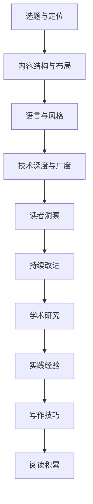

                 

# 技术写作：从博客到专栏作家之路

> 关键词：技术写作,博客,专栏作家,内容创作,深度思考,学术研究,实践经验,写作技巧,阅读积累

## 1. 背景介绍

### 1.1 问题由来
在当今信息技术高速发展的时代，技术写作已经成为了一门不可或缺的技艺。从博客、技术文档、学术论文到开源项目文档，技术写作无处不在。而从博闻到专栏作家的进阶，更是许多IT技术从业者梦寐以求的成长路径。但如何从技术水平到写作技巧，从零到一撰写出高质量的技术文章，对于许多技术人员来说，仍然是一个不小的挑战。

### 1.2 问题核心关键点
本文旨在探讨技术写作的技巧，从博客到专栏作家的成长之路。我们将围绕以下几个核心关键点展开讨论：
- **选题与定位**：如何选取有价值的技术主题，并明确写作目标。
- **内容结构与布局**：如何组织文章内容，使其逻辑清晰、易于理解。
- **语言与风格**：如何运用准确、精炼的语言，塑造独特的写作风格。
- **技术深度与广度**：如何在技术文章中平衡深度与广度，既不浅尝辄止，也不过于晦涩难懂。
- **读者洞察**：如何理解并满足目标读者的需求和兴趣。
- **持续改进**：如何通过不断学习和实践，提升自己的技术写作水平。

## 2. 核心概念与联系

### 2.1 核心概念概述

在进行技术写作的探索时，有几个关键概念是绕不开的：

- **技术博客**：一种以技术分享为主，内容丰富的在线文章形式，通常通过个人网站或第三方平台发布。
- **专栏作家**：在某个领域内具有一定权威性的撰稿人，定期为专业杂志、网站等媒体撰写深度文章。
- **技术写作**：将专业知识转化为易于理解、可传播的文本形式，是一种跨学科的综合技能。
- **内容创作**：涉及选题、策划、写作、编辑、推广等多个环节，旨在吸引并留住读者。
- **深度思考**：不仅停留在技术表层，还要深入挖掘问题本质，提出新颖的见解和解决方案。
- **学术研究**：在写作前需要查阅大量的文献资料，确保所写内容的准确性和科学性。
- **实践经验**：通过实际工作中的积累和反思，提供实用、可操作的技术指导。
- **写作技巧**：包括语法、结构、风格、排版等方面的专业技巧，使文章具有高度可读性。
- **阅读积累**：广泛阅读各类技术文章，提升自我理解和表达能力。

这些概念之间的联系和互动关系，可以通过以下Mermaid流程图来展示：



这个流程图展示了技术写作过程中的几个关键步骤和环节，以及它们之间的相互关联和影响。通过理解并运用这些概念，我们可以更好地进行技术写作，实现从博客到专栏作家的转型。

## 3. 核心算法原理 & 具体操作步骤
### 3.1 算法原理概述

技术写作的过程，可以类比为一种算法，旨在将复杂的知识体系转化为易于理解和传播的文字形式。其核心原理可以概括为以下几个步骤：

1. **选题与定位**：选择具有实际价值和意义的技术主题，明确写作目标。
2. **内容结构与布局**：构建清晰的逻辑框架，合理组织文章内容。
3. **语言与风格**：使用简洁、准确的语言，塑造独特的写作风格。
4. **技术深度与广度**：平衡技术内容的深度与广度，使读者既获得新知，又不感到困难。
5. **读者洞察**：深入理解目标读者的需求和兴趣，定制化内容。
6. **持续改进**：通过不断的学习和实践，提升写作技巧。

### 3.2 算法步骤详解

**Step 1: 选题与定位**

1. **确定主题**：选择与个人专业领域或兴趣相关的技术主题，确保文章具有实际应用价值和创新性。
2. **市场调研**：调研目标读者的需求和兴趣，确保选题具有市场吸引力。
3. **设定目标**：明确文章的写作目标，是技术分享、教程指南，还是深度分析。

**Step 2: 内容结构与布局**

1. **标题与引言**：撰写吸引人的标题，并在开头简要介绍文章的核心内容和目的。
2. **目录与章节**：设置清晰的目录结构，每个章节要有明确的主题和目的。
3. **内容组织**：按逻辑顺序组织文章内容，避免信息冗余，确保逻辑连贯。
4. **案例分析**：通过具体案例或实例，使读者更易于理解和应用文章内容。

**Step 3: 语言与风格**

1. **精炼语言**：使用简明扼要的语言，避免冗长的描述和复杂的术语。
2. **准确表达**：确保技术术语和概念的准确性，避免误导读者。
3. **风格统一**：保持全文风格一致，形成独特的写作风格。
4. **视觉辅助**：合理使用图表、代码段等视觉元素，增强文章的可读性。

**Step 4: 技术深度与广度**

1. **深度讲解**：在核心技术点处提供深度讲解，帮助读者理解技术原理。
2. **实例应用**：通过具体实例，展示技术在实际场景中的应用。
3. **对比分析**：对比不同方案的优劣，提供多角度的视角。
4. **实战案例**：提供详细的实践步骤和代码示例，使读者能够动手实践。

**Step 5: 读者洞察**

1. **了解读者**：通过调查问卷、用户反馈等方式，了解读者的背景和需求。
2. **定制化内容**：根据读者需求，调整文章内容，确保其相关性和实用性。
3. **互动交流**：鼓励读者提问和评论，建立良好的互动关系。

**Step 6: 持续改进**

1. **自我反思**：定期回顾并分析已发表的文章，总结经验教训。
2. **学习借鉴**：广泛阅读其他技术写作作品，吸收其优点。
3. **技能提升**：参加写作培训、阅读写作书籍等，提升写作技能。
4. **实践积累**：不断实践和尝试，积累丰富的写作经验。

### 3.3 算法优缺点

技术写作作为一种算法，既有其优势，也存在一定的局限性。

**优点**：
1. **信息传播**：通过文章形式，能够大规模、快速传播技术知识和经验。
2. **知识积累**：文章可长期保存和查阅，便于知识的积累和传承。
3. **交流互动**：通过读者评论和互动，实现知识共享和经验交流。
4. **自我提升**：写作过程本身也是学习和提升的过程，有助于深化对技术问题的理解。

**缺点**：
1. **理解难度**：技术文章可能过于专业，难以被普通读者理解。
2. **内容更新**：技术快速发展，文章内容需要及时更新，保持时效性。
3. **时间投入**：写作和发布文章需要大量的时间和精力投入。
4. **语言表达**：技术写作需要高水平的语言表达能力，对于初学者来说是一个挑战。

### 3.4 算法应用领域

技术写作的应用领域非常广泛，几乎涵盖了IT领域的各个方面。以下是几个典型的应用场景：

- **技术博客**：个人或企业通过博客平台分享技术经验、项目实践、学习心得等。
- **技术文档**：软件公司发布的产品文档、API文档、使用指南等。
- **技术文章**：科技媒体发表的技术新闻、深度分析、趋势预测等。
- **开源项目**：在GitHub等开源平台发布的技术教程、代码示例、项目指南等。
- **学术研究**：学术论文、研究报告、技术白皮书等。

## 4. 数学模型和公式 & 详细讲解 & 举例说明（备注：数学公式请使用latex格式，latex嵌入文中独立段落使用 $$，段落内使用 $)
### 4.1 数学模型构建

技术写作的数学模型构建，主要围绕以下几个关键要素：

- **选题与定位**：$选题 = 主题 \times 市场调研 \times 目标设定$
- **内容结构与布局**：$内容结构 = 标题 + 引言 + 目录 + 章节$
- **语言与风格**：$语言 = 精炼语言 + 准确表达 + 风格统一$
- **技术深度与广度**：$技术深度 = 深度讲解 + 实例应用 + 对比分析 + 实战案例$
- **读者洞察**：$读者洞察 = 了解读者 + 定制化内容 + 互动交流$
- **持续改进**：$持续改进 = 自我反思 + 学习借鉴 + 技能提升 + 实践积累$

### 4.2 公式推导过程

以一篇关于机器学习算法调优的技术文章为例，其公式推导过程如下：

假设我们要对比两种不同的机器学习算法（算法A和算法B）在特定数据集上的性能，我们需要：

1. **收集数据**：获取两个算法在不同数据集上的表现数据。
2. **计算指标**：计算算法A和算法B在各个指标（如准确率、召回率、F1分数等）上的值。
3. **对比分析**：对比两种算法在各个指标上的优劣，并给出结论。

以准确率为例，算法A和算法B在数据集X上的准确率分别为P_A和P_B，则推导过程如下：

$$
P_A = \frac{TP_A}{TP_A + FP_A}
$$

$$
P_B = \frac{TP_B}{TP_B + FP_B}
$$

其中，TP_A和TP_B为真阳性数，FP_A和FP_B为假阳性数。

通过计算不同数据集上的准确率，可以得出两种算法在不同数据集上的表现差异。

### 4.3 案例分析与讲解

**案例一：深度学习框架TensorFlow入门教程**

1. **选题与定位**：深度学习框架TensorFlow的入门教程，面向有一定编程基础的读者，旨在介绍TensorFlow的基本用法和应用场景。
2. **内容结构与布局**：
   - 引言：简要介绍深度学习的重要性及其在实际应用中的作用。
   - 目录：分为安装配置、基本操作、高级技巧三部分。
   - 章节：
     - 安装配置：详细介绍TensorFlow的安装步骤和配置方法。
     - 基本操作：展示TensorFlow的基本用法，如张量操作、变量管理等。
     - 高级技巧：介绍TensorFlow的高级功能，如自定义层、优化器、训练技巧等。
3. **语言与风格**：使用简洁、准确的语言，避免复杂的术语，同时保持风格一致。
4. **技术深度与广度**：通过具体案例展示TensorFlow在实际项目中的应用，帮助读者理解其应用场景。
5. **读者洞察**：通过调查问卷了解读者的背景和需求，调整文章内容以更好地满足读者需求。
6. **持续改进**：根据读者反馈不断更新文章，保持其时效性和实用性。

**案例二：大数据平台Hadoop集群搭建指南**

1. **选题与定位**：大数据平台Hadoop集群搭建的详细指南，面向希望搭建自己的Hadoop集群的技术人员，旨在帮助他们快速搭建和运行Hadoop集群。
2. **内容结构与布局**：
   - 引言：介绍大数据平台的重要性及其在企业中的应用。
   - 目录：分为硬件配置、软件安装、集群部署三部分。
   - 章节：
     - 硬件配置：详细介绍集群所需的硬件配置和选型建议。
     - 软件安装：介绍Hadoop各组件的安装步骤和注意事项。
     - 集群部署：展示如何配置Hadoop集群，并进行负载均衡和优化配置。
3. **语言与风格**：使用详细、具体的语言，避免过于抽象的概念，同时保持语言的一致性。
4. **技术深度与广度**：通过具体实例展示Hadoop集群的搭建和优化，帮助读者理解其复杂性和关键点。
5. **读者洞察**：通过调查问卷和用户反馈了解读者的需求和疑问，调整文章内容以更好地满足读者需求。
6. **持续改进**：根据读者反馈不断更新文章，保持其时效性和实用性。

## 5. 项目实践：代码实例和详细解释说明
### 5.1 开发环境搭建

要进行技术写作的项目实践，首先需要搭建一个适合的技术写作环境。以下是一个典型的开发环境配置流程：

1. **安装开发工具**：
   - **文本编辑器**：如Visual Studio Code、Sublime Text等。
   - **版本控制工具**：如Git、SVN等。
   - **文档生成工具**：如Markdown、LaTeX等。
   - **在线发布工具**：如GitHub Pages、博客平台等。

2. **环境配置**：
   - **代码版本控制**：创建一个新的Git仓库，并上传已有的代码。
   - **Markdown文件格式**：使用Markdown格式编写技术文章，支持多级标题、列表、代码块等。
   - **LaTeX文档生成**：将Markdown文件转换为LaTeX格式，使用LaTeX编辑器进行排版和格式调整。
   - **在线发布**：将LaTeX生成的PDF文件上传到GitHub Pages或博客平台，进行在线发布。

### 5.2 源代码详细实现

以下是一个简单的技术文章Markdown格式示例，展示如何进行技术写作的代码实现：

```markdown
# 深度学习框架TensorFlow入门教程

## 引言

深度学习是当前人工智能领域的一个重要分支，广泛应用于图像识别、自然语言处理、语音识别等场景。其中，TensorFlow作为最流行的深度学习框架之一，因其灵活性和易用性，成为许多研究人员和开发者的首选。

## 目录

1. [安装配置](#安装配置)
2. [基本操作](#基本操作)
3. [高级技巧](#高级技巧)

## 安装配置

### 安装步骤

1. 下载TensorFlow安装包
2. 解压安装包
3. 配置环境变量
4. 安装依赖库

### 配置方法

- **环境变量**：设置$TF_CPP_MIN_LOG_LEVEL=0，以显示TensorFlow运行时的详细信息。
- **依赖库**：安装NumPy、Pillow等依赖库，确保TensorFlow能够正常运行。

## 基本操作

### 张量操作

TensorFlow的核心概念之一是张量(Tensor)，它是多维数组的表示形式。通过定义和操作张量，可以进行各种深度学习任务。

```python
import tensorflow as tf

# 定义一个1x3x4的张量
tensor = tf.constant([[0.1, 0.2, 0.3, 0.4]])
```

### 变量管理

TensorFlow中的变量(Variable)用于存储模型参数，通过定义和更新变量，可以训练深度学习模型。

```python
# 定义一个变量
v = tf.Variable(tf.zeros([2, 2]))

# 更新变量
v.assign(tf.constant([[1.0, 1.0], [1.0, 1.0]]))
```

## 高级技巧

### 自定义层

TensorFlow允许用户自定义层，通过继承`tf.keras.layers.Layer`类，可以创建自定义层，实现特定的深度学习功能。

```python
class MyLayer(tf.keras.layers.Layer):
    def __init__(self, units):
        super(MyLayer, self).__init__()
        self.units = units

    def call(self, inputs):
        return inputs * self.units
```

### 优化器

TensorFlow提供了多种优化器，如Adam、SGD等，用于训练深度学习模型。通过选择合适的优化器，可以提高训练效率和模型性能。

```python
optimizer = tf.keras.optimizers.Adam(learning_rate=0.001)
```

## 结语

本文简要介绍了TensorFlow的基本用法和应用场景，并通过实例演示了TensorFlow的安装配置、基本操作和高级技巧。通过学习和实践，相信读者能够快速上手TensorFlow，进行深度学习开发和研究。

---

作者：禅与计算机程序设计艺术 / Zen and the Art of Computer Programming
```

### 5.3 代码解读与分析

在这个简单的技术文章Markdown格式示例中，我们通过代码演示了TensorFlow的基本用法，包括张量操作、变量管理、自定义层和优化器。以下是对代码的详细解读：

1. **安装配置**：通过具体步骤介绍如何安装和配置TensorFlow，使读者能够顺利上手。
2. **基本操作**：通过代码演示TensorFlow的基本用法，帮助读者理解其核心概念。
3. **高级技巧**：展示TensorFlow的高级功能，如自定义层和优化器，使读者能够深入了解其灵活性。

通过这些代码示例，读者可以直观地理解TensorFlow的使用方法，并进一步探索其高级特性。

### 5.4 运行结果展示

运行上述代码示例，会生成一篇包含三个部分的TensorFlow入门教程，具体内容包括安装配置、基本操作和高级技巧。读者可以通过阅读这篇文章，快速掌握TensorFlow的基本用法和应用场景。

## 6. 实际应用场景
### 6.1 技术博客

技术博客是许多IT从业者展示自己技术水平和分享经验的平台。通过撰写高质量的技术文章，博客作者可以吸引更多的读者，建立起专业声誉，甚至成为技术领域的专栏作家。

例如，GitHub上的[Git发展之路](https://github.com/blog)，由Git项目的贡献者撰写，展示了Git的发展历程、使用技巧和未来规划，深受读者欢迎。

### 6.2 技术文档

技术文档是软件开发中不可或缺的一部分，帮助用户理解和应用软件。通过精心编写的技术文档，企业可以提高用户满意度，提升品牌形象。

Google的[Google Cloud平台文档](https://cloud.google.com/docs)，详细介绍了Google Cloud的各种服务和工具，包括计算、存储、网络等，是Google Cloud用户的重要参考。

### 6.3 技术文章

技术文章通常发布在科技媒体或学术期刊上，具有较高的权威性和可读性。通过撰写高质量的技术文章，作者可以在技术界获得认可，甚至在学术界取得重要成果。

IEEE的[Computer](https://computer.ieee.org/)杂志，每月发布多篇高质量的技术文章，涵盖了最新的科技趋势、研究进展和应用实践。

### 6.4 未来应用展望

随着技术写作的不断发展，未来将在以下几个方面取得新的突破：

1. **自动化工具**：开发更智能的技术写作工具，如自动化内容生成、文本校对等，提高写作效率。
2. **交互式文档**：利用Web技术，实现动态生成和互动展示，增强文章的互动性和可读性。
3. **数据驱动写作**：利用大数据技术，分析读者行为，定制化推荐和撰写内容，提升文章的市场吸引力。
4. **跨媒体内容**：将文本、图像、视频等多种媒体形式融合，创造出更多样化的技术写作形式。
5. **社区化写作**：通过社区协作，形成内容创作和知识分享的良性循环，提升写作质量和传播效果。

这些技术创新将进一步推动技术写作的发展，使得技术文章更具吸引力和影响力。

## 7. 工具和资源推荐
### 7.1 学习资源推荐

要成为一名优秀的技术写作者，需要不断学习和积累。以下是一些值得推荐的资源：

1. **《Effective Technical Writing》书籍**：介绍了技术写作的基本原则和技巧，适合初学者阅读。
2. **Coursera的《技术写作与沟通》课程**：涵盖技术写作的各个方面，包括选题、策划、撰写、编辑等。
3. **IEEE的《技术写作与编辑》期刊**：包含最新的技术写作研究成果和实践经验，适合深入学习。
4. **GitHub的开发者文档**：展示了许多优秀的技术文档案例，值得学习和借鉴。
5. **知乎的开发者专栏**：汇集了许多IT从业者的技术分享，内容丰富多样。

通过阅读和学习这些资源，可以系统地提升自己的技术写作水平。

### 7.2 开发工具推荐

技术写作离不开工具的支持，以下是一些常用的开发工具：

1. **Visual Studio Code**：一款功能强大的文本编辑器，支持多种编程语言和技术文档的编辑。
2. **GitHub Pages**：一个免费的静态网站托管服务，可以将Markdown文件转换为HTML页面进行在线发布。
3. **Markdown编辑器**：如Typora、MkDocs等，支持Markdown格式编辑，方便生成文档。
4. **LaTeX编辑器**：如Overleaf、TeXstudio等，支持LaTeX格式的排版和格式调整。
5. **在线协作平台**：如Notion、Confluence等，支持多人协作编写和发布技术文章。

这些工具可以帮助开发者高效地进行技术写作，提升写作质量和效率。

### 7.3 相关论文推荐

技术写作的研究也在不断进步，以下是一些前沿的论文推荐：

1. **"Technical Writing in the Digital Age"**：探讨了数字时代技术写作的变化和趋势，强调了技术文章的多样化和互动性。
2. **"Deep Learning for Technical Writing"**：研究了利用深度学习技术进行技术文章生成的方法，提升了写作的自动化和智能化水平。
3. **"Enhancing Technical Writing with Natural Language Processing"**：介绍了如何利用自然语言处理技术改进技术写作，如文本校对、情感分析等。
4. **"Towards a Generalized Framework for Technical Writing"**：提出了一种通用的技术写作框架，适用于不同的技术领域和应用场景。

这些论文展示了技术写作领域的最新研究和实践，值得深入阅读和研究。

## 8. 总结：未来发展趋势与挑战
### 8.1 总结

本文对技术写作的流程和方法进行了详细阐述，帮助读者从博客到专栏作家，系统掌握了技术写作的技巧和方法。通过对选题与定位、内容结构与布局、语言与风格、技术深度与广度、读者洞察、持续改进等核心概念的理解和应用，读者可以写出高质量的技术文章，提升自身在技术领域的知名度和影响力。

### 8.2 未来发展趋势

技术写作的未来趋势如下：

1. **自动化**：自动化工具将进一步普及，帮助技术作者提高写作效率，降低工作量。
2. **互动化**：通过交互式文档和社区协作，增强技术文章的互动性和可读性。
3. **数据化**：利用大数据技术，分析和定制化推荐内容，提升文章的市场吸引力。
4. **跨媒体**：融合多种媒体形式，创造出更多样化的技术写作形式。
5. **社区化**：通过社区协作，形成内容创作和知识分享的良性循环，提升写作质量和传播效果。

这些趋势将推动技术写作的发展，使得技术文章更具吸引力和影响力。

### 8.3 面临的挑战

尽管技术写作的前景广阔，但也面临一些挑战：

1. **内容质量**：如何保证技术文章的内容质量，避免误导读者。
2. **市场竞争**：如何在激烈的竞争中脱颖而出，建立自己的品牌和影响力。
3. **技术更新**：如何保持文章的时效性，跟上技术发展的步伐。
4. **读者互动**：如何激发读者的互动和反馈，提升文章的价值。
5. **版权问题**：如何处理版权问题，保护原创内容。

这些挑战需要通过不断创新和实践，逐步克服和解决。

### 8.4 研究展望

未来，技术写作的研究方向包括：

1. **自动化生成**：研究如何利用AI技术自动化生成高质量的技术文章，减少人力成本。
2. **内容推荐**：研究如何通过算法推荐，为读者提供个性化的技术文章。
3. **交互式文档**：研究如何利用Web技术，实现动态生成和互动展示，增强文章的互动性和可读性。
4. **数据驱动写作**：研究如何利用大数据技术，分析和定制化推荐内容，提升文章的市场吸引力。
5. **跨媒体内容**：研究如何融合多种媒体形式，创造出更多样化的技术写作形式。
6. **社区化写作**：研究如何通过社区协作，形成内容创作和知识分享的良性循环，提升写作质量和传播效果。

这些研究方向将进一步推动技术写作的发展，使得技术文章更具吸引力和影响力。

## 9. 附录：常见问题与解答

**Q1：如何提高技术写作的质量？**

A: 提高技术写作的质量需要从多个方面入手：
1. **选题与定位**：选择有实际价值和意义的技术主题，明确写作目标。
2. **内容结构与布局**：构建清晰的逻辑框架，合理组织文章内容。
3. **语言与风格**：使用简洁、准确的语言，塑造独特的写作风格。
4. **技术深度与广度**：平衡技术内容的深度与广度，使读者既获得新知，又不感到困难。
5. **读者洞察**：深入理解目标读者的需求和兴趣，定制化内容。
6. **持续改进**：通过不断的学习和实践，提升写作技巧。

**Q2：技术文章如何吸引读者？**

A: 技术文章吸引读者的关键在于：
1. **选题吸引**：选择与读者兴趣相关的主题，引起读者的兴趣。
2. **内容实用**：提供实用的技术指导和解决方案，解决读者的实际问题。
3. **案例丰富**：通过具体的案例和实例，使读者更容易理解和应用文章内容。
4. **互动交流**：鼓励读者提问和评论，建立良好的互动关系。
5. **视觉辅助**：合理使用图表、代码段等视觉元素，增强文章的可读性。

**Q3：如何保持技术文章的时效性？**

A: 保持技术文章的时效性需要：
1. **持续学习**：保持对新技术和趋势的关注，及时更新文章内容。
2. **动态发布**：利用Web技术实现动态生成和更新，确保内容的时效性。
3. **读者反馈**：通过读者反馈，及时发现和解决问题，更新文章内容。
4. **定期更新**：定期检查和更新文章，保持其时效性和实用性。

通过不断学习和实践，相信你一定能够写出高质量的技术文章，实现从技术博客到专栏作家的成长之路。

---

作者：禅与计算机程序设计艺术 / Zen and the Art of Computer Programming

