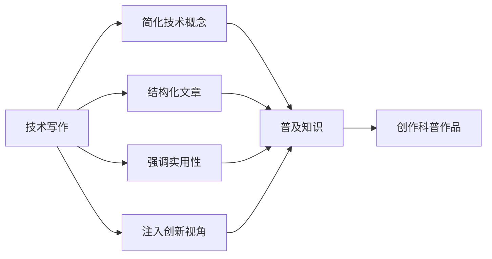

                 

# 技术写作：从技术博客到畅销科普作家之路

> 关键词：技术写作,科普作家,深度思考,技术传播,写作技巧,内容创作

## 1. 背景介绍

### 1.1 问题由来
随着科技的迅猛发展，各类新兴技术层出不穷。技术爱好者、从业者和企业高管等群体亟需获取和理解这些前沿技术，以保持行业竞争力。然而，许多技术论文和专业书籍因过于深奥，导致普通读者难以消化。这种信息鸿沟呼唤一种更加通俗易懂、易于传播的技术写作方式，使更多人能从中获益。

### 1.2 问题核心关键点
技术写作并非简单地将技术内容翻译成普通语言，而是一门科学和艺术相结合的学科。其核心关键点在于：

- **易懂性**：将复杂技术语言简化，使技术知识易于被大众理解。
- **结构性**：组织清晰的文章结构，帮助读者逐层理解。
- **实用性**：强调技术内容的应用场景和实际价值。
- **创新性**：结合前沿技术研究和实际应用案例，提供新颖视角。

### 1.3 问题研究意义
优秀的技术写作能够将复杂的理论和技术转化为生动有趣的内容，促进技术的普及和应用。具体意义如下：

- **知识普及**：使更多人了解并掌握新兴技术，提升社会整体技术水平。
- **应用加速**：技术知识通过普及化加速落地应用，推动行业进步。
- **教育赋能**：为教育机构提供有价值的教学资源，促进知识的传承和创新。
- **企业竞争力**：帮助企业通过技术传播提升品牌影响力，吸引人才和客户。

## 2. 核心概念与联系

### 2.1 核心概念概述

技术写作与科普写作相辅相成，均旨在传递复杂信息。为了更好地理解两者的联系，我们将简要介绍几个核心概念：

- **技术写作（Technical Writing）**：以清晰的语言和逻辑结构，向非技术背景的读者传达技术信息和知识。
- **科普写作（Popular Science Writing）**：将科学发现和技术成果以浅显易懂的形式，介绍给更广泛的公众。
- **技术传播（Technology Communication）**：通过写作、演讲、视频等多种媒介，将技术知识普及化，促进技术的社会化应用。

技术写作与科普写作虽有区别，但本质上都是通过传达知识来服务社会。本文将探索两者的交集，揭示如何将复杂的技术内容转化为易于传播、富有教育意义的文章。

### 2.2 核心概念原理和架构的 Mermaid 流程图(Mermaid 流程节点中不要有括号、逗号等特殊字符)



### 2.3 核心概念之间的联系

技术写作和科普写作都是技术传播的重要组成部分。两者之间通过以下方式紧密联系：

- **双向转化**：技术写作通过简化和组织，转化为更易于传播的科普内容。科普写作在普及科学知识的同时，也传递了技术的应用背景。
- **共同目标**：无论技术写作还是科普写作，都是为了更好地服务于公众，推动知识的传播和应用。
- **工具和方法**：两者都需要使用广泛的传播工具和方法，如逻辑结构图、故事讲述、数据可视化等。

## 3. 核心算法原理 & 具体操作步骤
### 3.1 算法原理概述

技术写作和科普写作的共同基础在于将复杂信息转化为易于理解的形式。其核心算法原理包括以下几个步骤：

1. **需求分析**：明确目标受众的需求和背景，确定写作的深度和广度。
2. **内容组织**：将技术内容结构化，分层次地组织文章，确保逻辑清晰。
3. **语言简化**：采用易懂的语言，减少专业术语的使用，增强文章的可读性。
4. **互动设计**：结合图表、案例、访谈等多种形式，增加文章的互动性。
5. **传播优化**：选择适合的传播渠道，优化文章形式，提高传播效果。

### 3.2 算法步骤详解

以下是详细的操作步骤，涵盖技术写作的各个环节：

**Step 1: 需求分析**
- **受众分析**：确定目标读者的背景知识水平、兴趣点和需求。
- **写作目标**：明确写作的主要目的和期望达成的效果。
- **信息搜集**：收集相关的技术文献、研究报告、产品文档等，以提供充分的依据。

**Step 2: 内容组织**
- **标题构思**：根据受众需求和写作目标，设计引人入胜的标题。
- **结构布局**：分章分节地安排内容，确保信息结构化。
- **层次分明**：按照逻辑顺序，逐步展开技术内容，引导读者逐步深入。

**Step 3: 语言简化**
- **常用词汇**：尽量使用通俗易懂的词汇，避免技术术语的堆砌。
- **类比比喻**：通过类比和比喻，将复杂概念转化为直观易懂的形式。
- **故事叙事**：以故事或案例为载体，使技术内容更具吸引力。

**Step 4: 互动设计**
- **视觉元素**：适当插入图表、示意图和流程图，增强文章的可视性。
- **互动环节**：加入Q&A、讨论区、视频等互动形式，提升读者参与感。
- **案例展示**：通过实际案例展示技术的应用场景，增加可信度。

**Step 5: 传播优化**
- **渠道选择**：根据受众特点选择合适的传播渠道，如网站、社交媒体、视频平台等。
- **形式适配**：根据不同媒介特性，调整文章形式，如长文、短文、视频脚本等。
- **推广策略**：制定有效的推广策略，增加文章的曝光率和阅读量。

### 3.3 算法优缺点

技术写作和科普写作的共同优势在于易于理解、实用性强，但缺点也同样明显：

- **深度有限**：相较于专业论文，科普文章通常缺乏技术细节和深入的探讨。
- **可能失真**：在简化和通俗化的过程中，部分技术细节可能被忽略或误解。
- **多样性不足**：通用的传播方式可能难以覆盖所有受众的需求和兴趣。

### 3.4 算法应用领域

技术写作和科普写作在各个领域都有广泛应用，如：

- **技术博客和教程**：帮助从业者快速了解新技术、新工具的使用方法。
- **企业培训和手册**：为企业员工提供详细的技术指导和操作步骤。
- **科学普及读物**：向公众普及科技知识，提升公众科学素养。
- **技术讲座和报告**：通过演讲和报告，将复杂技术传达给听众。

## 4. 数学模型和公式 & 详细讲解 & 举例说明

### 4.1 数学模型构建

假设有一项新兴技术X，其核心算法为Y，需要将其技术内容转化为易于传播的文章Z。

- **模型输入**：技术内容X和技术受众特征Y。
- **模型输出**：简化和组织后的文章Z。

### 4.2 公式推导过程

根据上述模型，推导出简化技术内容的数学公式如下：

$$ Z = f(X, Y) = (\text{标题优化}, \text{内容结构化}, \text{语言简化}, \text{互动设计}, \text{传播优化}) $$

### 4.3 案例分析与讲解

**案例1：机器学习入门教程**

- **原始技术内容**：机器学习算法的原理和应用。
- **简化和组织后的教程**：从基础概念到实际应用，逐步深入讲解，辅以案例和互动问答。

**案例2：人工智能普及读物**

- **原始技术内容**：人工智能的理论基础和技术发展。
- **简化和组织后的读物**：通过故事和案例，生动介绍AI对社会的影响和未来前景。

## 5. 项目实践：代码实例和详细解释说明

### 5.1 开发环境搭建

为了撰写技术写作和科普作品，需要搭建一个高效的开发环境。以下是搭建步骤：

**Step 1: 安装开发环境**
- **文本编辑器**：如VSCode、Atom等，支持代码高亮和自动补全。
- **Markdown编辑器**：如Typora、Github Pages等，支持Markdown格式的文章编辑。
- **版本控制系统**：如Git，方便版本管理和协作。

**Step 2: 选择工具和资源**
- **参考资料**：收集技术文档、研究报告、公开课程等，作为写作的依据。
- **绘图工具**：如GIMP、Adobe Illustrator，用于制作图表和示意图。
- **引用管理**：如Zotero、EndNote等，用于管理和引用文献。

### 5.2 源代码详细实现

以下是一个简化的技术写作流程的伪代码实现：

```python
def technical_writing(X, Y):
    title = optimize_title(X)  # 优化标题
    structure = organize_content(X)  # 组织内容
    simplified_language = simplify_language(X, Y)  # 简化语言
    interactivity = add_interactivity(structure)  # 增加互动
    optimized_spread = optimize_spread(interactivity)  # 优化传播
    Z = combine(title, structure, simplified_language, interactivity, optimized_spread)
    return Z

# 优化标题
def optimize_title(X):
    # 根据受众需求和写作目标设计吸引人的标题
    pass

# 组织内容
def organize_content(X):
    # 分章分节地安排内容，确保逻辑清晰
    pass

# 简化语言
def simplify_language(X, Y):
    # 采用易懂的语言，减少专业术语的使用
    pass

# 增加互动
def add_interactivity(X):
    # 插入图表、案例等互动元素
    pass

# 优化传播
def optimize_spread(X):
    # 选择适合的传播渠道和形式
    pass

# 组合输出
def combine(X):
    # 将各部分组合成最终文章
    pass
```

### 5.3 代码解读与分析

- **title优化**：根据受众需求和写作目标设计标题，如“五分钟看懂机器学习”。
- **内容组织**：分章分节地安排内容，确保逻辑清晰，如“基础概念”、“实际应用”等。
- **语言简化**：采用易懂的语言，减少专业术语的使用，如“分类算法是一种将数据分为不同类别的技术”。
- **互动设计**：插入图表、案例等互动元素，增加文章的可视性和互动性，如展示分类算法的示意图。
- **传播优化**：选择适合的传播渠道和形式，如网站、博客、视频等。

### 5.4 运行结果展示

假设最终输出的文章Z为“机器学习入门教程”，展示如下：

---

# 机器学习入门教程

## 基础概念

机器学习是一种让计算机通过数据学习和改进的技术。其主要目标是使计算机系统能够自动执行特定任务，而无需明确编程。

## 实际应用

机器学习在多个领域都有广泛应用，包括图像识别、语音识别、自然语言处理等。

## 互动问答

**Q1: 什么是监督学习？**
- **A**: 监督学习是一种机器学习算法，通过带有标签的数据训练模型，从而能够预测新数据点的标签。

---

## 6. 实际应用场景

### 6.1 技术博客

技术博客是技术写作的重要形式之一，主要用于分享和传播技术知识。优秀技术博客的特点包括：

- **专业性**：提供深入的技术分析和讨论。
- **互动性**：读者可以通过评论和讨论参与内容创作。
- **可视化**：使用图表、代码片段等增强文章的直观性。

### 6.2 科普读物

科普读物旨在将高深的科学原理和技术应用转化为易于理解的内容，普及科学知识。优秀科普读物的特点包括：

- **通俗易懂**：避免专业术语，使用通俗语言。
- **故事性强**：通过案例和故事，使内容更有吸引力。
- **视觉丰富**：使用插图、漫画等增强文章的趣味性。

### 6.3 企业培训

企业培训手册和技术教程是技术写作的重要应用场景，主要用于指导员工学习和掌握技术。优秀培训手册的特点包括：

- **实用性**：提供具体的操作步骤和示例。
- **层次分明**：从基础到高级，逐步深入讲解。
- **互动环节**：设置问答和练习，增强学习效果。

## 7. 工具和资源推荐

### 7.1 学习资源推荐

- **在线课程**：如Coursera、edX等，提供系统化的技术学习路径。
- **技术文档**：如GitHub、Stack Overflow等，收集丰富的技术文档和社区讨论。
- **科普读物**：如《科学美国人》、《麻省理工科技评论》等，提供高质量的科普文章。

### 7.2 开发工具推荐

- **文本编辑器**：如VSCode、Atom，支持代码高亮和自动补全。
- **Markdown编辑器**：如Typora、Github Pages，支持Markdown格式的文章编辑。
- **绘图工具**：如GIMP、Adobe Illustrator，用于制作图表和示意图。

### 7.3 相关论文推荐

- **技术写作研究**：如《The History of Technical Writing》，了解技术写作的演变和应用。
- **科普写作指南**：如《The Art of Science Communication》，提供科普写作的技巧和方法。
- **教育传播研究**：如《Technology and Education: An Integrated Approach》，探讨技术传播在教育中的应用。

## 8. 总结：未来发展趋势与挑战

### 8.1 未来发展趋势

技术写作和科普写作的未来发展趋势包括：

- **跨学科融合**：结合更多学科的知识，提供更全面的技术理解。
- **多媒体融合**：结合文本、图片、视频等多种形式，增强内容的传播效果。
- **数据驱动**：使用大数据和人工智能技术，分析受众需求和传播效果。
- **社交媒体传播**：利用社交媒体的广泛覆盖，扩大技术知识的传播范围。

### 8.2 面临的挑战

技术写作和科普写作面临的挑战包括：

- **技术更新迅速**：新技术层出不穷，需要不断学习和更新内容。
- **受众多样性**：不同受众的知识背景和兴趣点各异，需要定制化内容。
- **内容真实性**：在简化和通俗化的过程中，可能存在信息失真和误解。
- **传播渠道多样化**：需要在不同渠道上适配内容形式，保持传播效果。

### 8.3 研究展望

未来的技术写作和科普写作研究可以从以下几个方面进行：

- **自动化工具**：开发更智能的写作辅助工具，提升写作效率和质量。
- **情感分析**：使用自然语言处理技术，分析受众的情感反应，优化内容策略。
- **交互式内容**：开发交互式内容，如在线课程和互动演示，增强学习体验。
- **跨语言传播**：研究不同语言文化的传播差异，实现跨语言的技术传播。

## 9. 附录：常见问题与解答

**Q1: 如何写一篇通俗易懂的技术博客？**

A: 写技术博客的关键在于简化复杂技术，使用通俗易懂的语言。可以使用故事讲述、比喻类比等方法，将技术内容生动呈现。同时，插入图表和示例代码，增强文章的直观性。

**Q2: 如何撰写高质量的科普读物？**

A: 撰写科普读物需要考虑受众的背景知识，使用通俗易懂的语言，避免过度专业化的内容。可以通过故事、案例等形式，使内容更有吸引力。同时，使用插图和漫画等视觉元素，增加文章的趣味性。

**Q3: 技术写作和科普写作的区别是什么？**

A: 技术写作更侧重于专业性和准确性，科普写作更侧重于通俗易懂和趣味性。技术写作通常需要更详细的技术背景和专业术语，而科普写作则更多地使用故事和案例来解释技术原理。

---

作者：禅与计算机程序设计艺术 / Zen and the Art of Computer Programming

