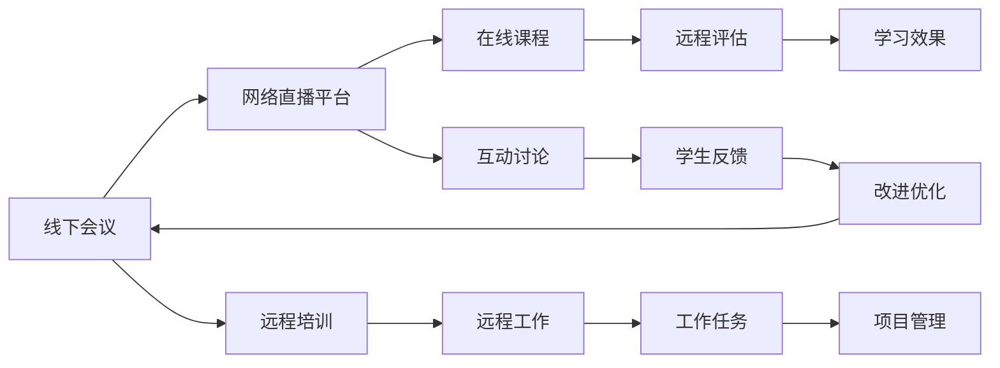

                 

# 技术分享：从线下会议到在线课程

> 关键词：在线教育,虚拟会议,远程培训,技术转型,远程工作

## 1. 背景介绍

随着技术的发展，线上线下的界限日渐模糊。传统的线下会议和在线课程在资源共享、知识传递、时间成本等方面的差异也逐步减少。疫情期间，线上学习、远程工作成为新的常态，激发了线上教育的浪潮。从线下到线上，技术成为连接师生的重要桥梁。本文旨在探讨从线下会议到在线课程的转变，分析其背后的技术原理、应用场景和未来发展趋势。

## 2. 核心概念与联系

### 2.1 核心概念概述

本文涉及的核心概念主要包括：
- **线下会议**：传统的线下会议，通过面对面的交流和互动，实现知识的传播和讨论。
- **在线课程**：通过互联网技术，将教学内容以视频、文本、互动等方式进行传播和讨论。
- **远程培训**：通过互联网平台，实现远程学习、远程工作，使教育与工作场景不再受地域限制。
- **技术转型**：从传统线下模式向线上模式的转变，包括技术架构、资源管理等方面的调整和优化。
- **远程工作**：员工通过网络手段，实现远程办公，完成工作任务和团队协作。

这些概念之间具有紧密的联系，随着互联网和信息技术的发展，传统线下会议逐步向线上课程转型，远程培训和远程工作模式得到普及，促进了教育与工作的现代化进程。

### 2.2 核心概念原理和架构的 Mermaid 流程图



该图展示了线下会议、在线课程、远程培训和远程工作之间的联系和转化路径，揭示了技术在其中的关键作用。

## 3. 核心算法原理 & 具体操作步骤

### 3.1 算法原理概述

从线下会议到在线课程的转变，本质上是一个技术驱动的过程。核心算法原理包括：

- **视频流传输算法**：通过视频编解码技术，实现高品质的视频流传输，保证在线课程的清晰度和流畅性。
- **互动技术**：利用WebSocket、WebRTC等技术，实现实时的双向互动，提升在线课程的参与度。
- **数据存储和处理**：通过云存储和分布式数据库技术，实现大规模数据的存储和管理，支撑在线课程的批量处理和个性化推荐。
- **虚拟现实和增强现实**：通过VR/AR技术，提升在线课程的沉浸式体验，增强远程培训和远程工作的临场感。
- **人工智能和机器学习**：利用AI和ML技术，实现自动化的课程评估、智能推荐和个性化学习路径设计。

这些核心算法共同支撑了从线下会议到在线课程的顺利转换，为远程教育和远程工作提供了坚实的技术基础。

### 3.2 算法步骤详解

#### 3.2.1 前期准备

- **选择合适的视频编码格式**：根据网络带宽和设备性能，选择合适的视频编码格式，如H.264、H.265等。
- **搭建网络直播平台**：使用开源或商业的网络直播平台，如OBS Studio、Zoom、腾讯课堂等，实现直播功能。
- **设计课程内容和结构**：根据课程目标，设计课程内容、章节、小节，以及互动环节等。

#### 3.2.2 实时互动

- **实时视频流传输**：通过CDN加速和边缘计算技术，保证视频流的实时传输和低延迟。
- **互动问答和讨论**：利用WebSocket技术，实现实时的问答和讨论，提升学生参与度和互动效果。
- **屏幕共享和文件传输**：通过屏幕共享和文件传输功能，增强教师和学生的互动效果。

#### 3.2.3 数据管理和个性化推荐

- **数据存储和处理**：使用云存储和分布式数据库技术，实现大规模数据的存储和管理。
- **个性化推荐**：利用机器学习算法，根据学生的学习行为和历史数据，进行个性化课程推荐。
- **学习效果评估**：通过数据分析和机器学习算法，评估学生的学习效果和课程满意度，进行改进优化。

#### 3.2.4 虚拟现实和增强现实

- **VR/AR教学环境**：通过VR/AR技术，创建虚拟和增强现实教学环境，增强学习体验。
- **模拟实验和实操训练**：利用VR/AR技术，进行模拟实验和实操训练，提升培训效果。

### 3.3 算法优缺点

#### 3.3.1 优点

- **资源共享**：线上课程可以打破时间和空间的限制，实现资源共享和知识传递。
- **成本低廉**：相较于线下会议，线上课程的组织和管理成本更低，更加环保和经济。
- **灵活便捷**：学生和员工可以随时参与课程和培训，不受地理位置限制。

#### 3.3.2 缺点

- **技术要求高**：线上课程和远程工作需要较高的技术门槛，需要设备和网络的支持。
- **互动效果有限**：线上课程的互动效果可能不如线下会议，缺乏面对面的情感交流。
- **数据隐私和安全**：数据传输和存储过程中，存在数据隐私和安全风险，需要加强防护。

### 3.4 算法应用领域

#### 3.4.1 教育领域

- **在线教育**：通过网络直播和互动技术，实现高质量的在线教育，覆盖更广泛的受众。
- **远程培训**：企业通过线上课程，实现远程培训和技能提升，提高员工素质和工作效率。
- **虚拟实验室**：利用VR/AR技术，构建虚拟实验室，进行实验教学和实操培训。

#### 3.4.2 工作领域

- **远程工作**：员工通过网络平台，实现远程办公，完成工作任务和团队协作。
- **项目管理**：利用在线课程和互动技术，进行远程项目管理，提升团队协作效率。
- **客户服务**：通过线上课程和虚拟现实技术，实现远程客户服务和培训，提升客户满意度。

## 4. 数学模型和公式 & 详细讲解 & 举例说明

### 4.1 数学模型构建

#### 4.1.1 视频流传输模型

视频流传输的核心是选择合适的编解码格式和网络协议，确保视频流的实时传输和低延迟。

- **编解码格式**：
  - H.264：适用于标清视频，具有较好的兼容性和稳定性。
  - H.265/HEVC：适用于高清视频，具有更高的压缩效率和更好的图像质量。
- **网络协议**：
  - RTMP：实时消息传输协议，适合视频流传输。
  - HLS：HTTP Live Streaming，适合流媒体的实时传输和缓存。

#### 4.1.2 互动技术模型

互动技术模型主要涉及WebSocket和WebRTC技术，实现实时的双向互动。

- **WebSocket**：基于TCP协议，支持全双工通信，适用于实时互动。
- **WebRTC**：Web实时通信，支持点对点视频、音频和数据传输，适用于实时沟通和协作。

### 4.2 公式推导过程

#### 4.2.1 视频流传输公式

视频流的传输速率和带宽相关，可以使用以下公式计算：

$$
传输速率 = \frac{视频流比特率}{网络带宽}
$$

其中，视频流比特率包括视频编码后的比特率、音频编码后的比特率、额外开销等。

#### 4.2.2 互动技术公式

WebSocket的通信模型如下：

1. **握手**：客户端和服务器进行WebSocket握手，建立连接。
2. **数据传输**：通过WebSocket通道，实现数据双向传输。
3. **断开连接**：当数据传输结束后，客户端和服务器断开连接。

### 4.3 案例分析与讲解

#### 4.3.1 在线课程案例

某在线教育平台使用H.265编解码格式和RTMP协议进行视频流传输，使用WebSocket技术实现互动。根据实际网络带宽和视频质量要求，平台计算了视频流的传输速率，确保了课程的流畅度和互动效果。

#### 4.3.2 远程培训案例

某企业使用WebRTC技术进行远程培训，通过屏幕共享和文件传输功能，提升了培训效果。同时，利用云存储和分布式数据库技术，实现了大规模数据的存储和管理，支撑了企业培训的高效运行。

## 5. 项目实践：代码实例和详细解释说明

### 5.1 开发环境搭建

#### 5.1.1 服务器环境

- **操作系统**：Linux或Windows Server，建议使用CentOS等开源系统。
- **网络配置**：配置网络防火墙，允许必要的端口开放。
- **视频编码器**：安装OpenCV、FFmpeg等开源视频编码工具，支持H.264、H.265编解码。

#### 5.1.2 开发环境

- **Python**：Python 3.x版本，建议使用Anaconda进行环境管理。
- **Web框架**：Flask或Django等Web框架，用于搭建网络直播平台。
- **WebSocket库**：WebSocket或websocket-client等库，用于实现实时互动。

### 5.2 源代码详细实现

#### 5.2.1 视频流传输实现

以下是一个简单的视频流传输示例，使用FFmpeg进行编解码，使用RTMP协议进行传输：

```python
import os
import subprocess

# 视频编解码命令
cmd = "ffmpeg -i input.mp4 -vcodec libx264 -ac copy -f flv output.flv"

# 执行命令
subprocess.call(cmd, shell=True)
```

#### 5.2.2 实时互动实现

以下是一个简单的WebSocket服务器和客户端示例，用于实现实时的问答和讨论：

```python
# WebSocket服务器
import websocket
import json

def on_message(ws, message):
    # 处理客户端发送的消息
    data = json.loads(message)
    # 处理并返回响应
    response = json.dumps({"status": "ok", "message": "Hello, World!"})
    ws.send(response)

# 创建WebSocket服务器
ws = websocket.WebSocketServer("localhost", 8000, on_message=on_message)
ws.serve_forever()

# WebSocket客户端
import websocket

# 创建WebSocket连接
ws = websocket.WebSocketApp("ws://localhost:8000", on_message=on_message)
ws.run_forever()
```

### 5.3 代码解读与分析

#### 5.3.1 视频流传输

视频流传输的核心是选择合适的编解码格式和网络协议。在实际应用中，需要根据网络带宽和设备性能进行调整，确保视频流的清晰度和流畅性。

#### 5.3.2 实时互动

WebSocket技术实现了实时的双向互动，特别适合在线课程和远程培训的实时沟通和协作。同时，WebRTC技术也提供了类似的功能，支持点对点的视频、音频和数据传输。

### 5.4 运行结果展示

#### 5.4.1 视频流传输

视频流传输结果包括视频文件的编解码、传输和播放。在实际应用中，可以通过调整编解码参数和网络带宽，优化视频流传输的性能和效果。

#### 5.4.2 实时互动

实时互动结果包括WebSocket服务器和客户端的交互过程，通过发送和接收消息，实现实时的问答和讨论。在实际应用中，可以扩展功能和应用场景，提升互动效果和用户满意度。

## 6. 实际应用场景

### 6.1 教育领域

#### 6.1.1 在线教育

在线教育平台通过网络直播和互动技术，实现了高质量的在线教育。平台采用H.264编解码格式和RTMP协议进行视频流传输，使用WebSocket技术实现实时的问答和讨论。通过云存储和分布式数据库技术，实现了大规模数据的存储和管理，支撑了在线课程的批量处理和个性化推荐。

#### 6.1.2 远程培训

企业通过在线课程，实现了远程培训和技能提升。企业使用WebRTC技术进行远程培训，通过屏幕共享和文件传输功能，提升了培训效果。同时，利用云存储和分布式数据库技术，实现了大规模数据的存储和管理，支撑了企业培训的高效运行。

### 6.2 工作领域

#### 6.2.1 远程工作

员工通过网络平台，实现远程办公，完成工作任务和团队协作。平台使用WebSocket技术实现实时的问答和讨论，提升了远程工作的沟通效率和团队协作效果。同时，利用云存储和分布式数据库技术，实现了大规模数据的存储和管理，支撑了远程工作的数据共享和协作。

#### 6.2.2 客户服务

通过在线课程和虚拟现实技术，实现了远程客户服务和培训，提升了客户满意度。客户服务使用WebSocket技术进行实时沟通，同时利用VR/AR技术，构建虚拟实验室，进行实验教学和实操培训，提升了服务效果和客户体验。

## 7. 工具和资源推荐

### 7.1 学习资源推荐

#### 7.1.1 在线教育平台

- **Coursera**：全球领先的在线教育平台，提供各类课程和证书。
- **edX**：麻省理工学院和哈佛大学联合创办的在线教育平台，涵盖广泛学科。
- **Udacity**：专注于技术和数据科学领域的在线教育平台。

#### 7.1.2 远程培训平台

- **Zoom**：全球领先的远程会议和培训平台，支持视频会议和互动功能。
- **Microsoft Teams**：微软推出的远程协作平台，支持视频会议、聊天和协作功能。
- **Slack**：协作工具，支持消息、文件和应用集成。

### 7.2 开发工具推荐

#### 7.2.1 视频流传输

- **OBS Studio**：开源视频直播软件，支持多种编解码格式和网络协议。
- **FFmpeg**：开源视频编解码工具，支持多种格式和协议转换。
- **RTMP Streaming Server**：支持RTMP协议的视频流服务器，方便远程直播和互动。

#### 7.2.2 实时互动

- **WebSocket**：支持WebSocket通信的库，实现实时的问答和讨论。
- **WebRTC**：支持WebRTC通信的库，实现点对点的视频、音频和数据传输。
- **Flask**：轻量级Web框架，方便搭建在线课程和远程培训平台。

### 7.3 相关论文推荐

#### 7.3.1 视频流传输

- "Real-Time Video Streaming with WebRTC" by Zhiqiang Xue, Hongxu Zhang, and Yue Qiu.
- "Efficient Video Streaming over HTTP Live Streaming" by Mohammad S. Khan.

#### 7.3.2 实时互动

- "WebRTC: End-to-End Video and Voice Streaming over Web" by Jonas Sjogren.
- "WebSocket: Comet-like Websocket Client in Go" by Yuji Yokomizo.

## 8. 总结：未来发展趋势与挑战

### 8.1 未来发展趋势

#### 8.1.1 数据驱动的个性化推荐

未来，在线课程和远程培训将更加注重个性化推荐，根据学生的学习行为和历史数据，推荐最适合的课程和培训内容。通过机器学习和人工智能技术，实现个性化学习路径设计，提升学习效果。

#### 8.1.2 虚拟现实和增强现实

VR/AR技术将进一步应用到远程教育和远程工作中，提升学习和培训的沉浸式体验。通过构建虚拟和增强现实环境，实现更真实的互动和协作。

#### 8.1.3 人工智能辅助教学

人工智能技术将广泛应用于在线教育和远程培训中，实现自动化的课程评估、智能推荐和个性化学习路径设计。通过自然语言处理和机器学习算法，提升教学效果和学生满意度。

### 8.2 面临的挑战

#### 8.2.1 技术普及和接受度

尽管在线教育和远程培训的技术已经较为成熟，但在实际应用中，仍面临一定的技术普及和接受度问题。需要加强技术推广和用户教育，提升用户的技术素养和接受度。

#### 8.2.2 数据隐私和安全

在线教育和远程培训涉及大量的数据传输和存储，存在数据隐私和安全风险。需要加强数据保护和隐私保护，确保数据的安全性和合规性。

#### 8.2.3 用户体验和互动效果

在线教育和远程培训需要注重用户体验和互动效果，提升用户的参与度和满意度。需要优化技术架构和应用设计，提升互动效果和用户满意度。

## 9. 附录：常见问题与解答

### 9.1 常见问题

#### 9.1.1 如何选择合适的视频编解码格式？

选择视频编解码格式时，需要考虑网络带宽和设备性能。一般而言，H.264适用于标清视频，H.265/HEVC适用于高清视频，可以根据实际情况进行调整。

#### 9.1.2 如何实现实时的问答和讨论？

实时问答和讨论可以通过WebSocket技术实现，利用WebSocket库进行双向通信，实现实时的消息传输和互动。

#### 9.1.3 如何处理大规模数据存储和管理？

大规模数据存储和管理可以使用云存储和分布式数据库技术，如AWS S3、Hadoop等，实现数据的分布式存储和高效管理。

### 9.2 解答

#### 9.2.1 如何选择合适的视频编解码格式？

选择视频编解码格式时，需要考虑网络带宽和设备性能。一般而言，H.264适用于标清视频，H.265/HEVC适用于高清视频，可以根据实际情况进行调整。

#### 9.2.2 如何实现实时的问答和讨论？

实时问答和讨论可以通过WebSocket技术实现，利用WebSocket库进行双向通信，实现实时的消息传输和互动。

#### 9.2.3 如何处理大规模数据存储和管理？

大规模数据存储和管理可以使用云存储和分布式数据库技术，如AWS S3、Hadoop等，实现数据的分布式存储和高效管理。

---

作者：禅与计算机程序设计艺术 / Zen and the Art of Computer Programming

