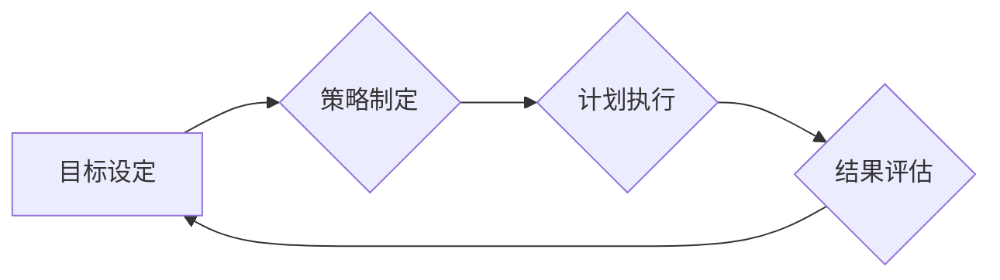

                 

## 深度思考:区分优秀管理者的标准

> 关键词：管理者、领导力、团队建设、沟通技巧、决策能力、战略思维、执行力

## 1. 背景介绍

在当今瞬息万变的科技时代，优秀的管理者显得尤为重要。他们不仅需要具备扎实的技术背景，更需要拥有敏锐的洞察力、卓越的领导力以及高效的执行力，才能带领团队在激烈的竞争中取得成功。然而，优秀的管理者并非一成不变的模板，他们的标准随着时代发展和行业变革而不断演变。本文将深入探讨优秀管理者的核心要素，并分析其在科技领域的具体表现。

## 2. 核心概念与联系

优秀的管理者是团队的领航者，他们需要清晰地洞察团队目标，并制定有效的策略和计划，引导团队朝着目标前进。

**核心概念：**

* **领导力:** 优秀的管理者具备强大的领导力，能够激励和鼓舞团队成员，激发他们的潜能，并让他们在共同目标下协同工作。
* **团队建设:** 优秀的管理者能够构建高效的团队，明确每个成员的角色和职责，并营造良好的团队氛围，促进团队成员之间的协作和沟通。
* **沟通技巧:** 优秀的管理者拥有优秀的沟通技巧，能够清晰地表达自己的想法，并有效地倾听团队成员的意见，建立良好的沟通渠道。
* **决策能力:** 优秀的管理者能够在复杂的环境下做出明智的决策，并能够有效地评估风险和机遇，引导团队做出正确的选择。
* **战略思维:** 优秀的管理者能够洞察市场趋势和行业发展，并制定长远的发展战略，带领团队抓住机遇，规避风险。
* **执行力:** 优秀的管理者能够将战略目标转化为具体的行动计划，并有效地监督和执行，确保团队能够按计划完成目标。

**Mermaid 流程图:**



## 3. 核心算法原理 & 具体操作步骤

优秀的管理者需要运用一系列的“算法”来处理各种复杂问题，并引导团队高效运作。

### 3.1  算法原理概述

优秀的管理者所运用的“算法”并非传统的计算机算法，而是基于人际关系、沟通技巧、决策分析等方面的经验和技巧。这些“算法”的核心原理是：

* **目标导向:** 优秀的管理者始终以团队目标为导向，并将其分解为具体的行动计划，确保团队成员朝着共同目标努力。
* **数据驱动:** 优秀的管理者善于收集和分析数据，并根据数据反馈调整策略和计划，确保决策的合理性和有效性。
* **迭代优化:** 优秀的管理者不断反思和改进管理方法，并根据团队反馈和市场变化进行调整，不断提升管理效率和团队绩效。

### 3.2  算法步骤详解

优秀的管理者在处理问题和引导团队时，通常会遵循以下步骤：

1. **识别问题:** 首先，优秀的管理者需要准确识别团队面临的问题或挑战。
2. **收集信息:** 然后，他们会收集相关信息，包括团队成员的意见、市场趋势、竞争对手情况等。
3. **分析问题:** 接下来，他们会对收集到的信息进行分析，找出问题的根源和潜在影响。
4. **制定方案:** 然后，他们会根据分析结果，制定解决问题的方案，并评估方案的可行性和风险。
5. **执行方案:** 之后，他们会将方案转化为具体的行动计划，并监督和指导团队成员执行。
6. **评估结果:** 最后，他们会评估方案的效果，并根据结果进行调整和改进。

### 3.3  算法优缺点

优秀的管理者所运用的“算法”具有以下优点：

* **灵活性和适应性:** 这些“算法”并非僵化的规则，而是可以根据具体情况进行灵活调整的框架。
* **注重人际关系:** 优秀的管理者重视团队成员之间的沟通和协作，并通过有效的激励和引导，激发团队成员的积极性和创造力。
* **持续改进:** 优秀的管理者不断反思和改进管理方法，并根据团队反馈和市场变化进行调整，确保管理体系的有效性和持续发展。

然而，这些“算法”也存在一些缺点：

* **主观性:** 优秀的管理者需要根据自己的经验和判断来制定方案，这可能会导致决策的偏差。
* **缺乏标准化:** 优秀的管理者所运用的方法和技巧缺乏标准化，难以推广和复制。
* **依赖个人能力:** 优秀的管理者需要具备丰富的经验和技能，这可能会导致团队对管理者的依赖性过高。

### 3.4  算法应用领域

优秀的管理者所运用的“算法”广泛应用于各个领域，例如：

* **软件开发:** 优秀的项目经理需要运用这些“算法”来规划项目进度、分配任务、协调团队成员、解决问题等。
* **产品设计:** 优秀的产品经理需要运用这些“算法”来收集用户需求、分析市场趋势、制定产品策略、引导产品开发等。
* **企业管理:** 优秀的企业管理者需要运用这些“算法”来制定企业战略、组织架构、激励机制、绩效考核等。

## 4. 数学模型和公式 & 详细讲解 & 举例说明

优秀的管理者需要运用数学模型和公式来分析数据、预测趋势、评估风险等。

### 4.1  数学模型构建

常见的数学模型包括：

* **线性回归模型:** 用于预测连续变量之间的关系。
* **逻辑回归模型:** 用于预测分类变量的概率。
* **决策树模型:** 用于分类和预测，并可解释模型决策过程。
* **神经网络模型:** 用于复杂数据分析和预测，具有强大的学习能力。

### 4.2  公式推导过程

例如，线性回归模型的公式为：

$$y = mx + c$$

其中：

* $y$ 是预测变量
* $x$ 是自变量
* $m$ 是斜率
* $c$ 是截距

通过最小二乘法，可以求解出 $m$ 和 $c$ 的最佳值，从而建立预测模型。

### 4.3  案例分析与讲解

例如，假设我们要预测员工的绩效与工作时间之间的关系。我们可以收集员工的工作时间和绩效数据，并使用线性回归模型进行分析。通过分析模型结果，我们可以得出员工工作时间与绩效之间存在正相关关系，即工作时间增加，绩效也随之增加。

## 5. 项目实践：代码实例和详细解释说明

优秀的管理者需要具备一定的编程能力，以便于理解和使用各种软件工具，并能够根据需要编写简单的脚本或程序。

### 5.1  开发环境搭建

可以使用常见的开发环境，例如：

* **Windows:** Visual Studio Code, Sublime Text
* **macOS:** Xcode, Atom
* **Linux:** Vim, Emacs

### 5.2  源代码详细实现

例如，我们可以编写一个简单的Python脚本，用于计算团队成员的工作时间和绩效：

```python
# 计算团队成员的工作时间和绩效
def calculate_performance(work_hours, productivity):
  """
  计算团队成员的绩效

  Args:
    work_hours: 工作时间
    productivity: 单位时间工作效率

  Returns:
    绩效得分
  """
  performance = work_hours * productivity
  return performance

# 获取团队成员的工作时间和效率
work_hours = float(input("请输入工作时间: "))
productivity = float(input("请输入工作效率: "))

# 计算绩效得分
performance = calculate_performance(work_hours, productivity)

# 打印结果
print("绩效得分:", performance)
```

### 5.3  代码解读与分析

这段代码首先定义了一个函数 `calculate_performance`，用于计算团队成员的绩效得分。该函数接收工作时间和工作效率作为输入参数，并根据公式计算绩效得分。然后，程序获取用户输入的工作时间和效率，并调用 `calculate_performance` 函数计算绩效得分。最后，程序打印出绩效得分。

### 5.4  运行结果展示

当用户输入工作时间和效率后，程序会输出相应的绩效得分。例如，如果用户输入工作时间为 8 小时，工作效率为 2，则程序会输出绩效得分 16。

## 6. 实际应用场景

优秀的管理者在科技领域各个领域都有着广泛的应用场景。

### 6.1  软件开发项目管理

优秀的项目经理需要运用优秀的管理方法来规划项目进度、分配任务、协调团队成员、解决问题等，确保项目按时、按质完成。

### 6.2  产品设计与开发

优秀的团队领导需要洞察用户需求、分析市场趋势、制定产品策略、引导产品开发，并与开发团队紧密合作，确保产品能够满足用户需求并取得成功。

### 6.3  企业战略规划与执行

优秀的企业管理者需要制定企业战略、组织架构、激励机制、绩效考核等，并有效地执行战略目标，带领企业实现持续发展。

### 6.4  未来应用展望

随着科技的不断发展，优秀的管理者将面临更多新的挑战和机遇。例如，人工智能、大数据、云计算等新技术将对管理模式产生深刻影响，优秀的管理者需要不断学习和适应新的技术和趋势，才能保持竞争优势。

## 7. 工具和资源推荐

### 7.1  学习资源推荐

* **书籍:** 《高效能人士的七个习惯》、《领导力》、《团队动力》
* **课程:** Coursera、edX、Udemy 等在线学习平台提供各种管理相关的课程。
* **网站:** Harvard Business Review、Forbes、MIT Sloan Management Review 等网站提供最新的管理思想和案例分析。

### 7.2  开发工具推荐

* **项目管理工具:** Jira、Trello、Asana 等
* **沟通协作工具:** Slack、Microsoft Teams、Zoom 等
* **数据分析工具:** Excel、Tableau、Power BI 等

### 7.3  相关论文推荐

* **管理学经典论文:** 《管理学原理》、《组织行为学》
* **科技管理论文:** 《科技创新管理》、《知识管理》

## 8. 总结：未来发展趋势与挑战

### 8.1  研究成果总结

优秀的管理者需要具备多种技能和素质，包括领导力、团队建设、沟通技巧、决策能力、战略思维和执行力。他们需要运用数学模型和算法来分析数据、预测趋势、评估风险等。

### 8.2  未来发展趋势

未来，优秀的管理者将更加注重数据驱动、人工智能、大数据、云计算等新技术的应用，并不断学习和适应新的管理模式和思维方式。

### 8.3  面临的挑战

优秀的管理者将面临以下挑战：

* **快速变化的科技环境:** 需要不断学习和适应新的技术和趋势。
* **全球化竞争:** 需要具备跨文化沟通和合作能力。
* **人才短缺:** 需要吸引和留住优秀人才。

### 8.4  研究展望

未来，研究者将继续探索优秀的管理者标准，并开发新的管理方法和工具，帮助管理者更好地应对挑战，实现个人和团队的成功。

## 9. 附录：常见问题与解答

### 9.1  如何培养优秀的领导力？

培养优秀的领导力需要不断学习和实践，可以通过以下方式提升：

* 阅读管理书籍和文章，学习优秀的领导者经验和技巧。
* 参加领导力培训课程，学习领导力理论和实践方法。
* 积极参与团队活动，锻炼领导和沟通能力。
* 反思和总结自己的领导经验，不断改进和提升。

### 9.2  如何构建高效的团队？

构建高效的团队需要以下几个方面：

* 明确团队目标和职责。
* 构建良好的团队文化，鼓励协作和沟通。
* 识别和培养团队成员的潜力。
* 提供有效的激励和支持。
* 持续改进团队运作机制。

### 9.3  如何进行有效的沟通？

有效的沟通需要以下几个方面：

* 清晰表达自己的想法。
* 认真倾听对方的意见。
* 尊重不同的观点。
* 营造开放和信任的沟通氛围。
* 选择合适的沟通方式和渠道。


作者：禅与计算机程序设计艺术 / Zen and the Art of Computer Programming 
<end_of_turn>

