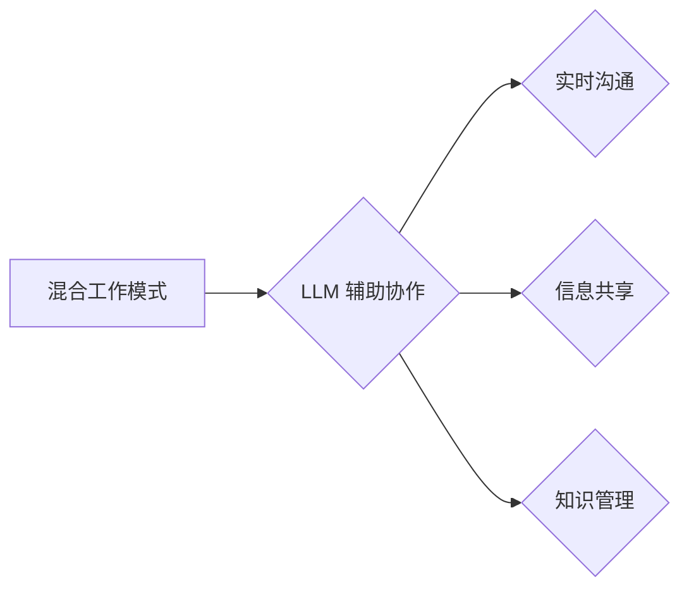

                 

## 混合工作模式与 LLM：高效的远程协作

> 关键词：混合工作模式、LLM、远程协作、人工智能、自然语言处理、效率提升、沟通协作、工具集成

## 1. 背景介绍

随着科技的飞速发展，工作模式也在不断演变。混合工作模式，即结合远程办公和办公室工作，逐渐成为主流趋势。它为员工提供了更多灵活性，但也带来了新的挑战，例如沟通协作效率的降低、信息孤岛的形成等。

大型语言模型（LLM）作为人工智能领域的一项突破性技术，拥有强大的文本生成、理解和翻译能力。它能够理解和响应自然语言指令，并生成高质量的文本内容。LLM 的出现为解决混合工作模式下的协作难题提供了新的可能性。

## 2. 核心概念与联系

### 2.1 混合工作模式

混合工作模式是指员工在办公室和远程办公地点之间灵活切换工作模式，既可以享受远程办公的自由和便利，又可以获得办公室环境带来的协作和社交体验。

### 2.2 LLM

大型语言模型（LLM）是一种基于深度学习的强大人工智能模型，能够处理和生成人类语言。它通过训练海量文本数据，学习语言的语法、语义和上下文关系，从而具备理解、生成、翻译、总结等多种语言能力。

### 2.3 核心联系

LLM 可以有效提升混合工作模式下的协作效率，主要体现在以下几个方面：

* **实时沟通协作:** LLM 可以帮助团队成员在不同地点进行实时沟通，例如通过文本聊天、语音通话等方式。
* **信息共享和协同编辑:** LLM 可以帮助团队成员共享信息、协同编辑文档，并自动生成会议纪要、任务清单等。
* **知识管理和检索:** LLM 可以帮助团队成员快速检索和管理知识，例如通过问答系统、知识图谱等方式。

**Mermaid 流程图:**



## 3. 核心算法原理 & 具体操作步骤

### 3.1 算法原理概述

LLM 的核心算法原理是基于 Transformer 架构的深度学习模型。Transformer 模型通过自注意力机制，能够捕捉文本序列中长距离依赖关系，从而实现更精准的语言理解和生成。

### 3.2 算法步骤详解

1. **数据预处理:** 将文本数据进行清洗、分词、标记等预处理操作，使其能够被模型理解。
2. **模型训练:** 使用大量的文本数据训练 Transformer 模型，使其学习语言的语法、语义和上下文关系。
3. **模型评估:** 使用测试数据评估模型的性能，例如准确率、流畅度等指标。
4. **模型部署:** 将训练好的模型部署到服务器或云平台，使其能够为用户提供服务。

### 3.3 算法优缺点

**优点:**

* 强大的文本理解和生成能力
* 能够捕捉长距离依赖关系
* 训练效率高

**缺点:**

* 模型参数量大，需要大量的计算资源
* 训练数据量大，需要海量文本数据
* 对训练数据质量要求高

### 3.4 算法应用领域

LLM 的应用领域非常广泛，例如：

* 自然语言处理：文本分类、情感分析、机器翻译等
* 人机交互：聊天机器人、语音助手等
* 内容创作：文章写作、代码生成等
* 教育培训：智能辅导、个性化学习等

## 4. 数学模型和公式 & 详细讲解 & 举例说明

### 4.1 数学模型构建

LLM 的数学模型主要基于 Transformer 架构，其核心是自注意力机制。自注意力机制通过计算每个词与其他词之间的相关性，来捕捉文本序列中的长距离依赖关系。

**公式:**

$$
Attention(Q, K, V) = softmax(\frac{QK^T}{\sqrt{d_k}})V
$$

其中：

* $Q$：查询矩阵
* $K$：键矩阵
* $V$：值矩阵
* $d_k$：键向量的维度
* $softmax$：softmax 函数

### 4.2 公式推导过程

自注意力机制的公式推导过程较为复杂，涉及到矩阵运算、线性变换等数学概念。

**简要解释:**

1. 将输入序列中的每个词分别转换为查询向量、键向量和值向量。
2. 计算每个查询向量与所有键向量的点积，并进行归一化处理。
3. 将归一化后的结果作为权重，对值向量进行加权求和，得到最终的注意力输出。

### 4.3 案例分析与讲解

**举例:**

假设我们有一个句子 "The cat sat on the mat"，其词向量分别为：

* The：[0.1, 0.2, 0.3]
* cat：[0.4, 0.5, 0.6]
* sat：[0.7, 0.8, 0.9]
* on：[0.2, 0.3, 0.4]
* the：[0.1, 0.2, 0.3]
* mat：[0.5, 0.6, 0.7]

通过自注意力机制，我们可以计算出每个词与其他词之间的相关性，例如 "cat" 与 "sat" 之间的关系较高，因为它们在语义上紧密相关。

## 5. 项目实践：代码实例和详细解释说明

### 5.1 开发环境搭建

* Python 3.7+
* PyTorch 或 TensorFlow
* CUDA 和 cuDNN (可选，用于 GPU 加速)

### 5.2 源代码详细实现

```python
import torch
import torch.nn as nn

class Transformer(nn.Module):
    def __init__(self, vocab_size, embedding_dim, num_heads, num_layers):
        super(Transformer, self).__init__()
        self.embedding = nn.Embedding(vocab_size, embedding_dim)
        self.transformer_layers = nn.ModuleList([
            nn.TransformerEncoderLayer(embedding_dim, num_heads)
            for _ in range(num_layers)
        ])
        self.linear = nn.Linear(embedding_dim, vocab_size)

    def forward(self, x):
        x = self.embedding(x)
        for layer in self.transformer_layers:
            x = layer(x)
        x = self.linear(x)
        return x
```

### 5.3 代码解读与分析

* `Transformer` 类定义了 Transformer 模型的结构。
* `embedding` 层将输入词转换为词向量。
* `transformer_layers` 是一个列表，包含多个 Transformer Encoder 层。
* `linear` 层将 Transformer 输出映射到词汇表大小。
* `forward` 方法定义了模型的正向传播过程。

### 5.4 运行结果展示

训练好的 Transformer 模型可以用于各种自然语言处理任务，例如文本分类、机器翻译等。

## 6. 实际应用场景

### 6.1 远程协作工具

LLM 可以集成到远程协作工具中，例如：

* **实时沟通:** LLM 可以帮助团队成员在不同地点进行实时沟通，例如通过文本聊天、语音通话等方式。
* **文档协作:** LLM 可以帮助团队成员共享信息、协同编辑文档，并自动生成会议纪要、任务清单等。

### 6.2 知识管理平台

LLM 可以用于构建知识管理平台，例如：

* **知识检索:** LLM 可以帮助用户快速检索和管理知识，例如通过问答系统、知识图谱等方式。
* **知识生成:** LLM 可以帮助用户生成新的知识，例如通过总结文档、提取关键信息等方式。

### 6.3 个性化学习平台

LLM 可以用于构建个性化学习平台，例如：

* **智能辅导:** LLM 可以根据用户的学习进度和需求，提供个性化的学习辅导。
* **个性化学习内容:** LLM 可以根据用户的学习兴趣和目标，生成个性化的学习内容。

### 6.4 未来应用展望

LLM 在混合工作模式下的应用前景广阔，未来可能在以下方面得到进一步发展：

* **更智能的协作助手:** LLM 可以成为更智能的协作助手，例如自动安排会议、管理任务、生成报告等。
* **更沉浸式的远程办公体验:** LLM 可以帮助构建更沉浸式的远程办公体验，例如通过虚拟现实技术和人工智能交互。
* **更个性化的工作流程:** LLM 可以帮助用户定制更个性化的工作流程，例如自动完成重复性任务、智能分配工作等。

## 7. 工具和资源推荐

### 7.1 学习资源推荐

* **书籍:**
    * 《深度学习》
    * 《自然语言处理》
* **在线课程:**
    * Coursera: 自然语言处理
    * edX: 深度学习
* **博客和论坛:**
    * Hugging Face
    * TensorFlow Blog

### 7.2 开发工具推荐

* **框架:**
    * PyTorch
    * TensorFlow
* **库:**
    * Transformers
    * NLTK
* **平台:**
    * Google Colab
    * Kaggle

### 7.3 相关论文推荐

* **Attention Is All You Need**
* **BERT: Pre-training of Deep Bidirectional Transformers for Language Understanding**
* **GPT-3: Language Models are Few-Shot Learners**

## 8. 总结：未来发展趋势与挑战

### 8.1 研究成果总结

LLM 在混合工作模式下的应用取得了显著成果，例如提升了远程协作效率、简化了知识管理流程、个性化学习体验等。

### 8.2 未来发展趋势

LLM 的未来发展趋势包括：

* **模型规模和能力的提升:** 模型参数量将继续增加，模型能力将进一步增强。
* **多模态理解和生成:** LLM 将能够理解和生成多种模态信息，例如文本、图像、音频等。
* **更广泛的应用场景:** LLM 将应用于更多领域，例如医疗、教育、金融等。

### 8.3 面临的挑战

LLM 的发展也面临一些挑战，例如：

* **数据安全和隐私保护:** LLM 的训练需要大量数据，如何保证数据安全和隐私保护是一个重要问题。
* **模型可解释性和信任度:** LLM 的决策过程较为复杂，如何提高模型的可解释性和信任度是一个关键挑战。
* **伦理和社会影响:** LLM 的应用可能带来一些伦理和社会问题，例如算法偏见、信息操控等，需要引起重视和探讨。

### 8.4 研究展望

未来，LLM 研究将继续深入，探索更强大的模型架构、更有效的训练方法、更广泛的应用场景，并积极应对相关挑战，推动人工智能技术向更安全、更可信、更普惠的方向发展。

## 9. 附录：常见问题与解答

**Q1: LLM 的训练需要多少数据？**

A1: LLM 的训练需要海量文本数据，通常需要数十亿甚至数千亿个词。

**Q2: LLM 的模型参数量有多大？**

A2: LLM 的模型参数量通常在数十亿甚至数百亿个之间。

**Q3: 如何评估 LLM 的性能？**

A3: LLM 的性能可以评估多种指标，例如准确率、流畅度、困惑度等。

**Q4: LLM 是否可以理解人类的情感？**

A4: 目前 LLM 只能识别文本中的情感表达，但不能真正理解人类的情感。

**Q5: LLM 是否会取代人类的工作？**

A5: LLM 可以自动化一些重复性工作，但不会完全取代人类的工作。人类仍然需要发挥创造力、批判性思维和社交能力等优势。


作者：禅与计算机程序设计艺术 / Zen and the Art of Computer Programming 
<end_of_turn>

