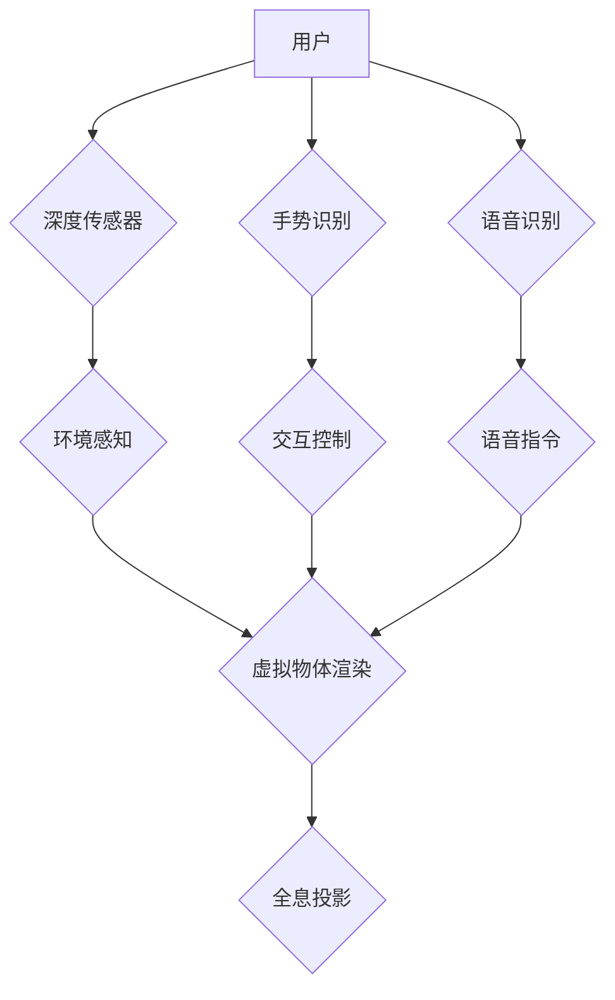

                 

## 混合现实（MR）探索：Microsoft HoloLens

> 关键词：混合现实（MR）、Microsoft HoloLens、计算机视觉、深度学习、传感器融合、交互设计、应用场景

## 1. 背景介绍

混合现实（MR）技术作为一种将虚拟现实（VR）和增强现实（AR）相结合的新兴技术，正在迅速改变我们与数字世界的交互方式。MR系统能够将虚拟物体叠加到现实世界中，并允许用户与虚拟物体进行交互，创造出更加沉浸式和逼真的体验。

Microsoft HoloLens作为首款全息投影头戴式设备，是MR技术的代表性产品之一。它利用先进的计算机视觉、深度学习和传感器融合技术，为用户提供身临其境的混合现实体验。HoloLens的出现，标志着MR技术迈向商业化的重要一步，为各个行业带来了无限的可能性。

## 2. 核心概念与联系

### 2.1 混合现实（MR）

混合现实（MR）是指将虚拟现实（VR）和增强现实（AR）相结合的技术，它融合了虚拟世界的元素和现实世界的环境，创造出一种全新的交互体验。

* **增强现实（AR）：** 在现实世界中叠加虚拟信息，例如在手机屏幕上显示导航路线或在游戏中将虚拟角色放置在现实场景中。
* **虚拟现实（VR）：** 创建一个完全虚拟的环境，用户通过头戴设备沉浸其中，例如玩游戏或进行虚拟培训。
* **混合现实（MR）：** 将虚拟物体与现实世界环境融合，用户可以与虚拟物体进行交互，并感知到虚拟物体与现实世界之间的物理关系。

### 2.2 Microsoft HoloLens

Microsoft HoloLens是一款全息投影头戴式设备，它利用先进的技术实现MR体验。

* **全息投影：** HoloLens使用光学技术将虚拟物体投影到现实世界中，并根据用户的视角进行实时调整，创造出逼真的三维效果。
* **深度传感器：** HoloLens配备了深度传感器，可以感知周围环境的深度信息，并根据深度信息准确地定位虚拟物体。
* **手势识别：** HoloLens支持手势识别，用户可以通过手势与虚拟物体进行交互，例如抓取、移动或旋转虚拟物体。
* **语音识别：** HoloLens支持语音识别，用户可以通过语音指令控制虚拟物体或执行操作。

### 2.3 核心架构



## 3. 核心算法原理 & 具体操作步骤

### 3.1 算法原理概述

HoloLens的核心算法原理包括：

* **环境感知：** 利用深度传感器和摄像头获取环境信息，构建三维地图并识别物体。
* **虚拟物体渲染：** 根据用户视角和环境信息，渲染虚拟物体并将其投影到现实世界中。
* **手势识别：** 分析用户的肢体动作，识别手势并将其转换为虚拟操作指令。
* **语音识别：** 将用户的语音信号转换为文本，并识别用户的意图。

### 3.2 算法步骤详解

**环境感知算法：**

1. **深度图像获取：** 深度传感器获取环境的深度信息，生成深度图像。
2. **特征提取：** 从深度图像中提取特征点，例如边缘、角点等。
3. **场景重建：** 利用特征点和深度信息，构建三维场景模型。
4. **物体识别：** 利用深度学习模型识别场景中的物体，并进行分类和定位。

**虚拟物体渲染算法：**

1. **虚拟物体建模：** 使用3D建模软件创建虚拟物体模型。
2. **纹理贴图：** 为虚拟物体添加纹理贴图，使其更加逼真。
3. **光照计算：** 根据环境光照条件计算虚拟物体的阴影和反射效果。
4. **投影计算：** 根据用户视角和环境信息，计算虚拟物体在现实世界中的投影位置和大小。

**手势识别算法：**

1. **手部图像获取：** 摄像头获取用户的双手图像。
2. **手部关键点检测：** 利用深度学习模型检测手部关键点，例如手指关节和手掌中心。
3. **手势特征提取：** 从手部关键点的位置和运动轨迹中提取手势特征。
4. **手势识别：** 利用机器学习模型识别手势类型，并将其转换为虚拟操作指令。

**语音识别算法：**

1. **语音信号采集：** 麦克风采集用户的语音信号。
2. **语音预处理：** 对语音信号进行降噪、增益调整等预处理操作。
3. **语音特征提取：** 从语音信号中提取特征，例如梅尔频率倒谱系数（MFCC）。
4. **语音识别：** 利用深度学习模型识别语音特征，并将其转换为文本。

### 3.3 算法优缺点

**优点：**

* **沉浸式体验：** MR技术能够创造出更加沉浸式和逼真的体验，增强用户与虚拟世界的交互。
* **交互性强：** MR系统支持多种交互方式，例如手势识别、语音识别和触控，提高了用户体验。
* **应用场景广泛：** MR技术在教育、医疗、工业、娱乐等多个领域都有广泛的应用前景。

**缺点：**

* **技术复杂：** MR技术涉及多个领域，例如计算机视觉、深度学习和传感器融合，技术难度较高。
* **成本高昂：** MR设备和软件成本较高，限制了其普及率。
* **内容匮乏：** 目前MR内容相对匮乏，需要更多开发者和内容创作者参与。

### 3.4 算法应用领域

* **教育：** MR可以用于创造沉浸式的学习环境，例如虚拟解剖、历史模拟和科学实验。
* **医疗：** MR可以用于医学培训、手术模拟和远程医疗。
* **工业：** MR可以用于产品设计、设备维护和远程协作。
* **娱乐：** MR可以用于游戏、电影和音乐体验。

## 4. 数学模型和公式 & 详细讲解 & 举例说明

### 4.1 数学模型构建

**环境感知模型：**

* **深度图像重建：** 利用深度图像和相机参数，构建三维点云模型。
* **物体识别模型：** 利用深度学习模型，例如卷积神经网络（CNN），识别场景中的物体类别和位置。

**虚拟物体渲染模型：**

* **投影变换：** 将虚拟物体坐标系转换为世界坐标系，并根据用户视角进行投影变换。
* **光照计算：** 利用光线追踪算法或其他光照模型，计算虚拟物体的阴影和反射效果。

### 4.2 公式推导过程

**投影变换公式：**

$$
P = M \cdot V
$$

其中：

* $P$ 是投影后的虚拟物体坐标。
* $M$ 是投影矩阵，包含相机参数和视场角信息。
* $V$ 是虚拟物体在世界坐标系中的坐标。

**光照计算公式：**

$$
I = L \cdot R
$$

其中：

* $I$ 是物体表面上的亮度。
* $L$ 是光源强度。
* $R$ 是物体表面的反射率。

### 4.3 案例分析与讲解

**环境感知案例：**

HoloLens利用深度传感器获取环境深度信息，并结合摄像头图像进行场景重建。例如，在室内环境中，HoloLens可以识别墙壁、家具和地面等物体，并构建出三维地图。

**虚拟物体渲染案例：**

HoloLens可以将虚拟物体投影到现实世界中，并根据用户视角进行实时调整。例如，用户可以将虚拟模型放置在现实桌面上，并通过手势旋转和缩放虚拟模型。

## 5. 项目实践：代码实例和详细解释说明

### 5.1 开发环境搭建

* **操作系统：** Windows 10
* **开发工具：** Visual Studio 2019
* **软件框架：** Unity 3D

### 5.2 源代码详细实现

```csharp
// 虚拟物体渲染代码示例
public class HoloCube : MonoBehaviour
{
    public Material cubeMaterial;

    void Update()
    {
        // 根据用户视角旋转虚拟物体
        transform.Rotate(0, Time.deltaTime * 90, 0);
    }

    void OnRenderObject()
    {
        // 设置虚拟物体的材质
        GetComponent<Renderer>().material = cubeMaterial;
    }
}
```

### 5.3 代码解读与分析

* `HoloCube` 类代表一个虚拟立方体物体。
* `cubeMaterial` 属性用于设置虚拟物体的材质。
* `Update()` 方法用于更新虚拟物体的旋转角度。
* `OnRenderObject()` 方法用于设置虚拟物体的材质。

### 5.4 运行结果展示

运行代码后，一个虚拟立方体将出现在HoloLens的视野中，并根据用户视角进行实时旋转。

## 6. 实际应用场景

### 6.1 教育

* **虚拟解剖：** 学生可以通过HoloLens进行虚拟解剖，观察人体内部器官的结构和功能。
* **历史模拟：** 学生可以身临其境地体验历史事件，例如参观古埃及金字塔或参加古罗马竞技场。
* **科学实验：** 学生可以进行虚拟科学实验，例如模拟化学反应或观察物理现象。

### 6.2 医疗

* **医学培训：** 医生可以通过HoloLens进行虚拟手术模拟，提高手术技能。
* **远程医疗：** 医生可以通过HoloLens远程指导患者进行治疗，例如远程诊断和手术指导。
* **康复治疗：** 患者可以通过HoloLens进行虚拟康复训练，例如虚拟行走和虚拟平衡训练。

### 6.3 工业

* **产品设计：** 工程师可以通过HoloLens进行虚拟产品设计，并与客户进行实时交互。
* **设备维护：** 维修人员可以通过HoloLens查看设备内部结构，并进行虚拟维修指导。
* **远程协作：** 团队成员可以通过HoloLens进行远程协作，例如虚拟会议和虚拟设计审查。

### 6.4 未来应用展望

* **个性化教育：** MR技术可以根据学生的学习进度和兴趣爱好提供个性化的学习内容。
* **沉浸式娱乐：** MR技术可以创造出更加沉浸式的游戏和电影体验。
* **虚拟社交：** MR技术可以让人们在虚拟世界中进行社交互动，例如虚拟会议和虚拟聚会。

## 7. 工具和资源推荐

### 7.1 学习资源推荐

* **Microsoft HoloLens 开发者文档：** https://docs.microsoft.com/en-us/windows/mixed-reality/
* **Unity 3D 官方网站：** https://unity.com/
* **GitHub 上的 HoloLens 项目：** https://github.com/topics/hololens

### 7.2 开发工具推荐

* **Visual Studio 2019：** https://visualstudio.microsoft.com/
* **Unity 3D：** https://unity.com/
* **Azure Mixed Reality：** https://azure.microsoft.com/en-us/services/mixed-reality/

### 7.3 相关论文推荐

* **A Survey of Mixed Reality Technologies:** https://ieeexplore.ieee.org/document/8679214
* **HoloLens: A First Look at Microsoft's Mixed Reality Headset:** https://www.researchgate.net/publication/309901584_HoloLens_A_First_Look_at_Microsoft's_Mixed_Reality_Headset

## 8. 总结：未来发展趋势与挑战

### 8.1 研究成果总结

HoloLens作为首款全息投影头戴式设备，在MR技术领域取得了重要进展。其先进的技术和丰富的应用场景，为MR技术的商业化发展提供了重要的参考和借鉴。

### 8.2 未来发展趋势

* **更轻便、更舒适的设备：** 未来MR设备将更加轻便、舒适，并具有更长的续航时间。
* **更逼真的视觉效果：** 未来MR设备将采用更高分辨率的显示屏和更先进的光学技术，提供更逼真的视觉效果。
* **更丰富的交互方式：** 未来MR设备将支持更多交互方式，例如手势识别、语音识别、眼动追踪和触觉反馈。
* **更广泛的应用场景：** 未来MR技术将应用于更多领域，例如教育、医疗、工业、娱乐和社交。

### 8.3 面临的挑战

* **技术难题：** MR技术涉及多个领域，例如计算机视觉、深度学习和传感器融合，仍存在许多技术难题需要解决。
* **成本问题：** MR设备和软件成本较高，限制了其普及率。
* **内容匮乏：** 目前MR内容相对匮乏，需要更多开发者和内容创作者参与。

### 8.4 研究展望

未来MR技术将继续朝着更轻便、更舒适、更逼真、更交互、更广泛的应用方向发展。随着技术的进步和成本的降低，MR技术将逐渐普及，并改变我们的生活方式。

## 9. 附录：常见问题与解答

**Q1：HoloLens需要连接互联网吗？**

A1：HoloLens可以离线使用，但某些功能，例如云存储和远程协作，需要连接互联网。

**Q2：HoloLens的价格是多少？**

A2：HoloLens的价格取决于型号和配置，一般在几千美元左右。

**Q3：HoloLens的适用人群是谁？**

A3：HoloLens适用于各种人群，例如开发者、教育者、医疗工作者、工业工程师和普通消费者。

**Q4：HoloLens有哪些安全风险？**

A4：使用HoloLens时，需要注意隐私安全和数据安全问题。建议用户使用官方软件和应用程序，并定期更新设备软件。

**Q5：HoloLens的未来发展前景如何？**

A5：HoloLens作为MR技术的代表产品，未来发展前景广阔。随着技术的进步和成本的降低，MR技术将逐渐普及，并改变我们的生活方式。


作者：禅与计算机程序设计艺术 / Zen and the Art of Computer Programming<end_of_turn>

