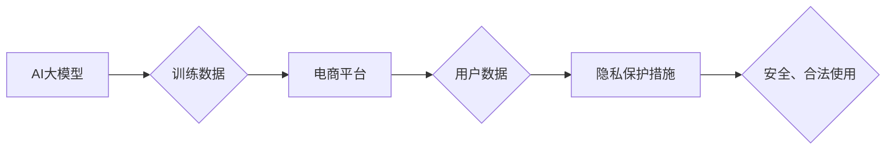

                 

## 电商平台中AI大模型的隐私保护措施

> 关键词：AI大模型、电商平台、隐私保护、数据安全、联邦学习、差分隐私、同态加密、隐私计算

## 1. 背景介绍

随着人工智能技术的飞速发展，大模型在电商平台的应用日益广泛，例如推荐系统、个性化营销、智能客服等。这些应用能够显著提升用户体验和商业效益。然而，大模型的训练和部署都依赖于海量用户数据，这不可避免地带来数据隐私泄露的风险。电商平台作为用户数据的重要集聚地，必须高度重视AI大模型的隐私保护，确保用户数据安全和合法使用。

## 2. 核心概念与联系

### 2.1  AI大模型

AI大模型是指参数量巨大、训练数据海量的人工智能模型，能够学习复杂的数据模式并进行高精度预测或生成。例如，GPT-3、BERT、LaMDA等都是著名的AI大模型。

### 2.2  电商平台

电商平台是指提供商品展示、交易、支付等服务的在线商业平台，例如淘宝、京东、亚马逊等。电商平台通常收集大量用户数据，包括购物记录、浏览历史、个人信息等。

### 2.3  隐私保护

隐私保护是指保护个人信息不被未经授权的访问、使用、披露或修改，保障个人信息安全和合法使用。

**核心概念与联系流程图**



## 3. 核心算法原理 & 具体操作步骤

### 3.1  算法原理概述

为了保护用户隐私，在电商平台中应用AI大模型时，需要采用相应的隐私保护算法。常见的隐私保护算法包括联邦学习、差分隐私和同态加密等。

* **联邦学习:** 将模型训练分散到多个数据拥有者（例如，不同的电商平台）的设备上，避免将原始数据集中到一个中心服务器，从而降低数据泄露风险。

* **差分隐私:** 在数据处理过程中添加随机噪声，使得单个用户的隐私信息无法被识别，同时保证模型训练的准确性。

* **同态加密:** 对数据进行加密，使得数据在加密状态下也能进行运算，从而保护数据在传输和处理过程中的隐私。

### 3.2  算法步骤详解

**联邦学习步骤详解:**

1. **模型初始化:** 在所有参与者之间共享一个初始模型。
2. **数据本地训练:** 每个参与者在本地数据上训练模型，并计算模型参数的梯度。
3. **梯度聚合:** 所有参与者的梯度被安全地聚合，得到全局梯度。
4. **模型更新:** 全局梯度用于更新共享模型的参数。
5. **模型迭代:** 重复步骤2-4，直到模型达到预设的精度。

**差分隐私步骤详解:**

1. **添加噪声:** 在数据处理过程中添加随机噪声，使得单个用户的隐私信息无法被识别。
2. **模型训练:** 使用添加了噪声的数据进行模型训练。
3. **结果输出:** 输出模型训练的结果，并保证结果的准确性。

**同态加密步骤详解:**

1. **数据加密:** 将数据进行加密，使得数据在加密状态下也能进行运算。
2. **加密数据运算:** 在加密状态下对数据进行运算，例如加法、乘法等。
3. **解密结果:** 将运算结果解密，得到最终结果。

### 3.3  算法优缺点

| 算法 | 优点 | 缺点 |
|---|---|---|
| 联邦学习 | 保护原始数据隐私，提高数据安全 | 训练效率较低，模型性能可能受限 |
| 差分隐私 | 能够保证单个用户的隐私，适用于敏感数据处理 | 可能会降低模型的准确性 |
| 同态加密 | 保护数据在传输和处理过程中的隐私 | 计算复杂度高，效率较低 |

### 3.4  算法应用领域

* **联邦学习:** 医疗数据分析、金融数据安全、工业数据共享等
* **差分隐私:** 医疗记录分析、用户行为分析、市场调研等
* **同态加密:** 支付安全、身份验证、数据授权等

## 4. 数学模型和公式 & 详细讲解 & 举例说明

### 4.1  数学模型构建

**差分隐私数学模型:**

设数据集为D，隐私预算为ε，则差分隐私的定义为：对于任意两个数据集D和D'，其中D和D'仅在单个数据点上不同，则模型输出的概率分布满足以下不等式：

$$
P(M(D) \in S) \leq e^{\epsilon} P(M(D') \in S)
$$

其中，M(D)表示模型在数据集D上的输出，S为输出结果的集合。

**解释:**

该公式表示，模型在两个相差单个数据点的集合上的输出概率分布，其差异不超过一个指数因子$e^{\epsilon}$。ε被称为隐私预算，其值越小，隐私保护越强。

### 4.2  公式推导过程

差分隐私的公式推导过程较为复杂，涉及到概率论、信息论和微积分等知识。

**简要说明:**

差分隐私的推导过程主要基于以下几个关键点：

* **隐私损失函数:** 定义一个衡量模型输出对用户隐私的影响的函数。
* **隐私预算:** 设置一个隐私预算ε，限制隐私损失函数的最大值。
* **噪声添加:** 在数据处理过程中添加随机噪声，使得模型输出的隐私损失满足隐私预算的限制。

### 4.3  案例分析与讲解

**举例说明:**

假设我们使用差分隐私来保护用户的购物记录数据，并训练一个推荐模型。

* **隐私预算:** 设置ε为0.1，表示允许模型输出对用户隐私的影响不超过$e^{0.1}$倍。
* **噪声添加:** 在用户购物记录数据中添加随机噪声，使得每个用户的购物记录在模型训练过程中都有一定的随机性。

通过这种方式，即使模型能够学习到用户的购物偏好，也无法准确地识别出任何单个用户的隐私信息。

## 5. 项目实践：代码实例和详细解释说明

### 5.1  开发环境搭建

* **操作系统:** Linux/macOS
* **编程语言:** Python
* **深度学习框架:** TensorFlow/PyTorch
* **隐私计算库:** TensorFlow Privacy/PySyft

### 5.2  源代码详细实现

```python
# 使用TensorFlow Privacy实现差分隐私

import tensorflow as tf
from tensorflow_privacy.privacy.analysis import privacy_loss_dp

# 定义模型
model = tf.keras.Sequential([
    tf.keras.layers.Dense(10, activation='relu'),
    tf.keras.layers.Dense(1, activation='sigmoid')
])

# 定义差分隐私预算
epsilon = 0.1

# 使用差分隐私训练模型
privacy_loss = privacy_loss_dp.compute_privacy_loss(
    model,
    dataset,
    epsilon=epsilon
)

# 打印隐私损失
print(f"Privacy loss: {privacy_loss}")

# 训练模型
model.compile(optimizer='adam', loss='binary_crossentropy', metrics=['accuracy'])
model.fit(dataset, epochs=10)
```

### 5.3  代码解读与分析

* **隐私预算设置:** `epsilon`参数控制了差分隐私的隐私预算，其值越小，隐私保护越强。
* **隐私损失计算:** `compute_privacy_loss`函数计算模型训练过程中的隐私损失，确保隐私损失不超过设置的预算。
* **模型训练:** 使用差分隐私训练模型，保证模型训练过程中的隐私保护。

### 5.4  运行结果展示

运行代码后，会输出模型训练过程中的隐私损失值。

## 6. 实际应用场景

### 6.1  个性化推荐

电商平台可以利用差分隐私技术保护用户浏览历史和购买记录等隐私数据，训练个性化推荐模型，为用户提供更精准的商品推荐，同时保障用户隐私安全。

### 6.2  智能客服

电商平台可以利用联邦学习技术训练智能客服模型，将用户聊天记录分散存储在各个服务器上，避免集中存储用户隐私数据，同时保证模型训练的准确性。

### 6.3  用户画像分析

电商平台可以利用同态加密技术保护用户个人信息，例如姓名、地址、电话号码等，进行用户画像分析，了解用户需求和行为模式，为用户提供更个性化的服务。

### 6.4  未来应用展望

随着人工智能技术的不断发展，AI大模型在电商平台的应用场景将更加广泛。未来，隐私保护技术将更加成熟，能够更好地保障用户隐私安全，促进AI大模型在电商平台的健康发展。

## 7. 工具和资源推荐

### 7.1  学习资源推荐

* **书籍:**

    * 《隐私计算》
    * 《联邦学习》

* **在线课程:**

    * Coursera: Privacy-Preserving Machine Learning
    * edX: Introduction to Differential Privacy

### 7.2  开发工具推荐

* **TensorFlow Privacy:** https://www.tensorflow.org/privacy
* **PySyft:** https://www.openmined.org/

### 7.3  相关论文推荐

* 《Differential Privacy》
* 《Federated Learning: Strategies for Improving Communication Efficiency》

## 8. 总结：未来发展趋势与挑战

### 8.1  研究成果总结

近年来，在AI大模型的隐私保护领域取得了显著进展，例如联邦学习、差分隐私和同态加密等技术得到了广泛应用。这些技术能够有效地保护用户隐私，同时保证模型训练的准确性。

### 8.2  未来发展趋势

* **隐私计算的融合:** 将不同的隐私计算技术融合在一起，构建更加强大的隐私保护体系。
* **可解释性增强:** 提高隐私保护算法的可解释性，使得用户能够更好地理解模型是如何保护其隐私的。
* **硬件加速:** 开发专门用于隐私计算的硬件，提高隐私计算的效率和性能。

### 8.3  面临的挑战

* **模型性能:** 隐私保护算法可能会降低模型的性能，需要不断探索新的算法和技术来提高模型的准确性。
* **数据安全:** 即使采用隐私保护技术，也需要确保数据在传输和存储过程中的安全。
* **法律法规:** 隐私保护法律法规不断更新，需要及时了解和遵守相关规定。

### 8.4  研究展望

未来，隐私保护技术将继续发展，为AI大模型的应用提供更加安全可靠的保障。

## 9. 附录：常见问题与解答

**常见问题:**

* **差分隐私和联邦学习的区别是什么？**

**解答:**

差分隐私是一种数据扰动技术，可以保护单个用户的隐私信息，而联邦学习是一种分布式训练技术，可以避免将原始数据集中到一个中心服务器。

* **同态加密是如何实现数据隐私保护的？**

**解答:**

同态加密是一种加密技术，可以对数据进行加密，使得数据在加密状态下也能进行运算。

* **如何选择合适的隐私保护技术？**

**解答:**

选择合适的隐私保护技术需要根据具体的应用场景和数据特点进行评估。


作者：禅与计算机程序设计艺术 / Zen and the Art of Computer Programming 
<end_of_turn>

