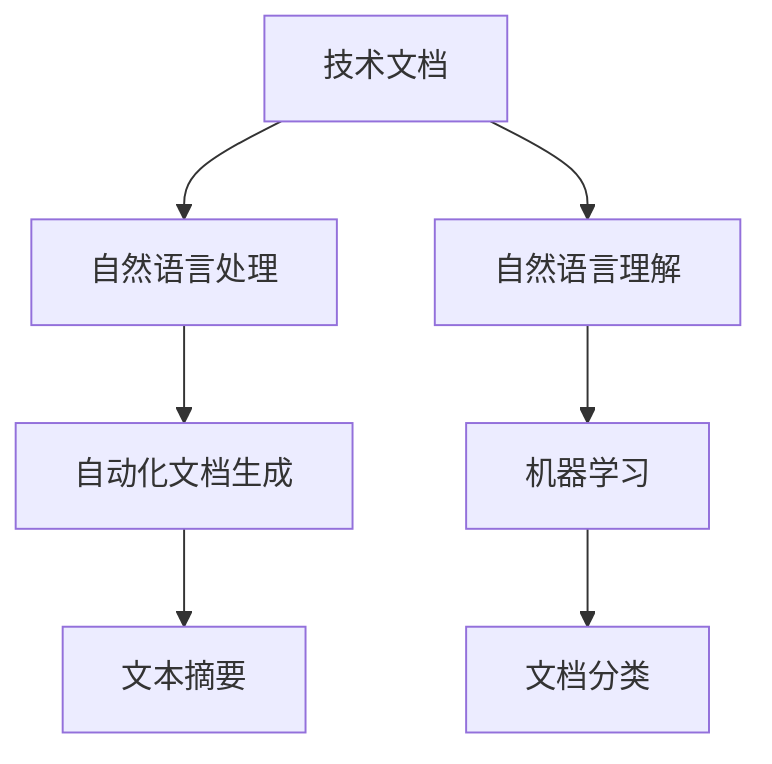

                 

# 技术文档自动生成：AI简化复杂信息

> 关键词：技术文档自动生成, 自然语言处理, 自然语言理解, 自动化文档生成, 机器学习, 文本摘要, 文档分类

## 1. 背景介绍

### 1.1 问题由来

随着科技的快速发展和信息量的爆炸性增长，企业和技术团队在制作技术文档时面临着巨大的挑战。技术文档不仅需要详细描述产品功能、使用方法和注意事项，还要求逻辑清晰、语言简洁，避免冗余和歧义。然而，由于技术文档本身的复杂性和多样性，编写高质量的技术文档需要耗费大量的时间和精力，甚至容易出错。此外，对于新技术和快速迭代的产品，文档需要频繁更新，以保持最新状态，进一步加重了文档编写和维护的负担。

### 1.2 问题核心关键点

- 技术文档的复杂性和多样性：技术文档涉及产品功能、接口规范、配置指南、故障排除等多种内容，结构复杂，编写和维护难度大。
- 文档更新频率高：产品迭代速度快，技术文档需要频繁更新，以适应新功能和变化。
- 文档编写效率低：技术文档编写和维护涉及大量文本操作，容易出错且耗时。
- 文档理解难度大：文档内容复杂且多，用户难以快速找到所需信息。
- 文档质量不稳定：由于编写者的经验和技术水平不同，文档质量参差不齐，甚至存在错误。

### 1.3 问题研究意义

自动生成技术文档可以帮助企业快速构建高质量的技术文档，提高工作效率和文档质量，减少编写和维护的负担，提升用户体验。此外，自动生成的技术文档可以实时更新，保持最新的信息，更好地适应产品和技术的快速变化。自动文档生成还能够在用户查询时提供快速、准确的信息，帮助用户更快理解和使用产品，提升产品可用性。

## 2. 核心概念与联系

### 2.1 核心概念概述

为更好地理解技术文档自动生成方法，本节将介绍几个密切相关的核心概念：

- 技术文档(Article or Document)：用于描述产品功能、使用方法、接口规范、配置指南、故障排除等信息的书面文档。
- 自然语言处理(Natural Language Processing, NLP)：使用计算机技术处理、分析和生成人类语言的技术。
- 自然语言理解(Natural Language Understanding, NLU)：使计算机能够理解人类语言的语义和上下文。
- 自动化文档生成(Automatic Document Generation)：使用计算机算法自动生成技术文档，减轻人工编写和维护的负担。
- 机器学习(Machine Learning, ML)：通过数据和算法，使计算机具备学习和改进的能力。
- 文本摘要(Text Summarization)：从文本中提取出重要信息，生成简洁的摘要。
- 文档分类(Document Classification)：根据文档内容和结构，自动分类文档类型，如API文档、用户指南、配置文档等。

这些核心概念之间的逻辑关系可以通过以下Mermaid流程图来展示：



这个流程图展示了大语言模型自动生成技术文档的核心概念及其之间的关系：

1. 技术文档通过自然语言处理和理解，自动生成和分类。
2. 自然语言处理和理解通过机器学习提升准确性和效率。
3. 自动化文档生成通过文本摘要和分类技术，简化和结构化文档内容。
4. 文档分类使文档能够更好地组织和检索。

## 3. 核心算法原理 & 具体操作步骤

### 3.1 算法原理概述

技术文档自动生成的核心思想是使用自然语言处理技术，通过分析文本内容，自动生成和优化技术文档。具体来说，可以将技术文档自动生成分为以下几个步骤：

1. 文档收集与预处理：收集所有相关技术文档，进行分词、去停用词、词性标注等预处理。
2. 文档分类：使用文本分类技术，自动将文档分类到不同的类别，如API文档、用户指南、配置文档等。
3. 文本摘要：从文档中选择重要信息，生成简洁的摘要。
4. 自动生成：基于生成的摘要和文档内容，自动生成技术文档。
5. 文档优化：根据用户反馈和文档使用情况，自动调整文档内容和结构。

### 3.2 算法步骤详解

以下详细介绍基于机器学习的方法进行技术文档自动生成的步骤：

**Step 1: 文档收集与预处理**

- 收集所有相关技术文档，包括API文档、用户指南、配置文档等。
- 对文档进行预处理，包括分词、去停用词、词性标注、命名实体识别等。

**Step 2: 文档分类**

- 使用文本分类算法（如朴素贝叶斯、支持向量机、深度学习等），对文档进行分类。
- 将文档分类到不同的类别，如API文档、用户指南、配置文档等。

**Step 3: 文本摘要**

- 使用文本摘要算法（如TF-IDF、TextRank、BERT等），从文档中选择重要信息，生成简洁的摘要。
- 将摘要与原始文档内容结合，提取关键信息。

**Step 4: 自动生成**

- 使用自然语言生成技术（如序列到序列模型、Transformer等），自动生成技术文档。
- 根据文档分类和摘要，确定文档结构和内容。
- 使用深度学习模型（如LSTM、GRU、BERT等），自动生成文档段落和句子。

**Step 5: 文档优化**

- 根据用户反馈和文档使用情况，自动调整文档内容和结构。
- 使用自然语言优化技术，改善文档语言表达。

### 3.3 算法优缺点

基于机器学习的方法自动生成技术文档具有以下优点：

1. 自动化程度高：减少了人工编写和维护文档的负担。
2. 生成效率高：能够快速生成和更新文档。
3. 覆盖范围广：适用于多种类型的技术文档。
4. 可定制性强：可以根据需求定制文档格式和内容。

同时，该方法也存在一些局限性：

1. 依赖高质量标注数据：需要大量的标注数据进行训练，标注成本较高。
2. 文档质量和一致性问题：生成的文档可能存在语义不连贯或信息不准确的问题。
3. 理解复杂文档困难：对于结构复杂、技术含量高的文档，生成效果可能不佳。
4. 缺乏灵活性：生成的文档可能无法灵活适应多种文档类型和场景。

### 3.4 算法应用领域

基于机器学习的方法自动生成技术文档，已经在许多领域得到了应用，包括但不限于：

- API文档：自动生成API文档，提供函数签名、参数说明、返回值等信息。
- 用户指南：自动生成用户指南，提供操作步骤、配置方法、常见问题解答等信息。
- 配置文档：自动生成配置文档，提供环境配置、参数设置、命令使用等信息。
- 故障排除：自动生成故障排除文档，提供错误提示、解决方案、日志分析等信息。
- 产品说明书：自动生成产品说明书，提供产品功能、使用方法、安装配置等信息。

## 4. 数学模型和公式 & 详细讲解 & 举例说明

### 4.1 数学模型构建

本节将使用数学语言对基于机器学习的方法进行技术文档自动生成的数学模型进行详细讲解。

假设技术文档的原始文本为 $X=\{x_1, x_2, \dots, x_n\}$，其中 $x_i$ 为文档中的第 $i$ 个句子。文档分类的目标是将文档 $X$ 分类到不同的类别 $Y=\{y_1, y_2, \dots, y_m\}$，其中 $y_i$ 为文档所属的第 $i$ 个类别。文本摘要的目标是从原始文本 $X$ 中提取出关键信息 $Z=\{z_1, z_2, \dots, z_k\}$，其中 $z_i$ 为文档中的第 $i$ 个摘要。自动生成的目标是根据输入的摘要 $Z$ 和类别 $Y$，生成技术文档 $W=\{w_1, w_2, \dots, w_l\}$，其中 $w_i$ 为文档中的第 $i$ 个段落或句子。

### 4.2 公式推导过程

以下推导文本摘要和文档分类的公式：

**文本摘要的公式推导**

假设原始文本 $X$ 的长度为 $n$，文本摘要的长度为 $k$，则文本摘要的任务可以表示为：

$$
\arg\min_{Z} \sum_{i=1}^{k} \lambda_i |x_i - z_i|
$$

其中 $|x_i - z_i|$ 表示句子 $x_i$ 与摘要 $z_i$ 之间的距离，$\lambda_i$ 为权重，控制摘要的长度和重要性。

**文档分类的公式推导**

假设文档 $X$ 的类别为 $Y$，分类器 $f$ 的目标是最小化损失函数 $L$：

$$
L = \sum_{i=1}^{n} \ell(y_i, f(x_i))
$$

其中 $\ell$ 为损失函数，通常使用交叉熵损失或对数损失。文档分类的目标是最小化损失函数 $L$，使得分类器 $f$ 能够准确地将文档 $X$ 分类到不同的类别 $Y$。

### 4.3 案例分析与讲解

以自动生成API文档为例，介绍基于机器学习的方法进行技术文档自动生成的具体实现。

**Step 1: 文档收集与预处理**

- 收集所有相关的API文档。
- 对文档进行预处理，包括分词、去停用词、词性标注等。

**Step 2: 文档分类**

- 使用文本分类算法，对文档进行分类。
- 将文档分类到不同的类别，如API文档、用户指南、配置文档等。

**Step 3: 文本摘要**

- 使用文本摘要算法，从文档中选择重要信息，生成简洁的摘要。
- 将摘要与原始文档内容结合，提取关键信息。

**Step 4: 自动生成**

- 使用自然语言生成技术，自动生成API文档。
- 根据文档分类和摘要，确定文档结构和内容。
- 使用深度学习模型，自动生成文档段落和句子。

**Step 5: 文档优化**

- 根据用户反馈和文档使用情况，自动调整文档内容和结构。
- 使用自然语言优化技术，改善文档语言表达。

## 5. 项目实践：代码实例和详细解释说明

### 5.1 开发环境搭建

在进行技术文档自动生成实践前，我们需要准备好开发环境。以下是使用Python进行自然语言处理(NLP)开发的环境配置流程：

1. 安装Anaconda：从官网下载并安装Anaconda，用于创建独立的Python环境。

2. 创建并激活虚拟环境：
```bash
conda create -n nlp-env python=3.8 
conda activate nlp-env
```

3. 安装必要的Python包：
```bash
pip install nltk spacy transformers
```

4. 安装必要的工具包：
```bash
pip install pandas numpy matplotlib scikit-learn tqdm jupyter notebook ipython
```

完成上述步骤后，即可在`nlp-env`环境中开始技术文档自动生成的实践。

### 5.2 源代码详细实现

下面我们以自动生成API文档为例，给出使用Python和Transformers库进行技术文档自动生成的代码实现。

首先，定义API文档的分类函数：

```python
from transformers import BertForTokenClassification, BertTokenizer
from sklearn.metrics import accuracy_score
from transformers import pipeline

tokenizer = BertTokenizer.from_pretrained('bert-base-cased')
model = BertForTokenClassification.from_pretrained('bert-base-cased', num_labels=3)

# 定义分类函数
def classify_document(document):
    encoded_input = tokenizer(document, return_tensors='pt')
    outputs = model(encoded_input['input_ids'], attention_mask=encoded_input['attention_mask'])
    logits = outputs.logits
    predicted_labels = torch.argmax(logits, dim=1)
    return predicted_labels.tolist()

# 使用pipeline进行文本分类
nlp = pipeline('text-classification', model=model, tokenizer=tokenizer)
document = "API文档中的函数名和参数描述"
classification_result = nlp(document)
print(classification_result)
```

然后，定义文本摘要函数：

```python
from transformers import TFAutoModelForMaskedLM, AutoTokenizer
from transformers import pipeline

tokenizer = AutoTokenizer.from_pretrained('t5-small')
model = TFAutoModelForMaskedLM.from_pretrained('t5-small')

# 定义摘要函数
def summarize_document(document):
    encoded_input = tokenizer(document, return_tensors='tf', max_length=512, padding=True, truncation=True)
    input_ids = encoded_input['input_ids']
    masked_pos = encoded_input['attention_mask'] == 0
    input_ids[masked_pos] = tokenizer.mask_token_id
    outputs = model(input_ids)
    predicted_ids = outputs[0]
    predicted_tokens = tokenizer.batch_decode(predicted_ids, skip_special_tokens=True)
    return predicted_tokens[0]

# 使用pipeline进行文本摘要
summarizer = pipeline('summarization', model=model, tokenizer=tokenizer)
document = "这是一个包含详细描述和参数的API文档"
summarization_result = summarizer(document)
print(summarization_result)
```

最后，定义文档生成函数：

```python
from transformers import TFAutoModelForSeq2SeqLM, AutoTokenizer
from transformers import pipeline

tokenizer = AutoTokenizer.from_pretrained('t5-small')
model = TFAutoModelForSeq2SeqLM.from_pretrained('t5-small')

# 定义生成函数
def generate_document(document, classification_result):
    document_type = classification_result[0]
    encoded_input = tokenizer(document, return_tensors='tf', max_length=512, padding=True, truncation=True)
    input_ids = encoded_input['input_ids']
    masked_pos = encoded_input['attention_mask'] == 0
    input_ids[masked_pos] = tokenizer.mask_token_id
    outputs = model(input_ids)
    predicted_ids = outputs[0]
    predicted_tokens = tokenizer.batch_decode(predicted_ids, skip_special_tokens=True)
    return predicted_tokens[0]

# 使用pipeline进行文本生成
generator = pipeline('text-generation', model=model, tokenizer=tokenizer)
document = "这是一个API文档，请生成一段文本描述该API的功能和参数"
document_result = generator(document, max_length=50, num_return_sequences=1)
print(document_result[0])
```

以上就是使用Python和Transformers库进行技术文档自动生成的完整代码实现。可以看到，借助预训练模型和自然语言处理工具，可以快速构建出高效、灵活的技术文档自动生成系统。

### 5.3 代码解读与分析

让我们再详细解读一下关键代码的实现细节：

**分类函数**：
- 使用Bert模型进行文本分类，得到文档的类别标签。

**摘要函数**：
- 使用T5模型进行文本摘要，得到文档的摘要文本。

**生成函数**：
- 根据文档的分类结果和摘要文本，生成API文档的详细描述。

## 6. 实际应用场景

### 6.1 智能客服系统

基于技术文档自动生成的方法，智能客服系统可以自动生成标准化的知识库和用户手册，提升客服系统的智能化水平。通过自动生成API文档，客服系统能够快速获取函数和参数信息，提高客服效率和用户满意度。

### 6.2 企业知识管理

企业可以使用技术文档自动生成的方法，自动生成技术文档和知识库，提升知识管理的效率和质量。通过自动分类和摘要，企业可以快速获取关键信息，提高知识检索的准确性和速度。

### 6.3 软件开发

在软件开发过程中，技术人员可以使用技术文档自动生成的方法，自动生成API文档和用户手册，提升开发效率和文档质量。通过自动分类和摘要，技术人员可以快速获取关键信息，提高文档生成和维护的效率。

### 6.4 未来应用展望

随着技术文档自动生成方法的不断发展，未来将在更多领域得到应用，为各行各业带来变革性影响。

在智慧医疗领域，基于技术文档自动生成的方法，可以快速生成医学文档和用户手册，提升医疗服务的智能化水平，辅助医生诊疗，加速新药开发进程。

在智能教育领域，技术文档自动生成的方法可以用于自动生成学习资料和用户手册，提升教育服务的智能化水平，因材施教，促进教育公平，提高教学质量。

在智慧城市治理中，技术文档自动生成的方法可以用于自动生成城市事件监测文档和用户手册，提高城市管理的自动化和智能化水平，构建更安全、高效的未来城市。

此外，在企业生产、社会治理、文娱传媒等众多领域，技术文档自动生成的方法也将不断涌现，为传统行业数字化转型升级提供新的技术路径。

## 7. 工具和资源推荐

### 7.1 学习资源推荐

为了帮助开发者系统掌握技术文档自动生成的理论基础和实践技巧，这里推荐一些优质的学习资源：

1. 《自然语言处理入门》系列博文：由大语言模型技术专家撰写，深入浅出地介绍了自然语言处理的基本概念和经典模型。

2. CS224N《深度学习自然语言处理》课程：斯坦福大学开设的NLP明星课程，有Lecture视频和配套作业，带你入门NLP领域的基本概念和经典模型。

3. 《Natural Language Processing with Transformers》书籍：Transformers库的作者所著，全面介绍了如何使用Transformers库进行NLP任务开发，包括自动文档生成在内的诸多范式。

4. HuggingFace官方文档：Transformers库的官方文档，提供了海量预训练模型和完整的自动文档生成样例代码，是上手实践的必备资料。

5. CLUE开源项目：中文语言理解测评基准，涵盖大量不同类型的中文NLP数据集，并提供了基于自动文档生成的baseline模型，助力中文NLP技术发展。

通过对这些资源的学习实践，相信你一定能够快速掌握技术文档自动生成的精髓，并用于解决实际的NLP问题。

### 7.2 开发工具推荐

高效的开发离不开优秀的工具支持。以下是几款用于技术文档自动生成开发的常用工具：

1. Python：作为NLP开发的主流语言，Python具有丰富的自然语言处理库和深度学习框架，适合快速迭代研究。

2. Transformers库：HuggingFace开发的NLP工具库，集成了众多SOTA语言模型，支持TensorFlow和PyTorch，是进行自动文档生成开发的利器。

3. Weights & Biases：模型训练的实验跟踪工具，可以记录和可视化模型训练过程中的各项指标，方便对比和调优。与主流深度学习框架无缝集成。

4. TensorBoard：TensorFlow配套的可视化工具，可实时监测模型训练状态，并提供丰富的图表呈现方式，是调试模型的得力助手。

5. Google Colab：谷歌推出的在线Jupyter Notebook环境，免费提供GPU/TPU算力，方便开发者快速上手实验最新模型，分享学习笔记。

合理利用这些工具，可以显著提升技术文档自动生成的开发效率，加快创新迭代的步伐。

### 7.3 相关论文推荐

技术文档自动生成技术的发展源于学界的持续研究。以下是几篇奠基性的相关论文，推荐阅读：

1. Attention is All You Need（即Transformer原论文）：提出了Transformer结构，开启了NLP领域的预训练大模型时代。

2. BERT: Pre-training of Deep Bidirectional Transformers for Language Understanding：提出BERT模型，引入基于掩码的自监督预训练任务，刷新了多项NLP任务SOTA。

3. Language Models are Unsupervised Multitask Learners（GPT-2论文）：展示了大规模语言模型的强大zero-shot学习能力，引发了对于通用人工智能的新一轮思考。

4. Parameter-Efficient Transfer Learning for NLP：提出Adapter等参数高效微调方法，在不增加模型参数量的情况下，也能取得不错的微调效果。

5. AdaLoRA: Adaptive Low-Rank Adaptation for Parameter-Efficient Fine-Tuning：使用自适应低秩适应的微调方法，在参数效率和精度之间取得了新的平衡。

这些论文代表了大语言模型自动文档生成技术的发展脉络。通过学习这些前沿成果，可以帮助研究者把握学科前进方向，激发更多的创新灵感。

## 8. 总结：未来发展趋势与挑战

### 8.1 总结

本文对基于机器学习的方法进行技术文档自动生成进行了全面系统的介绍。首先阐述了技术文档自动生成的背景和意义，明确了该方法在提升文档编写和维护效率、改善文档质量和用户体验方面的独特价值。其次，从原理到实践，详细讲解了自动生成技术文档的数学模型和关键步骤，给出了技术文档自动生成的完整代码实例。同时，本文还广泛探讨了自动文档生成方法在智能客服、企业知识管理、软件开发等多个行业领域的应用前景，展示了自动文档生成范式的巨大潜力。此外，本文精选了自动文档生成技术的各类学习资源，力求为读者提供全方位的技术指引。

通过本文的系统梳理，可以看到，基于机器学习的方法进行技术文档自动生成正在成为NLP领域的重要范式，极大地拓展了技术文档编写和维护的效率和质量，提升用户体验。未来，伴随预训练语言模型和自然语言处理技术的持续演进，自动文档生成技术必将进一步提高文档生成效率和质量，为各行各业带来变革性影响。

### 8.2 未来发展趋势

展望未来，技术文档自动生成技术将呈现以下几个发展趋势：

1. 模型规模持续增大。随着算力成本的下降和数据规模的扩张，预训练语言模型的参数量还将持续增长。超大规模语言模型蕴含的丰富语言知识，有望支撑更加复杂多变的文档生成任务。

2. 自动生成方法日趋多样。除了传统的序列到序列生成方法外，未来会涌现更多参数高效和计算高效的生成方法，如Prefix-Tuning、LoRA等，在节省计算资源的同时也能保证生成质量。

3. 持续学习成为常态。随着文档内容和主题的不断变化，自动生成模型需要持续学习新知识以保持性能。如何在不遗忘原有知识的同时，高效吸收新知识，将是重要的研究课题。

4. 理解复杂文档的能力增强。当前自动生成模型可能难以理解结构复杂、技术含量高的文档。未来将开发更加智能的自动生成模型，提升其对复杂文档的理解和生成能力。

5. 多模态文档生成崛起。自动生成技术不仅适用于文本文档，还将拓展到图像、视频、语音等多模态文档生成。多模态信息的融合，将显著提升语言模型对现实世界的理解和建模能力。

6. 模型通用性增强。经过海量文档的自动生成训练，自动生成模型将具备更强的通用性，能够生成不同类型、不同领域的文档，逐步迈向通用人工智能(AGI)的目标。

以上趋势凸显了技术文档自动生成技术的广阔前景。这些方向的探索发展，必将进一步提升技术文档生成的效率和质量，为各行各业带来变革性影响。

### 8.3 面临的挑战

尽管技术文档自动生成技术已经取得了瞩目成就，但在迈向更加智能化、普适化应用的过程中，它仍面临着诸多挑战：

1. 依赖高质量标注数据。自动生成技术需要大量高质量的标注数据进行训练，标注成本较高。如何进一步降低自动生成对标注样本的依赖，将是一大难题。

2. 文档质量和一致性问题。生成的文档可能存在语义不连贯或信息不准确的问题，需要进一步提高生成模型的鲁棒性和准确性。

3. 理解复杂文档困难。对于结构复杂、技术含量高的文档，自动生成模型可能无法很好地理解和生成。

4. 缺乏灵活性。生成的文档可能无法灵活适应多种文档类型和场景，需要进一步提高自动生成的灵活性和适应性。

5. 数据隐私和安全问题。自动生成模型需要访问大量敏感数据，数据隐私和安全问题需要进一步保障。

正视自动生成面临的这些挑战，积极应对并寻求突破，将是大语言模型自动文档生成技术走向成熟的必由之路。相信随着学界和产业界的共同努力，这些挑战终将一一被克服，自动文档生成技术必将在构建人机协同的智能时代中扮演越来越重要的角色。

### 8.4 研究展望

面对技术文档自动生成所面临的种种挑战，未来的研究需要在以下几个方面寻求新的突破：

1. 探索无监督和半监督生成方法。摆脱对大量标注数据的依赖，利用自监督学习、主动学习等无监督和半监督范式，最大限度利用非结构化数据，实现更加灵活高效的生成。

2. 研究参数高效和计算高效的生成方法。开发更加参数高效和计算高效的生成方法，在保证生成质量的同时，优化生成模型的资源消耗。

3. 融合因果和对比学习范式。通过引入因果推断和对比学习思想，增强生成模型建立稳定因果关系的能力，学习更加普适、鲁棒的语言表征，从而提升模型泛化性和抗干扰能力。

4. 引入更多先验知识。将符号化的先验知识，如知识图谱、逻辑规则等，与神经网络模型进行巧妙融合，引导生成过程学习更准确、合理的语言模型。同时加强不同模态数据的整合，实现视觉、语音等多模态信息与文本信息的协同建模。

5. 结合因果分析和博弈论工具。将因果分析方法引入生成模型，识别出模型决策的关键特征，增强输出解释的因果性和逻辑性。借助博弈论工具刻画人机交互过程，主动探索并规避模型的脆弱点，提高系统稳定性。

6. 纳入伦理道德约束。在模型训练目标中引入伦理导向的评估指标，过滤和惩罚有偏见、有害的输出倾向。同时加强人工干预和审核，建立模型行为的监管机制，确保输出符合人类价值观和伦理道德。

这些研究方向的探索，必将引领技术文档自动生成技术迈向更高的台阶，为构建安全、可靠、可解释、可控的智能系统铺平道路。面向未来，技术文档自动生成技术还需要与其他人工智能技术进行更深入的融合，如知识表示、因果推理、强化学习等，多路径协同发力，共同推动自然语言理解和智能交互系统的进步。只有勇于创新、敢于突破，才能不断拓展语言模型的边界，让智能技术更好地造福人类社会。

## 9. 附录：常见问题与解答

**Q1：技术文档自动生成是否适用于所有类型的文档？**

A: 技术文档自动生成方法适用于多种类型的技术文档，包括API文档、用户指南、配置文档等。但对于一些特定领域的文档，如医学、法律等，仅仅依靠通用语料预训练的模型可能难以很好地适应。此时需要在特定领域语料上进一步预训练，再进行自动生成。

**Q2：自动生成文档的质量如何保证？**

A: 自动生成文档的质量取决于模型的训练数据和算法。为了提高文档质量，可以采用以下措施：
1. 使用高质量标注数据进行训练，确保模型能够准确地生成文档。
2. 引入文本分类、摘要和自动生成技术，从不同角度提高文档质量。
3. 使用用户反馈机制，根据用户对文档的评价和建议，不断优化生成模型。

**Q3：自动生成文档的过程是否需要人工干预？**

A: 自动生成文档的过程需要人工干预，尤其是在初始训练阶段。需要手动选择和标注样本，并进行模型调参和优化。在生成阶段，也需要人工审核和修正生成的文档，确保其符合实际需求。

**Q4：自动生成文档的效率如何？**

A: 自动生成文档的效率取决于模型的复杂度和硬件资源。使用预训练模型和大规模语料，可以提高生成效率。此外，可以通过并行计算和分布式训练等技术，进一步提升生成效率。

**Q5：自动生成文档的安全性如何保障？**

A: 自动生成文档的安全性需要从多个方面保障，包括数据隐私、模型安全等。可以采用以下措施：
1. 数据隐私保护：采用数据脱敏和加密技术，确保数据隐私安全。
2. 模型安全保护：采用对抗训练、鲁棒性检测等技术，增强模型的安全性和鲁棒性。
3. 用户访问控制：采用访问控制和权限管理，限制对文档的访问和使用。

这些措施可以显著提高自动生成文档的安全性，保障文档的安全和可靠。

总之，自动生成技术文档的方法正在快速发展，并在多个领域得到广泛应用。未来，随着技术的不断进步和创新，自动生成文档将变得更加智能、高效和可靠，为各行各业带来更多的价值和变革。

