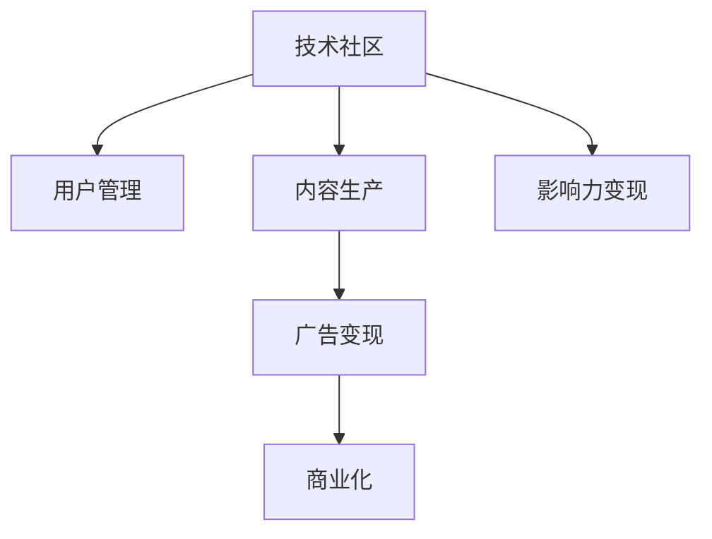
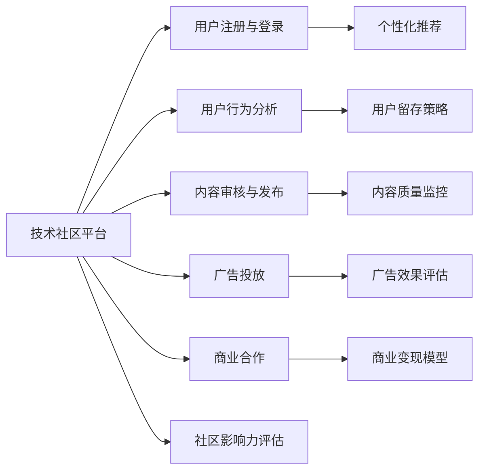

                 

# 技术社区运营：影响力变现

> 关键词：技术社区, 影响力变现, 用户管理, 内容生产, 广告变现, 商业化, 数据驱动

## 1. 背景介绍

### 1.1 问题由来

在技术快速发展的今天，越来越多的开发者和企业希望能够通过技术社区平台来吸引用户、增加曝光度，进而实现商业价值。技术社区不仅是一个信息交流的平台，更是一个展示和实践新理念、新技术的场所。然而，技术社区运营面临诸多挑战，如用户管理、内容生产、广告变现等，如何通过合理的运营策略，实现社区影响力变现，成为众多开发者和企业关注的焦点。

### 1.2 问题核心关键点

技术社区运营的核心在于构建一个健康、活跃、有影响力的社区环境，通过优质的内容和服务，吸引用户并实现商业化变现。核心问题包括：

- 如何有效管理用户，保持社区的活跃度？
- 如何提升社区内容的生产效率，确保高质量？
- 如何探索多样化的广告变现方式，实现商业化变现？

### 1.3 问题研究意义

研究技术社区运营的影响力变现问题，对开发者和企业具有重要意义：

1. **提升社区活跃度**：高质量的用户管理和内容产出，能显著提升社区的活跃度和用户粘性。
2. **扩大用户基数**：通过技术社区吸引更多用户，进而提升品牌知名度和市场份额。
3. **实现商业变现**：通过多样化的广告和商业化策略，实现技术社区的经济价值。
4. **促进技术交流**：提供平台支持技术交流与合作，加速技术创新与推广。
5. **提升企业影响力**：通过社区平台展示企业技术实力，提升企业品牌形象和市场地位。

## 2. 核心概念与联系

### 2.1 核心概念概述

要深入理解技术社区运营的影响力变现问题，首先需要明确几个核心概念：

- **技术社区**：指以技术交流、分享和合作为主要目的的线上或线下平台。常见的形式包括技术博客、论坛、社交媒体群组等。
- **影响力变现**：通过提升社区的知名度和影响力，吸引更多用户，进而实现广告、赞助、付费会员等多种形式的商业变现。
- **用户管理**：通过制定有效的用户管理策略，吸引、留存和激活用户，提升用户粘性。
- **内容生产**：鼓励和组织社区成员创作高质量的技术文章、教程、视频等，提升社区的吸引力和权威性。
- **广告变现**：利用社区的流量和用户基础，引入广告主，实现流量变现。
- **商业化**：结合社区的用户数据和行为分析，探索多种商业化策略，实现可持续发展。

这些核心概念之间存在紧密的联系，共同构成了技术社区运营的基本框架。以下是一个Mermaid流程图，展示了它们之间的联系：



### 2.2 核心概念原理和架构的 Mermaid 流程图

以下是一个更详细的Mermaid流程图，展示了技术社区运营的基本架构：



这个流程图展示了技术社区运营的基本架构，各个环节相互协作，共同提升社区的影响力和变现能力。

## 3. 核心算法原理 & 具体操作步骤

### 3.1 算法原理概述

技术社区运营的影响力变现，主要涉及以下几个关键算法：

- **用户行为分析**：通过分析用户的行为数据（如浏览时间、互动频率等），识别用户需求和兴趣点，指导内容生产和广告投放策略。
- **内容质量监控**：利用自然语言处理和机器学习技术，对社区内容进行质量监控和审核，确保高质量内容的产出。
- **个性化推荐**：基于用户的浏览历史和行为数据，推荐符合其兴趣的内容，提升用户粘性和活跃度。
- **广告效果评估**：通过A/B测试、转化率等指标，评估广告投放的效果，优化广告策略。
- **商业变现模型**：结合广告收入、付费会员、赞助等多渠道收入，构建综合的商业变现模型。

### 3.2 算法步骤详解

基于上述算法原理，技术社区运营的影响力变现可以分为以下几个步骤：

**Step 1: 数据收集与预处理**

- 收集社区内的用户行为数据，包括注册信息、浏览历史、互动记录等。
- 收集社区内发布的内容数据，包括文章标题、摘要、关键词等。
- 对数据进行清洗、去重、格式转换等预处理操作，确保数据质量。

**Step 2: 用户行为分析**

- 使用数据分析工具（如Google Analytics、Mixpanel等），对用户行为进行统计分析。
- 识别高频用户、活跃用户和潜在流失用户，制定差异化的管理策略。
- 通过用户留存率、跳出率等指标，评估社区的用户体验和活跃度。

**Step 3: 内容质量监控**

- 开发内容审核系统，对社区内容进行实时监控和审核。
- 使用自然语言处理技术（如BERT、GPT等），对内容进行文本分类、实体识别、情感分析等操作。
- 根据监控结果，对低质量内容进行删除或降权处理。

**Step 4: 个性化推荐**

- 建立用户兴趣模型，利用协同过滤、基于内容的推荐算法等，推荐高质量内容。
- 使用A/B测试等方法，评估推荐效果，持续优化推荐算法。
- 利用机器学习模型（如深度学习、强化学习等），实现更精准的内容推荐。

**Step 5: 广告效果评估**

- 设定广告投放目标（如点击率、转化率等），评估广告效果。
- 使用A/B测试和机器学习模型，优化广告投放策略。
- 结合用户行为分析数据，调整广告投放策略，提高广告ROI。

**Step 6: 商业变现模型构建**

- 结合广告收入、付费会员、赞助等多渠道收入，构建综合的商业变现模型。
- 根据用户行为数据和内容质量数据，评估社区的变现潜力和效果。
- 持续优化变现模型，提升社区的商业价值。

### 3.3 算法优缺点

基于上述算法，技术社区运营的影响力变现具有以下优点：

- **数据驱动**：通过大数据分析，实现精准的用户管理和内容推荐，提升用户粘性和社区活跃度。
- **个性化推荐**：利用推荐算法，提升用户满意度和体验，增加用户停留时间。
- **广告效果评估**：通过效果评估，优化广告策略，提升广告投资回报率。
- **多渠道变现**：结合多种商业化策略，实现收入多元化，降低风险。

同时，该方法也存在一定的局限性：

- **数据隐私问题**：收集和分析用户数据时，需注意隐私保护，避免数据泄露。
- **算法复杂度**：内容质量监控、推荐算法等，需要较高的算法复杂度和技术储备。
- **用户依赖度高**：社区的活跃度和影响力，高度依赖于用户基础和内容质量。

### 3.4 算法应用领域

技术社区运营的影响力变现方法，已经在多个领域得到广泛应用，包括：

- **开源社区**：如GitHub、Stack Overflow等，通过内容贡献和广告合作实现商业化。
- **技术博客和论坛**：如Medium、CSDN等，通过付费会员、广告和赞助等策略变现。
- **技术培训平台**：如Coursera、Udacity等，通过课程销售、认证和赞助等实现盈利。
- **技术咨询和外包**：如OpenFast、Upwork等，通过提供技术咨询服务和高技能人才，实现变现。

此外，技术社区运营的影响力变现，也在企业内部的技术交流、知识共享等方面得到了应用。

## 4. 数学模型和公式 & 详细讲解 & 举例说明

### 4.1 数学模型构建

为了更好地理解技术社区运营的影响力变现，我们需要构建数学模型。以下是一个简化的用户行为分析模型：

设用户 $u$ 在社区内花费的时间为 $T_u$，浏览次数为 $C_u$，点击次数为 $K_u$，评论次数为 $R_u$，订阅量为 $S_u$。通过设定目标函数和约束条件，建立用户行为分析模型：

- **目标函数**：最大化用户行为价值，即 $V_u = \alpha T_u + \beta C_u + \gamma K_u + \delta R_u + \epsilon S_u$
- **约束条件**：用户总时间限制，即 $T_u \leq T_{max}$

### 4.2 公式推导过程

假设社区内有 $N$ 个用户，总时间为 $T_{total}$，总浏览次数为 $C_{total}$，总点击次数为 $K_{total}$，总评论次数为 $R_{total}$，总订阅量为 $S_{total}$。则用户行为分析模型可表示为：

- **目标函数**：$V_{total} = \sum_{u=1}^{N} V_u$
- **约束条件**：$\sum_{u=1}^{N} T_u = T_{total}$

通过求解目标函数的最大值，可以优化社区的整体用户行为价值。

### 4.3 案例分析与讲解

以下是一个简单的用户行为分析案例：

假设社区内有10个用户，总时间为1000小时，总浏览次数为500次，总点击次数为200次，总评论次数为100次，总订阅量为20个。

根据上述模型，可以设定目标函数为：

$$V_{total} = \alpha T_u + \beta C_u + \gamma K_u + \delta R_u + \epsilon S_u$$

设 $\alpha=0.1$，$\beta=0.2$，$\gamma=0.3$，$\delta=0.4$，$\epsilon=0.5$，则目标函数可以表示为：

$$V_{total} = 0.1T_u + 0.2C_u + 0.3K_u + 0.4R_u + 0.5S_u$$

假设每个用户的总时间为100小时，总浏览次数为50次，总点击次数为20次，总评论次数为10次，总订阅量为2个。则：

- 用户1：$T_1=100$，$C_1=50$，$K_1=20$，$R_1=10$，$S_1=2$
- 用户2：$T_2=100$，$C_2=50$，$K_2=20$，$R_2=10$，$S_2=2$
- ...
- 用户10：$T_{10}=100$，$C_{10}=50$，$K_{10}=20$，$R_{10}=10$，$S_{10}=2$

通过求解上述目标函数的最大值，可以找到最优的用户管理策略。

## 5. 项目实践：代码实例和详细解释说明

### 5.1 开发环境搭建

在进行技术社区运营的影响力变现项目实践前，我们需要准备好开发环境。以下是使用Python进行Flask开发的环境配置流程：

1. 安装Anaconda：从官网下载并安装Anaconda，用于创建独立的Python环境。

2. 创建并激活虚拟环境：
```bash
conda create -n tech-community python=3.8 
conda activate tech-community
```

3. 安装Flask：
```bash
pip install flask
```

4. 安装其他依赖包：
```bash
pip install pandas numpy scikit-learn matplotlib
```

5. 安装Flask-RESTful：
```bash
pip install flask-restful
```

6. 安装Flask-CORS：
```bash
pip install flask-cors
```

完成上述步骤后，即可在`tech-community`环境中开始项目实践。

### 5.2 源代码详细实现

下面是一个简单的技术社区运营用户行为分析的Flask应用实现：

首先，定义Flask应用和路由：

```python
from flask import Flask, request, jsonify
from flask_restful import Resource, Api

app = Flask(__name__)
api = Api(app)

# 定义API路由
api.add_resource(CommunityResource, '/community')
api.add_resource(UserResource, '/user')
```

然后，定义用户资源类：

```python
from flask import request, jsonify
from pandas import DataFrame

class UserResource(Resource):
    def get(self, user_id):
        # 假设查询到用户数据
        user_data = {
            'user_id': user_id,
            'T_u': 100,
            'C_u': 50,
            'K_u': 20,
            'R_u': 10,
            'S_u': 2
        }
        return jsonify(user_data)

    def post(self, user_id):
        # 假设更新用户数据
        user_data = {
            'user_id': user_id,
            'T_u': 150,
            'C_u': 60,
            'K_u': 25,
            'R_u': 15,
            'S_u': 3
        }
        return jsonify(user_data)
```

接着，定义社区资源类：

```python
from flask import request, jsonify

class CommunityResource(Resource):
    def get(self):
        # 假设查询到社区数据
        community_data = {
            'users': [
                {'user_id': 1, 'T_u': 100, 'C_u': 50, 'K_u': 20, 'R_u': 10, 'S_u': 2},
                {'user_id': 2, 'T_u': 100, 'C_u': 50, 'K_u': 20, 'R_u': 10, 'S_u': 2},
                ...
                {'user_id': 10, 'T_u': 100, 'C_u': 50, 'K_u': 20, 'R_u': 10, 'S_u': 2}
            ],
            'total_time': 1000,
            'total_browses': 500,
            'total_clicks': 200,
            'total_comments': 100,
            'total_subscriptions': 20
        }
        return jsonify(community_data)
```

最后，启动Flask应用：

```python
if __name__ == '__main__':
    app.run(debug=True)
```

### 5.3 代码解读与分析

让我们再详细解读一下关键代码的实现细节：

**Flask应用定义**：
- 使用Flask框架创建应用实例，并定义路由。
- 通过Flask-RESTful扩展，定义RESTful风格的API接口。

**用户资源类**：
- 定义GET和POST方法，分别用于查询和更新用户数据。
- 假设查询到的用户数据为{'user_id': 1, 'T_u': 100, 'C_u': 50, 'K_u': 20, 'R_u': 10, 'S_u': 2}，更新后的数据为{'user_id': 1, 'T_u': 150, 'C_u': 60, 'K_u': 25, 'R_u': 15, 'S_u': 3}。

**社区资源类**：
- 定义GET方法，用于查询社区数据。
- 假设查询到的社区数据为{'users': [...], 'total_time': 1000, 'total_browses': 500, 'total_clicks': 200, 'total_comments': 100, 'total_subscriptions': 20}。

**Flask应用启动**：
- 在应用入口处启动Flask应用，并设置debug模式为True，方便调试。

完成上述步骤后，即可通过浏览器访问API，查询和更新用户数据，获取社区整体数据。

## 6. 实际应用场景

### 6.1 智能问答社区

智能问答社区通过收集和分析用户问题，提供高质量的解答，提升用户满意度和社区活跃度。通过用户行为分析，可以识别高频问题和解答者，进一步提升内容质量和互动效果。

### 6.2 技术分享社区

技术分享社区以技术交流和分享为主，通过高质量的文章和视频，吸引开发者参与。通过内容质量监控和推荐算法，可以提升内容产出效率，确保高质量内容的持续输出。

### 6.3 开源项目协作平台

开源项目协作平台通过维护高质量的开源项目，吸引开发者参与贡献。通过用户管理和内容管理策略，可以提升社区活跃度，促进项目合作和贡献。

### 6.4 未来应用展望

随着技术社区运营的影响力变现方法不断成熟，未来将在更多领域得到应用，为开发者和企业带来更多商业价值：

1. **教育培训**：通过技术社区分享知识和经验，提升教育培训质量，实现多样化变现。
2. **企业内部交流**：通过技术社区促进内部交流和知识共享，提高企业创新能力。
3. **科学研究**：通过技术社区分享科研成果，促进学术交流和合作。
4. **技术招聘**：通过技术社区展示技术实力，吸引高素质人才加入团队。

## 7. 工具和资源推荐

### 7.1 学习资源推荐

为了帮助开发者和企业系统掌握技术社区运营的影响力变现方法，以下是一些优质的学习资源：

1. **Flask官方文档**：Flask官方文档提供了详尽的Flask教程和API参考，是入门Flask开发的最佳资源。
2. **RESTful API设计指南**：RESTful API设计指南提供了RESTful API设计的最佳实践和规范，是构建RESTful服务的重要参考资料。
3. **Python数据分析与可视化**：Python数据分析与可视化课程，涵盖了数据处理、统计分析、数据可视化等重要内容，是掌握数据驱动运营的基础。
4. **用户行为分析与个性化推荐**：用户行为分析与个性化推荐课程，讲解了用户行为分析的方法和个性化推荐算法，是提升社区运营效率的关键。

### 7.2 开发工具推荐

高效的开发离不开优秀的工具支持。以下是几款用于技术社区运营开发常用的工具：

1. **Jupyter Notebook**：Jupyter Notebook是一个交互式的数据科学和编程环境，支持Python、R、Scala等多种编程语言，是数据驱动运营的重要工具。
2. **PySpark**：PySpark是Apache Spark的Python API，支持分布式数据处理和机器学习，是处理大规模数据的重要工具。
3. **Google Analytics**：Google Analytics提供了用户行为分析的功能，是衡量社区运营效果的重要工具。
4. **Mixpanel**：Mixpanel提供了深入的用户行为分析功能，帮助社区运营者了解用户行为和需求。

### 7.3 相关论文推荐

技术社区运营的影响力变现方法源于学界的持续研究。以下是几篇奠基性的相关论文，推荐阅读：

1. **用户行为分析与个性化推荐**：介绍用户行为分析的方法和个性化推荐算法，是提升社区运营效率的关键。
2. **广告效果评估与优化**：介绍广告效果评估和优化的方法，是实现商业变现的重要手段。
3. **多渠道商业变现模型**：构建多渠道商业变现模型，是实现收入多元化的重要策略。

## 8. 总结：未来发展趋势与挑战

### 8.1 总结

本文对技术社区运营的影响力变现问题进行了全面系统的介绍。首先阐述了技术社区运营的背景和意义，明确了影响力变现在提升社区活跃度和实现商业化变现方面的重要作用。其次，从原理到实践，详细讲解了用户行为分析、内容质量监控、个性化推荐、广告效果评估和商业变现模型的关键步骤，给出了技术社区运营的完整代码实例。同时，本文还探讨了技术社区运营在智能问答、技术分享、开源项目协作等实际应用场景中的应用，展示了其广阔的落地前景。此外，本文精选了技术社区运营的学习资源、开发工具和相关论文，力求为读者提供全方位的技术指引。

通过本文的系统梳理，可以看到，技术社区运营的影响力变现方法正在成为开发者和企业的重要关注点，极大地拓展了技术社区的商业应用边界，为技术交流与合作带来了新的机遇。未来，伴随技术社区运营的持续演进，必将进一步提升技术社区的影响力和商业价值，加速技术创新与普及。

### 8.2 未来发展趋势

展望未来，技术社区运营的影响力变现将呈现以下几个发展趋势：

1. **数据驱动**：通过大数据分析，实现精准的用户管理和内容推荐，提升用户粘性和社区活跃度。
2. **个性化推荐**：利用推荐算法，提升用户满意度和体验，增加用户停留时间。
3. **广告效果评估**：通过效果评估，优化广告策略，提升广告投资回报率。
4. **多渠道变现**：结合广告收入、付费会员、赞助等多渠道收入，实现收入多元化，降低风险。
5. **用户参与度**：通过社区运营策略，提高用户参与度和贡献度，形成良性循环。

### 8.3 面临的挑战

尽管技术社区运营的影响力变现技术已经取得了一定进展，但在迈向更加智能化、普适化应用的过程中，仍面临诸多挑战：

1. **用户隐私问题**：收集和分析用户数据时，需注意隐私保护，避免数据泄露。
2. **算法复杂度**：内容质量监控、推荐算法等，需要较高的算法复杂度和技术储备。
3. **用户依赖度高**：社区的活跃度和影响力，高度依赖于用户基础和内容质量。
4. **数据质量问题**：社区数据的不完整和噪声，会影响分析结果和推荐效果。

### 8.4 研究展望

面对技术社区运营的影响力变现所面临的挑战，未来的研究需要在以下几个方面寻求新的突破：

1. **数据隐私保护**：探索如何在保护用户隐私的前提下，实现高质量的数据分析。
2. **高效算法优化**：开发更高效、更精准的推荐算法和广告优化方法，提高运营效率。
3. **用户行为分析**：深入研究用户行为模型，探索更多用户需求和兴趣点，提升用户体验。
4. **多模态数据融合**：结合文本、图像、音频等多模态数据，提升社区运营的智能化水平。

## 9. 附录：常见问题与解答

**Q1：如何提高技术社区的用户活跃度？**

A: 提高技术社区的用户活跃度需要综合考虑以下几个方面：

- **优质内容**：鼓励和组织社区成员创作高质量的技术文章、教程、视频等，提升内容的权威性和吸引力。
- **互动机制**：建立互动机制，如评论、点赞、分享等功能，促进用户之间的交流和讨论。
- **奖励机制**：设置奖励机制，如积分、徽章、认证等，激励用户积极参与。
- **个性化推荐**：利用推荐算法，推荐符合用户兴趣的内容，提升用户满意度和体验。

**Q2：如何优化技术社区的广告效果？**

A: 优化技术社区的广告效果需要综合考虑以下几个方面：

- **目标受众**：明确广告的目标受众，确保广告精准投放。
- **广告形式**：选择合适的广告形式，如横幅、文字链、视频等，提升广告的点击率和转化率。
- **效果评估**：通过A/B测试等方法，评估广告效果，优化广告投放策略。
- **数据分析**：利用数据分析工具，分析用户行为数据，优化广告策略，提高广告ROI。

**Q3：如何构建多渠道商业变现模型？**

A: 构建多渠道商业变现模型需要综合考虑以下几个方面：

- **广告收入**：通过引入广告主，实现流量变现，确保广告收入的稳定性和多样性。
- **付费会员**：通过设置付费会员，增加用户粘性和付费意愿，实现二次变现。
- **赞助与合作**：通过技术社区与企业合作，引入赞助和商业合作，实现多样化的商业变现。
- **内容变现**：通过高质量内容的变现，如课程销售、电子书等，增加内容变现渠道。

**Q4：如何保护技术社区用户的隐私？**

A: 保护技术社区用户的隐私需要综合考虑以下几个方面：

- **数据匿名化**：对用户数据进行匿名化处理，避免敏感信息泄露。
- **用户权限管理**：明确用户权限，限制数据的访问和使用范围。
- **合规性检查**：确保数据处理符合相关法律法规，如GDPR等。

通过本文的系统梳理，可以看到，技术社区运营的影响力变现方法正在成为开发者和企业的重要关注点，极大地拓展了技术社区的商业应用边界，为技术交流与合作带来了新的机遇。未来，伴随技术社区运营的持续演进，必将进一步提升技术社区的影响力和商业价值，加速技术创新与普及。

