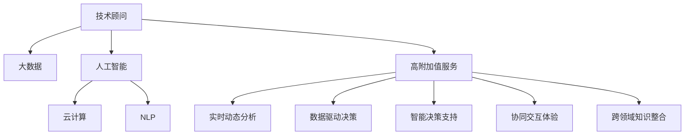

                 

# 技术顾问：高附加值服务的提供

> 关键词：技术顾问,高附加值服务,人工智能,数据分析,决策支持,云服务,新兴技术

## 1. 背景介绍

### 1.1 问题由来
在现代社会中，技术顾问已成为了企业决策过程中不可或缺的一环。无论是在投资、产品开发、运营管理还是市场营销等领域，企业的决策者都需要获得专业的技术建议和分析支持。传统的人工咨询模式在时间和成本上存在显著局限，难以满足企业日益增长的需求。

然而，随着信息技术的发展，特别是人工智能和大数据技术的成熟，技术顾问服务的模式正在发生深刻变革。新兴的技术顾问服务不仅能够提供更加精准的数据分析，还能进行更智能化的决策支持，为企业带来了更高的附加价值。本文将探讨这种新兴的高附加值服务，并给出相应的技术框架和实施建议。

### 1.2 问题核心关键点
高附加值技术顾问服务的核心在于利用人工智能、大数据等技术，提供更深度、更全面的数据分析和决策支持。其关键点包括：
- 数据驱动决策：通过大量数据分析，提供实证支持，提升决策的科学性和准确性。
- 实时动态分析：利用实时数据流技术，实现对市场变化和业务动向的动态监测和反应。
- 智能决策支持：使用AI算法和模型，预测未来趋势，推荐最佳策略。
- 协同交互体验：通过交互式界面，提升顾问与客户之间的互动效率和满意度。
- 跨领域知识整合：集成不同领域的专家知识，提供跨行业、跨学科的解决方案。

## 2. 核心概念与联系

### 2.1 核心概念概述

为更好地理解高附加值技术顾问服务的框架和实施流程，本节将介绍几个关键概念：

- 技术顾问：利用专业知识，为客户提供决策支持的专业服务人员。
- 高附加值服务：通过应用先进技术手段，为客户提供比传统服务更高的价值和效果的服务模式。
- 人工智能：包括机器学习、深度学习等技术，用于自动化、智能化的数据分析和决策支持。
- 大数据：指在海量数据中进行分析和挖掘，发现隐藏在数据背后的知识和规律。
- 云计算：提供按需、灵活的计算和存储资源，支持大数据处理和分布式计算。
- 自然语言处理（NLP）：使计算机能够理解和生成人类语言，支持智能交互和文本分析。

这些概念之间的逻辑关系可以通过以下Mermaid流程图来展示：



这个流程图展示了几者之间的关系：

1. 技术顾问利用大数据和人工智能技术，提升服务的深度和广度。
2. 大数据和人工智能技术在云计算的支持下，实现高效的分布式计算和存储。
3. 通过NLP技术，实现智能化的文本分析和自然语言交互。
4. 通过高附加值服务模式，将大数据和人工智能分析结果融入决策支持中。

## 3. 核心算法原理 & 具体操作步骤

### 3.1 算法原理概述

高附加值技术顾问服务的技术框架基于以下几个核心算法和原理：

- 机器学习：通过历史数据和案例，训练模型预测未来趋势和优化策略。
- 深度学习：利用多层神经网络，从大量非结构化数据中挖掘出有价值的信息。
- 自然语言处理：分析和理解客户需求和市场趋势，提供个性化和智能化的建议。
- 数据挖掘：通过算法挖掘出数据背后的模式和关联，提供基于事实的决策支持。
- 预测建模：使用时间序列分析和统计模型，预测市场变化和趋势。
- 协同推荐系统：根据用户行为和历史数据，推荐最适合的解决方案。

### 3.2 算法步骤详解

高附加值技术顾问服务的核心步骤包括数据采集、分析、建模和应用。

**Step 1: 数据采集与预处理**
- 收集与决策问题相关的各种数据源，包括内部系统数据、第三方数据等。
- 清洗和格式化数据，确保数据质量。

**Step 2: 数据分析与建模**
- 使用机器学习、深度学习等算法，对数据进行分析和建模。
- 建立预测模型和推荐模型，生成业务洞察和建议。

**Step 3: 智能决策支持**
- 将模型结果和业务洞察转化为具体的决策建议和行动方案。
- 使用自然语言处理技术，将结果以易于理解和操作的形式呈现给客户。

**Step 4: 应用与反馈**
- 将决策支持结果应用于实际业务中，进行效果评估和优化。
- 根据客户反馈和业务实际，调整模型和策略。

### 3.3 算法优缺点

高附加值技术顾问服务具有以下优点：
- 深度分析：利用大数据和人工智能技术，提供深入的数据分析和预测。
- 实时响应：通过云计算和实时数据流技术，实现对市场变化和业务动向的实时监测。
- 高价值：提供基于事实的决策支持和策略优化，提升企业决策的科学性和准确性。
- 灵活互动：利用自然语言处理技术，提供智能化的交互体验，提升客户满意度。

同时，该服务也存在以下局限性：
- 数据依赖：高度依赖高质量、充分的数据，数据缺失或不准确会影响结果。
- 技术门槛：涉及复杂的技术算法和工具，需要专业知识和经验。
- 成本投入：需要投入大量的时间和资源进行数据分析和模型训练。
- 结果可解释性：模型结果的解释性不足，可能影响决策的可信度和可接受性。
- 系统风险：复杂系统可能存在故障和漏洞，影响服务稳定性。

尽管存在这些局限性，高附加值技术顾问服务仍因其独特的价值和优势，成为越来越多企业追求的目标。未来相关研究的重点在于如何进一步降低技术门槛，提高数据质量和模型解释性，同时兼顾成本和效果。

### 3.4 算法应用领域

高附加值技术顾问服务在多个领域有着广泛的应用前景，例如：

- 投资分析：通过数据分析和建模，为客户提供股票、基金等投资组合的优化建议。
- 市场营销：利用消费者行为数据，进行市场细分和客户画像，提供个性化营销策略。
- 供应链管理：通过实时数据流，监控和优化供应链各个环节的效率和成本。
- 人力资源管理：基于员工绩效和市场数据，提供招聘、培训和绩效提升的策略建议。
- 客户服务：利用自然语言处理技术，进行智能客服和客户反馈分析，提升客户满意度。
- 风险管理：通过数据分析，识别和评估企业面临的风险，制定相应的风险控制措施。
- 运营优化：利用运营数据和机器学习，优化生产流程和运营策略，提高运营效率。

## 4. 数学模型和公式 & 详细讲解 & 举例说明

### 4.1 数学模型构建

高附加值技术顾问服务的核心数学模型包括：

- 预测模型：基于历史数据，建立时间序列模型或回归模型，预测未来趋势。
- 分类模型：使用逻辑回归、支持向量机等算法，分类客户行为和市场动向。
- 聚类模型：通过K-means、层次聚类等算法，对客户进行细分和分类。
- 推荐模型：利用协同过滤、内容推荐等算法，推荐最适合的产品或服务。
- 文本分析模型：利用TF-IDF、LDA等算法，进行情感分析、主题建模等。

这些模型的建立和优化，需要基于大量的历史数据和业务知识，通过交叉验证和模型调参，保证模型的准确性和泛化能力。

### 4.2 公式推导过程

以预测模型为例，假设我们要建立基于时间序列的预测模型。常见的模型包括ARIMA模型和LSTM模型。

**ARIMA模型：**
ARIMA模型的公式为：
$$
Y_t = c + \sum_{i=1}^{p} \alpha_i Y_{t-i} + \sum_{j=1}^{d} \Delta^j Y_t + \sum_{k=1}^{q} \beta_k \epsilon_{t-k}
$$
其中，$Y_t$ 表示第 $t$ 个时间点的预测值，$\Delta$ 表示一阶差分，$\epsilon_t$ 表示随机误差。$p$、$d$、$q$ 分别为AR、差分阶数和MA模型的阶数。$\alpha_i$ 和 $\beta_k$ 为模型系数。

**LSTM模型：**
LSTM模型的公式为：
$$
h_t = f(r_t, h_{t-1}) \cdot h_{t-1} + i(r_t, h_{t-1}) \cdot \tanh(W_x x_t + U_x h_{t-1} + b_x) + o(r_t, h_{t-1}) \cdot \tanh(W_c h_{t-1} + b_c) + \tanh(W_f h_{t-1} + b_f)
$$
其中，$h_t$ 为第 $t$ 个时间点的隐藏状态，$x_t$ 为输入向量，$r_t$ 为门控单元。$f$、$i$、$o$、$f$ 分别为遗忘门、输入门、输出门和细胞门的激活函数，$W_x$、$U_x$、$b_x$、$W_c$、$b_c$ 为模型参数。

LSTM模型通过门控机制，能够有效地捕捉时间序列数据的长期依赖关系，适用于复杂的预测任务。

### 4.3 案例分析与讲解

以投资分析为例，说明如何利用高附加值技术顾问服务，提升投资决策的科学性和准确性。

假设某公司需要评估一支股票的长期表现，并制定投资策略。首先，从公司内部的财务报表、行业报告等数据源中，收集与该股票相关的历史数据。然后，利用机器学习算法，对这些数据进行分析和建模。例如，可以使用线性回归模型，将过去几年的股票价格、市场指数、公司财务指标等作为特征，预测未来一年的股价走势。

具体步骤如下：

1. 数据预处理：清洗和格式化数据，去除缺失值和异常值。
2. 特征工程：选择和构造影响股价的特征，如每股收益、市盈率、市场情绪指数等。
3. 模型训练：使用线性回归模型，训练预测模型，生成股价预测结果。
4. 结果分析：对模型结果进行评估和解释，生成投资建议和风险评估。

通过这样的流程，企业可以获得更科学、更准确的投资决策支持，降低投资风险，提升投资收益。

## 5. 项目实践：代码实例和详细解释说明

### 5.1 开发环境搭建

在进行高附加值技术顾问服务开发前，需要准备好开发环境。以下是使用Python进行Scikit-learn和TensorFlow开发的环境配置流程：

1. 安装Anaconda：从官网下载并安装Anaconda，用于创建独立的Python环境。

2. 创建并激活虚拟环境：
```bash
conda create -n advisortools python=3.8 
conda activate advisortools
```

3. 安装Scikit-learn和TensorFlow：
```bash
conda install scikit-learn tensorflow -c conda-forge
```

4. 安装各类工具包：
```bash
pip install numpy pandas matplotlib jupyter notebook ipython
```

完成上述步骤后，即可在`advisortools`环境中开始项目实践。

### 5.2 源代码详细实现

这里我们以LSTM模型进行股票价格预测为例，给出使用Scikit-learn和TensorFlow进行高附加值技术顾问服务开发的PyTorch代码实现。

首先，定义模型和超参数：

```python
import tensorflow as tf
from tensorflow.keras.layers import LSTM, Dense
from tensorflow.keras.models import Sequential
from sklearn.preprocessing import MinMaxScaler

input_dim = 5
output_dim = 1
epochs = 100
batch_size = 32
hidden_units = 64

scaler = MinMaxScaler(feature_range=(0, 1))
train_data = scaler.fit_transform(train_data)
test_data = scaler.transform(test_data)
```

然后，定义训练和评估函数：

```python
def create_model():
    model = Sequential()
    model.add(LSTM(hidden_units, return_sequences=True, input_shape=(input_dim, 1)))
    model.add(LSTM(hidden_units))
    model.add(Dense(units=output_dim, activation='linear'))
    model.compile(loss='mse', optimizer='adam')
    return model

def train_model(model, train_data, test_data):
    model.fit(train_data, train_labels, epochs=epochs, batch_size=batch_size, verbose=2)
    test_loss = model.evaluate(test_data, test_labels, verbose=0)
    return test_loss

# 训练模型
model = create_model()
train_loss = train_model(model, train_data, test_data)
print('Test loss:', train_loss)
```

最后，启动训练流程并在测试集上评估：

```python
import numpy as np
import pandas as pd

# 构建训练数据集
train_data = pd.read_csv('train.csv')
train_labels = train_data['close']

# 将数据转换为时间序列
train_data = train_data.dropna()
train_data.index = pd.DatetimeIndex(train_data['date'])
train_data = train_data['open'].values.reshape(-1, 1)

# 构建测试数据集
test_data = pd.read_csv('test.csv')
test_data = test_data.dropna()
test_data.index = pd.DatetimeIndex(test_data['date'])
test_data = test_data['open'].values.reshape(-1, 1)

# 拆分数据集
train_size = int(len(train_data) * 0.7)
test_size = len(train_data) - train_size
train_data, val_data = train_data[:train_size], train_data[train_size:]
test_data, test_labels = test_data[:test_size], test_data[test_size:]

# 标准化数据
scaler = MinMaxScaler(feature_range=(0, 1))
train_data = scaler.fit_transform(train_data)
val_data = scaler.transform(val_data)
test_data = scaler.transform(test_data)

# 模型训练和评估
train_loss = train_model(model, train_data, val_data)
print('Val loss:', val_loss)

# 预测
predictions = model.predict(test_data)
predictions = scaler.inverse_transform(predictions)
```

以上就是使用Scikit-learn和TensorFlow进行股票价格预测的完整代码实现。可以看到，借助这些强大工具，我们可以轻松实现复杂的高附加值技术顾问服务。

### 5.3 代码解读与分析

让我们再详细解读一下关键代码的实现细节：

**LSTM模型定义：**
- 首先，我们定义了一个包含两个LSTM层和一个Dense层的神经网络模型。第一个LSTM层返回序列输出，第二个LSTM层没有返回序列输出。Dense层用于预测，激活函数为线性。

**数据标准化：**
- 使用MinMaxScaler对训练数据和测试数据进行标准化，确保数据分布一致。

**模型训练和评估：**
- 使用训练数据和标签进行模型训练，并通过测试数据和标签进行模型评估，计算测试损失。

**预测和逆标准化：**
- 使用训练好的模型对测试数据进行预测，并通过逆标准化还原预测结果。

可以看到，借助Scikit-learn和TensorFlow，模型构建和训练过程变得非常简单和高效。开发者可以将更多精力放在业务逻辑和数据分析上，而不必过多关注底层实现细节。

## 6. 实际应用场景

### 6.1 智能客服系统

高附加值技术顾问服务在智能客服系统中有着广泛的应用。传统客服系统依赖人工处理，难以应对大规模客户咨询，且客服质量难以保障。通过技术顾问服务，可以自动分析客户咨询意图，提供快速、准确的智能回复，大幅提升客户满意度。

具体而言，可以使用自然语言处理技术，对客户咨询进行情感分析和意图识别，生成合适的回复模板。同时，利用预测模型，对常见的咨询问题进行预判和分类，实现个性化和智能化的客服体验。

### 6.2 金融风险管理

高附加值技术顾问服务在金融风险管理中同样具有重要作用。金融机构需要实时监控市场动向和客户行为，预测风险变化，及时采取应对措施。

具体而言，可以构建基于时间序列分析的预测模型，对市场波动、客户交易行为等数据进行实时分析，预测潜在的风险事件。利用协同推荐系统，为客户推荐最适合的资产配置方案，降低投资风险。

### 6.3 市场营销分析

高附加值技术顾问服务在市场营销分析中也有着显著的应用。企业需要全面了解市场动向和消费者行为，制定精准的市场策略。

具体而言，可以利用机器学习算法，对消费者购买行为、社交媒体评论等数据进行分析，发现隐藏的市场趋势和消费者偏好。结合自然语言处理技术，生成营销策略和广告文案，提升广告投放效果。

### 6.4 未来应用展望

随着高附加值技术顾问服务的不断成熟，其在更多领域的应用前景将更加广阔。

在智慧城市治理中，利用大数据和人工智能技术，对城市运行数据进行实时分析，预测和预防突发事件，提升城市管理水平。

在智慧医疗领域，通过分析医疗数据，预测疾病趋势，推荐最佳治疗方案，提升医疗服务质量。

在智慧教育中，利用数据分析技术，个性化推荐学习资源，提升教育效果和学生满意度。

此外，在智能制造、智慧交通、智能物流等众多领域，高附加值技术顾问服务也将带来深刻的变革，为社会各行业的数字化转型提供有力支撑。

## 7. 工具和资源推荐

### 7.1 学习资源推荐

为了帮助开发者系统掌握高附加值技术顾问服务的理论和实践，这里推荐一些优质的学习资源：

1. 《机器学习实战》：一本通俗易懂的机器学习入门书籍，介绍了多种机器学习算法及其应用。

2. TensorFlow官方文档：TensorFlow的官方文档，提供了丰富的学习资源和样例代码，是学习TensorFlow的最佳资料。

3. Scikit-learn官方文档：Scikit-learn的官方文档，提供了详尽的算法介绍和应用案例，是学习机器学习算法的必备资料。

4. Coursera《机器学习》课程：由斯坦福大学开设的机器学习课程，内容深入浅出，适合初学者和进阶学习者。

5. Kaggle数据科学竞赛：Kaggle是一个全球性的数据科学竞赛平台，提供了丰富的数据集和样例代码，可以实战练习各种机器学习技术。

通过对这些资源的学习实践，相信你一定能够快速掌握高附加值技术顾问服务的精髓，并用于解决实际的业务问题。

### 7.2 开发工具推荐

高附加值技术顾问服务的开发需要依赖多种先进技术工具。以下是几款常用的开发工具：

1. Scikit-learn：Python的机器学习库，提供了丰富的机器学习算法和工具。

2. TensorFlow：由Google开发的深度学习框架，支持分布式计算和模型训练。

3. PyTorch：由Facebook开发的深度学习框架，支持动态计算图和高效的模型训练。

4. Keras：基于TensorFlow和Theano的深度学习框架，易于使用，适合快速原型开发。

5. Jupyter Notebook：交互式的开发环境，支持代码块、图表、文档等多种格式，适合快速迭代和调试。

6. Google Colab：谷歌提供的云环境，支持GPU计算和自动化实验记录，适合大规模实验和协作开发。

合理利用这些工具，可以显著提升高附加值技术顾问服务的开发效率，加快创新迭代的步伐。

### 7.3 相关论文推荐

高附加值技术顾问服务的发展离不开学界的持续研究。以下是几篇奠基性的相关论文，推荐阅读：

1. "Deep Learning" by Ian Goodfellow: 经典深度学习教材，介绍了深度学习的基本原理和应用。

2. "Pattern Recognition and Machine Learning" by Christopher Bishop: 机器学习领域经典教材，介绍了机器学习的基本算法和应用。

3. "The Elements of Statistical Learning" by Trevor Hastie, Robert Tibshirani, Jerome Friedman: 统计学习领域经典教材，介绍了统计学习的基本理论和算法。

4. "A Survey of Online Learning with Online-First Real-World Applications" by Haifeng Wang et al.: 综述文章，介绍了在线学习的最新进展和应用场景。

5. "A Survey on Transfer Learning and Domain Adaptation" by Kamal Banerjee et al.: 综述文章，介绍了迁移学习的基本概念和应用方法。

这些论文代表了大附加值技术顾问服务的发展脉络。通过学习这些前沿成果，可以帮助研究者把握学科前进方向，激发更多的创新灵感。

## 8. 总结：未来发展趋势与挑战

### 8.1 总结

本文对高附加值技术顾问服务进行了全面系统的介绍。首先阐述了技术顾问服务在现代企业决策中的重要性和现状，明确了高附加值服务在高价值决策支持中的独特价值。其次，从原理到实践，详细讲解了高附加值服务的算法框架和实施步骤，给出了具体的代码实例。同时，本文还探讨了高附加值服务在多个行业领域的应用前景，展示了其巨大的应用潜力。最后，推荐了相应的学习资源和开发工具，力求为读者提供全方位的技术指引。

通过本文的系统梳理，可以看到，高附加值技术顾问服务正在成为企业决策支持的重要手段，极大地提升了决策的科学性和准确性。未来，伴随大数据和人工智能技术的进一步发展，高附加值服务将获得更广泛的应用，进一步推动企业数字化转型和智能化升级。

### 8.2 未来发展趋势

展望未来，高附加值技术顾问服务将呈现以下几个发展趋势：

1. 数据驱动决策：随着数据量的不断增大和处理技术的不断进步，数据驱动的决策将更加深入和全面，成为企业决策的主流方式。

2. 实时动态分析：利用实时数据流和分布式计算技术，实现对市场变化和业务动向的实时监测和反应，提升决策的及时性和准确性。

3. 智能决策支持：结合机器学习、深度学习等算法，提供更精准的预测和策略优化建议，提升决策的科学性和可行性。

4. 自然语言处理：利用自然语言处理技术，提升与客户的交互体验，提供更智能、更个性化的决策支持。

5. 跨领域知识整合：集成不同领域的专家知识，提供跨行业、跨学科的解决方案，提升决策的全面性和系统性。

以上趋势凸显了高附加值技术顾问服务的发展方向。这些方向的探索发展，将进一步提升企业决策的科学性和准确性，为企业的数字化转型和智能化升级提供有力支撑。

### 8.3 面临的挑战

尽管高附加值技术顾问服务已经取得了显著成就，但在迈向更加智能化、普适化应用的过程中，仍面临诸多挑战：

1. 数据质量问题：高质量的数据是决策支持的基础，但数据获取和处理往往面临瓶颈，数据缺失或不准确会影响模型效果。

2. 技术门槛高：涉及复杂的算法和工具，需要专业知识和经验，难以快速普及和应用。

3. 成本投入大：数据采集、模型训练和系统部署需要大量资源和时间，成本较高。

4. 结果可解释性不足：模型结果的解释性不足，可能影响决策的可信度和可接受性。

5. 系统风险高：复杂系统可能存在故障和漏洞，影响服务稳定性和安全性。

尽管存在这些挑战，高附加值技术顾问服务仍因其独特的价值和优势，成为越来越多企业追求的目标。未来相关研究的重点在于如何进一步降低技术门槛，提高数据质量和模型解释性，同时兼顾成本和效果。

### 8.4 研究展望

面对高附加值技术顾问服务所面临的挑战，未来的研究需要在以下几个方面寻求新的突破：

1. 数据采集和预处理技术：开发高效、自动化的数据采集和清洗工具，提升数据质量。

2. 模型优化和解释技术：开发更高效、更易解释的机器学习算法，提升模型的可解释性和可靠性。

3. 实时数据流技术：开发实时数据流处理技术，实现对市场变化和业务动向的实时监测和反应。

4. 跨领域知识整合技术：开发跨领域知识抽取和整合技术，提升决策的全面性和系统性。

5. 安全性和隐私保护：开发数据安全和隐私保护技术，保障数据和模型安全。

这些研究方向的探索，将引领高附加值技术顾问服务迈向更高的台阶，为企业的数字化转型和智能化升级提供有力支撑。面向未来，高附加值技术顾问服务还需要与其他人工智能技术进行更深入的融合，如知识表示、因果推理、强化学习等，多路径协同发力，共同推动企业决策的科学化和智能化。只有勇于创新、敢于突破，才能不断拓展高附加值服务的应用范围，为企业的数字化转型和智能化升级提供更全面的技术支持。

## 9. 附录：常见问题与解答

**Q1：如何选择合适的机器学习算法？**

A: 选择合适的机器学习算法需要考虑数据类型、问题类型、计算资源等因素。常见的算法包括：
- 线性回归：适用于连续值预测问题。
- 逻辑回归：适用于二分类问题。
- 决策树：适用于分类和回归问题，易于理解和解释。
- 随机森林：适用于分类和回归问题，具有较高的准确性和鲁棒性。
- 支持向量机：适用于分类和回归问题，适用于高维数据。
- 神经网络：适用于复杂的数据挖掘和预测问题。

要根据具体问题选择合适的算法，并进行模型调参和评估，以获得最佳的模型效果。

**Q2：如何提高机器学习模型的泛化能力？**

A: 提高机器学习模型的泛化能力需要从数据、模型和算法等多个方面入手：
- 数据方面：收集高质量、多样化的数据，避免数据过拟合。
- 模型方面：选择合适的网络结构，进行正则化处理，避免模型过拟合。
- 算法方面：使用交叉验证、网格搜索等技术进行模型调参，选择最优模型。
- 集成学习：使用集成学习方法，如Bagging、Boosting等，提升模型泛化能力。

通过这些措施，可以有效地提高模型的泛化能力，提升其在实际应用中的表现。

**Q3：如何处理缺失数据？**

A: 处理缺失数据的方法包括：
- 删除缺失数据：删除包含缺失值的样本或特征，适用于数据量较大的情况。
- 均值填补：用特征的均值填补缺失值，适用于特征值分布较为均匀的情况。
- 插值法：使用插值法，如线性插值、多项式插值等，填补缺失值。
- 预测法：使用其他数据预测缺失值，如回归预测、分类预测等。

需要根据具体问题选择合适的方法，并进行合理的参数设置。

**Q4：如何提高模型训练效率？**

A: 提高模型训练效率的方法包括：
- 数据增强：通过数据增强技术，如随机裁剪、旋转、缩放等，扩充训练集，提高模型泛化能力。
- 模型剪枝：使用模型剪枝技术，去除冗余参数，提高模型效率。
- 分布式训练：使用分布式训练技术，如TensorFlow的TPU、PyTorch的DataParallel等，加速模型训练。
- 批量大小优化：根据计算资源，合理设置批量大小，提高训练速度。
- 模型优化器：选择合适的优化器，如Adam、Adagrad等，提高训练效率。

通过这些措施，可以显著提升模型训练效率，缩短训练时间。

**Q5：如何提高模型解释性？**

A: 提高模型解释性需要从多个方面入手：
- 使用可解释性较强的模型，如决策树、线性回归等。
- 使用可解释性算法，如LIME、SHAP等，生成模型解释报告。
- 特征重要性分析：使用特征重要性分析方法，如GBDT的特征重要性、LASSO的特征系数等，解释模型决策过程。
- 可视化工具：使用可视化工具，如Matplotlib、Seaborn等，展示模型结果和特征关系。

通过这些措施，可以提升模型的解释性，增强决策的可信度和可接受性。

---

作者：禅与计算机程序设计艺术 / Zen and the Art of Computer Programming

