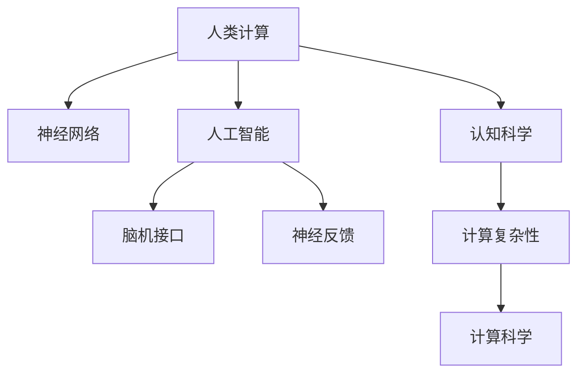

                 

## 1. 背景介绍

### 1.1 问题由来
人类计算的科学探索，是跨学科融合、交叉研究的一个前沿领域。它旨在通过科学计算和数据挖掘，揭示人类大脑与计算机系统间深层次的关联，探索认知科学、神经科学、人工智能等领域交叉带来的新机遇。人类计算旨在从宏观和微观两方面，对人类思维的运行机制进行探究，实现对智能计算的突破。

### 1.2 问题核心关键点
人类计算的核心在于将认知科学、神经科学、人工智能与计算科学相结合，从计算视角理解人类思维，并在此基础上构建新型计算模型，提升智能系统的性能。其核心问题包括：

- 如何通过计算模型模拟人类认知过程？
- 如何提取和利用大规模神经数据，构建高效的神经网络模型？
- 如何将计算科学和认知科学的研究成果，应用到实际人工智能系统开发中？
- 如何利用跨学科方法，解决智能系统中存在的瓶颈问题，如可解释性、鲁棒性等？

### 1.3 问题研究意义
人类计算作为连接神经科学、认知科学与人工智能的桥梁，对提高智能系统的理解和控制能力，具有重要意义：

- 提升智能系统性能。通过对人类计算机制的深入理解，可以优化现有模型，提升其在处理复杂任务中的表现。
- 提供科学依据。人类计算研究揭示了人类思维的运行机制，为构建更高效、更自然的计算模型提供了理论基础。
- 推动跨学科研究。跨领域的研究方法为认知科学和人工智能领域的深入交流和合作提供了新的途径。
- 促进技术应用。人类计算的研究成果，有望应用于脑机接口、神经反馈训练、心理治疗等多个领域，提升人类生活质量。

## 2. 核心概念与联系

### 2.1 核心概念概述

为更好地理解人类计算的科学探索，本节将介绍几个关键概念：

- 人类计算(Human Computing)：指通过科学计算方法和模型，模拟人类认知过程，从而提升智能系统的理解和控制能力。
- 神经网络(Neural Network)：基于人工神经元构建的计算模型，通过模拟人类神经元间的信号传递，实现高效的计算和推理。
- 认知科学(Cognitive Science)：研究人类思维、意识、学习等心理现象的科学，探讨人类认知的心理学基础和神经机制。
- 人工智能(Artificial Intelligence)：使用算法和模型，使计算机系统具备类人智能，解决复杂问题，提高工作效率。
- 脑机接口(Brain-Computer Interface, BCIs)：通过电信号等手段，实现人脑与计算机系统的直接交互。
- 神经反馈(Neural Feedback)：利用大脑活动实时反馈，指导认知训练，提升注意力、记忆等能力。
- 计算复杂性(Computational Complexity)：研究问题在计算机上求解难度的问题，人类计算研究希望揭示认知过程的复杂性。

这些核心概念之间的逻辑关系可以通过以下Mermaid流程图来展示：



这个流程图展示了一些关键概念之间的关系：

1. 人类计算通过模拟神经网络，实现对人类认知过程的建模。
2. 认知科学研究人类心理和神经机制，为人类计算提供理论依据。
3. 人工智能在人类计算的理论基础上，探索高效计算方法，解决实际问题。
4. 脑机接口和神经反馈技术，促进人类计算与神经科学研究的融合。
5. 计算复杂性研究人类计算的计算难度，指导模型优化。

这些概念共同构成了人类计算的科学探索框架，提供了理解智能系统新路径。

## 3. 核心算法原理 & 具体操作步骤

### 3.1 算法原理概述

人类计算的核心算法原理，主要包括以下几个方面：

- 神经网络：通过多层神经元的连接，模拟人类大脑的信息传递和处理过程。
- 认知建模：构建认知模型，模拟人类大脑对输入信息的解释、推理和决策。
- 反馈控制：利用大脑活动实时反馈，优化认知过程，提高系统效率。
- 数据挖掘：从大规模神经数据中提取特征，构建高效的神经网络模型。
- 计算复杂性：研究认知过程的计算复杂性，揭示人类计算的极限和瓶颈。

这些原理共同构成了人类计算的核心算法体系。

### 3.2 算法步骤详解

基于以上原理，人类计算的科学探索可以分为以下几个关键步骤：

**Step 1: 神经数据收集与预处理**
- 收集神经数据：通过脑电图(EEG)、功能性磁共振成像(fMRI)等技术，获取大规模神经数据。
- 数据预处理：去除噪声，进行归一化处理，提取特征。

**Step 2: 神经网络构建与训练**
- 选择神经网络架构：如卷积神经网络(CNN)、递归神经网络(RNN)、深度信念网络(DBN)等。
- 设计损失函数：如均方误差(MSE)、交叉熵(Cross Entropy)等。
- 训练神经网络：通过反向传播算法，最小化损失函数，优化模型参数。

**Step 3: 认知建模与仿真**
- 构建认知模型：如联结主义模型、反应时模型等。
- 仿真实验：将神经网络输出与认知模型预测结果对比，优化认知模型参数。

**Step 4: 反馈控制与优化**
- 实时反馈：通过脑机接口技术，收集大脑活动信息，进行实时反馈。
- 控制优化：利用反馈信息，调整认知模型参数，优化认知过程。

**Step 5: 数据挖掘与模型优化**
- 特征提取：从大规模神经数据中提取关键特征。
- 模型优化：通过正则化、Dropout等技术，提升神经网络模型性能。

### 3.3 算法优缺点

人类计算的科学探索具有以下优点：
1. 跨学科融合。将认知科学、神经科学、人工智能与计算科学相结合，提供全新的研究方向。
2. 模拟人类认知。通过神经网络等计算模型，模拟人类大脑的信息处理机制。
3. 实时优化。通过实时反馈控制，优化认知过程，提高系统效率。
4. 数据驱动。利用大规模神经数据，优化模型性能，提升计算能力。

但同时，该方法也存在一定的局限性：
1. 数据获取难度大。神经数据的采集和处理技术复杂，成本高。
2. 数据隐私问题。大规模神经数据的收集和使用，可能引发隐私保护问题。
3. 算法复杂度高。认知模型的构建和仿真，涉及复杂的计算和优化问题。
4. 跨学科沟通难。不同学科背景的专家，在研究方法、术语等方面存在差异，难以协同合作。

尽管存在这些局限性，但就目前而言，人类计算的科学探索仍是大数据、人工智能和神经科学交叉研究的重要方向。未来相关研究的重点在于如何进一步降低数据获取难度，提高模型实时优化能力，同时兼顾隐私保护和跨学科合作。

### 3.4 算法应用领域

人类计算的科学探索已在多个领域得到应用，例如：

- 脑机接口(Brain-Computer Interface, BCIs)：通过电信号等手段，实现人脑与计算机系统的直接交互。已应用于游戏控制、康复训练、军事指挥等领域。
- 认知增强(Cognitive Enhancement)：利用神经反馈等技术，提升人类的注意力、记忆力、决策能力等。应用于职业培训、心理治疗、教育辅助等多个场景。
- 人工智能(Artificial Intelligence)：在人类计算的研究基础上，提升机器的认知能力和决策能力。应用于图像识别、语音识别、自然语言处理等多个领域。
- 计算复杂性(Computational Complexity)：研究人类计算的计算难度，指导高效计算模型的开发。应用于复杂问题求解、系统优化、信息检索等领域。
- 神经反馈(Neural Feedback)：利用大脑活动实时反馈，指导认知训练，提升认知能力。应用于认知训练、精神疾病治疗等领域。

除了上述这些经典应用外，人类计算的研究成果，还在智能决策、神经控制、信息融合等多个领域得到创新应用，为人类的认知与智能进步开辟了新的路径。

## 4. 数学模型和公式 & 详细讲解 & 举例说明

### 4.1 数学模型构建

在人类计算中，我们通常使用神经网络模型来模拟人类大脑的信息处理过程。这里以深度卷积神经网络(Deep Convolutional Neural Network, CNN)为例，构建一个简单的认知模型。

### 4.2 公式推导过程

设输入数据 $x$ 为 $m \times n$ 的二维矩阵，神经网络由 $L$ 层构成，每层包含 $N$ 个神经元。神经元间的连接权重为 $w$，偏置为 $b$，激活函数为 $f$。神经网络输出的计算公式为：

$$
h_l = f\left(\sum_{i=1}^N w_{li}h_{l-1} + b_l\right) \quad (1)
$$

其中，$h_l$ 为第 $l$ 层的输出，$h_{l-1}$ 为第 $l-1$ 层的输出。通过多层计算，最终得到神经网络的输出 $h_L$。

神经网络的损失函数通常为交叉熵损失函数：

$$
\mathcal{L} = -\frac{1}{N} \sum_{i=1}^N \sum_{j=1}^C y_{ij} \log h_j(x_i) \quad (2)
$$

其中，$N$ 为样本数，$C$ 为类别数，$y_{ij}$ 为样本 $i$ 属于类别 $j$ 的标签，$h_j$ 为第 $j$ 个输出节点的激活值。

神经网络的参数优化通常使用反向传播算法，最小化损失函数：

$$
\frac{\partial \mathcal{L}}{\partial w} = \frac{\partial \mathcal{L}}{\partial h_L} \frac{\partial h_L}{\partial h_{L-1}} \cdots \frac{\partial h_2}{\partial h_1} \frac{\partial h_1}{\partial w} \quad (3)
$$

其中，$\frac{\partial \mathcal{L}}{\partial h_L}$ 为输出层损失函数的梯度，$\frac{\partial h_L}{\partial h_{L-1}}$ 为反向传播过程中各层的导数计算，$\frac{\partial h_1}{\partial w}$ 为输入层对权重的梯度。

### 4.3 案例分析与讲解

以下以简单的图像分类任务为例，展示神经网络的训练和推理过程。

假设输入数据 $x$ 为 $28 \times 28$ 的二维图像，输出节点数为 $10$（代表 $0$ 到 $9$ 的数字）。神经网络由 $3$ 个卷积层、$2$ 个全连接层构成，激活函数为 ReLU。

**训练过程**：
1. 将输入数据 $x$ 转换为神经网络的输入 $h_1$。
2. 通过反向传播算法，计算输出层损失函数 $\mathcal{L}$ 的梯度。
3. 更新神经网络各层参数，最小化损失函数。

**推理过程**：
1. 将输入数据 $x$ 转换为神经网络的输入 $h_1$。
2. 通过正向传播算法，计算神经网络的输出 $h_L$。
3. 将输出结果 $h_L$ 映射为最大概率的类别，作为最终的预测结果。

通过训练和推理过程，神经网络能够高效地实现图像分类的任务。

## 5. 项目实践：代码实例和详细解释说明

### 5.1 开发环境搭建

在进行人类计算项目开发前，我们需要准备好开发环境。以下是使用Python进行TensorFlow开发的环境配置流程：

1. 安装Anaconda：从官网下载并安装Anaconda，用于创建独立的Python环境。

2. 创建并激活虚拟环境：
```bash
conda create -n tf-env python=3.8 
conda activate tf-env
```

3. 安装TensorFlow：根据CUDA版本，从官网获取对应的安装命令。例如：
```bash
conda install tensorflow -c tensorflow -c conda-forge
```

4. 安装各类工具包：
```bash
pip install numpy pandas scikit-learn matplotlib tqdm jupyter notebook ipython
```

完成上述步骤后，即可在`tf-env`环境中开始人类计算实践。

### 5.2 源代码详细实现

下面我们以简单的图像分类任务为例，给出使用TensorFlow实现神经网络训练的PyTorch代码实现。

首先，定义神经网络的架构和超参数：

```python
import tensorflow as tf
from tensorflow.keras import layers

model = tf.keras.Sequential([
    layers.Conv2D(32, (3, 3), activation='relu', input_shape=(28, 28, 1)),
    layers.MaxPooling2D((2, 2)),
    layers.Flatten(),
    layers.Dense(64, activation='relu'),
    layers.Dense(10, activation='softmax')
])
```

然后，定义训练和评估函数：

```python
batch_size = 32
epochs = 10

def train_epoch(model, dataset, batch_size, optimizer):
    model.compile(optimizer=optimizer, loss='sparse_categorical_crossentropy', metrics=['accuracy'])
    model.fit(dataset, batch_size=batch_size, epochs=1)
    
def evaluate(model, dataset, batch_size):
    loss, accuracy = model.evaluate(dataset, batch_size=batch_size)
    print(f"Loss: {loss:.4f}, Accuracy: {accuracy:.4f}")
```

接着，启动训练流程并在测试集上评估：

```python
from tensorflow.keras.datasets import mnist
from tensorflow.keras.utils import to_categorical

# 加载MNIST数据集
(x_train, y_train), (x_test, y_test) = mnist.load_data()
x_train = x_train.reshape(-1, 28, 28, 1) / 255.0
x_test = x_test.reshape(-1, 28, 28, 1) / 255.0
y_train = to_categorical(y_train, num_classes=10)
y_test = to_categorical(y_test, num_classes=10)

# 创建优化器
optimizer = tf.keras.optimizers.Adam(learning_rate=0.001)

# 训练模型
for epoch in range(epochs):
    print(f"Epoch {epoch+1}/{epochs}")
    train_epoch(model, train_dataset, batch_size, optimizer)
    
# 评估模型
evaluate(model, test_dataset, batch_size)
```

以上就是使用TensorFlow实现神经网络训练的完整代码实现。可以看到，TensorFlow提供了强大的深度学习模型封装和训练工具，可以高效地进行神经网络的训练和推理。

### 5.3 代码解读与分析

让我们再详细解读一下关键代码的实现细节：

**Sequential模型**：
- `Sequential` 是一个按顺序堆叠神经网络层的模型，适用于一般的神经网络构建。
- `Conv2D` 层是卷积层，用于提取图像特征。
- `MaxPooling2D` 层是池化层，用于降低特征维度。
- `Flatten` 层将多维特征展平为一维向量。
- `Dense` 层是全连接层，用于分类。

**训练和评估函数**：
- `train_epoch` 函数：定义训练过程，包括编译模型、调用 `fit` 方法进行训练。
- `evaluate` 函数：定义评估过程，调用 `evaluate` 方法计算模型在测试集上的损失和准确率。

**训练流程**：
- 使用 `train_dataset` 训练模型，`optimizer` 为 Adam 优化器。
- 循环迭代，每个epoch训练一次，输出当前epoch的损失和准确率。

可以看到，TensorFlow提供了简单易用的API接口，使得神经网络的构建和训练变得高效便捷。

## 6. 实际应用场景

### 6.1 脑机接口应用

脑机接口(Brain-Computer Interface, BCIs)是近年来迅速发展起来的一种新型人机交互技术。通过脑电图(EEG)、功能性磁共振成像(fMRI)等技术，获取大脑活动信号，并转化为计算机可识别的控制指令。

在医疗领域，BCIs可以用于帮助瘫痪病人实现打字、控制轮椅等。在虚拟现实(VR)和增强现实(AR)领域，BCIs可以用于实时交互和环境控制。

在脑机接口的实现中，神经网络用于解码大脑信号，认知模型用于理解大脑活动，反馈控制用于实时调整模型参数。通过人类计算的研究，可以进一步提升BCIs的准确性和鲁棒性。

### 6.2 认知增强应用

认知增强(Cognitive Enhancement)是利用神经反馈等技术，提升人类的认知能力和决策能力。通过实时采集大脑活动信息，进行实时反馈和优化，提升注意力、记忆力、决策能力等。

在教育领域，认知增强技术可以用于提高学生的学习效率和效果。在职业培训和心理治疗中，认知增强技术可以用于提高工作表现和心理状态。

在认知增强的实现中，神经网络用于处理大脑信号，认知模型用于模拟认知过程，反馈控制用于实时调整认知模型参数。通过人类计算的研究，可以进一步提升认知增强的精度和效果。

### 6.3 人工智能应用

人工智能(Artificial Intelligence)在人类计算的研究基础上，提升机器的认知能力和决策能力。通过深度学习技术，神经网络可以处理大规模数据，实现高效的图像识别、语音识别、自然语言处理等功能。

在图像识别领域，神经网络可以用于人脸识别、物体检测等任务。在语音识别领域，神经网络可以用于语音转文字、语音合成等任务。在自然语言处理领域，神经网络可以用于机器翻译、文本摘要等任务。

在人工智能的实现中，神经网络用于处理输入数据，认知模型用于模拟认知过程，反馈控制用于实时调整模型参数。通过人类计算的研究，可以进一步提升人工智能系统的性能和效率。

### 6.4 未来应用展望

随着神经网络和认知模型的不断发展，人类计算的应用领域将更加广泛，为人类的认知与智能进步带来新的机遇：

- 在脑机接口领域，BCIs将实现更加精细化的人机交互，提升用户体验和功能应用。
- 在认知增强领域，认知增强技术将进一步普及，提高人类认知能力，提升工作和生活质量。
- 在人工智能领域，神经网络将实现更高效的计算和推理，提升机器智能水平。
- 在计算复杂性研究中，人类计算将揭示更多认知过程的计算难度，指导高效计算模型的开发。

## 7. 工具和资源推荐

### 7.1 学习资源推荐

为了帮助开发者系统掌握人类计算的理论基础和实践技巧，这里推荐一些优质的学习资源：

1. 《深度学习》课程（Coursera）：由吴恩达教授主讲，系统介绍深度学习的基本概念和算法。
2. 《神经网络与深度学习》书籍：深度学习领域的经典教材，涵盖神经网络的构建与训练。
3. 《认知计算》课程（MIT OpenCourseWare）：介绍认知科学和神经科学的基础知识，讲解认知计算的原理与应用。
4. 《人工智能：现代方法》书籍：人工智能领域的经典教材，涵盖机器学习、自然语言处理、认知科学等多个方向。
5. 《TensorFlow官方文档》：TensorFlow的官方文档，提供了丰富的模型和应用示例，帮助开发者快速上手。

通过对这些资源的学习实践，相信你一定能够快速掌握人类计算的精髓，并用于解决实际的认知科学和人工智能问题。

### 7.2 开发工具推荐

高效的开发离不开优秀的工具支持。以下是几款用于人类计算开发的常用工具：

1. TensorFlow：由Google主导开发的深度学习框架，支持分布式计算、自动微分等高级特性。
2. PyTorch：由Facebook主导开发的深度学习框架，提供动态计算图，支持灵活的模型构建和训练。
3. Keras：基于TensorFlow和Theano开发的高级深度学习API，提供简单易用的接口，适合快速原型开发。
4. Caffe：由加州大学伯克利分校开发的深度学习框架，支持卷积神经网络等模型，适合图像处理任务。
5. Jupyter Notebook：交互式编程环境，支持Python、R等多种编程语言，适合数据处理和模型验证。

合理利用这些工具，可以显著提升人类计算任务的开发效率，加快创新迭代的步伐。

### 7.3 相关论文推荐

人类计算研究涉及众多学科交叉，以下是几篇奠基性的相关论文，推荐阅读：

1. "The Computational Structure of Consciousness"：约翰·塞尔(John Searle)探讨了意识和计算的关系。
2. "The Art of Artificial Intelligence"：约翰·塞尔(John Searle)介绍了人工智能的基本概念和技术。
3. "Deep Learning"：杨立昆(Ian Goodfellow)等撰写的深度学习经典教材，涵盖深度学习的基本概念和算法。
4. "Human-Computer Interaction"：唐纳德·诺伊斯(Donald Norman)探讨了人机交互的设计原则和技术。
5. "Cognitive Science"：诺姆·切森霍尔兹曼(Norman Chopra)等编写的认知科学教材，涵盖认知科学的理论基础和研究方法。

这些论文代表了大数据、人工智能和神经科学交叉研究的发展脉络。通过学习这些前沿成果，可以帮助研究者把握学科前进方向，激发更多的创新灵感。

## 8. 总结：未来发展趋势与挑战

### 8.1 总结

本文对人类计算的科学探索进行了全面系统的介绍。首先阐述了人类计算的研究背景和意义，明确了人类计算在模拟人类认知、提升人工智能系统性能方面的独特价值。其次，从原理到实践，详细讲解了人类计算的数学模型和算法步骤，给出了人类计算任务开发的完整代码实例。同时，本文还广泛探讨了人类计算在脑机接口、认知增强、人工智能等多个领域的应用前景，展示了人类计算范式的巨大潜力。此外，本文精选了人类计算的学习资源，力求为读者提供全方位的技术指引。

通过本文的系统梳理，可以看到，人类计算作为连接神经科学、认知科学与人工智能的桥梁，对提高智能系统的理解和控制能力，具有重要意义。未来，伴随神经网络和认知模型的不断发展，人类计算的应用领域将更加广泛，为人类的认知与智能进步带来新的机遇。

### 8.2 未来发展趋势

展望未来，人类计算的科学探索将呈现以下几个发展趋势：

1. 深度学习技术持续改进。深度学习技术的不断发展，将进一步提升神经网络的计算能力和泛化能力。
2. 跨学科研究日益深入。认知科学、神经科学、人工智能与计算科学的交叉研究，将推动人类计算的深入发展。
3. 脑机接口技术成熟。脑机接口技术的不断发展，将实现更加精细化的人机交互，提升用户体验和功能应用。
4. 认知增强技术普及。认知增强技术将进一步普及，提高人类认知能力，提升工作和生活质量。
5. 人工智能系统优化。神经网络将实现更高效的计算和推理，提升机器智能水平。
6. 计算复杂性研究拓展。人类计算将揭示更多认知过程的计算难度，指导高效计算模型的开发。

这些趋势凸显了人类计算的广阔前景。这些方向的探索发展，必将进一步提升人工智能系统的性能和应用范围，为人类认知智能的进化带来深远影响。

### 8.3 面临的挑战

尽管人类计算的研究取得了不少进展，但在迈向更加智能化、普适化应用的过程中，它仍面临着诸多挑战：

1. 数据获取难度大。神经数据的采集和处理技术复杂，成本高。
2. 数据隐私问题。大规模神经数据的收集和使用，可能引发隐私保护问题。
3. 算法复杂度高。认知模型的构建和仿真，涉及复杂的计算和优化问题。
4. 跨学科沟通难。不同学科背景的专家，在研究方法、术语等方面存在差异，难以协同合作。
5. 计算资源需求高。神经网络和认知模型需要大量的计算资源，难以在大规模数据集上实现实时计算。
6. 模型可解释性不足。神经网络和认知模型的决策过程，缺乏可解释性和透明性。

尽管存在这些挑战，但通过多学科的共同努力，未来人类计算的研究将逐步克服这些难题，实现更加高效、智能的计算模型。

### 8.4 研究展望

面对人类计算面临的种种挑战，未来的研究需要在以下几个方面寻求新的突破：

1. 探索无监督和半监督学习范式。摆脱对大规模标注数据的依赖，利用自监督学习、主动学习等无监督和半监督范式，最大限度利用非结构化数据，实现更加灵活高效的计算模型。
2. 研究参数高效和计算高效的计算模型。开发更加参数高效的计算模型，在固定大部分计算参数的同时，只更新极少量的任务相关参数。同时优化计算模型的计算图，减少前向传播和反向传播的资源消耗，实现更加轻量级、实时性的部署。
3. 引入因果推断和对比学习思想。通过引入因果推断和对比学习思想，增强计算模型建立稳定因果关系的能力，学习更加普适、鲁棒的语言表征，从而提升模型泛化性和抗干扰能力。
4. 融合跨学科研究方法。将认知科学、神经科学、人工智能与计算科学的研究成果，应用于计算模型的构建和优化。
5. 强化模型解释性和透明性。利用可解释性技术，增强计算模型的决策过程的可解释性和透明性。

这些研究方向的探索，必将引领人类计算技术的突破，为人类的认知与智能进步提供新的路径。面向未来，人类计算的研究将与其他人工智能技术进行更深入的融合，共同推动计算科学的进步。只有勇于创新、敢于突破，才能不断拓展人类计算的边界，让智能技术更好地造福人类社会。

## 9. 附录：常见问题与解答

**Q1：人类计算如何理解人类认知过程？**

A: 人类计算通过模拟神经网络，理解人类大脑的信息处理过程。神经网络模拟人类神经元间的信号传递，通过反向传播算法，最小化损失函数，优化模型参数。在训练过程中，神经网络能够学习到输入数据和输出标签之间的映射关系，从而实现对人类认知过程的模拟。

**Q2：神经网络和认知模型的关系是什么？**

A: 神经网络是认知模型的一种实现形式。认知模型用于模拟人类认知过程，而神经网络则是通过计算模型实现这一模拟过程的工具。神经网络中的神经元可以类比于大脑中的神经元，通过多层连接和激活函数，模拟大脑的信息处理机制。

**Q3：人类计算对人工智能技术的发展有何影响？**

A: 人类计算的研究为人工智能技术的发展提供了新的方向和灵感。通过神经网络和认知模型的结合，人工智能系统能够实现更加高效、智能的计算和推理。例如，在图像识别、语音识别、自然语言处理等领域，神经网络和认知模型的结合，已经取得了许多突破性进展。

**Q4：人类计算的计算复杂度如何？**

A: 人类计算的计算复杂度研究揭示了认知过程的计算难度，指导高效计算模型的开发。人类计算的研究发现，某些认知任务（如语言理解、视觉识别等）的计算复杂度非常高，需要大量的计算资源和时间。通过优化计算模型，可以提高计算效率，降低计算复杂度。

**Q5：如何利用神经反馈优化认知模型？**

A: 利用神经反馈优化认知模型，可以实时调整模型参数，提升认知模型的性能。具体而言，通过脑机接口技术，实时采集大脑活动信息，进行实时反馈和优化。例如，在认知增强中，可以通过神经反馈技术，实时调整认知模型的参数，提升用户的认知能力。

这些问题的解答，展示了人类计算的核心概念和关键技术，揭示了人类计算对人工智能技术的深远影响。通过不断探索人类计算的科学奥秘，我们有望实现更加高效、智能的计算模型，为人类的认知智能进步带来新的突破。

---

作者：禅与计算机程序设计艺术 / Zen and the Art of Computer Programming

