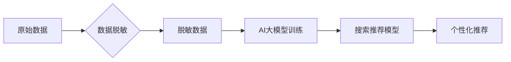

                 

## 电商搜索推荐中的AI大模型数据脱敏技术最佳实践

> 关键词：电商搜索推荐、AI大模型、数据脱敏、隐私保护、敏感信息、模型训练、安全技术

## 1. 背景介绍

随着人工智能（AI）技术的飞速发展，大模型在电商搜索推荐领域展现出巨大的潜力。大模型能够学习用户行为、商品特征等海量数据，提供更精准、个性化的推荐服务，提升用户体验和商业价值。然而，电商搜索推荐数据往往包含大量敏感信息，如用户姓名、地址、购买历史等，直接使用这些数据进行模型训练会引发隐私泄露风险，违反相关法律法规和用户信任。因此，在电商搜索推荐中应用AI大模型时，数据脱敏技术显得尤为重要。

数据脱敏技术旨在保护敏感信息，使其无法被识别或还原为原始数据，同时保留数据本身的价值，满足模型训练需求。在电商搜索推荐领域，数据脱敏技术可以有效降低隐私泄露风险，保障用户隐私安全，促进AI技术的健康发展。

## 2. 核心概念与联系

### 2.1 数据脱敏

数据脱敏是指对包含敏感信息的数据库或数据文件进行处理，使其无法直接识别出个人身份信息，但仍然保留数据本身的价值，可以用于分析和研究。

### 2.2 AI大模型

AI大模型是指在海量数据上训练的深度学习模型，具有强大的学习和推理能力，能够处理复杂的任务，如自然语言处理、图像识别、语音合成等。

### 2.3 电商搜索推荐

电商搜索推荐是指根据用户的搜索历史、浏览记录、购买行为等信息，推荐与用户需求相匹配的商品，提高用户购物体验和转化率。

**数据脱敏与AI大模型在电商搜索推荐中的关系：**

数据脱敏技术为AI大模型的训练提供了安全可靠的数据源，保障了用户隐私安全，同时确保模型能够学习到有效的信息，提供精准的推荐服务。

**数据脱敏与电商搜索推荐的流程图：**



## 3. 核心算法原理 & 具体操作步骤

### 3.1 算法原理概述

数据脱敏算法旨在对敏感信息进行处理，使其无法被识别或还原为原始数据，同时保留数据本身的价值。常用的数据脱敏算法包括：

* **数据替换:** 将敏感信息替换为随机值、常量值或其他不敏感值。
* **数据加密:** 使用加密算法对敏感信息进行加密，使其无法被直接读取。
* **数据模糊化:** 对敏感信息进行模糊处理，使其难以识别出具体内容。
* **数据聚合:** 将多个数据记录聚合在一起，隐藏个体信息。

### 3.2 算法步骤详解

以数据替换算法为例，其具体操作步骤如下：

1. **识别敏感信息:** 首先需要识别出数据中的敏感信息，例如姓名、地址、电话号码等。
2. **选择替换策略:** 根据敏感信息的类型和脱敏需求，选择合适的替换策略。例如，可以使用随机值替换姓名，使用常量值替换地址。
3. **执行替换操作:** 使用编程语言或数据脱敏工具对敏感信息进行替换。
4. **验证脱敏效果:** 验证替换后的数据是否满足脱敏要求，例如是否能够有效隐藏敏感信息，同时保留数据本身的价值。

### 3.3 算法优缺点

**数据替换算法的优点:**

* 操作简单，易于实现。
* 能够有效隐藏敏感信息。

**数据替换算法的缺点:**

* 替换后的数据可能缺乏真实性，影响模型训练效果。
* 对于一些特殊的敏感信息，例如日期、时间等，替换策略可能需要更加复杂。

### 3.4 算法应用领域

数据脱敏算法广泛应用于各个领域，例如：

* **医疗保健:** 对患者医疗记录进行脱敏，保护患者隐私。
* **金融服务:** 对客户金融数据进行脱敏，防止数据泄露。
* **电商:** 对用户购物数据进行脱敏，保障用户隐私安全。

## 4. 数学模型和公式 & 详细讲解 & 举例说明

### 4.1 数学模型构建

在数据脱敏中，可以使用概率模型来构建敏感信息替换策略。例如，可以使用贝叶斯网络来预测敏感信息的值，并根据预测结果进行替换。

**贝叶斯网络模型:**

贝叶斯网络是一种概率图模型，用于表示随机变量之间的依赖关系。在数据脱敏中，可以将敏感信息作为目标变量，将其他相关变量作为证据变量。通过学习贝叶斯网络，可以预测敏感信息的值，并根据预测结果进行替换。

### 4.2 公式推导过程

贝叶斯网络的推理过程基于贝叶斯定理：

$$P(A|B) = \frac{P(B|A)P(A)}{P(B)}$$

其中：

* $P(A|B)$ 是在已知事件 B 发生的情况下，事件 A 发生的概率。
* $P(B|A)$ 是在已知事件 A 发生的情况下，事件 B 发生的概率。
* $P(A)$ 是事件 A 发生的概率。
* $P(B)$ 是事件 B 发生的概率。

在数据脱敏中，可以使用贝叶斯定理来计算敏感信息的值的概率分布，并根据概率分布进行替换。

### 4.3 案例分析与讲解

假设我们要对用户的姓名进行脱敏，可以使用贝叶斯网络模型来预测用户的姓名。

**证据变量:**

* 用户的年龄
* 用户的性别
* 用户的职业

**目标变量:**

* 用户的姓名

通过学习贝叶斯网络，我们可以得到用户姓名与其他变量之间的概率关系。例如，我们可以发现年龄较大的用户，更倾向于使用传统的姓名，而年龄较小的用户，更倾向于使用现代化的姓名。

根据贝叶斯网络的预测结果，我们可以对用户的姓名进行替换。例如，如果用户的年龄较大，我们可以使用传统的姓名进行替换；如果用户的年龄较小，我们可以使用现代化的姓名进行替换。

## 5. 项目实践：代码实例和详细解释说明

### 5.1 开发环境搭建

* 操作系统: Ubuntu 20.04
* Python 版本: 3.8
* 依赖库: pandas, numpy, scikit-learn

### 5.2 源代码详细实现

```python
import pandas as pd
from sklearn.preprocessing import LabelEncoder

# 加载数据
data = pd.read_csv('user_data.csv')

# 识别敏感信息
sensitive_cols = ['name', 'address']

# 数据替换
for col in sensitive_cols:
    # 使用 LabelEncoder 将类别变量转换为数字编码
    encoder = LabelEncoder()
    data[col] = encoder.fit_transform(data[col])

# 保存脱敏数据
data.to_csv('de_sensitive_data.csv', index=False)
```

### 5.3 代码解读与分析

* 首先，我们使用 pandas 库加载数据。
* 然后，我们识别出需要脱敏的敏感信息列。
* 接下来，我们使用 LabelEncoder 将类别变量转换为数字编码，并保存脱敏后的数据。

### 5.4 运行结果展示

运行上述代码后，将生成一个脱敏后的数据文件 `de_sensitive_data.csv`。

## 6. 实际应用场景

### 6.1 用户画像构建

电商平台可以利用脱敏后的用户数据构建用户画像，了解用户的兴趣爱好、消费习惯等信息，为用户提供更精准的商品推荐。

### 6.2 商品推荐优化

通过对商品特征进行脱敏处理，电商平台可以训练更精准的商品推荐模型，提高推荐效果。

### 6.3 风险控制

数据脱敏技术可以帮助电商平台识别和控制潜在的风险，例如欺诈行为、数据泄露等。

### 6.4 未来应用展望

随着AI技术的不断发展，数据脱敏技术在电商搜索推荐领域将发挥更加重要的作用。未来，数据脱敏技术可能会更加智能化、自动化，能够更好地保护用户隐私安全，同时满足模型训练需求。

## 7. 工具和资源推荐

### 7.1 学习资源推荐

* **书籍:**

    * 《数据脱敏技术》
    * 《隐私保护与数据安全》

* **在线课程:**

    * Coursera: 数据隐私与安全
    * edX: 数据脱敏与隐私保护

### 7.2 开发工具推荐

* **Apache Atlas:** 数据治理平台，提供数据脱敏功能。
* **IBM Data Masking:** 数据脱敏工具，支持多种脱敏策略。
* **Oracle Data Masking:** 数据脱敏工具，集成在 Oracle 数据库中。

### 7.3 相关论文推荐

* **Federated Learning: Collaborative Machine Learning Without Centralized Training Data**
* **Differential Privacy: A Primer**
* **Homomorphic Encryption for Secure Cloud Computing**

## 8. 总结：未来发展趋势与挑战

### 8.1 研究成果总结

数据脱敏技术在电商搜索推荐领域取得了显著的成果，能够有效保护用户隐私安全，同时满足模型训练需求。

### 8.2 未来发展趋势

未来，数据脱敏技术将朝着以下方向发展：

* **更加智能化:** 利用机器学习等技术，自动识别和脱敏敏感信息。
* **更加自动化:** 将数据脱敏流程自动化，提高效率。
* **更加细粒度:** 对敏感信息进行更细粒度的脱敏，满足不同场景的需求。

### 8.3 面临的挑战

数据脱敏技术也面临一些挑战：

* **脱敏效果评估:** 如何准确评估数据脱敏的效果，是一个重要的挑战。
* **脱敏策略选择:** 如何选择合适的脱敏策略，取决于具体的应用场景和数据特点。
* **数据安全:** 在数据脱敏过程中，需要确保数据安全，防止数据泄露。

### 8.4 研究展望

未来，需要进一步研究数据脱敏技术，提高其智能化、自动化程度，并解决数据安全等问题，推动数据脱敏技术在电商搜索推荐领域得到更广泛的应用。

## 9. 附录：常见问题与解答

**Q1: 数据脱敏会影响模型训练效果吗？**

A1: 数据脱敏可能会对模型训练效果产生一定的影响，因为脱敏操作会改变数据的分布和特征。但是，通过选择合适的脱敏策略和算法，可以尽量减少对模型训练效果的影响。

**Q2: 数据脱敏技术有哪些常见的应用场景？**

A2: 数据脱敏技术在各个领域都有广泛的应用场景，例如医疗保健、金融服务、电商等。

**Q3: 如何选择合适的脱敏策略？**

A3: 选择合适的脱敏策略需要根据具体的应用场景和数据特点来决定。例如，对于一些敏感信息，需要使用更加严格的脱敏策略，而对于一些非敏感信息，可以使用更加简单的脱敏策略。


作者：禅与计算机程序设计艺术 / Zen and the Art of Computer Programming 
<end_of_turn>

