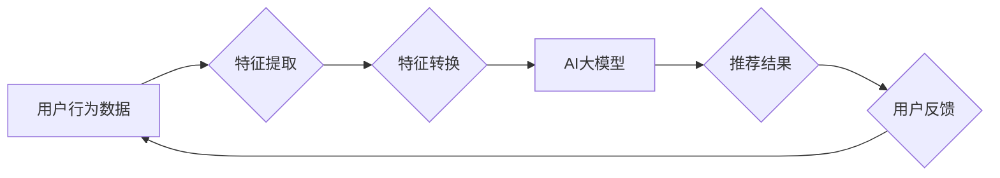

                 

## 电商搜索推荐效果优化中的AI大模型特征工程

> 关键词：电商搜索、推荐系统、AI大模型、特征工程、模型优化、用户行为、商品信息、深度学习

## 1. 背景介绍

在当今数据爆炸的时代，电商平台面临着巨大的挑战，如何精准地推荐用户感兴趣的商品，提升用户体验和转化率，成为平台发展的重要课题。传统的推荐系统主要依赖于基于内容的过滤和基于协同过滤的方法，但这些方法在面对海量数据和复杂用户行为时，往往难以准确捕捉用户需求，导致推荐效果不佳。

近年来，随着深度学习技术的快速发展，AI大模型在推荐系统领域展现出巨大的潜力。AI大模型能够学习用户行为、商品信息等海量数据中的复杂模式，并生成更精准、更个性化的推荐结果。然而，AI大模型的训练和应用也面临着挑战，其中特征工程是关键环节之一。

特征工程是指从原始数据中提取、转换和构建特征的过程，它直接影响着AI大模型的训练效果和推荐精度。电商搜索推荐场景下，特征工程需要考虑用户行为、商品信息、平台运营策略等多方面因素，并设计出能够有效刻画用户需求和商品属性的特征。

## 2. 核心概念与联系

### 2.1  电商搜索推荐系统

电商搜索推荐系统旨在帮助用户快速找到感兴趣的商品，并提供个性化的推荐建议。系统通常由以下几个模块组成：

* **搜索引擎模块:** 处理用户搜索词，并返回相关商品列表。
* **推荐引擎模块:** 基于用户历史行为、商品属性等信息，推荐用户可能感兴趣的商品。
* **展示模块:** 将搜索结果和推荐结果以用户友好的方式展示给用户。
* **反馈模块:** 收集用户点击、购买等行为反馈，用于模型训练和优化。

### 2.2  AI大模型

AI大模型是指参数规模庞大、训练数据海量、能够学习复杂模式的深度学习模型。常见的AI大模型包括Transformer、BERT、GPT等。

### 2.3  特征工程

特征工程是机器学习模型训练的关键环节之一，它涉及到数据预处理、特征提取、特征转换等步骤。特征工程的目标是将原始数据转化为模型能够理解和学习的特征，从而提高模型的训练效果和预测精度。

**Mermaid 流程图**



## 3. 核心算法原理 & 具体操作步骤

### 3.1  算法原理概述

电商搜索推荐效果优化中的AI大模型特征工程，主要基于以下核心算法原理：

* **深度学习:** 利用多层神经网络，学习用户行为、商品信息等复杂模式。
* **自然语言处理 (NLP):** 对用户搜索词、商品描述等文本数据进行分析和理解，提取语义信息。
* **推荐算法:** 基于用户行为、商品属性等信息，预测用户对商品的兴趣程度。

### 3.2  算法步骤详解

1. **数据收集:** 收集用户行为数据、商品信息数据、平台运营数据等。
2. **数据预处理:** 对数据进行清洗、转换、编码等操作，使其符合模型训练要求。
3. **特征提取:** 从原始数据中提取用户行为特征、商品属性特征、平台运营特征等。
4. **特征转换:** 对提取的特征进行转换，例如one-hot编码、词向量化等，使其能够被模型理解。
5. **模型训练:** 利用深度学习算法，训练AI大模型，并进行模型评估和优化。
6. **推荐结果生成:** 基于训练好的模型，对用户进行推荐。
7. **用户反馈收集:** 收集用户点击、购买等行为反馈，用于模型训练和优化。

### 3.3  算法优缺点

**优点:**

* 能够学习复杂模式，提高推荐精度。
* 能够个性化推荐，提升用户体验。
* 能够实时更新推荐结果，适应用户需求变化。

**缺点:**

* 需要海量数据进行训练，训练成本高。
* 模型解释性差，难以理解模型推荐结果背后的原因。
* 容易受到数据偏差的影响，导致推荐结果不准确。

### 3.4  算法应用领域

* **电商推荐:** 推荐商品、优惠券、广告等。
* **内容推荐:** 推荐新闻、视频、音乐等。
* **社交推荐:** 推荐好友、群组、活动等。
* **医疗推荐:** 推荐医生、医院、药品等。

## 4. 数学模型和公式 & 详细讲解 & 举例说明

### 4.1  数学模型构建

在电商搜索推荐场景下，常用的数学模型包括协同过滤模型、内容过滤模型、深度学习模型等。

**协同过滤模型:**

协同过滤模型基于用户的历史行为数据，预测用户对商品的兴趣程度。

**公式:**

$$
r_{u,i} = \frac{\sum_{j \in N(u)} \frac{r_{u,j} \cdot r_{j,i}}{\sqrt{\sum_{k \in N(u)} r_{u,k}^2} \cdot \sqrt{\sum_{l \in N(i)} r_{l,i}^2}}}{ \sum_{j \in N(u)} \frac{1}{\sqrt{\sum_{k \in N(u)} r_{u,k}^2}}}
$$

其中：

* $r_{u,i}$ 表示用户 $u$ 对商品 $i$ 的评分。
* $N(u)$ 表示与用户 $u$ 有交互的商品集合。
* $N(i)$ 表示与商品 $i$ 有交互的用户集合。

**内容过滤模型:**

内容过滤模型基于商品的属性信息，预测用户对商品的兴趣程度。

**公式:**

$$
r_{u,i} = \sum_{f \in F} w_{u,f} \cdot v_{i,f}
$$

其中：

* $F$ 表示商品属性集合。
* $w_{u,f}$ 表示用户 $u$ 对属性 $f$ 的权重。
* $v_{i,f}$ 表示商品 $i$ 的属性 $f$ 的值。

**深度学习模型:**

深度学习模型能够学习用户行为、商品信息等复杂模式，并生成更精准的推荐结果。常用的深度学习模型包括Transformer、BERT、Graph Neural Networks等。

### 4.2  公式推导过程

协同过滤模型的公式推导过程基于矩阵分解和相似度计算。

**矩阵分解:** 将用户评分矩阵分解成两个低维矩阵，分别表示用户特征和商品特征。

**相似度计算:** 计算用户之间的相似度，以及商品之间的相似度。

### 4.3  案例分析与讲解

假设有一个电商平台，用户购买了以下商品：

* 用户 A: 商品 1, 商品 2, 商品 3
* 用户 B: 商品 2, 商品 4, 商品 5

我们可以利用协同过滤模型，预测用户 A 对商品 4 的兴趣程度。

## 5. 项目实践：代码实例和详细解释说明

### 5.1  开发环境搭建

* Python 3.x
* TensorFlow/PyTorch
* Jupyter Notebook

### 5.2  源代码详细实现

```python
# 导入必要的库
import pandas as pd
from sklearn.model_selection import train_test_split
from sklearn.metrics import mean_squared_error

# 加载用户行为数据
data = pd.read_csv('user_behavior.csv')

# 提取特征
user_id = data['user_id']
item_id = data['item_id']
rating = data['rating']

# 将数据分割为训练集和测试集
train_data, test_data = train_test_split(data, test_size=0.2)

# 训练协同过滤模型
# ...

# 对测试数据进行预测
# ...

# 计算模型精度
rmse = mean_squared_error(test_data['rating'], predictions, squared=False)
print(f'RMSE: {rmse}')
```

### 5.3  代码解读与分析

* 代码首先导入必要的库，并加载用户行为数据。
* 然后提取用户 ID、商品 ID 和评分等特征。
* 将数据分割为训练集和测试集，用于模型训练和评估。
* 训练协同过滤模型，并对测试数据进行预测。
* 最后计算模型精度，例如使用 RMSE 指标。

### 5.4  运行结果展示

运行代码后，会输出模型的 RMSE 值，表示模型预测的准确程度。

## 6. 实际应用场景

### 6.1  电商平台推荐

电商平台可以利用AI大模型特征工程，实现商品推荐、用户画像、个性化营销等功能，提升用户体验和转化率。

### 6.2  搜索引擎优化

搜索引擎可以利用AI大模型特征工程，理解用户搜索意图，并提供更精准的搜索结果。

### 6.3  内容推荐系统

内容推荐系统可以利用AI大模型特征工程，推荐用户感兴趣的新闻、视频、音乐等内容，提升用户粘性和活跃度。

### 6.4  未来应用展望

随着AI技术的不断发展，AI大模型特征工程在电商搜索推荐领域将有更广泛的应用场景，例如：

* **多模态推荐:** 将文本、图像、视频等多模态数据融合，实现更精准的推荐。
* **实时推荐:** 基于用户实时行为，动态更新推荐结果，提供更个性化的体验。
* **跨平台推荐:** 将用户行为数据整合，实现跨平台的个性化推荐。

## 7. 工具和资源推荐

### 7.1  学习资源推荐

* **书籍:**
    * 深度学习
    * 自然语言处理
    * 推荐系统
* **在线课程:**
    * Coursera
    * edX
    * Udacity

### 7.2  开发工具推荐

* **Python:** 
* **TensorFlow:** 
* **PyTorch:** 
* **Scikit-learn:** 

### 7.3  相关论文推荐

* **BERT: Pre-training of Deep Bidirectional Transformers for Language Understanding**
* **Attention Is All You Need**
* **Collaborative Filtering for Implicit Feedback Datasets**

## 8. 总结：未来发展趋势与挑战

### 8.1  研究成果总结

AI大模型特征工程在电商搜索推荐领域取得了显著成果，能够提升推荐精度、个性化程度和用户体验。

### 8.2  未来发展趋势

未来，AI大模型特征工程将朝着以下方向发展：

* **多模态融合:** 将文本、图像、视频等多模态数据融合，实现更精准的推荐。
* **实时推荐:** 基于用户实时行为，动态更新推荐结果，提供更个性化的体验。
* **跨平台推荐:** 将用户行为数据整合，实现跨平台的个性化推荐。

### 8.3  面临的挑战

AI大模型特征工程也面临着一些挑战：

* **数据质量:** 模型训练依赖于高质量的数据，数据偏差会影响模型精度。
* **模型解释性:** AI大模型的决策过程难以理解，缺乏可解释性。
* **计算资源:** 训练大型AI模型需要大量的计算资源，成本较高。

### 8.4  研究展望

未来，需要进一步研究如何提高数据质量、增强模型解释性、降低训练成本，以及探索新的AI大模型架构和应用场景。


## 9. 附录：常见问题与解答

**Q1: 如何选择合适的AI大模型？**

**A1:** 选择合适的AI大模型需要根据具体应用场景和数据特点进行评估。例如，对于文本数据，BERT模型效果较好；对于图数据，Graph Neural Networks模型效果较好。

**Q2: 如何处理数据偏差？**

**A2:** 可以采用数据清洗、数据平衡、对抗训练等方法来处理数据偏差。

**Q3: 如何评估模型性能？**

**A3:** 可以使用RMSE、MAE、Precision、Recall等指标来评估模型性能。

**作者：禅与计算机程序设计艺术 / Zen and the Art of Computer Programming**<end_of_turn>

