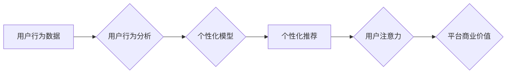

                 

## 电子商务平台的注意力争夺策略

> 关键词：电子商务、注意力经济、推荐算法、用户行为分析、个性化推荐、深度学习、A/B测试

## 1. 背景介绍

在当今数字时代，注意力已成为最宝贵的资源。电子商务平台作为信息爆炸的中心，面临着激烈的竞争，用户注意力更是争夺的焦点。如何有效地吸引和留住用户注意力，成为平台发展和商业成功的关键。

传统电子商务平台主要依靠商品分类、搜索引擎和促销活动来引导用户行为。然而，随着用户需求的不断变化和信息量的激增，这些方法已不再足够有效。用户在海量商品和信息面前，更容易感到疲劳和困惑，注意力难以集中。

注意力经济的兴起为电子商务平台提供了新的思路。注意力经济强调用户注意力是有限的，平台需要通过提供个性化、有价值、引人入胜的内容和体验，来吸引和留住用户的注意力。

## 2. 核心概念与联系

### 2.1 注意力经济

注意力经济是指在信息爆炸的时代，用户注意力成为最稀缺的资源，而平台通过提供优质内容和服务，来获取和利用用户注意力，从而实现商业价值的经济模式。

### 2.2 用户行为分析

用户行为分析是指通过收集和分析用户在平台上的行为数据，例如浏览记录、购买历史、评价反馈等，来了解用户的兴趣、偏好和需求，从而为个性化推荐和内容定制提供依据。

### 2.3 个性化推荐

个性化推荐是指根据用户的历史行为、兴趣偏好和当前上下文等信息，推荐最符合用户需求的商品、内容和服务，以提高用户体验和转化率。

**Mermaid 流程图**



## 3. 核心算法原理 & 具体操作步骤

### 3.1 算法原理概述

电子商务平台的注意力争夺策略主要依赖于推荐算法和用户行为分析。推荐算法通过学习用户历史行为和偏好，预测用户对特定商品或内容的兴趣，并将其推荐给用户。用户行为分析则通过收集和分析用户行为数据，为推荐算法提供更精准的输入，从而提高推荐的准确性和有效性。

常见的推荐算法包括：

* **基于内容的推荐:** 根据商品或内容的属性和标签，推荐与用户过去浏览或购买的商品或内容相似的商品或内容。
* **基于协同过滤的推荐:** 根据用户与其他用户的行为相似性，推荐其他用户喜欢的商品或内容。
* **基于深度学习的推荐:** 利用深度神经网络学习用户行为和商品特征之间的复杂关系，进行更精准的推荐。

### 3.2 算法步骤详解

以基于协同过滤的推荐算法为例，其具体操作步骤如下：

1. **数据收集:** 收集用户行为数据，例如浏览记录、购买历史、评价反馈等。
2. **数据预处理:** 对收集到的数据进行清洗、转换和格式化，以便于算法的训练和使用。
3. **用户-商品矩阵构建:** 将用户和商品映射到一个矩阵中，其中每个元素表示用户对特定商品的评分或行为。
4. **相似度计算:** 计算用户之间的相似度或商品之间的相似度，例如使用余弦相似度或皮尔逊相关系数。
5. **推荐生成:** 根据用户与其他用户的相似度，推荐其他用户喜欢的商品给当前用户。

### 3.3 算法优缺点

**优点:**

* 可以推荐用户可能感兴趣但从未接触过的商品或内容。
* 可以发现用户之间的潜在关联，挖掘新的市场机会。

**缺点:**

* 需要大量的用户行为数据才能训练出准确的模型。
* 容易出现冷启动问题，即对于新用户或新商品，难以进行推荐。
* 难以解释推荐结果背后的逻辑，缺乏透明度。

### 3.4 算法应用领域

基于协同过滤的推荐算法广泛应用于电子商务平台、视频网站、音乐平台、社交网络等领域，用于推荐商品、视频、音乐、好友等。

## 4. 数学模型和公式 & 详细讲解 & 举例说明

### 4.1 数学模型构建

基于协同过滤的推荐算法可以构建如下数学模型：

**用户-商品评分矩阵:**

$$
R = \begin{bmatrix}
r_{11} & r_{12} & \cdots & r_{1m} \\
r_{21} & r_{22} & \cdots & r_{2m} \\
\vdots & \vdots & \ddots & \vdots \\
r_{n1} & r_{n2} & \cdots & r_{nm}
\end{bmatrix}
$$

其中，$r_{ij}$ 表示用户 $i$ 对商品 $j$ 的评分，$n$ 为用户数量，$m$ 为商品数量。

**用户相似度矩阵:**

$$
S = \begin{bmatrix}
s_{11} & s_{12} & \cdots & s_{1n} \\
s_{21} & s_{22} & \cdots & s_{2n} \\
\vdots & \vdots & \ddots & \vdots \\
s_{n1} & s_{n2} & \cdots & s_{nn}
\end{bmatrix}
$$

其中，$s_{ij}$ 表示用户 $i$ 与用户 $j$ 的相似度。

**商品推荐矩阵:**

$$
P = \begin{bmatrix}
p_{11} & p_{12} & \cdots & p_{1m} \\
p_{21} & p_{22} & \cdots & p_{2m} \\
\vdots & \vdots & \ddots & \vdots \\
p_{n1} & p_{n2} & \cdots & p_{nm}
\end{bmatrix}
$$

其中，$p_{ij}$ 表示用户 $i$ 对商品 $j$ 的推荐分数。

### 4.2 公式推导过程

推荐分数 $p_{ij}$ 可以通过以下公式计算：

$$
p_{ij} = \sum_{k=1}^{n} s_{ik} r_{kj}
$$

其中，$s_{ik}$ 为用户 $i$ 与用户 $k$ 的相似度，$r_{kj}$ 为用户 $k$ 对商品 $j$ 的评分。

### 4.3 案例分析与讲解

假设用户 $A$ 和用户 $B$ 对商品 $X$ 和 $Y$ 的评分分别为：

* 用户 $A$: $r_{A,X} = 5$, $r_{A,Y} = 3$
* 用户 $B$: $r_{B,X} = 4$, $r_{B,Y} = 5$

如果用户 $A$ 与用户 $B$ 的相似度为 $s_{A,B} = 0.8$, 则用户 $A$ 对商品 $Y$ 的推荐分数为：

$$
p_{A,Y} = 0.8 \times 5 = 4
$$

## 5. 项目实践：代码实例和详细解释说明

### 5.1 开发环境搭建

* Python 3.x
* Pandas
* Scikit-learn
* TensorFlow/PyTorch

### 5.2 源代码详细实现

```python
import pandas as pd
from sklearn.metrics.pairwise import cosine_similarity

# 加载用户-商品评分数据
ratings = pd.read_csv('ratings.csv')

# 计算用户之间的余弦相似度
user_similarity = cosine_similarity(ratings)

# 获取用户 A 的 ID
user_a_id = 1

# 获取用户 A 已经评分过的商品 ID
rated_items = ratings[ratings['user_id'] == user_a_id]['item_id'].tolist()

# 计算用户 A 对未评分商品的推荐分数
recommendations = []
for item_id in range(1, len(ratings.columns)):
    if item_id not in rated_items:
        similarity_scores = user_similarity[user_a_id - 1][:]
        weighted_ratings = similarity_scores * ratings[ratings['item_id'] == item_id]['rating']
        recommendation_score = sum(weighted_ratings)
        recommendations.append((item_id, recommendation_score))

# 排序推荐结果
recommendations.sort(key=lambda x: x[1], reverse=True)

# 打印推荐结果
print(recommendations)
```

### 5.3 代码解读与分析

* 代码首先加载用户-商品评分数据，并使用 Scikit-learn 库计算用户之间的余弦相似度。
* 然后，根据用户 A 的 ID 和已评分商品 ID，计算用户 A 对未评分商品的推荐分数。
* 最后，将推荐结果排序并打印出来。

### 5.4 运行结果展示

运行代码后，将输出用户 A 对未评分商品的推荐列表，每个列表项包含商品 ID 和推荐分数。

## 6. 实际应用场景

电子商务平台可以将注意力争夺策略应用于以下场景：

* **商品推荐:** 根据用户的浏览历史、购买记录和兴趣偏好，推荐个性化的商品。
* **内容推荐:** 根据用户的阅读习惯、观看记录和兴趣标签，推荐个性化的文章、视频和图片。
* **促销活动:** 根据用户的消费习惯和购买偏好，推送个性化的促销活动和优惠券。
* **用户画像:** 通过分析用户的行为数据，构建用户画像，以便更好地理解用户的需求和行为模式。

### 6.4 未来应用展望

随着人工智能技术的不断发展，电子商务平台的注意力争夺策略将更加智能化和个性化。未来，我们可以期待以下应用场景：

* **基于深度学习的个性化推荐:** 利用深度神经网络学习用户行为和商品特征之间的复杂关系，进行更精准的推荐。
* **实时动态推荐:** 根据用户的实时行为和上下文信息，动态调整推荐结果。
* **跨平台注意力管理:** 将用户注意力管理扩展到多个平台，例如手机、电脑、智能家居等。

## 7. 工具和资源推荐

### 7.1 学习资源推荐

* **书籍:**
    * 《推荐系统实践》
    * 《深度学习》
* **在线课程:**
    * Coursera: Recommender Systems
    * Udacity: Deep Learning Nanodegree

### 7.2 开发工具推荐

* **Python:** 
    * Pandas
    * Scikit-learn
    * TensorFlow/PyTorch
* **Spark:** 
    * Apache Spark MLlib

### 7.3 相关论文推荐

* **Collaborative Filtering for Implicit Feedback Datasets**
* **Deep Learning for Recommender Systems**

## 8. 总结：未来发展趋势与挑战

### 8.1 研究成果总结

电子商务平台的注意力争夺策略已经取得了显著的成果，例如推荐算法的准确率和用户体验的提升。

### 8.2 未来发展趋势

未来，电子商务平台的注意力争夺策略将更加智能化、个性化和实时化。

### 8.3 面临的挑战

* **数据隐私保护:** 用户行为数据涉及个人隐私，需要采取有效的措施保护用户数据安全。
* **算法公平性:** 推荐算法需要避免产生歧视或偏见，确保公平公正的推荐结果。
* **用户信任:** 平台需要建立用户的信任，避免过度营销和信息轰炸。

### 8.4 研究展望

未来研究方向包括：

* **开发更精准、更个性化的推荐算法。**
* **探索新的注意力获取方式，例如增强现实和虚拟现实。**
* **研究注意力经济的伦理问题，确保平台发展与用户利益相符。**

## 9. 附录：常见问题与解答

* **Q: 如何解决冷启动问题？**

* **A:** 可以利用用户提供的基本信息，例如年龄、性别、兴趣爱好等，进行初始推荐。也可以利用协同过滤算法中的“物品相似度”来推荐。

* **Q: 如何评估推荐算法的性能？**

* **A:** 可以使用准确率、召回率、F1-score等指标来评估推荐算法的性能。

* **Q: 如何避免推荐算法产生歧视或偏见？**

* **A:** 可以采用公平性评估指标，例如公平性度量和差异化分析，来检测和缓解推荐算法中的歧视或偏见。


作者：禅与计算机程序设计艺术 / Zen and the Art of Computer Programming 
<end_of_turn>

