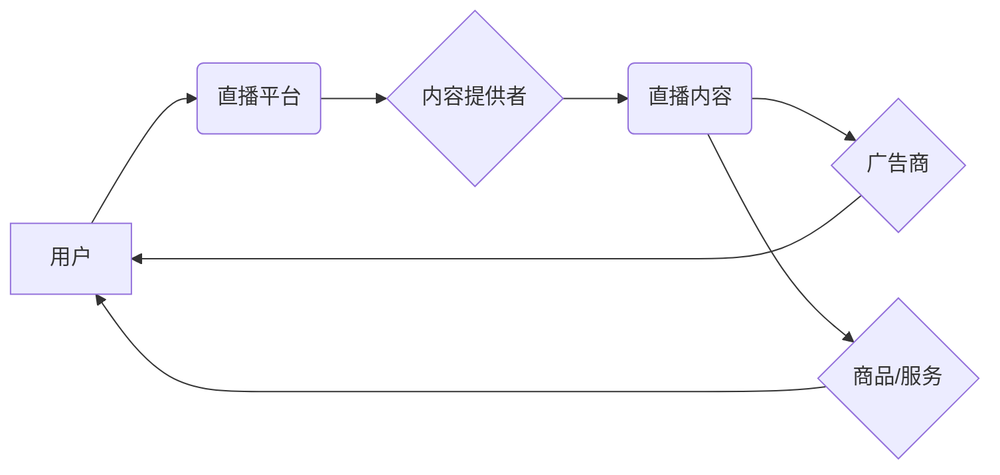

                 

## 直播经济：注意力变现的新方式

> 关键词：直播经济、注意力经济、变现模式、实时互动、数据分析、人工智能、用户体验

### 1. 背景介绍

互联网时代，信息爆炸和内容泛滥成为常态。用户注意力成为稀缺资源，而如何有效获取和利用用户注意力，成为了企业和创新的核心竞争力。直播经济的兴起，正是对注意力经济的深刻理解和实践。

直播经济是指利用实时视频直播技术，将商品、服务、内容等直接传递给用户，并通过互动、娱乐、购物等方式实现商业变现的经济模式。其核心在于“实时互动”，通过直播平台，商家和用户可以进行即时交流，建立更紧密的连接，从而提升用户粘性和转化率。

近年来，直播经济发展迅速，从电商直播到知识付费直播，从游戏直播到音乐直播，其应用场景不断拓展，并逐渐成为互联网经济的重要组成部分。

### 2. 核心概念与联系

**2.1 直播经济的核心概念**

* **注意力经济:**  注意力是稀缺资源，用户对信息的筛选和选择能力有限，因此，吸引和保持用户注意力成为商业成功的关键。
* **实时互动:** 直播平台提供实时双向互动功能，商家和用户可以即时交流，建立更紧密的连接，提升用户参与度和体验。
* **内容变现:** 直播内容可以包含商品展示、知识分享、娱乐表演等，通过广告、会员、打赏等方式实现商业变现。

**2.2 直播经济的架构**



**2.3 直播经济的联系**

直播经济是注意力经济的具体体现，通过实时互动和内容变现，将注意力转化为商业价值。直播平台作为连接用户、内容提供者和广告商的桥梁，为直播经济的发展提供了基础设施和生态环境。

### 3. 核心算法原理 & 具体操作步骤

**3.1 算法原理概述**

直播经济的核心算法主要围绕用户行为分析、内容推荐和互动匹配等方面。

* **用户行为分析:** 通过分析用户的观看时长、点赞、评论、分享等行为，构建用户画像，了解用户的兴趣偏好和消费习惯。
* **内容推荐:** 基于用户画像和内容标签，推荐用户感兴趣的内容，提高用户粘性和参与度。
* **互动匹配:** 通过实时匹配用户和内容提供者，实现即时互动，增强用户体验。

**3.2 算法步骤详解**

1. **数据采集:** 收集用户观看记录、点赞、评论、分享等行为数据，以及内容标签、属性等信息。
2. **数据预处理:** 对采集到的数据进行清洗、转换、格式化等处理，确保数据质量和一致性。
3. **用户画像构建:** 利用机器学习算法，对用户行为数据进行分析，构建用户画像，包括用户兴趣、偏好、消费习惯等信息。
4. **内容推荐:** 根据用户画像和内容标签，利用推荐算法，推荐用户感兴趣的内容，并根据用户行为反馈进行模型优化。
5. **互动匹配:** 利用实时匹配算法，根据用户兴趣和内容提供者的专业领域，匹配用户和内容提供者，实现即时互动。

**3.3 算法优缺点**

* **优点:** 能够精准推荐用户感兴趣的内容，提高用户粘性和参与度，实现高效的商业变现。
* **缺点:** 需要大量的数据支持，算法模型需要不断优化，存在数据隐私和算法偏见等问题。

**3.4 算法应用领域**

* **电商直播:** 推荐商品、引导用户购买。
* **知识付费直播:** 推荐课程、吸引用户付费学习。
* **游戏直播:** 推荐游戏、匹配玩家。
* **音乐直播:** 推荐音乐、匹配粉丝。

### 4. 数学模型和公式 & 详细讲解 & 举例说明

**4.1 数学模型构建**

用户行为预测模型可以采用基于用户的协同过滤算法，例如：

* **用户-物品评分矩阵:**  将用户和物品作为矩阵的行和列，用户对物品的评分作为矩阵的元素。
* **相似度计算:** 利用余弦相似度等算法计算用户之间的相似度，以及物品之间的相似度。
* **预测评分:** 根据用户和物品的相似度，预测用户对物品的评分。

**4.2 公式推导过程**

假设用户 $u$ 对物品 $i$ 的评分为 $r_{ui}$，用户 $u$ 和用户 $v$ 的相似度为 $sim(u,v)$，物品 $i$ 和物品 $j$ 的相似度为 $sim(i,j)$，则用户 $u$ 对物品 $j$ 的评分预测值可以表示为：

$$
\hat{r}_{uj} = \frac{\sum_{v \in N(u)} sim(u,v) * r_{v j}}{\sum_{v \in N(u)} sim(u,v)}
$$

其中，$N(u)$ 表示与用户 $u$ 相似的用户集合。

**4.3 案例分析与讲解**

假设用户 $A$ 和用户 $B$ 都喜欢观看美食直播，用户 $A$ 对美食直播 $X$ 的评分为 5，用户 $B$ 对美食直播 $X$ 的评分为 4，用户 $A$ 对美食直播 $Y$ 的评分为 3，用户 $B$ 对美食直播 $Y$ 的评分为 5。

根据上述公式，可以计算用户 $A$ 对美食直播 $Y$ 的评分预测值。

### 5. 项目实践：代码实例和详细解释说明

**5.1 开发环境搭建**

* 操作系统: Ubuntu 20.04
* 编程语言: Python 3.8
* 开发框架: Flask
* 数据库: MySQL

**5.2 源代码详细实现**

```python
from flask import Flask, request, jsonify
from sklearn.metrics.pairwise import cosine_similarity

app = Flask(__name__)

# 用户-物品评分矩阵
ratings = {
    'user1': {'item1': 5, 'item2': 3, 'item3': 4},
    'user2': {'item1': 4, 'item2': 5, 'item3': 3},
    'user3': {'item1': 3, 'item2': 4, 'item3': 5},
}

# 用户相似度计算
def calculate_user_similarity(user1, user2):
    # 计算用户1和用户2的评分向量
    vector1 = ratings[user1].values()
    vector2 = ratings[user2].values()
    # 计算余弦相似度
    similarity = cosine_similarity([vector1], [vector2])[0][0]
    return similarity

# 预测用户对物品的评分
def predict_rating(user, item):
    # 获取与用户相似的用户
    similar_users = [user for user in ratings if user != user]
    # 计算用户与相似用户的相似度
    similarities = [calculate_user_similarity(user, similar_user) for similar_user in similar_users]
    # 计算预测评分
    predicted_rating = sum([similarities[i] * ratings[similar_users[i]][item] for i in range(len(similar_users))]) / sum(similarities)
    return predicted_rating

# API接口
@app.route('/predict', methods=['POST'])
def predict():
    data = request.get_json()
    user = data['user']
    item = data['item']
    predicted_rating = predict_rating(user, item)
    return jsonify({'predicted_rating': predicted_rating})

if __name__ == '__main__':
    app.run(debug=True)
```

**5.3 代码解读与分析**

* 该代码实现了一个简单的用户行为预测模型，利用协同过滤算法预测用户对物品的评分。
* 首先定义了一个用户-物品评分矩阵，存储了用户对物品的评分信息。
* 然后定义了两个函数：`calculate_user_similarity` 用于计算用户之间的相似度，`predict_rating` 用于预测用户对物品的评分。
* 最后定义了一个 API 接口 `/predict`，接收用户和物品信息，返回预测评分。

**5.4 运行结果展示**

运行该代码后，可以访问 API 接口，例如：

```
http://localhost:5000/predict?user=user1&item=item3
```

API 接口会返回用户对物品的预测评分。

### 6. 实际应用场景

**6.1 电商直播**

* **商品推荐:** 根据用户的观看历史和购买记录，推荐用户感兴趣的商品。
* **直播互动:** 利用实时聊天和弹幕功能，增强用户参与度，引导用户购买。
* **数据分析:** 分析用户的观看时长、点赞、评论等行为，了解用户对商品的喜好和需求。

**6.2 知识付费直播**

* **课程推荐:** 根据用户的学习兴趣和水平，推荐用户感兴趣的课程。
* **互动答疑:** 利用直播平台的互动功能，解答用户的学习疑问，提高学习效果。
* **用户反馈:** 收集用户的学习反馈，不断优化课程内容和教学方式。

**6.3 游戏直播**

* **游戏推荐:** 根据用户的游戏喜好和玩游戏时间，推荐用户感兴趣的游戏。
* **玩家匹配:** 利用实时匹配算法，匹配玩家进行游戏，提高游戏体验。
* **游戏数据分析:** 分析玩家的游戏行为，了解玩家的游戏习惯和偏好。

**6.4 未来应用展望**

* **虚拟现实直播:** 利用虚拟现实技术，打造沉浸式的直播体验。
* **人工智能直播:** 利用人工智能技术，实现智能推荐、自动字幕、实时翻译等功能。
* **元宇宙直播:** 将直播融入到元宇宙世界中，打造全新的虚拟社交和娱乐体验。

### 7. 工具和资源推荐

**7.1 学习资源推荐**

* **书籍:**
    * 《直播经济：注意力变现的新模式》
    * 《数据驱动直播：从数据分析到商业变现》
* **在线课程:**
    * Coursera: 数据分析与机器学习
    * Udemy: 直播电商运营

**7.2 开发工具推荐**

* **直播平台:**
    * OBS Studio
    * Twitch
    * YouTube Live
* **数据分析工具:**
    * Google Analytics
    * Tableau
* **机器学习库:**
    * scikit-learn
    * TensorFlow

**7.3 相关论文推荐**

* **直播电商的商业模式创新与发展趋势**
* **基于用户行为分析的直播内容推荐算法研究**
* **直播平台用户互动行为分析与影响因素研究**

### 8. 总结：未来发展趋势与挑战

**8.1 研究成果总结**

直播经济的发展，为用户提供了更加便捷、互动、沉浸式的体验，同时也为商家提供了新的变现模式。通过用户行为分析、内容推荐和互动匹配等算法，直播平台能够精准推荐用户感兴趣的内容，提升用户粘性和参与度。

**8.2 未来发展趋势**

* **技术驱动:** 随着人工智能、虚拟现实、元宇宙等技术的不断发展，直播平台将更加智能化、沉浸化和交互化。
* **内容多元化:** 直播内容将更加多元化，涵盖电商、教育、娱乐、游戏等多个领域。
* **商业模式创新:** 直播平台将探索新的商业模式，例如虚拟商品、虚拟体验等。

**8.3 面临的挑战**

* **数据隐私:** 直播平台需要妥善处理用户数据，保障用户隐私安全。
* **算法偏见:** 直播平台的算法模型可能存在偏见，需要不断优化和改进。
* **内容监管:** 直播平台需要加强内容监管，杜绝不良内容的传播。

**8.4 研究展望**

未来，直播经济的研究将更加注重以下方面:

* **个性化推荐:** 基于用户画像和行为数据，实现更加个性化的内容推荐。
* **互动体验:** 利用人工智能技术，打造更加智能化、沉浸式的直播互动体验。
* **商业模式创新:** 探索新的直播商业模式，实现更加可持续的商业发展。

### 9. 附录：常见问题与解答

**9.1 如何提高直播的互动性？**

* 利用实时聊天和弹幕功能，与观众互动。
* 定期举办线上活动，例如抽奖、问答等。
* 鼓励观众分享自己的观点和想法。

**9.2 如何进行直播内容的推荐？**

* 基于用户的观看历史和购买记录，推荐用户感兴趣的内容。
* 利用机器学习算法，分析用户的行为数据，预测用户对内容的喜好。
* 结合用户画像和内容标签，实现精准的内容推荐。

**9.3 直播平台如何保障用户隐私安全？**

* 明确用户数据收集和使用范围，获得用户的知情同意。
* 加强数据加密和安全防护，防止数据泄露。
* 提供用户数据管理功能，允许用户查看、修改和删除自己的数据。


作者：禅与计算机程序设计艺术 / Zen and the Art of Computer Programming 
<end_of_turn>

