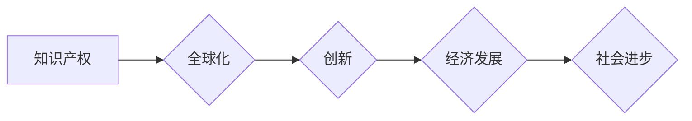

                 

## 知识产权与全球化的互动关系

> 关键词：知识产权、全球化、创新、保护、协作、数字时代、法律、伦理

## 1. 背景介绍

全球化进程的加速推动了经济、文化、科技等领域的深度融合，也为知识产权（Intellectual Property，简称IP）带来了前所未有的机遇和挑战。知识产权作为一种重要的经济和社会资源，其保护和利用关系到国家创新能力、经济发展和社会进步。

在全球化背景下，知识产权的跨境流动和传播日益频繁，跨国公司和个人更容易获取和利用来自不同国家的知识产权资源。同时，全球化也加剧了知识产权侵权的风险，跨国盗版、假冒伪劣产品等现象更加普遍。

如何有效保护知识产权，促进知识产权的合理利用和创新发展，成为全球范围内共同面临的课题。

## 2. 核心概念与联系

**2.1 知识产权的概念**

知识产权是指个人或组织对知识、创造和发明享有的专属权利。它包括以下几种类型：

* **专利权:**  对一种新的发明给予独占权，允许发明者在一定时间内阻止他人制造、使用、销售该发明。
* **版权:** 对文学、艺术、音乐等作品给予独占权，允许作者在一定时间内控制作品的复制、发行、表演等行为。
* **商标权:** 对商品或服务的标识给予独占权，允许商标所有人阻止他人使用与其相似的标识，以避免消费者混淆。
* **商业秘密:** 指企业或个人为了获取商业优势而保密的机密信息，例如配方、技术、客户名单等。

**2.2 全球化的概念**

全球化是指国家和地区之间经济、政治、文化、科技等领域的相互联系和融合，形成一个相互依存、相互促进的全球经济体和社会体系。

**2.3 知识产权与全球化的关系**

知识产权与全球化相互促进、相互依存。

* **全球化促进知识产权的传播和利用:** 全球化加速了信息和技术的流动，使得知识产权更容易跨越国界传播和利用。
* **知识产权保护促进全球化发展:** 知识产权的有效保护可以鼓励创新，促进技术进步，为全球经济发展提供动力。

**2.4 核心概念原理和架构**



## 3. 核心算法原理 & 具体操作步骤

**3.1 算法原理概述**

在知识产权与全球化的互动关系中，没有一个特定的算法可以解决所有问题。 

然而，我们可以借鉴一些算法思想和方法，例如：

* **机器学习算法:** 可以用于识别和分析知识产权侵权行为，例如图片识别、文本相似度计算等。
* **网络分析算法:** 可以用于分析知识产权的传播路径和影响范围，例如社交网络分析、知识图谱构建等。
* **优化算法:** 可以用于制定知识产权保护策略，例如成本效益分析、风险评估等。

**3.2 算法步骤详解**

具体操作步骤取决于所应用的算法类型和具体问题。 

例如，使用机器学习算法识别知识产权侵权行为，一般步骤如下：

1. **数据收集:** 收集大量正例（合法作品）和负例（侵权作品）数据。
2. **数据预处理:** 对数据进行清洗、格式化、特征提取等处理。
3. **模型训练:** 选择合适的机器学习模型，例如支持向量机、深度神经网络等，并使用训练数据进行模型训练。
4. **模型评估:** 使用测试数据评估模型的性能，例如准确率、召回率、F1-score等。
5. **模型部署:** 将训练好的模型部署到实际应用场景中，例如网站、应用程序等。

**3.3 算法优缺点**

不同的算法具有不同的优缺点，需要根据具体问题选择合适的算法。

例如，机器学习算法具有强大的学习能力和适应性，但需要大量数据进行训练，并且模型解释性较差。

**3.4 算法应用领域**

机器学习算法在知识产权领域有广泛的应用，例如：

* **侵权检测:** 检测图片、文本、音频等作品的侵权行为。
* **专利检索:** 根据关键词或技术内容检索相关的专利信息。
* **商标识别:** 识别商品或服务的商标，防止商标侵权。
* **版权管理:** 管理和保护数字作品的版权。

## 4. 数学模型和公式 & 详细讲解 & 举例说明

**4.1 数学模型构建**

知识产权与全球化的互动关系可以抽象为一个复杂的网络系统，其中节点代表不同的国家、组织或个人，边代表知识产权的流动和传播。

我们可以使用图论、网络分析等数学工具来建模和分析这个系统。

例如，我们可以使用 PageRank 算法来计算知识产权的权重和影响力，或者使用社会网络分析方法来研究知识产权的传播路径和影响范围。

**4.2 公式推导过程**

PageRank 算法的核心公式如下：

$$PR(A) = (1-d) + d \sum_{Page B links to A} \frac{PR(B)}{C(B)}$$

其中：

* $PR(A)$ 表示节点 A 的 PageRank 值。
* $d$ 是阻尼系数，通常取值为 0.85。
* $C(B)$ 表示节点 B 的出度数，即指向其他节点的链接数。

**4.3 案例分析与讲解**

我们可以使用 PageRank 算法来分析不同国家或地区的知识产权保护水平。

例如，我们可以将不同国家的专利申请数量、授权数量、侵权案件数量等数据作为节点的权重，然后使用 PageRank 算法计算每个国家的知识产权保护水平。

## 5. 项目实践：代码实例和详细解释说明

**5.1 开发环境搭建**

为了实现知识产权与全球化的互动关系分析，我们可以使用 Python 语言和相关库进行开发。

需要安装 Python 语言环境和以下库：

* NetworkX: 用于构建和分析网络图。
* Scikit-learn: 用于机器学习算法的实现。
* Pandas: 用于数据处理和分析。

**5.2 源代码详细实现**

```python
import networkx as nx
import pandas as pd

# 数据加载
data = pd.read_csv("ip_data.csv")

# 网络图构建
G = nx.from_pandas_edgelist(data, source="country_A", target="country_B", edge_attr="flow")

# PageRank 计算
pr = nx.pagerank(G)

# 结果输出
print(pr)
```

**5.3 代码解读与分析**

这段代码首先加载知识产权数据，然后使用 NetworkX 库构建一个网络图，其中节点代表不同的国家，边代表知识产权的流动。

然后使用 PageRank 算法计算每个国家的知识产权影响力，并将结果输出。

**5.4 运行结果展示**

运行结果将显示每个国家的 PageRank 值，可以用来比较不同国家或地区的知识产权保护水平和影响力。

## 6. 实际应用场景

**6.1 知识产权保护**

* **侵权监测:** 利用机器学习算法对网络上的信息进行实时监测，识别潜在的知识产权侵权行为。
* **法律诉讼:** 提供证据支持，帮助权利人进行知识产权诉讼。
* **反制措施:** 制定有效的反制措施，打击知识产权侵权行为。

**6.2 知识产权管理**

* **知识产权资产评估:** 利用数据分析和模型评估，对知识产权资产进行价值评估。
* **知识产权策略制定:** 根据市场趋势和竞争对手分析，制定合理的知识产权保护和利用策略。
* **知识产权许可和转让:** 优化知识产权许可和转让流程，提高效率和透明度。

**6.3 创新促进**

* **技术趋势分析:** 利用知识图谱和网络分析，研究技术发展趋势，为创新提供方向。
* **知识共享平台:** 建立知识共享平台，促进知识产权的流通和利用。
* **开放创新模式:** 推广开放创新模式，鼓励合作创新和知识共享。

**6.4 未来应用展望**

随着人工智能、区块链等技术的不断发展，知识产权与全球化的互动关系将更加复杂和多元。

未来，我们可以期待以下应用场景：

* **智能知识产权保护系统:** 利用人工智能技术，实现对知识产权的自动识别、监测和保护。
* **去中心化知识产权管理平台:** 利用区块链技术，构建去中心化的知识产权管理平台，提高透明度和安全性。
* **跨境知识产权合作平台:** 利用云计算和大数据技术，搭建跨境知识产权合作平台，促进全球知识产权共享和创新。

## 7. 工具和资源推荐

**7.1 学习资源推荐**

* **书籍:**
    * 《知识产权概论》
    * 《全球知识产权》
    * 《知识产权与创新》
* **在线课程:**
    * Coursera: 知识产权课程
    * edX: 知识产权与创新课程
* **网站:**
    * 世界知识产权组织 (WIPO): https://www.wipo.int/
    * 美国专利商标局 (USPTO): https://www.uspto.gov/

**7.2 开发工具推荐**

* **Python:** https://www.python.org/
* **NetworkX:** https://networkx.org/
* **Scikit-learn:** https://scikit-learn.org/
* **Pandas:** https://pandas.pydata.org/

**7.3 相关论文推荐**

* **The Impact of Globalization on Intellectual Property Rights**
* **Knowledge Sharing and Innovation in a Globalized World**
* **The Role of Intellectual Property in Economic Development**

## 8. 总结：未来发展趋势与挑战

**8.1 研究成果总结**

通过对知识产权与全球化的互动关系的研究，我们发现：

* 全球化加速了知识产权的传播和利用，但也加剧了知识产权侵权的风险。
* 知识产权保护是促进全球化发展的重要保障。
* 知识产权与全球化的互动关系是一个复杂的系统，需要多学科交叉研究。

**8.2 未来发展趋势**

未来，知识产权与全球化的互动关系将呈现以下趋势：

* **技术驱动:** 人工智能、区块链等新技术将推动知识产权保护和管理的创新发展。
* **跨界融合:** 知识产权与其他领域，例如金融、法律、教育等，将更加紧密地融合。
* **国际合作:** 国际社会将加强知识产权保护和管理的合作，共同应对全球化带来的挑战。

**8.3 面临的挑战**

知识产权与全球化的互动关系也面临着一些挑战：

* **跨境执法:** 跨国知识产权侵权行为难以有效打击。
* **知识共享与保护的平衡:** 如何平衡知识共享和知识产权保护，是一个需要不断探索的课题。
* **数字时代的新挑战:** 数字化、网络化等新技术带来的知识产权保护新问题需要及时解决。

**8.4 研究展望**

未来，我们需要继续深入研究知识产权与全球化的互动关系，探索新的保护和利用模式，为促进全球创新发展贡献力量。

## 9. 附录：常见问题与解答

**9.1 如何保护我的知识产权？**

您可以采取以下措施保护您的知识产权：

* **申请专利:** 对您的发明进行专利申请，获得独占权。
* **注册商标:** 对您的品牌名称、标志等进行商标注册，防止他人侵权。
* **版权登记:** 对您的文学、艺术、音乐等作品进行版权登记，保护您的创作权。
* **签订保密协议:** 与您的合作伙伴或员工签订保密协议，防止泄露您的商业秘密。

**9.2 如何应对知识产权侵权？**

如果您发现自己的知识产权被侵权，您可以采取以下措施：

* **收集证据:** 收集足够的证据证明侵权行为，例如侵权产品、侵权网站等。
* **发出警告:** 向侵权者发出警告，要求其停止侵权行为。
* **提起诉讼:** 向法院提起诉讼，要求侵权者赔偿损失。
* **寻求专业帮助:** 咨询律师或知识产权代理机构，寻求专业的法律帮助。


作者：禅与计算机程序设计艺术 / Zen and the Art of Computer Programming 
<end_of_turn>

