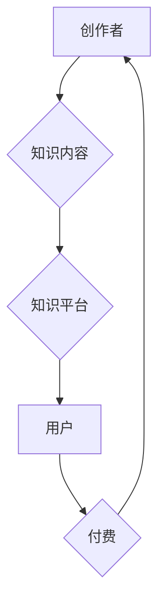

                 

## 知识付费如何实现可持续盈利？

> 关键词：知识付费、可持续盈利、商业模式、用户运营、内容价值、技术赋能、社区建设、数据分析

## 1. 背景介绍

知识经济时代，知识已成为最宝贵的资源。知识付费作为一种新型的商业模式，在近年来迅速发展，涌现出众多成功案例。然而，知识付费行业也面临着诸多挑战，如何实现可持续盈利是众多平台和创作者共同关注的问题。

传统商业模式以产品和服务为核心，而知识付费则以知识和技能为核心，通过提供有价值的知识内容，获取用户付费。知识付费的模式多样，包括在线课程、付费文章、会员订阅、咨询服务等。

## 2. 核心概念与联系

知识付费的核心在于价值交换。创作者提供有价值的知识内容，用户通过付费获得这些知识，双方实现互利共赢。

**知识付费商业模式架构**



**核心概念：**

* **创作者：** 拥有专业知识和技能的人，能够创作有价值的知识内容。
* **知识内容：** 包括文字、音频、视频等多种形式，提供有价值的知识和技能。
* **知识平台：** 提供知识内容发布、传播和交易的平台，例如在线课程平台、付费文章平台等。
* **用户：** 寻求知识和技能提升的用户，愿意为有价值的内容付费。

## 3. 核心算法原理 & 具体操作步骤

知识付费的实现并非单纯依靠算法，而是需要结合多种技术手段和商业策略。

### 3.1  算法原理概述

知识付费平台通常会采用一些算法来推荐内容、匹配用户和创作者，提高用户体验和平台活跃度。

* **内容推荐算法：** 基于用户历史行为、兴趣偏好等数据，推荐用户可能感兴趣的知识内容。
* **用户画像算法：** 分析用户数据，构建用户画像，以便更好地理解用户需求和行为模式。
* **创作者匹配算法：** 根据用户需求和创作者专业领域，匹配用户和合适的创作者。

### 3.2  算法步骤详解

具体算法步骤因平台和应用场景而异，但一般包括以下几个步骤：

1. **数据收集：** 收集用户行为数据、内容数据、创作者信息等。
2. **数据预处理：** 对收集到的数据进行清洗、转换和格式化。
3. **特征提取：** 从数据中提取用户特征、内容特征、创作者特征等。
4. **模型训练：** 利用机器学习算法，训练推荐、匹配等模型。
5. **模型评估：** 对模型进行评估，并不断优化模型参数。
6. **模型部署：** 将训练好的模型部署到线上环境，实时推荐和匹配。

### 3.3  算法优缺点

**优点：**

* **个性化推荐：** 能够根据用户需求，推荐更精准的内容。
* **提高用户粘性：** 通过个性化推荐，提高用户使用平台的频率和时长。
* **促进创作者收益：** 通过精准匹配，帮助创作者找到目标用户，提高收益。

**缺点：**

* **数据依赖：** 算法效果依赖于数据质量和数量。
* **算法偏差：** 算法可能会存在偏差，导致推荐结果不准确。
* **用户隐私：** 数据收集和分析可能会涉及用户隐私问题。

### 3.4  算法应用领域

知识付费平台的算法应用领域广泛，包括：

* **内容推荐：** 推荐用户可能感兴趣的课程、文章、视频等。
* **用户匹配：** 将用户与合适的创作者进行匹配。
* **课程推荐：** 根据用户学习目标和进度，推荐合适的课程。
* **付费策略：** 根据用户行为和价值，制定个性化的付费策略。

## 4. 数学模型和公式 & 详细讲解 & 举例说明

知识付费平台的运营可以借助数学模型和公式进行分析和优化。

### 4.1  数学模型构建

**用户价值模型：**

$$
UserValue = f(ContentQuality, UserInterest, LearningOutcome)
$$

其中：

* **UserValue:** 用户对知识内容的价值感知
* **ContentQuality:** 内容的质量和实用性
* **UserInterest:** 用户对内容的兴趣程度
* **LearningOutcome:** 用户从内容学习到的知识和技能

**创作者收益模型：**

$$
CreatorRevenue = g(UserValue, SubscriptionRate, AverageTransactionValue)
$$

其中：

* **CreatorRevenue:** 创作者的收入
* **UserValue:** 用户对知识内容的价值感知
* **SubscriptionRate:** 用户订阅付费服务的比例
* **AverageTransactionValue:** 用户每次付费的平均金额

### 4.2  公式推导过程

通过以上模型，可以分析用户价值和创作者收益之间的关系，并推导出一系列优化策略。例如，提高内容质量可以提升用户价值，从而提高订阅率和平均交易额，最终增加创作者收益。

### 4.3  案例分析与讲解

假设一个知识付费平台，其用户价值模型和创作者收益模型分别为：

* **UserValue = 0.8 * ContentQuality + 0.2 * UserInterest**
* **CreatorRevenue = 0.5 * UserValue * SubscriptionRate * AverageTransactionValue**

如果平台提高内容质量，可以提升用户价值，从而提高订阅率和平均交易额，最终增加创作者收益。

## 5. 项目实践：代码实例和详细解释说明

以下是一个简单的知识付费平台推荐算法的代码实例，使用Python语言实现。

### 5.1  开发环境搭建

* Python 3.x
* Pandas
* Scikit-learn

### 5.2  源代码详细实现

```python
import pandas as pd
from sklearn.metrics.pairwise import cosine_similarity

# 数据加载
data = pd.read_csv('user_content_data.csv')

# 用户特征提取
user_features = data[['user_id', 'age', 'gender', 'interests']]

# 内容特征提取
content_features = data[['content_id', 'topic', 'difficulty', 'length']]

# 计算用户与内容之间的余弦相似度
similarity_matrix = cosine_similarity(user_features, content_features)

# 推荐内容
def recommend_content(user_id, top_n=5):
    user_index = user_features[user_features['user_id'] == user_id].index[0]
    similarity_scores = similarity_matrix[user_index]
    top_content_indices = similarity_scores.argsort()[-top_n:][::-1]
    return content_features.iloc[top_content_indices]['content_id'].tolist()

# 示例
user_id = 1
recommended_content = recommend_content(user_id)
print(f'推荐给用户 {user_id} 的内容：{recommended_content}')
```

### 5.3  代码解读与分析

该代码首先加载用户和内容数据，然后提取用户和内容的特征。接着，使用余弦相似度计算用户与内容之间的相似度，并根据相似度推荐用户可能感兴趣的内容。

### 5.4  运行结果展示

运行该代码后，会输出推荐给指定用户的内容列表。

## 6. 实际应用场景

知识付费的应用场景广泛，包括：

* **在线教育：** 提供各种在线课程，涵盖各个领域。
* **专业技能培训：** 提供针对特定职业技能的培训课程。
* **个人成长：** 提供个人成长、心理咨询等方面的知识内容。
* **兴趣爱好：** 提供摄影、绘画、音乐等兴趣爱好方面的知识内容。

### 6.4  未来应用展望

未来，知识付费将更加个性化、智能化和多元化。

* **个性化推荐：** 利用人工智能技术，更加精准地推荐用户感兴趣的内容。
* **沉浸式体验：** 利用虚拟现实、增强现实等技术，提供更加沉浸式的学习体验。
* **社区互动：** 建立知识付费社区，促进用户之间的互动和交流。

## 7. 工具和资源推荐

### 7.1  学习资源推荐

* **在线课程平台：** Coursera, edX, Udemy
* **付费文章平台：** Medium, Substack
* **知识付费社区：** 知乎、豆瓣

### 7.2  开发工具推荐

* **Python：** 广泛应用于数据分析、机器学习等领域。
* **Django/Flask：** Python Web 开发框架。
* **React/Vue.js：** 前端开发框架。

### 7.3  相关论文推荐

* **The Economics of Online Education**
* **Personalized Learning: A Review of the Literature**
* **The Impact of Artificial Intelligence on Education**

## 8. 总结：未来发展趋势与挑战

知识付费行业发展迅速，但也面临着诸多挑战。

### 8.1  研究成果总结

* 知识付费商业模式已初步成熟，并取得了显著的成果。
* 算法技术在知识付费平台的应用取得了突破性进展。
* 用户对高质量知识内容的需求不断增长。

### 8.2  未来发展趋势

* 个性化推荐、智能化学习将成为未来发展趋势。
* 知识付费将更加多元化，覆盖更广泛的领域。
* 社区建设将成为知识付费平台的重要组成部分。

### 8.3  面临的挑战

* 内容质量控制、版权保护等问题仍需解决。
* 用户付费意愿和付费能力需要进一步提升。
* 平台运营成本和盈利模式需要不断探索。

### 8.4  研究展望

未来，需要进一步研究知识付费的商业模式、技术应用和社会影响，推动知识付费行业健康可持续发展。

## 9. 附录：常见问题与解答

* **如何提高知识付费平台的活跃度？**

可以通过个性化推荐、社区互动、线下活动等方式提高用户活跃度。

* **如何保证知识付费内容的质量？**

可以通过建立严格的审核机制、鼓励用户评价和反馈等方式保证内容质量。

* **如何提高用户付费意愿？**

可以通过提供高价值内容、制定优惠政策、建立信任关系等方式提高用户付费意愿。


作者：禅与计算机程序设计艺术 / Zen and the Art of Computer Programming 
<end_of_turn>

