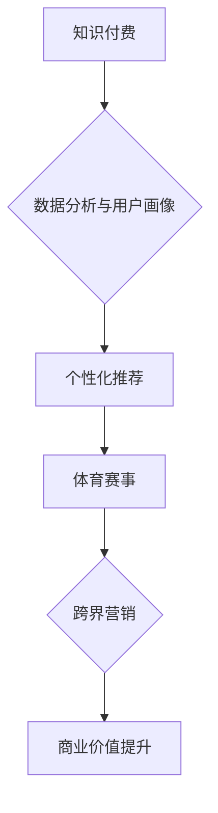

                 

## 关键词：知识付费、跨界营销、体育赛事、数据分析、用户画像、个性化推荐、内容生态、商业模式

## 1. 背景介绍

知识付费作为一种新型的商业模式，近年来发展迅速，其核心在于通过提供有价值的知识和技能，向用户收取费用。而体育赛事作为一项大众喜爱的娱乐活动，拥有庞大的受众群体和巨大的商业价值。两者看似独立，但实际上存在着巨大的协同潜力。

随着互联网技术的不断发展，数据分析、用户画像、个性化推荐等技术手段日益成熟，为知识付费与体育赛事跨界营销提供了强大的技术支撑。通过将知识付费与体育赛事相结合，可以实现资源共享、互利共赢，打造全新的商业生态。

## 2. 核心概念与联系

### 2.1 知识付费

知识付费是指通过互联网平台，将知识、技能、经验等转化为有价值的产品或服务，向用户收取费用的一种商业模式。其核心价值在于为用户提供专业、实用的知识和技能，帮助用户提升自身价值。

### 2.2 体育赛事

体育赛事是指以竞技为目的，由运动员或团队进行的比赛活动。其核心价值在于提供娱乐、激情、竞技等体验，吸引观众参与和观看。

### 2.3 跨界营销

跨界营销是指企业将自身产品或服务与其他行业或领域的品牌、产品或活动进行合作，共同推广，以达到扩大影响力、提升品牌知名度和销售额的目的。

**核心概念与联系流程图**



## 3. 核心算法原理 & 具体操作步骤

### 3.1 算法原理概述

知识付费与体育赛事跨界营销的核心算法原理在于数据分析、用户画像、个性化推荐和内容生态构建。

* **数据分析:** 通过对用户行为、兴趣爱好、消费习惯等数据的分析，构建用户画像，了解用户的需求和偏好。
* **用户画像:** 将用户数据进行分类和分析，构建用户画像，以便精准地推送相关内容和服务。
* **个性化推荐:** 根据用户的兴趣爱好、观看习惯等信息，推荐相关的知识付费课程和体育赛事内容。
* **内容生态构建:** 通过整合优质的知识付费内容和体育赛事资源，构建一个丰富的知识付费内容生态，满足用户的多元化需求。

### 3.2 算法步骤详解

1. **数据采集:** 收集用户行为数据、兴趣爱好数据、消费习惯数据等。
2. **数据清洗:** 对采集到的数据进行清洗和处理，去除无效数据和重复数据。
3. **数据分析:** 使用数据挖掘、机器学习等算法对数据进行分析，构建用户画像。
4. **个性化推荐:** 根据用户的兴趣爱好、观看习惯等信息，推荐相关的知识付费课程和体育赛事内容。
5. **内容生态构建:** 通过整合优质的知识付费内容和体育赛事资源，构建一个丰富的知识付费内容生态。

### 3.3 算法优缺点

**优点:**

* **精准推荐:** 通过数据分析和用户画像，可以精准地推荐用户感兴趣的内容。
* **个性化体验:** 为用户提供个性化的知识付费和体育赛事体验。
* **商业价值提升:** 通过跨界营销，可以提升知识付费平台和体育赛事品牌的商业价值。

**缺点:**

* **数据安全:** 需要妥善处理用户数据，保障用户隐私安全。
* **算法偏差:** 数据分析和算法推荐存在一定的偏差，可能导致推荐结果不准确。
* **内容质量:** 需要保证知识付费内容和体育赛事资源的质量，才能满足用户的需求。

### 3.4 算法应用领域

* **体育赛事直播平台:** 为用户推荐相关的知识付费课程，例如体育训练、战术分析等。
* **知识付费平台:** 为用户推荐相关的体育赛事内容，例如赛事直播、赛事回顾等。
* **体育俱乐部:** 利用数据分析和用户画像，精准地进行粉丝运营和营销推广。

## 4. 数学模型和公式 & 详细讲解 & 举例说明

### 4.1 数学模型构建

知识付费与体育赛事跨界营销的数学模型可以基于用户行为数据、兴趣爱好数据、消费习惯数据等构建。

例如，可以构建一个用户兴趣偏好模型，用 $P(u, c)$ 表示用户 $u$ 对知识付费课程 $c$ 的兴趣偏好，其中 $P(u, c)$ 为一个介于 0 到 1 之间的实数，表示用户对课程的兴趣程度。

### 4.2 公式推导过程

可以利用机器学习算法，例如逻辑回归、支持向量机等，对用户兴趣偏好模型进行训练，并推导出用户对不同知识付费课程的兴趣偏好概率。

例如，逻辑回归模型的输出公式为：

$$
P(u, c) = \frac{1}{1 + e^{-(w_0 + w_1 * f_1(u) + w_2 * f_2(c))}}
$$

其中，$w_0$, $w_1$, $w_2$ 为模型参数，$f_1(u)$ 和 $f_2(c)$ 为用户 $u$ 和课程 $c$ 的特征函数。

### 4.3 案例分析与讲解

假设有一个体育赛事直播平台，想要为用户推荐相关的知识付费课程。

可以利用用户观看历史数据、点赞数据、评论数据等构建用户兴趣偏好模型，并推导出用户对不同知识付费课程的兴趣偏好概率。

例如，如果用户经常观看篮球赛事，并且对篮球战术分析感兴趣，那么平台可以推荐用户相关的篮球战术分析课程。

## 5. 项目实践：代码实例和详细解释说明

### 5.1 开发环境搭建

* 操作系统: Ubuntu 20.04 LTS
* Python 版本: 3.8.10
* 必要的库: pandas, numpy, scikit-learn, matplotlib

### 5.2 源代码详细实现

```python
import pandas as pd
from sklearn.linear_model import LogisticRegression

# 加载用户数据
data = pd.read_csv('user_data.csv')

# 提取特征
user_features = data[['age', 'gender', 'watch_history']]
course_features = data[['course_category', 'course_duration']]

# 构建模型
model = LogisticRegression()
model.fit(user_features, data['interest_score'])

# 预测用户对课程的兴趣
predicted_interest = model.predict(user_features)

# 输出预测结果
print(predicted_interest)
```

### 5.3 代码解读与分析

* 代码首先加载用户数据，并提取用户特征和课程特征。
* 然后，使用逻辑回归模型训练用户兴趣偏好模型。
* 最后，使用训练好的模型预测用户对不同课程的兴趣，并输出预测结果。

### 5.4 运行结果展示

运行结果将显示每个用户的兴趣评分，例如：

```
[0.8, 0.2, 0.9, 0.1, ...]
```

其中，0.8 表示用户1对课程的兴趣评分为80%，0.2 表示用户2对课程的兴趣评分为20%，以此类推。

## 6. 实际应用场景

### 6.1 体育赛事直播平台

* **个性化推荐:** 为用户推荐相关的知识付费课程，例如体育训练、战术分析等。
* **会员权益:** 为会员用户提供专属的知识付费课程和体育赛事内容。
* **数据分析:** 利用用户观看数据、互动数据等进行数据分析，了解用户兴趣爱好和观看习惯，为内容运营提供参考。

### 6.2 知识付费平台

* **体育赛事内容:** 为用户提供相关的体育赛事内容，例如赛事直播、赛事回顾、赛事分析等。
* **跨界营销:** 与体育赛事平台合作，进行跨界营销推广，扩大平台影响力。
* **内容生态:** 构建一个丰富的体育赛事内容生态，满足用户多元化需求。

### 6.3 体育俱乐部

* **粉丝运营:** 利用数据分析和用户画像，精准地进行粉丝运营和营销推广。
* **会员服务:** 为会员用户提供专属的体育赛事内容和知识付费课程。
* **商业合作:** 与知识付费平台合作，开发相关的体育赛事知识付费产品。

### 6.4 未来应用展望

随着人工智能、大数据等技术的不断发展，知识付费与体育赛事跨界营销将呈现更加丰富的应用场景。

例如，可以利用虚拟现实、增强现实等技术，为用户提供更加沉浸式的体育赛事体验，并结合知识付费课程，提供更加个性化的学习体验。

## 7. 工具和资源推荐

### 7.1 学习资源推荐

* **书籍:**
    * 《深度学习》
    * 《机器学习实战》
    * 《数据挖掘：概念与技术》
* **在线课程:**
    * Coursera
    * edX
    * Udacity

### 7.2 开发工具推荐

* **Python:** 
    * pandas
    * numpy
    * scikit-learn
    * matplotlib
* **云平台:**
    * AWS
    * Azure
    * Google Cloud Platform

### 7.3 相关论文推荐

* **用户画像构建:**
    * "User Profiling for Personalized Recommendations"
    * "A Survey on User Profiling Techniques"
* **知识付费推荐:**
    * "Personalized Recommendation for Online Education"
    * "A Hybrid Approach for Recommending Knowledge-Based Content"

## 8. 总结：未来发展趋势与挑战

### 8.1 研究成果总结

知识付费与体育赛事跨界营销的研究成果表明，通过数据分析、用户画像、个性化推荐等技术手段，可以实现资源共享、互利共赢，打造全新的商业生态。

### 8.2 未来发展趋势

* **人工智能技术:** 人工智能技术将进一步推动知识付费与体育赛事跨界营销的发展，例如，利用自然语言处理技术，为用户提供更加精准的知识付费推荐。
* **内容生态构建:** 知识付费平台和体育赛事平台将更加注重内容生态的构建，提供更加丰富、多元化的内容，满足用户的多元化需求。
* **跨界合作:** 知识付费平台和体育赛事平台将更加积极地进行跨界合作，共同开发新的商业模式和服务。

### 8.3 面临的挑战

* **数据安全:** 需要妥善处理用户数据，保障用户隐私安全。
* **算法偏差:** 数据分析和算法推荐存在一定的偏差，可能导致推荐结果不准确。
* **内容质量:** 需要保证知识付费内容和体育赛事资源的质量，才能满足用户的需求。

### 8.4 研究展望

未来，需要进一步研究如何利用人工智能技术，构建更加精准的知识付费推荐模型，以及如何构建更加丰富的体育赛事内容生态，为用户提供更加优质的体验。


## 9. 附录：常见问题与解答

**Q1: 知识付费与体育赛事跨界营销的优势是什么？**

**A1:** 知识付费与体育赛事跨界营销的优势在于：

* **精准推荐:** 通过数据分析和用户画像，可以精准地推荐用户感兴趣的内容。
* **个性化体验:** 为用户提供个性化的知识付费和体育赛事体验。
* **商业价值提升:** 通过跨界营销，可以提升知识付费平台和体育赛事品牌的商业价值。

**Q2: 知识付费与体育赛事跨界营销面临哪些挑战？**

**A2:** 知识付费与体育赛事跨界营销面临的挑战包括：

* **数据安全:** 需要妥善处理用户数据，保障用户隐私安全。
* **算法偏差:** 数据分析和算法推荐存在一定的偏差，可能导致推荐结果不准确。
* **内容质量:** 需要保证知识付费内容和体育赛事资源的质量，才能满足用户的需求。

**Q3: 如何利用人工智能技术，提升知识付费与体育赛事跨界营销的效果？**

**A3:** 可以利用人工智能技术，例如：

* **自然语言处理:** 为用户提供更加精准的知识付费推荐。
* **机器学习:** 构建更加精准的用户画像，提供更加个性化的体验。
* **深度学习:** 预测用户未来的行为，提供更加有效的营销策略。


作者：禅与计算机程序设计艺术 / Zen and the Art of Computer Programming 
<end_of_turn>

