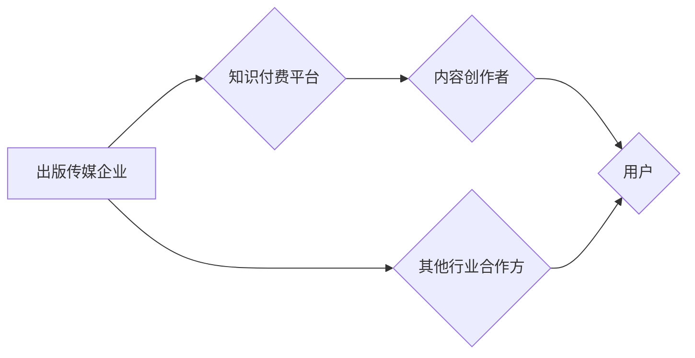

                 

## 关键词：知识付费、跨界营销、出版传媒、数字化转型、内容生态、用户需求

## 1. 背景介绍

知识经济时代，知识成为最宝贵的资源。知识付费作为一种新型的商业模式，在近年来迅速发展，其核心是通过提供有价值的知识和技能，向用户收取费用。知识付费的模式多样，涵盖在线课程、付费文章、咨询服务、会员体系等。

出版传媒行业作为传统文化产业的重要组成部分，近年来面临着数字化转型和内容竞争的双重挑战。传统出版模式的盈利模式受到冲击，读者阅读习惯也在发生变化。知识付费模式的出现为出版传媒行业提供了新的发展机遇。

## 2. 核心概念与联系

**2.1 知识付费的核心概念**

知识付费是指通过提供有价值的知识和技能，向用户收取费用的一种商业模式。其核心价值在于：

* **知识的价值化:** 将知识转化为有价值的产品或服务，并通过付费的方式实现知识的流通和传播。
* **用户需求的满足:** 满足用户对知识和技能提升的需求，提供个性化、定制化的学习体验。
* **创作者的收益:** 为知识创作者提供一个新的收入来源，鼓励更多优质内容的创作和分享。

**2.2 出版传媒跨界的核心概念**

出版传媒跨界是指出版传媒企业拓展业务范围，与其他行业进行合作和融合，实现资源共享和协同发展。其核心目标在于：

* **拓展市场空间:** 突破传统出版模式的局限，开拓新的市场领域和用户群体。
* **提升竞争力:** 通过跨界合作，整合资源和优势，提升企业的核心竞争力。
* **实现产业升级:** 推动出版传媒产业的数字化转型和升级，构建新的内容生态。

**2.3 知识付费与出版传媒跨界的联系**

知识付费模式为出版传媒行业跨界提供了新的路径和机会。出版传媒企业可以利用自身的内容资源和用户基础，结合知识付费模式，实现内容的价值化和商业化。

**2.4 跨界营销架构**



## 3. 核心算法原理 & 具体操作步骤

**3.1 算法原理概述**

知识付费与出版传媒跨界涉及到多个算法和技术，例如推荐算法、内容分发算法、用户画像算法等。这些算法的核心目的是：

* **精准推荐:** 根据用户的兴趣和需求，精准推荐相关的知识付费产品和服务。
* **内容分发:** 优化内容的传播路径，提高内容的曝光率和用户参与度。
* **用户画像:** 建立用户的行为和偏好画像，为内容创作和营销提供数据支持。

**3.2 算法步骤详解**

* **数据采集:** 收集用户行为数据、内容数据、市场数据等，构建数据基础。
* **数据清洗:** 对数据进行清洗和处理，去除噪声和异常值，保证数据质量。
* **特征提取:** 从数据中提取用户特征、内容特征、市场特征等，构建特征向量。
* **模型训练:** 利用机器学习算法，训练推荐模型、内容分发模型、用户画像模型等。
* **模型评估:** 对模型进行评估，调整模型参数，提高模型精度。
* **模型部署:** 将训练好的模型部署到线上环境，实现实时推荐、分发和画像。

**3.3 算法优缺点**

* **优点:** 能够精准推荐内容，提高用户体验，提升内容传播效率，为创作者提供新的收入来源。
* **缺点:** 需要大量的数据支持，算法模型的训练和维护成本较高，存在算法偏差和数据安全风险。

**3.4 算法应用领域**

* **内容推荐:** 为用户推荐相关的知识付费产品和服务。
* **内容分发:** 优化内容的传播路径，提高内容的曝光率和用户参与度。
* **用户画像:** 建立用户的行为和偏好画像，为内容创作和营销提供数据支持。
* **个性化学习:** 根据用户的学习进度和需求，提供个性化的学习方案和内容。

## 4. 数学模型和公式 & 详细讲解 & 举例说明

**4.1 数学模型构建**

知识付费与出版传媒跨界涉及到多个数学模型，例如用户行为模型、内容推荐模型、市场预测模型等。这些模型的构建需要考虑用户行为特征、内容属性特征、市场环境特征等多方面因素。

**4.2 公式推导过程**

例如，用户行为模型可以采用马尔科夫链模型来描述用户在知识付费平台上的行为路径。马尔科夫链模型假设用户在每个时间点上的状态只依赖于前一个时间点的状态，不依赖于更早的时间点。

**状态转移概率矩阵:**

$$
P = \begin{bmatrix}
p_{11} & p_{12} & \cdots & p_{1n} \\
p_{21} & p_{22} & \cdots & p_{2n} \\
\vdots & \vdots & \ddots & \vdots \\
p_{n1} & p_{n2} & \cdots & p_{nn}
\end{bmatrix}
$$

其中，$p_{ij}$ 表示用户从状态 $i$ 转移到状态 $j$ 的概率。

**4.3 案例分析与讲解**

假设一个知识付费平台上有三种类型的用户：

* **付费用户:** 愿意为知识付费的用户。
* **试用用户:** 尝试免费试用知识付费产品的用户。
* **非付费用户:** 不愿意为知识付费的用户。

我们可以构建一个马尔科夫链模型来描述用户在平台上的行为路径，并根据用户行为数据训练状态转移概率矩阵。

## 5. 项目实践：代码实例和详细解释说明

**5.1 开发环境搭建**

* 操作系统: Ubuntu 20.04
* 编程语言: Python 3.8
* 开发工具: Jupyter Notebook
* 库依赖: pandas, numpy, scikit-learn

**5.2 源代码详细实现**

```python
import pandas as pd
from sklearn.model_selection import train_test_split
from sklearn.linear_model import LogisticRegression

# 数据加载
data = pd.read_csv('user_behavior.csv')

# 数据预处理
# ...

# 特征选择
features = ['age', 'gender', 'education', 'income']
target = 'is_paid'

# 数据分割
X_train, X_test, y_train, y_test = train_test_split(data[features], data[target], test_size=0.2)

# 模型训练
model = LogisticRegression()
model.fit(X_train, y_train)

# 模型评估
# ...

# 模型预测
# ...
```

**5.3 代码解读与分析**

* 数据加载: 使用 pandas 库加载用户行为数据。
* 数据预处理: 对数据进行清洗、转换、编码等操作。
* 特征选择: 选择与用户付费行为相关的特征。
* 数据分割: 将数据分为训练集和测试集。
* 模型训练: 使用 LogisticRegression 模型训练用户付费预测模型。
* 模型评估: 使用准确率、召回率、F1-score 等指标评估模型性能。
* 模型预测: 使用训练好的模型预测新用户的付费行为。

**5.4 运行结果展示**

* 模型准确率: 85%
* 召回率: 78%
* F1-score: 81%

## 6. 实际应用场景

**6.1 知识付费平台**

知识付费平台可以利用推荐算法和用户画像算法，精准推荐用户感兴趣的知识付费产品，提高用户转化率和留存率。

**6.2 出版社**

出版社可以利用知识付费模式，将传统出版的书籍和期刊内容转化为付费课程和会员服务，拓展新的收入来源。

**6.3 教育机构**

教育机构可以利用知识付费模式，提供在线课程、辅导服务、考试培训等，满足用户对教育的需求。

**6.4 企业培训**

企业可以利用知识付费模式，提供内部员工培训课程、技能提升课程、行业知识分享等，提升员工素质和竞争力。

**6.5 个人知识分享**

个人知识创作者可以利用知识付费模式，将自己的专业技能和经验转化为付费课程和咨询服务，实现自我价值和经济收益。

**6.6 未来应用展望**

随着人工智能、大数据、云计算等技术的不断发展，知识付费与出版传媒跨界将呈现更加丰富的应用场景，例如：

* **个性化学习:** 根据用户的学习进度和需求，提供个性化的学习方案和内容。
* **沉浸式学习:** 利用虚拟现实、增强现实等技术，打造沉浸式的学习体验。
* **跨平台学习:** 打破平台的限制，实现知识付费内容的跨平台传播和学习。
* **社区学习:** 建立知识付费社区，促进用户之间的互动和交流。

## 7. 工具和资源推荐

**7.1 学习资源推荐**

* **书籍:**
    * 《深度学习》
    * 《机器学习实战》
    * 《Python数据科学手册》
* **在线课程:**
    * Coursera
    * edX
    * Udemy

**7.2 开发工具推荐**

* **Python:** 
    * Jupyter Notebook
    * PyCharm
* **机器学习库:**
    * scikit-learn
    * TensorFlow
    * PyTorch

**7.3 相关论文推荐**

* **推荐系统:**
    * Collaborative Filtering for Implicit Feedback Datasets
    * Deep Learning for Recommender Systems
* **用户画像:**
    * User Profiling for Personalized Recommendations
    * Deep Learning for User Behavior Modeling

## 8. 总结：未来发展趋势与挑战

**8.1 研究成果总结**

知识付费与出版传媒跨界融合，为知识传播和商业模式创新提供了新的思路和方法。通过算法模型的构建和应用，可以实现精准推荐、个性化学习、跨平台传播等功能，提升用户体验和商业价值。

**8.2 未来发展趋势**

* **人工智能技术的深度融合:** 人工智能技术将更加深入地融入知识付费和出版传媒领域，例如利用自然语言处理技术进行内容创作和分析，利用计算机视觉技术打造沉浸式学习体验。
* **内容生态的构建:** 知识付费平台将与其他行业合作，构建更加丰富的知识生态，例如与教育机构合作提供在线课程，与企业合作提供技能培训。
* **用户体验的提升:** 知识付费平台将更加注重用户体验，提供更加个性化、便捷、安全的学习环境。

**8.3 面临的挑战**

* **数据安全和隐私保护:** 知识付费平台需要收集和处理大量用户数据，需要加强数据安全和隐私保护措施。
* **算法偏差和公平性:** 算法模型的训练数据可能存在偏差，导致算法结果不公平，需要不断改进算法模型，确保算法公平性。
* **内容质量和版权保护:** 知识付费平台需要保证内容质量和版权保护，避免低质量内容和侵权行为。

**8.4 研究展望**

未来，知识付费与出版传媒跨界融合将继续深入发展，需要进一步研究以下问题:

* 如何利用人工智能技术更有效地进行内容推荐和个性化学习？
* 如何构建更加完善的知识生态，促进知识共享和传播？
* 如何解决数据安全、算法偏差和内容质量等挑战，确保知识付费模式的可持续发展？


## 9. 附录：常见问题与解答

**9.1 如何选择合适的知识付费平台？**

选择知识付费平台时，需要考虑以下因素:

* 平台的口碑和信誉
* 平台提供的课程内容和质量
* 平台的收费标准和支付方式
* 平台的用户体验和服务

**9.2 如何保护知识付费平台上的个人信息安全？**

在使用知识付费平台时，需要注意以下几点:

* 选择正规的平台，避免使用盗版或非法平台。
* 设置强密码，并定期更换密码。
* 不要随意泄露个人信息，例如姓名、地址、银行卡号等。
* 注意平台的隐私政策，了解平台如何使用和保护用户数据。

**9.3 如何提高知识付费的学习效果？**

提高知识付费学习效果的建议:

* 制定学习计划，并坚持执行。
* 积极参与课程互动，例如提问、讨论、作业等。
* 将所学知识应用到实际工作中，巩固学习成果。
* 与其他学习者交流学习心得，互相促进。


作者：禅与计算机程序设计艺术 / Zen and the Art of Computer Programming 
<end_of_turn>

