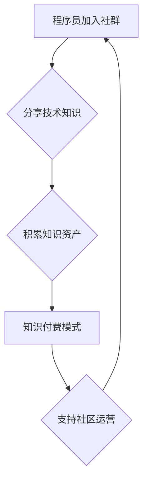

                 

## 知识付费：程序员的社群运营思维

> 关键词：知识付费、程序员、社群运营、内容创作、社区建设、技术分享、在线教育、商业模式

### 1. 背景介绍

在当今数字化时代，知识已成为最宝贵的资源之一。程序员作为科技领域的核心力量，拥有丰富的技术经验和专业技能，他们积累的知识也蕴藏着巨大的价值。知识付费模式的兴起为程序员提供了新的收入来源和职业发展路径，同时也为技术社区建设和知识传播提供了新的平台。

近年来，知识付费市场蓬勃发展，涵盖了各个领域，其中程序员领域的知识付费尤为活跃。从在线课程、书籍、视频教程到技术博客、社群论坛，程序员们通过多种方式分享他们的技术知识和经验，并从中获得收益。

### 2. 核心概念与联系

**2.1 知识付费**

知识付费是指通过付费的方式获取知识和技能，是一种基于知识价值的商业模式。它打破了传统教育模式的限制，让知识更加便捷、高效地传播和获取。

**2.2 社群运营**

社群运营是指围绕特定主题或目标，建立和管理一个活跃的线上或线下社区，通过内容创作、互动交流、活动组织等方式，提升社区粘性，打造用户忠诚度。

**2.3 程序员社群**

程序员社群是指由程序员组成，以技术交流、学习分享、项目合作等为主要目的的线上或线下社区。

**2.4 核心概念联系**

知识付费与社群运营相结合，可以形成一个良性循环：

* 社群运营吸引程序员加入，建立活跃的社区氛围。
* 社区成员分享技术知识，积累知识资产。
* 知识付费模式将知识资产转化为经济价值，支持社区运营和发展。

**Mermaid 流程图**



### 3. 核心算法原理 & 具体操作步骤

**3.1 算法原理概述**

知识付费模式的核心算法原理在于价值评估和内容分发。

* **价值评估:** 通过分析用户需求、市场趋势和知识内容的深度和广度，评估知识内容的价值，确定合理的付费价格。
* **内容分发:** 利用算法推荐机制，将符合用户需求的知识内容精准推送，提高用户获取知识的效率和体验。

**3.2 算法步骤详解**

1. **用户画像构建:** 收集用户数据，分析用户兴趣、技能水平、学习目标等，构建用户画像。
2. **知识内容分类:** 对知识内容进行分类和标签化，方便用户搜索和筛选。
3. **价值评估模型:** 建立价值评估模型，根据知识内容的深度、广度、实用性、独特性等因素，评估知识内容的价值。
4. **推荐算法:** 利用协同过滤、内容过滤、深度学习等算法，根据用户画像和知识内容特征，推荐符合用户需求的知识内容。
5. **付费机制:** 设计灵活的付费机制，例如订阅制、课程购买、会员体系等，满足不同用户的付费需求。

**3.3 算法优缺点**

* **优点:** 提高知识内容的精准推荐，提升用户学习体验，促进知识付费模式的推广。
* **缺点:** 算法模型的准确性依赖于数据质量，算法推荐结果可能存在偏差，需要不断优化和改进。

**3.4 算法应用领域**

* 在线教育平台
* 技术博客网站
* 社群论坛
* 个人知识分享平台

### 4. 数学模型和公式 & 详细讲解 & 举例说明

**4.1 数学模型构建**

知识内容的价值评估可以采用评分模型，例如基于用户反馈的评分模型。

**4.2 公式推导过程**

假设一个知识内容的评分模型如下：

$$
Score = \alpha \cdot UserFeedback + \beta \cdot ContentDepth + \gamma \cdot ContentBreadth
$$

其中：

* $Score$：知识内容的评分
* $UserFeedback$：用户对知识内容的评价分数
* $ContentDepth$：知识内容的深度，例如知识点的复杂度、理论基础等
* $ContentBreadth$：知识内容的广度，例如知识点的覆盖范围、应用场景等
* $\alpha$, $\beta$, $\gamma$：权重系数，根据实际情况进行调整

**4.3 案例分析与讲解**

假设一个关于机器学习的课程，用户评价分数为 4.5 分，知识内容深度为 8 分，知识内容广度为 6 分。权重系数设定为 $\alpha = 0.4$, $\beta = 0.3$, $\gamma = 0.3$。

则该课程的评分为：

$$
Score = 0.4 \cdot 4.5 + 0.3 \cdot 8 + 0.3 \cdot 6 = 1.8 + 2.4 + 1.8 = 6
$$

该课程的评分为 6 分，表明该课程的价值较高。

### 5. 项目实践：代码实例和详细解释说明

**5.1 开发环境搭建**

* Python 3.x
* Flask 或 Django 框架
* 数据库 (例如 MySQL, PostgreSQL)
* 前端框架 (例如 React, Vue.js)

**5.2 源代码详细实现**

以下是一个简单的 Flask 应用程序示例，用于展示知识付费平台的基本功能：

```python
from flask import Flask, render_template, request

app = Flask(__name__)

# 模拟知识内容数据
courses = [
    {
        "id": 1,
        "title": "Python 基础教程",
        "price": 99,
        "description": "这是一门Python基础教程，适合初学者学习Python编程。"
    },
    {
        "id": 2,
        "title": "机器学习入门",
        "price": 199,
        "description": "这是一门机器学习入门教程，讲解机器学习的基本概念和算法。"
    }
]

@app.route("/")
def index():
    return render_template("index.html", courses=courses)

@app.route("/course/<int:course_id>")
def course_detail(course_id):
    course = next((c for c in courses if c["id"] == course_id), None)
    return render_template("course_detail.html", course=course)

if __name__ == "__main__":
    app.run(debug=True)
```

**5.3 代码解读与分析**

* 应用程序使用 Flask 框架构建，提供简单的路由和模板渲染功能。
* 模拟了知识内容数据，包括课程标题、价格和描述。
* `/` 路由渲染首页，展示所有课程列表。
* `/course/<int:course_id>` 路由渲染课程详情页面，根据课程 ID 获取对应课程信息。

**5.4 运行结果展示**

运行上述代码，访问 `http://127.0.0.1:5000/`，即可看到简单的知识付费平台首页，展示课程列表。点击课程标题，即可进入课程详情页面。

### 6. 实际应用场景

**6.1 在线教育平台**

在线教育平台可以利用知识付费模式，提供各种类型的课程和培训，例如编程、设计、写作、管理等。

**6.2 技术博客网站**

技术博客网站可以将技术文章、代码示例、工具教程等内容付费化，吸引用户订阅和付费阅读。

**6.3 社群论坛**

技术社群论坛可以提供付费会员服务，例如获得优先答疑、参与线下活动、获取独家资源等。

**6.4 未来应用展望**

* **个性化学习:** 基于用户画像和学习行为，提供个性化的学习路径和内容推荐。
* **沉浸式学习:** 利用虚拟现实、增强现实等技术，打造沉浸式的学习体验。
* **元宇宙学习:** 在元宇宙环境中构建虚拟学习空间，实现线上线下学习的融合。

### 7. 工具和资源推荐

**7.1 学习资源推荐**

* **在线课程平台:** Udemy, Coursera, edX
* **技术博客网站:** Medium, Dev.to, Hacker News
* **社群论坛:** Stack Overflow, GitHub, Reddit

**7.2 开发工具推荐**

* **Python 框架:** Flask, Django
* **数据库:** MySQL, PostgreSQL, MongoDB
* **前端框架:** React, Vue.js, Angular

**7.3 相关论文推荐**

* **知识付费模式研究:** 
* **社群运营研究:** 
* **算法推荐研究:** 

### 8. 总结：未来发展趋势与挑战

**8.1 研究成果总结**

知识付费模式为程序员提供了新的收入来源和职业发展路径，同时也为技术社区建设和知识传播提供了新的平台。

**8.2 未来发展趋势**

* **个性化学习:** 基于用户画像和学习行为，提供个性化的学习路径和内容推荐。
* **沉浸式学习:** 利用虚拟现实、增强现实等技术，打造沉浸式的学习体验。
* **元宇宙学习:** 在元宇宙环境中构建虚拟学习空间，实现线上线下学习的融合。

**8.3 面临的挑战**

* **知识质量控制:** 确保知识内容的准确性和实用性。
* **用户信任建立:** 提升用户对知识付费平台的信任度。
* **商业模式创新:** 探索新的商业模式，实现可持续发展。

**8.4 研究展望**

未来研究方向包括：

* **更精准的知识推荐算法:** 利用深度学习等技术，提高知识推荐的精准度和个性化程度。
* **沉浸式学习体验的设计:** 研究如何利用虚拟现实、增强现实等技术，打造更具吸引力和互动性的学习体验。
* **元宇宙学习环境的构建:** 研究如何构建虚拟学习空间，实现线上线下学习的融合。

### 9. 附录：常见问题与解答

* **如何选择合适的知识付费平台？**

选择知识付费平台时，可以考虑以下因素：

* 平台的口碑和信誉
* 平台提供的课程质量和内容丰富度
* 平台的付费模式和价格
* 平台的用户体验和服务

* **如何保护知识产权？**

知识付费平台通常会提供知识产权保护机制，例如版权声明、水印技术、加密技术等。

* **如何提升知识付费平台的运营效果？**

提升知识付费平台的运营效果，可以从以下方面入手：

* 持续创作优质的知识内容
* 利用社交媒体和营销活动推广平台
* 提供良好的用户体验和服务
* 建立活跃的社群氛围


作者：禅与计算机程序设计艺术 / Zen and the Art of Computer Programming 
<end_of_turn>

