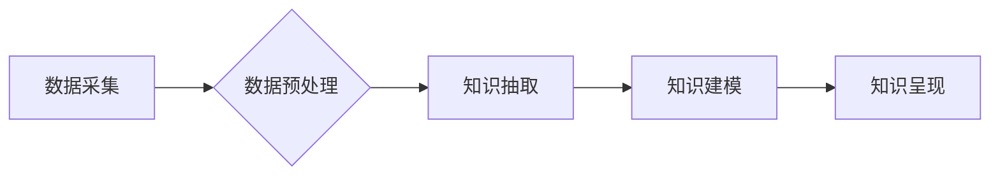

                 

## 知识发现引擎助力程序员快速掌握行业动态的方法

> 关键词：知识发现引擎、程序员、行业动态、机器学习、自然语言处理、数据可视化、知识图谱、人工智能

### 1. 背景介绍

在当今科技飞速发展的时代，程序员面临着前所未有的挑战。新技术层出不穷，行业动态变化无常，想要保持竞争力，必须不断学习和更新知识。传统的学习方式，例如阅读书籍、参加培训课程，虽然有效，但效率低下，难以跟上快速变化的行业节奏。

知识发现引擎 (Knowledge Discovery Engine，KDE) 作为一种人工智能技术，能够从海量数据中自动发现隐藏的知识和模式，为程序员提供一种高效、便捷的学习新知和掌握行业动态的方法。

### 2. 核心概念与联系

#### 2.1  知识发现引擎 (KDE)

知识发现引擎 (KDE) 是一种利用机器学习、数据挖掘和自然语言处理等技术，从海量数据中自动发现隐藏的知识和模式的系统。KDE 的核心目标是将数据转化为可理解、可利用的知识，并以可视化、可交互的方式呈现给用户。

#### 2.2  行业动态

行业动态是指特定行业内发生的各种事件、趋势和变化，例如新技术的发布、市场需求的变化、竞争格局的调整等。掌握行业动态对于程序员来说至关重要，因为它能够帮助他们了解行业发展方向，及时调整学习方向，提高职业竞争力。

#### 2.3  联系

KDE 可以帮助程序员快速掌握行业动态，其工作原理如下：

1. **数据采集:** KDE 从互联网、行业论坛、技术博客、新闻网站等各种渠道收集相关行业数据。
2. **数据预处理:** KDE 对收集到的数据进行清洗、格式化和转换，使其能够被机器学习算法处理。
3. **知识抽取:** KDE 利用自然语言处理技术，从数据中抽取关键信息，例如新技术名称、应用场景、市场趋势等。
4. **知识建模:** KDE 将抽取到的关键信息构建成知识图谱，并利用机器学习算法发现其中的隐藏关系和模式。
5. **知识呈现:** KDE 将发现的知识以可视化、可交互的方式呈现给用户，例如知识图谱、趋势图、事件 timeline 等。

**Mermaid 流程图**



### 3. 核心算法原理 & 具体操作步骤

#### 3.1  算法原理概述

KDE 中常用的算法包括：

* **文本分类:** 用于将文本数据分类到不同的类别，例如技术领域、行业趋势等。
* **主题模型:** 用于从文本数据中提取主题，例如新技术、市场竞争等。
* **关系抽取:** 用于从文本数据中抽取实体之间的关系，例如技术应用场景、竞争对手关系等。
* **知识图谱构建:** 用于将抽取到的实体和关系构建成知识图谱，并进行推理和查询。

#### 3.2  算法步骤详解

1. **数据清洗:** 移除数据中的噪声、重复数据和错误数据。
2. **文本预处理:** 将文本数据转换为机器可理解的格式，例如分词、词干提取、词向量化等。
3. **特征提取:** 从文本数据中提取特征，例如关键词、词频、句子结构等。
4. **模型训练:** 利用训练数据训练机器学习模型，例如文本分类模型、主题模型等。
5. **模型评估:** 使用测试数据评估模型的性能，例如准确率、召回率等。
6. **知识抽取:** 利用训练好的模型从新数据中抽取关键信息。
7. **知识建模:** 将抽取到的信息构建成知识图谱。
8. **知识呈现:** 将知识图谱以可视化、可交互的方式呈现给用户。

#### 3.3  算法优缺点

**优点:**

* 自动化：KDE 可以自动从海量数据中发现知识，无需人工干预。
* 高效：KDE 可以快速处理海量数据，提高知识发现效率。
* 准确性：KDE 利用机器学习算法，能够发现隐藏的知识和模式，提高知识发现准确性。

**缺点:**

* 数据依赖：KDE 的性能取决于数据质量和数量。
* 算法复杂性：KDE 的算法复杂，需要专业的技术人员进行开发和维护。
* 知识解释性：KDE 发现的知识可能难以解释，需要进一步的分析和理解。

#### 3.4  算法应用领域

KDE 在多个领域都有广泛的应用，例如：

* **科技行业:** 帮助程序员掌握新技术、行业趋势和竞争对手信息。
* **金融行业:** 帮助分析师发现市场趋势、风险因素和投资机会。
* **医疗行业:** 帮助医生诊断疾病、预测患者风险和制定治疗方案。
* **教育行业:** 帮助学生学习新知识、发现学习兴趣和提升学习效率。

### 4. 数学模型和公式 & 详细讲解 & 举例说明

#### 4.1  数学模型构建

KDE 中常用的数学模型包括：

* **贝叶斯网络:** 用于表示随机变量之间的依赖关系，并进行概率推理。
* **支持向量机 (SVM):** 用于分类和回归问题，能够处理高维数据。
* **深度学习模型:** 例如循环神经网络 (RNN) 和卷积神经网络 (CNN)，能够学习复杂的数据模式。

#### 4.2  公式推导过程

例如，在文本分类任务中，可以使用朴素贝叶斯算法进行分类。朴素贝叶斯算法基于贝叶斯定理，计算给定文本特征的类别概率。

**贝叶斯定理:**

$$P(C|D) = \frac{P(D|C)P(C)}{P(D)}$$

其中：

* $P(C|D)$ 是给定文本特征 $D$ 的类别 $C$ 的概率。
* $P(D|C)$ 是给定类别 $C$ 的文本特征 $D$ 的概率。
* $P(C)$ 是类别 $C$ 的先验概率。
* $P(D)$ 是文本特征 $D$ 的概率。

#### 4.3  案例分析与讲解

例如，假设我们想要分类文本数据，判断其属于“技术新闻”还是“财经新闻”。我们可以使用朴素贝叶斯算法，训练模型，并根据文本特征计算其属于每个类别的概率。

例如，如果文本中包含关键词“人工智能”、“机器学习”等，则其属于“技术新闻”的概率会更高。

### 5. 项目实践：代码实例和详细解释说明

#### 5.1  开发环境搭建

KDE 的开发环境通常包括：

* **操作系统:** Linux、macOS 或 Windows
* **编程语言:** Python、Java 或 C++
* **机器学习库:** scikit-learn、TensorFlow 或 PyTorch
* **数据存储库:** MongoDB、MySQL 或 PostgreSQL

#### 5.2  源代码详细实现

以下是一个使用 Python 和 scikit-learn 库实现文本分类的简单代码示例：

```python
from sklearn.feature_extraction.text import TfidfVectorizer
from sklearn.naive_bayes import MultinomialNB
from sklearn.model_selection import train_test_split

# 数据集
texts = [
    "人工智能正在改变世界",
    "股市波动剧烈",
    "机器学习算法取得突破",
    "美元兑人民币汇率下跌",
]
labels = ["技术新闻", "财经新闻", "技术新闻", "财经新闻"]

# 数据预处理
vectorizer = TfidfVectorizer()
X = vectorizer.fit_transform(texts)

# 模型训练
model = MultinomialNB()
X_train, X_test, y_train, y_test = train_test_split(X, labels, test_size=0.2)
model.fit(X_train, y_train)

# 模型评估
accuracy = model.score(X_test, y_test)
print(f"模型准确率: {accuracy}")

# 预测新文本
new_text = "深度学习技术发展迅速"
new_text_vector = vectorizer.transform([new_text])
prediction = model.predict(new_text_vector)
print(f"新文本分类结果: {prediction[0]}")
```

#### 5.3  代码解读与分析

这段代码首先使用 TfidfVectorizer 将文本数据转换为特征向量。然后使用 MultinomialNB 模型训练分类器。最后使用测试数据评估模型性能，并预测新文本的类别。

#### 5.4  运行结果展示

运行这段代码后，会输出模型的准确率和对新文本的预测结果。

### 6. 实际应用场景

#### 6.1  程序员学习新技术

KDE 可以帮助程序员快速掌握新技术，例如：

* **自动发现新技术文章:** KDE 可以从技术博客、论坛和新闻网站中自动发现新技术文章，并根据程序员的兴趣爱好进行推荐。
* **生成技术学习路线:** KDE 可以根据程序员的技能水平和学习目标，生成个性化的技术学习路线。
* **提供技术学习资源:** KDE 可以推荐相关的书籍、课程、视频和代码示例，帮助程序员更深入地学习新技术。

#### 6.2  行业趋势分析

KDE 可以帮助程序员分析行业趋势，例如：

* **识别热门技术:** KDE 可以分析技术文章、论坛讨论和代码库，识别当前热门的技术和趋势。
* **预测技术发展方向:** KDE 可以分析历史数据和当前趋势，预测未来技术的发展方向。
* **了解竞争对手:** KDE 可以分析竞争对手的技术博客、产品发布和市场活动，了解竞争对手的优势和劣势。

#### 6.3  项目需求分析

KDE 可以帮助程序员分析项目需求，例如：

* **提取项目需求关键词:** KDE 可以从项目文档、需求说明书和用户反馈中提取关键需求关键词。
* **识别项目风险:** KDE 可以分析项目需求和技术文档，识别潜在的项目风险。
* **生成项目解决方案:** KDE 可以根据项目需求和技术趋势，生成可能的项目解决方案。

#### 6.4  未来应用展望

KDE 在未来将有更广泛的应用场景，例如：

* **个性化学习:** KDE 可以根据用户的学习风格和兴趣爱好，提供个性化的学习内容和学习路径。
* **智能代码生成:** KDE 可以根据程序员的代码注释和需求描述，自动生成代码片段。
* **代码缺陷检测:** KDE 可以分析代码库，识别潜在的代码缺陷和安全漏洞。

### 7. 工具和资源推荐

#### 7.1  学习资源推荐

* **书籍:**
    * 《数据挖掘：概念与技术》
    * 《机器学习》
    * 《自然语言处理》
* **在线课程:**
    * Coursera: 数据科学、机器学习、自然语言处理
    * edX: 数据挖掘、人工智能
    * Udacity: 机器学习工程师

#### 7.2  开发工具推荐

* **Python:** scikit-learn、TensorFlow、PyTorch
* **Java:** Weka、Deeplearning4j
* **C++:** OpenCV、Dlib

#### 7.3  相关论文推荐

* **Knowledge Discovery in Databases (KDD):** https://www.kdd.org/
* **Association for Computing Machinery (ACM) Digital Library:** https://dl.acm.org/

### 8. 总结：未来发展趋势与挑战

#### 8.1  研究成果总结

KDE 在知识发现领域取得了显著的成果，能够帮助程序员快速掌握行业动态，提高学习效率和工作效率。

#### 8.2  未来发展趋势

KDE 的未来发展趋势包括：

* **更强大的算法:** 开发更强大的机器学习算法，能够发现更复杂、更深层的知识。
* **更丰富的知识表示:** 探索更丰富的知识表示形式，例如知识图谱、语义网络等。
* **更个性化的服务:** 提供更个性化的知识发现服务，根据用户的需求和兴趣爱好进行定制。

#### 8.3  面临的挑战

KDE 还面临一些挑战，例如：

* **数据质量:** KDE 的性能取决于数据质量，需要不断提高数据采集和预处理的质量。
* **算法解释性:** KDE 发现的知识可能难以解释，需要进一步研究算法解释性问题。
* **伦理问题:** KDE 的应用可能涉及到隐私和伦理问题，需要谨慎考虑和解决。

#### 8.4  研究展望

未来，KDE 将继续朝着更智能、更个性化、更安全的方向发展，为程序员提供更强大的知识发现工具和服务。

### 9. 附录：常见问题与解答

#### 9.1  Q1: KDE 的应用场景有哪些？

**A1:** KDE 的应用场景非常广泛，例如程序员学习新技术、行业趋势分析、项目需求分析等。

#### 9.2  Q2: 如何搭建 KDE 的开发环境？

**A2:** KDE 的开发环境通常包括操作系统、编程语言、机器学习库和数据存储库。

#### 9.3  Q3: KDE 的未来发展趋势是什么？

**A3:** KDE 的未来发展趋势包括更强大的算法、更丰富的知识表示和更个性化的服务。


作者：禅与计算机程序设计艺术 / Zen and the Art of Computer Programming<end_of_turn>

