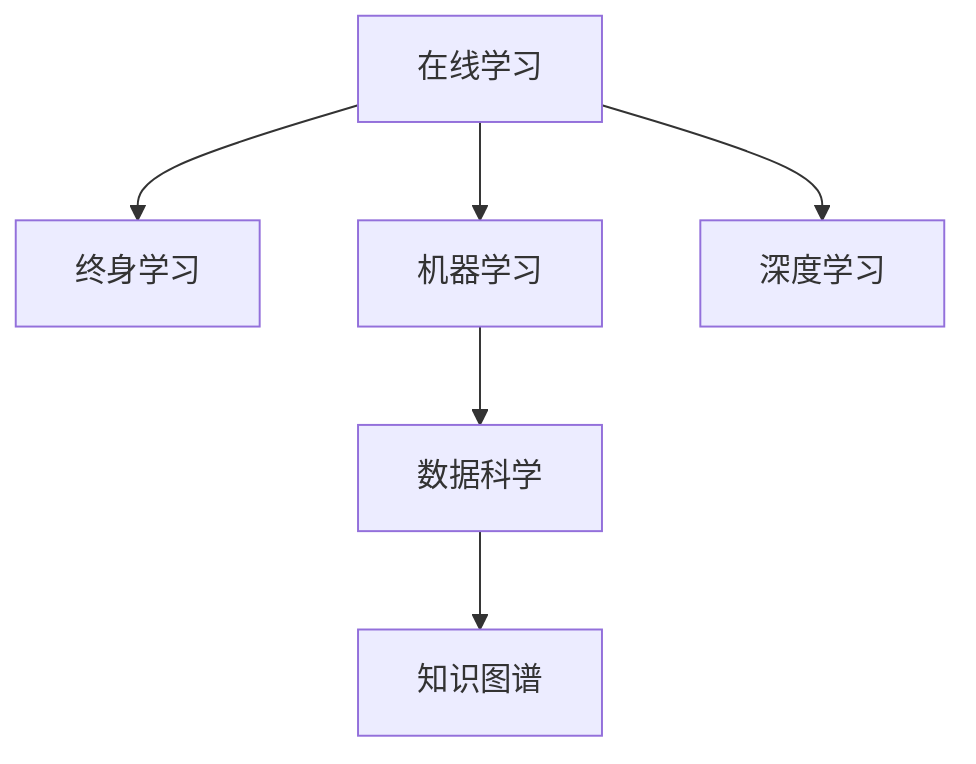

                 

# 持续学习：保持竞争力的秘诀

> 关键词：持续学习,在线学习,终身学习,人工智能,机器学习,深度学习,数据科学,知识图谱

## 1. 背景介绍

### 1.1 问题由来

在全球经济不断演进和技术的日新月异中，持续学习已成为企业和个人保持竞争力的关键。持续学习不仅仅意味着学习新技能，更重要的是不断更新知识和理念，以适应不断变化的市场环境和职业要求。在人工智能（AI）和深度学习（DL）领域，持续学习更是推动技术进步和应用创新的重要推动力。

**持续学习的意义**：
- **应对变化**：技术发展日新月异，通过持续学习，可以及时掌握最新技术，应对市场变化。
- **技能提升**：不断学习新的方法和技术，提升个人或团队的专业能力，增强竞争力。
- **创新驱动**：持续学习驱动新思想和创新的产生，推动技术突破和应用创新。
- **职业发展**：持续学习使专业人员能够不断提升自己的职业水平，实现职业生涯的成长和飞跃。

### 1.2 问题核心关键点

在AI和DL领域，持续学习包含多个核心关键点：

- **在线学习**：通过网络平台进行远程学习，时间地点灵活，方便用户自主学习。
- **终身学习**：持续终身地学习新知识，而非仅限于特定时期。
- **机器学习与深度学习**：运用机器学习算法和深度学习框架进行持续学习，提升模型性能和泛化能力。
- **数据科学**：利用数据科学方法进行数据分析、挖掘和应用，提升学习效果和决策质量。
- **知识图谱**：构建和应用知识图谱，帮助理解和组织知识，提升学习的深度和广度。

这些关键点共同构成了AI和DL领域的持续学习范式，推动技术不断进步和应用拓展。

## 2. 核心概念与联系

### 2.1 核心概念概述

为更好地理解持续学习的核心概念，本节将介绍几个密切相关的核心概念：

- **在线学习**：指通过网络平台进行的学习方式，涵盖自定进度的自主学习、互动式学习、实时反馈等。
- **终身学习**：指在个人整个职业生涯中持续进行学习，不断更新知识和技能，适应职业变化。
- **机器学习**：利用算法和模型对数据进行分析，从而提升模型性能和决策能力。
- **深度学习**：一种特殊的机器学习方法，通过多层神经网络进行复杂非线性映射。
- **数据科学**：涵盖数据采集、处理、分析和可视化的跨学科领域，旨在提取有价值的信息。
- **知识图谱**：利用图结构组织和表达知识，帮助理解和应用知识。

这些概念之间的逻辑关系可以通过以下Mermaid流程图来展示：



这个流程图展示了一系列核心概念及其之间的关系：

1. 在线学习提供了灵活的学习方式，为终身学习提供保障。
2. 机器学习和深度学习是持续学习的重要工具。
3. 数据科学是持续学习的技术支撑，提供分析工具。
4. 知识图谱帮助理解和组织知识，辅助深度学习和数据分析。

这些概念共同构成了AI和DL领域的持续学习框架，为其发展和应用提供了理论基础。

## 3. 核心算法原理 & 具体操作步骤
### 3.1 算法原理概述

持续学习是一种在动态环境中不断更新模型以适应数据分布变化的学习范式。其核心思想是：模型通过不断地学习新数据，不断调整参数，保持模型的泛化能力和性能。

形式化地，假设模型为 $M$，数据分布为 $p$，则持续学习的目标是：

$$
\min_{M} \mathbb{E}_{p}[\ell(M(x),y)]
$$

其中 $\ell$ 为损失函数，$x$ 和 $y$ 分别为输入和输出。持续学习的过程可以表示为：

1. 收集新数据 $D_t$。
2. 根据新数据，更新模型参数 $\theta$。
3. 在新数据上评估模型性能。
4. 重复上述步骤，直至模型收敛。

### 3.2 算法步骤详解

持续学习的主要步骤包括数据收集、模型更新、性能评估和模型迭代。

**数据收集**：
- 确定学习周期和更新频率。
- 通过网络爬虫、API接口等方式，获取新的数据样本。
- 对新数据进行预处理和标注，确保数据质量和格式统一。

**模型更新**：
- 选择合适的优化算法，如梯度下降、Adam等，更新模型参数。
- 设置合适的学习率和正则化参数，避免过拟合和欠拟合。
- 使用新数据对模型进行小批量更新，避免一次性更新导致的较大波动。

**性能评估**：
- 在验证集上评估模型性能，如准确率、精确率、召回率等。
- 记录并分析性能变化趋势，确定是否需要调整学习策略。

**模型迭代**：
- 根据评估结果，调整学习率、正则化强度等超参数。
- 在更长时间尺度上监测模型性能，评估持续学习的实际效果。

### 3.3 算法优缺点

持续学习具有以下优点：
1. **灵活性**：在线学习方式灵活，用户可以根据自身需求进行自主学习。
2. **泛化能力**：通过不断学习新数据，模型能适应不断变化的数据分布。
3. **低成本**：避免了大规模标注数据的需要，节省了人力和物力成本。
4. **持续改进**：通过不断更新模型，保持模型性能和决策能力的提升。

同时，持续学习也存在一些局限性：
1. **数据质量问题**：新数据的质量可能存在问题，影响模型学习效果。
2. **模型复杂度**：大规模模型需要较长时间进行训练和更新。
3. **鲁棒性问题**：模型可能对噪声数据和异常值敏感，影响学习效果。
4. **资源消耗**：持续学习需要不断地收集和处理新数据，消耗大量计算资源。

尽管存在这些局限性，但持续学习的优势在于其能够动态适应环境变化，保持模型的稳定性和性能。

### 3.4 算法应用领域

持续学习在多个领域得到了广泛应用，包括：

- **医疗健康**：持续学习可以帮助医生根据新的病例和数据更新诊断模型，提高诊断准确性。
- **金融服务**：通过持续学习，金融机构能够根据市场变化及时调整风险模型，提升风险控制能力。
- **零售电商**：在线学习帮助电商平台根据用户行为动态调整推荐模型，提升用户满意度和转化率。
- **智能制造**：持续学习使智能制造系统能够实时监测设备状态，预测维护需求，优化生产流程。
- **智慧城市**：智能交通、能源管理等系统通过持续学习，提升系统的实时响应能力和决策效果。

这些应用展示了持续学习在不同领域的重要性和价值。

## 4. 数学模型和公式 & 详细讲解 & 举例说明
### 4.1 数学模型构建

本节将使用数学语言对持续学习的过程进行更加严格的刻画。

假设模型 $M$ 在数据分布 $p$ 下的损失函数为 $\ell(M(x),y)$，持续学习的目标是最小化期望损失：

$$
\min_{M} \mathbb{E}_{p}[\ell(M(x),y)]
$$

在实践中，我们通常使用基于梯度的优化算法（如SGD、Adam等）来近似求解上述最优化问题。设 $\eta$ 为学习率，$\lambda$ 为正则化系数，则参数的更新公式为：

$$
\theta \leftarrow \theta - \eta \nabla_{\theta}\mathcal{L}(\theta) - \eta\lambda\theta
$$

其中 $\nabla_{\theta}\mathcal{L}(\theta)$ 为损失函数对参数 $\theta$ 的梯度，可通过反向传播算法高效计算。

### 4.2 公式推导过程

以下我们以二分类任务为例，推导持续学习中的交叉熵损失函数及其梯度的计算公式。

假设模型 $M_{\theta}$ 在输入 $x$ 上的输出为 $\hat{y}=M_{\theta}(x) \in [0,1]$，表示样本属于正类的概率。真实标签 $y \in \{0,1\}$。则二分类交叉熵损失函数定义为：

$$
\ell(M_{\theta}(x),y) = -[y\log \hat{y} + (1-y)\log (1-\hat{y})]
$$

将其代入期望损失公式，得：

$$
\min_{M} \mathbb{E}_{p}[-\frac{1}{N}\sum_{i=1}^N [y_i\log M_{\theta}(x_i)+(1-y_i)\log(1-M_{\theta}(x_i))]
$$

根据链式法则，损失函数对参数 $\theta_k$ 的梯度为：

$$
\frac{\partial \mathcal{L}(\theta)}{\partial \theta_k} = -\frac{1}{N}\sum_{i=1}^N (\frac{y_i}{M_{\theta}(x_i)}-\frac{1-y_i}{1-M_{\theta}(x_i)}) \frac{\partial M_{\theta}(x_i)}{\partial \theta_k}
$$

其中 $\frac{\partial M_{\theta}(x_i)}{\partial \theta_k}$ 可进一步递归展开，利用自动微分技术完成计算。

### 4.3 案例分析与讲解

**案例：医疗领域的持续学习**

在医疗领域，持续学习可以帮助医生根据新的病例和数据更新诊断模型。例如，医生可以收集新的病人的诊断记录，将这些记录输入到已有的诊断模型中，通过微调模型参数来更新模型。具体步骤如下：

1. **数据收集**：收集新病人的诊断记录，包括症状、体征、实验室检查结果等。
2. **模型微调**：使用新的诊断记录更新已有模型的参数，最小化新数据的损失函数。
3. **性能评估**：在新数据的测试集上评估模型性能，如准确率、精确率、召回率等。
4. **模型迭代**：根据评估结果，调整模型参数和学习率，继续进行下一轮微调。

通过持续学习，医疗诊断模型的性能和泛化能力不断提升，医生能够更加准确地诊断疾病，提高治疗效果。

## 5. 项目实践：代码实例和详细解释说明
### 5.1 开发环境搭建

在进行持续学习实践前，我们需要准备好开发环境。以下是使用Python进行PyTorch开发的环境配置流程：

1. 安装Anaconda：从官网下载并安装Anaconda，用于创建独立的Python环境。

2. 创建并激活虚拟环境：
```bash
conda create -n pytorch-env python=3.8 
conda activate pytorch-env
```

3. 安装PyTorch：根据CUDA版本，从官网获取对应的安装命令。例如：
```bash
conda install pytorch torchvision torchaudio cudatoolkit=11.1 -c pytorch -c conda-forge
```

4. 安装各类工具包：
```bash
pip install numpy pandas scikit-learn matplotlib tqdm jupyter notebook ipython
```

完成上述步骤后，即可在`pytorch-env`环境中开始持续学习实践。

### 5.2 源代码详细实现

这里我们以金融领域中的信用评分模型为例，给出使用PyTorch进行持续学习的代码实现。

首先，定义信用评分任务的模型：

```python
import torch
from torch import nn

class CreditScoringModel(nn.Module):
    def __init__(self):
        super(CreditScoringModel, self).__init__()
        self.fc1 = nn.Linear(10, 20)
        self.fc2 = nn.Linear(20, 1)
        self.sigmoid = nn.Sigmoid()

    def forward(self, x):
        x = torch.relu(self.fc1(x))
        x = self.sigmoid(self.fc2(x))
        return x
```

接着，定义持续学习函数：

```python
from sklearn.model_selection import train_test_split
from sklearn.preprocessing import StandardScaler
from torch.utils.data import DataLoader, TensorDataset

def online_learning(model, optimizer, dataset, batch_size, num_epochs):
    scaler = StandardScaler()
    train_data, test_data = train_test_split(dataset, test_size=0.2)
    train_loader = DataLoader(TensorDataset(train_data, train_data, train_data), batch_size=batch_size, shuffle=True)
    test_loader = DataLoader(TensorDataset(test_data, test_data, test_data), batch_size=batch_size, shuffle=False)
    scaler.fit(train_data)
    train_data = scaler.transform(train_data)
    test_data = scaler.transform(test_data)

    for epoch in range(num_epochs):
        model.train()
        for batch in train_loader:
            optimizer.zero_grad()
            outputs = model(batch[0])
            loss = nn.BCELoss()(outputs, batch[1])
            loss.backward()
            optimizer.step()
        model.eval()
        with torch.no_grad():
            test_outputs = model(test_loader.dataset[0])
            print(f'Epoch {epoch+1}, test loss: {nn.BCELoss()(test_outputs, test_loader.dataset[1]).item()}')
```

最后，启动持续学习流程并在测试集上评估：

```python
num_epochs = 10
batch_size = 32

online_learning(model, optimizer, dataset, batch_size, num_epochs)

test_outputs = model(test_loader.dataset[0])
print(f'Test loss: {nn.BCELoss()(test_outputs, test_loader.dataset[1]).item()}')
```

以上就是使用PyTorch对信用评分模型进行持续学习的完整代码实现。可以看到，利用sklearn和PyTorch，可以很方便地进行在线学习。

### 5.3 代码解读与分析

让我们再详细解读一下关键代码的实现细节：

**CreditScoringModel类**：
- `__init__`方法：定义了模型结构，包括两个全连接层和输出层。
- `forward`方法：定义了模型的前向传播过程。

**online_learning函数**：
- 使用sklearn的train_test_split将数据集分为训练集和测试集，并使用StandardScaler对数据进行标准化处理。
- 创建训练数据和测试数据的DataLoader。
- 在每个epoch内，训练集上的模型前向传播，计算损失函数，反向传播更新模型参数，并在测试集上进行性能评估。

**启动流程**：
- 设置持续学习的轮数和批大小，调用在线学习函数。
- 在测试集上评估持续学习后的模型性能。

可以看到，PyTorch结合sklearn，可以方便地实现持续学习过程，开发者可以更加专注于模型设计和优化。

当然，工业级的系统实现还需考虑更多因素，如模型保存和部署、超参数的自动搜索、数据更新机制等。但核心的持续学习流程基本与此类似。

## 6. 实际应用场景
### 6.1 在线学习系统的设计与实现

在线学习系统是持续学习的典型应用场景。在线学习系统通过网络平台，提供实时动态的学习资源，帮助用户随时随地进行自主学习。系统通常包括以下关键组件：

1. **课程内容**：系统提供丰富的课程内容，涵盖多个领域和技能。
2. **学习界面**：提供简洁易用的学习界面，支持视频、文本、互动等多种形式。
3. **学习进度跟踪**：记录用户的学习进度，提供学习路径推荐。
4. **学习评估**：通过在线测试和作业，评估用户的学习效果。
5. **学习社区**：构建学习社区，提供讨论交流平台。

**系统设计**：
- **课程模块**：根据不同领域的知识点，设计多个课程模块，涵盖理论、实践、案例等。
- **学习路径**：根据用户的学习目标，推荐适合的学习路径和课程顺序。
- **学习记录**：记录用户的学习行为，如观看视频时长、完成作业时间等，生成学习报告。
- **互动交流**：提供学习社区，支持论坛、讨论、问答等多种互动方式。

**系统实现**：
- **前端开发**：使用React、Vue等框架开发用户界面。
- **后端开发**：使用Flask、Django等框架开发API接口，处理数据存储、计算、传输等。
- **数据库**：使用MySQL、MongoDB等数据库存储用户数据、课程内容等。
- **缓存**：使用Redis等缓存技术优化系统性能。

**案例：Udacity在线学习平台**

Udacity是一个知名的在线学习平台，提供了大量的课程内容，涵盖计算机科学、数据科学、人工智能等多个领域。用户可以通过Udacity的网站或移动应用，随时随地进行自主学习。系统通过课程模块、学习路径推荐、学习进度跟踪等功能，帮助用户高效学习。

### 6.2 持续学习在企业培训中的应用

在企业培训中，持续学习可以提升员工的技能水平，增强企业竞争力。持续学习系统通常包括以下关键组件：

1. **课程资源**：提供丰富的课程资源，涵盖技术、管理、文化等多个方面。
2. **学习管理**：记录员工的学习记录，提供学习路径推荐。
3. **绩效评估**：评估员工的学习效果，提供学习报告。
4. **培训计划**：制定并执行培训计划，帮助员工系统性地提升技能。

**系统设计**：
- **课程内容**：根据企业的发展需求，设计适合企业内部的课程内容。
- **学习路径**：根据员工的学习目标和背景，推荐适合的学习路径。
- **学习记录**：记录员工的学习行为，生成学习报告。
- **绩效评估**：通过在线测试和作业，评估员工的学习效果。

**系统实现**：
- **前端开发**：使用React、Vue等框架开发用户界面。
- **后端开发**：使用Flask、Django等框架开发API接口，处理数据存储、计算、传输等。
- **数据库**：使用MySQL、MongoDB等数据库存储员工数据、课程内容等。
- **缓存**：使用Redis等缓存技术优化系统性能。

**案例：谷歌的Gmail学习计划**

谷歌的Gmail学习计划是一个典型的企业培训系统，通过提供在线学习课程和系统化的培训计划，帮助员工提升技能。系统提供丰富的课程资源，涵盖技术、管理、文化等多个方面。通过学习路径推荐和学习记录生成等功能，帮助员工高效学习，并通过在线测试和作业评估员工的学习效果。

## 7. 工具和资源推荐
### 7.1 学习资源推荐

为了帮助开发者系统掌握持续学习的理论基础和实践技巧，这里推荐一些优质的学习资源：

1. **Coursera**：提供丰富的在线课程，涵盖机器学习、深度学习、自然语言处理等多个领域。
2. **edX**：提供高质量的在线课程，涵盖计算机科学、数据科学、人工智能等多个领域。
3. **Udacity**：提供系统化的在线课程和项目实战，涵盖机器学习、深度学习、自动驾驶等多个领域。
4. **Kaggle**：提供数据科学竞赛平台，可以参与实际项目，提升实战能力。
5. **GitHub**：提供丰富的开源项目和代码示例，可以快速上手实践。
6. **Google Scholar**：提供学术论文和报告，了解最新的研究成果和技术趋势。

通过对这些资源的学习实践，相信你一定能够快速掌握持续学习的精髓，并用于解决实际的NLP问题。

### 7.2 开发工具推荐

高效的开发离不开优秀的工具支持。以下是几款用于持续学习开发的常用工具：

1. **PyTorch**：基于Python的开源深度学习框架，灵活的计算图，适合快速迭代研究。
2. **TensorFlow**：由Google主导开发的开源深度学习框架，生产部署方便，适合大规模工程应用。
3. **Jupyter Notebook**：支持多种编程语言，提供简洁易用的交互式界面。
4. **Anaconda**：提供多种Python环境，便于开发和部署。
5. **Flask**：轻量级的Python Web框架，适合开发后端API接口。
6. **Django**：全功能的Python Web框架，适合开发复杂的Web应用。

合理利用这些工具，可以显著提升持续学习任务的开发效率，加快创新迭代的步伐。

### 7.3 相关论文推荐

持续学习在机器学习领域已经得到了广泛研究。以下是几篇奠基性的相关论文，推荐阅读：

1. **Lifelong Learning with Continual Adaptive Nonlinear Dimensionality Estimation**：提出了一种基于非线性维度估计的持续学习方法，能够在不断变化的数据分布中保持性能。
2. **Adaptive Lifelong Learning in Changing Environments**：提出了一种自适应持续学习方法，能够在不断变化的环境中进行高效学习。
3. **Online Learning with Convex Penalties**：提出了在线学习的凸惩罚方法，能够有效控制过拟合，提升模型性能。
4. **Lifelong Feature Space Adaptation**：提出了一种基于特征空间自适应的持续学习方法，能够在不断变化的环境中进行学习。
5. **Learning from Data with Optimal Transport**：提出了一种基于最优传输的持续学习方法，能够高效地学习数据分布变化。

这些论文代表了大规模学习方法的最新发展，推动了持续学习技术在实际应用中的落地。

## 8. 总结：未来发展趋势与挑战
### 8.1 总结

本文对持续学习的核心概念、核心算法原理、具体操作步骤进行了全面系统的介绍。首先阐述了持续学习的背景和意义，明确了其作为保持竞争力的重要手段。其次，从原理到实践，详细讲解了持续学习的数学模型和关键步骤，给出了持续学习任务开发的完整代码实例。同时，本文还广泛探讨了持续学习在多个行业领域的应用前景，展示了其巨大的潜力和价值。

通过本文的系统梳理，可以看到，持续学习在AI和DL领域中具有广阔的应用前景。其在在线教育、企业培训、医疗健康等多个领域的应用，展示了持续学习的广泛价值和强大生命力。

### 8.2 未来发展趋势

展望未来，持续学习将呈现以下几个发展趋势：

1. **深度融合**：持续学习将与其他人工智能技术进行更深入的融合，如知识图谱、因果推理、强化学习等，形成更加全面、高效的学习系统。
2. **自适应算法**：开发更加自适应的学习算法，能够在不断变化的环境中进行高效学习，提高模型的泛化能力。
3. **高效优化**：优化在线学习算法，提升模型更新和数据处理效率，满足实时动态学习的需要。
4. **跨领域应用**：持续学习将在更多领域得到应用，推动技术进步和应用创新。
5. **在线协作**：支持用户间的在线协作学习，提升学习效果和效率。
6. **安全性保障**：增强在线学习系统的安全性，保障用户数据和模型安全。

以上趋势凸显了持续学习的广阔前景。这些方向的探索发展，必将进一步提升学习系统的性能和应用范围，为人工智能技术的发展提供新的动力。

### 8.3 面临的挑战

尽管持续学习技术已经取得了瞩目成就，但在实际应用过程中，仍面临诸多挑战：

1. **数据质量问题**：新数据的质量可能存在问题，影响模型学习效果。
2. **模型复杂度**：大规模模型需要较长时间进行训练和更新。
3. **资源消耗**：持续学习需要不断地收集和处理新数据，消耗大量计算资源。
4. **模型鲁棒性**：模型可能对噪声数据和异常值敏感，影响学习效果。
5. **系统稳定性**：在线学习系统需要保证高可用性，避免服务中断和数据丢失。
6. **伦理道德**：在线学习系统可能存在隐私泄露和数据安全问题，需要加强监管和管理。

尽管存在这些挑战，但持续学习的优势在于其能够动态适应环境变化，保持模型的稳定性和性能。

### 8.4 研究展望

面对持续学习面临的挑战，未来的研究需要在以下几个方面寻求新的突破：

1. **优化算法**：开发更加高效、自适应的在线学习算法，提高模型的更新效率和泛化能力。
2. **数据管理**：构建高效的数据管理系统，优化数据的存储、传输和处理。
3. **模型压缩**：压缩模型大小，提升模型更新和推理效率，满足实时动态学习的需要。
4. **多模态学习**：引入多模态数据进行学习，提升模型的综合能力和决策效果。
5. **系统可靠性**：提高在线学习系统的可靠性和稳定性，保障用户数据和模型安全。
6. **伦理道德**：制定和实施伦理道德规范，确保在线学习系统的透明性和公平性。

这些研究方向的探索，必将引领持续学习技术迈向更高的台阶，为构建更加智能、可靠的学习系统铺平道路。面向未来，持续学习技术还需要与其他人工智能技术进行更深入的融合，推动技术进步和应用创新。只有勇于创新、敢于突破，才能不断拓展持续学习的边界，让学习技术更好地服务于人类社会。

## 9. 附录：常见问题与解答

**Q1：持续学习与传统机器学习有何不同？**

A: 持续学习与传统机器学习的主要区别在于其动态适应性。传统机器学习通常需要离线训练和静态模型，而持续学习能够在不断变化的数据分布中进行动态学习，保持模型的性能和泛化能力。

**Q2：如何进行持续学习的超参数调优？**

A: 持续学习的超参数调优与传统机器学习类似，可以通过交叉验证和网格搜索等方法进行调优。但考虑到持续学习的动态特性，建议使用在线超参数调优算法，如自适应学习率、在线优化算法等，以动态调整模型参数。

**Q3：持续学习如何应对数据分布变化？**

A: 持续学习通过动态更新模型参数，应对数据分布的变化。具体方法包括自适应学习率、在线更新算法、模型压缩等。同时，可以通过引入新的训练数据，及时更新模型，保持模型的性能和泛化能力。

**Q4：持续学习系统需要考虑哪些技术问题？**

A: 持续学习系统需要考虑技术问题包括：
1. 数据管理：优化数据的存储、传输和处理，确保数据的质量和一致性。
2. 模型更新：优化模型更新算法，提升模型更新效率和性能。
3. 模型压缩：压缩模型大小，提升模型更新和推理效率。
4. 系统可靠性：提高在线学习系统的可靠性和稳定性，保障用户数据和模型安全。
5. 伦理道德：制定和实施伦理道德规范，确保在线学习系统的透明性和公平性。

这些技术问题的解决，将使持续学习系统更加稳定、高效、可靠，从而提升学习效果和用户体验。

**Q5：持续学习对企业培训和员工发展有哪些益处？**

A: 持续学习对企业培训和员工发展的益处包括：
1. 提升技能水平：通过持续学习，员工能够不断更新和提升专业技能，适应职业变化。
2. 增强企业竞争力：持续学习提升员工的技能水平，增强企业整体竞争力。
3. 提高工作效率：持续学习帮助员工掌握最新技术，提高工作效率。
4. 促进知识共享：持续学习系统支持协作学习，促进知识共享和团队协作。
5. 优化培训计划：持续学习系统能够根据员工的学习记录和评估结果，优化培训计划，提升培训效果。

通过持续学习，企业能够更好地培养员工，提升团队整体能力，推动企业持续发展。

---

作者：禅与计算机程序设计艺术 / Zen and the Art of Computer Programming

