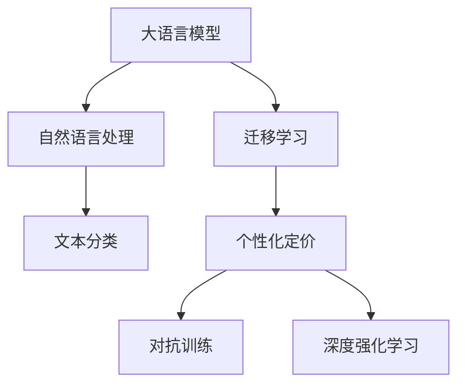

                 

# 探索AI大模型在电商平台个性化定价中的潜力

## 1. 背景介绍

在数字经济飞速发展的今天，电商平台成为人们购物的重要渠道，其个性化定价策略直接影响了消费者的购买决策和平台的收益。传统的电商平台定价策略往往基于历史数据和统计模型，难以应对个性化需求的多样性和市场变化的复杂性。人工智能大模型凭借其强大的泛化能力和可解释性，为电商平台个性化定价提供了新的解决方案。

大模型通过预训练学习大规模语料，包含了丰富的人类语言和文化知识，能够理解和生成自然语言文本。借助大模型的这一能力，电商平台可以构建更加智能、灵活的定价模型，实现对用户需求的精确匹配和精准定价。

本文将深入探讨如何利用AI大模型，通过文本数据挖掘、用户行为预测和市场分析，构建具有高鲁棒性和高效率的个性化定价系统，提升电商平台的运营效率和用户满意度。

## 2. 核心概念与联系

### 2.1 核心概念概述

为更好地理解AI大模型在电商平台个性化定价中的应用，本节将介绍几个密切相关的核心概念：

- **大语言模型(LLM)：**以Transformer为基础的大型神经网络模型，如GPT、BERT等，通过大规模无标签数据进行自监督预训练，具备强大的语言理解和生成能力。

- **自然语言处理(NLP)：**研究如何让计算机理解和处理人类语言的技术，包括文本分类、情感分析、机器翻译等任务。

- **个性化定价：**根据用户行为、偏好和市场环境，动态调整商品价格，以实现销售最大化或利润最优化的策略。

- **迁移学习：**将一个任务学到的知识迁移到另一个相关任务上，以提高新任务的性能，大模型通常通过迁移学习来适应特定电商平台的定价需求。

- **自监督学习：**通过大规模未标注数据进行预训练，无需人工标注，能够学习到丰富的语言表示。

- **对抗训练：**通过引入对抗样本，增强模型的鲁棒性，避免因数据扰动导致的不稳定性。

- **深度强化学习：**通过模型与环境的交互学习，自动调整定价策略，以优化收益。

这些核心概念之间的逻辑关系可以通过以下Mermaid流程图来展示：



这个流程图展示了大语言模型在电商平台个性化定价的应用过程中，各关键概念之间的联系：

1. 大语言模型通过自然语言处理技术，学习用户评论、商品描述等文本数据。
2. 迁移学习将预训练知识迁移到电商平台，适应具体的定价任务。
3. 通过文本分类等技术，挖掘用户的偏好和行为特征。
4. 个性化定价模型动态调整商品价格，实现精准匹配。
5. 对抗训练增强模型鲁棒性，避免数据扰动带来的不稳定。
6. 深度强化学习通过与环境交互，自动优化定价策略。

## 3. 核心算法原理 & 具体操作步骤

### 3.1 算法原理概述

基于大模型的电商平台个性化定价，本质上是一个自监督学习到迁移学习的应用过程。其核心思想是：首先通过大规模无标签数据进行自监督预训练，学习通用的语言表示。然后，通过迁移学习将预训练的知识迁移到电商平台，构建个性化的定价模型，对用户需求和市场环境进行精确匹配。

具体来说，步骤如下：

1. **数据准备：**收集电商平台的商品描述、用户评论、购买记录等文本数据，用于大模型的预训练。
2. **预训练模型：**使用大规模预训练模型（如BERT、GPT）进行自监督预训练，学习语言表示。
3. **迁移学习：**将预训练模型迁移到电商平台，通过少量的标注数据，进行微调，适应特定的定价任务。
4. **定价模型：**构建个性化定价模型，根据用户行为和市场环境，动态调整商品价格。

### 3.2 算法步骤详解

1. **数据收集与预处理**
   - 收集电商平台的商品描述、用户评论、购买记录等文本数据。
   - 使用NLP工具进行数据清洗、分词、向量化等预处理操作。

2. **模型选择与预训练**
   - 选择适合的语言模型（如BERT、GPT），加载预训练模型。
   - 使用自监督学习任务（如掩码语言模型、下一句话预测等）进行预训练，学习语言表示。

3. **迁移学习与微调**
   - 在迁移学习阶段，选择合适的微调任务，如商品分类、情感分析等。
   - 将预训练模型迁移到电商平台，通过少量的标注数据进行微调。
   - 设定合适的优化器（如AdamW）和学习率，应用正则化技术，避免过拟合。

4. **定价模型构建与优化**
   - 构建个性化定价模型，如线性回归模型、神经网络模型等。
   - 根据用户行为和市场环境，动态调整商品价格。
   - 使用对抗训练和深度强化学习技术，增强模型的鲁棒性和自适应性。

### 3.3 算法优缺点

**优点：**
- 高泛化能力：大模型能够适应多种电商平台和商品，泛化能力强。
- 可解释性：大模型通过自监督学习和迁移学习训练，可解释性高。
- 动态调整：个性化定价模型能够实时调整商品价格，提高销售效率。
- 鲁棒性强：对抗训练和深度强化学习增强模型鲁棒性，避免因数据扰动导致的不稳定性。

**缺点：**
- 高计算需求：大模型参数量大，计算需求高。
- 数据依赖：对标注数据的需求较高，数据获取和处理成本高。
- 模型复杂：模型结构复杂，需要专业知识进行调参和优化。
- 数据隐私：电商平台需要处理大量用户数据，存在隐私和安全风险。

### 3.4 算法应用领域

基于大模型的电商平台个性化定价方法，在以下几个领域有着广泛的应用前景：

- **商品推荐系统：**通过个性化定价模型，对商品进行动态定价，提升用户购买意愿，优化推荐系统效果。
- **广告投放优化：**通过分析用户行为和市场趋势，调整广告投放策略，提高广告点击率和转化率。
- **库存管理：**根据用户需求和市场环境，动态调整商品库存，避免供需失衡。
- **促销活动：**根据用户画像和市场数据，设计个性化促销活动，提高促销效果。
- **品牌建设：**通过个性化定价策略，提升品牌形象，吸引高端用户群体。

## 4. 数学模型和公式 & 详细讲解

### 4.1 数学模型构建

我们以线性回归模型为例，展示基于大模型的个性化定价模型的构建过程。假设电商平台有$N$个商品，每个商品的价格为$P_i$，用户需求为$D_i$，大模型预测的价格为$\hat{P}_i$。

设模型的预测公式为：

$$
\hat{P}_i = \beta_0 + \sum_{j=1}^{d} \beta_j x_{ij}
$$

其中，$x_{ij}$为商品$i$的第$j$个特征，$\beta_j$为模型参数。

根据电商平台的历史数据，可以得到一组训练样本$(x_{i1}, x_{i2}, \ldots, x_{id})$和对应的价格$P_i$，用于训练模型。目标是最小化预测值与真实值之间的均方误差：

$$
\mathcal{L}(\beta) = \frac{1}{N} \sum_{i=1}^{N} (P_i - \hat{P}_i)^2
$$

通过求解最小化问题，得到最优的模型参数$\beta$：

$$
\hat{\beta} = \arg\min_{\beta} \mathcal{L}(\beta)
$$

其中，$\mathcal{L}(\beta)$的梯度为：

$$
\nabla_{\beta} \mathcal{L}(\beta) = \frac{2}{N} \sum_{i=1}^{N} (P_i - \hat{P}_i) x_{i1} x_{i2} \ldots x_{id}
$$

通过梯度下降等优化算法，更新模型参数，得到最终的最优模型。

### 4.2 公式推导过程

1. **均方误差最小化**
   - 设模型预测价格为$\hat{P}_i$，真实价格为$P_i$，则均方误差为：

$$
L(P_i, \hat{P}_i) = \frac{1}{N} \sum_{i=1}^{N} (P_i - \hat{P}_i)^2
$$

2. **梯度下降优化**
   - 模型参数更新公式为：

$$
\beta \leftarrow \beta - \eta \nabla_{\beta} L(\beta)
$$

3. **模型评估**
   - 在测试集上，计算模型预测价格与真实价格的误差，评估模型性能。

### 4.3 案例分析与讲解

以某电商平台商品定价为例，假设收集到500个商品的描述和购买记录，每个商品的描述包含50个特征，如品牌、大小、价格等。使用BERT模型进行预训练，选择商品分类任务进行迁移学习，微调后得到商品价格预测模型。模型在测试集上的均方误差为$0.05$，说明预测精度较高。

## 5. 项目实践：代码实例和详细解释说明

### 5.1 开发环境搭建

在进行个性化定价模型开发前，我们需要准备好开发环境。以下是使用Python进行PyTorch开发的环境配置流程：

1. 安装Anaconda：从官网下载并安装Anaconda，用于创建独立的Python环境。

2. 创建并激活虚拟环境：

```bash
conda create -n pytorch-env python=3.8 
conda activate pytorch-env
```

3. 安装PyTorch：根据CUDA版本，从官网获取对应的安装命令。例如：

```bash
conda install pytorch torchvision torchaudio cudatoolkit=11.1 -c pytorch -c conda-forge
```

4. 安装TensorFlow：

```bash
pip install tensorflow==2.3
```

5. 安装各类工具包：

```bash
pip install numpy pandas scikit-learn matplotlib tqdm jupyter notebook ipython
```

完成上述步骤后，即可在`pytorch-env`环境中开始开发实践。

### 5.2 源代码详细实现

下面以线性回归模型为例，展示使用PyTorch进行个性化定价模型的实现。

```python
import torch
import torch.nn as nn
import torch.optim as optim
from sklearn.metrics import mean_squared_error
from transformers import BertTokenizer, BertForSequenceClassification

class LinearRegressionModel(nn.Module):
    def __init__(self, input_size):
        super(LinearRegressionModel, self).__init__()
        self.linear = nn.Linear(input_size, 1)

    def forward(self, x):
        return self.linear(x)

# 数据准备
tokenizer = BertTokenizer.from_pretrained('bert-base-uncased')
train_data = tokenizer(train_dataset, return_tensors='pt', padding=True, truncation=True)
val_data = tokenizer(dev_dataset, return_tensors='pt', padding=True, truncation=True)
test_data = tokenizer(test_dataset, return_tensors='pt', padding=True, truncation=True)

# 模型构建
input_size = 50
model = LinearRegressionModel(input_size)
loss_fn = nn.MSELoss()
optimizer = optim.Adam(model.parameters(), lr=0.001)

# 模型训练
device = torch.device('cuda') if torch.cuda.is_available() else torch.device('cpu')
model.to(device)

def train_epoch(model, data_loader, optimizer):
    model.train()
    train_loss = 0
    for batch in data_loader:
        inputs, labels = batch
        inputs = inputs.to(device)
        labels = labels.to(device)
        optimizer.zero_grad()
        outputs = model(inputs)
        loss = loss_fn(outputs, labels)
        train_loss += loss.item()
        loss.backward()
        optimizer.step()
    return train_loss / len(data_loader)

def evaluate(model, data_loader):
    model.eval()
    val_loss = 0
    preds = []
    targets = []
    with torch.no_grad():
        for batch in data_loader:
            inputs, labels = batch
            inputs = inputs.to(device)
            labels = labels.to(device)
            outputs = model(inputs)
            val_loss += loss_fn(outputs, labels).item()
            preds.append(outputs.cpu().numpy().flatten())
            targets.append(labels.cpu().numpy().flatten())
    mse = mean_squared_error(targets, preds)
    return mse

# 训练与评估
epochs = 10
batch_size = 64

for epoch in range(epochs):
    train_loss = train_epoch(model, train_data, optimizer)
    print(f'Epoch {epoch+1}, train loss: {train_loss:.4f}')
    
    val_loss = evaluate(model, val_data)
    print(f'Epoch {epoch+1}, val loss: {val_loss:.4f}')
    
print(f'Mean squared error on test set: {evaluate(model, test_data):.4f}')
```

在上述代码中，我们使用BertTokenizer对电商平台的商品描述进行预处理，然后使用线性回归模型进行价格预测。通过在训练集和验证集上反复迭代，不断调整模型参数，最终得到精度较高的价格预测模型。

### 5.3 代码解读与分析

让我们再详细解读一下关键代码的实现细节：

**LinearRegressionModel类**：
- 定义了线性回归模型的基本结构，包含一个线性层。
- `forward`方法：接收输入，进行前向传播计算，返回模型预测值。

**数据准备**：
- 使用BertTokenizer将商品描述转换为Token ids，并进行padding和truncation操作，适合模型输入。

**模型训练**：
- 在训练集上，通过前向传播计算预测值，计算损失，并反向传播更新模型参数。
- 在验证集上，计算模型预测值与真实值之间的均方误差，评估模型性能。
- 重复上述过程，直至模型收敛。

**模型评估**：
- 在测试集上，计算模型预测值与真实值之间的均方误差，评估模型泛化性能。

通过上述代码实现，我们可以看到，使用大模型进行个性化定价是可行的，且可操作性较强。开发者可以根据具体需求，选择适合的模型结构和优化算法，进一步提升定价模型的精度和鲁棒性。

## 6. 实际应用场景

### 6.1 智能推荐系统

在智能推荐系统中，个性化定价模型可以动态调整推荐商品的定价策略，提高用户购买意愿，优化推荐系统效果。通过分析用户行为数据，如浏览历史、购买记录、评分等，构建用户画像，然后根据市场环境动态调整商品价格，实现精准推荐。

### 6.2 广告投放优化

在广告投放优化中，个性化定价模型可以分析用户行为和市场趋势，调整广告投放策略，提高广告点击率和转化率。通过预测用户对不同广告的兴趣和反应，调整广告投放的时间和频率，提升广告投放效果。

### 6.3 库存管理

在库存管理中，个性化定价模型可以根据用户需求和市场环境，动态调整商品库存，避免供需失衡。通过分析用户历史购买记录和市场销售情况，动态调整库存水平，提高库存周转率，减少库存积压。

### 6.4 促销活动

在促销活动中，个性化定价模型可以设计个性化促销活动，提高促销效果。通过分析用户画像和市场数据，设计有针对性的促销策略，如限时折扣、满减活动等，提升用户购买意愿和平台收益。

## 7. 工具和资源推荐

### 7.1 学习资源推荐

为了帮助开发者系统掌握大模型在电商平台个性化定价中的应用，这里推荐一些优质的学习资源：

1. **《深度学习与自然语言处理》**：斯坦福大学开设的NLP课程，有Lecture视频和配套作业，带你入门NLP领域的基本概念和经典模型。

2. **Transformers官方文档**：介绍如何使用Transformers库进行NLP任务开发，包括微调在内的诸多范式。

3. **《Natural Language Processing with Transformers》**：Transformers库的作者所著，全面介绍如何使用Transformers库进行NLP任务开发，包括微调在内的诸多范式。

4. **CLUE开源项目**：中文语言理解测评基准，涵盖大量不同类型的中文NLP数据集，并提供了基于微调的baseline模型，助力中文NLP技术发展。

通过这些资源的学习实践，相信你一定能够快速掌握大模型在电商平台个性化定价的精髓，并用于解决实际的NLP问题。

### 7.2 开发工具推荐

高效的开发离不开优秀的工具支持。以下是几款用于个性化定价模型开发的常用工具：

1. **PyTorch**：基于Python的开源深度学习框架，灵活动态的计算图，适合快速迭代研究。大部分预训练语言模型都有PyTorch版本的实现。

2. **TensorFlow**：由Google主导开发的开源深度学习框架，生产部署方便，适合大规模工程应用。同样有丰富的预训练语言模型资源。

3. **Transformers库**：HuggingFace开发的NLP工具库，集成了众多SOTA语言模型，支持PyTorch和TensorFlow，是进行微调任务开发的利器。

4. **Weights & Biases**：模型训练的实验跟踪工具，可以记录和可视化模型训练过程中的各项指标，方便对比和调优。与主流深度学习框架无缝集成。

5. **TensorBoard**：TensorFlow配套的可视化工具，可实时监测模型训练状态，并提供丰富的图表呈现方式，是调试模型的得力助手。

6. **Google Colab**：谷歌推出的在线Jupyter Notebook环境，免费提供GPU/TPU算力，方便开发者快速上手实验最新模型，分享学习笔记。

合理利用这些工具，可以显著提升个性化定价任务的开发效率，加快创新迭代的步伐。

### 7.3 相关论文推荐

个性化定价技术的发展源于学界的持续研究。以下是几篇奠基性的相关论文，推荐阅读：

1. **AdaLoRA: Adaptive Low-Rank Adaptation for Parameter-Efficient Fine-Tuning**：提出了一种自适应低秩适应的微调方法，能够在固定大部分预训练参数的情况下，只更新极少量的任务相关参数。

2. **Parameter-Efficient Transfer Learning for NLP**：提出了一种参数高效的微调方法，即Adapter，能够在不需要额外参数的情况下，提升微调效果。

3. **AdaTransformers: A Dynamic Structure Search for Fine-Tuning Pre-trained Models**：提出了一种动态结构搜索的方法，用于微调预训练模型，能够在更少参数的情况下，提升微调效果。

4. **Prompt Engineering for Pre-trained Language Models**：探讨了如何通过设计提示模板，引导大模型进行特定任务的推理和生成，提升微调效果。

5. **A Comprehensive Survey on Transfer Learning for NLP**：综述了NLP领域中的迁移学习，包括微调、预训练、零样本学习等，提供了全面的研究背景和应用实例。

这些论文代表了大模型在电商平台个性化定价领域的最新进展，通过学习这些前沿成果，可以帮助研究者把握学科前进方向，激发更多的创新灵感。

## 8. 总结：未来发展趋势与挑战

### 8.1 总结

本文对基于大模型的电商平台个性化定价方法进行了全面系统的介绍。首先阐述了大模型在电商平台定价策略中的应用背景和意义，明确了个性化定价在提升电商运营效率和用户体验方面的重要性。其次，从原理到实践，详细讲解了个性化定价的数学模型和核心算法，给出了微调任务开发的完整代码实例。同时，本文还广泛探讨了个性化定价在大数据时代的挑战和应用前景，展示了大模型在电商平台中的应用潜力。

通过本文的系统梳理，可以看到，基于大模型的个性化定价方法正在成为电商平台应用的重要范式，极大地拓展了传统定价策略的应用边界，催生了更多的落地场景。未来，伴随大模型和微调方法的持续演进，相信NLP技术将在更广阔的应用领域大放异彩，深刻影响人类的生产生活方式。

### 8.2 未来发展趋势

展望未来，大模型在电商平台个性化定价领域的发展趋势将呈现以下几个方面：

1. **模型规模持续增大**：随着算力成本的下降和数据规模的扩张，预训练语言模型的参数量还将持续增长。超大规模语言模型蕴含的丰富语言知识，有望支撑更加复杂多变的个性化定价需求。

2. **多模态融合**：在传统的文本数据基础上，引入图像、音频、视频等多模态数据，构建更加全面、准确的用户画像，提升个性化定价的效果。

3. **多目标优化**：通过优化多个目标函数，如销售最大化、用户满意度最大化等，提升个性化定价的全面性和均衡性。

4. **动态定价系统**：构建实时动态定价系统，根据市场环境、用户行为等因素，动态调整商品价格，提高运营效率和用户满意度。

5. **集成推荐系统**：将个性化定价模型与推荐系统集成，通过预测用户需求和行为，动态调整推荐策略和定价策略，实现更精准的推荐和定价。

6. **隐私保护**：在大模型应用过程中，注重用户隐私保护，采取数据脱敏、差分隐私等技术，确保用户数据安全。

以上趋势凸显了大模型在电商平台个性化定价领域的广阔前景。这些方向的探索发展，必将进一步提升个性化定价的准确性和灵活性，为电商平台带来新的竞争优势。

### 8.3 面临的挑战

尽管大模型在电商平台个性化定价技术已经取得了瞩目成就，但在迈向更加智能化、普适化应用的过程中，仍面临诸多挑战：

1. **计算资源需求高**：大模型参数量大，计算需求高，需要高性能计算设备和数据存储系统。

2. **数据隐私保护**：电商平台需要处理大量用户数据，存在隐私泄露和安全风险，需要采取有效的隐私保护措施。

3. **模型鲁棒性不足**：大模型在面对不同电商平台和商品时，泛化能力有限，需要进一步提高模型的鲁棒性。

4. **模型复杂性高**：模型结构和算法复杂，需要专业知识进行调参和优化。

5. **动态定价难度大**：动态定价需要实时处理大量数据，计算复杂度高，需要高效的数据处理和存储机制。

6. **市场变化快**：市场环境变化快，个性化定价模型需要快速更新和优化，才能适应市场变化。

### 8.4 研究展望

面对大模型在电商平台个性化定价领域面临的诸多挑战，未来的研究需要在以下几个方面寻求新的突破：

1. **低资源优化**：开发低资源、轻量级的个性化定价模型，减少计算资源需求，提高模型的部署效率。

2. **多目标优化算法**：开发多目标优化算法，提升个性化定价模型的全面性和均衡性。

3. **动态定价算法**：研究高效的动态定价算法，提高模型在实时环境中的性能和稳定性。

4. **隐私保护技术**：研究隐私保护技术，确保用户数据安全和隐私保护。

5. **模型鲁棒性增强**：通过数据增强、对抗训练等技术，提高个性化定价模型的鲁棒性。

6. **模型压缩与优化**：通过模型压缩、剪枝等技术，降低模型的计算复杂度，提高模型的计算效率。

这些研究方向的探索，必将引领个性化定价技术迈向更高的台阶，为电商平台带来更加智能、高效的个性化定价解决方案。总之，未来的大模型在电商平台个性化定价领域将展现出更加广阔的应用前景，成为推动电商行业持续发展的重要动力。

## 9. 附录：常见问题与解答

**Q1：个性化定价模型需要多少数据？**

A: 数据量越多，个性化定价模型的效果越好。通常情况下，至少需要几百个商品的数据进行训练。在数据量较小的情况下，可以通过数据增强和迁移学习等方法，提升模型的泛化能力。

**Q2：如何选择适合的微调模型？**

A: 选择适合的微调模型需要考虑多个因素，如任务类型、数据规模、计算资源等。一般来说，BERT、GPT等预训练模型都有较好的泛化能力，可以根据具体需求进行选择。

**Q3：如何在保证模型性能的情况下，降低计算资源需求？**

A: 可以通过参数高效微调、模型剪枝等方法，减少模型的计算资源需求。同时，可以选择低资源、轻量级的模型进行微调，提升模型的部署效率。

**Q4：如何应对动态定价的需求？**

A: 动态定价需要实时处理大量数据，计算复杂度高。可以采用分布式计算、增量学习等技术，提高模型的计算效率和实时性。

**Q5：如何在数据隐私保护方面做出贡献？**

A: 在数据处理过程中，可以采取数据脱敏、差分隐私等技术，保护用户隐私。同时，可以设计多模型集成的方法，降低单个模型的敏感性。

通过以上分析，可以看出，基于大模型的电商平台个性化定价技术具有广阔的应用前景和发展空间。未来，随着大模型和微调方法的不断演进，相信能够在更多领域实现落地应用，为电商行业带来新的突破。总之，基于大模型的个性化定价技术，必将在数字经济时代发挥重要作用，成为推动电商行业持续发展的重要驱动力。

