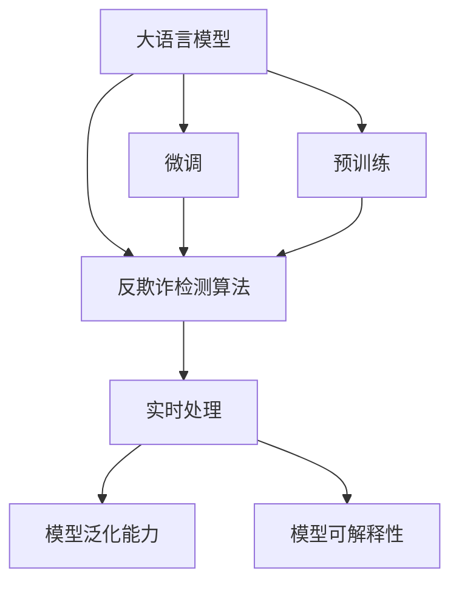

                 

## 1. 背景介绍

### 1.1 问题由来

在互联网时代，电商平台已成为消费者购物的重要渠道。然而，随着用户数量的增加，平台面临的欺诈风险也在不断提升。传统的反欺诈方法，如规则引擎、黑白名单、历史数据分析等，已经难以适应日益复杂的欺诈手段。因此，利用AI大模型进行反欺诈，成为一种新的趋势和必然选择。

近年来，大语言模型在NLP领域取得了显著的进展，包括BERT、GPT等模型，已经在多个自然语言处理任务上取得了SOTA的性能。这些模型具有强大的语言理解和生成能力，同时，随着预训练语料和算力的不断提升，其规模不断扩大，参数量从亿级向十亿级迈进。这为应用于电商平台反欺诈提供了重要的技术基础。

### 1.2 问题核心关键点

AI大模型在电商平台反欺诈的应用中，主要面临以下几个核心问题：

1. **模型泛化能力**：平台的用户行为多样，不同时间、不同地域的用户可能会表现出不同的欺诈模式，大模型需要具备强大的泛化能力。
2. **实时性要求**：电商平台的交易操作快速频繁，实时性要求极高，大模型必须能在毫秒级别完成推理和预测。
3. **高效性需求**：电商平台数据量巨大，实时存储和处理效率是关键，大模型需要在硬件加速的支持下，保持高效处理大量数据的能力。
4. **鲁棒性保障**：电商平台用户行为异常多样，大模型需要具备一定的鲁棒性，能够应对各种异常情况。
5. **安全性要求**：电商平台的数据和交易信息涉及隐私和安全，大模型需要具备可解释性和鲁棒性，避免模型误判和滥用。

### 1.3 问题研究意义

利用AI大模型进行电商平台反欺诈，具有重要的理论和实际意义：

1. **提升防范能力**：大模型通过学习大量历史交易数据，能够识别复杂的欺诈模式，比传统的规则和黑名单方式更加精准。
2. **降低运营成本**：大模型可自动化进行实时监控，减少人工审核，提升运营效率，降低欺诈损失。
3. **促进市场公平**：通过公平的交易监管，保障消费者的合法权益，提升平台信任度和用户粘性。
4. **推动技术创新**：反欺诈技术的发展，可促进AI技术的普及应用，推动电商平台的智能化转型。

## 2. 核心概念与联系

### 2.1 核心概念概述

为更好地理解AI大模型在电商平台反欺诈中的应用，本节将介绍几个密切相关的核心概念：

1. **大语言模型(Large Language Model, LLM)**：以BERT、GPT等深度学习模型为代表的大规模预训练语言模型，通过学习大规模无标签文本数据，具备强大的语言理解和生成能力。
2. **反欺诈( Fraud Detection)**：识别和防范不法分子通过虚假交易、钓鱼网站、个人信息盗用等手段进行的欺诈行为，保障平台和用户的安全。
3. **欺诈检测算法**：通过机器学习、深度学习等技术，对交易数据进行分析和建模，识别和预测欺诈行为。
4. **实时处理**：指对交易数据进行实时分析，快速响应，以防止欺诈行为得逞。
5. **模型泛化能力**：指模型能够适应新的、未见过的数据的能力。
6. **模型可解释性**：指模型输出的决策结果应具备足够的可解释性，便于开发者理解模型的行为。

这些核心概念之间的逻辑关系可以通过以下Mermaid流程图来展示：



这个流程图展示了大语言模型、微调、反欺诈检测算法、实时处理、泛化能力与可解释性之间的关系：

1. 大语言模型通过预训练获得基础能力。
2. 微调是大模型应用于特定任务的重要步骤，增强其针对性。
3. 反欺诈检测算法基于微调后的模型进行设计和优化。
4. 实时处理是反欺诈的核心环节，要求模型能够在极短时间内完成推理。
5. 泛化能力和可解释性是反欺诈系统的关键，保障系统的普适性和透明性。

## 3. 核心算法原理 & 具体操作步骤

### 3.1 算法原理概述

基于AI大模型的电商平台反欺诈方法，主要通过以下几个步骤实现：

1. **数据收集与预处理**：收集电商平台的交易数据，并进行清洗、标注和标准化。
2. **模型预训练与微调**：在预训练大模型基础上进行微调，学习反欺诈相关的特征和规则。
3. **实时推理与检测**：对实时交易数据进行推理，判断是否存在欺诈行为，并及时报警。
4. **模型评估与迭代**：通过定期评估模型的性能，不断优化模型参数和检测算法。

这些步骤通过机器学习、深度学习等技术手段实现，构建一个高效、可靠、安全的反欺诈系统。

### 3.2 算法步骤详解

#### 3.2.1 数据收集与预处理

1. **数据来源**：电商平台交易数据、用户行为数据、IP地址信息、设备信息等。
2. **数据清洗**：去除异常、缺失、重复数据，补全缺失字段。
3. **数据标准化**：将不同格式的数据转换为统一格式，方便后续处理。
4. **数据标注**：对部分交易数据进行人工标注，作为模型训练的监督信号。

#### 3.2.2 模型预训练与微调

1. **选择模型**：基于预训练模型如BERT、GPT等，进行模型选择。
2. **微调目标**：设置微调的目标，如分类、回归、序列生成等。
3. **微调流程**：在微调过程中，选择合适的学习率、优化器、正则化等参数。
4. **评估指标**：设置评估指标，如准确率、召回率、F1-score等，定期评估模型性能。

#### 3.2.3 实时推理与检测

1. **实时数据流**：构建实时数据流处理架构，将交易数据逐笔输入模型。
2. **实时推理**：将实时交易数据输入模型，计算其欺诈概率。
3. **异常检测**：根据模型输出结果，进行异常检测和预警。
4. **决策支持**：根据决策规则，结合模型结果，进行最终决策。

#### 3.2.4 模型评估与迭代

1. **回溯评估**：利用历史数据，对模型进行回溯评估，分析模型误判和漏判的原因。
2. **参数调优**：根据评估结果，调整模型参数和超参数，提升模型性能。
3. **数据扩充**：收集更多标注数据，扩展数据集，提升模型泛化能力。

### 3.3 算法优缺点

#### 3.3.1 优点

1. **泛化能力强**：大模型通过大规模数据预训练，具备强大的泛化能力，能够适应多种欺诈模式。
2. **实时性好**：基于深度学习的大模型，能够快速处理海量数据，满足实时检测需求。
3. **可解释性好**：大模型通常具有较强的可解释性，便于开发者理解模型决策过程。
4. **灵活性高**：大模型易于迁移和微调，适应不同电商平台的特定需求。

#### 3.3.2 缺点

1. **资源消耗大**：大模型的参数量巨大，对计算资源和内存有较高要求。
2. **误判风险高**：大模型在复杂环境下，可能产生误判，影响用户体验。
3. **数据隐私问题**：电商平台交易数据涉及用户隐私，如何在保证隐私的前提下进行模型训练和推理，是一个难题。
4. **训练复杂度高**：大模型的训练过程复杂，需要大量标注数据和高质量的训练资源。

### 3.4 算法应用领域

基于AI大模型的电商平台反欺诈方法，已经在许多电商平台上得到了应用，覆盖了以下几个主要领域：

1. **支付安全**：识别和防范信用卡盗刷、伪造交易等支付欺诈行为。
2. **交易欺诈**：检测虚假交易、虚假订单、恶意下单等欺诈行为。
3. **用户身份验证**：通过模型进行用户身份验证，防止恶意账户注册和登录。
4. **物流欺诈**：识别物流过程中的异常交易行为，防止物品调包和虚假交易。
5. **异常行为检测**：实时监控用户行为，防止账号被盗用和恶意操作。

## 4. 数学模型和公式 & 详细讲解 & 举例说明

### 4.1 数学模型构建

我们以电商平台反欺诈中的分类任务为例，构建一个基于大模型的反欺诈模型。假设模型的输入为 $x_i$，表示交易数据；输出为 $y_i$，表示交易是否为欺诈（0为非欺诈，1为欺诈）。则模型可以表示为：

$$
y_i = M_{\theta}(x_i) = \sigma(\sum_{k=1}^K w_k f_k(x_i) + b)
$$

其中，$M_{\theta}$ 为预训练大模型，$\sigma$ 为激活函数（如sigmoid、ReLU等），$f_k$ 为模型中的第 $k$ 层特征提取器，$w_k$ 和 $b$ 为模型参数。

### 4.2 公式推导过程

假设模型 $M_{\theta}$ 在输入 $x_i$ 上的输出为 $\hat{y}_i$，表示交易是否为欺诈的预测概率。则二分类交叉熵损失函数定义为：

$$
\ell(M_{\theta}(x_i),y_i) = -[y_i\log \hat{y}_i + (1-y_i)\log (1-\hat{y}_i)]
$$

在训练集 $D=\{(x_i,y_i)\}_{i=1}^N$ 上，经验风险为：

$$
\mathcal{L}(\theta) = \frac{1}{N}\sum_{i=1}^N \ell(M_{\theta}(x_i),y_i)
$$

模型的参数更新公式为：

$$
\theta \leftarrow \theta - \eta \nabla_{\theta}\mathcal{L}(\theta) - \eta\lambda\theta
$$

其中，$\nabla_{\theta}\mathcal{L}(\theta)$ 为损失函数对模型参数的梯度，可通过反向传播算法计算。

### 4.3 案例分析与讲解

假设某电商平台有三种欺诈行为：账号盗用、虚假交易、物流诈骗。我们通过以下步骤进行反欺诈模型的训练和推理：

1. **数据准备**：收集电商平台的交易数据，标注出账号盗用、虚假交易、物流诈骗等欺诈行为。
2. **模型选择**：选择BERT或GPT模型作为预训练模型，进行微调。
3. **特征提取**：将交易数据转化为模型可接受的输入格式，如文本、数值、时间戳等。
4. **模型训练**：在标注数据集上训练模型，设置合适的超参数，进行优化。
5. **模型推理**：将实时交易数据输入模型，计算其欺诈概率。
6. **异常检测**：根据模型输出，设置阈值，进行异常检测。
7. **决策支持**：结合人工规则，综合模型输出和交易细节，进行最终决策。

## 5. 项目实践：代码实例和详细解释说明

### 5.1 开发环境搭建

在进行大模型在电商平台反欺诈应用开发前，我们需要准备好开发环境。以下是使用Python进行PyTorch开发的环境配置流程：

1. 安装Anaconda：从官网下载并安装Anaconda，用于创建独立的Python环境。

2. 创建并激活虚拟环境：
```bash
conda create -n pytorch-env python=3.8 
conda activate pytorch-env
```

3. 安装PyTorch：根据CUDA版本，从官网获取对应的安装命令。例如：
```bash
conda install pytorch torchvision torchaudio cudatoolkit=11.1 -c pytorch -c conda-forge
```

4. 安装Transformers库：
```bash
pip install transformers
```

5. 安装各类工具包：
```bash
pip install numpy pandas scikit-learn matplotlib tqdm jupyter notebook ipython
```

完成上述步骤后，即可在`pytorch-env`环境中开始反欺诈模型的开发实践。

### 5.2 源代码详细实现

下面以基于BERT模型的反欺诈检测为例，给出使用Transformers库进行电商交易数据微调的PyTorch代码实现。

首先，定义数据处理函数：

```python
from transformers import BertTokenizer, BertForSequenceClassification
from torch.utils.data import Dataset, DataLoader
import torch
import pandas as pd

class FraudDataset(Dataset):
    def __init__(self, data_path, tokenizer, label_map):
        self.tokenizer = tokenizer
        self.data = pd.read_csv(data_path)
        self.label_map = label_map
        
    def __len__(self):
        return len(self.data)
    
    def __getitem__(self, item):
        data = self.data.iloc[item]
        label = self.label_map[data['label']]
        
        encoding = self.tokenizer(data['text'], return_tensors='pt', max_length=512, padding='max_length', truncation=True)
        input_ids = encoding['input_ids'][0]
        attention_mask = encoding['attention_mask'][0]
        
        return {'input_ids': input_ids, 
                'attention_mask': attention_mask,
                'labels': torch.tensor(label, dtype=torch.long)}
```

然后，定义模型和优化器：

```python
from transformers import AdamW
from sklearn.metrics import classification_report

model = BertForSequenceClassification.from_pretrained('bert-base-cased', num_labels=3)

optimizer = AdamW(model.parameters(), lr=2e-5)
```

接着，定义训练和评估函数：

```python
from tqdm import tqdm

device = torch.device('cuda') if torch.cuda.is_available() else torch.device('cpu')
model.to(device)

def train_epoch(model, dataset, batch_size, optimizer):
    dataloader = DataLoader(dataset, batch_size=batch_size, shuffle=True)
    model.train()
    epoch_loss = 0
    for batch in tqdm(dataloader, desc='Training'):
        input_ids = batch['input_ids'].to(device)
        attention_mask = batch['attention_mask'].to(device)
        labels = batch['labels'].to(device)
        model.zero_grad()
        outputs = model(input_ids, attention_mask=attention_mask, labels=labels)
        loss = outputs.loss
        epoch_loss += loss.item()
        loss.backward()
        optimizer.step()
    return epoch_loss / len(dataloader)

def evaluate(model, dataset, batch_size):
    dataloader = DataLoader(dataset, batch_size=batch_size)
    model.eval()
    preds, labels = [], []
    with torch.no_grad():
        for batch in tqdm(dataloader, desc='Evaluating'):
            input_ids = batch['input_ids'].to(device)
            attention_mask = batch['attention_mask'].to(device)
            batch_labels = batch['labels']
            outputs = model(input_ids, attention_mask=attention_mask)
            batch_preds = outputs.logits.argmax(dim=2).to('cpu').tolist()
            batch_labels = batch_labels.to('cpu').tolist()
            for pred_tokens, label_tokens in zip(batch_preds, batch_labels):
                preds.append(pred_tokens)
                labels.append(label_tokens)
                
    print(classification_report(labels, preds))
```

最后，启动训练流程并在测试集上评估：

```python
epochs = 5
batch_size = 16

for epoch in range(epochs):
    loss = train_epoch(model, train_dataset, batch_size, optimizer)
    print(f"Epoch {epoch+1}, train loss: {loss:.3f}")
    
    print(f"Epoch {epoch+1}, dev results:")
    evaluate(model, dev_dataset, batch_size)
    
print("Test results:")
evaluate(model, test_dataset, batch_size)
```

以上就是使用PyTorch对BERT进行电商平台反欺诈任务微调的完整代码实现。可以看到，得益于Transformers库的强大封装，我们可以用相对简洁的代码完成BERT模型的加载和微调。

### 5.3 代码解读与分析

让我们再详细解读一下关键代码的实现细节：

**FraudDataset类**：
- `__init__`方法：初始化数据路径、分词器、标签映射等关键组件。
- `__len__`方法：返回数据集的样本数量。
- `__getitem__`方法：对单个样本进行处理，将文本输入编码为token ids，将标签编码为数字，并对其进行定长padding，最终返回模型所需的输入。

**label_map**：
- 定义了标签与数字id之间的映射关系，用于将token-wise的预测结果解码回真实的标签。

**训练和评估函数**：
- 使用PyTorch的DataLoader对数据集进行批次化加载，供模型训练和推理使用。
- 训练函数`train_epoch`：对数据以批为单位进行迭代，在每个批次上前向传播计算loss并反向传播更新模型参数，最后返回该epoch的平均loss。
- 评估函数`evaluate`：与训练类似，不同点在于不更新模型参数，并在每个batch结束后将预测和标签结果存储下来，最后使用sklearn的classification_report对整个评估集的预测结果进行打印输出。

**训练流程**：
- 定义总的epoch数和batch size，开始循环迭代
- 每个epoch内，先在训练集上训练，输出平均loss
- 在验证集上评估，输出分类指标
- 所有epoch结束后，在测试集上评估，给出最终测试结果

可以看到，PyTorch配合Transformers库使得BERT微调的代码实现变得简洁高效。开发者可以将更多精力放在数据处理、模型改进等高层逻辑上，而不必过多关注底层的实现细节。

当然，工业级的系统实现还需考虑更多因素，如模型的保存和部署、超参数的自动搜索、更灵活的任务适配层等。但核心的微调范式基本与此类似。

## 6. 实际应用场景

### 6.1 智能客服系统

利用大模型在电商平台反欺诈中的应用，可以拓展到智能客服系统的构建中。传统客服往往需要配备大量人力，高峰期响应缓慢，且一致性和专业性难以保证。而使用微调后的反欺诈模型，可以实时监控交易数据，及时发现异常行为，减少人工审核，提升服务效率。

在技术实现上，可以构建一个智能客服系统，将用户的交易行为输入模型，实时计算其欺诈概率。根据模型的输出，系统可自动决策是否进行人工干预，确保用户体验。对于复杂的反欺诈需求，系统还可以接入专家知识库，提升识别精度。

### 6.2 交易监控平台

电商平台交易监控平台是大模型反欺诈应用的典型场景之一。平台实时接收交易数据，利用大模型对每笔交易进行实时监控，自动检测异常行为，及时报警和处理。通过设置不同的阈值，平台可灵活调整欺诈检测的严格度，适应不同商家的需求。

平台还可以将异常交易信息汇总，生成报告，帮助商家进行风险分析和业务优化。此外，平台还可以利用机器学习算法对历史数据进行训练，提升模型的准确性和鲁棒性。

### 6.3 风险管理引擎

电商平台的反欺诈系统往往需要与风险管理引擎结合使用，实现风险预测和控制。风险管理引擎根据交易数据，综合考虑模型输出和业务规则，进行风险评估和决策。利用大模型的高泛化能力和可解释性，风险管理引擎可以更好地理解交易行为，制定更精准的风险控制策略。

在风险管理引擎的设计中，还需要引入因果推断和决策树等技术，进一步提升系统的决策能力和稳定性和可解释性。

### 6.4 未来应用展望

随着大模型技术的不断进步，其在电商平台反欺诈中的应用前景更加广阔。未来，大模型反欺诈技术将在以下几个方向得到进一步发展：

1. **跨模态反欺诈**：利用语音、图像等多模态数据，提升欺诈检测的准确性和实时性。
2. **实时异常检测**：通过流式处理和模型迭代，实现对异常行为的实时检测和报警。
3. **多模态融合**：结合用户行为数据、交易记录、社交网络等数据源，构建全面的反欺诈体系。
4. **联邦学习**：利用分布式计算和隐私保护技术，实现多平台之间的数据共享和模型合作。
5. **模型压缩与加速**：通过模型压缩和硬件加速，提升模型的实时性和资源利用率。

以上趋势凸显了大模型在电商平台反欺诈中的巨大潜力。这些方向的探索发展，必将进一步提升反欺诈系统的性能和应用范围，为电商平台带来更高的安全性。

## 7. 工具和资源推荐

### 7.1 学习资源推荐

为了帮助开发者系统掌握大模型在电商平台反欺诈的理论基础和实践技巧，这里推荐一些优质的学习资源：

1. **《深度学习入门与实践》**：该书介绍了深度学习的基本概念和实践技术，包括模型训练、优化算法等。
2. **《机器学习实战》**：该书介绍了机器学习的基本原理和经典算法，涵盖了监督学习和非监督学习等知识。
3. **CS229《机器学习》课程**：斯坦福大学开设的经典课程，有Lecture视频和配套作业，全面介绍了机器学习的理论基础和算法实现。
4. **《自然语言处理入门与实战》**：该书介绍了NLP的基本概念和应用技术，包括文本处理、情感分析等。
5. **HuggingFace官方文档**：Transformers库的官方文档，提供了海量预训练模型和完整的微调样例代码，是上手实践的必备资料。
6. **Kaggle平台**：Kaggle上丰富的数据集和竞赛项目，可以帮助开发者实践和检验反欺诈模型的性能。

通过对这些资源的学习实践，相信你一定能够快速掌握大模型在电商平台反欺诈的精髓，并用于解决实际的NLP问题。

### 7.2 开发工具推荐

高效的开发离不开优秀的工具支持。以下是几款用于电商平台反欺诈开发的常用工具：

1. **PyTorch**：基于Python的开源深度学习框架，灵活动态的计算图，适合快速迭代研究。大部分预训练语言模型都有PyTorch版本的实现。
2. **TensorFlow**：由Google主导开发的开源深度学习框架，生产部署方便，适合大规模工程应用。同样有丰富的预训练语言模型资源。
3. **Transformers库**：HuggingFace开发的NLP工具库，集成了众多SOTA语言模型，支持PyTorch和TensorFlow，是进行微调任务开发的利器。
4. **Weights & Biases**：模型训练的实验跟踪工具，可以记录和可视化模型训练过程中的各项指标，方便对比和调优。与主流深度学习框架无缝集成。
5. **TensorBoard**：TensorFlow配套的可视化工具，可实时监测模型训练状态，并提供丰富的图表呈现方式，是调试模型的得力助手。
6. **Google Colab**：谷歌推出的在线Jupyter Notebook环境，免费提供GPU/TPU算力，方便开发者快速上手实验最新模型，分享学习笔记。

合理利用这些工具，可以显著提升电商平台反欺诈任务的开发效率，加快创新迭代的步伐。

### 7.3 相关论文推荐

大模型在电商平台反欺诈中的应用，源于学界的持续研究。以下是几篇奠基性的相关论文，推荐阅读：

1. **Attention is All You Need**：提出了Transformer结构，开启了NLP领域的预训练大模型时代。
2. **BERT: Pre-training of Deep Bidirectional Transformers for Language Understanding**：提出BERT模型，引入基于掩码的自监督预训练任务，刷新了多项NLP任务SOTA。
3. **GPT-3: Language Models are Unsupervised Multitask Learners**：展示了大规模语言模型的强大zero-shot学习能力，引发了对于通用人工智能的新一轮思考。
4. **Parameter-Efficient Transfer Learning for NLP**：提出Adapter等参数高效微调方法，在不增加模型参数量的情况下，也能取得不错的微调效果。
5. **FedScalable: Unified Scalable Multi-Task Learning for Federated Learning**：利用联邦学习技术，实现了多平台之间的数据共享和模型合作。
6. **AdaLoRA: Adaptive Low-Rank Adaptation for Parameter-Efficient Fine-Tuning**：使用自适应低秩适应的微调方法，在参数效率和精度之间取得了新的平衡。

这些论文代表了大模型在电商平台反欺诈技术的发展脉络。通过学习这些前沿成果，可以帮助研究者把握学科前进方向，激发更多的创新灵感。

## 8. 总结：未来发展趋势与挑战

### 8.1 总结

本文对基于AI大模型的电商平台反欺诈方法进行了全面系统的介绍。首先阐述了大模型和微调技术的研究背景和意义，明确了其对电商平台反欺诈的重要价值。其次，从原理到实践，详细讲解了反欺诈模型的构建和训练流程，给出了微调任务开发的完整代码实例。同时，本文还广泛探讨了反欺诈方法在多个电商场景中的应用前景，展示了其巨大的应用潜力。此外，本文精选了反欺诈技术的各类学习资源，力求为读者提供全方位的技术指引。

通过本文的系统梳理，可以看到，基于大模型的电商平台反欺诈方法正在成为电商平台反欺诈的重要范式，极大地提升了平台的安全性和运营效率。随着大模型技术的不断进步，反欺诈技术必将进一步提升，为电商平台带来更高的安全保障。

### 8.2 未来发展趋势

展望未来，电商平台反欺诈技术将呈现以下几个发展趋势：

1. **模型规模持续增大**：随着预训练语料和算力的不断提升，大模型的参数量还将持续增长。超大模型规模蕴含的丰富知识，有望支撑更加复杂多变的欺诈模式识别。
2. **微调方法日趋多样**：未来将涌现更多参数高效微调方法，如Prefix-Tuning、LoRA等，在固定大部分预训练参数的同时，只更新极少量的任务相关参数，减小过拟合风险。
3. **持续学习成为常态**：随着数据分布的不断变化，微调模型也需要持续学习新知识以保持性能。如何在不遗忘原有知识的同时，高效吸收新样本信息，将是重要的研究课题。
4. **数据隐私问题突出**：电商平台交易数据涉及用户隐私，如何在保证隐私的前提下进行模型训练和推理，是一个难题。如何在保护隐私的前提下，提升模型性能，也是未来的研究方向。
5. **多模态融合**：利用语音、图像等多模态数据，提升欺诈检测的准确性和实时性。结合用户行为数据、交易记录、社交网络等数据源，构建全面的反欺诈体系。
6. **联邦学习**：利用分布式计算和隐私保护技术，实现多平台之间的数据共享和模型合作，提升反欺诈系统的跨平台应用能力。

这些趋势凸显了大模型在电商平台反欺诈中的巨大潜力。这些方向的探索发展，必将进一步提升反欺诈系统的性能和应用范围，为电商平台带来更高的安全性。

### 8.3 面临的挑战

尽管大模型在电商平台反欺诈中已经取得了显著成果，但在迈向更加智能化、普适化应用的过程中，它仍面临着诸多挑战：

1. **数据隐私问题**：电商平台交易数据涉及用户隐私，如何在保护隐私的前提下进行模型训练和推理，是一个难题。如何在保护隐私的前提下，提升模型性能，也是未来的研究方向。
2. **模型鲁棒性不足**：在复杂环境下，大模型可能产生误判，影响用户体验。如何提高模型鲁棒性，避免灾难性遗忘，还需要更多理论和实践的积累。
3. **实时性要求高**：电商平台交易操作快速频繁，实时性要求极高，大模型必须能在毫秒级别完成推理和预测。如何在保证实时性的同时，提升模型性能，是一个挑战。
4. **计算资源消耗大**：大模型的参数量巨大，对计算资源和内存有较高要求。如何在保持高性能的同时，降低资源消耗，是一个难题。
5. **模型可解释性不足**：当前大模型通常具有较强的可解释性，但一些复杂任务下，模型输出仍难以解释。如何赋予模型更强的可解释性，将是重要的研究方向。

### 8.4 研究展望

面对电商平台反欺诈所面临的种种挑战，未来的研究需要在以下几个方面寻求新的突破：

1. **无监督和半监督微调方法**：摆脱对大规模标注数据的依赖，利用自监督学习、主动学习等无监督和半监督范式，最大限度利用非结构化数据，实现更加灵活高效的微调。
2. **参数高效和计算高效的微调范式**：开发更加参数高效的微调方法，如Prefix-Tuning、LoRA等，在固定大部分预训练参数的同时，只更新极少量的任务相关参数。同时优化微调模型的计算图，减少前向传播和反向传播的资源消耗，实现更加轻量级、实时性的部署。
3. **多模态反欺诈**：利用语音、图像等多模态数据，提升欺诈检测的准确性和实时性。结合用户行为数据、交易记录、社交网络等数据源，构建全面的反欺诈体系。
4. **联邦学习**：利用分布式计算和隐私保护技术，实现多平台之间的数据共享和模型合作，提升反欺诈系统的跨平台应用能力。
5. **因果分析和博弈论工具**：将因果分析方法引入微调模型，识别出模型决策的关键特征，增强输出解释的因果性和逻辑性。借助博弈论工具刻画人机交互过程，主动探索并规避模型的脆弱点，提高系统稳定性。
6. **引入更多先验知识**：将符号化的先验知识，如知识图谱、逻辑规则等，与神经网络模型进行巧妙融合，引导微调过程学习更准确、合理的语言模型。

这些研究方向的探索，必将引领电商平台反欺诈技术迈向更高的台阶，为电商平台带来更高的安全性。相信随着学界和产业界的共同努力，这些挑战终将一一被克服，大模型反欺诈技术必将在构建安全、可靠、可解释、可控的智能系统铺平道路。

## 9. 附录：常见问题与解答

**Q1：大语言模型在电商平台反欺诈中的应用是否会导致用户隐私泄露？**

A: 大语言模型在电商平台反欺诈中的使用，一般不会导致用户隐私泄露。因为在模型训练和推理过程中，数据经过脱敏和匿名化处理，不会直接使用用户的个人信息。同时，使用大模型进行反欺诈，只需要将交易数据输入模型，无需直接读取用户的个人信息。

**Q2：大语言模型在电商平台反欺诈中能否实现实时检测？**

A: 大语言模型在电商平台反欺诈中可以实现实时检测。由于模型的推理速度较快，结合流式处理和模型迭代，可以实时监控交易数据，自动检测异常行为。对于低频率的欺诈行为，模型也可以通过定期更新数据和模型参数，进行更精准的检测。

**Q3：如何平衡模型的实时性和准确性？**

A: 在电商平台反欺诈中，需要平衡模型的实时性和准确性。可以通过以下方法实现：
1. 模型压缩和优化：通过模型压缩和硬件加速，提升模型的推理速度。
2. 分布式计算：利用分布式计算框架，将计算任务分配到多个节点上，提高处理效率。
3. 梯度累积：通过梯度累积技术，将多批次的数据累积到单个批次中，减少计算开销。
4. 超参数优化：通过调整超参数，如批大小、学习率等，平衡实时性和准确性。

**Q4：电商平台反欺诈模型如何应对新的欺诈手段？**

A: 电商平台反欺诈模型可以通过持续学习，应对新的欺诈手段。具体方法包括：
1. 数据收集与标注：实时收集新的交易数据，并标注其是否为欺诈行为。
2. 模型微调与优化：定期对模型进行微调，更新参数和超参数，提升模型性能。
3. 异常检测与反馈：利用模型输出进行异常检测，对异常行为进行及时处理，并将反馈信息用于模型更新。

**Q5：大语言模型在电商平台反欺诈中的可解释性如何？**

A: 大语言模型在电商平台反欺诈中的可解释性通常较低。因为大模型通常具有较高的复杂度，难以解释其内部决策过程。为了提高可解释性，可以采用以下方法：
1. 特征重要性分析：通过分析模型特征重要性，理解模型决策的关键因素。
2. 部分可解释模型：使用部分可解释模型，如决策树、线性回归等，结合深度学习模型进行混合解释。
3. 可视化工具：使用可视化工具，如Grad-CAM、LIME等，对模型决策进行可视化解释。

---

作者：禅与计算机程序设计艺术 / Zen and the Art of Computer Programming

