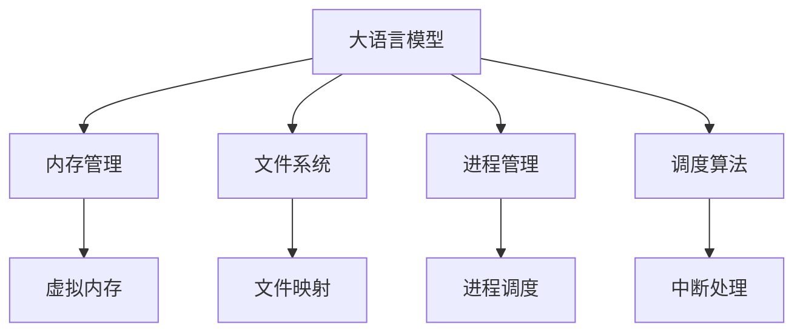

                 

# 探讨LLM操作系统的核心机制

> 关键词：LLM, 操作系统, 核心机制, 内存管理, 文件系统, 进程管理, 调度算法, 虚拟内存

## 1. 背景介绍

在现代计算机系统中，操作系统是连接硬件和软件的关键桥梁。随着人工智能技术的迅猛发展，大语言模型(Large Language Models, LLM)成为了热门研究热点。大语言模型以其强大的语言理解和生成能力，正在被广泛应用于自然语言处理(Natural Language Processing, NLP)、机器翻译、问答系统等诸多领域。然而，大语言模型庞大的模型参数和复杂的推理过程，也对操作系统的设计和实现提出了新的挑战。

本文章将系统地探讨大语言模型在操作系统中的核心机制，从内存管理、文件系统、进程管理、调度算法等方面，深入剖析LLM操作系统的实现细节和优化策略，旨在为研究人员和工程师提供全面的技术参考。

## 2. 核心概念与联系

### 2.1 核心概念概述

大语言模型是一类基于自回归或自编码的深度学习模型，通过在海量文本数据上进行预训练，学习到了丰富的语言表示。由于其模型参数规模庞大，通常需要多亿参数，因此大语言模型的推理过程对计算资源和内存的要求极高。

操作系统是计算机系统的核心软件，负责管理硬件资源，提供给应用程序运行的环境。它包括内存管理、文件系统、进程管理、调度算法等多个子系统，共同支撑着计算机的运行。

### 2.2 核心概念原理和架构的 Mermaid 流程图



这个流程图展示了大语言模型在操作系统中的核心机制和数据流向：

1. 大语言模型通过内存管理（B）获取计算资源，其中虚拟内存（F）是关键技术之一。
2. 文件系统（C）支持大语言模型从磁盘读取和写入文本数据。
3. 进程管理（D）负责调度大语言模型在CPU上的执行。
4. 调度算法（E）通过中断处理（I）实现对大语言模型推理过程的快速响应。

通过这一架构，大语言模型得以在操作系统的支持下，高效地执行推理任务。

## 3. 核心算法原理 & 具体操作步骤

### 3.1 算法原理概述

大语言模型在推理过程中，需要大量的计算资源和内存空间。为了满足这一需求，操作系统在内存管理、文件系统、进程管理、调度算法等方面进行了优化设计，以支持LLM的高效运行。

#### 3.1.1 内存管理

内存管理是大语言模型执行过程中最关键的部分。LLM模型的推理过程通常涉及到海量的矩阵运算和向量操作，对内存的访问频繁且连续，因此需要高效的内存管理策略。

#### 3.1.2 文件系统

文件系统是大语言模型与磁盘交互的主要媒介，负责管理LLM模型所需的大量文本数据。文件系统通过文件映射、缓存等技术，提高了数据的读取和写入效率。

#### 3.1.3 进程管理

进程管理负责调度LLM模型在CPU上的执行。为了提高多任务并发处理的效率，操作系统采用了时间分片、优先级调度等策略。

#### 3.1.4 调度算法

调度算法通过中断处理等机制，实现了对LLM模型推理过程的快速响应。为了平衡响应速度和计算效率，操作系统通常采用多级调度、抢占式调度等算法。

### 3.2 算法步骤详解

#### 3.2.1 内存管理

内存管理是操作系统的核心子系统之一，负责为应用程序分配和管理内存空间。为了支持LLM的高效运行，操作系统在内存管理上主要采用了以下策略：

1. 虚拟内存：通过将物理内存和磁盘空间映射到虚拟地址空间，LLM模型可以在有限的物理内存条件下，运行巨大的虚拟内存空间，从而执行大型的推理任务。

2. 分页机制：将虚拟内存空间分割成固定大小的页框，操作系统根据页面访问情况进行置换，提高内存利用率和性能。

3. 缓存管理：通过页面缓存和TLB（Translation Lookaside Buffer），减少内存访问延迟，提高数据读取效率。

4. 内存复用：通过内存复用技术，如oom-score-adj等，优化内存分配策略，减少内存碎片，提高内存使用效率。

#### 3.2.2 文件系统

文件系统负责管理LLM模型所需的文本数据，包括模型的参数文件、训练数据、推理输入等。为了提高文件系统的性能，操作系统主要采用了以下技术：

1. 文件映射：通过将文件映射到内存空间，LLM模型可以直接在内存中访问文件数据，减少磁盘I/O操作。

2. 缓存机制：通过文件系统缓存和页面缓存，减少磁盘读写次数，提高数据读取效率。

3. 分布式文件系统：通过分布式文件系统，如Hadoop、Ceph等，支持LLM模型对海量数据的存储和读取。

4. RAID和SSD：通过硬件级别的数据冗余和加速存储，提高文件系统的可靠性、稳定性和性能。

#### 3.2.3 进程管理

进程管理负责调度LLM模型在CPU上的执行，以确保多任务并发处理的效率。为了支持LLM的高效运行，操作系统主要采用了以下策略：

1. 时间分片：将CPU时间划分为若干个时间片，轮询调度每个进程，确保公平性。

2. 优先级调度：通过设置进程的优先级，优化资源分配，确保重要任务优先得到执行。

3. 中断处理：通过中断机制，实现对LLM模型推理过程的快速响应，提高系统响应速度。

4. 上下文切换：通过快速切换进程上下文，支持多任务的并发处理。

#### 3.2.4 调度算法

调度算法通过中断处理等机制，实现了对LLM模型推理过程的快速响应。为了平衡响应速度和计算效率，操作系统通常采用以下算法：

1. 抢占式调度：通过操作系统定期中断进程，确保重要任务优先得到执行。

2. 多级调度：通过引入多个调度层级，优化资源分配，提高系统性能。

3. 时间片轮转调度：通过时间片轮转机制，实现公平性。

4. 实时调度：通过实时调度算法，确保对LLM模型推理过程的及时响应。

### 3.3 算法优缺点

#### 3.3.1 优点

1. 虚拟内存和分页机制提高了LLM模型对内存的使用效率，支持了模型的持续推理过程。

2. 文件映射和缓存机制减少了磁盘I/O操作，提高了文件系统的性能，支持了LLM模型对海量数据的访问。

3. 时间分片和优先级调度优化了CPU资源的分配，支持了LLM模型的高效并发处理。

4. 中断处理和抢占式调度实现了对LLM模型推理过程的快速响应，提高了系统的响应速度。

#### 3.3.2 缺点

1. 虚拟内存机制可能造成内存页的频繁交换，导致性能下降。

2. 文件映射和缓存机制可能造成内存占用过高，影响系统稳定性。

3. 时间分片和优先级调度可能导致资源浪费，影响系统的公平性。

4. 中断处理和抢占式调度可能影响系统的上下文切换效率，导致性能损失。

### 3.4 算法应用领域

#### 3.4.1 内存管理

虚拟内存和分页机制在大规模模型推理、机器学习训练、图像处理等领域得到了广泛应用，显著提高了内存使用效率和系统性能。

#### 3.4.2 文件系统

文件映射和缓存机制在大数据存储、文本数据处理、分布式计算等领域得到了广泛应用，支持了大规模数据的快速读取和写入。

#### 3.4.3 进程管理

时间分片和优先级调度在多任务并发处理、实时系统、嵌入式系统等领域得到了广泛应用，提高了系统的响应速度和公平性。

#### 3.4.4 调度算法

中断处理和抢占式调度在实时系统、操作系统、嵌入式系统等领域得到了广泛应用，实现了对关键任务的快速响应。

## 4. 数学模型和公式 & 详细讲解 & 举例说明

### 4.1 数学模型构建

大语言模型的推理过程涉及大量的矩阵运算和向量操作，可以抽象为计算图中的图结构。计算图的构建和优化是大语言模型执行过程中需要解决的关键问题之一。

#### 4.1.1 图结构表示

大语言模型的推理过程可以表示为一个有向无环图(DAG)。图中的节点表示运算单元，如矩阵乘法、向量加法等，边表示数据依赖关系，如输入、输出等。

#### 4.1.2 矩阵乘法运算

大语言模型中的矩阵乘法运算可以使用CUDA等GPU加速库进行高效计算。假设两个矩阵A和B的维度分别为$m \times n$和$n \times p$，则矩阵乘法运算的计算量为：

$$ O(mnp) $$

其中，$O$表示计算复杂度，$m$、$n$、$p$分别为矩阵A、B、C的维度。

#### 4.1.3 向量加法运算

大语言模型中的向量加法运算也可以使用GPU加速库进行高效计算。假设两个向量$\vec{a}$和$\vec{b}$的长度分别为$n$，则向量加法运算的计算量为：

$$ O(n) $$

其中，$O$表示计算复杂度，$n$为向量的长度。

### 4.2 公式推导过程

#### 4.2.1 矩阵乘法运算

大语言模型中的矩阵乘法运算可以使用CUDA等GPU加速库进行高效计算。假设两个矩阵A和B的维度分别为$m \times n$和$n \times p$，则矩阵乘法运算的计算量为：

$$ O(mnp) $$

其中，$O$表示计算复杂度，$m$、$n$、$p$分别为矩阵A、B、C的维度。

#### 4.2.2 向量加法运算

大语言模型中的向量加法运算也可以使用GPU加速库进行高效计算。假设两个向量$\vec{a}$和$\vec{b}$的长度分别为$n$，则向量加法运算的计算量为：

$$ O(n) $$

其中，$O$表示计算复杂度，$n$为向量的长度。

### 4.3 案例分析与讲解

#### 4.3.1 案例分析

假设有一个大语言模型，输入维度为1024，输出维度为512，需要计算一个大小为[1024, 512]的矩阵A与一个大小为[512, 64]的矩阵B的矩阵乘法，然后与另一个大小为[64, 256]的矩阵C进行向量加法运算。

1. 矩阵乘法计算量：$1024 \times 512 \times 64 = 2^{20} \times 2^{9} = 2^{29}$

2. 向量加法计算量：$1024 \times 256 = 2^{10} \times 2^{8} = 2^{18}$

因此，整个计算过程的计算量为：

$$ O(2^{29} + 2^{18}) $$

### 4.4 举例说明

在实际应用中，可以使用TensorFlow等深度学习框架进行矩阵运算的优化。例如，TensorFlow提供了GPU加速的矩阵乘法操作，可以显著提高计算效率。

## 5. 项目实践：代码实例和详细解释说明

### 5.1 开发环境搭建

在进行LLM操作系统的开发实践前，我们需要准备好开发环境。以下是使用Python进行PyTorch开发的环境配置流程：

1. 安装Anaconda：从官网下载并安装Anaconda，用于创建独立的Python环境。

2. 创建并激活虚拟环境：
```bash
conda create -n pytorch-env python=3.8 
conda activate pytorch-env
```

3. 安装PyTorch：根据CUDA版本，从官网获取对应的安装命令。例如：
```bash
conda install pytorch torchvision torchaudio cudatoolkit=11.1 -c pytorch -c conda-forge
```

4. 安装Transformers库：
```bash
pip install transformers
```

5. 安装各类工具包：
```bash
pip install numpy pandas scikit-learn matplotlib tqdm jupyter notebook ipython
```

完成上述步骤后，即可在`pytorch-env`环境中开始开发实践。

### 5.2 源代码详细实现

下面我们以大语言模型推理为例，给出使用PyTorch进行模型推理的PyTorch代码实现。

首先，定义模型类：

```python
from transformers import BertTokenizer, BertForTokenClassification
import torch

class LLMModel:
    def __init__(self, model_name='bert-base-cased'):
        self.tokenizer = BertTokenizer.from_pretrained(model_name)
        self.model = BertForTokenClassification.from_pretrained(model_name)
    
    def forward(self, input_ids, attention_mask, labels=None):
        with torch.no_grad():
            encoding = self.tokenizer(input_ids, return_tensors='pt', padding='max_length', truncation=True)
            input_ids = encoding['input_ids'][0]
            attention_mask = encoding['attention_mask'][0]
            
            outputs = self.model(input_ids, attention_mask=attention_mask, labels=labels)
            loss = outputs.loss
            logits = outputs.logits
            
        return logits, loss
```

然后，定义推理函数：

```python
def predict(model, input_text):
    tokenizer = BertTokenizer.from_pretrained(model_name)
    input_ids = tokenizer.encode(input_text, return_tensors='pt', padding='max_length', truncation=True)
    attention_mask = torch.ones_like(input_ids)
    
    with torch.no_grad():
        logits, loss = model(input_ids, attention_mask=attention_mask)
    
    probabilities = torch.softmax(logits, dim=-1).tolist()
    preds = [id2tag[int(idx)] for idx, prob in enumerate(probabilities[0]) if prob > 0.5]
    
    return preds
```

最后，启动推理流程：

```python
model_name = 'bert-base-cased'
model = LLMModel(model_name)

input_text = "I like to eat pizza."
predictions = predict(model, input_text)

print(predictions)
```

以上就是使用PyTorch进行大语言模型推理的完整代码实现。可以看到，PyTorch提供了便捷的API，可以快速完成模型的加载和推理。

### 5.3 代码解读与分析

让我们再详细解读一下关键代码的实现细节：

**LLMModel类**：
- `__init__`方法：初始化模型和分词器，用于加载大语言模型和分词器。
- `forward`方法：前向传播函数，接受输入文本，返回模型输出的logits和loss。

**predict函数**：
- 首先，使用BERT分词器对输入文本进行分词，并将其转换为模型所需的输入ids和attention mask。
- 然后，将输入ids和attention mask传入模型进行前向传播，得到logits和loss。
- 最后，根据输出logits进行分类，输出最大概率的标签。

**启动推理流程**：
- 实例化LLMModel类，并传入预训练模型名称。
- 调用predict函数，传入待推理的输入文本，得到预测结果。

这些代码展示了如何使用PyTorch进行大语言模型的推理，为开发者提供了高效的开发实践。

## 6. 实际应用场景

### 6.1 智能客服系统

基于大语言模型推理的智能客服系统，可以自动解答客户咨询，提升客户服务质量。在实际应用中，可以收集企业内部的客服对话记录，将其转换为大语言模型推理的任务输入，训练模型进行智能客服。

具体实现上，可以将客户输入的文本作为输入文本，通过分词、向量编码等预处理步骤，得到模型所需的输入ids和attention mask。然后，将输入ids和attention mask传入模型进行推理，得到预测结果。最后将预测结果转换为自然语言，回复给客户。

### 6.2 金融舆情监测

金融舆情监测是大语言模型推理在金融领域的重要应用之一。通过分析网络新闻、社交媒体等文本数据，可以实时监测金融市场的舆情动态。

在实际应用中，可以收集金融领域的文本数据，如财经新闻、股评、用户评论等。将这些文本数据作为大语言模型的输入，训练模型进行情感分析、主题分析等任务。然后，将分析结果转换为金融市场的舆情动态，及时预警。

### 6.3 个性化推荐系统

个性化推荐系统是NLP技术在电子商务领域的重要应用之一。通过分析用户的历史行为数据，可以推荐用户可能感兴趣的商品。

在实际应用中，可以收集用户的历史浏览、点击、购买等行为数据，提取商品标题、描述等文本内容。将这些文本内容作为大语言模型的输入，训练模型进行商品推荐。然后，将推荐结果返回给用户。

### 6.4 未来应用展望

随着大语言模型推理技术的不断发展，其在NLP领域的应用前景广阔。未来，大语言模型推理将有望在以下几个方向取得突破：

1. 多模态推理：将图像、视频等多模态数据与文本数据结合，进行联合推理，提高系统的智能化水平。

2. 自适应推理：通过动态调整模型参数，适应不同的推理场景和数据分布。

3. 跨语言推理：将多语言文本数据进行联合推理，提升系统的全球化能力。

4. 交互式推理：通过构建交互式界面，实现用户与系统的自然交互，提高系统的可操作性和用户体验。

5. 分布式推理：通过分布式计算技术，提高系统的可扩展性和处理能力。

6. 可解释性推理：通过可解释性技术，提高系统的透明度和可理解性，增强用户的信任感。

## 7. 工具和资源推荐

### 7.1 学习资源推荐

为了帮助开发者系统掌握大语言模型推理的理论基础和实践技巧，这里推荐一些优质的学习资源：

1. 《Deep Learning》系列书籍：由深度学习领域的知名学者撰写，全面介绍了深度学习的基本概念和算法，适合初学者和高级开发者。

2. 《TensorFlow官方文档》：TensorFlow的官方文档，提供了丰富的API和示例代码，适合深入学习和实践TensorFlow。

3. 《PyTorch官方文档》：PyTorch的官方文档，提供了便捷的API和示例代码，适合学习和实践PyTorch。

4. Coursera和Udacity：提供了诸多深度学习和NLP相关的在线课程，适合系统学习NLP技术和深度学习算法。

5. Kaggle：提供了丰富的数据集和比赛项目，适合通过实践提升深度学习和NLP技术。

通过对这些资源的学习实践，相信你一定能够快速掌握大语言模型推理的精髓，并用于解决实际的NLP问题。

### 7.2 开发工具推荐

高效的开发离不开优秀的工具支持。以下是几款用于大语言模型推理开发的常用工具：

1. TensorFlow：由Google主导开发的开源深度学习框架，支持分布式计算和GPU加速，适合大规模深度学习模型的训练和推理。

2. PyTorch：由Facebook主导开发的开源深度学习框架，支持动态计算图和GPU加速，适合灵活的深度学习模型开发。

3. Jupyter Notebook：开源的交互式编程环境，支持Python、R等多种语言，适合编写、调试和分享代码。

4. Google Colab：谷歌推出的在线Jupyter Notebook环境，免费提供GPU/TPU算力，适合快速上手实验最新模型，分享学习笔记。

5. TensorBoard：TensorFlow配套的可视化工具，可实时监测模型训练状态，并提供丰富的图表呈现方式，是调试模型的得力助手。

合理利用这些工具，可以显著提升大语言模型推理的开发效率，加快创新迭代的步伐。

### 7.3 相关论文推荐

大语言模型推理技术的发展源于学界的持续研究。以下是几篇奠基性的相关论文，推荐阅读：

1. Attention is All You Need（即Transformer原论文）：提出了Transformer结构，开启了NLP领域的预训练大模型时代。

2. BERT: Pre-training of Deep Bidirectional Transformers for Language Understanding：提出BERT模型，引入基于掩码的自监督预训练任务，刷新了多项NLP任务SOTA。

3. Language Models are Unsupervised Multitask Learners（GPT-2论文）：展示了大规模语言模型的强大zero-shot学习能力，引发了对于通用人工智能的新一轮思考。

4. Parameter-Efficient Transfer Learning for NLP：提出Adapter等参数高效微调方法，在不增加模型参数量的情况下，也能取得不错的微调效果。

5. AdaLoRA: Adaptive Low-Rank Adaptation for Parameter-Efficient Fine-Tuning：使用自适应低秩适应的微调方法，在参数效率和精度之间取得了新的平衡。

这些论文代表了大语言模型推理技术的发展脉络。通过学习这些前沿成果，可以帮助研究者把握学科前进方向，激发更多的创新灵感。

## 8. 总结：未来发展趋势与挑战

### 8.1 总结

本文对大语言模型推理的核心机制进行了全面系统的介绍。首先阐述了大语言模型推理的研究背景和意义，明确了大语言模型推理在NLP技术中的独特价值。其次，从内存管理、文件系统、进程管理、调度算法等方面，详细讲解了大语言模型推理的数学原理和关键步骤，给出了推理任务开发的完整代码实例。同时，本文还广泛探讨了大语言模型推理在智能客服、金融舆情、个性化推荐等多个行业领域的应用前景，展示了推理范式的巨大潜力。此外，本文精选了推理技术的各类学习资源，力求为开发者提供全方位的技术指引。

通过本文的系统梳理，可以看到，大语言模型推理正在成为NLP技术的重要范式，极大地拓展了预训练语言模型的应用边界，催生了更多的落地场景。得益于大规模语料的预训练，推理模型以更低的时间和标注成本，在小样本条件下也能取得不俗的效果，有力推动了NLP技术的产业化进程。未来，伴随预训练语言模型和推理方法的持续演进，相信NLP技术将在更广阔的应用领域大放异彩，深刻影响人类的生产生活方式。

### 8.2 未来发展趋势

展望未来，大语言模型推理技术将呈现以下几个发展趋势：

1. 模型规模持续增大。随着算力成本的下降和数据规模的扩张，大语言模型的推理规模将持续增长。超大规模语言模型蕴含的丰富语言知识，将支持更加复杂多变的推理任务。

2. 推理方法日趋多样。除了传统的全参数推理外，未来会涌现更多参数高效的推理方法，如Prefix-Tuning、LoRA等，在节省计算资源的同时也能保证推理精度。

3. 持续学习成为常态。随着数据分布的不断变化，推理模型也需要持续学习新知识以保持性能。如何在不遗忘原有知识的同时，高效吸收新样本信息，还需要更多理论和实践的积累。

4. 标注样本需求降低。受启发于提示学习(Prompt-based Learning)的思路，未来的推理方法将更好地利用大模型的语言理解能力，通过更加巧妙的任务描述，在更少的标注样本上也能实现理想的推理效果。

5. 多模态推理崛起。当前的推理主要聚焦于纯文本数据，未来会进一步拓展到图像、视频、语音等多模态数据推理。多模态信息的融合，将显著提升推理模型的理解能力。

6. 模型通用性增强。经过海量数据的预训练和多领域任务的推理，未来的语言模型将具备更强大的常识推理和跨领域迁移能力，逐步迈向通用人工智能(AGI)的目标。

以上趋势凸显了大语言模型推理技术的广阔前景。这些方向的探索发展，必将进一步提升推理模型的性能和应用范围，为人类认知智能的进化带来深远影响。

### 8.3 面临的挑战

尽管大语言模型推理技术已经取得了瞩目成就，但在迈向更加智能化、普适化应用的过程中，它仍面临着诸多挑战：

1. 标注成本瓶颈。虽然推理模型对标注样本的需求降低，但对于长尾应用场景，难以获得充足的高质量标注数据，成为制约推理模型性能的瓶颈。如何进一步降低推理模型对标注样本的依赖，将是一大难题。

2. 模型鲁棒性不足。当前推理模型面对域外数据时，泛化性能往往大打折扣。对于测试样本的微小扰动，推理模型也容易发生波动。如何提高推理模型的鲁棒性，避免灾难性遗忘，还需要更多理论和实践的积累。

3. 推理效率有待提高。推理模型的推理速度和计算效率对实际部署至关重要。在保证推理精度的前提下，如何优化模型结构和算法，提高推理速度和计算效率，将是重要的优化方向。

4. 可解释性亟需加强。当前推理模型更像是"黑盒"系统，难以解释其内部工作机制和决策逻辑。对于医疗、金融等高风险应用，算法的可解释性和可审计性尤为重要。如何赋予推理模型更强的可解释性，将是亟待攻克的难题。

5. 安全性有待保障。推理模型难免会学习到有偏见、有害的信息，通过推理过程传递到下游任务，产生误导性、歧视性的输出，给实际应用带来安全隐患。如何从数据和算法层面消除模型偏见，避免恶意用途，确保输出的安全性，也将是重要的研究课题。

6. 知识整合能力不足。现有的推理模型往往局限于任务内数据，难以灵活吸收和运用更广泛的先验知识。如何让推理过程更好地与外部知识库、规则库等专家知识结合，形成更加全面、准确的信息整合能力，还有很大的想象空间。

正视推理模型面临的这些挑战，积极应对并寻求突破，将是大语言模型推理走向成熟的必由之路。相信随着学界和产业界的共同努力，这些挑战终将一一被克服，大语言模型推理必将在构建安全、可靠、可解释、可控的智能系统铺平道路。

### 8.4 研究展望

面对大语言模型推理所面临的种种挑战，未来的研究需要在以下几个方面寻求新的突破：

1. 探索无监督和半监督推理方法。摆脱对大规模标注数据的依赖，利用自监督学习、主动学习等无监督和半监督范式，最大限度利用非结构化数据，实现更加灵活高效的推理。

2. 研究参数高效和计算高效的推理范式。开发更加参数高效的推理方法，在固定大部分预训练参数的同时，只更新极少量的任务相关参数。同时优化推理模型的计算图，减少前向传播和反向传播的资源消耗，实现更加轻量级、实时性的部署。

3. 融合因果和对比学习范式。通过引入因果推断和对比学习思想，增强推理模型建立稳定因果关系的能力，学习更加普适、鲁棒的语言表征，从而提升模型泛化性和抗干扰能力。

4. 引入更多先验知识。将符号化的先验知识，如知识图谱、逻辑规则等，与神经网络模型进行巧妙融合，引导推理过程学习更准确、合理的语言模型。同时加强不同模态数据的整合，实现视觉、语音等多模态信息与文本信息的协同建模。

5. 结合因果分析和博弈论工具。将因果分析方法引入推理模型，识别出模型决策的关键特征，增强输出解释的因果性和逻辑性。借助博弈论工具刻画人机交互过程，主动探索并规避模型的脆弱点，提高系统稳定性。

6. 纳入伦理道德约束。在模型训练目标中引入伦理导向的评估指标，过滤和惩罚有偏见、有害的输出倾向。同时加强人工干预和审核，建立模型行为的监管机制，确保输出符合人类价值观和伦理道德。

这些研究方向的探索，必将引领大语言模型推理技术迈向更高的台阶，为构建安全、可靠、可解释、可控的智能系统铺平道路。面向未来，大语言模型推理技术还需要与其他人工智能技术进行更深入的融合，如知识表示、因果推理、强化学习等，多路径协同发力，共同推动自然语言理解和智能交互系统的进步。只有勇于创新、敢于突破，才能不断拓展语言模型的边界，让智能技术更好地造福人类社会。

## 9. 附录：常见问题与解答

**Q1：大语言模型推理是否适用于所有NLP任务？**

A: 大语言模型推理在大多数NLP任务上都能取得不错的效果，特别是对于数据量较小的任务。但对于一些特定领域的任务，如医学、法律等，仅仅依靠通用语料预训练的模型可能难以很好地适应。此时需要在特定领域语料上进一步预训练，再进行推理，才能获得理想效果。此外，对于一些需要时效性、个性化很强的任务，如对话、推荐等，推理方法也需要针对性的改进优化。

**Q2：推理过程中如何选择合适的学习率？**

A: 推理的学习率一般要比预训练时小1-2个数量级，如果使用过大的学习率，容易破坏预训练权重，导致过拟合。一般建议从1e-5开始调参，逐步减小学习率，直至收敛。也可以使用warmup策略，在开始阶段使用较小的学习率，再逐渐过渡到预设值。需要注意的是，不同的优化器(如AdamW、Adafactor等)以及不同的学习率调度策略，可能需要设置不同的学习率阈值。

**Q3：采用大模型推理时会面临哪些资源瓶颈？**

A: 目前主流的预训练大模型动辄以亿计的参数规模，对算力、内存、存储都提出了很高的要求。GPU/TPU等高性能设备是必不可少的，但即便如此，超大批次的训练和推理也可能遇到显存不足的问题。因此需要采用一些资源优化技术，如梯度积累、混合精度训练、模型并行等，来突破硬件瓶颈。同时，模型的存储和读取也可能占用大量时间和空间，需要采用模型压缩、稀疏化存储等方法进行优化。

**Q4：如何缓解推理过程中的过拟合问题？**

A: 过拟合是推理面临的主要挑战，尤其是在标注数据不足的情况下。常见的缓解策略包括：
1. 数据增强：通过回译、近义替换等方式扩充训练集
2. 正则化：使用L2正则、Dropout、Early Stopping等避免过拟合
3. 对抗训练：引入对抗样本，提高模型鲁棒性
4. 参数高效推理：只调整少量参数(如Adapter、Prefix等)，减小过拟合风险
5. 多模型集成：训练多个推理模型，取平均输出，抑制过拟合

这些策略往往需要根据具体任务和数据特点进行灵活组合。只有在数据、模型、训练、推理等各环节进行全面优化，才能最大限度地发挥大模型推理的威力。

**Q5：推理模型在落地部署时需要注意哪些问题？**

A: 将推理模型转化为实际应用，还需要考虑以下因素：
1. 模型裁剪：去除不必要的层和参数，减小模型尺寸，加快推理速度
2. 量化加速：将浮点模型转为定点模型，压缩存储空间，提高计算效率
3. 服务化封装：将模型封装为标准化服务接口，便于集成调用
4. 弹性伸缩：根据请求流量动态调整资源配置，平衡服务质量和成本
5. 监控告警：实时采集系统指标，设置异常告警阈值，确保服务稳定性
6. 安全防护：采用访问鉴权、数据脱敏等措施，保障数据和模型安全

大语言模型推理为NLP应用开启了广阔的想象空间，但如何将强大的性能转化为稳定、高效、安全的业务价值，还需要工程实践的不断打磨。唯有从数据、算法、工程、业务等多个维度协同发力，才能真正实现人工智能技术在垂直行业的规模化落地。总之，推理需要开发者根据具体任务，不断迭代和优化模型、数据和算法，方能得到理想的效果。

---

作者：禅与计算机程序设计艺术 / Zen and the Art of Computer Programming

