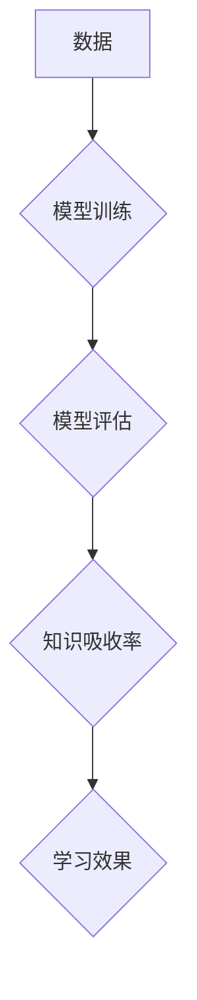

                 

## 知识吸收率:衡量学习效果的关键指标

> 关键词：知识吸收率、学习效果、机器学习、深度学习、神经网络、知识图谱、评估指标、学习优化

## 1. 背景介绍

在当今数据爆炸的时代，信息获取变得前所未有便捷，然而，仅仅获取信息并不能带来真正的进步。真正重要的在于如何有效地吸收和利用这些信息，将其转化为知识和技能。 

对于人类学习而言，知识吸收率一直是衡量学习效果的重要指标。它反映了学习者在吸收和理解新知识方面的能力，是学习成效的直接体现。而对于机器学习领域而言，知识吸收率的概念也逐渐被重视起来。随着深度学习模型的不断发展，模型的规模和复杂度不断增加，如何有效地评估模型的学习能力，并将其转化为实际应用中的价值，成为了一个重要的研究方向。

## 2. 核心概念与联系

### 2.1 知识吸收率的定义

知识吸收率是指学习者从给定的信息中吸收和理解的知识量与总信息量的比值。它可以用来衡量学习者的学习效率和学习效果。

### 2.2 知识吸收率与机器学习

在机器学习领域，知识吸收率的概念可以扩展到模型的学习能力。我们可以将模型的学习过程看作是一个从数据中吸收知识的过程，而模型的性能则可以看作是其知识吸收能力的体现。

**知识吸收率与机器学习的关系**



### 2.3 影响因素

知识吸收率受到多种因素的影响，包括：

* **学习者的个体差异:** 学习能力、学习动机、学习策略等因素都会影响知识吸收率。
* **学习内容的特性:** 信息的复杂度、相关性、趣味性等因素都会影响知识吸收率。
* **学习环境:** 学习环境的安静程度、舒适度、资源丰富程度等因素都会影响知识吸收率。
* **学习方法:** 不同的学习方法，例如主动学习、合作学习、沉浸式学习等，对知识吸收率的影响也不同。

## 3. 核心算法原理 & 具体操作步骤

### 3.1 算法原理概述

目前，没有一个统一的算法可以精确地衡量知识吸收率。 

然而，我们可以通过一些指标和方法来间接地评估知识吸收率。例如：

* **准确率:** 在分类任务中，准确率可以用来衡量模型对数据的分类能力，反映模型对知识的理解程度。
* **召回率:** 在信息检索任务中，召回率可以用来衡量模型对相关信息的检索能力，反映模型对知识的覆盖范围。
* **F1-score:** F1-score 是准确率和召回率的调和平均值，可以综合地衡量模型的性能。
* **知识图谱嵌入:** 将知识图谱中的实体和关系嵌入到低维向量空间中，可以用来衡量实体和关系之间的相似性和相关性，从而间接地反映模型对知识的理解和组织能力。

### 3.2 算法步骤详解

具体操作步骤取决于所选用的评估指标和方法。例如，对于准确率的评估，我们可以按照以下步骤进行：

1. **准备数据:** 将数据分为训练集、验证集和测试集。
2. **训练模型:** 使用训练集训练机器学习模型。
3. **验证模型:** 使用验证集评估模型的性能，并根据评估结果调整模型参数。
4. **测试模型:** 使用测试集评估模型的最终性能，并计算准确率。

### 3.3 算法优缺点

不同的评估指标和方法都有其优缺点。例如，准确率容易理解和计算，但它只考虑了模型对正确分类的样本数量，而忽略了对错误分类的样本数量。召回率则更关注模型对所有相关样本的覆盖范围，但它可能忽略了模型对无关样本的区分能力。

### 3.4 算法应用领域

知识吸收率的评估方法可以应用于各种机器学习领域，例如：

* **自然语言处理:** 评估模型对文本的理解能力，例如文本分类、情感分析、机器翻译等。
* **计算机视觉:** 评估模型对图像的理解能力，例如图像识别、目标检测、图像分割等。
* **推荐系统:** 评估模型对用户的兴趣和偏好的理解能力，例如商品推荐、内容推荐等。

## 4. 数学模型和公式 & 详细讲解 & 举例说明

### 4.1 数学模型构建

我们可以使用以下数学模型来表示知识吸收率：

$$
K_a = \frac{K_u}{K_t}
$$

其中：

* $K_a$ 表示知识吸收率。
* $K_u$ 表示学习者吸收的知识量。
* $K_t$ 表示总知识量。

### 4.2 公式推导过程

该公式的推导过程非常简单，它直接反映了知识吸收率的定义。

### 4.3 案例分析与讲解

假设我们有一个学习者学习了100个概念，其中他能够理解和应用70个概念，那么他的知识吸收率为：

$$
K_a = \frac{70}{100} = 0.7
$$

这意味着这个学习者吸收了总知识量的70%。

## 5. 项目实践：代码实例和详细解释说明

### 5.1 开发环境搭建

为了演示知识吸收率的评估方法，我们可以使用Python语言和Scikit-learn库进行开发。

### 5.2 源代码详细实现

```python
from sklearn.metrics import accuracy_score

# 假设我们有一个分类模型
model = ...

# 使用测试集评估模型的性能
y_true = ...
y_pred = model.predict(X_test)

# 计算模型的准确率
accuracy = accuracy_score(y_true, y_pred)

# 打印准确率
print(f"模型的准确率为: {accuracy}")
```

### 5.3 代码解读与分析

这段代码首先定义了一个分类模型，然后使用测试集评估模型的性能。最后，使用`accuracy_score`函数计算模型的准确率，并将其打印出来。

### 5.4 运行结果展示

运行这段代码后，会输出模型的准确率值。

## 6. 实际应用场景

### 6.1 教育领域

知识吸收率可以用来评估学生的学习效果，帮助老师了解学生的学习情况，并针对性地进行教学调整。

### 6.2 企业培训

企业可以利用知识吸收率来评估员工的培训效果，并根据评估结果进行培训计划的优化。

### 6.3 机器学习模型优化

在机器学习领域，知识吸收率可以用来评估模型的学习能力，并帮助研究人员优化模型的结构和参数。

### 6.4 未来应用展望

随着人工智能技术的不断发展，知识吸收率的概念和应用场景将会更加广泛。例如，我们可以利用知识吸收率来评估虚拟助手、聊天机器人等智能系统的学习能力，并将其应用于个性化教育、智能客服等领域。

## 7. 工具和资源推荐

### 7.1 学习资源推荐

* **书籍:**

    * 《深度学习》
    * 《机器学习》
    * 《人工智能：一种现代方法》

* **在线课程:**

    * Coursera
    * edX
    * Udacity

### 7.2 开发工具推荐

* **Python:** 

    * Scikit-learn
    * TensorFlow
    * PyTorch

* **其他工具:**

    * Jupyter Notebook
    * Git

### 7.3 相关论文推荐

* **Knowledge Distillation:** Hinton, G., Vinyals, O., & Dean, J. (2015). Distilling the knowledge in a neural network. arXiv preprint arXiv:1503.02531.
* **Transfer Learning:** Pan, S. J., & Yang, Q. (2010). A survey on transfer learning. IEEE Transactions on Knowledge and Data Engineering, 22(10), 1345-1359.
* **Knowledge Graph Embedding:** Bordes, A., Nickel, M., & Vinyals, O. (2013). Learning entity embeddings for knowledge graph completion. In Proceedings of the 2013 ACM SIGKDD International Conference on Knowledge Discovery and Data Mining (pp. 278-287). ACM.

## 8. 总结：未来发展趋势与挑战

### 8.1 研究成果总结

近年来，在机器学习领域，知识吸收率的概念和评估方法得到了越来越多的关注。研究人员提出了多种新的评估指标和方法，并将其应用于各种机器学习任务。

### 8.2 未来发展趋势

未来，知识吸收率的研究将会朝着以下几个方向发展：

* **更精准的评估指标:** 研究人员将继续探索更精准、更全面的知识吸收率评估指标，以更好地反映模型的学习能力。
* **个性化学习:** 基于知识吸收率，我们可以开发出个性化的学习系统，根据用户的学习情况和需求，提供定制化的学习内容和学习方法。
* **跨模态学习:** 知识吸收率的评估方法可以扩展到跨模态学习领域，例如将文本、图像、音频等多种模态信息融合在一起，提高模型的学习能力。

### 8.3 面临的挑战

知识吸收率的评估仍然面临一些挑战：

* **定义的模糊性:** 知识吸收率的概念本身就比较模糊，缺乏统一的定义和标准。
* **评估方法的局限性:** 目前的评估方法只能间接地反映模型的知识吸收能力，无法完全准确地量化知识吸收率。
* **数据获取的困难:** 为了评估知识吸收率，需要大量的标注数据，而获取高质量的标注数据非常困难。

### 8.4 研究展望

尽管面临着挑战，但知识吸收率的研究仍然具有重要的意义。随着人工智能技术的不断发展，我们相信，未来将会出现更精准、更有效的知识吸收率评估方法，为机器学习的发展提供新的思路和方向。

## 9. 附录：常见问题与解答

### 9.1 如何提高知识吸收率？

提高知识吸收率需要多方面努力，包括：

* **主动学习:** 积极参与学习过程，提出问题，思考和总结。
* **合作学习:** 与他人交流学习心得，互相启发。
* **沉浸式学习:** 将学习内容融入到实际生活中，通过实践加深理解。
* **高效学习方法:** 找到适合自己的学习方法，例如番茄工作法、思维导图等。

### 9.2 知识吸收率与学习效果的关系是什么？

知识吸收率是学习效果的重要指标，但它并不是唯一的指标。学习效果还受到学习动机、学习策略、学习环境等因素的影响。

### 9.3 知识吸收率的评估方法有哪些？

目前，常用的知识吸收率评估方法包括：

* **准确率:** 在分类任务中，准确率可以用来衡量模型对数据的分类能力。
* **召回率:** 在信息检索任务中，召回率可以用来衡量模型对相关信息的检索能力。
* **F1-score:** F1-score 是准确率和召回率的调和平均值，可以综合地衡量模型的性能。
* **知识图谱嵌入:** 将知识图谱中的实体和关系嵌入到低维向量空间中，可以用来衡量实体和关系之间的相似性和相关性。


作者：禅与计算机程序设计艺术 / Zen and the Art of Computer Programming 
<end_of_turn>

