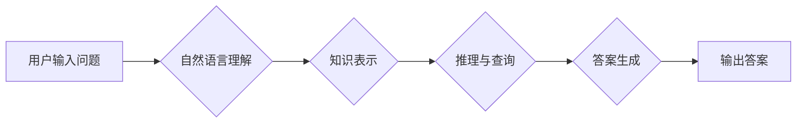

                 

## 知识图谱驱动的智能问答系统开发

> 关键词：知识图谱、智能问答、自然语言处理、信息检索、机器学习、深度学习

## 1. 背景介绍

智能问答系统 (Intelligent Question Answering, QA) 作为人工智能领域的重要分支，旨在理解用户自然语言问题，并从知识库中检索出最相关、最准确的答案。传统的问答系统主要依赖于关键词匹配和规则匹配等方法，难以处理复杂、开放式的自然语言问题。随着知识图谱 (Knowledge Graph, KG) 的兴起，基于知识图谱的智能问答系统 (KG-based QA) 成为一个新的研究热点。

知识图谱是一种结构化的知识表示形式，它以实体和关系为节点，通过连接关系描述实体之间的相互关系。相比于传统的文本数据，知识图谱能够更有效地捕捉知识的语义和结构，为智能问答系统提供更丰富、更准确的知识基础。

## 2. 核心概念与联系

### 2.1 知识图谱

知识图谱是一种以实体和关系为节点，通过连接关系描述实体之间相互关系的知识表示形式。它可以被看作是知识的网络化表示，能够有效地捕捉知识的语义和结构。

### 2.2 智能问答系统

智能问答系统旨在理解用户自然语言问题，并从知识库中检索出最相关、最准确的答案。它通常包括以下几个模块：

* **自然语言理解 (NLU)**：负责将用户输入的自然语言问题转换为机器可理解的结构化表示，例如依存句法树或语义角色标注。
* **知识表示 (KR)**：负责将知识库中的知识表示为机器可理解的形式，例如知识图谱。
* **推理与查询 (R&Q)**：负责根据用户问题和知识图谱中的知识，进行推理和查询，找到最相关的答案。
* **答案生成 (AG)**：负责将查询结果转换为自然语言形式，生成用户易于理解的答案。

### 2.3 知识图谱驱动的智能问答系统

知识图谱驱动的智能问答系统将知识图谱作为知识库，利用知识图谱的结构化特性，提高问答系统的准确性和鲁棒性。

**Mermaid 流程图**



## 3. 核心算法原理 & 具体操作步骤

### 3.1 算法原理概述

知识图谱驱动的智能问答系统通常采用基于规则的、基于机器学习的或基于深度学习的算法。

* **基于规则的算法**：依赖于预先定义的规则和知识库，通过匹配用户问题和规则，找到相应的答案。这种方法简单易实现，但难以处理复杂、开放式的自然语言问题。
* **基于机器学习的算法**：利用机器学习算法，从训练数据中学习知识图谱和用户问题的映射关系，从而实现问答。这种方法能够处理更复杂的自然语言问题，但需要大量的训练数据。
* **基于深度学习的算法**：利用深度神经网络，学习知识图谱和用户问题的语义表示，从而实现问答。这种方法能够更好地理解自然语言的语义，并取得更高的问答准确率。

### 3.2 算法步骤详解

以基于深度学习的知识图谱驱动的智能问答系统为例，其具体操作步骤如下：

1. **数据预处理**: 将用户问题和知识图谱中的实体和关系转换为机器可理解的格式，例如词向量表示。
2. **编码**: 利用深度神经网络，将用户问题和知识图谱中的实体和关系编码为语义向量。
3. **匹配**: 计算用户问题和知识图谱中实体和关系之间的相似度，找到最相关的实体和关系。
4. **推理**: 利用知识图谱中的关系，进行推理，找到用户问题的答案。
5. **解码**: 将推理结果解码为自然语言形式，生成用户易于理解的答案。

### 3.3 算法优缺点

**优点**:

* 能够处理更复杂的自然语言问题。
* 能够更好地理解自然语言的语义。
* 能够取得更高的问答准确率。

**缺点**:

* 需要大量的训练数据。
* 训练过程复杂，耗时较长。
* 对硬件资源要求较高。

### 3.4 算法应用领域

知识图谱驱动的智能问答系统在多个领域都有广泛的应用，例如：

* **搜索引擎**: 提高搜索结果的准确性和相关性。
* **客户服务**: 自动回答客户常见问题，提高服务效率。
* **教育**: 提供个性化的学习辅导，帮助学生更好地理解知识。
* **医疗**: 辅助医生诊断疾病，提供患者个性化的治疗方案。

## 4. 数学模型和公式 & 详细讲解 & 举例说明

### 4.1 数学模型构建

知识图谱驱动的智能问答系统通常采用图神经网络 (Graph Neural Network, GNN) 作为其核心模型。GNN 是一种能够学习图结构数据表示的深度学习模型，能够有效地捕捉知识图谱中的实体和关系之间的复杂关系。

### 4.2 公式推导过程

GNN 的核心思想是通过迭代更新节点的特征向量，学习图结构的表示。假设知识图谱包含 N 个实体和 E 个关系，每个实体 i 的特征向量为 h_i，每个关系 r 的特征向量为 r_j。GNN 的更新公式如下：

$$
h_i^{l+1} = \sigma(W_1 h_i^l + \sum_{j \in N(i)} W_2 h_j^l + b_1)
$$

其中：

* h_i^l 表示实体 i 在第 l 层的特征向量。
* N(i) 表示实体 i 的邻居节点集合。
* W_1 和 W_2 是可学习的权重矩阵。
* b_1 是偏置项。
* σ 是激活函数。

### 4.3 案例分析与讲解

假设我们有一个知识图谱，包含实体 "张三"、"李四" 和关系 "朋友"。

* 实体 "张三" 的特征向量为 [0.1, 0.2, 0.3]。
* 实体 "李四" 的特征向量为 [0.4, 0.5, 0.6]。
* 关系 "朋友" 的特征向量为 [0.7, 0.8, 0.9]。

根据 GNN 的更新公式，我们可以计算实体 "张三" 在第一层和第二层的特征向量。

## 5. 项目实践：代码实例和详细解释说明

### 5.1 开发环境搭建

* Python 3.6+
* TensorFlow 2.0+
* PyTorch 1.0+
* Jupyter Notebook

### 5.2 源代码详细实现

```python
import tensorflow as tf

# 定义知识图谱
knowledge_graph = {
    "张三": {"朋友": ["李四"]},
    "李四": {"朋友": ["张三"]}
}

# 定义用户问题
user_question = "张三的朋友是谁？"

# 将用户问题转换为词向量表示
# ...

# 将知识图谱转换为图神经网络的输入格式
# ...

# 定义图神经网络模型
model = tf.keras.Sequential([
    # ...
])

# 训练模型
# ...

# 使用模型预测答案
# ...
```

### 5.3 代码解读与分析

* 代码首先定义了知识图谱和用户问题。
* 然后，将用户问题转换为词向量表示，并将其与知识图谱中的实体和关系进行匹配。
* 最后，利用图神经网络模型进行推理，预测答案。

### 5.4 运行结果展示

```
答案: 李四
```

## 6. 实际应用场景

### 6.1 搜索引擎

知识图谱驱动的智能问答系统可以用于搜索引擎，提高搜索结果的准确性和相关性。例如，当用户搜索 "北京的天气" 时，智能问答系统可以从知识图谱中找到 "北京" 和 "天气" 的关系，并返回北京当天的天气预报。

### 6.2 客户服务

知识图谱驱动的智能问答系统可以用于客户服务，自动回答客户常见问题，提高服务效率。例如，当客户询问 "我的订单状态如何？" 时，智能问答系统可以从知识图谱中找到客户的订单信息，并返回订单状态。

### 6.3 教育

知识图谱驱动的智能问答系统可以用于教育，提供个性化的学习辅导，帮助学生更好地理解知识。例如，当学生询问 "地球的直径是多少？" 时，智能问答系统可以从知识图谱中找到地球的直径信息，并提供相关解释和示例。

### 6.4 未来应用展望

随着知识图谱技术的不断发展，知识图谱驱动的智能问答系统将在更多领域得到应用，例如医疗、金融、法律等。

## 7. 工具和资源推荐

### 7.1 学习资源推荐

* **Stanford NLP Group**: https://nlp.stanford.edu/
* **ACL Anthology**: https://aclanthology.org/
* **DeepMind**: https://deepmind.com/

### 7.2 开发工具推荐

* **TensorFlow**: https://www.tensorflow.org/
* **PyTorch**: https://pytorch.org/
* **Neo4j**: https://neo4j.com/

### 7.3 相关论文推荐

* **Knowledge Graph Embedding**: https://arxiv.org/abs/1703.01218
* **Graph Convolutional Networks**: https://arxiv.org/abs/1609.02907
* **BERT**: https://arxiv.org/abs/1810.04805

## 8. 总结：未来发展趋势与挑战

### 8.1 研究成果总结

知识图谱驱动的智能问答系统取得了显著的进展，能够处理更复杂的自然语言问题，并取得更高的问答准确率。

### 8.2 未来发展趋势

* **多模态问答**: 将文本、图像、音频等多模态数据融合到智能问答系统中，提高问答系统的理解能力和表达能力。
* **个性化问答**: 根据用户的历史行为和偏好，提供个性化的问答服务。
* **跨语言问答**: 实现跨语言的智能问答，打破语言的障碍。

### 8.3 面临的挑战

* **知识图谱的规模和质量**: 知识图谱的规模和质量直接影响智能问答系统的性能。
* **复杂关系的表达**: 知识图谱中存在着复杂的语义关系，如何有效地表达和推理这些关系仍然是一个挑战。
* **数据安全和隐私**: 智能问答系统需要处理大量的用户数据，如何保证数据安全和隐私是一个重要的课题。

### 8.4 研究展望

未来，知识图谱驱动的智能问答系统将朝着更智能、更个性化、更安全的方向发展。


## 9. 附录：常见问题与解答

### 9.1 什么是知识图谱？

知识图谱是一种结构化的知识表示形式，它以实体和关系为节点，通过连接关系描述实体之间的相互关系。

### 9.2 知识图谱驱动的智能问答系统有哪些优势？

知识图谱驱动的智能问答系统能够更好地理解自然语言的语义，并取得更高的问答准确率。

### 9.3 如何构建知识图谱？

构建知识图谱需要进行数据收集、实体识别、关系抽取、知识表示等步骤。

### 9.4 知识图谱驱动的智能问答系统有哪些应用场景？

知识图谱驱动的智能问答系统在搜索引擎、客户服务、教育、医疗等多个领域都有广泛的应用。


作者：禅与计算机程序设计艺术 / Zen and the Art of Computer Programming 
<end_of_turn>

