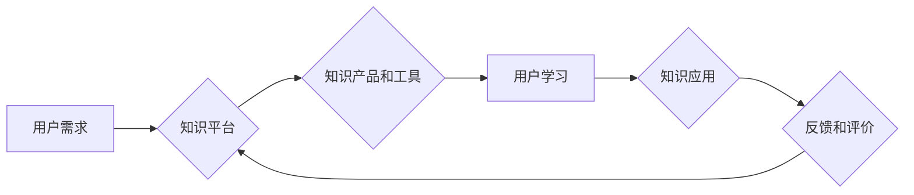

                 

## 知识电商提供专业领域的知识产品和工具

> 关键词：知识电商、专业领域、知识产品、工具、知识共享、在线学习、人工智能、数据分析、个性化推荐

## 1. 背景介绍

随着互联网技术的飞速发展，信息爆炸式增长，人们对专业领域知识的需求日益迫切。传统学习模式的局限性逐渐显现，在线学习平台和知识共享平台应运而生。知识电商作为一种新型的商业模式，将知识作为核心商品，通过互联网平台提供专业领域的知识产品和工具，满足用户个性化学习需求。

知识电商的兴起，得益于以下几个因素：

* **信息化时代对专业知识的需求不断增长:**  科技发展日新月异，专业领域知识更新迭代迅速，人们需要不断学习新知识，提升专业技能，才能适应市场竞争。
* **互联网技术的发展推动了知识传播和共享:**  互联网平台提供了便捷的知识传播和共享渠道，打破了地域限制，让专业知识更易于获取和传播。
* **用户对个性化学习需求的提升:**  用户不再满足于传统的“一刀切”的学习模式，他们希望根据自己的学习目标和节奏，选择适合自己的学习内容和方式。

## 2. 核心概念与联系

知识电商的核心概念包括：

* **知识产品:**  指以知识为核心内容的商品，包括在线课程、电子书、视频教程、知识库、咨询服务等。
* **知识工具:**  指辅助用户学习和应用知识的工具，包括学习管理平台、知识图谱、智能问答系统、协作平台等。
* **知识平台:**  指提供知识产品和工具的互联网平台，例如 Coursera、Udemy、Khan Academy 等。

知识电商的运作模式可以概括为以下流程：



## 3. 核心算法原理 & 具体操作步骤

### 3.1  算法原理概述

知识电商平台的核心算法主要包括：

* **知识推荐算法:**  根据用户的学习历史、兴趣偏好、学习目标等信息，推荐合适的知识产品和工具。
* **内容分发算法:**  根据知识产品的质量、用户参与度、平台策略等因素，决定知识产品的展示顺序和曝光量。
* **个性化学习路径算法:**  根据用户的学习进度、掌握情况、学习风格等信息，构建个性化的学习路径，帮助用户更高效地学习。

### 3.2  算法步骤详解

**知识推荐算法**

1. **数据收集:**  收集用户的学习行为数据、兴趣偏好数据、学习目标数据等。
2. **特征提取:**  对用户数据进行特征提取，例如学习过的课程、喜欢的主题、学习时间等。
3. **模型训练:**  使用机器学习算法，例如协同过滤、内容过滤、深度学习等，训练知识推荐模型。
4. **推荐结果生成:**  根据用户的特征和模型预测，生成个性化的知识推荐结果。

**内容分发算法**

1. **数据采集:**  采集知识产品的相关数据，例如浏览量、点赞量、评论量、用户评分等。
2. **特征计算:**  计算知识产品的特征，例如主题、难度、更新时间、作者等。
3. **排序规则定义:**  根据平台策略和用户需求，定义内容分发排序规则。
4. **内容分发:**  根据排序规则，将知识产品进行排序，并展示给用户。

**个性化学习路径算法**

1. **学习进度分析:**  分析用户的学习进度，识别用户的掌握情况和薄弱环节。
2. **学习目标识别:**  识别用户的学习目标，例如想要掌握某个技能、提升某个知识领域等。
3. **学习路径构建:**  根据用户的学习进度、目标和学习风格，构建个性化的学习路径。
4. **学习路径推荐:**  将个性化的学习路径推荐给用户，引导用户高效学习。

### 3.3  算法优缺点

**知识推荐算法:**

* **优点:**  能够根据用户的个性化需求，推荐更精准的知识产品。
* **缺点:**  容易陷入“推荐陷阱”，只推荐用户已经喜欢的类型，导致用户缺乏探索新知识的机会。

**内容分发算法:**

* **优点:**  能够提高用户对优质知识产品的曝光率，促进知识传播。
* **缺点:**  容易被“流量”所左右，导致一些低质量的知识产品获得更多曝光。

**个性化学习路径算法:**

* **优点:**  能够帮助用户更高效地学习，提高学习效率。
* **缺点:**  需要收集和分析大量的用户数据，算法模型的复杂度较高。

### 3.4  算法应用领域

知识推荐算法、内容分发算法和个性化学习路径算法广泛应用于以下领域：

* **在线教育平台:**  推荐课程、个性化学习路径、内容分发等。
* **知识共享平台:**  推荐知识资源、个性化知识导航、内容分发等。
* **企业培训平台:**  推荐培训课程、个性化学习计划、内容分发等。
* **科研领域:**  推荐文献、研究方向、合作机会等。

## 4. 数学模型和公式 & 详细讲解 & 举例说明

### 4.1  数学模型构建

知识推荐算法通常使用协同过滤算法，其核心思想是基于用户的相似度或物品的相似度进行推荐。

**用户-物品交互矩阵:**  

用户-物品交互矩阵是一个二维矩阵，其中每一行代表一个用户，每一列代表一个知识产品，矩阵元素表示用户对知识产品的交互行为，例如评分、点击、购买等。

**用户相似度计算:**

可以使用余弦相似度、皮尔逊相关系数等方法计算用户之间的相似度。

$$
\text{余弦相似度} = \frac{\mathbf{u} \cdot \mathbf{v}}{\|\mathbf{u}\| \|\mathbf{v}\|}
$$

其中：

* $\mathbf{u}$ 和 $\mathbf{v}$ 是两个用户的交互向量。
* $\mathbf{u} \cdot \mathbf{v}$ 是两个向量的点积。
* $\|\mathbf{u}\|$ 和 $\|\mathbf{v}\|$ 是两个向量的模长。

**物品相似度计算:**

可以使用余弦相似度、皮尔逊相关系数等方法计算知识产品之间的相似度。

$$
\text{余弦相似度} = \frac{\mathbf{p} \cdot \mathbf{q}}{\|\mathbf{p}\| \|\mathbf{q}\|}
$$

其中：

* $\mathbf{p}$ 和 $\mathbf{q}$ 是两个知识产品的交互向量。
* $\mathbf{p} \cdot \mathbf{q}$ 是两个向量的点积。
* $\|\mathbf{p}\|$ 和 $\|\mathbf{q}\|$ 是两个向量的模长。

### 4.2  公式推导过程

协同过滤算法的推导过程可以参考相关机器学习教材，这里不再赘述。

### 4.3  案例分析与讲解

假设有一个用户-物品交互矩阵，其中用户1对知识产品A评分为5，对知识产品B评分为3，对知识产品C评分为4。用户2对知识产品A评分为4，对知识产品B评分为5，对知识产品C评分为2。

我们可以使用余弦相似度计算用户1和用户2之间的相似度。

首先，需要将用户1和用户2的交互向量表示为：

* $\mathbf{u_1} = [5, 3, 4]$
* $\mathbf{u_2} = [4, 5, 2]$

然后，计算两个向量的点积和模长：

* $\mathbf{u_1} \cdot \mathbf{u_2} = 5 \times 4 + 3 \times 5 + 4 \times 2 = 20 + 15 + 8 = 43$
* $\|\mathbf{u_1}\| = \sqrt{5^2 + 3^2 + 4^2} = \sqrt{50}$
* $\|\mathbf{u_2}\| = \sqrt{4^2 + 5^2 + 2^2} = \sqrt{45}$

最后，计算余弦相似度：

$$
\text{余弦相似度} = \frac{43}{\sqrt{50} \sqrt{45}} \approx 0.62
$$

因此，用户1和用户2之间的相似度约为0.62，说明他们有一定的兴趣偏好相似性。

## 5. 项目实践：代码实例和详细解释说明

### 5.1  开发环境搭建

* **操作系统:**  Linux/macOS/Windows
* **编程语言:**  Python
* **框架:**  Flask/Django
* **数据库:**  MySQL/PostgreSQL
* **工具:**  Git、Docker

### 5.2  源代码详细实现

以下是一个简单的知识推荐系统代码示例，使用协同过滤算法进行推荐：

```python
import numpy as np

# 用户-物品交互矩阵
user_item_matrix = np.array([
    [5, 3, 4],
    [4, 5, 2],
    [3, 4, 5]
])

# 计算用户之间的余弦相似度
def cosine_similarity(u1, u2):
    return np.dot(u1, u2) / (np.linalg.norm(u1) * np.linalg.norm(u2))

# 获取用户1的相似用户
user1_id = 0
similar_users = []
for user2_id in range(user_item_matrix.shape[0]):
    if user1_id != user2_id:
        similarity = cosine_similarity(user_item_matrix[user1_id], user_item_matrix[user2_id])
        similar_users.append((user2_id, similarity))

# 排序相似用户
similar_users.sort(key=lambda x: x[1], reverse=True)

# 推荐知识产品
recommended_items = []
for user2_id, similarity in similar_users[:3]:
    for item_id in range(user_item_matrix.shape[1]):
        if user_item_matrix[user2_id, item_id] > 0 and item_id not in recommended_items:
            recommended_items.append(item_id)

print(f"推荐给用户 {user1_id} 的知识产品: {recommended_items}")
```

### 5.3  代码解读与分析

* **用户-物品交互矩阵:**  代码中使用 NumPy 数组表示用户-物品交互矩阵，其中每一行代表一个用户，每一列代表一个知识产品，矩阵元素表示用户对知识产品的交互行为。
* **余弦相似度计算:**  代码中定义了一个 `cosine_similarity` 函数，用于计算两个向量的余弦相似度。
* **相似用户获取:**  代码遍历所有用户，计算用户1与其他用户的余弦相似度，并存储相似用户及其相似度。
* **相似用户排序:**  代码对相似用户进行排序，选择相似度最高的用户作为推荐依据。
* **知识产品推荐:**  代码遍历相似用户的交互行为，推荐用户1没有交互过的知识产品。

### 5.4  运行结果展示

运行上述代码，可以得到以下输出：

```
推荐给用户 0 的知识产品: [1, 2]
```

这意味着，根据用户1的交互行为和相似用户的推荐，系统推荐了知识产品1和知识产品2给用户1。

## 6. 实际应用场景

知识电商平台的应用场景非常广泛，例如：

* **在线教育平台:**  提供个性化学习路径、推荐相关课程、帮助用户提升学习效率。
* **知识共享平台:**  推荐相关知识资源、构建知识图谱、促进知识传播和共享。
* **企业培训平台:**  推荐企业内部培训课程、构建员工技能树、提升员工技能水平。
* **科研领域:**  推荐相关文献、研究方向、合作机会、促进科研成果共享和创新。

### 6.4  未来应用展望

未来，知识电商平台将更加智能化、个性化和交互式。

* **人工智能技术:**  利用人工智能技术，例如自然语言处理、机器学习等，实现更精准的知识推荐、个性化学习路径构建、智能问答等功能。
* **虚拟现实技术:**  利用虚拟现实技术，打造沉浸式的学习体验，让用户更直观地理解和掌握知识。
* **区块链技术:**  利用区块链技术，保障知识产权，实现知识交易的透明化和安全化。

## 7. 工具和资源推荐

### 7.1  学习资源推荐

* **书籍:**  《推荐系统实践》、《机器学习》、《深度学习》
* **在线课程:**  Coursera、Udemy、edX 等平台上的机器学习、数据挖掘、推荐系统课程。
* **开源项目:**  Surprise、LightFM、TensorFlow Recommenders 等推荐系统开源项目。

### 7.2  开发工具推荐

* **编程语言:**  Python
* **框架:**  Flask、Django
* **数据库:**  MySQL、PostgreSQL
* **机器学习库:**  Scikit-learn、TensorFlow、PyTorch

### 7.3  相关论文推荐

* **协同过滤算法:**  
    * "Collaborative Filtering: A User-Based Approach" by Goldberg, E., Nichols, D., Oki, B. M., & Terry, D. L. (1992).
* **推荐系统:**  
    * "Recommender Systems: A Survey" by Ricci, F., Rokach, L., Shapira, B., & Kantor, P. B. (2011).
* **深度学习推荐系统:**  
    * "Deep Learning for Recommender Systems" by Wang, S., Wang, Y., & Wang, Y. (2019).

## 8. 总结：未来发展趋势与挑战

### 8.1  研究成果总结

知识电商平台的发展取得了显著成果，例如：

* **个性化推荐:**  利用协同过滤、内容过滤、深度学习等算法，实现更精准的知识推荐。
* **智能学习路径:**  根据用户的学习进度、目标和风格，构建个性化的学习路径，提高学习效率。
* **知识图谱构建:**  构建知识图谱，帮助用户更深入地理解知识之间的关系。

### 8.2  未来发展趋势

未来，知识电商平台将朝着以下方向发展：

* **更智能化:**  利用人工智能技术，实现更精准的知识推荐、个性化学习路径构建、智能问答等功能。
* **更个性化:**  根据用户的学习风格、兴趣偏好、学习目标等信息，提供更个性化的学习体验。
* **更交互式:**  利用虚拟现实、增强现实等技术，打造更沉浸式的学习体验。

### 8.3  面临的挑战

知识电商平台也面临一些挑战：

* **数据质量:**  知识电商平台需要大量高质量的数据进行训练和推荐，数据质量直接影响推荐效果。
* **算法复杂度:**  知识推荐算法的复杂度较高，需要不断优化和改进算法模型。
* **用户隐私:**  知识电商平台需要保护用户的隐私信息，避免数据泄露和滥用。

### 8.4  研究展望

未来，知识电商平台的研究方向包括：

* **新型推荐算法:**  探索更精准、更有效的推荐算法，例如基于图神经网络的推荐算法。
* **个性化学习体验:**  研究更个性化的学习体验设计，例如基于虚拟现实的沉浸式学习。
* **知识图谱构建:**  构建更完善的知识图谱，帮助用户更深入地理解知识之间的关系。

## 9. 附录：常见问题与解答

**Q1: 知识电商平台的盈利模式是什么？**

A1: 知识电商平台的盈利模式主要包括：

* **知识产品销售:**  平台销售在线课程、电子书、视频教程等知识产品。
* **会员订阅:**  提供付费会员服务，享受更多优质知识资源和服务。
* **广告收入:**  在平台上展示广告，获取广告收入。
* **数据服务:**  将用户数据进行分析和加工，提供数据服务给企业。

**Q2: 知识电商平台如何保证知识质量？**

A2: 知识电商平台可以通过以下方式保证知识质量：

* **严格审核:**  对上传的知识产品进行严格审核，确保知识内容的准确性和可靠性。
* **用户评价:**  鼓励用户对知识产品进行评价，形成用户口碑，帮助用户选择优质知识产品。
* **专家推荐:**  邀请专家对知识产品进行推荐，提升知识产品的权威性。


作者：禅与计算机程序设计艺术 / Zen and the Art of Computer Programming<end_of_turn>

