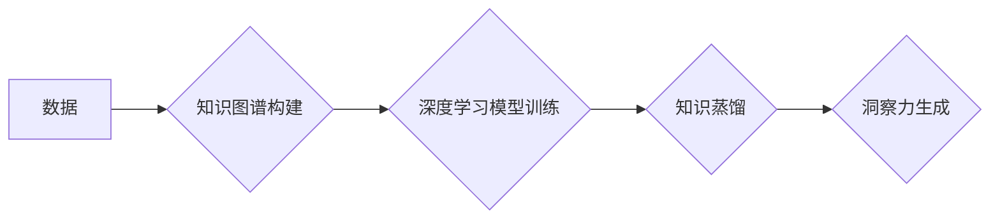

                 

## 知识的应用价值：洞察力的独特视角

> 关键词：知识图谱、知识蒸馏、深度学习、洞察力、应用价值、数据驱动

### 1. 背景介绍

在当今数据爆炸的时代，海量数据已成为企业和研究机构的宝贵资源。然而，仅仅拥有数据并不能带来价值，真正重要的是如何从数据中提取有意义的知识，并将其转化为洞察力，从而驱动决策和创新。知识图谱、知识蒸馏和深度学习等技术为我们提供了强大的工具，帮助我们实现这一目标。

知识图谱是一种结构化的知识表示形式，它将实体和关系以图的形式表示，能够捕捉知识之间的复杂关联。知识蒸馏是一种知识迁移技术，它通过将知识从大型模型迁移到小型模型，从而提高小型模型的性能和效率。深度学习是一种强大的机器学习方法，能够从数据中学习复杂的模式和特征。

将这些技术结合起来，我们可以构建一个强大的知识发现和洞察力生成系统，从海量数据中提取有价值的知识，并将其转化为可操作的洞察力。

### 2. 核心概念与联系

**2.1 知识图谱**

知识图谱是一种基于图结构的知识表示形式，它将世界中的实体和关系以节点和边的方式表示。

* **实体 (Entity):** 代表现实世界中的事物，例如人、地点、事件等。
* **关系 (Relation):** 描述实体之间的连接，例如“出生于”、“位于”、“参与”等。

知识图谱能够捕捉知识之间的复杂关联，并支持多种推理和查询操作，例如：

* **基于关系的查询:** 查询与特定实体或关系相关的其他实体。
* **路径查询:** 查询实体之间的多跳关系。
* **推理:** 根据已有的知识推断出新的知识。

**2.2 知识蒸馏**

知识蒸馏是一种知识迁移技术，它通过将知识从大型模型迁移到小型模型，从而提高小型模型的性能和效率。

* **教师模型 (Teacher Model):** 通常是一个大型、训练良好的模型，拥有丰富的知识和表达能力。
* **学生模型 (Student Model):** 通常是一个小型、轻量级的模型，需要学习教师模型的知识。

知识蒸馏的过程通常包括以下步骤：

1. 使用教师模型对数据进行预测。
2. 将教师模型的预测结果作为学生模型的监督信号。
3. 使用学生模型学习教师模型的知识。

**2.3 深度学习**

深度学习是一种强大的机器学习方法，它能够从数据中学习复杂的模式和特征。

* **神经网络 (Neural Network):** 深度学习的核心是神经网络，它由多个层组成，每层都包含多个神经元。
* **卷积神经网络 (CNN):** 用于处理图像数据，能够学习图像的局部特征。
* **循环神经网络 (RNN):** 用于处理序列数据，例如文本和语音，能够学习序列中的依赖关系。

**2.4 核心概念联系**

知识图谱、知识蒸馏和深度学习可以相互结合，形成一个强大的知识发现和洞察力生成系统。

* **知识图谱可以提供结构化的知识表示，为深度学习模型提供有意义的语义信息。**
* **深度学习模型可以从海量数据中学习复杂的知识模式，并将其转化为知识图谱中的实体和关系。**
* **知识蒸馏可以将深度学习模型的知识迁移到小型模型，提高小型模型的性能和效率，并使其能够在资源受限的设备上运行。**

**Mermaid 流程图**



### 3. 核心算法原理 & 具体操作步骤

**3.1 算法原理概述**

知识蒸馏算法的核心思想是将知识从一个大型模型（教师模型）迁移到一个小型模型（学生模型）。教师模型通常是一个训练良好的深度学习模型，拥有丰富的知识和表达能力。学生模型通常是一个小型、轻量级的模型，需要学习教师模型的知识。

知识蒸馏通过调整学生模型的训练目标，使其学习教师模型的知识表示。具体来说，知识蒸馏算法会将教师模型的预测结果作为学生模型的监督信号，并通过一个温度参数来控制学生模型对教师模型预测的依赖程度。

**3.2 算法步骤详解**

1. **准备数据:** 首先需要准备一个用于训练教师模型和学生模型的数据集。
2. **训练教师模型:** 使用教师模型对数据集进行训练，使其获得良好的性能。
3. **构建学生模型:** 构建一个小型、轻量级的学生模型，其结构可以与教师模型相似，也可以有所不同。
4. **知识蒸馏训练:** 使用教师模型的预测结果作为学生模型的监督信号，并通过一个温度参数来控制学生模型对教师模型预测的依赖程度。
5. **评估学生模型:** 评估学生模型的性能，并根据需要调整模型结构和训练参数。

**3.3 算法优缺点**

**优点:**

* **提高模型性能:** 知识蒸馏可以提高学生模型的性能，使其接近教师模型的性能。
* **降低模型复杂度:** 学生模型通常比教师模型更小，更轻量级，可以降低计算成本和内存消耗。
* **提高模型泛化能力:** 知识蒸馏可以帮助学生模型学习到教师模型的知识表示，从而提高其泛化能力。

**缺点:**

* **需要一个训练好的教师模型:** 知识蒸馏需要一个训练好的教师模型作为知识来源，如果没有现成的教师模型，需要额外进行训练。
* **温度参数的选择:** 温度参数的选择对知识蒸馏效果有重要影响，需要进行调优。
* **知识迁移的局限性:** 知识蒸馏只能迁移教师模型的知识表示，不能迁移教师模型的训练数据和训练过程。

**3.4 算法应用领域**

知识蒸馏算法在许多领域都有应用，例如：

* **计算机视觉:** 将大型图像分类模型的知识迁移到小型模型，用于移动设备上的图像识别。
* **自然语言处理:** 将大型语言模型的知识迁移到小型模型，用于文本分类、机器翻译等任务。
* **语音识别:** 将大型语音识别模型的知识迁移到小型模型，用于语音助手和语音搜索。

### 4. 数学模型和公式 & 详细讲解 & 举例说明

**4.1 数学模型构建**

知识蒸馏算法的核心是将教师模型的知识表示迁移到学生模型。我们可以用以下数学模型来表示知识蒸馏的目标函数：

$$
L_{KD} = \sum_{i=1}^{N} \mathcal{L}_{KL}(P_t(y_i|x_i), P_s(y_i|x_i))
$$

其中：

* $L_{KD}$ 是知识蒸馏损失函数。
* $N$ 是训练样本的数量。
* $P_t(y_i|x_i)$ 是教师模型对样本 $x_i$ 预测的概率分布。
* $P_s(y_i|x_i)$ 是学生模型对样本 $x_i$ 预测的概率分布。
* $\mathcal{L}_{KL}$ 是KL散度。

**4.2 公式推导过程**

知识蒸馏损失函数的目标是使学生模型的预测概率分布尽可能接近教师模型的预测概率分布。KL散度是一种度量两个概率分布差异的指标，其值越小，表示两个概率分布越接近。

**4.3 案例分析与讲解**

假设我们有一个图像分类任务，我们训练了一个大型的教师模型，并希望将其知识迁移到一个小型学生模型。

* 教师模型对图像 $x_i$ 预测的概率分布为 $P_t(y_i|x_i)$。
* 学生模型对图像 $x_i$ 预测的概率分布为 $P_s(y_i|x_i)$。

我们可以使用知识蒸馏损失函数来训练学生模型，使其学习到教师模型的知识表示。

**举例说明:**

假设教师模型预测图像 $x_i$ 属于类别 $y_i$ 的概率为 0.8，而学生模型预测图像 $x_i$ 属于类别 $y_i$ 的概率为 0.6。

使用知识蒸馏损失函数可以将这两个概率分布之间的差异最小化，从而使学生模型的预测结果更接近教师模型的预测结果。

### 5. 项目实践：代码实例和详细解释说明

**5.1 开发环境搭建**

* Python 3.7+
* TensorFlow 2.0+
* PyTorch 1.0+
* CUDA 10.0+ (可选)

**5.2 源代码详细实现**

```python
import tensorflow as tf

# 定义教师模型和学生模型
teacher_model = tf.keras.models.Sequential([
    # ... 教师模型的层结构 ...
])

student_model = tf.keras.models.Sequential([
    # ... 学生模型的层结构 ...
])

# 定义知识蒸馏损失函数
def knowledge_distillation_loss(y_true, y_pred_teacher, y_pred_student):
    return tf.keras.losses.KLDivergence()(y_pred_teacher, y_pred_student)

# 训练学生模型
student_model.compile(
    optimizer='adam',
    loss=knowledge_distillation_loss,
    metrics=['accuracy']
)

student_model.fit(
    x_train,
    y_train,
    epochs=10,
    validation_data=(x_val, y_val)
)
```

**5.3 代码解读与分析**

* 代码首先定义了教师模型和学生模型。
* 然后定义了知识蒸馏损失函数，该函数使用KL散度来度量教师模型和学生模型的预测概率分布之间的差异。
* 最后使用知识蒸馏损失函数训练学生模型。

**5.4 运行结果展示**

训练完成后，可以评估学生模型的性能，例如准确率、召回率等。

### 6. 实际应用场景

知识蒸馏算法在许多实际应用场景中都有应用，例如：

* **移动设备上的图像识别:** 将大型图像分类模型的知识迁移到小型模型，用于移动设备上的图像识别。
* **语音助手和语音搜索:** 将大型语音识别模型的知识迁移到小型模型，用于语音助手和语音搜索。
* **个性化推荐系统:** 将大型推荐模型的知识迁移到小型模型，用于个性化推荐系统。

**6.4 未来应用展望**

随着深度学习技术的不断发展，知识蒸馏算法的应用场景将会更加广泛。

* **边缘计算:** 将知识蒸馏算法应用于边缘计算，可以将大型模型部署在资源受限的边缘设备上，从而实现更快速的推理和更低的延迟。
* **联邦学习:** 将知识蒸馏算法应用于联邦学习，可以将多个设备上的模型知识进行融合，从而提高模型的性能和鲁棒性。
* **跨模态学习:** 将知识蒸馏算法应用于跨模态学习，可以将不同模态的数据进行融合，从而提高模型的泛化能力和表达能力。

### 7. 工具和资源推荐

**7.1 学习资源推荐**

* **论文:**
    * Hinton, G., Vinyals, O., & Dean, J. (2015). Distilling the knowledge in a neural network. arXiv preprint arXiv:1503.02531.
* **博客:**
    * https://blog.openai.com/better-language-models/
    * https://towardsdatascience.com/knowledge-distillation-a-powerful-technique-for-deep-learning-model-compression-a3916199977a

**7.2 开发工具推荐**

* **TensorFlow:** https://www.tensorflow.org/
* **PyTorch:** https://pytorch.org/

**7.3 相关论文推荐**

* **知识蒸馏:**
    * Hinton, G., Vinyals, O., & Dean, J. (2015). Distilling the knowledge in a neural network. arXiv preprint arXiv:1503.02531.
* **深度学习:**
    * LeCun, Y., Bengio, Y., & Hinton, G. (2015). Deep learning. Nature, 521(7553), 436-444.

### 8. 总结：未来发展趋势与挑战

**8.1 研究成果总结**

知识蒸馏算法取得了显著的成果，能够有效地将大型模型的知识迁移到小型模型，提高模型的性能和效率。

**8.2 未来发展趋势**

* **更有效的知识蒸馏方法:** 研究更有效的知识蒸馏方法，例如基于强化学习的知识蒸馏、基于对抗训练的知识蒸馏等。
* **跨模态知识蒸馏:** 研究跨模态知识蒸馏方法，将不同模态的数据进行融合，提高模型的泛化能力和表达能力。
* **联邦学习下的知识蒸馏:** 研究联邦学习下的知识蒸馏方法，可以将多个设备上的模型知识进行融合，从而提高模型的性能和鲁棒性。

**8.3 面临的挑战**

* **知识迁移的局限性:** 知识蒸馏只能迁移教师模型的知识表示，不能迁移教师模型的训练数据和训练过程。
* **温度参数的选择:** 温度参数的选择对知识蒸馏效果有重要影响，需要进行调优。
* **模型结构的差异:** 教师模型和学生模型的结构差异可能会影响知识迁移的效率。

**8.4 研究展望**

未来，知识蒸馏算法将会在更多领域得到应用，并不断发展和完善。


### 9. 附录：常见问题与解答

**Q1: 知识蒸馏和迁移学习有什么区别？**

**A1:** 知识蒸馏是一种迁移学习的具体方法，它通过将知识从一个大型模型迁移到一个小型模型来实现迁移学习的目标。

**Q2: 知识蒸馏的温度参数有什么作用？**

**A2:** 温度参数控制学生模型对教师模型预测的依赖程度。温度参数越低，学生模型对教师模型预测的依赖越强，反之亦然。

**Q3: 知识蒸馏算法的适用场景有哪些？**

**A3:** 知识蒸馏算法适用于各种深度学习任务，例如图像分类、文本分类、语音识别等。

**作者：禅与计算机程序设计艺术**<end_of_turn>

