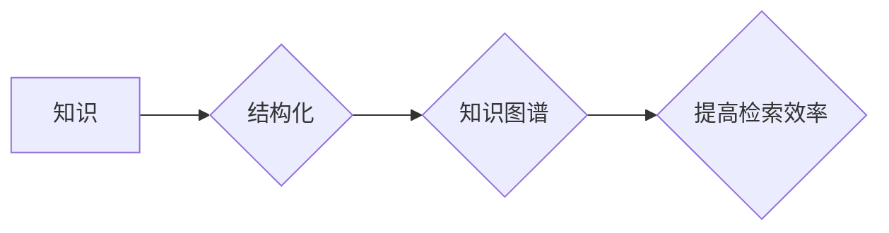

                 

## 知识的结构化：提高记忆和检索效率

> 关键词：知识图谱、结构化数据、知识表示、检索效率、机器学习

## 1. 背景介绍

在信息爆炸的时代，我们每天接触的海量信息令人眼花缭乱。如何有效地存储、组织和检索知识成为了一个至关重要的挑战。传统的文本存储方式难以满足对知识高效管理的需求，因为文本数据是无序的、分散的，难以进行深入的分析和推理。

知识结构化是指将知识以一种有组织、层次化的方式表示出来，使其更容易被理解、检索和利用。知识图谱作为一种重要的知识表示形式，通过节点和边来描述知识之间的关系，为知识的结构化提供了强大的工具。

## 2. 核心概念与联系

**2.1 知识图谱**

知识图谱是一种基于知识表示的数据库，它以节点和边来表示知识。节点代表实体，边代表实体之间的关系。例如，在知识图谱中，我们可以用节点表示“张三”和“李四”这两个实体，用边表示“张三认识李四”的关系。

**2.2 结构化数据**

结构化数据是指按照预定义的格式存储的数据，例如关系数据库中的数据。结构化数据具有明确的组织结构，方便进行查询和分析。

**2.3 知识表示**

知识表示是指将知识以一种形式化、可计算的方式表示出来。常用的知识表示方法包括：

* **本体论:** 定义实体和关系的类型以及它们之间的约束。
* **逻辑语言:** 使用逻辑符号来表达知识。
* **图形模型:** 使用节点和边来表示知识。

**2.4 检索效率**

检索效率是指在给定查询条件下，快速准确地找到所需信息的效率。结构化数据和知识图谱可以提高检索效率，因为它们提供了明确的组织结构和关系信息。

**Mermaid 流程图**



## 3. 核心算法原理 & 具体操作步骤

**3.1 算法原理概述**

知识结构化的核心算法主要包括：

* **实体识别:** 从文本中识别出实体，例如人名、地名、机构名等。
* **关系抽取:** 从文本中识别出实体之间的关系，例如“认识”、“工作于”等。
* **知识图谱构建:** 将识别出的实体和关系构建成知识图谱。

**3.2 算法步骤详解**

1. **预处理:** 对文本进行清洗、分词、词性标注等预处理操作。
2. **实体识别:** 使用命名实体识别模型识别出文本中的实体。
3. **关系抽取:** 使用关系抽取模型识别出实体之间的关系。
4. **知识图谱构建:** 将识别出的实体和关系构建成知识图谱。

**3.3 算法优缺点**

* **优点:** 能够有效地将知识结构化，提高检索效率。
* **缺点:** 算法复杂度高，需要大量的训练数据。

**3.4 算法应用领域**

* **搜索引擎:** 提高搜索结果的准确性和相关性。
* **问答系统:** 构建更智能的问答系统。
* **推荐系统:** 提供更精准的个性化推荐。
* **知识管理:** 建立企业内部知识库。

## 4. 数学模型和公式 & 详细讲解 & 举例说明

**4.1 数学模型构建**

知识图谱可以表示为一个三元组的集合：

```latex
G = (E, R, T)
```

其中：

* $E$ 是实体集合。
* $R$ 是关系集合。
* $T$ 是三元组集合，每个三元组表示一个事实，格式为 $(e_1, r, e_2)$，其中 $e_1$ 和 $e_2$ 是实体，$r$ 是关系。

**4.2 公式推导过程**

知识图谱推理可以使用逻辑规则进行推导。例如，如果我们知道“张三认识李四”和“李四认识王五”，我们可以推导出“张三认识王五”。

**4.3 案例分析与讲解**

假设我们有一个知识图谱，包含以下三元组：

* (张三, 工作于, 公司A)
* (李四, 工作于, 公司B)
* (公司A, 位于, 北京)

我们可以使用知识图谱推理得到以下结论：

* 张三和李四不在同一公司。
* 公司A位于北京。

## 5. 项目实践：代码实例和详细解释说明

**5.1 开发环境搭建**

* Python 3.x
* Neo4j 数据库

**5.2 源代码详细实现**

```python
# 导入必要的库
import neo4j

# 连接 Neo4j 数据库
driver = neo4j.GraphDatabase.driver("bolt://localhost:7687", auth=("neo4j", "password"))

# 创建一个会话
session = driver.session()

# 插入三元组
session.run("CREATE (张三:Person {name: '张三'})")
session.run("CREATE (公司A:Company {name: '公司A'})")
session.run("CREATE (张三)-[:工作于]->(公司A)")

# 查询知识图谱
result = session.run("MATCH (p:Person)-[:工作于]->(c:Company) RETURN p.name, c.name")

# 打印查询结果
for record in result:
    print(record['p.name'], record['c.name'])

# 关闭会话
session.close()
# 关闭驱动
driver.close()
```

**5.3 代码解读与分析**

* 代码首先导入 Neo4j 库，并连接到 Neo4j 数据库。
* 然后，代码创建了一个会话，用于执行数据库操作。
* 代码插入了三个三元组，分别表示张三、公司A 以及张三工作于公司A 的关系。
* 接着，代码执行了一个查询语句，查询所有 Person 节点通过工作于关系连接到 Company 节点的结果。
* 最后，代码打印查询结果，并关闭会话和驱动。

**5.4 运行结果展示**

```
张三 公司A
```

## 6. 实际应用场景

**6.1 搜索引擎**

知识图谱可以帮助搜索引擎更好地理解用户查询意图，并提供更准确、更相关的搜索结果。例如，如果用户搜索“苹果公司”，搜索引擎可以利用知识图谱中的信息，返回苹果公司的相关信息，例如公司简介、产品列表、新闻报道等。

**6.2 问答系统**

知识图谱可以为问答系统提供丰富的知识库，使问答系统能够回答更复杂、更深入的问题。例如，如果用户问“中国首都是哪里？”，问答系统可以利用知识图谱中的信息，准确地回答“北京”。

**6.3 推荐系统**

知识图谱可以帮助推荐系统更好地理解用户的兴趣和偏好，并提供更精准的个性化推荐。例如，如果用户购买了苹果手机，推荐系统可以利用知识图谱中的信息，推荐与苹果手机相关的配件、软件、服务等。

**6.4 未来应用展望**

随着人工智能技术的不断发展，知识结构化将发挥越来越重要的作用。未来，知识结构化将应用于更广泛的领域，例如：

* **医疗诊断:** 利用知识图谱辅助医生进行诊断，提高诊断准确率。
* **教育教学:** 利用知识图谱构建智能化教学系统，个性化教学内容。
* **法律服务:** 利用知识图谱辅助律师进行法律分析，提高法律服务效率。

## 7. 工具和资源推荐

**7.1 学习资源推荐**

* **书籍:**
    * 《知识图谱：构建、查询和应用》
    * 《知识表示与推理》
* **在线课程:**
    * Coursera: Knowledge Graphs
    * edX: Introduction to Knowledge Graphs

**7.2 开发工具推荐**

* **Neo4j:** 一款开源的图数据库。
* **RDF4J:** 一款开源的 RDF 数据处理框架。
* **Apache Jena:** 一款开源的知识表示和推理工具包。

**7.3 相关论文推荐**

* **《A Survey of Knowledge Graph Embedding Techniques》**
* **《Knowledge Graph Completion with TransE》**

## 8. 总结：未来发展趋势与挑战

**8.1 研究成果总结**

知识结构化技术取得了显著的进展，为知识管理、信息检索、人工智能等领域提供了强大的工具。

**8.2 未来发展趋势**

* **知识图谱规模化:** 构建更大规模、更丰富内容的知识图谱。
* **知识图谱动态化:** 建立动态更新的知识图谱，能够及时反映知识的变化。
* **知识图谱智能化:** 利用人工智能技术，使知识图谱能够进行更智能的推理和分析。

**8.3 面临的挑战**

* **数据质量:** 知识图谱的数据质量直接影响其应用效果，需要解决数据不完整、不一致等问题。
* **知识表示:** 如何更好地表示复杂、多层次的知识仍然是一个挑战。
* **推理能力:** 知识图谱的推理能力需要进一步提升，才能更好地支持复杂的任务。

**8.4 研究展望**

未来，知识结构化技术将继续发展，为我们提供更智能、更便捷的知识管理和信息检索服务。


## 9. 附录：常见问题与解答

**9.1 如何构建知识图谱？**

构建知识图谱需要以下步骤：

1. **数据收集:** 收集相关领域的文本数据、结构化数据等。
2. **数据预处理:** 对数据进行清洗、格式化、标注等预处理操作。
3. **实体识别:** 使用命名实体识别模型识别出文本中的实体。
4. **关系抽取:** 使用关系抽取模型识别出实体之间的关系。
5. **知识图谱构建:** 将识别出的实体和关系构建成知识图谱。

**9.2 如何查询知识图谱？**

可以使用图数据库的查询语言或其他专门的知识图谱查询工具来查询知识图谱。

**9.3 知识图谱有哪些应用场景？**

知识图谱的应用场景非常广泛，例如：搜索引擎、问答系统、推荐系统、医疗诊断、教育教学等。


作者：禅与计算机程序设计艺术 / Zen and the Art of Computer Programming 
<end_of_turn>

