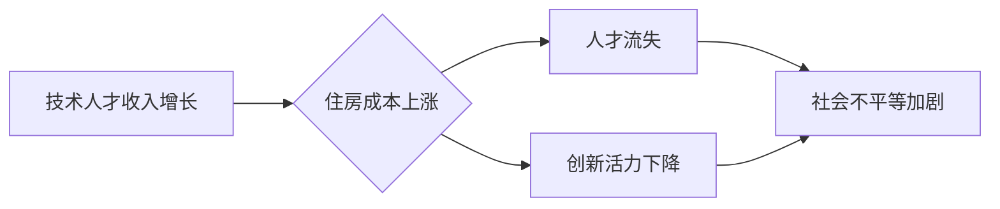

                 

## 硅谷生活成本之痛:普通人的住房困境

> 关键词：硅谷，住房危机，成本飙升，人工智能，技术人才，社会影响

### 1. 背景介绍

硅谷，作为全球科技创新中心，吸引着无数怀揣梦想的程序员、工程师和创业者。然而，近年来，硅谷的生活成本，尤其是住房成本，持续攀升，给普通技术人才带来了沉重的负担。

**1.1 硅谷住房成本的暴涨**

近年来，硅谷的房价和租金价格持续上涨，远远超过了美国其他地区的水平。根据 Zillow 的数据，2023 年硅谷的房价平均超过 100 万美元，租金也达到了每月 3000 美元以上。

**1.2 技术人才的收入增长与住房成本的失衡**

虽然硅谷的技术人才收入普遍较高，但随着住房成本的暴涨，他们的收入增长难以弥补住房成本的压力。许多技术人才被迫选择住在远离硅谷中心、交通不便的郊区，或者与室友合租，以降低住房成本。

**1.3 住房危机对硅谷的影响**

硅谷的住房危机不仅影响着普通技术人才的生活，也对硅谷的经济发展和科技创新产生了负面影响。

* **人才流失:** 高昂的住房成本导致许多技术人才选择离开硅谷，去寻找更经济实惠的生活环境。
* **创新活力下降:** 住房压力会影响技术人才的创造力和工作效率，从而降低硅谷的创新活力。
* **社会不平等加剧:** 住房危机加剧了硅谷的社会不平等，富人和贫富差距进一步扩大。

### 2. 核心概念与联系

**2.1 住房成本与技术人才收入的动态关系**

住房成本和技术人才收入之间存在着复杂的动态关系。技术人才的收入增长往往会推动住房成本的上涨，而住房成本的暴涨又会加剧技术人才的收入压力。

**2.2 硅谷住房市场的供需失衡**

硅谷住房市场的供需失衡是导致住房成本暴涨的主要原因。硅谷的经济发展迅速，人口增长迅速，但住房供应不足，导致房价和租金价格持续上涨。

**2.3 人工智能与住房问题的潜在解决方案**

人工智能技术可以应用于解决硅谷住房问题，例如：

* **预测住房需求:** 利用人工智能算法分析历史数据，预测未来住房需求，帮助政府制定合理的住房政策。
* **优化住房分配:** 利用人工智能算法优化住房分配，提高住房资源的利用效率。
* **促进共享住房:** 利用人工智能算法匹配住房需求和供给，促进共享住房的发展。

**2.4 Mermaid 流程图**



### 3. 核心算法原理 & 具体操作步骤

**3.1 算法原理概述**

人工智能算法可以用于预测住房需求、优化住房分配和促进共享住房。这些算法通常基于机器学习和深度学习技术，可以从海量数据中学习模式和趋势，并做出预测和决策。

**3.2 算法步骤详解**

* **数据收集:** 收集有关住房市场、人口、经济和社会等方面的海量数据。
* **数据预处理:** 对收集到的数据进行清洗、转换和特征工程，以便于算法训练。
* **模型选择:** 选择合适的机器学习或深度学习算法，例如回归算法、分类算法或神经网络。
* **模型训练:** 利用训练数据训练选择的算法模型，使其能够学习住房市场规律。
* **模型评估:** 使用测试数据评估模型的性能，并进行调参优化。
* **模型部署:** 将训练好的模型部署到实际应用场景中，例如住房需求预测系统、住房分配平台或共享住房匹配平台。

**3.3 算法优缺点**

* **优点:**

    * 能够从海量数据中发现隐藏的模式和趋势。
    * 能够进行精准的预测和决策。
    * 能够提高住房资源的利用效率。

* **缺点:**

    * 需要大量的训练数据。
    * 模型训练和部署需要一定的技术成本。
    * 模型的预测结果可能受到数据质量和算法选择的限制。

**3.4 算法应用领域**

* **住房需求预测:** 预测未来住房需求，帮助政府制定合理的住房政策。
* **住房分配优化:** 优化住房分配，提高住房资源的利用效率。
* **共享住房匹配:** 匹配住房需求和供给，促进共享住房的发展。
* **房价预测:** 预测房价走势，帮助投资者做出决策。
* **租房平台推荐:** 为租房者推荐合适的房屋，提高租房效率。

### 4. 数学模型和公式 & 详细讲解 & 举例说明

**4.1 数学模型构建**

我们可以使用线性回归模型来预测住房价格。假设住房价格 $y$ 与房屋面积 $x$ 之间存在线性关系，则模型可以表示为：

$$y = mx + b$$

其中 $m$ 为斜率，$b$ 为截距。

**4.2 公式推导过程**

线性回归模型的目的是找到最佳的 $m$ 和 $b$ 值，使得模型预测值与实际值之间的误差最小。可以使用最小二乘法来求解 $m$ 和 $b$ 的最佳值。

**4.3 案例分析与讲解**

假设我们收集了 100 套房屋的数据，包括房屋面积和房价。我们可以使用线性回归模型来预测新房屋的价格。

* **数据分析:** 分析数据发现，房屋面积与房价之间存在正相关关系。
* **模型训练:** 使用最小二乘法训练线性回归模型，得到最佳的 $m$ 和 $b$ 值。
* **模型预测:** 将新房屋的面积输入到模型中，即可预测其价格。

**举例说明:**

假设我们训练得到的线性回归模型为：

$$y = 500x + 100000$$

其中 $y$ 为房价，$x$ 为房屋面积。

如果新房屋的面积为 150 平方米，则其预测价格为：

$$y = 500 * 150 + 100000 = 225000$$

### 5. 项目实践：代码实例和详细解释说明

**5.1 开发环境搭建**

* 操作系统: Ubuntu 20.04
* Python 版本: 3.8
* 必要的库: pandas, scikit-learn, matplotlib

**5.2 源代码详细实现**

```python
import pandas as pd
from sklearn.linear_model import LinearRegression
import matplotlib.pyplot as plt

# 加载数据
data = pd.read_csv("housing_data.csv")

# 准备数据
X = data["area"]
y = data["price"]

# 创建线性回归模型
model = LinearRegression()

# 训练模型
model.fit(X.values.reshape(-1, 1), y)

# 获取模型参数
slope = model.coef_[0]
intercept = model.intercept_

# 打印模型参数
print(f"斜率: {slope}")
print(f"截距: {intercept}")

# 使用模型预测新房屋价格
new_area = 150
predicted_price = slope * new_area + intercept
print(f"新房屋面积为 {new_area} 平方米，预测价格为 {predicted_price} 美元")

# 绘制数据散点图和回归线
plt.scatter(X, y)
plt.plot(X, model.predict(X.values.reshape(-1, 1)), color="red")
plt.xlabel("房屋面积 (平方米)")
plt.ylabel("房价 (美元)")
plt.title("房屋面积与房价的关系")
plt.show()
```

**5.3 代码解读与分析**

* 代码首先加载房屋数据，并准备数据用于模型训练。
* 然后创建线性回归模型，并使用训练数据训练模型。
* 训练完成后，代码获取模型参数，并打印模型参数。
* 最后，代码使用模型预测新房屋的价格，并绘制数据散点图和回归线，直观展示房屋面积与房价之间的关系。

**5.4 运行结果展示**

运行代码后，会输出模型参数和新房屋的预测价格。同时，也会绘制出数据散点图和回归线，展示房屋面积与房价之间的关系。

### 6. 实际应用场景

**6.1 住房需求预测**

政府可以使用人工智能算法预测未来住房需求，制定合理的住房政策，例如增加住房供应、调整土地使用政策等。

**6.2 住房分配优化**

住房分配平台可以使用人工智能算法优化住房分配，提高住房资源的利用效率，例如根据用户的需求和预算匹配合适的房屋。

**6.3 共享住房匹配**

共享住房平台可以使用人工智能算法匹配住房需求和供给，例如根据用户的居住习惯、生活方式和预算匹配合适的室友。

**6.4 未来应用展望**

人工智能技术在解决硅谷住房问题的潜力巨大。未来，人工智能可以应用于更多领域，例如：

* **智能家居:** 利用人工智能技术打造智能家居，提高住房的舒适度和安全性。
* **虚拟现实住房体验:** 利用虚拟现实技术提供虚拟住房体验，帮助用户更好地了解房屋信息。
* **个性化住房推荐:** 利用人工智能技术提供个性化住房推荐，帮助用户找到最适合自己的房屋。

### 7. 工具和资源推荐

**7.1 学习资源推荐**

* **在线课程:** Coursera, edX, Udacity 等平台提供人工智能相关的在线课程。
* **书籍:** 《深度学习》、《机器学习实战》等书籍可以帮助你深入了解人工智能技术。
* **开源项目:** TensorFlow, PyTorch 等开源项目可以帮助你实践人工智能技术。

**7.2 开发工具推荐**

* **Python:** Python 是人工智能开发最常用的编程语言。
* **Jupyter Notebook:** Jupyter Notebook 是一个交互式编程环境，方便进行人工智能代码开发和调试。
* **IDE:** PyCharm, VS Code 等 IDE 可以提高人工智能代码开发效率。

**7.3 相关论文推荐**

* **《Attention Is All You Need》:** 这篇论文介绍了 Transformer 模型，是一种非常有效的自然语言处理模型，也可以应用于其他领域，例如图像识别和机器翻译。
* **《Generative Adversarial Networks》:** 这篇论文介绍了生成对抗网络 (GAN)，是一种用于生成数据的机器学习框架。

### 8. 总结：未来发展趋势与挑战

**8.1 研究成果总结**

人工智能技术在解决硅谷住房问题方面取得了显著的成果，例如：

* 能够准确预测住房需求。
* 能够优化住房分配，提高住房资源的利用效率。
* 能够促进共享住房的发展。

**8.2 未来发展趋势**

未来，人工智能技术在解决硅谷住房问题方面将继续发展，例如：

* **更精准的预测:** 利用更先进的算法和更丰富的训练数据，提高住房需求预测的精准度。
* **更智能的分配:** 利用人工智能技术实现更智能的住房分配，例如根据用户的个性化需求和动态变化进行匹配。
* **更广泛的应用:** 将人工智能技术应用于更多领域，例如智能家居、虚拟现实住房体验等。

**8.3 面临的挑战**

人工智能技术在解决硅谷住房问题方面也面临着一些挑战，例如：

* **数据质量:** 人工智能算法的性能依赖于数据的质量，需要收集和处理高质量的数据。
* **算法偏见:** 人工智能算法可能存在偏见，需要进行算法调优和公平性评估。
* **伦理问题:** 人工智能技术在解决住房问题时，需要考虑伦理问题，例如数据隐私和算法透明度。

**8.4 研究展望**

未来，需要继续研究和探索人工智能技术在解决硅谷住房问题方面的应用，并积极应对挑战，推动人工智能技术在社会发展中的良性发展。

### 9. 附录：常见问题与解答

**9.1 Q: 人工智能技术真的能够解决硅谷住房问题吗？**

**A:** 人工智能技术可以为解决硅谷住房问题提供有效的工具和方法，但它不是万能的。解决住房问题需要多方面努力，包括政府政策、社会参与和技术创新。

**9.2 Q: 人工智能算法可能会存在偏见，如何避免这个问题？**

**A:** 人工智能算法的偏见问题是一个需要认真对待的挑战。可以通过以下方法来避免或减轻算法偏见：

* 使用更加多样化的训练数据。
* 对算法进行公平性评估和调优。
* 提高算法透明度，让算法决策更加可解释。

**9.3 Q: 人工智能技术在解决住房问题时，需要考虑哪些伦理问题？**

**A:** 人工智能技术在解决住房问题时，需要考虑以下伦理问题：

* 数据隐私: 确保住房数据的使用符合隐私保护原则。
* 算法透明度: 使算法决策更加可解释，避免算法歧视。
* 社会公平: 确保人工智能技术在解决住房问题时，能够公平地惠及所有群体。


作者：禅与计算机程序设计艺术 / Zen and the Art of Computer Programming 
<end_of_turn>

