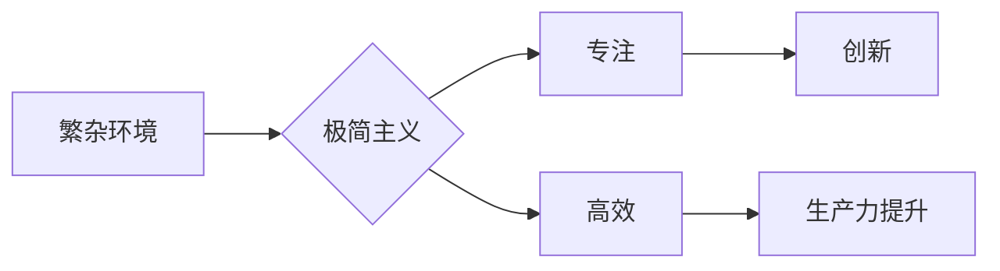

                 

## 硅谷科技公司的极简主义办公环境

> 关键词：极简主义、办公环境、科技公司、硅谷、效率、创新、文化

### 1. 背景介绍

硅谷，作为全球科技创新的中心，其办公环境一直备受关注。近年来，一种名为“极简主义”的办公理念在硅谷科技公司中悄然兴起，并迅速成为主流趋势。极简主义办公环境以简洁、功能性、舒适为核心，旨在为员工提供一个专注、高效的工作氛围，从而激发创造力和创新力。

### 2. 核心概念与联系

极简主义办公环境的核心概念在于“去除不必要的干扰”，专注于工作本身。它强调功能性、实用性，摒弃繁琐的装饰和过多的物品，创造一个干净、整洁、舒适的工作空间。

**Mermaid 流程图：**



极简主义办公环境与科技公司的文化相契合。科技公司通常注重效率、创新和团队合作，而极简主义办公环境能够有效地支持这些价值观。

### 3. 核心算法原理 & 具体操作步骤

极简主义办公环境并非简单的“清空办公室”，它背后蕴含着一些特定的算法原理和操作步骤，旨在最大化空间利用率、提升工作效率和创造力。

#### 3.1 算法原理概述

极简主义办公环境的核心算法原理可以概括为以下几点：

* **空间优化算法：** 通过合理规划空间布局，最大化利用每一寸空间，减少浪费。
* **物品精简算法：** 剔除不必要的物品，保留真正需要的工具和设备，保持办公桌面的整洁。
* **流程简化算法：** 优化工作流程，减少不必要的步骤和环节，提高工作效率。

#### 3.2 算法步骤详解

具体操作步骤如下：

1. **空间规划：** 首先要对办公空间进行全面评估，确定空间大小、功能需求和人员配置。然后根据这些信息，制定合理的办公空间布局方案，例如开放式办公、独立办公室、会议室等。
2. **物品精简：** 仔细审视办公桌面的物品，剔除不常用的工具、文件和装饰品。保留真正需要的物品，并将其分类整理，方便查找和使用。
3. **流程优化：** 分析工作流程，找出冗余环节和瓶颈，并进行优化。例如，可以采用数字化工具代替纸质文件，使用协作平台提高团队沟通效率。

#### 3.3 算法优缺点

**优点：**

* **提升工作效率：** 清洁、整洁的工作环境能够减少干扰，提高员工专注力，从而提升工作效率。
* **激发创造力：** 极简主义办公环境能够让人们更加专注于工作本身，从而激发创造力和创新力。
* **营造良好的团队氛围：** 开放式办公环境能够促进团队成员之间的交流和合作，营造良好的团队氛围。

**缺点：**

* **适应性问题：** 一些员工可能难以适应极简主义办公环境，需要一定的时间来适应。
* **隐私问题：** 开放式办公环境可能会影响员工的隐私，需要采取措施保护员工隐私。
* **成本问题：** 极简主义办公环境可能需要一定的投资，例如购买新的办公家具和设备。

#### 3.4 算法应用领域

极简主义办公环境的应用领域非常广泛，不仅限于科技公司，还可以应用于其他行业，例如金融、教育、医疗等。

### 4. 数学模型和公式 & 详细讲解 & 举例说明

极简主义办公环境的优化可以借助数学模型和公式进行量化分析和评估。例如，可以利用空间利用率公式来衡量办公空间的效率，并根据公式结果进行空间布局的调整。

#### 4.1 数学模型构建

空间利用率公式：

$$
空间利用率 = \frac{实际使用面积}{总面积}
$$

#### 4.2 公式推导过程

该公式的推导过程非常简单，即实际使用面积除以总面积。

#### 4.3 案例分析与讲解

假设一个办公空间的总面积为100平方米，实际使用面积为70平方米，那么该办公空间的空间利用率为：

$$
空间利用率 = \frac{70}{100} = 0.7
$$

这意味着该办公空间的利用率达到70%。

### 5. 项目实践：代码实例和详细解释说明

极简主义办公环境的实现可以借助编程语言和软件工具进行自动化。例如，可以使用Python脚本自动整理办公桌面文件，并根据使用频率进行分类。

#### 5.1 开发环境搭建

开发环境搭建需要准备Python编程环境，并安装相关的库和工具，例如os、shutil等。

#### 5.2 源代码详细实现

```python
import os
import shutil

def organize_files(directory):
    for filename in os.listdir(directory):
        filepath = os.path.join(directory, filename)
        if os.path.isfile(filepath):
            # 根据文件类型进行分类
            if filename.endswith(".txt"):
                shutil.move(filepath, os.path.join(directory, "txt"))
            elif filename.endswith(".pdf"):
                shutil.move(filepath, os.path.join(directory, "pdf"))
            # ... 其他文件类型分类

# 调用函数进行文件整理
organize_files("C:/Users/YourName/Desktop")
```

#### 5.3 代码解读与分析

这段代码首先定义了一个函数`organize_files`，该函数接受一个目录路径作为参数。然后，它遍历该目录下的所有文件，并根据文件后缀名进行分类，将文件移动到相应的子目录中。

#### 5.4 运行结果展示

运行这段代码后，将自动将桌面上的文件按照类型分类，例如将所有.txt文件移动到名为“txt”的子目录中，将所有.pdf文件移动到名为“pdf”的子目录中。

### 6. 实际应用场景

极简主义办公环境在硅谷科技公司中得到了广泛应用，例如：

* **谷歌：** 谷歌的办公环境以开放、灵活、舒适著称，鼓励员工自由交流和协作。
* **苹果：** 苹果的办公环境注重简洁、美观、功能性，旨在为员工提供一个专注、高效的工作氛围。
* **脸书：** 脸书的办公环境充满活力和创意，鼓励员工打破常规，进行创新思考。

### 6.4 未来应用展望

极简主义办公环境的未来应用前景十分广阔，随着科技的发展和办公模式的转变，极简主义办公环境将更加普及和完善。

### 7. 工具和资源推荐

#### 7.1 学习资源推荐

* **书籍：** 《极简主义生活》
* **网站：** 极简主义网站、设计网站

#### 7.2 开发工具推荐

* **Python：** 用于自动化办公任务
* **Git：** 用于版本控制和协作开发

#### 7.3 相关论文推荐

* **极简主义办公环境对员工工作效率的影响**
* **极简主义办公环境的设计原则和实践案例**

### 8. 总结：未来发展趋势与挑战

极简主义办公环境已经成为硅谷科技公司的一种主流趋势，它能够有效地提升工作效率、激发创造力和营造良好的团队氛围。

#### 8.1 研究成果总结

研究表明，极简主义办公环境能够显著提升员工的工作效率和创造力。

#### 8.2 未来发展趋势

未来，极简主义办公环境将更加智能化、个性化和人性化。

#### 8.3 面临的挑战

极简主义办公环境的推广面临着一些挑战，例如员工的适应性问题、隐私问题和成本问题。

#### 8.4 研究展望

未来研究可以进一步探讨极简主义办公环境的最佳实践、个性化定制和智能化应用。

### 9. 附录：常见问题与解答

#### 9.1 如何适应极简主义办公环境？

* 逐步减少办公桌面的物品
* 尝试使用数字化工具代替纸质文件
* 培养良好的时间管理和工作习惯

#### 9.2 极简主义办公环境对隐私有什么影响？

* 开放式办公环境可能会影响员工的隐私，需要采取措施保护员工隐私，例如使用隔断、提供私人办公空间等。

#### 9.3 极简主义办公环境的成本如何控制？

* 可以通过合理规划空间布局、选择性价比高的办公家具和设备来控制成本。


作者：禅与计算机程序设计艺术 / Zen and the Art of Computer Programming 
<end_of_turn>

