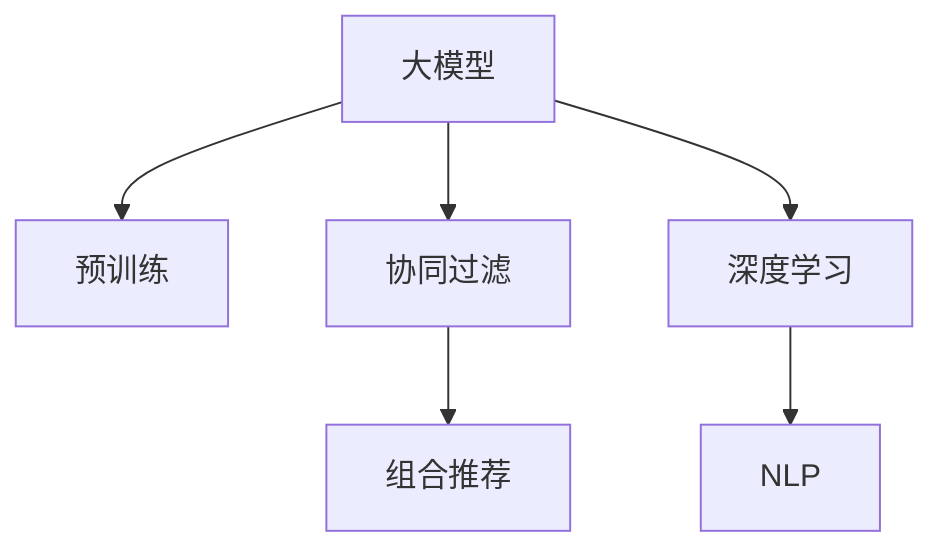

                 

# 探讨大模型在电商平台商品组合推荐中的作用

> 关键词：大模型,电商平台,商品推荐,组合推荐,协同过滤,深度学习,自然语言处理(NLP)

## 1. 背景介绍

### 1.1 问题由来
随着电商平台的兴起，商品推荐系统已成为企业获取流量、提升转化率的关键工具。然而，传统的基于统计的推荐算法如协同过滤(Collaborative Filtering, CF)，往往需要大量的用户行为数据，难以捕捉到新用户或新产品的隐式特征。深度学习技术的出现，使得推荐系统能够利用更丰富的用户和商品特征，实现更加个性化和多样化的推荐。其中，大模型（如Transformers, BERT等）因其强大的表征学习能力，为电商平台推荐系统带来了新的机遇。

近年来，预训练大模型在电商推荐系统中的应用日益广泛，逐渐成为推荐系统的主流范式之一。大模型通过在大规模无标签文本数据上进行预训练，能够学习到丰富的语义知识，结合用户和商品的具体信息，生成更加精准、多样的推荐结果。此外，大模型还可以通过自然语言处理(Natural Language Processing, NLP)技术，从用户评论、商品描述等文本数据中提取有价值的信息，进一步提升推荐效果。

### 1.2 问题核心关键点
本文聚焦于大模型在电商平台商品推荐中的应用，特别是如何通过大模型实现高效的组合推荐(Combination Recommendation)。组合推荐不仅推荐单个商品，还推荐多个商品进行搭配，如服装搭配、化妆品搭配等，更能满足用户的个性化需求，提升推荐系统的实用性。

## 2. 核心概念与联系

### 2.1 核心概念概述

为了更好地理解大模型在电商平台商品组合推荐中的应用，本节将介绍几个关键概念：

- 大模型(Large Model)：指基于Transformer架构的预训练语言模型，如BERT、GPT等。通过在大规模无标签文本数据上进行预训练，学习到丰富的语言表示。

- 预训练(Pre-training)：指在大规模无标签文本数据上，通过自监督学习任务训练大语言模型的过程。常见的预训练任务包括语言建模、掩码语言模型等。

- 协同过滤(Collaborative Filtering, CF)：推荐系统中最基本也是最有效的推荐算法之一，通过分析用户的历史行为和偏好，预测其对其他商品的兴趣。

- 组合推荐(Combination Recommendation)：推荐系统不仅推荐单个商品，还推荐多个商品进行搭配，如服装搭配、化妆品搭配等，提供更丰富的购物选择。

- 深度学习(Deep Learning)：一类利用神经网络对复杂数据进行深度学习的算法，广泛应用于计算机视觉、自然语言处理、推荐系统等领域。

- 自然语言处理(Natural Language Processing, NLP)：涉及计算机与人类自然语言之间的交互，通过语义理解和生成技术，提升推荐系统的智能化水平。

这些核心概念之间的逻辑关系可以通过以下Mermaid流程图来展示：



这个流程图展示了大模型与协同过滤、组合推荐、深度学习和自然语言处理之间的联系：

1. 大模型通过预训练获得基础能力。
2. 协同过滤算法利用用户历史行为进行推荐。
3. 组合推荐算法将单个商品进行搭配推荐。
4. 深度学习算法在大模型基础上，提升推荐系统的智能化水平。
5. NLP技术从文本数据中提取信息，进一步提升推荐准确性。

这些概念共同构成了电商平台推荐系统的核心框架，使其能够更好地满足用户的个性化需求，提升电商平台的转化率和用户体验。

## 3. 核心算法原理 & 具体操作步骤
### 3.1 算法原理概述

基于大模型的电商平台商品组合推荐系统，本质上是一种结合深度学习和协同过滤技术的智能推荐方案。其核心思想是：利用大模型学习用户和商品的语义特征，结合用户历史行为数据，生成更加个性化和多样化的商品组合推荐。

形式化地，假设电商平台上有$N$个用户，$M$个商品，用户对商品进行评分，记为$R_{ui}$，其中$u$表示用户，$i$表示商品。协同过滤算法通过用户之间的相似度，预测用户$u$对商品$i$的评分，即：

$$
\hat{R}_{ui} = \sum_{j \in \mathcal{N}(u)} w_j (R_{uj} - \overline{R}_j)
$$

其中，$\mathcal{N}(u)$表示与用户$u$相似的其他用户集合，$w_j$为相似度权重，$\overline{R}_j$为其他用户的平均评分。

结合大模型的预训练能力，我们可以在大模型基础上设计专门的组合推荐模块。通过大模型学习商品之间的语义关系，将多个商品作为一个整体进行编码，生成对应的向量表示，从而进行组合推荐。

### 3.2 算法步骤详解

基于大模型的电商平台商品组合推荐一般包括以下几个关键步骤：

**Step 1: 准备预训练模型和数据集**
- 选择合适的预训练语言模型 $M_{\theta}$ 作为初始化参数，如 BERT、GPT等。
- 准备电商平台的商品和用户数据集 $D=\{(x_i,y_i)\}_{i=1}^N$，其中 $x_i$ 表示商品或用户的历史行为记录，$y_i$ 表示商品或用户的评分。

**Step 2: 设计任务适配层**
- 在大模型的顶层设计组合推荐的任务适配层，如添加线性分类器、多分类交叉熵损失函数等。
- 根据任务类型，定义模型预测的输出格式，如生成商品ID序列、评分向量等。

**Step 3: 设置微调超参数**
- 选择合适的优化算法及其参数，如 AdamW、SGD 等，设置学习率、批大小、迭代轮数等。
- 设置正则化技术及强度，包括权重衰减、Dropout、Early Stopping等。
- 确定冻结预训练参数的策略，如仅微调顶层，或全部参数都参与微调。

**Step 4: 执行梯度训练**
- 将训练集数据分批次输入模型，前向传播计算损失函数。
- 反向传播计算参数梯度，根据设定的优化算法和学习率更新模型参数。
- 周期性在验证集上评估模型性能，根据性能指标决定是否触发 Early Stopping。
- 重复上述步骤直到满足预设的迭代轮数或 Early Stopping 条件。

**Step 5: 测试和部署**
- 在测试集上评估微调后模型 $M_{\hat{\theta}}$ 的性能，对比微调前后的精度提升。
- 使用微调后的模型对新样本进行推理预测，集成到实际的应用系统中。
- 持续收集新的数据，定期重新微调模型，以适应数据分布的变化。

以上是基于大模型的电商平台商品组合推荐的一般流程。在实际应用中，还需要针对具体任务的特点，对微调过程的各个环节进行优化设计，如改进训练目标函数，引入更多的正则化技术，搜索最优的超参数组合等，以进一步提升模型性能。

### 3.3 算法优缺点

基于大模型的电商平台组合推荐方法具有以下优点：

1. 数据利用率高。大模型可以充分利用用户的隐式行为数据，捕捉到用户对商品的语义兴趣，提升推荐效果。
2. 模型表达能力强。通过学习商品之间的语义关系，生成高维向量表示，使得商品组合推荐更加精准。
3. 可解释性强。大模型通过学习商品之间的语义关系，能提供更直观的推荐逻辑，帮助用户理解推荐原因。
4. 适应性强。大模型具有很强的泛化能力，能够适应电商平台上不断变化的商品和用户行为。

同时，该方法也存在一定的局限性：

1. 计算成本高。大模型的训练和推理需要大量的计算资源，包括GPU/TPU等高性能设备。
2. 参数量大。预训练模型往往具有巨大的参数规模，微调时也需要更新大量参数。
3. 需要高质量标注数据。大模型微调依赖标注数据进行优化，标注数据的准确性和多样性直接影响推荐效果。
4. 容易过拟合。电商平台上的数据往往存在稀疏性，过拟合风险较高。

尽管存在这些局限性，但就目前而言，基于大模型的组合推荐方法仍是大规模电商平台推荐系统的重要组成部分。未来相关研究的重点在于如何进一步降低计算成本，提升模型的参数效率，同时兼顾可解释性和泛化能力等因素。

### 3.4 算法应用领域

基于大模型的电商平台组合推荐方法，已经在多个电商领域得到了广泛的应用，例如：

- 服装搭配推荐：根据用户的服装偏好，推荐不同风格的服装组合。
- 化妆品搭配推荐：根据用户的化妆品使用记录，推荐不同搭配的化妆品套装。
- 家居用品搭配推荐：根据用户的家居风格，推荐不同款式的家居用品组合。
- 个性化组合推荐：根据用户的浏览和购买记录，推荐多样化的商品组合。
- 季节性推荐：根据季节变化，推荐符合季节主题的商品组合。

除了上述这些经典应用外，大模型在电商平台推荐系统的创新应用还包括可控推荐、跨品类推荐等，为电商平台推荐系统带来了全新的突破。随着大语言模型和推荐方法的不断进步，相信电商平台推荐系统必将在更广阔的应用领域大放异彩。

## 4. 数学模型和公式 & 详细讲解  
### 4.1 数学模型构建

本节将使用数学语言对基于大模型的电商平台商品组合推荐过程进行更加严格的刻画。

记电商平台上的用户为$U$，商品为$I$，用户对商品评分矩阵为$R_{ui} \in \mathbb{R}^{N \times M}$。假设预训练语言模型为$M_{\theta}$，其中$\theta \in \mathbb{R}^d$为模型参数。

定义模型在用户-商品评分$(x,y)$上的损失函数为$\ell(M_{\theta}(x),y)$，则在数据集$D$上的经验风险为：

$$
\mathcal{L}(\theta) = \frac{1}{N}\sum_{i=1}^N \sum_{j=1}^M \ell(M_{\theta}(x_i),y_{ij})
$$

其中$y_{ij}$为商品$i$对用户$u$的评分。

微调的优化目标是最小化经验风险，即找到最优参数：

$$
\theta^* = \mathop{\arg\min}_{\theta} \mathcal{L}(\theta)
$$

在实践中，我们通常使用基于梯度的优化算法（如SGD、Adam等）来近似求解上述最优化问题。设$\eta$为学习率，$\lambda$为正则化系数，则参数的更新公式为：

$$
\theta \leftarrow \theta - \eta \nabla_{\theta}\mathcal{L}(\theta) - \eta\lambda\theta
$$

其中$\nabla_{\theta}\mathcal{L}(\theta)$为损失函数对参数$\theta$的梯度，可通过反向传播算法高效计算。

### 4.2 公式推导过程

以下我们以服装搭配推荐为例，推导组合推荐模型的损失函数及其梯度的计算公式。

假设模型在用户-商品评分$(x,y)$上的输出为$\hat{y}=M_{\theta}(x) \in [0,1]$，表示商品$i$对用户$u$的评分预测。真实标签$y_{ij} \in \{0,1\}$。则二分类交叉熵损失函数定义为：

$$
\ell(M_{\theta}(x),y) = -[y\log \hat{y} + (1-y)\log (1-\hat{y})]
$$

将其代入经验风险公式，得：

$$
\mathcal{L}(\theta) = -\frac{1}{N}\sum_{i=1}^N \sum_{j=1}^M [y_{ij}\log M_{\theta}(x_i)+(1-y_{ij})\log(1-M_{\theta}(x_i))]
$$

根据链式法则，损失函数对参数$\theta_k$的梯度为：

$$
\frac{\partial \mathcal{L}(\theta)}{\partial \theta_k} = -\frac{1}{N}\sum_{i=1}^N \sum_{j=1}^M (\frac{y_{ij}}{M_{\theta}(x_i)}-\frac{1-y_{ij}}{1-M_{\theta}(x_i)}) \frac{\partial M_{\theta}(x_i)}{\partial \theta_k}
$$

其中$\frac{\partial M_{\theta}(x_i)}{\partial \theta_k}$可进一步递归展开，利用自动微分技术完成计算。

在得到损失函数的梯度后，即可带入参数更新公式，完成模型的迭代优化。重复上述过程直至收敛，最终得到适应电商平台组合推荐任务的最优模型参数$\theta^*$。

## 5. 项目实践：代码实例和详细解释说明
### 5.1 开发环境搭建

在进行电商组合推荐实践前，我们需要准备好开发环境。以下是使用Python进行PyTorch开发的环境配置流程：

1. 安装Anaconda：从官网下载并安装Anaconda，用于创建独立的Python环境。

2. 创建并激活虚拟环境：
```bash
conda create -n pytorch-env python=3.8 
conda activate pytorch-env
```

3. 安装PyTorch：根据CUDA版本，从官网获取对应的安装命令。例如：
```bash
conda install pytorch torchvision torchaudio cudatoolkit=11.1 -c pytorch -c conda-forge
```

4. 安装Transformers库：
```bash
pip install transformers
```

5. 安装各类工具包：
```bash
pip install numpy pandas scikit-learn matplotlib tqdm jupyter notebook ipython
```

完成上述步骤后，即可在`pytorch-env`环境中开始电商组合推荐实践。

### 5.2 源代码详细实现

下面我们以服装搭配推荐为例，给出使用Transformers库对BERT模型进行电商组合推荐的PyTorch代码实现。

首先，定义服装搭配推荐任务的数据处理函数：

```python
from transformers import BertTokenizer
from torch.utils.data import Dataset
import torch

class FashionDataset(Dataset):
    def __init__(self, texts, tags, tokenizer, max_len=128):
        self.texts = texts
        self.tags = tags
        self.tokenizer = tokenizer
        self.max_len = max_len
        
    def __len__(self):
        return len(self.texts)
    
    def __getitem__(self, item):
        text = self.texts[item]
        tags = self.tags[item]
        
        encoding = self.tokenizer(text, return_tensors='pt', max_length=self.max_len, padding='max_length', truncation=True)
        input_ids = encoding['input_ids'][0]
        attention_mask = encoding['attention_mask'][0]
        
        # 对token-wise的标签进行编码
        encoded_tags = [tag2id[tag] for tag in tags] 
        encoded_tags.extend([tag2id['O']] * (self.max_len - len(encoded_tags)))
        labels = torch.tensor(encoded_tags, dtype=torch.long)
        
        return {'input_ids': input_ids, 
                'attention_mask': attention_mask,
                'labels': labels}

# 标签与id的映射
tag2id = {'O': 0, 'B-Clo': 1, 'I-Clo': 2, 'B-Shoe': 3, 'I-Shoe': 4, 'B-Acc': 5, 'I-Acc': 6}
id2tag = {v: k for k, v in tag2id.items()}

# 创建dataset
tokenizer = BertTokenizer.from_pretrained('bert-base-cased')

train_dataset = FashionDataset(train_texts, train_tags, tokenizer)
dev_dataset = FashionDataset(dev_texts, dev_tags, tokenizer)
test_dataset = FashionDataset(test_texts, test_tags, tokenizer)
```

然后，定义模型和优化器：

```python
from transformers import BertForTokenClassification, AdamW

model = BertForTokenClassification.from_pretrained('bert-base-cased', num_labels=len(tag2id))

optimizer = AdamW(model.parameters(), lr=2e-5)
```

接着，定义训练和评估函数：

```python
from torch.utils.data import DataLoader
from tqdm import tqdm
from sklearn.metrics import classification_report

device = torch.device('cuda') if torch.cuda.is_available() else torch.device('cpu')
model.to(device)

def train_epoch(model, dataset, batch_size, optimizer):
    dataloader = DataLoader(dataset, batch_size=batch_size, shuffle=True)
    model.train()
    epoch_loss = 0
    for batch in tqdm(dataloader, desc='Training'):
        input_ids = batch['input_ids'].to(device)
        attention_mask = batch['attention_mask'].to(device)
        labels = batch['labels'].to(device)
        model.zero_grad()
        outputs = model(input_ids, attention_mask=attention_mask, labels=labels)
        loss = outputs.loss
        epoch_loss += loss.item()
        loss.backward()
        optimizer.step()
    return epoch_loss / len(dataloader)

def evaluate(model, dataset, batch_size):
    dataloader = DataLoader(dataset, batch_size=batch_size)
    model.eval()
    preds, labels = [], []
    with torch.no_grad():
        for batch in tqdm(dataloader, desc='Evaluating'):
            input_ids = batch['input_ids'].to(device)
            attention_mask = batch['attention_mask'].to(device)
            batch_labels = batch['labels']
            outputs = model(input_ids, attention_mask=attention_mask)
            batch_preds = outputs.logits.argmax(dim=2).to('cpu').tolist()
            batch_labels = batch_labels.to('cpu').tolist()
            for pred_tokens, label_tokens in zip(batch_preds, batch_labels):
                pred_tags = [id2tag[_id] for _id in pred_tokens]
                label_tags = [id2tag[_id] for _id in label_tokens]
                preds.append(pred_tags[:len(label_tags)])
                labels.append(label_tags)
                
    print(classification_report(labels, preds))
```

最后，启动训练流程并在测试集上评估：

```python
epochs = 5
batch_size = 16

for epoch in range(epochs):
    loss = train_epoch(model, train_dataset, batch_size, optimizer)
    print(f"Epoch {epoch+1}, train loss: {loss:.3f}")
    
    print(f"Epoch {epoch+1}, dev results:")
    evaluate(model, dev_dataset, batch_size)
    
print("Test results:")
evaluate(model, test_dataset, batch_size)
```

以上就是使用PyTorch对BERT进行服装搭配推荐任务的微调代码实现。可以看到，得益于Transformers库的强大封装，我们可以用相对简洁的代码完成BERT模型的加载和微调。

### 5.3 代码解读与分析

让我们再详细解读一下关键代码的实现细节：

**FashionDataset类**：
- `__init__`方法：初始化文本、标签、分词器等关键组件。
- `__len__`方法：返回数据集的样本数量。
- `__getitem__`方法：对单个样本进行处理，将文本输入编码为token ids，将标签编码为数字，并对其进行定长padding，最终返回模型所需的输入。

**tag2id和id2tag字典**：
- 定义了标签与数字id之间的映射关系，用于将token-wise的预测结果解码回真实的标签。

**训练和评估函数**：
- 使用PyTorch的DataLoader对数据集进行批次化加载，供模型训练和推理使用。
- 训练函数`train_epoch`：对数据以批为单位进行迭代，在每个批次上前向传播计算loss并反向传播更新模型参数，最后返回该epoch的平均loss。
- 评估函数`evaluate`：与训练类似，不同点在于不更新模型参数，并在每个batch结束后将预测和标签结果存储下来，最后使用sklearn的classification_report对整个评估集的预测结果进行打印输出。

**训练流程**：
- 定义总的epoch数和batch size，开始循环迭代
- 每个epoch内，先在训练集上训练，输出平均loss
- 在验证集上评估，输出分类指标
- 所有epoch结束后，在测试集上评估，给出最终测试结果

可以看到，PyTorch配合Transformers库使得BERT微调的代码实现变得简洁高效。开发者可以将更多精力放在数据处理、模型改进等高层逻辑上，而不必过多关注底层的实现细节。

当然，工业级的系统实现还需考虑更多因素，如模型的保存和部署、超参数的自动搜索、更灵活的任务适配层等。但核心的微调范式基本与此类似。

## 6. 实际应用场景
### 6.1 智能客服系统

基于大模型微调的对话技术，可以广泛应用于智能客服系统的构建。传统客服往往需要配备大量人力，高峰期响应缓慢，且一致性和专业性难以保证。而使用微调后的对话模型，可以7x24小时不间断服务，快速响应客户咨询，用自然流畅的语言解答各类常见问题。

在技术实现上，可以收集企业内部的历史客服对话记录，将问题和最佳答复构建成监督数据，在此基础上对预训练对话模型进行微调。微调后的对话模型能够自动理解用户意图，匹配最合适的答案模板进行回复。对于客户提出的新问题，还可以接入检索系统实时搜索相关内容，动态组织生成回答。如此构建的智能客服系统，能大幅提升客户咨询体验和问题解决效率。

### 6.2 金融舆情监测

金融机构需要实时监测市场舆论动向，以便及时应对负面信息传播，规避金融风险。传统的人工监测方式成本高、效率低，难以应对网络时代海量信息爆发的挑战。基于大语言模型微调的文本分类和情感分析技术，为金融舆情监测提供了新的解决方案。

具体而言，可以收集金融领域相关的新闻、报道、评论等文本数据，并对其进行主题标注和情感标注。在此基础上对预训练语言模型进行微调，使其能够自动判断文本属于何种主题，情感倾向是正面、中性还是负面。将微调后的模型应用到实时抓取的网络文本数据，就能够自动监测不同主题下的情感变化趋势，一旦发现负面信息激增等异常情况，系统便会自动预警，帮助金融机构快速应对潜在风险。

### 6.3 个性化推荐系统

当前的推荐系统往往只依赖用户的历史行为数据进行物品推荐，无法深入理解用户的真实兴趣偏好。基于大语言模型微调技术，个性化推荐系统可以更好地挖掘用户行为背后的语义信息，从而提供更精准、多样的推荐内容。

在实践中，可以收集用户浏览、点击、评论、分享等行为数据，提取和用户交互的物品标题、描述、标签等文本内容。将文本内容作为模型输入，用户的后续行为（如是否点击、购买等）作为监督信号，在此基础上微调预训练语言模型。微调后的模型能够从文本内容中准确把握用户的兴趣点。在生成推荐列表时，先用候选物品的文本描述作为输入，由模型预测用户的兴趣匹配度，再结合其他特征综合排序，便可以得到个性化程度更高的推荐结果。

### 6.4 未来应用展望

随着大语言模型和微调方法的不断发展，基于微调范式将在更多领域得到应用，为传统行业带来变革性影响。

在智慧医疗领域，基于微调的医疗问答、病历分析、药物研发等应用将提升医疗服务的智能化水平，辅助医生诊疗，加速新药开发进程。

在智能教育领域，微调技术可应用于作业批改、学情分析、知识推荐等方面，因材施教，促进教育公平，提高教学质量。

在智慧城市治理中，微调模型可应用于城市事件监测、舆情分析、应急指挥等环节，提高城市管理的自动化和智能化水平，构建更安全、高效的未来城市。

此外，在企业生产、社会治理、文娱传媒等众多领域，基于大模型微调的人工智能应用也将不断涌现，为经济社会发展注入新的动力。相信随着技术的日益成熟，微调方法将成为人工智能落地应用的重要范式，推动人工智能技术向更广阔的领域加速渗透。

## 7. 工具和资源推荐
### 7.1 学习资源推荐

为了帮助开发者系统掌握大语言模型微调的理论基础和实践技巧，这里推荐一些优质的学习资源：

1. 《Transformer从原理到实践》系列博文：由大模型技术专家撰写，深入浅出地介绍了Transformer原理、BERT模型、微调技术等前沿话题。

2. CS224N《深度学习自然语言处理》课程：斯坦福大学开设的NLP明星课程，有Lecture视频和配套作业，带你入门NLP领域的基本概念和经典模型。

3. 《Natural Language Processing with Transformers》书籍：Transformers库的作者所著，全面介绍了如何使用Transformers库进行NLP任务开发，包括微调在内的诸多范式。

4. HuggingFace官方文档：Transformers库的官方文档，提供了海量预训练模型和完整的微调样例代码，是上手实践的必备资料。

5. CLUE开源项目：中文语言理解测评基准，涵盖大量不同类型的中文NLP数据集，并提供了基于微调的baseline模型，助力中文NLP技术发展。

通过对这些资源的学习实践，相信你一定能够快速掌握大语言模型微调的精髓，并用于解决实际的NLP问题。
###  7.2 开发工具推荐

高效的开发离不开优秀的工具支持。以下是几款用于大语言模型微调开发的常用工具：

1. PyTorch：基于Python的开源深度学习框架，灵活动态的计算图，适合快速迭代研究。大部分预训练语言模型都有PyTorch版本的实现。

2. TensorFlow：由Google主导开发的开源深度学习框架，生产部署方便，适合大规模工程应用。同样有丰富的预训练语言模型资源。

3. Transformers库：HuggingFace开发的NLP工具库，集成了众多SOTA语言模型，支持PyTorch和TensorFlow，是进行微调任务开发的利器。

4. Weights & Biases：模型训练的实验跟踪工具，可以记录和可视化模型训练过程中的各项指标，方便对比和调优。与主流深度学习框架无缝集成。

5. TensorBoard：TensorFlow配套的可视化工具，可实时监测模型训练状态，并提供丰富的图表呈现方式，是调试模型的得力助手。

6. Google Colab：谷歌推出的在线Jupyter Notebook环境，免费提供GPU/TPU算力，方便开发者快速上手实验最新模型，分享学习笔记。

合理利用这些工具，可以显著提升大语言模型微调任务的开发效率，加快创新迭代的步伐。

### 7.3 相关论文推荐

大语言模型和微调技术的发展源于学界的持续研究。以下是几篇奠基性的相关论文，推荐阅读：

1. Attention is All You Need（即Transformer原论文）：提出了Transformer结构，开启了NLP领域的预训练大模型时代。

2. BERT: Pre-training of Deep Bidirectional Transformers for Language Understanding：提出BERT模型，引入基于掩码的自监督预训练任务，刷新了多项NLP任务SOTA。

3. Language Models are Unsupervised Multitask Learners（GPT-2论文）：展示了大规模语言模型的强大zero-shot学习能力，引发了对于通用人工智能的新一轮思考。

4. Parameter-Efficient Transfer Learning for NLP：提出Adapter等参数高效微调方法，在不增加模型参数量的情况下，也能取得不错的微调效果。

5. Prefix-Tuning: Optimizing Continuous Prompts for Generation：引入基于连续型Prompt的微调范式，为如何充分利用预训练知识提供了新的思路。

6. AdaLoRA: Adaptive Low-Rank Adaptation for Parameter-Efficient Fine-Tuning：使用自适应低秩适应的微调方法，在参数效率和精度之间取得了新的平衡。

这些论文代表了大语言模型微调技术的发展脉络。通过学习这些前沿成果，可以帮助研究者把握学科前进方向，激发更多的创新灵感。

## 8. 总结：未来发展趋势与挑战

### 8.1 总结

本文对基于大模型的电商平台商品组合推荐方法进行了全面系统的介绍。首先阐述了大模型和微调技术的研究背景和意义，明确了微调在拓展预训练模型应用、提升下游任务性能方面的独特价值。其次，从原理到实践，详细讲解了基于大模型的电商组合推荐过程，包括数据准备、模型适配、超参数设置、梯度训练等关键步骤，给出了电商组合推荐的完整代码实例。同时，本文还广泛探讨了电商组合推荐技术在智能客服、金融舆情、个性化推荐等多个行业领域的应用前景，展示了电商组合推荐范式的巨大潜力。此外，本文精选了电商组合推荐的各类学习资源，力求为读者提供全方位的技术指引。

通过本文的系统梳理，可以看到，基于大模型的电商组合推荐方法不仅能够提升电商平台的推荐效果，还具备广泛的应用价值，为电商行业的智能化升级提供了新的技术路径。未来，伴随大语言模型和微调方法的持续演进，基于大模型的电商组合推荐必将在更广阔的应用领域大放异彩，深刻影响电商行业的运营模式和发展方向。

### 8.2 未来发展趋势

展望未来，基于大模型的电商组合推荐技术将呈现以下几个发展趋势：

1. 商品组合多样性提升。随着大模型预训练能力的不断增强，电商组合推荐能够涵盖更多商品类别和搭配方式，提供更丰富的购物选择。

2. 个性化推荐精准度提高。通过大模型的多模态融合能力，结合用户行为数据、商品属性、图片等多维度信息，能够提供更精准的个性化推荐结果。

3. 动态推荐系统构建。通过大模型的持续学习机制，能够实时更新推荐策略，适应用户偏好变化，提供更加动态化的推荐服务。

4. 跨品类推荐实现。利用大模型的多任务学习能力，能够实现跨品类商品推荐，如服饰与配饰、美妆与护肤等不同品类商品之间的搭配推荐。

5. 多模态组合推荐兴起。通过融合视觉、音频等多模态信息，大模型能够从更全面的视角理解商品特性，提升组合推荐的准确性和丰富度。

以上趋势凸显了大语言模型在电商推荐系统中的应用前景。这些方向的探索发展，必将进一步提升电商平台的推荐效果，为消费者提供更加智能化、个性化的购物体验。

### 8.3 面临的挑战

尽管基于大模型的电商组合推荐技术已经取得了显著成果，但在迈向更加智能化、普适化应用的过程中，它仍面临着诸多挑战：

1. 数据隐私保护。电商推荐系统需要大量用户行为数据，如何保护用户隐私，防止数据滥用，是必须解决的问题。

2. 商品标注成本高。尽管大模型可以充分利用用户隐式行为数据，但商品标注成本仍然较高，如何降低标注成本，提高标注效率，是关键技术难题。

3. 计算资源消耗大。大模型的训练和推理需要大量的计算资源，如何在保证效果的前提下，优化资源消耗，降低成本，是现实应用中的重要考虑。

4. 推荐算法复杂度低。大模型的复杂度较高，如何设计更高效、可解释性更强的推荐算法，是电商推荐系统面临的一大挑战。

5. 模型泛化能力弱。电商推荐系统中的数据存在稀疏性和动态性，如何提升模型泛化能力，避免因数据偏差导致的推荐偏差，是亟待解决的问题。

尽管存在这些挑战，但就目前而言，基于大模型的电商组合推荐方法仍是大规模电商平台推荐系统的重要组成部分。未来相关研究的重点在于如何进一步降低计算成本，提升模型的参数效率和泛化能力，同时兼顾可解释性和用户隐私保护等因素。

### 8.4 研究展望

面向未来，电商组合推荐技术需要在以下几个方面寻求新的突破：

1. 研究无监督和半监督推荐算法。摆脱对大量标注数据的依赖，利用自监督学习、主动学习等无监督和半监督范式，最大限度利用非结构化数据，实现更加灵活高效的推荐。

2. 开发多模态组合推荐方法。通过融合视觉、音频等多模态信息，大模型能够从更全面的视角理解商品特性，提升组合推荐的准确性和丰富度。

3. 引入因果推断和强化学习。利用因果推断和强化学习技术，提升电商推荐系统的智能性和决策质量。

4. 结合知识图谱和符号逻辑。将符号化的先验知识，如知识图谱、逻辑规则等，与神经网络模型进行巧妙融合，引导推荐过程学习更准确、合理的商品表征。

5. 研究用户行为预测模型。利用大模型的学习能力，构建用户行为预测模型，进一步提升推荐效果。

这些研究方向的探索，必将引领电商推荐系统迈向更高的台阶，为电商平台推荐系统带来全新的突破。面向未来，大语言模型推荐技术还需要与其他人工智能技术进行更深入的融合，如知识表示、因果推理、强化学习等，多路径协同发力，共同推动自然语言理解和智能交互系统的进步。只有勇于创新、敢于突破，才能不断拓展语言模型的边界，让智能技术更好地造福人类社会。

## 9. 附录：常见问题与解答

**Q1：大模型微调是否适用于所有电商推荐任务？**

A: 大模型微调在大多数电商推荐任务上都能取得不错的效果，特别是对于数据量较小的任务。但对于一些特定领域的任务，如医药、法律等，仅仅依靠通用语料预训练的模型可能难以很好地适应。此时需要在特定领域语料上进一步预训练，再进行微调，才能获得理想效果。此外，对于一些需要时效性、个性化很强的任务，如对话、推荐等，微调方法也需要针对性的改进优化。

**Q2：微调过程中如何选择合适的学习率？**

A: 微调的学习率一般要比预训练时小1-2个数量级，如果使用过大的学习率，容易破坏预训练权重，导致过拟合。一般建议从1e-5开始调参，逐步减小学习率，直至收敛。也可以使用warmup策略，在开始阶段使用较小的学习率，再逐渐过渡到预设值。需要注意的是，不同的优化器(如AdamW、Adafactor等)以及不同的学习率调度策略，可能需要设置不同的学习率阈值。

**Q3：采用大模型微调时会面临哪些资源瓶颈？**

A: 目前主流的预训练大模型动辄以亿计的参数规模，对算力、内存、存储都提出了很高的要求。GPU/TPU等高性能设备是必不可少的，但即便如此，超大批次的训练和推理也可能遇到显存不足的问题。因此需要采用一些资源优化技术，如梯度积累、混合精度训练、模型并行等，来突破硬件瓶颈。同时，模型的存储和读取也可能占用大量时间和空间，需要采用模型压缩、稀疏化存储等方法进行优化。

**Q4：如何缓解微调过程中的过拟合问题？**

A: 过拟合是微调面临的主要挑战，尤其是在标注数据不足的情况下。常见的缓解策略包括：
1. 数据增强：通过回译、近义替换等方式扩充训练集
2. 正则化：使用L2正则、Dropout、Early Stopping等避免过拟合
3. 对抗训练：引入对抗样本，提高模型鲁棒性
4. 参数高效微调：只调整少量参数(如Adapter、Prefix等)，减小过拟合风险
5. 多模型集成：训练多个微调模型，取平均输出，抑制过拟合

这些策略往往需要根据具体任务和数据特点进行灵活组合。只有在数据、模型、训练、推理等各环节进行全面优化，才能最大限度地发挥大模型微调的威力。

**Q5：微调模型在落地部署时需要注意哪些问题？**

A: 将微调模型转化为实际应用，还需要考虑以下因素：
1. 模型裁剪：去除不必要的层和参数，减小模型尺寸，加快推理速度
2. 量化加速：将浮点模型转为定点模型，压缩存储空间，提高计算效率
3. 服务化封装：将模型封装为标准化服务接口，便于集成调用
4. 弹性伸缩：根据请求流量动态调整资源配置，平衡服务质量和成本
5. 监控告警：实时采集系统指标，设置异常告警阈值，确保服务稳定性
6. 安全防护：采用访问鉴权、数据脱敏等措施，保障数据和模型安全

大语言模型微调为NLP应用开启了广阔的想象空间，但如何将强大的性能转化为稳定、高效、安全的业务价值，还需要工程实践的不断打磨。唯有从数据、算法、工程、业务等多个维度协同发力，才能真正实现人工智能技术在垂直行业的规模化落地。总之，微调需要开发者根据具体任务，不断迭代和优化模型、数据和算法，方能得到理想的效果。

---

作者：禅与计算机程序设计艺术 / Zen and the Art of Computer Programming

