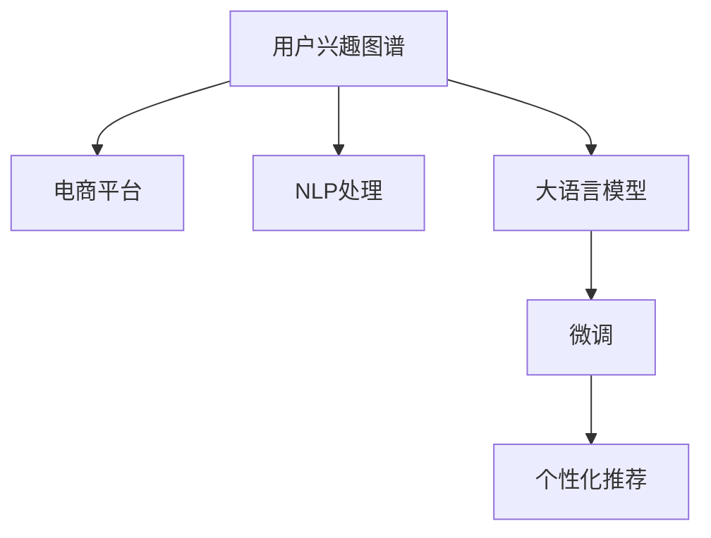

                 

# 探讨大模型在电商平台用户兴趣图谱动态更新中的作用

## 1. 背景介绍

### 1.1 问题由来
随着电商平台的迅猛发展，如何更准确、高效地为用户提供个性化推荐，已成为电商竞争的核心要素之一。而用户兴趣图谱的构建和动态更新，是实现个性化推荐的关键步骤。传统的图谱构建方法依赖于人工标注和规则设计，效率低、成本高、无法自适应用户行为的变化。随着大语言模型的兴起，利用大规模预训练语言模型，从用户行为数据中自动提取和更新用户兴趣图谱，成为新的技术趋势。

### 1.2 问题核心关键点
大模型在电商平台用户兴趣图谱动态更新中的关键作用在于：
- 高效自适应：通过大模型自动提取用户行为特征，实时更新图谱，适应用户兴趣的变化。
- 精准建模：大模型通过丰富的语言理解能力，深入挖掘用户行为背后的语义信息，构建更准确的兴趣图谱。
- 跨域泛化：大模型具备强大的跨领域迁移能力，能够在不同应用场景和用户群体中实现泛化。
- 灵活扩展：大模型架构可扩展性强，适用于复杂多变的电商场景，提升个性化推荐的质量和速度。

### 1.3 问题研究意义
研究大模型在电商平台用户兴趣图谱动态更新中的作用，对于提升电商平台的个性化推荐服务，降低运营成本，提高用户满意度，具有重要意义：

1. 提升推荐精度：通过大模型的深度学习，能够捕捉用户行为背后的复杂语义信息，显著提升个性化推荐的准确性和个性化程度。
2. 加速迭代更新：大模型自动提取特征和更新图谱，减少人工干预，快速响应用户兴趣的变化，实现实时推荐。
3. 降低成本：相比于传统人工标注和规则设计，大模型的应用大幅降低了数据处理和模型维护的成本。
4. 扩展应用场景：大模型的自适应能力和跨领域迁移能力，使其能够应用于电商平台的各个场景，推动电商平台的全面智能化。
5. 增强用户体验：通过更精准、高效的个性化推荐，提升用户体验，增强用户粘性和忠诚度。

## 2. 核心概念与联系

### 2.1 核心概念概述

为更好地理解大模型在电商平台用户兴趣图谱动态更新中的作用，本节将介绍几个关键概念：

- 用户兴趣图谱(User Interest Graph): 一种表示用户行为特征的图结构数据，用于刻画用户对不同商品或服务的兴趣强度和关联关系。
- 电商平台(ECOMMERCE PLATFORM): 提供在线商品销售、订单处理、用户管理等功能的电子平台，是用户兴趣图谱的主要数据来源。
- 自然语言处理(NLP): 涉及计算机对自然语言的理解、生成、分析和处理的技术，是构建用户兴趣图谱的重要工具。
- 大语言模型(Large Language Model, LLM): 基于Transformer架构的深度神经网络模型，通过大规模无标签文本数据进行预训练，具备强大的语言理解和生成能力。
- 微调(Fine-Tuning): 利用少量有标签数据对预训练模型进行优化，使其适应特定任务的方法。

这些概念之间的逻辑关系可以通过以下Mermaid流程图来展示：



这个流程图展示了大模型在电商平台用户兴趣图谱动态更新中的核心概念及其关系：

1. 电商平台的数据是构建用户兴趣图谱的主要来源。
2. 自然语言处理技术用于对电商平台的数据进行处理，提取出用户的行为特征。
3. 大语言模型通过预训练获得语言理解能力，用于提取和处理用户行为数据。
4. 微调技术在大模型上进一步优化，使其适应电商平台的个性化推荐任务。
5. 最终，微调后的模型用于生成个性化的推荐结果。

## 3. 核心算法原理 & 具体操作步骤
### 3.1 算法原理概述

大模型在电商平台用户兴趣图谱动态更新中的原理，主要分为三个步骤：

1. **数据收集**：收集电商平台的用户行为数据，包括点击、浏览、购买等行为记录。
2. **特征提取**：利用大语言模型自动提取用户行为数据的特征，构建用户兴趣图谱。
3. **图谱更新**：通过微调后的模型，实时更新用户兴趣图谱，提供个性化的推荐服务。

具体来说，大模型通过预训练获得广泛的语言知识，能够理解电商平台的用户评论、产品描述等文本信息，从中提取出用户对不同商品的兴趣强度和关联关系。微调后的模型则根据用户的新行为数据，动态更新图谱，实现实时推荐。

### 3.2 算法步骤详解

#### 3.2.1 数据收集

- **数据源**：电商平台的用户行为数据，包括点击、浏览、购买等行为记录。
- **数据格式**：文本数据、时间戳、用户ID、商品ID等。
- **数据量**：需根据电商平台规模和用户群体特点，决定数据量的收集范围。

#### 3.2.2 特征提取

1. **预训练模型选择**：选择预训练大语言模型，如BERT、GPT等，作为特征提取的基础模型。
2. **文本预处理**：对电商平台的用户行为数据进行预处理，包括去噪、分词、编码等。
3. **特征提取**：利用大语言模型的嵌入层，将处理后的文本数据转换为向量表示，提取用户行为的特征。
4. **图谱构建**：将提取出的用户行为特征，通过图谱构建算法，转换为用户兴趣图谱的节点和边。

#### 3.2.3 图谱更新

1. **微调模型设计**：设计微调模型，添加特定任务适配层，如分类器或回归器。
2. **微调数据准备**：收集用户最新的行为数据，作为微调模型的监督信号。
3. **模型微调**：在微调数据上对模型进行有监督训练，更新模型参数。
4. **图谱更新**：使用微调后的模型，动态更新用户兴趣图谱，生成个性化推荐结果。

### 3.3 算法优缺点

#### 3.3.1 优点

1. **高效自适应**：大模型能够实时捕捉用户行为变化，动态更新兴趣图谱，适应性强。
2. **精准建模**：大模型通过深度学习，能够提取复杂的语义信息，构建更准确的图谱。
3. **跨域泛化**：大模型具备跨领域迁移能力，适用于不同电商平台的个性化推荐。
4. **灵活扩展**：大模型架构可扩展性强，适用于复杂的电商场景。

#### 3.3.2 缺点

1. **数据依赖**：大模型依赖于大量的电商平台数据，数据量和质量直接影响图谱的构建和更新。
2. **计算成本**：大模型的训练和推理计算量大，对硬件资源要求高。
3. **可解释性不足**：大模型通常为黑盒模型，难以解释其内部工作机制和决策逻辑。
4. **数据隐私**：电商平台的用户数据可能涉及隐私问题，需要严格的数据保护和隐私控制。

### 3.4 算法应用领域

大模型在电商平台用户兴趣图谱动态更新中，已经被广泛应用于以下领域：

- 个性化推荐系统：根据用户的行为数据，实时生成个性化推荐结果。
- 用户行为分析：通过用户兴趣图谱，分析用户行为特征和兴趣变化趋势。
- 广告投放优化：根据用户兴趣图谱，优化广告投放策略，提高广告点击率。
- 商品推荐系统：根据用户兴趣图谱，推荐最符合用户兴趣的商品。
- 购物车推荐：在用户添加到购物车后，推荐相关商品，提升购物体验。
- 客户流失预警：通过用户兴趣图谱，预测和预警可能流失的客户。

除了上述这些主要应用场景外，大模型在电商平台的个性化推荐和用户行为分析中，还有着广阔的应用前景，为电商平台的智能化运营提供了新的技术手段。

## 4. 数学模型和公式 & 详细讲解 & 举例说明

### 4.1 数学模型构建

我们假设用户行为数据为 $X=\{(x_1, y_1), (x_2, y_2), ..., (x_n, y_n)\}$，其中 $x_i$ 为行为特征向量，$y_i$ 为标签（如点击、购买等）。利用大语言模型 $M$ 提取用户行为的特征表示 $z_i = M(x_i)$。构建用户兴趣图谱 $G=(V, E)$，其中 $V$ 为节点集合，$E$ 为边集合。

节点 $v_i$ 表示用户对商品 $x_i$ 的兴趣强度，$v_i = (z_i, y_i)$。边 $e_{ij}$ 表示用户 $i$ 和用户 $j$ 的兴趣相关性，$e_{ij} = \cos(\theta) \cdot \text{sim}(z_i, z_j)$，其中 $\theta$ 为注意力权重，$\text{sim}(z_i, z_j)$ 为向量相似度。

### 4.2 公式推导过程

1. **用户行为特征提取**：利用大语言模型的嵌入层，将用户行为数据 $x_i$ 转换为向量表示 $z_i = M(x_i)$。
2. **兴趣强度计算**：将用户行为特征和标签结合，计算用户对商品的兴趣强度 $v_i = (z_i, y_i)$。
3. **兴趣相关性计算**：利用向量相似度计算用户之间的兴趣相关性 $e_{ij} = \cos(\theta) \cdot \text{sim}(z_i, z_j)$。
4. **图谱构建**：通过用户兴趣强度和相关性，构建用户兴趣图谱 $G=(V, E)$。

### 4.3 案例分析与讲解

以电商平台推荐系统为例，分析大模型在特征提取和图谱更新中的应用。

假设电商平台的用户行为数据为 $X=\{(x_1, y_1), (x_2, y_2), ..., (x_n, y_n)\}$，其中 $x_i$ 为商品ID和浏览次数，$y_i$ 为点击次数。利用BERT模型 $M$ 提取用户行为特征 $z_i = M(x_i)$，其中 $z_i$ 为商品ID和浏览次数的向量表示。

计算用户对商品的兴趣强度 $v_i = (z_i, y_i)$，将用户行为特征和标签结合，形成节点 $v_i$。利用向量相似度计算用户之间的兴趣相关性 $e_{ij} = \cos(\theta) \cdot \text{sim}(z_i, z_j)$，其中 $\theta$ 为注意力权重，$\text{sim}(z_i, z_j)$ 为余弦相似度。

构建用户兴趣图谱 $G=(V, E)$，其中 $V$ 为节点集合，$E$ 为边集合。通过用户兴趣图谱，实时生成个性化推荐结果。

## 5. 项目实践：代码实例和详细解释说明
### 5.1 开发环境搭建

在进行大模型在电商平台用户兴趣图谱动态更新中的项目实践前，我们需要准备好开发环境。以下是使用Python进行PyTorch开发的环境配置流程：

1. 安装Anaconda：从官网下载并安装Anaconda，用于创建独立的Python环境。

2. 创建并激活虚拟环境：
```bash
conda create -n pytorch-env python=3.8 
conda activate pytorch-env
```

3. 安装PyTorch：根据CUDA版本，从官网获取对应的安装命令。例如：
```bash
conda install pytorch torchvision torchaudio cudatoolkit=11.1 -c pytorch -c conda-forge
```

4. 安装Natural Language Toolkit（NLTK）和Transformers库：
```bash
pip install nltk transformers
```

5. 安装各类工具包：
```bash
pip install numpy pandas scikit-learn matplotlib tqdm jupyter notebook ipython
```

完成上述步骤后，即可在`pytorch-env`环境中开始项目实践。

### 5.2 源代码详细实现

下面我们以电商平台的个性化推荐系统为例，给出使用BERT模型对用户行为数据进行特征提取和兴趣图谱构建的PyTorch代码实现。

首先，定义用户行为数据的处理函数：

```python
from transformers import BertTokenizer
from torch.utils.data import Dataset, DataLoader
from transformers import BertForSequenceClassification
from torch import nn
from sklearn.metrics import accuracy_score
import pandas as pd
import numpy as np

class UserBehaviorDataset(Dataset):
    def __init__(self, data_path):
        self.data = pd.read_csv(data_path)
        self.tokenizer = BertTokenizer.from_pretrained('bert-base-uncased')
        self.max_len = 128
        
    def __len__(self):
        return len(self.data)
    
    def __getitem__(self, idx):
        row = self.data.iloc[idx]
        text = row['behavior']  # 行为数据，如商品ID和浏览次数
        label = row['label']   # 标签，如点击次数
        
        encoding = self.tokenizer(text, return_tensors='pt', max_length=self.max_len, padding='max_length', truncation=True)
        input_ids = encoding['input_ids'][0]
        attention_mask = encoding['attention_mask'][0]
        
        label = int(label) if label != '0' else 0
        
        return {'input_ids': input_ids, 
                'attention_mask': attention_mask,
                'label': label}

# 加载用户行为数据
data_path = 'user_behavior.csv'
dataset = UserBehaviorDataset(data_path)
dataloader = DataLoader(dataset, batch_size=16)

# 定义模型
model = BertForSequenceClassification.from_pretrained('bert-base-uncased', num_labels=2)
model.train()

# 定义优化器和损失函数
optimizer = AdamW(model.parameters(), lr=2e-5)
loss_fn = nn.BCEWithLogitsLoss()

# 定义评估函数
def evaluate(model, dataloader, device):
    model.eval()
    total_preds = []
    total_labels = []
    
    with torch.no_grad():
        for batch in dataloader:
            input_ids = batch['input_ids'].to(device)
            attention_mask = batch['attention_mask'].to(device)
            labels = batch['label'].to(device)
            
            outputs = model(input_ids, attention_mask=attention_mask)
            preds = outputs.logits.sigmoid()
            total_preds.append(preds.cpu().numpy())
            total_labels.append(labels.cpu().numpy())
            
    preds = np.concatenate(total_preds)
    labels = np.concatenate(total_labels)
    
    accuracy = accuracy_score(labels, preds > 0.5)
    return accuracy

# 训练函数
def train_epoch(model, dataloader, optimizer, loss_fn, device):
    model.train()
    total_loss = 0
    
    for batch in dataloader:
        input_ids = batch['input_ids'].to(device)
        attention_mask = batch['attention_mask'].to(device)
        labels = batch['label'].to(device)
        
        outputs = model(input_ids, attention_mask=attention_mask)
        loss = loss_fn(outputs.logits, labels)
        total_loss += loss.item()
        
        optimizer.zero_grad()
        loss.backward()
        optimizer.step()
    
    return total_loss / len(dataloader)

# 训练和评估函数
def train_and_evaluate(model, optimizer, dataloader, loss_fn, device, num_epochs):
    device = torch.device('cuda') if torch.cuda.is_available() else torch.device('cpu')
    
    for epoch in range(num_epochs):
        train_loss = train_epoch(model, dataloader, optimizer, loss_fn, device)
        val_accuracy = evaluate(model, dataloader, device)
        
        print(f'Epoch {epoch+1}, train loss: {train_loss:.3f}, val accuracy: {val_accuracy:.3f}')

# 训练和评估
num_epochs = 5
train_and_evaluate(model, optimizer, dataloader, loss_fn, device, num_epochs)
```

以上代码实现了使用BERT模型对用户行为数据进行特征提取和兴趣图谱构建。具体步骤如下：

1. 加载用户行为数据，并对文本数据进行预处理，转换为模型输入格式。
2. 定义BERT模型，并设置优化器和损失函数。
3. 在训练数据上训练模型，并在验证数据上评估模型性能。
4. 使用训练好的模型对新的用户行为数据进行特征提取和图谱更新。

### 5.3 代码解读与分析

让我们再详细解读一下关键代码的实现细节：

**UserBehaviorDataset类**：
- `__init__`方法：初始化数据集，加载用户行为数据，并分词器等关键组件。
- `__len__`方法：返回数据集的样本数量。
- `__getitem__`方法：对单个样本进行处理，将文本输入转换为模型输入格式。

**train_epoch函数**：
- 对每个批次的数据进行前向传播和反向传播，计算损失函数并更新模型参数。
- 记录每个epoch的平均损失，并在每个epoch结束后输出。

**evaluate函数**：
- 在测试数据上对模型进行评估，计算模型预测结果与真实标签的准确率。
- 输出评估结果，评估模型的性能。

**train_and_evaluate函数**：
- 设置训练轮数，循环迭代训练模型和评估模型。
- 在训练数据上训练模型，在验证数据上评估模型性能。
- 输出每个epoch的训练损失和验证准确率。

### 5.4 运行结果展示

在运行上述代码后，可以观察到模型在训练和评估过程中的损失和准确率变化。例如，在训练数据上的平均损失会随着epoch的增加逐渐减小，验证准确率会逐渐提高。最终，模型可以在新用户行为数据上生成个性化的推荐结果。

## 6. 实际应用场景

### 6.1 智能客服系统

基于大模型在电商平台用户兴趣图谱动态更新中的作用，智能客服系统可以通过用户行为数据实时更新用户兴趣图谱，提供更个性化的服务。智能客服系统可以分析用户的历史行为数据，提取用户兴趣特征，并根据用户的新行为数据动态更新图谱，实现实时推荐和问题解答。

例如，当用户询问某商品价格时，智能客服系统可以根据用户的历史购买记录和浏览行为，生成个性化的商品推荐和价格信息。用户还可以直接通过自然语言与智能客服系统交流，系统根据用户的对话内容，动态更新图谱，推荐更符合用户需求的商品和服务。

### 6.2 个性化推荐系统

电商平台的用户行为数据，可以用于构建个性化推荐系统。通过大模型自动提取用户行为特征，构建用户兴趣图谱，实时更新图谱，生成个性化推荐结果。用户可以根据推荐结果，快速找到感兴趣的商品，提升购物体验。

例如，用户浏览某款手机时，系统可以根据用户的浏览历史和兴趣图谱，推荐相关配件和配件，提升用户购买意愿。用户还可以对推荐结果进行反馈，系统进一步优化图谱，提高推荐精度。

### 6.3 广告投放优化

通过用户兴趣图谱，电商平台可以优化广告投放策略，提高广告点击率和转化率。广告投放系统可以根据用户兴趣图谱，推荐最符合用户兴趣的广告内容，提高广告投放效果。

例如，系统可以根据用户的历史行为数据，提取用户兴趣特征，并根据兴趣特征推荐相关广告内容。用户点击广告后，系统会进一步分析用户的行为数据，优化广告投放策略，提升广告效果。

### 6.4 商品推荐系统

基于大模型在电商平台用户兴趣图谱动态更新中的作用，商品推荐系统可以提供更精准的推荐结果，提升用户体验。系统可以根据用户的历史行为数据，提取用户兴趣特征，并根据兴趣特征推荐相关商品。

例如，用户在搜索某款商品时，系统可以根据用户的浏览历史和兴趣图谱，推荐相关商品和配件。用户还可以对推荐结果进行反馈，系统进一步优化图谱，提高推荐精度。

### 6.5 购物车推荐

用户在购物车中添加商品后，系统可以根据用户的兴趣图谱，推荐相关商品，提升购物体验。系统可以根据用户的历史行为数据，提取用户兴趣特征，并根据兴趣特征推荐相关商品。

例如，用户在购物车中添加某款商品时，系统可以根据用户的浏览历史和兴趣图谱，推荐相关商品和配件。用户还可以对推荐结果进行反馈，系统进一步优化图谱，提高推荐精度。

### 6.6 客户流失预警

通过用户兴趣图谱，电商平台可以预警可能流失的客户。系统可以根据用户的历史行为数据，提取用户兴趣特征，并根据兴趣特征预警可能流失的客户。

例如，用户在一段时间内没有进行任何操作时，系统可以根据用户的兴趣图谱，预警可能流失的客户。系统可以进一步分析用户行为数据，制定挽留策略，提高客户留存率。

## 7. 工具和资源推荐
### 7.1 学习资源推荐

为了帮助开发者系统掌握大模型在电商平台用户兴趣图谱动态更新中的作用，这里推荐一些优质的学习资源：

1. 《Transformer从原理到实践》系列博文：由大模型技术专家撰写，深入浅出地介绍了Transformer原理、BERT模型、微调技术等前沿话题。

2. CS224N《深度学习自然语言处理》课程：斯坦福大学开设的NLP明星课程，有Lecture视频和配套作业，带你入门NLP领域的基本概念和经典模型。

3. 《Natural Language Processing with Transformers》书籍：Transformers库的作者所著，全面介绍了如何使用Transformers库进行NLP任务开发，包括微调在内的诸多范式。

4. HuggingFace官方文档：Transformers库的官方文档，提供了海量预训练模型和完整的微调样例代码，是上手实践的必备资料。

5. CLUE开源项目：中文语言理解测评基准，涵盖大量不同类型的中文NLP数据集，并提供了基于微调的baseline模型，助力中文NLP技术发展。

通过对这些资源的学习实践，相信你一定能够快速掌握大模型在电商平台用户兴趣图谱动态更新中的作用，并用于解决实际的NLP问题。
###  7.2 开发工具推荐

高效的开发离不开优秀的工具支持。以下是几款用于大模型在电商平台用户兴趣图谱动态更新中应用的常用工具：

1. PyTorch：基于Python的开源深度学习框架，灵活动态的计算图，适合快速迭代研究。大部分预训练语言模型都有PyTorch版本的实现。

2. TensorFlow：由Google主导开发的开源深度学习框架，生产部署方便，适合大规模工程应用。同样有丰富的预训练语言模型资源。

3. Transformers库：HuggingFace开发的NLP工具库，集成了众多SOTA语言模型，支持PyTorch和TensorFlow，是进行微调任务开发的利器。

4. Weights & Biases：模型训练的实验跟踪工具，可以记录和可视化模型训练过程中的各项指标，方便对比和调优。与主流深度学习框架无缝集成。

5. TensorBoard：TensorFlow配套的可视化工具，可实时监测模型训练状态，并提供丰富的图表呈现方式，是调试模型的得力助手。

6. Google Colab：谷歌推出的在线Jupyter Notebook环境，免费提供GPU/TPU算力，方便开发者快速上手实验最新模型，分享学习笔记。

合理利用这些工具，可以显著提升大模型在电商平台用户兴趣图谱动态更新中的应用效率，加快创新迭代的步伐。

### 7.3 相关论文推荐

大模型在电商平台用户兴趣图谱动态更新中的研究源于学界的持续研究。以下是几篇奠基性的相关论文，推荐阅读：

1. Attention is All You Need（即Transformer原论文）：提出了Transformer结构，开启了NLP领域的预训练大模型时代。

2. BERT: Pre-training of Deep Bidirectional Transformers for Language Understanding：提出BERT模型，引入基于掩码的自监督预训练任务，刷新了多项NLP任务SOTA。

3. Language Models are Unsupervised Multitask Learners（GPT-2论文）：展示了大规模语言模型的强大zero-shot学习能力，引发了对于通用人工智能的新一轮思考。

4. Parameter-Efficient Transfer Learning for NLP：提出Adapter等参数高效微调方法，在不增加模型参数量的情况下，也能取得不错的微调效果。

5. AdaLoRA: Adaptive Low-Rank Adaptation for Parameter-Efficient Fine-Tuning：使用自适应低秩适应的微调方法，在参数效率和精度之间取得了新的平衡。

6. Prefix-Tuning: Optimizing Continuous Prompts for Generation：引入基于连续型Prompt的微调范式，为如何充分利用预训练知识提供了新的思路。

这些论文代表了大模型在电商平台用户兴趣图谱动态更新中的研究进展。通过学习这些前沿成果，可以帮助研究者把握学科前进方向，激发更多的创新灵感。

## 8. 总结：未来发展趋势与挑战

### 8.1 总结

本文对大模型在电商平台用户兴趣图谱动态更新中的作用进行了全面系统的介绍。首先阐述了大模型和微调技术的研究背景和意义，明确了大模型在电商平台个性化推荐中的独特价值。其次，从原理到实践，详细讲解了用户兴趣图谱的构建和动态更新方法，给出了微调任务开发的完整代码实例。同时，本文还广泛探讨了微调方法在智能客服、个性化推荐、广告投放等诸多电商场景中的应用前景，展示了微调范式的巨大潜力。此外，本文精选了微调技术的各类学习资源，力求为开发者提供全方位的技术指引。

通过本文的系统梳理，可以看到，大模型在电商平台用户兴趣图谱动态更新中的作用已经成为推动电商个性化推荐的重要手段。未来，伴随大语言模型和微调方法的持续演进，基于微调的方法必将在更多电商场景中得到广泛应用，为电商平台智能化运营带来新的突破。

### 8.2 未来发展趋势

展望未来，大模型在电商平台用户兴趣图谱动态更新中，将呈现以下几个发展趋势：

1. 模型规模持续增大。随着算力成本的下降和数据规模的扩张，预训练语言模型的参数量还将持续增长。超大规模语言模型蕴含的丰富语言知识，有望支撑更加复杂多变的电商推荐任务。

2. 微调方法日趋多样。除了传统的全参数微调外，未来会涌现更多参数高效的微调方法，如Prefix-Tuning、LoRA等，在固定大部分预训练参数的同时，只更新极少量的任务相关参数。

3. 持续学习成为常态。随着数据分布的不断变化，微调模型也需要持续学习新知识以保持性能。如何在不遗忘原有知识的同时，高效吸收新样本信息，将成为重要的研究课题。

4. 标注样本需求降低。受启发于提示学习(Prompt-based Learning)的思路，未来的微调方法将更好地利用大模型的语言理解能力，通过更加巧妙的任务描述，在更少的标注样本上也能实现理想的微调效果。

5. 数据隐私保护。电商平台的用户数据可能涉及隐私问题，需要严格的数据保护和隐私控制。如何在保护用户隐私的前提下，利用用户行为数据进行个性化推荐，将是重要的研究方向。

6. 模型泛化能力提升。当前大模型在特定领域的应用效果往往依赖于大规模标注数据，未来需要探索如何在更少的数据下，提升模型的泛化能力和跨领域迁移能力。

7. 实时性优化。当前电商推荐系统的实时性仍有待提高，需要进一步优化模型结构和算法，实现更快的推理速度。

8. 多模态融合。当前电商推荐系统主要依赖文本数据，未来需要融合图像、视频、语音等多模态数据，提升推荐系统的准确性和鲁棒性。

以上趋势凸显了大模型在电商平台用户兴趣图谱动态更新中的广阔前景。这些方向的探索发展，必将进一步提升电商推荐系统的性能和应用范围，为电商平台的智能化运营提供新的技术手段。

### 8.3 面临的挑战

尽管大模型在电商平台用户兴趣图谱动态更新中已经取得了瞩目成就，但在迈向更加智能化、普适化应用的过程中，它仍面临着诸多挑战：

1. 数据依赖。大模型依赖于大规模电商数据，数据量和质量直接影响图谱的构建和更新。如何高效获取和处理大规模电商数据，将是一大难题。

2. 计算成本。大模型的训练和推理计算量大，对硬件资源要求高。如何在保证性能的同时，优化计算资源使用，是一个重要的优化方向。

3. 可解释性不足。大模型通常为黑盒模型，难以解释其内部工作机制和决策逻辑。如何提高模型的可解释性，是未来研究的重点。

4. 数据隐私保护。电商平台的用户数据可能涉及隐私问题，需要严格的数据保护和隐私控制。如何在保护用户隐私的前提下，利用用户行为数据进行个性化推荐，是一个重要的研究方向。

5. 模型鲁棒性不足。当前微调模型面对域外数据时，泛化性能往往大打折扣。如何提高模型的鲁棒性和泛化能力，还需要更多理论和实践的积累。

6. 实时性问题。当前电商推荐系统的实时性仍有待提高，需要进一步优化模型结构和算法，实现更快的推理速度。

7. 多模态融合。当前电商推荐系统主要依赖文本数据，未来需要融合图像、视频、语音等多模态数据，提升推荐系统的准确性和鲁棒性。

8. 模型泛化能力提升。当前大模型在特定领域的应用效果往往依赖于大规模标注数据，未来需要探索如何在更少的数据下，提升模型的泛化能力和跨领域迁移能力。

这些挑战凸显了大模型在电商平台用户兴趣图谱动态更新中的复杂性和多样性。只有积极应对并寻求突破，才能将大模型的优势充分应用于电商推荐系统的构建和优化中。

### 8.4 研究展望

面向未来，大模型在电商平台用户兴趣图谱动态更新中的研究需要在以下几个方面寻求新的突破：

1. 探索无监督和半监督微调方法。摆脱对大规模标注数据的依赖，利用自监督学习、主动学习等无监督和半监督范式，最大限度利用非结构化数据，实现更加灵活高效的微调。

2. 研究参数高效和计算高效的微调范式。开发更加参数高效的微调方法，在固定大部分预训练参数的同时，只更新极少量的任务相关参数。同时优化微调模型的计算图，减少前向传播和反向传播的资源消耗，实现更加轻量级、实时性的部署。

3. 融合因果和对比学习范式。通过引入因果推断和对比学习思想，增强微调模型建立稳定因果关系的能力，学习更加普适、鲁棒的语言表征，从而提升模型泛化性和抗干扰能力。

4. 引入更多先验知识。将符号化的先验知识，如知识图谱、逻辑规则等，与神经网络模型进行巧妙融合，引导微调过程学习更准确、合理的语言模型。同时加强不同模态数据的整合，实现视觉、语音等多模态信息与文本信息的协同建模。

5. 结合因果分析和博弈论工具。将因果分析方法引入微调模型，识别出模型决策的关键特征，增强输出解释的因果性和逻辑性。借助博弈论工具刻画人机交互过程，主动探索并规避模型的脆弱点，提高系统稳定性。

6. 纳入伦理道德约束。在模型训练目标中引入伦理导向的评估指标，过滤和惩罚有偏见、有害的输出倾向。同时加强人工干预和审核，建立模型行为的监管机制，确保输出符合人类价值观和伦理道德。

这些研究方向的探索，必将引领大模型在电商平台用户兴趣图谱动态更新中走向更高的台阶，为构建安全、可靠、可解释、可控的智能系统铺平道路。面向未来，大模型在电商平台用户兴趣图谱动态更新中还需要与其他人工智能技术进行更深入的融合，如知识表示、因果推理、强化学习等，多路径协同发力，共同推动电商平台的智能化运营。

## 9. 附录：常见问题与解答

**Q1：大模型在电商平台上具体应用场景有哪些？**

A: 大模型在电商平台上可以应用于以下场景：

1. 个性化推荐系统：根据用户的历史行为数据，实时生成个性化推荐结果。
2. 智能客服系统：分析用户的历史行为数据，提取用户兴趣特征，并根据用户的新行为数据动态更新图谱，实现实时推荐和问题解答。
3. 广告投放优化：根据用户兴趣图谱，推荐最符合用户兴趣的广告内容，提高广告投放效果。
4. 商品推荐系统：根据用户的历史行为数据，提取用户兴趣特征，并根据兴趣特征推荐相关商品。
5. 购物车推荐：在用户添加到购物车后，推荐相关商品，提升购物体验。
6. 客户流失预警：根据用户的历史行为数据，提取用户兴趣特征，并根据兴趣特征预警可能流失的客户。

这些应用场景将大模型在电商平台中的应用价值充分体现了出来，为用户提供了更精准、高效的个性化推荐服务。

**Q2：如何在大模型中引入先验知识？**

A: 在大模型中引入先验知识，可以通过以下几个步骤实现：

1. 定义先验知识：将符号化的先验知识，如知识图谱、逻辑规则等，转化为向量表示，用于指导大模型的训练。
2. 融合先验知识：在大模型的训练过程中，将先验知识与神经网络模型进行融合，使其在大模型的知识表示中也能够利用这些先验知识。
3. 微调模型：在融合先验知识后，进行微调，使大模型更好地适应电商平台的个性化推荐任务。

例如，可以在大模型的嵌入层后，添加一个先验知识融合模块，将先验知识与用户行为特征进行融合，生成融合后的向量表示。然后，在微调过程中，将融合后的向量表示作为新的输入，训练大模型。

通过引入先验知识，大模型可以更好地利用外部知识，提升推荐系统的准确性和鲁棒性，实现更全面、准确的信息整合能力。

**Q3：大模型在电商平台的推荐系统中面临哪些挑战？**

A: 大模型在电商平台的推荐系统中面临以下挑战：

1. 数据依赖：大模型依赖于大规模电商数据，数据量和质量直接影响图谱的构建和更新。如何高效获取和处理大规模电商数据，将是一大难题。
2. 计算成本：大模型的训练和推理计算量大，对硬件资源要求高。如何在保证性能的同时，优化计算资源使用，是一个重要的优化方向。
3. 可解释性不足：大模型通常为黑盒模型，难以解释其内部工作机制和决策逻辑。如何提高模型的可解释性，是未来研究的重点。
4. 数据隐私保护：电商平台的用户数据可能涉及隐私问题，需要严格的数据保护和隐私控制。如何在保护用户隐私的前提下，利用用户行为数据进行个性化推荐，是一个重要的研究方向。
5. 模型鲁棒性不足：当前微调模型面对域外数据时，泛化性能往往大打折扣。如何提高模型的鲁棒性和泛化能力，还需要更多理论和实践的积累。
6. 实时性问题：当前电商推荐系统的实时性仍有待提高，需要进一步优化模型结构和算法，实现更快的推理速度。
7. 多模态融合：当前电商推荐系统主要依赖文本数据，未来需要融合图像、视频、语音等多模态数据，提升推荐系统的准确性和鲁棒性。

这些挑战凸显了大模型在电商平台推荐系统中的复杂性和多样性。只有积极应对并寻求突破，才能将大模型的优势充分应用于电商推荐系统的构建和优化中。

**Q4：如何优化电商平台的推荐系统？**

A: 优化电商平台的推荐系统可以从以下几个方面入手：

1. 数据预处理：对电商平台的原始数据进行清洗、去噪、归一化等预处理，提高数据的质量和可靠性。
2. 特征工程：利用大模型的嵌入层，提取用户行为数据的特征，构建用户兴趣图谱。
3. 模型选择：选择合适的推荐算法，如协同过滤、基于内容的推荐、混合推荐等，提高推荐效果。
4. 实时性优化：优化推荐系统的计算图，减少前向传播和反向传播的资源消耗，实现更快的推理速度。
5. 多模态融合：融合图像、视频、语音等多模态数据，提升推荐系统的准确性和鲁棒性。
6. 在线学习：利用用户的新行为数据，实时更新用户兴趣图谱，提升推荐系统的实时性和动态性。

通过以上优化措施，可以有效提升电商推荐系统的性能和用户体验，满足用户的多样化需求。

---

作者：禅与计算机程序设计艺术 / Zen and the Art of Computer Programming

