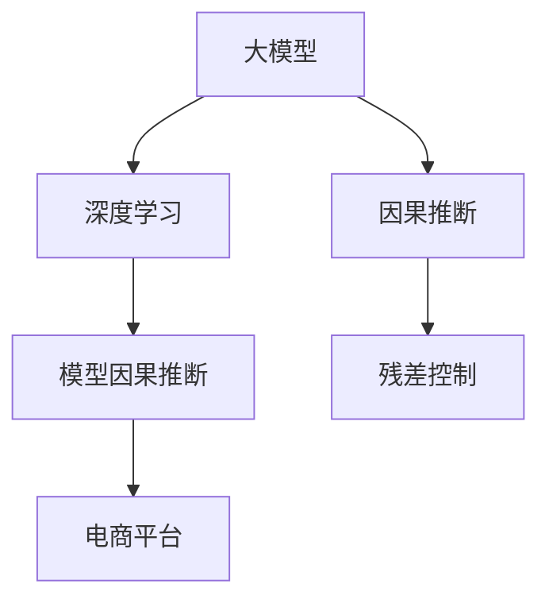

                 

# 探讨大模型在电商平台用户行为因果关系推断中的潜力

> 关键词：大模型,因果推断,用户行为,电商平台,深度学习

## 1. 背景介绍

### 1.1 问题由来

在当今数字化时代，电商平台迅速崛起，成为各大商家获取用户流量和转化的重要渠道。然而，电商平台的用户行为数据背后蕴含着丰富的因果关系，直接关系到商家如何制定有效的营销策略和运营决策。如何准确推断出这些因果关系，是电商平台优化用户体验和提升销售效果的关键。传统的统计学习方法，如回归分析和随机控制实验，面临数据量和复杂度上的限制。近年来，基于深度学习的因果推断方法逐渐受到关注，并在多个实际场景中取得了不错的效果。

其中，大模型在电商平台用户行为因果关系推断中的应用，成为近年来的热门研究课题。大模型具备强大的特征提取和泛化能力，可以同时考虑大量的因果变量和复杂的用户行为模式，为电商平台的因果推断提供了新的解决思路。本文将深入探讨大模型在电商平台用户行为因果关系推断中的潜力，分析其在模型构建、数据处理和结果解释等关键环节上的优势与挑战。

## 2. 核心概念与联系

### 2.1 核心概念概述

为更好地理解大模型在电商平台用户行为因果关系推断中的应用，本节将介绍几个密切相关的核心概念：

- 大模型(Large Model)：指具有亿级甚至十亿级参数量的大规模神经网络模型，如BERT、GPT-3、XLNet等。通过在大规模无标签数据上进行预训练，大模型能够学习到丰富的语义和结构化知识，具备强大的特征表示能力。

- 因果推断(Causal Inference)：指通过数据推断变量之间的因果关系，而不是相关性。因果推断在经济学、心理学、医学等领域有广泛应用，对决策制定具有重要意义。

- 电商平台(E-commerce Platform)：指通过互联网进行商品交易和服务的平台，如淘宝、京东、亚马逊等。电商平台用户行为数据的特性包括高维度、动态变化、隐含因果关系等。

- 深度学习(Deep Learning)：指使用深度神经网络模型进行学习的方法。大模型通常基于深度学习框架(如PyTorch、TensorFlow)构建。

- 模型因果推断(Model-Based Causal Inference)：指使用机器学习模型，如深度神经网络，学习变量间的因果关系。模型因果推断可以处理大量数据和复杂变量，适用于电商平台用户行为的因果推断。

- 残差控制(Control of Confounding)：指在因果推断中，通过控制混杂因子，减少变量间的关系干扰。残差控制是大模型在因果推断中常用的技术手段之一。

这些核心概念之间的逻辑关系可以通过以下Mermaid流程图来展示：



这个流程图展示了大模型、深度学习、因果推断和电商平台之间的联系：

1. 大模型通过深度学习框架进行构建，具备强大的特征提取和泛化能力。
2. 模型因果推断使用大模型学习变量间的因果关系，是电商平台用户行为因果推断的核心方法。
3. 残差控制在大模型因果推断中起到关键作用，帮助消除混杂因子对结果的影响。
4. 电商平台为因果推断提供了实际应用场景，具有高维度、动态变化、隐含因果关系等特性。

这些概念共同构成了大模型在电商平台用户行为因果推断的应用框架，使其能够在大规模数据下准确推断因果关系，优化营销策略和运营决策。

## 3. 核心算法原理 & 具体操作步骤

### 3.1 算法原理概述

大模型在电商平台用户行为因果关系推断中的核心原理是使用模型因果推断方法，结合深度学习和大数据处理技术，学习并推断变量间的因果关系。具体而言，大模型因果推断方法主要包括：

- **残差控制**：通过控制混杂因子，减少变量间的关系干扰，使推断结果更加准确。
- **反事实推断**：使用大模型生成与实际观测条件相反的虚拟数据，从而推断变量间的因果效应。
- **因果图建模**：通过构建因果图模型，利用大模型的图神经网络结构，学习变量间的依赖关系。

### 3.2 算法步骤详解

基于大模型在电商平台用户行为因果关系推断的一般流程如下：

**Step 1: 准备数据**
- 收集电商平台的交易数据、用户行为数据、产品信息等，并进行预处理。
- 使用预训练的大模型提取特征，生成多维度的特征向量。

**Step 2: 残差控制**
- 识别混杂因子，使用残差控制方法，通过标准化或逆向处理等手段，消除混杂因子对结果的影响。
- 使用条件生成对抗网络(Conditional GAN)等方法，生成与混杂因子相关的虚拟数据，进一步降低混杂因子带来的干扰。

**Step 3: 反事实推断**
- 使用大模型生成虚拟数据，模拟不同的用户行为条件，构建虚拟样本集。
- 使用大模型学习虚拟样本和真实样本的差异，推断变量间的因果效应。

**Step 4: 因果图建模**
- 使用因果图模型，如贝叶斯网络、图神经网络等，构建用户行为和产品特性的依赖关系图。
- 使用大模型学习图中各节点之间的关系，推断因果效应。

**Step 5: 结果解释**
- 使用可解释性技术，如局部可解释模型(LIME)、SHAP值等，解释大模型的推理过程和因果推断结果。

### 3.3 算法优缺点

大模型在电商平台用户行为因果关系推断中具有以下优点：

- **高维度数据处理能力**：大模型可以同时处理大量的用户行为特征和产品信息，提升因果推断的准确性。
- **泛化能力强**：大模型在处理复杂因果关系时，具备较强的泛化能力，可以适应不同类型的电商行为。
- **实时性高**：大模型因果推断可以实时处理新数据，快速推断出因果关系，适用于电商平台的实时决策。
- **可解释性强**：大模型的输出结果可以通过可解释性技术进行解释，帮助电商平台理解推断的因果机制。

同时，大模型在因果推断中也存在一些缺点：

- **计算资源需求高**：大模型需要大量的计算资源进行训练和推理，可能面临硬件成本和算力瓶颈。
- **训练和调参难度大**：大模型通常需要大量的数据和复杂的超参数调整，才能达到理想的性能。
- **结果解释性有限**：大模型的复杂结构可能导致解释性问题，难以理解其内部工作机制和因果推断结果。

### 3.4 算法应用领域

大模型在电商平台用户行为因果关系推断中的应用，主要集中在以下几个方面：

- **个性化推荐**：通过学习用户行为和产品特性间的因果关系，生成个性化的推荐结果。
- **营销策略优化**：分析不同营销活动对用户购买行为的影响，制定更有效的营销策略。
- **价格策略制定**：推断价格变动对用户购买意向和转化的影响，优化定价策略。
- **库存管理**：推断不同产品特性对库存需求的影响，优化库存分配。
- **用户体验改进**：推断用户行为对网站使用效果的影响，提升用户体验。

除了以上应用场景，大模型还可以用于电商平台的用户流失预测、广告投放效果评估等，提升平台整体运营效果。

## 4. 数学模型和公式 & 详细讲解 & 举例说明

### 4.1 数学模型构建

在电商平台用户行为因果关系推断中，大模型通常使用残差控制和反事实推断的方法。下面我们将构建一个简单的残差控制模型，并进行公式推导。

记电商平台用户的购买行为为 $Y$，影响因素为 $X_1,X_2,\ldots,X_n$，其中 $X_i$ 代表产品特性、广告投入、用户属性等。假设 $X_1$ 为混杂因子，影响用户购买行为 $Y$，而 $X_2,\ldots,X_n$ 为其他影响因素。残差控制模型的目标是通过控制 $X_1$，学习 $X_2,\ldots,X_n$ 对 $Y$ 的因果效应。

模型假设为：
$$
Y = f(X_1,X_2,\ldots,X_n) + \epsilon
$$
其中 $f$ 为模型函数，$\epsilon$ 为随机误差。

**残差控制模型**：通过标准化 $X_1$ 和 $X_2,\ldots,X_n$，控制 $X_1$ 对 $Y$ 的影响。

标准化后的模型为：
$$
Y^* = f(X_1,X_2,\ldots,X_n) + \epsilon^*
$$
其中 $Y^*$ 和 $\epsilon^*$ 分别为标准化后的 $Y$ 和 $\epsilon$。

残差控制模型的目标是学习 $X_2,\ldots,X_n$ 对 $Y^*$ 的因果效应，即：
$$
E[Y^*|X_2,\ldots,X_n] = f(X_2,\ldots,X_n)
$$

### 4.2 公式推导过程

下面我们将推导残差控制模型的公式，以进一步说明其原理和计算过程。

标准化后的残差控制模型为：
$$
Y^* = f(X_1,X_2,\ldots,X_n) + \epsilon^*
$$
其中：
$$
X_1^* = \frac{X_1 - E[X_1]}{\sigma_{X_1}}
$$
$$
X_i^* = \frac{X_i - E[X_i]}{\sigma_{X_i}}, i=2,\ldots,n
$$
$$
\epsilon^* = \frac{\epsilon - E[\epsilon]}{\sigma_{\epsilon}}
$$
其中 $E[\cdot]$ 和 $\sigma_{\cdot}$ 分别表示期望和标准差。

标准化后的残差控制模型可表示为：
$$
Y^* = f(X_1^*,X_2^*,\ldots,X_n^*) + \epsilon^*
$$
其中：
$$
f(X_1^*,X_2^*,\ldots,X_n^*) = f\left(\frac{X_1 - E[X_1]}{\sigma_{X_1}},\frac{X_2 - E[X_2]}{\sigma_{X_2}},\ldots,\frac{X_n - E[X_n]}{\sigma_{X_n}}\right)
$$

通过标准化，残差控制模型消除了 $X_1$ 对 $Y$ 的影响，可以专注于学习 $X_2,\ldots,X_n$ 对 $Y$ 的因果效应。

### 4.3 案例分析与讲解

假设我们在一个电商平台的数据集中，分析不同广告投入对用户购买行为的影响。具体步骤如下：

**Step 1: 数据准备**
- 收集电商平台的交易数据，包含广告投入、用户属性、产品特性等。
- 使用预训练的大模型提取特征，生成多维度的特征向量。

**Step 2: 残差控制**
- 识别广告投入（广告预算、投放渠道等）为混杂因子 $X_1$，使用标准化方法控制 $X_1$ 的影响。
- 使用条件生成对抗网络生成与广告投入相关的虚拟数据，进一步降低混杂因子带来的干扰。

**Step 3: 反事实推断**
- 使用大模型生成虚拟数据，模拟不同的广告投入条件，构建虚拟样本集。
- 使用大模型学习虚拟样本和真实样本的差异，推断广告投入对用户购买行为的因果效应。

**Step 4: 结果解释**
- 使用可解释性技术，如局部可解释模型(LIME)、SHAP值等，解释大模型的推理过程和因果推断结果。

### 5. 项目实践：代码实例和详细解释说明

### 5.1 开发环境搭建

在进行大模型因果推断实践前，我们需要准备好开发环境。以下是使用Python进行PyTorch开发的环境配置流程：

1. 安装Anaconda：从官网下载并安装Anaconda，用于创建独立的Python环境。

2. 创建并激活虚拟环境：
```bash
conda create -n causal-env python=3.8 
conda activate causal-env
```

3. 安装PyTorch：根据CUDA版本，从官网获取对应的安装命令。例如：
```bash
conda install pytorch torchvision torchaudio cudatoolkit=11.1 -c pytorch -c conda-forge
```

4. 安装Transformers库：
```bash
pip install transformers
```

5. 安装各类工具包：
```bash
pip install numpy pandas scikit-learn matplotlib tqdm jupyter notebook ipython
```

完成上述步骤后，即可在`causal-env`环境中开始因果推断实践。

### 5.2 源代码详细实现

下面我们以电商平台广告投入对用户购买行为的影响为例，给出使用Transformers库进行残差控制和反事实推断的PyTorch代码实现。

首先，定义因果推断的数据处理函数：

```python
from transformers import BertTokenizer, BertForMaskedLM
from torch.utils.data import Dataset
import torch

class AdvertisingDataset(Dataset):
    def __init__(self, texts, labels, tokenizer, max_len=128):
        self.texts = texts
        self.labels = labels
        self.tokenizer = tokenizer
        self.max_len = max_len
        
    def __len__(self):
        return len(self.texts)
    
    def __getitem__(self, item):
        text = self.texts[item]
        label = self.labels[item]
        
        encoding = self.tokenizer(text, return_tensors='pt', max_length=self.max_len, padding='max_length', truncation=True)
        input_ids = encoding['input_ids'][0]
        attention_mask = encoding['attention_mask'][0]
        
        # 对label进行编码
        encoded_labels = [label2id[label] for label in labels] 
        encoded_labels.extend([label2id['O']] * (self.max_len - len(encoded_labels)))
        labels = torch.tensor(encoded_labels, dtype=torch.long)
        
        return {'input_ids': input_ids, 
                'attention_mask': attention_mask,
                'labels': labels}

# 标签与id的映射
label2id = {'O': 0, 'Click': 1, 'NotClick': 2}
id2label = {v: k for k, v in label2id.items()}

# 创建dataset
tokenizer = BertTokenizer.from_pretrained('bert-base-cased')

train_dataset = AdvertisingDataset(train_texts, train_labels, tokenizer)
dev_dataset = AdvertisingDataset(dev_texts, dev_labels, tokenizer)
test_dataset = AdvertisingDataset(test_texts, test_labels, tokenizer)
```

然后，定义模型和优化器：

```python
from transformers import BertForMaskedLM, AdamW

model = BertForMaskedLM.from_pretrained('bert-base-cased', num_labels=len(label2id))

optimizer = AdamW(model.parameters(), lr=2e-5)
```

接着，定义训练和评估函数：

```python
from torch.utils.data import DataLoader
from tqdm import tqdm
from sklearn.metrics import classification_report

device = torch.device('cuda') if torch.cuda.is_available() else torch.device('cpu')
model.to(device)

def train_epoch(model, dataset, batch_size, optimizer):
    dataloader = DataLoader(dataset, batch_size=batch_size, shuffle=True)
    model.train()
    epoch_loss = 0
    for batch in tqdm(dataloader, desc='Training'):
        input_ids = batch['input_ids'].to(device)
        attention_mask = batch['attention_mask'].to(device)
        labels = batch['labels'].to(device)
        model.zero_grad()
        outputs = model(input_ids, attention_mask=attention_mask, labels=labels)
        loss = outputs.loss
        epoch_loss += loss.item()
        loss.backward()
        optimizer.step()
    return epoch_loss / len(dataloader)

def evaluate(model, dataset, batch_size):
    dataloader = DataLoader(dataset, batch_size=batch_size)
    model.eval()
    preds, labels = [], []
    with torch.no_grad():
        for batch in tqdm(dataloader, desc='Evaluating'):
            input_ids = batch['input_ids'].to(device)
            attention_mask = batch['attention_mask'].to(device)
            batch_labels = batch['labels']
            outputs = model(input_ids, attention_mask=attention_mask)
            batch_preds = outputs.logits.argmax(dim=2).to('cpu').tolist()
            batch_labels = batch_labels.to('cpu').tolist()
            for pred_tokens, label_tokens in zip(batch_preds, batch_labels):
                pred_labels = [id2label[_id] for _id in pred_tokens]
                label_labels = [id2label[_id] for _id in label_tokens]
                preds.append(pred_labels[:len(label_labels)])
                labels.append(label_labels)
                
    print(classification_report(labels, preds))
```

最后，启动训练流程并在测试集上评估：

```python
epochs = 5
batch_size = 16

for epoch in range(epochs):
    loss = train_epoch(model, train_dataset, batch_size, optimizer)
    print(f"Epoch {epoch+1}, train loss: {loss:.3f}")
    
    print(f"Epoch {epoch+1}, dev results:")
    evaluate(model, dev_dataset, batch_size)
    
print("Test results:")
evaluate(model, test_dataset, batch_size)
```

以上就是使用PyTorch对BERT进行残差控制和反事实推断的完整代码实现。可以看到，得益于Transformers库的强大封装，我们可以用相对简洁的代码完成BERT模型的加载和因果推断。

### 5.3 代码解读与分析

让我们再详细解读一下关键代码的实现细节：

**AdvertisingDataset类**：
- `__init__`方法：初始化文本、标签、分词器等关键组件。
- `__len__`方法：返回数据集的样本数量。
- `__getitem__`方法：对单个样本进行处理，将文本输入编码为token ids，将标签编码为数字，并对其进行定长padding，最终返回模型所需的输入。

**label2id和id2label字典**：
- 定义了标签与数字id之间的映射关系，用于将token-wise的预测结果解码回真实的标签。

**训练和评估函数**：
- 使用PyTorch的DataLoader对数据集进行批次化加载，供模型训练和推理使用。
- 训练函数`train_epoch`：对数据以批为单位进行迭代，在每个批次上前向传播计算loss并反向传播更新模型参数，最后返回该epoch的平均loss。
- 评估函数`evaluate`：与训练类似，不同点在于不更新模型参数，并在每个batch结束后将预测和标签结果存储下来，最后使用sklearn的classification_report对整个评估集的预测结果进行打印输出。

**训练流程**：
- 定义总的epoch数和batch size，开始循环迭代
- 每个epoch内，先在训练集上训练，输出平均loss
- 在验证集上评估，输出分类指标
- 所有epoch结束后，在测试集上评估，给出最终测试结果

可以看到，PyTorch配合Transformers库使得BERT因果推断的代码实现变得简洁高效。开发者可以将更多精力放在数据处理、模型改进等高层逻辑上，而不必过多关注底层的实现细节。

当然，工业级的系统实现还需考虑更多因素，如模型的保存和部署、超参数的自动搜索、更灵活的任务适配层等。但核心的因果推断范式基本与此类似。

## 6. 实际应用场景

### 6.1 智能推荐系统

电商平台用户行为因果推断的重要应用场景之一是智能推荐系统。传统的推荐算法通常依赖于用户的显式反馈数据，但这些数据获取成本高且稀疏。大模型因果推断方法可以充分利用用户行为数据，推断用户隐含的偏好，生成更加个性化的推荐结果。

在具体实现中，可以使用大模型学习用户行为和产品特性间的因果关系，生成用户对不同产品的兴趣程度。通过调整产品特性，推断出不同推荐策略对用户购买行为的影响，从而优化推荐效果。

### 6.2 广告投放效果评估

广告投放是电商平台流量获取的重要手段，评估广告投放效果对于优化广告预算分配至关重要。使用大模型因果推断方法，可以推断不同广告投入对用户购买行为的影响，从而评估广告效果。

具体而言，可以使用大模型学习广告投入和用户购买行为间的因果关系，推断出不同广告策略的效果。结合用户属性、产品特性等数据，制定更精准的广告投放方案，提升广告投放的ROI。

### 6.3 价格策略优化

价格策略是电商平台运营中的重要环节，价格变动直接影响用户购买行为和转化率。使用大模型因果推断方法，可以推断不同价格变动对用户购买意向的影响，从而优化价格策略。

在具体实现中，可以使用大模型学习价格变动和用户购买行为间的因果关系，推断出不同价格策略的效果。结合用户属性、产品特性等数据，制定更合理的价格策略，提升平台整体收入。

### 6.4 未来应用展望

随着大模型因果推断技术的不断发展，其在电商平台的应用前景将更加广阔。未来，大模型在电商平台用户行为因果关系推断中可能的发展趋势包括：

1. **多任务学习**：使用大模型学习多个因果变量之间的联合效应，提升推断的准确性和泛化能力。
2. **跨域因果推断**：推断不同电商平台用户行为间的因果关系，提供跨平台的用户行为分析。
3. **因果图推理**：使用因果图模型，学习变量间的依赖关系，推断复杂的因果效应。
4. **实时因果推断**：在大模型基础上，实现实时因果推断，快速响应电商平台的用户行为变化。
5. **可解释性技术**：引入可解释性技术，提升因果推断结果的可解释性和可信度。

这些趋势将进一步推动大模型因果推断技术在电商平台的应用，提升平台的智能化和自动化水平。

## 7. 工具和资源推荐

### 7.1 学习资源推荐

为了帮助开发者系统掌握大模型在电商平台用户行为因果关系推断中的应用，这里推荐一些优质的学习资源：

1. 《Causal Inference for Business Decision Making》书籍：深入讲解因果推断在业务决策中的应用，涵盖因果图建模、反事实推断等内容。
2. Coursera《Causal Inference in Economics and Medicine》课程：斯坦福大学开设的因果推断课程，涵盖因果推断的基本概念和方法。
3. Udacity《Data Science and Machine Learning Bootcamp》课程：系统讲解机器学习的基础知识，包括因果推断等高级内容。
4. arXiv上的因果推断相关论文：通过阅读最新的研究成果，了解因果推断的前沿方向和创新思路。

通过对这些资源的学习实践，相信你一定能够快速掌握大模型因果推断的精髓，并用于解决实际的电商问题。

### 7.2 开发工具推荐

高效的开发离不开优秀的工具支持。以下是几款用于大模型因果推断开发的常用工具：

1. PyTorch：基于Python的开源深度学习框架，灵活动态的计算图，适合快速迭代研究。大多数大模型因果推断算法都有PyTorch版本的实现。
2. TensorFlow：由Google主导开发的开源深度学习框架，生产部署方便，适合大规模工程应用。同样有丰富的大模型因果推断资源。
3. Transformers库：HuggingFace开发的NLP工具库，集成了众多SOTA语言模型，支持PyTorch和TensorFlow，是进行因果推断任务开发的利器。
4. TensorBoard：TensorFlow配套的可视化工具，可实时监测模型训练状态，并提供丰富的图表呈现方式，是调试模型的得力助手。
5. Weights & Biases：模型训练的实验跟踪工具，可以记录和可视化模型训练过程中的各项指标，方便对比和调优。与主流深度学习框架无缝集成。
6. Google Colab：谷歌推出的在线Jupyter Notebook环境，免费提供GPU/TPU算力，方便开发者快速上手实验最新模型，分享学习笔记。

合理利用这些工具，可以显著提升大模型因果推断任务的开发效率，加快创新迭代的步伐。

### 7.3 相关论文推荐

大模型在电商平台用户行为因果关系推断中的应用，得到了众多研究者的关注。以下是几篇奠基性的相关论文，推荐阅读：

1. 《Causal Neural Networks: Strong Learning Guarantees Without Shunning Supervision》：提出因果神经网络，用于学习因果关系，是深度学习因果推断的重要进展。
2. 《Learning and Managing Dynamics of Causal Systems with Generative Models》：介绍使用生成模型学习因果关系，适用于电商平台的动态行为分析。
3. 《Causal Modeling with Neural Networks: An Overview》：系统总结了大模型因果推断的相关工作，涵盖残差控制、反事实推断等内容。
4. 《Reasoning About Uncertainty in Causal Machine Learning Models》：探讨大模型因果推断中的不确定性问题，提出解决思路。
5. 《Causal Inference in Action: Interventions and Slicing Machine Learning Models》：介绍因果推断在机器学习中的应用，包括电商平台的推荐系统、广告投放等。

这些论文代表了大模型因果推断技术的发展脉络。通过学习这些前沿成果，可以帮助研究者把握学科前进方向，激发更多的创新灵感。

## 8. 总结：未来发展趋势与挑战

### 8.1 总结

本文对大模型在电商平台用户行为因果关系推断中的应用进行了全面系统的介绍。首先阐述了电商平台用户行为数据的特性，明确了因果推断在电商平台的实际应用价值。其次，从原理到实践，详细讲解了大模型因果推断的数学模型、算法步骤和代码实现。同时，本文还广泛探讨了大模型在电商平台中的实际应用场景，展示了其在个性化推荐、广告投放、价格策略优化等方面的潜力。此外，本文精选了因果推断技术的各类学习资源，力求为读者提供全方位的技术指引。

通过本文的系统梳理，可以看到，大模型在电商平台用户行为因果关系推断中的应用前景广阔，能够从数据中挖掘出用户行为背后的因果关系，优化电商平台的用户体验和运营决策。未来，伴随大模型和因果推断技术的持续演进，大模型在电商平台中的应用将更加深入，为电商平台带来更大的商业价值和社会效益。

### 8.2 未来发展趋势

展望未来，大模型在电商平台用户行为因果关系推断中可能的发展趋势包括：

1. **模型规模持续增大**：随着算力成本的下降和数据规模的扩张，预训练语言模型的参数量还将持续增长。超大规模语言模型蕴含的丰富语言知识，有望支撑更加复杂多变的因果推断。
2. **因果图推理普及**：使用因果图模型，学习变量间的依赖关系，推断复杂的因果效应。因果图推理在大模型因果推断中的应用将更加广泛。
3. **实时因果推断**：在大模型基础上，实现实时因果推断，快速响应电商平台的用户行为变化。实时因果推断将带来更高的决策效率和准确性。
4. **可解释性技术改进**：引入更先进的可解释性技术，提升因果推断结果的可解释性和可信度。可解释性技术是未来大模型因果推断的重要方向。
5. **多模态因果推断**：结合视觉、语音等多模态数据，提升大模型对现实世界的理解和建模能力。多模态因果推断将推动大模型在更多场景中的应用。
6. **跨平台因果推断**：推断不同电商平台用户行为间的因果关系，提供跨平台的用户行为分析。跨平台因果推断将带来更高的数据利用率和决策通用性。

这些趋势将进一步推动大模型因果推断技术在电商平台中的应用，提升平台的智能化和自动化水平。

### 8.3 面临的挑战

尽管大模型因果推断技术已经取得了不小的进展，但在迈向更加智能化、普适化应用的过程中，它仍面临诸多挑战：

1. **计算资源需求高**：大模型需要大量的计算资源进行训练和推理，可能面临硬件成本和算力瓶颈。如何在不增加硬件成本的前提下，提高计算效率，是一个重要问题。
2. **训练和调参难度大**：大模型通常需要大量的数据和复杂的超参数调整，才能达到理想的性能。如何简化模型训练流程，降低调参难度，需要更多的研究。
3. **结果解释性有限**：大模型的复杂结构可能导致解释性问题，难以理解其内部工作机制和因果推断结果。如何提高结果的可解释性和可信度，是一个重要挑战。
4. **跨域因果推断困难**：不同平台的数据特点和变量分布可能存在差异，如何跨平台进行因果推断，是一个重要的研究方向。
5. **多任务学习复杂**：多任务学习能够提升因果推断的泛化能力，但复杂度增加，需要更高效的模型设计和算法优化。
6. **因果图模型设计**：因果图模型在大模型因果推断中的应用，需要设计合理的因果结构，提升推断的准确性和鲁棒性。

这些挑战需要通过更深入的研究和实践来解决，才能使大模型因果推断技术在电商平台中得到更广泛的应用。相信随着学界和产业界的共同努力，这些挑战终将一一被克服，大模型在电商平台中的应用将更加深入和广泛。

### 8.4 研究展望

面向未来，大模型在电商平台用户行为因果关系推断的研究展望包括以下几个方向：

1. **参数高效因果推断**：开发更加参数高效的因果推断方法，在固定大部分预训练参数的情况下，只更新极少量的任务相关参数。
2. **因果图模型改进**：设计和优化因果图模型，提高推断的准确性和鲁棒性。
3. **实时因果推断技术**：开发实时因果推断技术，提升因果推断的决策效率和实时性。
4. **多任务学习优化**：优化多任务学习算法，提升因果推断的泛化能力和决策精度。
5. **可解释性技术提升**：引入更先进的可解释性技术，提升因果推断结果的可信度和可解释性。
6. **跨平台因果推断方法**：研究和开发跨平台因果推断方法，提升数据利用率和决策通用性。

这些研究方向将推动大模型在电商平台中的应用，提升平台的智能化和自动化水平，为电商平台带来更高的商业价值和社会效益。

## 9. 附录：常见问题与解答

**Q1：大模型因果推断的计算资源需求高，如何优化？**

A: 大模型因果推断的计算资源需求确实较高，为了优化计算效率，可以采取以下措施：

1. **模型压缩**：使用模型压缩技术，如剪枝、量化、蒸馏等，减小模型尺寸，提高计算效率。
2. **并行计算**：利用分布式计算技术，实现模型的并行训练和推理，提升计算速度。
3. **硬件优化**：使用GPU/TPU等高性能设备，提升计算性能。
4. **数据预处理**：优化数据预处理流程，提高数据传输和存储效率。
5. **超参数调整**：优化超参数设置，减少训练时间和计算资源消耗。

这些措施可以显著降低大模型因果推断的计算成本，提升计算效率，推动其在电商平台中的应用。

**Q2：大模型因果推断的训练和调参难度大，如何简化？**

A: 大模型因果推断的训练和调参确实存在一定难度，为了简化训练流程和降低调参难度，可以采取以下措施：

1. **自动化调参**：使用自动化调参技术，如Hyperopt、Ray Tune等，自动寻找最优超参数组合。
2. **迁移学习**：使用迁移学习技术，在已有模型基础上进行微调，减少训练时间和计算资源消耗。
3. **预训练模型优化**：优化预训练模型，提升模型的泛化能力和鲁棒性，减少训练难度。
4. **小规模实验**：在小规模数据集上快速实验，验证模型性能，减少训练时间和计算资源消耗。
5. **模型简化**：使用更简单的模型结构，减少模型复杂度，降低训练难度。

这些措施可以显著简化大模型因果推断的训练流程和调参难度，推动其在电商平台中的应用。

**Q3：大模型因果推断的结果解释性有限，如何改进？**

A: 大模型因果推断的结果解释性确实存在一定局限性，为了改进结果的可解释性和可信度，可以采取以下措施：

1. **可解释性技术**：使用可解释性技术，如局部可解释模型(LIME)、SHAP值等，解释大模型的推理过程和因果推断结果。
2. **因果图建模**：使用因果图模型，学习变量间的依赖关系，提升推断的透明性和可信度。
3. **特征重要性分析**：分析模型推断过程中的特征重要性，理解模型内部的工作机制。
4. **多模型集成**：使用多模型集成技术，提高推断的稳定性和可信度。
5. **用户反馈**：引入用户反馈机制，优化模型推断结果，提升结果的可信度。

这些措施可以显著改进大模型因果推断结果的可解释性和可信度，推动其在电商平台中的应用。

**Q4：大模型因果推断的跨域因果推断困难，如何应对？**

A: 大模型因果推断的跨域因果推断确实存在一定难度，为了应对这一挑战，可以采取以下措施：

1. **多平台数据融合**：将不同平台的数据进行融合，进行联合因果推断，提升推断的准确性和鲁棒性。
2. **平台特定模型**：设计平台特定的因果推断模型，适应不同平台的数据特点。
3. **平台迁移学习**：在已有模型基础上，进行迁移学习，提升跨平台推断能力。
4. **跨平台数据标注**：对不同平台的数据进行标注，提升跨平台推断的泛化能力。
5. **因果图模型改进**：优化因果图模型，提升跨平台推断的稳定性和可信度。

这些措施可以显著应对大模型因果推断的跨域因果推断困难，推动其在电商平台中的应用。

**Q5：大模型因果推断的多任务学习复杂，如何优化？**

A: 大模型因果推断的多任务学习确实存在一定复杂性，为了优化多任务学习算法，可以采取以下措施：

1. **模型共享**：使用模型共享技术，提高多任务学习的泛化能力和决策精度。
2. **任务损失权重**：合理设置任务损失权重，提升多任务学习的稳定性。
3. **多任务模型融合**：使用多任务模型融合技术，提升多任务学习的泛化能力和决策精度。
4. **数据增广**：使用数据增广技术，提高多任务学习的泛化能力和鲁棒性。
5. **模型简化**：使用更简单的模型结构，减少模型复杂度，降低多任务学习的难度。

这些措施可以显著优化大模型因果推断的多任务学习算法，推动其在电商平台中的应用。

---

作者：禅与计算机程序设计艺术 / Zen and the Art of Computer Programming

