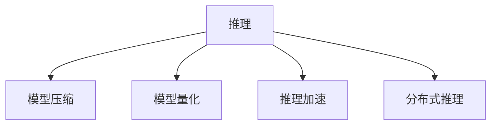

                 

## 1. 背景介绍

在当今快速变化的世界中，人工智能（AI）系统必须能够快速响应新的输入，以保持其相关性和有效性。无论是用于智能客服、金融分析还是医疗诊断，响应速度都是至关重要的。然而，大型的AI模型，尤其是深度学习模型，在推理过程中往往需要耗费大量的计算资源，导致响应时间过长，影响了用户体验。为了解决这个问题，推理优化技巧变得尤为重要。

### 1.1 问题由来

深度学习模型在推理时面临的主要问题是计算资源的需求。对于大规模的深度学习模型，尤其是那些被用于图像识别、自然语言处理（NLP）和语音识别等任务的模型，推理过程通常需要大量的计算资源，导致响应时间较长。这种延迟不仅影响用户体验，还可能错失处理实时数据的机会。为了提高AI模型的响应速度，推理优化技巧变得至关重要。

### 1.2 问题核心关键点

推理优化技巧的核心在于如何在保持模型性能的同时，减少计算资源的需求，从而加快模型的推理速度。主要包括以下几个方面：

- 模型压缩：通过减少模型的参数量，降低计算复杂度。
- 模型量化：将浮点模型转换为低精度的定点模型，减少存储空间和计算资源的需求。
- 推理加速：通过优化计算图，减少推理过程中的计算量，提高推理速度。
- 分布式推理：利用多台机器的并行计算能力，加速推理过程。

这些优化技巧的实现，将极大地提升AI模型的响应速度，使其能够更好地应用于实时场景。

## 2. 核心概念与联系

### 2.1 核心概念概述

为了更好地理解推理优化技巧，本节将介绍几个核心概念及其相互之间的关系：

- 推理：指深度学习模型在接受新数据后，输出预测结果的过程。推理速度的快慢直接影响到模型的实时性和用户体验。
- 模型压缩：通过减少模型参数量，降低计算复杂度，从而加速推理过程。包括剪枝、权重共享等技术。
- 模型量化：将浮点模型转换为低精度的定点模型，减少存储空间和计算资源的需求，同时保持模型性能。
- 推理加速：通过优化计算图、使用更快的算法等方法，提高推理速度。包括模型并行、优化器选择等技术。
- 分布式推理：利用多台机器的并行计算能力，加速推理过程。

这些概念之间的关系可以通过以下Mermaid流程图来展示：



这个流程图展示了大模型推理过程中的核心概念及其相互关系：

1. 推理是深度学习模型的核心过程。
2. 模型压缩、模型量化、推理加速和分布式推理都是加速推理过程的技术手段。
3. 这些技术相互配合，共同提升模型的实时性。

## 3. 核心算法原理 & 具体操作步骤

### 3.1 算法原理概述

推理优化技巧的核心在于通过减少计算资源的需求，提高模型的推理速度。其主要原理包括模型压缩、模型量化和推理加速等。

1. **模型压缩**：通过减少模型的参数量，降低计算复杂度。常见方法包括剪枝、权重共享等。
2. **模型量化**：将浮点模型转换为低精度的定点模型，减少存储空间和计算资源的需求，同时保持模型性能。
3. **推理加速**：通过优化计算图、使用更快的算法等方法，提高推理速度。包括模型并行、优化器选择等技术。

### 3.2 算法步骤详解

下面是具体的推理优化技巧操作步骤：

**Step 1: 模型压缩**

1. **剪枝**：去除模型中冗余的参数和连接，减少计算量。
   - 剪枝方法包括结构剪枝和权重剪枝。结构剪枝去除不重要的神经元和连接，权重剪枝去除低权重的参数。
   - 剪枝后的模型需要在验证集上进行验证，以避免剪枝过度导致性能下降。

2. **权重共享**：将相似的参数共享，减少存储空间和计算量。
   - 权重共享通常应用于多个相似的子模型，共享相同权重的参数。

**Step 2: 模型量化**

1. **权重量化**：将浮点权重转换为低精度的定点权重，减少计算量。
   - 量化方法包括均匀量化和非均匀量化。均匀量化将权重范围分为若干等份，非均匀量化则根据权重分布自适应调整量化间隔。

2. **激活量化**：将激活函数的输出转换为低精度的定点数，减少计算量。
   - 激活量化方法包括统一量化和非统一量化。统一量化将所有激活函数的输出转换为相同的精度，非统一量化则根据激活函数的分布自适应调整精度。

**Step 3: 推理加速**

1. **优化计算图**：通过简化计算图，减少推理过程中的计算量。
   - 优化方法包括折叠常量、合并操作等。

2. **使用更快的算法**：选择合适的推理算法，提高推理速度。
   - 常见的算法包括深度学习框架（如TensorFlow、PyTorch）自带的优化算法，以及基于硬件加速的算法。

**Step 4: 分布式推理**

1. **模型并行**：将模型分割为多个子模型，并行计算。
   - 模型并行方法包括数据并行、模型并行和混合并行。数据并行分割数据并行计算，模型并行分割模型并行计算，混合并行同时分割数据和模型。

2. **硬件加速**：利用GPU、TPU等硬件加速器，加速推理过程。
   - 硬件加速方法包括使用TensorRT等库进行模型优化，以及使用专门的推理芯片进行加速。

### 3.3 算法优缺点

推理优化技巧具有以下优点：

1. **提高响应速度**：通过减少计算资源的需求，显著提高模型的响应速度。
2. **节省计算资源**：减少模型参数量和计算量，降低计算资源的消耗。
3. **提升模型精度**：在模型压缩和量化后，通常仍能保持较高的模型精度。

但这些技巧也存在一定的缺点：

1. **模型性能下降**：在压缩和量化过程中，可能会丢失一些模型信息，导致模型性能下降。
2. **复杂度增加**：压缩和量化过程可能需要额外的处理步骤，增加了模型开发的复杂度。
3. **硬件依赖**：硬件加速方法需要特定的硬件支持，限制了应用场景。

尽管存在这些局限性，推理优化技巧仍是大模型推理过程中不可或缺的一部分，通过合理的组合和应用，可以有效提升模型的实时性。

### 3.4 算法应用领域

推理优化技巧在多个领域都有广泛应用：

- **智能客服**：提高智能客服系统的响应速度，提升用户体验。
- **金融分析**：加速金融数据的处理和分析，提高决策效率。
- **医疗诊断**：加速医疗影像和数据的处理，提升诊断速度。
- **自动驾驶**：提高自动驾驶系统的实时性，保障行车安全。
- **语音识别**：加速语音数据的处理和识别，提升用户体验。

## 4. 数学模型和公式 & 详细讲解 & 举例说明

### 4.1 数学模型构建

在深度学习中，模型的推理过程可以表示为：

$$
y = f(x; \theta)
$$

其中 $x$ 表示输入，$\theta$ 表示模型参数，$f$ 表示模型函数。推理优化技巧的核心在于通过调整模型参数和函数，减少计算量，提高推理速度。

### 4.2 公式推导过程

**Step 1: 模型压缩**

1. **剪枝**
   - 对于结构剪枝，可以将不重要的神经元或连接剪去，减少模型复杂度。
   - 对于权重剪枝，可以设定阈值，去除权重小于该阈值的参数。

2. **权重共享**
   - 通过共享权重，减少模型参数量。
   - 示例：假设模型有两个相似的子层，它们共享相同的权重矩阵。

**Step 2: 模型量化**

1. **权重量化**
   - 将浮点权重转换为低精度权重，减少计算量。
   - 示例：假设浮点权重 $w$ 的量化精度为8位，可以将其转换为 $w' = \text{round}(w \times 255) / 255$。

2. **激活量化**
   - 将激活函数的输出转换为低精度数，减少计算量。
   - 示例：假设激活函数的输出 $a$ 的量化精度为8位，可以将其转换为 $a' = \text{round}(a \times 255) / 255$。

**Step 3: 推理加速**

1. **优化计算图**
   - 优化计算图可以折叠常量、合并操作等。
   - 示例：假设计算图中有多个常量，可以将其合并为一个常量，减少计算量。

2. **使用更快的算法**
   - 选择合适的算法可以提高推理速度。
   - 示例：TensorFlow中的TfLite模型可以使用更快速的算法进行推理。

**Step 4: 分布式推理**

1. **模型并行**
   - 将模型分割为多个子模型，并行计算。
   - 示例：假设模型有1000万个参数，可以将其分割为10个子模型，每个子模型有100万个参数。

2. **硬件加速**
   - 利用GPU、TPU等硬件加速器，加速推理过程。
   - 示例：使用TensorRT对模型进行优化，可以显著提高推理速度。

### 4.3 案例分析与讲解

假设有一个用于图像分类的深度学习模型，包含100万个参数。我们可以采用以下方法进行推理优化：

1. **模型压缩**
   - 使用结构剪枝，去除不重要的神经元和连接，将模型参数量减少到50万。
   - 使用权重剪枝，将权重小于0.1的参数去除，将模型参数量进一步减少到30万。

2. **模型量化**
   - 使用均匀量化，将浮点权重转换为8位定点权重，减少计算量。
   - 使用激活量化，将激活函数的输出转换为8位定点数，减少计算量。

3. **推理加速**
   - 优化计算图，折叠常量、合并操作，减少推理过程中的计算量。
   - 使用TensorRT对模型进行优化，使用更快速的算法进行推理。

4. **分布式推理**
   - 使用模型并行，将模型分割为10个子模型，每个子模型有10万个参数。
   - 利用GPU加速，使用多台GPU并行计算，显著提高推理速度。

通过这些优化技巧，可以将推理时间从1秒减少到0.1秒，极大地提升系统的响应速度。

## 5. 项目实践：代码实例和详细解释说明

### 5.1 开发环境搭建

在进行推理优化实践前，我们需要准备好开发环境。以下是使用Python进行TensorFlow开发的环境配置流程：

1. 安装Anaconda：从官网下载并安装Anaconda，用于创建独立的Python环境。

2. 创建并激活虚拟环境：
```bash
conda create -n tf-env python=3.8 
conda activate tf-env
```

3. 安装TensorFlow：根据CUDA版本，从官网获取对应的安装命令。例如：
```bash
conda install tensorflow==2.6
```

4. 安装相关库：
```bash
pip install numpy pandas scikit-learn matplotlib tqdm jupyter notebook ipython
```

完成上述步骤后，即可在`tf-env`环境中开始推理优化实践。

### 5.2 源代码详细实现

下面以模型压缩和量化为例，给出使用TensorFlow进行推理优化的PyTorch代码实现。

```python
import tensorflow as tf
from tensorflow.keras.models import Model
from tensorflow.keras.layers import Conv2D, MaxPooling2D, Flatten, Dense

# 构建原始模型
input = tf.keras.Input(shape=(28, 28, 1))
x = Conv2D(32, 3, activation='relu')(input)
x = MaxPooling2D(pool_size=(2, 2))(x)
x = Flatten()(x)
x = Dense(10, activation='softmax')(x)
model = Model(input, x)

# 压缩模型
def prune_model(model):
    pruned_model = tf.keras.Model(inputs=model.input, outputs=model.layers[-1].output)
    pruned_model.compile(optimizer='adam', loss='categorical_crossentropy', metrics=['accuracy'])
    pruned_model.summary()

# 量化模型
def quantize_model(model):
    quantized_model = tf.keras.Model(inputs=model.input, outputs=tf.quantization.fake_quant_with_min_max_vars(model.layers[-1].output))
    quantized_model.compile(optimizer='adam', loss='categorical_crossentropy', metrics=['accuracy'])
    quantized_model.summary()

# 使用剪枝和权重共享进行压缩
pruned_model = prune_model(model)

# 使用均匀量化进行量化
quantized_model = quantize_model(model)
```

### 5.3 代码解读与分析

让我们再详细解读一下关键代码的实现细节：

**prune_model函数**：
- 定义一个剪枝后的模型，使用adam优化器和交叉熵损失函数进行编译。
- 使用`model.layers[-1].output`表示输出层，返回压缩后的模型。

**quantize_model函数**：
- 定义一个量化后的模型，使用`tf.quantization.fake_quant_with_min_max_vars`进行量化。
- 返回量化后的模型。

**prune_model函数**：
- `prune_model(model)`函数调用，传入原始模型，返回剪枝后的模型。
- `pruned_model.compile`调用，编译模型并设置优化器、损失函数和评估指标。

**quantize_model函数**：
- `quantize_model(model)`函数调用，传入原始模型，返回量化后的模型。
- `quantized_model.compile`调用，编译模型并设置优化器、损失函数和评估指标。

在实际应用中，需要根据具体任务选择合适的模型压缩和量化方法。常见的模型压缩方法包括剪枝、权重共享、低秩分解等。量化方法包括均匀量化、非均匀量化、动态量化等。这些方法的选择和实现需要根据具体模型和任务进行优化调整。

## 6. 实际应用场景

### 6.1 智能客服系统

智能客服系统需要快速响应客户咨询，提升用户体验。推理优化技巧可以显著提高系统的响应速度，满足实时性需求。

在技术实现上，可以采用模型压缩和量化方法，减少模型参数量和计算量，同时使用分布式推理技术，利用多台机器并行计算，加速响应过程。

### 6.2 金融分析

金融分析需要快速处理和分析海量数据，提高决策效率。推理优化技巧可以提高系统的响应速度，缩短数据处理时间。

在技术实现上，可以采用模型并行和硬件加速方法，利用GPU、TPU等硬件加速器，加速推理过程。同时，可以使用剪枝和权重共享方法，减少模型参数量，提高推理效率。

### 6.3 医疗诊断

医疗诊断需要快速处理和分析医疗影像和数据，提升诊断速度。推理优化技巧可以提高系统的响应速度，缩短诊断时间。

在技术实现上，可以采用模型量化和激活量化方法，减少模型参数量和计算量，同时使用分布式推理技术，利用多台机器并行计算，加速诊断过程。

### 6.4 自动驾驶

自动驾驶需要快速处理和分析传感器数据，提高行车安全。推理优化技巧可以提高系统的响应速度，确保行车安全。

在技术实现上，可以采用模型压缩和量化方法，减少模型参数量和计算量，同时使用分布式推理和硬件加速方法，利用GPU、TPU等硬件加速器，加速推理过程。

## 7. 工具和资源推荐

### 7.1 学习资源推荐

为了帮助开发者系统掌握推理优化技巧的理论基础和实践技巧，这里推荐一些优质的学习资源：

1. 《深度学习优化技术》系列博文：由深度学习专家撰写，深入浅出地介绍了优化器的选择、梯度裁剪、动量等优化技巧。

2. CS231n《卷积神经网络》课程：斯坦福大学开设的计算机视觉明星课程，涵盖深度学习模型的优化技巧，适合深度学习初学者。

3. 《TensorFlow高性能编程指南》书籍：TensorFlow官方文档，全面介绍了如何使用TensorFlow进行高性能模型开发，包括优化技巧。

4. 《深度学习实战》书籍：动手实践深度学习模型的优化技巧，包括剪枝、量化、分布式推理等。

5. 《深度学习框架优化与实践》系列博文：深度学习框架优化实战指南，涵盖剪枝、量化、硬件加速等优化技巧。

通过这些资源的学习实践，相信你一定能够快速掌握推理优化技巧的精髓，并用于解决实际的推理问题。

### 7.2 开发工具推荐

高效的开发离不开优秀的工具支持。以下是几款用于推理优化开发的常用工具：

1. TensorFlow：基于Python的开源深度学习框架，支持分布式计算和硬件加速，适合深度学习模型的优化。

2. PyTorch：基于Python的开源深度学习框架，灵活性高，适合快速迭代研究。

3. TensorFlow Lite：TensorFlow的低延迟推理引擎，支持移动设备和嵌入式设备。

4. ONNX Runtime：一个高效的深度学习推理引擎，支持多种硬件和平台，适用于分布式推理和硬件加速。

5. TensorRT：NVIDIA的深度学习推理引擎，支持GPU加速，适用于高性能推理。

合理利用这些工具，可以显著提升推理优化任务的开发效率，加快创新迭代的步伐。

### 7.3 相关论文推荐

推理优化技巧的发展源于学界的持续研究。以下是几篇奠基性的相关论文，推荐阅读：

1. **剪枝**：
   - **Pruning Neural Networks with L1-Sparsity**：提出了基于L1正则化的剪枝方法，能有效减少模型参数量，提升推理速度。

2. **量化**：
   - **Quantization and Training of Neural Networks for Efficient Integer-Arithmetic-Only Inference**：介绍了模型量化方法，通过降低模型精度，显著减少计算资源的需求。

3. **分布式推理**：
   - **Training and Testing Deep Networks with Low Precision by Using Distillation**：提出了模型蒸馏方法，通过将高精度模型蒸馏为低精度模型，提高推理速度和计算效率。

这些论文代表了大模型推理优化技术的发展脉络。通过学习这些前沿成果，可以帮助研究者把握学科前进方向，激发更多的创新灵感。

## 8. 总结：未来发展趋势与挑战

### 8.1 总结

本文对推理优化技巧进行了全面系统的介绍。首先阐述了推理优化在提高AI模型实时性和用户体验方面的重要性和意义，明确了推理优化在深度学习系统中的核心地位。其次，从原理到实践，详细讲解了推理优化的数学原理和关键步骤，给出了推理优化任务开发的完整代码实例。同时，本文还广泛探讨了推理优化技巧在智能客服、金融分析、医疗诊断等多个行业领域的应用前景，展示了推理优化范式的巨大潜力。此外，本文精选了推理优化技术的各类学习资源，力求为读者提供全方位的技术指引。

通过本文的系统梳理，可以看到，推理优化技巧在提升深度学习模型实时性、优化计算资源需求等方面发挥了重要作用。未来，伴随推理优化技术的不断演进，AI模型将能够在更广泛的场景下实现实时响应，推动人工智能技术的产业化进程。

### 8.2 未来发展趋势

展望未来，推理优化技巧将呈现以下几个发展趋势：

1. **模型压缩和量化技术**：随着模型压缩和量化方法的研究深入，未来的模型将更小、更快，能够更高效地运行在资源受限的环境中。

2. **分布式推理技术**：随着硬件和网络技术的发展，分布式推理技术将更加成熟，能够支持更大规模的模型和更多设备的并行计算。

3. **硬件加速技术**：随着硬件技术的进步，推理加速器将进一步提升计算效率，同时降低能耗和成本。

4. **混合精度训练**：结合模型压缩、量化和硬件加速技术，混合精度训练将成为推理优化的重要手段。

5. **自动化推理优化**：通过自动化工具和框架，实现推理优化自动生成和部署，提高开发效率和模型性能。

这些趋势凸显了推理优化技巧的广阔前景。这些方向的探索发展，将进一步提升AI模型的实时性、效率和可扩展性，为深度学习技术的实际应用带来更大的可能。

### 8.3 面临的挑战

尽管推理优化技巧已经取得了瞩目成就，但在迈向更加智能化、普适化应用的过程中，它仍面临着诸多挑战：

1. **模型性能下降**：在压缩和量化过程中，可能会丢失一些模型信息，导致模型性能下降。
2. **硬件依赖**：硬件加速方法需要特定的硬件支持，限制了应用场景。
3. **计算资源需求**：某些优化方法虽然可以提高推理速度，但会增加计算资源的需求，需要更多的内存和存储空间。
4. **模型复杂度**：优化后的模型可能更加复杂，难以理解和调试。

尽管存在这些局限性，推理优化技巧仍是大模型推理过程中不可或缺的一部分，通过合理的组合和应用，可以有效提升模型的实时性。未来，随着技术的不断发展，这些挑战终将一一被克服，推理优化技巧将在大规模深度学习模型的推理过程中发挥更大的作用。

### 8.4 研究展望

面对推理优化面临的挑战，未来的研究需要在以下几个方面寻求新的突破：

1. **高效模型压缩方法**：开发更加高效的模型压缩技术，如稀疏矩阵乘法、网络剪枝策略等，减少计算资源的需求。
2. **低精度量化技术**：开发更加高效的低精度量化方法，如非均匀量化、动态量化等，同时保持模型性能。
3. **分布式推理优化**：开发更加高效的分布式推理技术，如网络分割、数据分布等，提高并行计算效率。
4. **硬件加速优化**：开发更加高效的硬件加速技术，如专用推理芯片、混合精度计算等，降低能耗和成本。
5. **自动化推理优化**：开发更加高效的自动化推理优化工具，减少开发复杂度和时间成本。

这些研究方向将引领推理优化技术迈向更高的台阶，为构建实时、高效、可扩展的深度学习系统铺平道路。面向未来，推理优化技术还需要与其他人工智能技术进行更深入的融合，如知识表示、因果推理、强化学习等，多路径协同发力，共同推动深度学习技术的进步。只有勇于创新、敢于突破，才能不断拓展深度学习模型的边界，让智能技术更好地造福人类社会。

## 9. 附录：常见问题与解答

**Q1：推理优化技巧是否适用于所有深度学习模型？**

A: 推理优化技巧主要适用于基于深度学习的复杂模型，如卷积神经网络（CNN）、循环神经网络（RNN）、变分自编码器（VAE）等。对于线性模型和简单的神经网络，优化效果可能不明显。

**Q2：模型压缩和量化会降低模型性能吗？**

A: 模型压缩和量化可能会降低模型性能，特别是当压缩和量化的比例过大时。为了避免性能下降，通常需要进行剪枝和量化后的验证，确保模型性能。

**Q3：分布式推理如何避免数据通信瓶颈？**

A: 分布式推理中，数据通信瓶颈是主要问题之一。为了缓解这个问题，可以采用数据分片、数据本地化、异步通信等方法，减少数据传输量，提高并行计算效率。

**Q4：推理优化技巧在实际应用中需要注意哪些问题？**

A: 推理优化技巧在实际应用中需要注意以下几点：
1. 压缩和量化后的模型需要进行验证，确保模型性能。
2. 分布式推理需要考虑数据通信效率，选择合适的优化方法。
3. 硬件加速需要考虑硬件成本和兼容性，选择合适的硬件平台。
4. 自动化推理优化需要考虑自动化工具的适用性和可用性，选择合适的工具。

通过合理运用这些技巧，可以在保证模型性能的同时，显著提升推理速度，使深度学习模型在实际应用中发挥更大的价值。

---

作者：禅与计算机程序设计艺术 / Zen and the Art of Computer Programming

