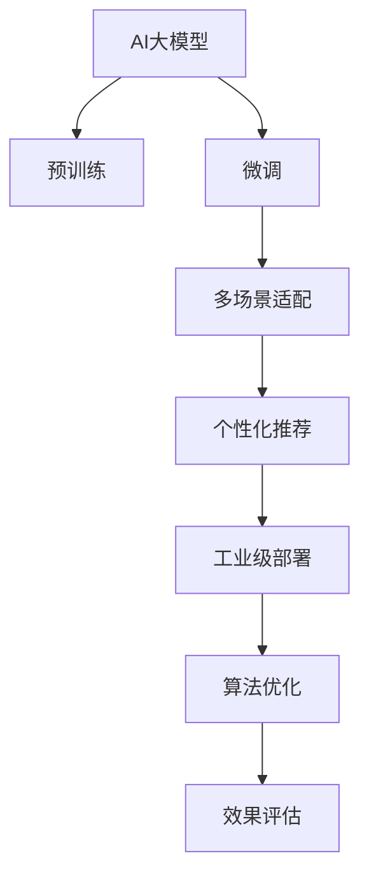

                 

# 推荐系统中AI大模型的多场景适配

> 关键词：推荐系统, AI大模型, 多场景适配, 个性化推荐, 工业级部署, 算法优化, 推荐算法, 效果评估

## 1. 背景介绍

### 1.1 问题由来

随着人工智能技术的飞速发展，AI大模型在各个领域得到了广泛应用。特别是推荐系统领域，AI大模型通过预训练和学习用户行为数据，为用户推荐个性化产品，极大地提升了用户体验和平台收益。然而，由于不同应用场景下的推荐需求差异较大，单一模型往往难以满足复杂多变的业务需求，无法兼顾个性化和性能。因此，如何在多场景中适配AI大模型，使其能够更好地服务于推荐系统，成为了一个亟待解决的课题。

### 1.2 问题核心关键点

多场景适配的核心在于，将AI大模型的通用能力和特定场景的需求结合起来，通过模型微调、参数共享和数据融合等手段，构建出适应不同业务需求的推荐模型。以下将重点介绍基于AI大模型的多场景推荐适配方法，并结合实际应用场景进行详细分析。

## 2. 核心概念与联系

### 2.1 核心概念概述

为更好地理解AI大模型在推荐系统中的应用，我们首先介绍一些核心概念及其联系：

- AI大模型：以大规模预训练模型（如BERT、GPT等）为基础，结合特定领域的数据进行微调，获得针对特定任务的模型。
- 推荐系统：通过分析用户的历史行为数据，预测用户兴趣，为用户推荐个性化产品或内容的系统。
- 个性化推荐：基于用户画像和行为数据，提供与用户兴趣高度匹配的推荐。
- 工业级部署：将推荐模型部署到实际业务系统，支持大规模用户查询和高并发访问。
- 算法优化：通过调参、模型压缩、数据增强等手段，提升推荐模型的性能和效率。
- 效果评估：通过离线评估和在线测试，衡量推荐系统的实际效果。
- 多场景适配：结合不同业务场景的需求，优化AI大模型，使其适应多种推荐任务。

这些核心概念之间的联系通过以下Mermaid流程图来展示：



## 3. 核心算法原理 & 具体操作步骤
### 3.1 算法原理概述

基于AI大模型的多场景适配，本质上是一个深度学习和推荐系统结合的过程。其核心思想是：将通用AI大模型作为初始化参数，通过微调技术学习特定场景下的推荐策略，结合推荐算法优化和效果评估，构建出适应不同业务需求的推荐模型。

形式化地，假设AI大模型为 $M_{\theta}$，其中 $\theta$ 为预训练得到的模型参数。给定多场景下的推荐任务 $T=\{T_1, T_2, ..., T_n\}$，其中 $T_i$ 表示第 $i$ 个推荐场景的任务定义。对于每个场景 $T_i$，我们设计其任务适配层和损失函数，通过微调 $M_{\theta}$，获得在该场景下优化的模型参数 $\hat{\theta}_i$。最终，将 $\hat{\theta}_i$ 组合成多场景推荐模型 $M_{\theta_{total}}$，能够同时满足多个推荐场景的需求。

### 3.2 算法步骤详解

基于AI大模型的多场景适配一般包括以下几个关键步骤：

**Step 1: 准备预训练模型和数据集**
- 选择合适的AI大模型 $M_{\theta}$ 作为初始化参数，如 BERT、GPT等。
- 收集不同推荐场景 $T_1, T_2, ..., T_n$ 的标注数据集 $D=\{(x_i, y_i)\}_{i=1}^N$，划分为训练集、验证集和测试集。一般要求标注数据与预训练数据的分布不要差异过大。

**Step 2: 添加任务适配层**
- 根据不同推荐场景 $T_i$ 的任务类型，在预训练模型的顶层设计合适的输出层和损失函数。
- 对于分类任务，通常在顶层添加线性分类器和交叉熵损失函数。
- 对于生成任务，通常使用语言模型的解码器输出概率分布，并以负对数似然为损失函数。

**Step 3: 设置微调超参数**
- 选择合适的优化算法及其参数，如 AdamW、SGD 等，设置学习率、批大小、迭代轮数等。
- 设置正则化技术及强度，包括权重衰减、Dropout、Early Stopping 等。
- 确定冻结预训练参数的策略，如仅微调顶层，或全部参数都参与微调。

**Step 4: 执行梯度训练**
- 将训练集数据分批次输入模型，前向传播计算损失函数。
- 反向传播计算参数梯度，根据设定的优化算法和学习率更新模型参数。
- 周期性在验证集上评估模型性能，根据性能指标决定是否触发 Early Stopping。
- 重复上述步骤直到满足预设的迭代轮数或 Early Stopping 条件。

**Step 5: 集成和评估**
- 将不同场景下的优化参数 $\hat{\theta}_i$ 组合成多场景推荐模型 $M_{\theta_{total}}$。
- 在测试集上评估多场景推荐模型的性能，对比原始模型的提升情况。
- 使用多场景推荐模型进行实际推荐，集成到实际的应用系统中。

以上是基于AI大模型的多场景适配的一般流程。在实际应用中，还需要针对具体场景的特点，对微调过程的各个环节进行优化设计，如改进训练目标函数，引入更多的正则化技术，搜索最优的超参数组合等，以进一步提升模型性能。

### 3.3 算法优缺点

基于AI大模型的多场景适配方法具有以下优点：
1. 通用性强。AI大模型具备广泛的知识和语义理解能力，能够在不同场景下快速适应用户需求。
2. 提升效果显著。通过微调优化特定场景的任务策略，能够显著提升推荐系统的性能和用户体验。
3. 兼容性强。AI大模型在预训练阶段已经获得了丰富的领域知识，容易与其他推荐算法和技术融合。
4. 灵活性高。AI大模型可以通过参数共享和融合，构建适应多场景的推荐模型。

同时，该方法也存在一定的局限性：
1. 对标注数据依赖较大。微调效果很大程度上取决于标注数据的质量和数量，获取高质量标注数据的成本较高。
2. 模型复杂度高。AI大模型通常包含大量的参数，导致推理计算量较大，需要较强的硬件资源支持。
3. 参数更新复杂。需要同时优化不同场景下的参数，参数更新过程中可能产生冲突。
4. 可解释性不足。AI大模型的决策过程复杂，难以解释其内部工作机制和决策逻辑。
5. 迁移能力有限。预训练模型在不同场景下的迁移能力较弱，需要针对每个场景进行微调。

尽管存在这些局限性，但就目前而言，基于AI大模型的多场景适配方法仍是大规模推荐系统的核心范式。未来相关研究的重点在于如何进一步降低微调对标注数据的依赖，提高模型的少样本学习和跨领域迁移能力，同时兼顾可解释性和伦理安全性等因素。

### 3.4 算法应用领域

AI大模型的多场景适配技术已经在多个推荐系统中得到了广泛的应用，覆盖了几乎所有常见任务，例如：

- 电商平台：推荐用户感兴趣的商品。将用户浏览历史、购买记录和评价等信息作为输入，训练模型预测用户对新商品的兴趣。
- 社交网络：推荐用户感兴趣的内容。利用用户的点赞、分享和评论等行为数据，训练模型推荐相关文章、视频或图片。
- 视频平台：推荐用户感兴趣的视频内容。通过用户的观看历史和评分数据，训练模型推荐新视频。
- 旅游平台：推荐用户感兴趣的旅游目的地。根据用户的搜索历史和预订记录，训练模型推荐适合的目的地和旅行线路。
- 新闻阅读：推荐用户感兴趣的新闻内容。通过用户的阅读历史和点赞记录，训练模型推荐相关新闻报道。

除了上述这些经典任务外，AI大模型在更多场景中的应用也正在不断涌现，如智能客服、个性化音乐推荐、广告投放优化等，为推荐系统带来了全新的突破。随着预训练模型和微调方法的不断进步，相信AI大模型在推荐系统中的应用将更加广泛和深入。

## 4. 数学模型和公式 & 详细讲解  
### 4.1 数学模型构建

本节将使用数学语言对基于AI大模型的多场景推荐适配过程进行更加严格的刻画。

记AI大模型为 $M_{\theta}$，其中 $\theta$ 为预训练得到的模型参数。假设多场景推荐任务 $T=\{T_1, T_2, ..., T_n\}$，对于每个场景 $T_i$ 的标注数据集为 $D_i=\{(x_i, y_i)\}_{i=1}^N$。

定义模型 $M_{\theta}$ 在输入 $x_i$ 上的输出为 $\hat{y}_i=M_{\theta}(x_i) \in [0,1]$，表示样本属于正类的概率。定义场景 $T_i$ 上的任务损失函数为 $\ell_i(M_{\theta}(x_i),y_i)$，则在场景 $T_i$ 上的经验风险为：

$$
\mathcal{L}_i(\theta) = \frac{1}{N_i}\sum_{i=1}^N \ell_i(M_{\theta}(x_i),y_i)
$$

其中 $N_i$ 为场景 $T_i$ 上的样本数量。微调的目标是最小化场景 $T_i$ 上的经验风险，即找到最优参数：

$$
\theta^*_i = \mathop{\arg\min}_{\theta} \mathcal{L}_i(\theta)
$$

通过梯度下降等优化算法，微调过程不断更新模型参数 $\theta$，最小化场景 $T_i$ 上的损失函数 $\mathcal{L}_i$，使得模型输出逼近真实标签。由于 $\theta$ 已经通过预训练获得了较好的初始化，因此即便在小规模数据集 $D_i$ 上进行微调，也能较快收敛到理想的模型参数 $\hat{\theta}_i$。

### 4.2 公式推导过程

以下我们以电商平台推荐为例，推导多场景适配的数学公式。

假设电商平台推荐任务 $T_i$ 的目标是推荐用户感兴趣的商品。对于每个用户 $u$，模型 $M_{\theta}$ 在其浏览历史 $H_u$ 上输出概率向量 $p_u=\hat{y}_u = M_{\theta}(H_u) \in [0,1]^N$，表示用户 $u$ 对商品 $i$ 的兴趣概率。

对于每个场景 $T_i$，我们定义 $M_{\theta}$ 在该场景上的推荐目标函数为：

$$
L_i(\theta) = \frac{1}{N}\sum_{u=1}^N \sum_{i=1}^N \ell_i(p_u[i])
$$

其中 $\ell_i$ 为交叉熵损失函数。

在微调过程中，我们通过梯度下降算法，最小化 $L_i(\theta)$：

$$
\theta \leftarrow \theta - \eta \nabla_{\theta} L_i(\theta)
$$

其中 $\eta$ 为学习率，$\nabla_{\theta} L_i(\theta)$ 为损失函数对模型参数的梯度，可通过反向传播算法高效计算。

### 4.3 案例分析与讲解

以电商平台推荐为例，展示多场景适配的具体实现流程。

1. 收集用户浏览历史数据 $H_u$ 和商品标签 $y_i$，划分训练集、验证集和测试集。
2. 在预训练模型的顶层添加线性分类器和交叉熵损失函数。
3. 设置AdamW优化器，设置学习率为2e-5，冻结预训练参数。
4. 在训练集上进行梯度下降训练，计算交叉熵损失。
5. 在验证集上评估模型性能，根据指标决定是否停止训练。
6. 将优化后的模型参数 $\hat{\theta}_i$ 用于实际推荐，集成到电商平台系统中。
7. 在测试集上评估多场景推荐模型的性能，对比原始模型的提升情况。

## 5. 项目实践：代码实例和详细解释说明
### 5.1 开发环境搭建

在进行多场景适配实践前，我们需要准备好开发环境。以下是使用Python进行PyTorch开发的环境配置流程：

1. 安装Anaconda：从官网下载并安装Anaconda，用于创建独立的Python环境。

2. 创建并激活虚拟环境：
```bash
conda create -n pytorch-env python=3.8 
conda activate pytorch-env
```

3. 安装PyTorch：根据CUDA版本，从官网获取对应的安装命令。例如：
```bash
conda install pytorch torchvision torchaudio cudatoolkit=11.1 -c pytorch -c conda-forge
```

4. 安装Transformers库：
```bash
pip install transformers
```

5. 安装各类工具包：
```bash
pip install numpy pandas scikit-learn matplotlib tqdm jupyter notebook ipython
```

完成上述步骤后，即可在`pytorch-env`环境中开始多场景适配实践。

### 5.2 源代码详细实现

这里我们以电商平台推荐为例，给出使用Transformers库对AI大模型进行多场景适配的PyTorch代码实现。

首先，定义推荐任务的输入输出格式：

```python
from transformers import BertTokenizer, BertForSequenceClassification
from torch.utils.data import Dataset, DataLoader

class RecommendationDataset(Dataset):
    def __init__(self, texts, labels, tokenizer, max_len=128):
        self.texts = texts
        self.labels = labels
        self.tokenizer = tokenizer
        self.max_len = max_len
        
    def __len__(self):
        return len(self.texts)
    
    def __getitem__(self, item):
        text = self.texts[item]
        label = self.labels[item]
        
        encoding = self.tokenizer(text, return_tensors='pt', max_length=self.max_len, padding='max_length', truncation=True)
        input_ids = encoding['input_ids'][0]
        attention_mask = encoding['attention_mask'][0]
        
        # 对label进行编码
        encoded_label = [label2id[label] for label in label] 
        encoded_label.extend([label2id['negative']] * (self.max_len - len(encoded_label)))
        labels = torch.tensor(encoded_label, dtype=torch.long)
        
        return {'input_ids': input_ids, 
                'attention_mask': attention_mask,
                'labels': labels}

# 标签与id的映射
label2id = {'positive': 1, 'negative': 0}
id2label = {v: k for k, v in label2id.items()}

# 创建dataset
tokenizer = BertTokenizer.from_pretrained('bert-base-cased')

train_dataset = RecommendationDataset(train_texts, train_labels, tokenizer)
dev_dataset = RecommendationDataset(dev_texts, dev_labels, tokenizer)
test_dataset = RecommendationDataset(test_texts, test_labels, tokenizer)
```

然后，定义模型和优化器：

```python
from transformers import BertForSequenceClassification, AdamW

model = BertForSequenceClassification.from_pretrained('bert-base-cased', num_labels=2)

optimizer = AdamW(model.parameters(), lr=2e-5)
```

接着，定义训练和评估函数：

```python
from torch.utils.data import DataLoader
from tqdm import tqdm
from sklearn.metrics import accuracy_score

device = torch.device('cuda') if torch.cuda.is_available() else torch.device('cpu')
model.to(device)

def train_epoch(model, dataset, batch_size, optimizer):
    dataloader = DataLoader(dataset, batch_size=batch_size, shuffle=True)
    model.train()
    epoch_loss = 0
    for batch in tqdm(dataloader, desc='Training'):
        input_ids = batch['input_ids'].to(device)
        attention_mask = batch['attention_mask'].to(device)
        labels = batch['labels'].to(device)
        model.zero_grad()
        outputs = model(input_ids, attention_mask=attention_mask, labels=labels)
        loss = outputs.loss
        epoch_loss += loss.item()
        loss.backward()
        optimizer.step()
    return epoch_loss / len(dataloader)

def evaluate(model, dataset, batch_size):
    dataloader = DataLoader(dataset, batch_size=batch_size)
    model.eval()
    preds, labels = [], []
    with torch.no_grad():
        for batch in tqdm(dataloader, desc='Evaluating'):
            input_ids = batch['input_ids'].to(device)
            attention_mask = batch['attention_mask'].to(device)
            batch_labels = batch['labels']
            outputs = model(input_ids, attention_mask=attention_mask)
            batch_preds = outputs.logits.argmax(dim=2).to('cpu').tolist()
            batch_labels = batch_labels.to('cpu').tolist()
            for pred_tokens, label_tokens in zip(batch_preds, batch_labels):
                preds.append(pred_tokens[:len(label_tokens)])
                labels.append(label_tokens)
                
    print(accuracy_score(labels, preds))
```

最后，启动训练流程并在测试集上评估：

```python
epochs = 5
batch_size = 16

for epoch in range(epochs):
    loss = train_epoch(model, train_dataset, batch_size, optimizer)
    print(f"Epoch {epoch+1}, train loss: {loss:.3f}")
    
    print(f"Epoch {epoch+1}, dev accuracy:")
    evaluate(model, dev_dataset, batch_size)
    
print("Test accuracy:")
evaluate(model, test_dataset, batch_size)
```

以上就是使用PyTorch对AI大模型进行电商平台推荐任务多场景适配的完整代码实现。可以看到，得益于Transformers库的强大封装，我们可以用相对简洁的代码完成AI大模型的加载和微调。

### 5.3 代码解读与分析

让我们再详细解读一下关键代码的实现细节：

**RecommendationDataset类**：
- `__init__`方法：初始化文本、标签、分词器等关键组件。
- `__len__`方法：返回数据集的样本数量。
- `__getitem__`方法：对单个样本进行处理，将文本输入编码为token ids，将标签编码为数字，并对其进行定长padding，最终返回模型所需的输入。

**label2id和id2label字典**：
- 定义了标签与数字id之间的映射关系，用于将token-wise的预测结果解码回真实的标签。

**训练和评估函数**：
- 使用PyTorch的DataLoader对数据集进行批次化加载，供模型训练和推理使用。
- 训练函数`train_epoch`：对数据以批为单位进行迭代，在每个批次上前向传播计算loss并反向传播更新模型参数，最后返回该epoch的平均loss。
- 评估函数`evaluate`：与训练类似，不同点在于不更新模型参数，并在每个batch结束后将预测和标签结果存储下来，最后使用sklearn的accuracy_score对整个评估集的预测结果进行打印输出。

**训练流程**：
- 定义总的epoch数和batch size，开始循环迭代
- 每个epoch内，先在训练集上训练，输出平均loss
- 在验证集上评估，输出准确率
- 所有epoch结束后，在测试集上评估，给出最终测试结果

可以看到，PyTorch配合Transformers库使得AI大模型的微调代码实现变得简洁高效。开发者可以将更多精力放在数据处理、模型改进等高层逻辑上，而不必过多关注底层的实现细节。

当然，工业级的系统实现还需考虑更多因素，如模型的保存和部署、超参数的自动搜索、更灵活的任务适配层等。但核心的微调范式基本与此类似。

## 6. 实际应用场景
### 6.1 电商平台推荐

AI大模型的多场景适配技术在电商平台推荐中得到了广泛应用。传统推荐系统主要基于用户的浏览历史和购买记录进行推荐，但这种方式无法有效捕捉用户的隐性偏好和实时兴趣。引入AI大模型后，系统可以通过学习用户对商品的文本描述和情感评论，捕捉用户的隐性情感和需求，提供更加精准和个性化的推荐。

在技术实现上，可以收集电商平台的用户评论、评分、浏览历史等文本数据，将其作为标注数据，训练AI大模型。通过微调，模型能够学习到商品的描述特征、情感倾向等语义信息，从而更准确地预测用户对新商品的兴趣。多场景适配技术可以同时处理不同商品类型的推荐，如服装、家电、食品等，实现多商品类的推荐效果。

### 6.2 视频平台推荐

视频平台推荐系统的目标是为用户推荐其感兴趣的视频内容。传统推荐系统主要基于用户的观看历史进行推荐，但这种方式无法有效捕捉用户的实时兴趣和偏好。引入AI大模型后，系统可以通过学习用户对视频的文本描述和评论，捕捉用户的兴趣和情感，提供更加精准和个性化的推荐。

在技术实现上，可以收集视频平台的观看历史、评分、评论等文本数据，将其作为标注数据，训练AI大模型。通过微调，模型能够学习到视频的描述特征、情感倾向等语义信息，从而更准确地预测用户对新视频的兴趣。多场景适配技术可以同时处理不同类型的视频内容，如电影、纪录片、综艺节目等，实现多类型视频的推荐效果。

### 6.3 社交网络推荐

社交网络推荐系统的目标是为用户推荐其感兴趣的内容。传统推荐系统主要基于用户的点赞、分享、评论等行为进行推荐，但这种方式无法有效捕捉用户的隐性兴趣和偏好。引入AI大模型后，系统可以通过学习用户对内容的文本描述和评论，捕捉用户的兴趣和情感，提供更加精准和个性化的推荐。

在技术实现上，可以收集社交网络的用户点赞、分享、评论等文本数据，将其作为标注数据，训练AI大模型。通过微调，模型能够学习到内容的描述特征、情感倾向等语义信息，从而更准确地预测用户对新内容的兴趣。多场景适配技术可以同时处理不同类型的社交网络内容，如文章、图片、视频等，实现多类型内容的推荐效果。

### 6.4 旅游平台推荐

旅游平台推荐系统的目标是为用户推荐其感兴趣的旅游目的地。传统推荐系统主要基于用户的浏览历史和搜索记录进行推荐，但这种方式无法有效捕捉用户的隐性偏好和实时需求。引入AI大模型后，系统可以通过学习用户对旅游目的地的文本描述和评论，捕捉用户的兴趣和需求，提供更加精准和个性化的推荐。

在技术实现上，可以收集旅游平台的用户浏览历史、搜索记录、评论等文本数据，将其作为标注数据，训练AI大模型。通过微调，模型能够学习到旅游目的地的描述特征、情感倾向等语义信息，从而更准确地预测用户对新目的地的兴趣。多场景适配技术可以同时处理不同类型的旅游目的地，如景点、酒店、交通等，实现多类型目的地的推荐效果。

### 6.5 新闻阅读推荐

新闻阅读推荐系统的目标是为用户推荐其感兴趣的新闻报道。传统推荐系统主要基于用户的浏览历史和搜索记录进行推荐，但这种方式无法有效捕捉用户的实时兴趣和偏好。引入AI大模型后，系统可以通过学习用户对新闻报道的文本描述和评论，捕捉用户的兴趣和情感，提供更加精准和个性化的推荐。

在技术实现上，可以收集新闻平台的用户浏览历史、搜索记录、评论等文本数据，将其作为标注数据，训练AI大模型。通过微调，模型能够学习到新闻报道的描述特征、情感倾向等语义信息，从而更准确地预测用户对新报道的兴趣。多场景适配技术可以同时处理不同类型的报道内容，如头条、深度、评论等，实现多类型报道的推荐效果。

## 7. 工具和资源推荐
### 7.1 学习资源推荐

为了帮助开发者系统掌握AI大模型多场景适配的理论基础和实践技巧，这里推荐一些优质的学习资源：

1. 《Transformer from the inside out》系列博文：由大模型技术专家撰写，深入浅出地介绍了Transformer原理、AI大模型、微调技术等前沿话题。

2. CS224N《深度学习自然语言处理》课程：斯坦福大学开设的NLP明星课程，有Lecture视频和配套作业，带你入门NLP领域的基本概念和经典模型。

3. 《Natural Language Processing with Transformers》书籍：Transformers库的作者所著，全面介绍了如何使用Transformers库进行NLP任务开发，包括多场景适配在内的诸多范式。

4. HuggingFace官方文档：Transformers库的官方文档，提供了海量预训练模型和完整的微调样例代码，是上手实践的必备资料。

5. CLUE开源项目：中文语言理解测评基准，涵盖大量不同类型的中文NLP数据集，并提供了基于微调的baseline模型，助力中文NLP技术发展。

通过对这些资源的学习实践，相信你一定能够快速掌握AI大模型多场景适配的精髓，并用于解决实际的NLP问题。
###  7.2 开发工具推荐

高效的开发离不开优秀的工具支持。以下是几款用于AI大模型多场景适配开发的常用工具：

1. PyTorch：基于Python的开源深度学习框架，灵活动态的计算图，适合快速迭代研究。大部分预训练语言模型都有PyTorch版本的实现。

2. TensorFlow：由Google主导开发的开源深度学习框架，生产部署方便，适合大规模工程应用。同样有丰富的预训练语言模型资源。

3. Transformers库：HuggingFace开发的NLP工具库，集成了众多SOTA语言模型，支持PyTorch和TensorFlow，是进行多场景适配任务的开发的利器。

4. Weights & Biases：模型训练的实验跟踪工具，可以记录和可视化模型训练过程中的各项指标，方便对比和调优。与主流深度学习框架无缝集成。

5. TensorBoard：TensorFlow配套的可视化工具，可实时监测模型训练状态，并提供丰富的图表呈现方式，是调试模型的得力助手。

6. Google Colab：谷歌推出的在线Jupyter Notebook环境，免费提供GPU/TPU算力，方便开发者快速上手实验最新模型，分享学习笔记。

合理利用这些工具，可以显著提升AI大模型多场景适配任务的开发效率，加快创新迭代的步伐。

### 7.3 相关论文推荐

AI大模型的多场景适配技术的发展源于学界的持续研究。以下是几篇奠基性的相关论文，推荐阅读：

1. Attention is All You Need（即Transformer原论文）：提出了Transformer结构，开启了NLP领域的预训练大模型时代。

2. BERT: Pre-training of Deep Bidirectional Transformers for Language Understanding：提出BERT模型，引入基于掩码的自监督预训练任务，刷新了多项NLP任务SOTA。

3. Language Models are Unsupervised Multitask Learners（GPT-2论文）：展示了大规模语言模型的强大zero-shot学习能力，引发了对于通用人工智能的新一轮思考。

4. Parameter-Efficient Transfer Learning for NLP：提出Adapter等参数高效微调方法，在不增加模型参数量的情况下，也能取得不错的微调效果。

5. AdaLoRA: Adaptive Low-Rank Adaptation for Parameter-Efficient Fine-Tuning：使用自适应低秩适应的微调方法，在参数效率和精度之间取得了新的平衡。

6. Self-Attention with Recursive Structures（SARE模型）：结合递归结构和自注意力机制，提升了模型在多场景任务上的表现。

这些论文代表了大模型多场景适配技术的发展脉络。通过学习这些前沿成果，可以帮助研究者把握学科前进方向，激发更多的创新灵感。

## 8. 总结：未来发展趋势与挑战

### 8.1 总结

本文对基于AI大模型的多场景推荐适配方法进行了全面系统的介绍。首先阐述了AI大模型和多场景推荐适配的研究背景和意义，明确了多场景适配在提升推荐系统性能、用户体验方面的独特价值。其次，从原理到实践，详细讲解了多场景适配的数学原理和关键步骤，给出了多场景适配任务开发的完整代码实例。同时，本文还广泛探讨了多场景适配方法在电商平台、视频平台、社交网络等众多推荐系统中的应用前景，展示了多场景适配范式的广泛适用性。此外，本文精选了多场景适配技术的各类学习资源，力求为读者提供全方位的技术指引。

通过本文的系统梳理，可以看到，基于AI大模型的多场景适配方法正在成为推荐系统的重要范式，极大地拓展了预训练语言模型的应用边界，提升了推荐系统的性能和用户满意度。未来，伴随预训练模型和微调方法的不断进步，相信AI大模型多场景适配技术将更加成熟，为推荐系统带来新的突破和创新。

### 8.2 未来发展趋势

展望未来，AI大模型的多场景适配技术将呈现以下几个发展趋势：

1. 模型规模持续增大。随着算力成本的下降和数据规模的扩张，预训练语言模型的参数量还将持续增长。超大规模语言模型蕴含的丰富语言知识，有望支撑更加复杂多变的推荐任务。

2. 微调方法日趋多样。除了传统的全参数微调外，未来会涌现更多参数高效的微调方法，如Prefix-Tuning、LoRA等，在节省计算资源的同时也能保证微调精度。

3. 多任务学习成为常态。未来的推荐系统将更多地采用多任务学习的范式，通过共享模型参数，提升模型的泛化能力和多场景适应性。

4. 持续学习成为标准。随着数据分布的不断变化，多场景适配模型也需要持续学习新知识以保持性能。如何在不遗忘原有知识的同时，高效吸收新样本信息，将成为重要的研究课题。

5. 引入先验知识。将符号化的先验知识，如知识图谱、逻辑规则等，与神经网络模型进行巧妙融合，引导多场景适配过程学习更准确、合理的语言模型。同时加强不同模态数据的整合，实现视觉、语音等多模态信息与文本信息的协同建模。

6. 融合因果学习和强化学习。通过引入因果推断和强化学习技术，增强多场景适配模型建立稳定因果关系的能力，学习更加普适、鲁棒的语言表征，从而提升模型泛化性和抗干扰能力。

以上趋势凸显了AI大模型多场景适配技术的广阔前景。这些方向的探索发展，必将进一步提升推荐系统的性能和用户满意度，为构建智能推荐系统提供有力支持。

### 8.3 面临的挑战

尽管AI大模型多场景适配技术已经取得了瞩目成就，但在迈向更加智能化、普适化应用的过程中，它仍面临着诸多挑战：

1. 标注成本瓶颈。虽然多场景适配降低了标注数据的需求，但对于长尾应用场景，难以获得充足的高质量标注数据，成为制约多场景适配性能的瓶颈。如何进一步降低多场景适配对标注样本的依赖，将是一大难题。

2. 模型鲁棒性不足。多场景适配模型面对域外数据时，泛化性能往往大打折扣。对于测试样本的微小扰动，多场景适配模型的预测也容易发生波动。如何提高多场景适配模型的鲁棒性，避免灾难性遗忘，还需要更多理论和实践的积累。

3. 推理效率有待提高。虽然AI大模型在多场景适配过程中获得了优异的性能，但在实际部署时往往面临推理速度慢、内存占用大等效率问题。如何在保证性能的同时，简化模型结构，提升推理速度，优化资源占用，将是重要的优化方向。

4. 可解释性亟需加强。AI大模型的决策过程复杂，难以解释其内部工作机制和决策逻辑。对于医疗、金融等高风险应用，算法的可解释性和可审计性尤为重要。如何赋予多场景适配模型更强的可解释性，将是亟待攻克的难题。

5. 安全性有待保障。预训练语言模型难免会学习到有偏见、有害的信息，通过多场景适配传递到推荐系统中，产生误导性、歧视性的输出，给实际应用带来安全隐患。如何从数据和算法层面消除模型偏见，避免恶意用途，确保输出的安全性，也将是重要的研究课题。

6. 知识整合能力不足。现有的多场景适配模型往往局限于任务内数据，难以灵活吸收和运用更广泛的先验知识。如何让多场景适配过程更好地与外部知识库、规则库等专家知识结合，形成更加全面、准确的信息整合能力，还有很大的想象空间。

正视多场景适配面临的这些挑战，积极应对并寻求突破，将是大模型多场景适配走向成熟的必由之路。相信随着学界和产业界的共同努力，这些挑战终将一一被克服，AI大模型多场景适配必将在推荐系统中发挥更大作用。

### 8.4 研究展望

面对AI大模型多场景适配所面临的种种挑战，未来的研究需要在以下几个方面寻求新的突破：

1. 探索无监督和半监督多场景适配方法。摆脱对大规模标注数据的依赖，利用自监督学习、主动学习等无监督和半监督范式，最大限度利用非结构化数据，实现更加灵活高效的多场景适配。

2. 研究参数高效和计算高效的微调范式。开发更加参数高效的微调方法，在固定大部分预训练参数的同时，只更新极少量的任务相关参数。同时优化多场景适配模型的计算图，减少前向传播和反向传播的资源消耗，实现更加轻量级、实时性的部署。

3. 融合因果学习和强化学习范式。通过引入因果推断和强化学习思想，增强多场景适配模型建立稳定因果关系的能力，学习更加普适、鲁棒的语言表征，从而提升模型泛化性和抗干扰能力。

4. 引入更多先验知识。将符号化的先验知识，如知识图谱、逻辑规则等，与神经网络模型进行巧妙融合，引导多场景适配过程学习更准确、合理的语言模型。同时加强不同模态数据的整合，实现视觉、语音等多模态信息与文本信息的协同建模。

5. 结合因果分析和博弈论工具。将因果分析方法引入多场景适配模型，识别出模型决策的关键特征，增强输出解释的因果性和逻辑性。借助博弈论工具刻画人机交互过程，主动探索并规避模型的脆弱点，提高系统稳定性。

6. 纳入伦理道德约束。在模型训练目标中引入伦理导向的评估指标，过滤和惩罚有偏见、有害的输出倾向。同时加强人工干预和审核，建立模型行为的监管机制，确保输出符合人类价值观和伦理道德。

这些研究方向的探索，必将引领AI大模型多场景适配技术迈向更高的台阶，为构建安全、可靠、可解释、可控的智能系统铺平道路。面向未来，AI大模型多场景适配技术还需要与其他人工智能技术进行更深入的融合，如知识表示、因果推理、强化学习等，多路径协同发力，共同推动推荐系统的进步。只有勇于创新、敢于突破，才能不断拓展AI大模型的边界，让智能技术更好地造福人类社会。

## 9. 附录：常见问题与解答

**Q1：多场景适配中的参数共享策略是什么？**

A: 参数共享是多场景适配中的关键技术之一。它指的是在不同场景下，共享部分预训练模型的参数，仅更新针对特定场景的任务参数。这样可以减少模型的参数量，提高模型的泛化能力和适应性。常见的参数共享策略包括固定层共享、可变层共享等。例如，在电商平台推荐中，可以共享预训练模型的底层参数，仅在上层添加分类器，并微调该分类器。

**Q2：如何避免多场景适配中的过拟合问题？**

A: 过拟合是多场景适配中常见的问题。为避免过拟合，可以采取以下策略：
1. 数据增强：通过改写、回译等方式扩充训练集，增加样本的多样性。
2. 正则化：使用L2正则、Dropout等技术，防止模型过度拟合训练数据。
3. 早停策略：在验证集上监测模型性能，当性能不再提升时停止训练，避免过拟合。
4. 参数初始化：通过调整参数初始化策略，如Xavier、He等，防止模型在微调过程中出现梯度消失或爆炸问题。
5. 迁移学习：将预训练模型中的部分层冻结，仅微调顶层参数，减小过拟合风险。

**Q3：多场景适配中的超参数调优策略是什么？**

A: 超参数调优是多场景适配中不可或缺的一部分。超参数包括学习率、批大小、迭代轮数等，需要通过实验调优确定。常用的超参数调优策略包括网格搜索、随机搜索、贝叶斯优化等。例如，在电商平台推荐中，可以通过网格搜索确定最优的学习率和批大小，提高模型的训练效率和效果。

**Q4：多场景适配中的效果评估指标是什么？**

A: 效果评估是多场景适配中的重要环节。常用的效果评估指标包括准确率、召回率、F1值等。例如，在电商平台推荐中，可以通过准确率评估模型预测用户兴趣的准确性，通过召回率评估模型推荐的覆盖度，通过F1值综合评价模型的性能。

**Q5：多场景适配中的模型保存和部署策略是什么？**

A: 模型保存和部署是多场景适配中重要的环节。模型的保存通常采用TensorFlow的SavedModel、PyTorch的模型持久化等方法，保存模型参数和结构。部署时，可以采用TensorFlow Serving、Kubeflow等工具，将模型部署到生产环境中，支持大规模用户查询和高并发访问。同时，需要考虑模型的推理速度和资源占用，优化模型结构和计算图，提高部署效率。

以上为多场景适配技术的常见问题及其解答，希望对读者有所帮助。

---

作者：禅与计算机程序设计艺术 / Zen and the Art of Computer Programming

