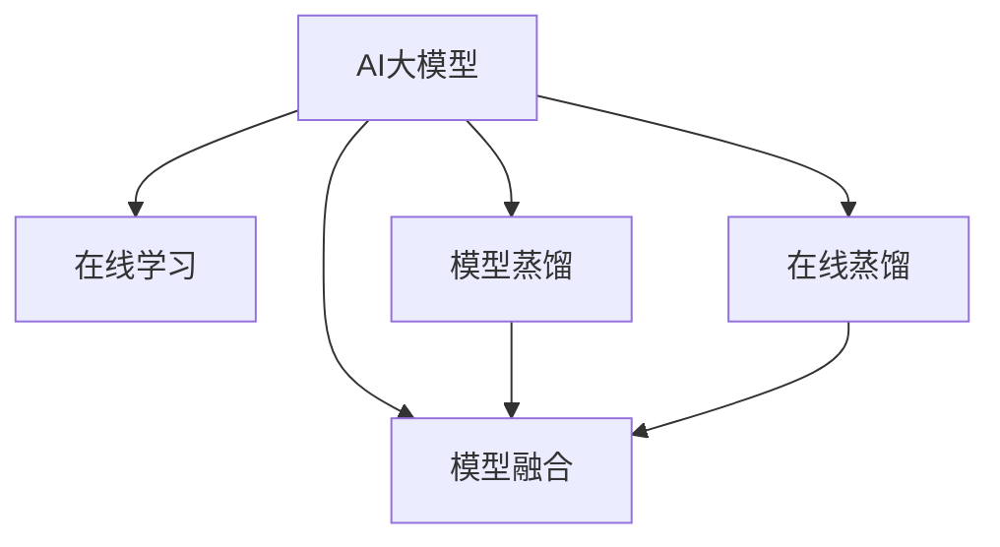

                 

# 推荐系统中AI大模型的实时更新机制

## 1. 背景介绍

### 1.1 问题由来
在推荐系统中，AI大模型（如BERT、GPT等）被广泛用于预训练和微调，以提升推荐系统的个性化和准确性。然而，随着用户行为数据的不断变化，现有模型无法实时更新，导致推荐结果与用户实际需求存在偏差。这不仅影响了用户体验，还降低了推荐系统的商业价值。因此，开发AI大模型的实时更新机制，成为提升推荐系统性能的关键。

### 1.2 问题核心关键点
实时更新机制的核心在于如何高效、准确地将新数据和用户行为信息融入现有模型，同时保持模型的稳定性和性能。目前主流的方法包括在线学习、模型蒸馏、模型融合等，每种方法都有其独特的优势和局限性。

### 1.3 问题研究意义
实现AI大模型的实时更新，可以显著提升推荐系统的个性化和时效性，满足用户实时变化的兴趣和需求，增强系统的用户黏性，提升商业转化率。同时，实时更新还能降低用户流失率，增加平台的长期价值。

## 2. 核心概念与联系

### 2.1 核心概念概述

为更好地理解实时更新机制，本节将介绍几个密切相关的核心概念：

- AI大模型：指经过大规模无监督学习训练的通用语言模型，如BERT、GPT系列模型。通过预训练和微调，AI大模型具备了强大的语言理解和生成能力。
- 在线学习(Online Learning)：指在模型训练过程中，不断接收新的数据进行实时更新，以适应用户行为的变化。
- 模型蒸馏(Model Distillation)：指通过保留已有模型的大规模知识，将小规模模型的预测结果转化为更精准的输出。
- 模型融合(Ensemble Learning)：指通过整合多个模型的预测结果，提升推荐系统的鲁棒性和准确性。
- 在线蒸馏(Online Distillation)：指结合在线学习和模型蒸馏的方法，实时更新并优化大模型。

这些核心概念之间的逻辑关系可以通过以下Mermaid流程图来展示：



这个流程图展示了大模型的核心概念及其之间的关系：

1. 大模型通过在线学习、模型蒸馏和模型融合等方法，实现实时更新和优化。
2. 在线学习使得模型能够不断接收新的数据，适应用户行为的变化。
3. 模型蒸馏通过保留已有模型知识，进一步提升小规模模型的精度。
4. 模型融合整合多个模型的预测结果，提升推荐系统的鲁棒性和准确性。
5. 在线蒸馏结合在线学习和模型蒸馏，实现大模型的实时更新。

这些概念共同构成了实时更新机制的基础框架，使得AI大模型能够在不断变化的用户需求下，保持高效和精准的推荐能力。

## 3. 核心算法原理 & 具体操作步骤

### 3.1 算法原理概述

AI大模型的实时更新机制，本质上是一个动态学习过程，其核心思想是通过不断地接收新数据和用户行为信息，实时调整模型参数，保持模型与数据分布的一致性。

形式化地，假设大模型为 $M_{\theta}$，其中 $\theta$ 为模型参数。给定新数据集 $D_{new}$ 和当前模型的预测结果 $P$，实时的目标是最小化预测误差 $e$，即：

$$
\theta^* = \mathop{\arg\min}_{\theta} \mathcal{L}(D_{new}, P)
$$

其中 $\mathcal{L}$ 为预测误差函数，通常使用均方误差或交叉熵等。

通过梯度下降等优化算法，实时更新过程不断更新模型参数 $\theta$，最小化预测误差 $e$，使得模型输出逼近真实标签。由于 $\theta$ 已经通过预训练和微调获得了较好的初始化，因此即便在实时更新时，也能较快收敛到理想的模型参数 $\hat{\theta}$。

### 3.2 算法步骤详解

实时更新机制一般包括以下几个关键步骤：

**Step 1: 收集新数据**

- 从推荐系统的日志、用户行为数据等来源，收集新的用户行为数据 $D_{new}$，如点击、浏览、购买等。

**Step 2: 模型初始化**

- 选择已有的大模型 $M_{\theta}$ 作为初始化参数，如BERT、GPT等。
- 将模型加载到服务端，并准备好在线学习所需的基础设施。

**Step 3: 定义预测目标**

- 根据任务类型，定义预测目标和损失函数。例如，对于点击率预测任务，定义目标为预测点击概率 $P$，损失函数为交叉熵损失。

**Step 4: 在线学习**

- 将新数据 $D_{new}$ 输入模型，计算预测结果 $P$。
- 根据预测结果和真实标签 $y$，计算损失 $e$，并更新模型参数 $\theta$。
- 周期性地在验证集上评估模型性能，根据性能指标决定是否触发模型更新。

**Step 5: 模型蒸馏**

- 对于特定类型的推荐任务，选择合适的蒸馏方法，将大模型的输出转化为小模型的预测结果。
- 使用小模型的预测结果进行新的在线学习，进一步优化模型参数。

**Step 6: 模型融合**

- 将多个模型（如不同时间点的模型）的预测结果进行融合，得到更精准的推荐结果。
- 在预测阶段，使用融合后的模型进行推理，提升推荐系统的鲁棒性和准确性。

### 3.3 算法优缺点

实时更新机制具有以下优点：

- 提高模型精度：通过不断地接收新数据，模型能够更好地适应用户行为的变化，提升预测精度。
- 提升个性化：实时更新的模型能够更好地捕捉用户兴趣和行为变化，提供个性化的推荐。
- 降低用户流失：通过实时更新，推荐系统能够更精准地满足用户需求，减少用户流失。

然而，实时更新机制也存在一些局限性：

- 计算资源消耗大：实时更新需要频繁进行梯度计算和参数更新，计算资源消耗较大。
- 模型稳定性差：频繁的更新可能导致模型参数波动较大，影响模型稳定性。
- 数据质量要求高：实时更新的数据质量直接影响模型效果，需要保证数据的时效性和准确性。

尽管存在这些局限性，但实时更新机制仍是大模型推荐系统的重要研究方向，通过不断优化算法和基础设施，可以进一步提升推荐系统的性能。

### 3.4 算法应用领域

实时更新机制在推荐系统中有着广泛的应用，主要包括以下几个方面：

- 电商推荐：实时更新用户点击、浏览等行为数据，提升商品推荐精准度。
- 视频推荐：根据用户观看历史和行为数据，实时调整视频推荐算法，提升观看体验。
- 音乐推荐：根据用户听歌历史和行为数据，实时更新音乐推荐算法，提高音乐偏好匹配度。
- 新闻推荐：根据用户阅读历史和行为数据，实时更新新闻推荐算法，提升新闻阅读体验。
- 游戏推荐：根据用户游戏行为数据，实时更新游戏推荐算法，增加游戏粘性。

除了上述这些经典应用外，实时更新机制还被创新性地应用到更多场景中，如用户画像生成、广告推荐、个性化教育等，为推荐系统带来了全新的突破。随着实时更新技术的不断进步，相信推荐系统将在更多领域得到应用，为用户的个性化需求提供更精准的推荐。

## 4. 数学模型和公式 & 详细讲解  
### 4.1 数学模型构建

本节将使用数学语言对实时更新机制进行更加严格的刻画。

记大模型为 $M_{\theta}$，其中 $\theta$ 为模型参数。假设新数据集为 $D_{new}$，预测结果为 $P$，真实标签为 $y$，定义预测误差为 $e$。

实时更新的优化目标是最小化预测误差，即找到最优参数：

$$
\theta^* = \mathop{\arg\min}_{\theta} \mathcal{L}(D_{new}, P)
$$

在实践中，我们通常使用基于梯度的优化算法（如SGD、Adam等）来近似求解上述最优化问题。设 $\eta$ 为学习率，则参数的更新公式为：

$$
\theta \leftarrow \theta - \eta \nabla_{\theta}\mathcal{L}(D_{new}, P)
$$

其中 $\nabla_{\theta}\mathcal{L}(D_{new}, P)$ 为损失函数对参数 $\theta$ 的梯度，可通过反向传播算法高效计算。

### 4.2 公式推导过程

以下我们以点击率预测任务为例，推导交叉熵损失函数及其梯度的计算公式。

假设模型 $M_{\theta}$ 在输入 $x$ 上的输出为 $\hat{y}=M_{\theta}(x) \in [0,1]$，表示样本属于正类的概率。真实标签 $y \in \{0,1\}$。则二分类交叉熵损失函数定义为：

$$
\ell(M_{\theta}(x),y) = -[y\log \hat{y} + (1-y)\log (1-\hat{y})]
$$

将其代入预测误差公式，得：

$$
e = \sum_{i=1}^N (\hat{y_i}-y_i)^2
$$

其中 $N$ 为新数据集中样本数。

根据链式法则，损失函数对参数 $\theta_k$ 的梯度为：

$$
\frac{\partial \mathcal{L}(D_{new}, P)}{\partial \theta_k} = -\frac{1}{N}\sum_{i=1}^N \frac{\partial \hat{y_i}}{\partial \theta_k} \cdot 2(\hat{y_i}-y_i)
$$

其中 $\frac{\partial \hat{y_i}}{\partial \theta_k}$ 为模型对输入 $x_i$ 的导数，可进一步递归展开，利用自动微分技术完成计算。

在得到损失函数的梯度后，即可带入参数更新公式，完成模型的迭代优化。重复上述过程直至收敛，最终得到适应新数据的模型参数 $\theta^*$。

## 5. 项目实践：代码实例和详细解释说明
### 5.1 开发环境搭建

在进行实时更新实践前，我们需要准备好开发环境。以下是使用Python进行PyTorch开发的环境配置流程：

1. 安装Anaconda：从官网下载并安装Anaconda，用于创建独立的Python环境。

2. 创建并激活虚拟环境：
```bash
conda create -n pytorch-env python=3.8 
conda activate pytorch-env
```

3. 安装PyTorch：根据CUDA版本，从官网获取对应的安装命令。例如：
```bash
conda install pytorch torchvision torchaudio cudatoolkit=11.1 -c pytorch -c conda-forge
```

4. 安装TensorBoard：用于实时监控模型训练状态，生成图表。

5. 安装Flask：用于搭建Web服务，支持用户行为数据的实时接收和模型预测。

6. 安装其他必要的库：
```bash
pip install numpy pandas scikit-learn sklearn-utils tensorflow datasets matplotlib tqdm
```

完成上述步骤后，即可在`pytorch-env`环境中开始实时更新实践。

### 5.2 源代码详细实现

下面我们以电商推荐系统为例，给出使用PyTorch进行实时更新的代码实现。

首先，定义模型和优化器：

```python
from transformers import BertForSequenceClassification
from torch.optim import Adam
from torch.utils.data import DataLoader
import torch

model = BertForSequenceClassification.from_pretrained('bert-base-uncased', num_labels=2)
optimizer = Adam(model.parameters(), lr=0.001)
```

然后，定义训练和预测函数：

```python
device = torch.device('cuda' if torch.cuda.is_available() else 'cpu')
model.to(device)

def train_step(data, optimizer):
    model.train()
    data = data.to(device)
    optimizer.zero_grad()
    logits = model(data['inputs'])
    loss = loss_fn(logits, data['labels'])
    loss.backward()
    optimizer.step()
    return loss.item()

def predict(data, model):
    model.eval()
    data = data.to(device)
    with torch.no_grad():
        logits = model(data['inputs'])
    predictions = torch.sigmoid(logits)
    return predictions.tolist()
```

接下来，定义实时更新流程：

```python
import pandas as pd
from flask import Flask, request

app = Flask(__name__)

@app.route('/predict', methods=['POST'])
def predict_post():
    data = request.json
    data = pd.DataFrame(data)
    predictions = predict(data, model)
    return {"predictions": predictions}

if __name__ == '__main__':
    app.run(host='0.0.0.0', port=5000)
```

最后，启动Web服务，接收用户行为数据并实时更新模型：

```bash
python server.py
```

启动后，可以在浏览器访问 `http://localhost:5000/predict` 接口，接收用户行为数据并实时更新模型，返回预测结果。

### 5.3 代码解读与分析

让我们再详细解读一下关键代码的实现细节：

**训练和预测函数**：
- `train_step`函数：在训练阶段，将数据输入模型，计算损失，反向传播更新模型参数，并返回损失值。
- `predict`函数：在预测阶段，将数据输入模型，返回预测结果。

**Web服务**：
- 使用Flask框架搭建Web服务，接收用户行为数据，调用`predict`函数进行预测，并返回预测结果。

可以看到，Flask框架使得实时更新机制的实现变得简洁高效。开发者可以将更多精力放在模型训练、优化等方面，而不必过多关注Web服务的搭建和部署细节。

当然，工业级的系统实现还需考虑更多因素，如模型的保存和部署、超参数的自动搜索、更灵活的任务适配层等。但核心的实时更新流程基本与此类似。

## 6. 实际应用场景
### 6.1 电商推荐

实时更新机制在电商推荐系统中有着广泛的应用。电商平台的推荐系统需要实时更新用户行为数据，如点击、浏览、购买等，以提升推荐精准度。

在技术实现上，可以收集用户行为数据，将其转化为预测任务，在Web服务上实时接收数据并更新模型，得到最新的推荐结果。具体而言：
- 用户在电商平台上进行点击、浏览等行为时，记录数据并上传到服务端。
- 服务端接收到新数据后，调用实时更新流程进行模型更新。
- 更新后的模型实时进行预测，生成推荐结果，反馈给用户。

通过实时更新机制，电商推荐系统能够及时捕捉用户行为变化，提升推荐精准度，增加用户购买意愿，提高电商平台的商业转化率。

### 6.2 视频推荐

视频推荐系统需要实时更新用户观看历史和行为数据，以提升视频推荐精准度。

在技术实现上，可以收集用户观看历史和行为数据，将其转化为预测任务，在Web服务上实时接收数据并更新模型，得到最新的推荐结果。具体而言：
- 用户在视频平台上观看视频时，记录数据并上传到服务端。
- 服务端接收到新数据后，调用实时更新流程进行模型更新。
- 更新后的模型实时进行预测，生成推荐结果，反馈给用户。

通过实时更新机制，视频推荐系统能够及时捕捉用户观看行为变化，提升推荐精准度，增加用户观看意愿，提高视频平台的商业价值。

### 6.3 音乐推荐

音乐推荐系统需要实时更新用户听歌历史和行为数据，以提升音乐推荐精准度。

在技术实现上，可以收集用户听歌历史和行为数据，将其转化为预测任务，在Web服务上实时接收数据并更新模型，得到最新的推荐结果。具体而言：
- 用户在音乐平台上听歌时，记录数据并上传到服务端。
- 服务端接收到新数据后，调用实时更新流程进行模型更新。
- 更新后的模型实时进行预测，生成推荐结果，反馈给用户。

通过实时更新机制，音乐推荐系统能够及时捕捉用户听歌行为变化，提升推荐精准度，增加用户听歌意愿，提高音乐平台的商业价值。

### 6.4 未来应用展望

随着实时更新技术的不断发展，未来将在更多领域得到应用，为传统行业带来变革性影响。

在智慧医疗领域，实时更新的健康监测系统能够实时接收用户健康数据，预测健康状况，及时进行干预，提升用户健康水平。

在智能教育领域，实时更新的教育推荐系统能够实时更新用户学习行为数据，个性化推荐学习内容，提升学习效果。

在智慧城市治理中，实时更新的城市管理平台能够实时接收用户反馈数据，调整管理策略，提高城市治理效率。

此外，在企业生产、社会治理、文娱传媒等众多领域，实时更新机制也将不断涌现，为传统行业数字化转型升级提供新的技术路径。相信随着技术的日益成熟，实时更新机制将成为AI推荐系统的标准配置，推动AI技术向更广阔的领域加速渗透。

## 7. 工具和资源推荐
### 7.1 学习资源推荐

为了帮助开发者系统掌握实时更新机制的理论基础和实践技巧，这里推荐一些优质的学习资源：

1. 《Deep Learning with PyTorch》系列博文：由深度学习专家撰写，深入浅出地介绍了基于PyTorch的深度学习模型开发，包括在线学习和模型蒸馏等前沿话题。

2. CS231n《深度学习计算机视觉》课程：斯坦福大学开设的计算机视觉明星课程，有Lecture视频和配套作业，涵盖深度学习在推荐系统中的应用。

3. 《Recommender Systems: Algorithms and Applications》书籍：推荐系统经典著作，系统介绍了推荐系统的发展历程和推荐算法，包括实时更新的相关内容。

4. Kaggle推荐系统竞赛：通过参与Kaggle推荐系统竞赛，可以学习和实践实时更新机制，提升推荐系统开发技能。

5. Arxiv推荐系统论文：浏览最新推荐系统研究论文，了解前沿技术和应用场景，获取灵感和参考。

通过对这些资源的学习实践，相信你一定能够快速掌握实时更新机制的精髓，并用于解决实际的推荐系统问题。

### 7.2 开发工具推荐

高效的开发离不开优秀的工具支持。以下是几款用于实时更新机制开发的常用工具：

1. PyTorch：基于Python的开源深度学习框架，灵活动态的计算图，适合快速迭代研究。大部分预训练语言模型都有PyTorch版本的实现。

2. TensorFlow：由Google主导开发的开源深度学习框架，生产部署方便，适合大规模工程应用。同样有丰富的预训练语言模型资源。

3. Transformers库：HuggingFace开发的NLP工具库，集成了众多SOTA语言模型，支持PyTorch和TensorFlow，是进行实时更新机制开发的利器。

4. Weights & Biases：模型训练的实验跟踪工具，可以记录和可视化模型训练过程中的各项指标，方便对比和调优。与主流深度学习框架无缝集成。

5. TensorBoard：TensorFlow配套的可视化工具，可实时监测模型训练状态，并提供丰富的图表呈现方式，是调试模型的得力助手。

6. Flask：轻量级的Web框架，易于上手，支持快速搭建Web服务，接收用户行为数据并进行实时更新。

合理利用这些工具，可以显著提升实时更新机制的开发效率，加快创新迭代的步伐。

### 7.3 相关论文推荐

实时更新机制在推荐系统中有着广泛的应用，以下是几篇奠基性的相关论文，推荐阅读：

1. Adaptive Regularization in Online Learning（在线学习的自适应正则化）：提出了在线学习中自适应正则化方法，增强了模型的鲁棒性和稳定性。

2. Online Learning of Neural Networks：综述了在线学习的发展历程和最新研究进展，提供了全面的理论基础。

3. Gradient Descent for Online Learning with a Memory of Past Information（考虑历史信息的在线梯度下降）：提出了基于历史信息的在线梯度下降方法，提高了在线学习的精度。

4. Online Consensus for Adaptive Online Learning（适应性在线学习的一致性）：提出了在线学习中一致性的算法，提升了在线学习的稳定性和效率。

5. Meta-Learning for Adaptive Online Learning（元学习在在线学习中的应用）：探讨了元学习在在线学习中的应用，提供了新的在线学习范式。

这些论文代表了大语言模型实时更新机制的发展脉络。通过学习这些前沿成果，可以帮助研究者把握学科前进方向，激发更多的创新灵感。

## 8. 总结：未来发展趋势与挑战

### 8.1 总结

本文对AI大模型的实时更新机制进行了全面系统的介绍。首先阐述了实时更新机制的背景和意义，明确了实时更新在提升推荐系统性能方面的重要价值。其次，从原理到实践，详细讲解了实时更新的数学模型和关键步骤，给出了实时更新任务开发的完整代码实例。同时，本文还广泛探讨了实时更新机制在电商、视频、音乐等多个领域的应用前景，展示了实时更新机制的广阔前景。此外，本文精选了实时更新技术的各类学习资源，力求为读者提供全方位的技术指引。

通过本文的系统梳理，可以看到，实时更新机制正在成为AI推荐系统的重要研究范式，极大地提升了推荐系统的个性化和时效性，满足了用户实时变化的兴趣和需求，增强了系统的用户黏性，提升了商业转化率。未来，伴随实时更新技术的不断发展，推荐系统将在更多领域得到应用，为用户的个性化需求提供更精准的推荐。

### 8.2 未来发展趋势

展望未来，实时更新机制将呈现以下几个发展趋势：

1. 计算资源优化：随着计算资源成本的下降，实时更新机制将能更好地应用于高流量场景，提升推荐系统性能。

2. 算法优化：未来的在线学习算法将更加高效和鲁棒，通过引入自适应正则化、元学习等方法，增强模型的稳定性和鲁棒性。

3. 模型融合优化：未来的模型融合方法将更加高效和精确，通过融合多个模型进行推荐，提升推荐系统的准确性和鲁棒性。

4. 多模态数据融合：未来的实时更新机制将更加注重多模态数据的融合，通过融合文本、图像、视频等数据，提升推荐系统的全面性和多样性。

5. 实时更新和微调结合：未来的实时更新机制将与微调技术结合，通过实时更新微调模型，提升模型的动态适应能力。

6. 实时更新的可解释性：未来的推荐系统将更加注重推荐结果的可解释性，通过引入因果推理、知识图谱等方法，增强模型的可解释性。

以上趋势凸显了实时更新机制的广阔前景。这些方向的探索发展，必将进一步提升推荐系统的性能和应用范围，为用户的个性化需求提供更精准的推荐。

### 8.3 面临的挑战

尽管实时更新机制已经取得了瞩目成就，但在迈向更加智能化、普适化应用的过程中，它仍面临着诸多挑战：

1. 数据质量问题：实时更新的数据质量直接影响模型效果，需要保证数据的时效性和准确性。
2. 计算资源消耗：实时更新需要频繁进行梯度计算和参数更新，计算资源消耗较大。
3. 模型鲁棒性不足：频繁的更新可能导致模型参数波动较大，影响模型稳定性。
4. 用户隐私问题：实时更新的过程中，需要保护用户的隐私数据，避免数据泄露。
5. 系统延迟问题：实时更新的过程中，需要保证系统的低延迟，避免用户等待过长时间。

尽管存在这些挑战，但实时更新机制仍是大模型推荐系统的重要研究方向，通过不断优化算法和基础设施，可以进一步提升推荐系统的性能。

### 8.4 研究展望

面对实时更新机制所面临的种种挑战，未来的研究需要在以下几个方面寻求新的突破：

1. 探索无监督和半监督在线学习方法：摆脱对大规模标注数据的依赖，利用自监督学习、主动学习等方法，最大限度利用非结构化数据，实现更加灵活高效的在线学习。

2. 研究参数高效和计算高效的在线学习算法：开发更加参数高效的在线学习算法，在固定大部分模型参数的同时，只更新极少量的在线参数，减小计算资源消耗。

3. 引入因果分析和博弈论工具：将因果分析方法引入在线学习，识别出模型决策的关键特征，增强推荐结果的因果性和逻辑性。借助博弈论工具刻画人机交互过程，主动探索并规避模型的脆弱点，提高系统稳定性。

4. 融合外部知识库和规则库：将符号化的先验知识，如知识图谱、逻辑规则等，与在线学习模型进行巧妙融合，引导在线学习过程学习更准确、合理的知识表示。

5. 纳入伦理道德约束：在在线学习目标中引入伦理导向的评估指标，过滤和惩罚有害的推荐结果，确保推荐系统的道德合法性。

这些研究方向的探索，必将引领在线学习机制迈向更高的台阶，为构建安全、可靠、可解释、可控的智能系统铺平道路。面向未来，在线学习机制还需要与其他人工智能技术进行更深入的融合，如知识表示、因果推理、强化学习等，多路径协同发力，共同推动推荐系统的进步。只有勇于创新、敢于突破，才能不断拓展在线学习机制的边界，让智能技术更好地造福人类社会。

## 9. 附录：常见问题与解答

**Q1：实时更新机制是否适用于所有推荐系统？**

A: 实时更新机制在大部分推荐系统中都能取得不错的效果，特别是对于数据量较大的系统。但对于一些特定领域的推荐系统，如金融、医疗等，实时更新的效果可能会受到影响。此时需要在特定领域内进行微调和优化，以适应不同的业务场景。

**Q2：实时更新过程中如何保证数据的时效性？**

A: 实时更新的数据必须保证及时性和准确性，否则会导致模型训练效果下降。建议定期从推荐系统中收集最新数据，并及时处理和清洗，以保证数据的时效性。同时，可以使用缓存和异步处理等技术，减少数据收集和处理的时间延迟。

**Q3：实时更新机制是否会影响模型的稳定性？**

A: 实时更新过程中，模型参数的频繁更新可能导致模型不稳定。可以通过自适应正则化、在线学习的一致性等方法，增强模型的鲁棒性和稳定性。同时，可以在特定情况下进行模型冻结，避免过大的参数波动。

**Q4：实时更新机制如何保护用户隐私？**

A: 在实时更新的过程中，需要严格保护用户的隐私数据。可以使用数据匿名化、差分隐私等方法，防止数据泄露和滥用。同时，需要设计合理的权限控制和数据访问机制，确保只有授权人员可以访问敏感数据。

**Q5：实时更新的系统延迟如何优化？**

A: 实时更新的过程中，需要优化系统延迟，避免用户等待过长时间。可以使用异步处理、缓存优化、分布式计算等方法，减少数据处理和模型更新的时间延迟。同时，可以使用负载均衡等技术，提高系统的并发处理能力。

总之，实时更新机制需要开发者根据具体业务场景，不断优化模型、数据和算法，方能得到理想的效果。只有从数据、模型、算法、工程等多个维度协同发力，才能真正实现AI推荐系统的实时化，满足用户个性化需求，提升商业价值。

