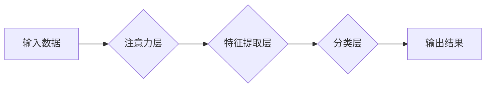

                 

## 神经网络在注意力模式识别中的应用

> 关键词：神经网络, 注意力机制, 模式识别, 计算机视觉, 自然语言处理, 深度学习, 序列建模

## 1. 背景介绍

模式识别是人工智能领域的核心任务之一，它旨在从数据中学习并识别模式，从而实现对未知数据的分类、预测和理解。传统模式识别方法通常依赖于手工设计的特征工程，但随着深度学习的兴起，基于神经网络的模式识别方法取得了显著的进展。

注意力机制作为深度学习领域的重要创新，能够帮助神经网络更好地关注输入数据中的重要信息，从而提高识别模式的准确性和效率。注意力机制的引入，使得神经网络能够像人类一样，在处理复杂信息时，集中注意力于关键部分，忽略无关信息。

## 2. 核心概念与联系

### 2.1 注意力机制

注意力机制是一种模仿人类注意力机制的计算模型，它允许神经网络在处理序列数据时，根据输入数据的不同重要性分配不同的权重。

注意力机制的核心思想是，在处理序列数据时，并非所有元素都具有相同的权重，一些元素可能比其他元素更重要。注意力机制通过学习一个注意力权重向量，来分配不同元素的权重，从而突出重要信息。

### 2.2 模式识别

模式识别是指从数据中识别出潜在的模式或规律的过程。模式识别应用广泛，例如：

* **图像识别:** 从图像中识别物体、场景、人脸等。
* **语音识别:** 将语音信号转换为文本。
* **自然语言处理:** 理解和生成自然语言文本。
* **异常检测:** 从数据中识别异常值或事件。

### 2.3 神经网络

神经网络是一种模仿人类大脑结构和功能的计算模型。它由多个层组成，每层包含多个神经元。神经元之间通过连接和权重进行信息传递。通过训练神经网络，可以学习到数据中的模式和规律。

**Mermaid 流程图**



## 3. 核心算法原理 & 具体操作步骤

### 3.1 算法原理概述

注意力机制在模式识别中，主要用于提高神经网络对输入数据的关注度，从而提高识别准确率。

注意力机制的基本原理是，通过学习一个注意力权重向量，来分配不同输入元素的权重。权重高的元素，意味着该元素对模式识别的贡献更大。

### 3.2 算法步骤详解

1. **输入数据:** 将模式识别任务的输入数据输入到神经网络中。
2. **特征提取:** 使用卷积层、循环神经网络等网络结构，提取输入数据的特征。
3. **注意力计算:** 使用注意力机制计算每个输入元素的注意力权重。
4. **加权求和:** 将特征向量与注意力权重向量相乘，得到加权后的特征向量。
5. **分类:** 使用全连接层或其他分类器，对加权后的特征向量进行分类。

### 3.3 算法优缺点

**优点:**

* **提高识别准确率:** 通过关注重要信息，注意力机制可以提高神经网络的识别准确率。
* **处理长序列数据:** 注意力机制可以有效地处理长序列数据，例如文本和语音。
* **可解释性:** 注意力权重可以提供对神经网络决策的解释。

**缺点:**

* **计算复杂度:** 注意力机制的计算复杂度较高，需要更多的计算资源。
* **参数量:** 注意力机制需要更多的参数，需要更多的训练数据。

### 3.4 算法应用领域

注意力机制在模式识别领域有着广泛的应用，例如：

* **图像识别:** 用于识别图像中的物体、场景、人脸等。
* **语音识别:** 用于将语音信号转换为文本。
* **自然语言处理:** 用于机器翻译、文本摘要、问答系统等。
* **医疗诊断:** 用于分析医学图像，辅助医生诊断疾病。

## 4. 数学模型和公式 & 详细讲解 & 举例说明

### 4.1 数学模型构建

注意力机制的数学模型通常基于一个注意力权重向量，该向量表示每个输入元素的重要性。

假设输入序列长度为 $T$，每个元素的特征向量为 $x_t$，则注意力权重向量为 $a_t$，其中 $t = 1, 2, ..., T$。

### 4.2 公式推导过程

注意力权重向量 $a_t$ 通常通过以下公式计算：

$$
a_t = \frac{exp(score(x_t, h))}{\sum_{i=1}^{T} exp(score(x_i, h))}
$$

其中，$score(x_t, h)$ 是输入元素 $x_t$ 与隐藏状态 $h$ 之间的得分函数，可以是点积、余弦相似度等。

### 4.3 案例分析与讲解

**举例说明:**

假设我们有一个文本序列，每个单词的特征向量为 $x_t$，隐藏状态为 $h$。

我们可以使用点积作为得分函数，计算每个单词的注意力权重：

$$
score(x_t, h) = x_t^T h
$$

然后，将每个单词的注意力权重归一化，得到注意力权重向量 $a_t$。

最终，我们可以使用注意力权重向量 $a_t$ 加权求和输入元素 $x_t$，得到加权后的特征向量：

$$
\tilde{x} = \sum_{t=1}^{T} a_t x_t
$$

## 5. 项目实践：代码实例和详细解释说明

### 5.1 开发环境搭建

* Python 3.6+
* TensorFlow 2.0+
* PyTorch 1.0+
* Jupyter Notebook

### 5.2 源代码详细实现

```python
import tensorflow as tf

# 定义注意力层
class AttentionLayer(tf.keras.layers.Layer):
    def __init__(self, units):
        super(AttentionLayer, self).__init__()
        self.W1 = tf.keras.layers.Dense(units)
        self.W2 = tf.keras.layers.Dense(units)
        self.v = tf.keras.layers.Dense(1)

    def call(self, inputs):
        # inputs: (batch_size, sequence_length, units)
        # 计算每个元素的得分
        scores = self.v(tf.tanh(self.W1(inputs) + self.W2(inputs[:, 0, :])))
        # 归一化得分
        attention_weights = tf.nn.softmax(scores, axis=1)
        # 加权求和
        context_vector = tf.matmul(attention_weights, inputs)
        return context_vector

# 定义模型
model = tf.keras.Sequential([
    tf.keras.layers.Embedding(input_dim=10000, output_dim=128),
    AttentionLayer(units=128),
    tf.keras.layers.Dense(units=10, activation='softmax')
])

# 编译模型
model.compile(optimizer='adam', loss='sparse_categorical_crossentropy', metrics=['accuracy'])

# 训练模型
model.fit(x_train, y_train, epochs=10)
```

### 5.3 代码解读与分析

* **AttentionLayer:** 定义了一个注意力层，包含三个密集层：
    * `W1`: 将输入特征向量映射到一个中间空间。
    * `W2`: 将第一个时间步的隐藏状态映射到一个中间空间。
    * `v`: 计算每个元素的得分。
* **模型结构:** 模型结构包含嵌入层、注意力层和全连接层。
* **训练过程:** 使用 Adam 优化器，交叉熵损失函数和准确率指标训练模型。

### 5.4 运行结果展示

训练完成后，可以使用测试集评估模型的性能。

## 6. 实际应用场景

### 6.1 图像识别

注意力机制可以用于图像识别，例如识别图像中的物体、场景、人脸等。

通过注意力机制，神经网络可以关注图像中与目标物体相关的区域，从而提高识别准确率。

### 6.2 语音识别

注意力机制可以用于语音识别，例如将语音信号转换为文本。

通过注意力机制，神经网络可以关注语音信号中与目标单词相关的部分，从而提高识别准确率。

### 6.3 自然语言处理

注意力机制可以用于自然语言处理，例如机器翻译、文本摘要、问答系统等。

通过注意力机制，神经网络可以关注文本中与目标任务相关的部分，从而提高任务的准确率和效率。

### 6.4 未来应用展望

注意力机制在模式识别领域有着广阔的应用前景，未来可能应用于：

* **医疗诊断:** 分析医学图像，辅助医生诊断疾病。
* **金融风险控制:** 检测金融交易中的异常行为。
* **智能交通:** 分析交通流量，优化交通管理。

## 7. 工具和资源推荐

### 7.1 学习资源推荐

* **书籍:**
    * Deep Learning by Ian Goodfellow, Yoshua Bengio, and Aaron Courville
    * Attention Is All You Need by Vaswani et al.
* **论文:**
    * "Attention Is All You Need"
    * "BERT: Pre-training of Deep Bidirectional Transformers for Language Understanding"
* **在线课程:**
    * Coursera: Deep Learning Specialization
    * Udacity: Deep Learning Nanodegree

### 7.2 开发工具推荐

* **TensorFlow:** 开源深度学习框架
* **PyTorch:** 开源深度学习框架
* **Keras:** 高级深度学习API

### 7.3 相关论文推荐

* "Attention Is All You Need"
* "BERT: Pre-training of Deep Bidirectional Transformers for Language Understanding"
* "Transformer-XL: Attentive Language Models Beyond a Fixed-Length Context"

## 8. 总结：未来发展趋势与挑战

### 8.1 研究成果总结

注意力机制在模式识别领域取得了显著的进展，提高了神经网络的识别准确率和效率。

### 8.2 未来发展趋势

* **更有效的注意力机制:** 研究更有效的注意力机制，例如自注意力机制、多头注意力机制等。
* **注意力机制的应用扩展:** 将注意力机制应用于更多领域，例如医疗诊断、金融风险控制等。
* **注意力机制的可解释性:** 研究注意力机制的可解释性，以便更好地理解神经网络的决策过程。

### 8.3 面临的挑战

* **计算复杂度:** 注意力机制的计算复杂度较高，需要更多的计算资源。
* **参数量:** 注意力机制需要更多的参数，需要更多的训练数据。
* **可解释性:** 注意力机制的可解释性较差，难以理解神经网络的决策过程。

### 8.4 研究展望

未来，注意力机制的研究将继续深入，探索更有效的注意力机制、更广泛的应用场景和更好的可解释性。


## 9. 附录：常见问题与解答

**Q1: 注意力机制与传统特征工程相比，有什么优势？**

**A1:** 注意力机制可以自动学习输入数据的特征，而传统特征工程需要人工设计特征，这在处理复杂数据时，注意力机制具有更大的优势。

**Q2: 注意力机制的计算复杂度较高，如何降低计算复杂度？**

**A2:** 可以使用一些技巧来降低注意力机制的计算复杂度，例如使用低秩分解、稀疏注意力等。

**Q3: 注意力机制的可解释性较差，如何提高可解释性？**

**A3:** 可以使用一些方法来提高注意力机制的可解释性，例如可视化注意力权重、使用注意力引导的特征分析等。


作者：禅与计算机程序设计艺术 / Zen and the Art of Computer Programming 
<end_of_turn>

