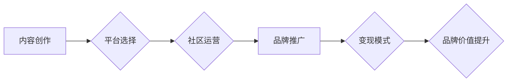

                 

## 程序员的知识付费品牌建设与维护

> 关键词：知识付费、程序员、品牌建设、内容创作、社区运营、技术博客、在线课程、付费订阅

### 1. 背景介绍

在当今数字时代，技术人才需求日益增长，程序员作为科技发展的重要力量，拥有着巨大的知识和技能价值。知识付费作为一种新型的商业模式，为程序员提供了展示专业能力、分享经验、获取收益的平台。然而，知识付费市场竞争激烈，想要打造成功的知识付费品牌，程序员需要具备清晰的定位、优质的内容、有效的运营策略以及持续的创新能力。

### 2. 核心概念与联系

**2.1 知识付费品牌建设**

知识付费品牌建设是指程序员通过持续输出优质技术内容，建立自身专业形象，积累粉丝基础，最终实现知识变现的过程。

**2.2 品牌价值链**

知识付费品牌建设是一个价值链的过程，包括以下几个关键环节：

* **内容创作:**  提供有价值、实用、原创的技术内容，满足目标受众的需求。
* **平台选择:**  选择合适的知识付费平台，例如技术博客、在线课程平台、付费订阅平台等。
* **社区运营:**  建立活跃的社区，与粉丝互动交流，形成知识共享和学习氛围。
* **品牌推广:**  通过多种渠道推广品牌，例如社交媒体、技术论坛、线下活动等。
* **变现模式:**  选择合适的变现模式，例如在线课程销售、付费订阅、咨询服务等。

**2.3  品牌建设流程图**



### 3. 核心算法原理 & 具体操作步骤

**3.1 算法原理概述**

知识付费品牌建设的核心算法在于持续输出优质内容，并通过数据分析和用户反馈不断优化内容策略，最终实现用户粘性和品牌价值提升。

**3.2 算法步骤详解**

1. **目标受众分析:**  明确目标受众的专业领域、技术水平、学习需求等，为内容创作提供方向。
2. **内容规划:**  根据目标受众需求，制定内容规划，确定内容主题、形式、频率等。
3. **内容创作:**  创作高质量、原创、有价值的技术内容，例如技术博客文章、视频教程、在线课程等。
4. **平台运营:**  选择合适的平台，并进行平台运营，例如网站优化、社交媒体推广、社区管理等。
5. **数据分析:**  收集用户数据，分析用户行为、内容偏好等，为内容优化提供依据。
6. **内容迭代:**  根据数据分析和用户反馈，不断迭代优化内容，提高内容质量和用户粘性。

**3.3 算法优缺点**

* **优点:**  可持续性强，能够不断积累知识资产和品牌价值。
* **缺点:**  需要投入大量时间和精力，初期收益可能较低。

**3.4 算法应用领域**

* **技术博客:**  程序员可以通过技术博客分享技术经验、发表原创文章，建立个人品牌。
* **在线课程:**  程序员可以录制技术课程，通过在线平台销售，实现知识变现。
* **付费订阅:**  程序员可以提供付费订阅服务，例如技术咨询、代码库访问等，为用户提供更深入的技术支持。

### 4. 数学模型和公式 & 详细讲解 & 举例说明

**4.1 数学模型构建**

知识付费品牌建设可以看作是一个用户增长和价值提升的动态系统，可以用以下数学模型来描述：

* **用户增长模型:**  用户数量随着时间的推移呈指数增长，可以表示为：

$$
U(t) = U_0 * e^{rt}
$$

其中：

*  $U(t)$  表示时间 $t$ 时刻的用户数量
*  $U_0$  表示初始用户数量
*  $r$  表示用户增长率
*  $t$  表示时间

* **品牌价值提升模型:**  品牌价值随着用户数量和用户参与度的提升而增长，可以表示为：

$$
V(t) = k * U(t) * E(t)
$$

其中：

*  $V(t)$  表示时间 $t$ 时刻的品牌价值
*  $k$  表示品牌价值增长系数
*  $E(t)$  表示用户参与度

**4.2 公式推导过程**

用户增长率 $r$  受多种因素影响，例如内容质量、平台推广、用户体验等。用户参与度 $E(t)$  受用户粘性、互动频率、内容价值等因素影响。

**4.3 案例分析与讲解**

假设一个程序员通过技术博客分享编程经验，初始用户数量为 100 人，用户增长率为 10% per month，用户参与度为 0.5。

根据上述公式，我们可以计算出该程序员的品牌价值：

*  $U(t) = 100 * e^{0.1t}$
*  $V(t) = k * 100 * e^{0.1t} * 0.5$

其中 $k$  需要根据实际情况进行调整。

### 5. 项目实践：代码实例和详细解释说明

**5.1 开发环境搭建**

*  操作系统:  Windows/macOS/Linux
*  编程语言:  Python/JavaScript/Java
*  开发工具:  VS Code/Atom/Sublime Text
*  数据库:  MySQL/PostgreSQL/MongoDB

**5.2 源代码详细实现**

以下是一个简单的 Python 代码实例，用于展示技术博客文章的发布流程:

```python
import requests

def publish_article(title, content, url):
    """
    发布技术博客文章
    """
    headers = {
        "Authorization": "Bearer your_api_token"
    }
    data = {
        "title": title,
        "content": content
    }
    response = requests.post(url, headers=headers, json=data)
    if response.status_code == 200:
        print("文章发布成功!")
    else:
        print("文章发布失败:", response.text)

# 示例用法
title = "Python 编程基础"
content = """
Python 是一种解释型、面向对象的编程语言，
其语法简洁易懂，应用广泛。
"""
url = "https://api.example.com/articles"
publish_article(title, content, url)
```

**5.3 代码解读与分析**

该代码使用 Python 的 `requests` 库发送 HTTP POST 请求，将文章标题和内容发送到博客平台的 API 接口。

*  `headers`  包含 API 接口所需的授权信息。
*  `data`  包含文章标题和内容。
*  `response`  包含 API 接口的响应结果。

**5.4 运行结果展示**

如果文章发布成功，则会打印 "文章发布成功!" 的信息。否则，会打印错误信息。

### 6. 实际应用场景

**6.1 技术博客**

程序员可以通过技术博客分享技术经验、发表原创文章，建立个人品牌，吸引潜在客户或雇主。

**6.2 在线课程**

程序员可以录制技术课程，通过在线平台销售，例如 Udemy、Coursera、Skillshare 等，实现知识变现。

**6.3 付费订阅**

程序员可以提供付费订阅服务，例如技术咨询、代码库访问、专属社区等，为用户提供更深入的技术支持。

**6.4 未来应用展望**

随着人工智能、虚拟现实等技术的不断发展，知识付费品牌建设将迎来更多新的应用场景和发展机遇。例如：

*  **个性化学习:**  根据用户的学习需求和进度，提供个性化的学习内容和学习路径。
*  **沉浸式学习:**  利用虚拟现实技术，打造沉浸式的学习环境，提升学习体验。
*  **智能化学习:**  利用人工智能技术，自动生成学习内容、评估学习效果、提供个性化建议。

### 7. 工具和资源推荐

**7.1 学习资源推荐**

*  **书籍:**  《程序员的自我修养》、《代码的艺术》、《设计模式》
*  **在线课程:**  Coursera、Udemy、edX
*  **技术博客:**  Hacker News、Medium、Dev.to

**7.2 开发工具推荐**

*  **代码编辑器:**  VS Code、Atom、Sublime Text
*  **版本控制系统:**  Git
*  **项目管理工具:**  Trello、Asana

**7.3 相关论文推荐**

*  "The Economics of Online Education"
*  "The Impact of Online Learning on Student Outcomes"
*  "The Future of Knowledge Sharing"

### 8. 总结：未来发展趋势与挑战

**8.1 研究成果总结**

知识付费品牌建设是一个不断发展和完善的过程，需要程序员不断学习新的技术、掌握新的技能，并不断优化内容策略和运营模式。

**8.2 未来发展趋势**

*  **个性化定制:**  根据用户的学习需求和喜好，提供个性化的学习内容和学习路径。
*  **沉浸式体验:**  利用虚拟现实、增强现实等技术，打造沉浸式的学习环境，提升学习体验。
*  **智能化辅助:**  利用人工智能技术，自动生成学习内容、评估学习效果、提供个性化建议。

**8.3 面临的挑战**

*  **内容质量竞争:**  知识付费市场竞争激烈，需要程序员不断提升内容质量，才能吸引用户。
*  **用户粘性提升:**  需要程序员不断优化用户体验，提高用户粘性，才能实现知识变现。
*  **平台生态建设:**  需要平台方不断完善平台生态，为程序员提供更好的服务和支持。

**8.4 研究展望**

未来，知识付费品牌建设将更加注重用户体验、个性化定制和智能化辅助，并与其他新兴技术融合，创造更加丰富多彩的学习体验。

### 9. 附录：常见问题与解答

**9.1 如何选择合适的知识付费平台？**

需要根据自己的目标受众、内容类型、变现模式等因素选择合适的平台。

**9.2 如何提升内容质量？**

需要不断学习新的技术、掌握新的技能，并注重内容的原创性、实用性和价值性。

**9.3 如何提高用户粘性？**

需要不断优化用户体验，例如提供互动功能、建立社区氛围、提供个性化服务等。


作者：禅与计算机程序设计艺术 / Zen and the Art of Computer Programming 
<end_of_turn>

