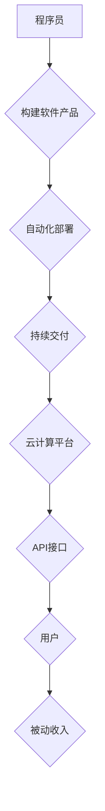

                 

## 程序员的被动收入：构建与维护

> 关键词：被动收入、软件开发、自动化、云计算、持续交付、API、微服务、云函数

### 1. 背景介绍

在当今科技飞速发展的时代，程序员作为数字时代的核心力量，拥有着创造价值和获取财富的巨大潜力。然而，传统的编程工作模式往往以项目为单位，收入波动较大，难以实现持续稳定的被动收入。随着云计算、自动化、持续交付等技术的不断发展，程序员可以通过构建和维护软件产品，实现持续的被动收入。

被动收入是指无需持续投入时间和精力就能获得的收入。对于程序员来说，构建和维护软件产品可以成为实现被动收入的理想途径。通过开发高质量、具有市场需求的软件产品，程序员可以获得持续的订阅收入、广告收入、数据交易收入等多种被动收入来源。

### 2. 核心概念与联系

**2.1 核心概念**

* **被动收入:**  无需持续投入时间和精力就能获得的收入。
* **软件产品:**  用于解决特定问题或满足特定需求的计算机程序。
* **自动化:**  利用技术手段自动执行重复性任务，提高效率和降低成本。
* **云计算:**  利用互联网提供计算资源、存储资源和网络资源的服务。
* **持续交付:**  将软件代码频繁地发布到生产环境，确保软件的快速迭代和持续更新。
* **API (应用程序接口):**  允许不同软件系统之间进行数据交换和功能调用。
* **微服务:**  将大型软件系统拆分成多个小型、独立的服务，每个服务负责特定的功能。
* **云函数:**  一种无需服务器管理的计算服务，可以根据事件触发自动执行代码。

**2.2 架构关系**



### 3. 核心算法原理 & 具体操作步骤

**3.1 算法原理概述**

构建和维护软件产品实现被动收入的核心算法原理是自动化和持续交付。通过自动化部署和持续交付，程序员可以将软件产品快速、高效地发布到生产环境，并不断更新和改进产品，以满足用户需求。

**3.2 算法步骤详解**

1. **需求分析:**  明确目标用户和市场需求，确定软件产品的功能和特性。
2. **软件设计:**  设计软件架构、数据库结构、用户界面等。
3. **代码开发:**  根据设计文档编写软件代码。
4. **自动化测试:**  编写自动化测试用例，确保软件质量。
5. **持续集成:**  将代码提交到版本控制系统，并自动触发构建和测试。
6. **持续交付:**  将构建好的软件包自动部署到生产环境。
7. **监控和维护:**  监控软件运行状态，及时修复bug和进行版本更新。

**3.3 算法优缺点**

* **优点:**  提高效率、降低成本、保证软件质量、实现持续更新。
* **缺点:**  需要前期投入时间和精力，需要掌握自动化工具和技术。

**3.4 算法应用领域**

* **SaaS (软件即服务):**  例如办公软件、CRM系统、ERP系统等。
* **移动应用:**  例如游戏、社交软件、电商平台等。
* **API服务:**  例如数据接口、支付接口、短信接口等。
* **云函数:**  例如图片处理、数据分析、事件触发等。

### 4. 数学模型和公式 & 详细讲解 & 举例说明

**4.1 数学模型构建**

被动收入模型可以抽象为一个数学模型，其中收入与用户数量、用户付费率和每位用户平均付费金额相关。

$$
R = N \times P \times A
$$

其中：

* $R$ 代表被动收入
* $N$ 代表用户数量
* $P$ 代表用户付费率
* $A$ 代表每位用户平均付费金额

**4.2 公式推导过程**

该公式的推导过程基于以下假设：

* 所有用户都具有相同的付费行为。
* 用户付费行为保持稳定。

**4.3 案例分析与讲解**

假设一个 SaaS 产品，拥有 1000 个用户，用户付费率为 20%，每位用户平均付费金额为 10 美元。

根据公式，该产品的被动收入为：

$$
R = 1000 \times 0.2 \times 10 = 2000 美元
$$

### 5. 项目实践：代码实例和详细解释说明

**5.1 开发环境搭建**

* **操作系统:**  Linux 或 macOS
* **编程语言:**  Python 或 Node.js
* **云平台:**  AWS、Azure 或 Google Cloud
* **版本控制系统:**  Git
* **持续集成/持续交付工具:**  Jenkins、CircleCI 或 Travis CI

**5.2 源代码详细实现**

以下是一个简单的 Python 代码示例，演示如何使用 Flask 框架构建一个简单的 API 服务：

```python
from flask import Flask, jsonify

app = Flask(__name__)

@app.route('/api/hello', methods=['GET'])
def hello():
    return jsonify({'message': 'Hello, world!'})

if __name__ == '__main__':
    app.run(debug=True)
```

**5.3 代码解读与分析**

* `Flask` 是一个轻量级的 Python Web 框架。
* `@app.route('/api/hello', methods=['GET'])` 定义了一个名为 `/api/hello` 的 API 路由，支持 GET 请求。
* `hello()` 函数处理 GET 请求，返回一个 JSON 响应。
* `app.run(debug=True)` 启动 Flask 应用，并开启调试模式。

**5.4 运行结果展示**

运行上述代码后，访问 `http://localhost:5000/api/hello`，将返回以下 JSON 响应：

```json
{
  "message": "Hello, world!"
}
```

### 6. 实际应用场景

**6.1 SaaS 产品**

* **办公软件:**  例如在线文档编辑器、协作平台、项目管理工具等。
* **CRM 系统:**  用于管理客户关系，例如销售线索跟踪、客户沟通记录、客户服务等。
* **ERP 系统:**  用于管理企业资源，例如财务管理、库存管理、生产管理等。

**6.2 移动应用**

* **游戏:**  例如休闲游戏、策略游戏、角色扮演游戏等。
* **社交软件:**  例如聊天软件、社交网络、社区平台等。
* **电商平台:**  例如在线购物、商品预订、物流配送等。

**6.3 API 服务**

* **数据接口:**  提供数据查询、数据分析、数据挖掘等服务。
* **支付接口:**  提供在线支付、第三方支付、资金转账等服务。
* **短信接口:**  提供短信发送、短信接收、短信营销等服务。

**6.4 未来应用展望**

随着人工智能、物联网、大数据等技术的不断发展，被动收入模式将更加广泛地应用于各个领域。例如：

* **智能家居:**  通过开发智能家居设备的 API 服务，实现远程控制、自动化场景等功能，并通过订阅模式获取被动收入。
* **个性化教育:**  通过开发个性化学习平台，根据用户的学习进度和需求提供定制化的学习内容，并通过付费课程、会员服务等模式获取被动收入。
* **医疗健康:**  通过开发医疗健康数据分析平台，提供疾病预测、健康管理等服务，并通过数据交易、广告收入等模式获取被动收入。

### 7. 工具和资源推荐

**7.1 学习资源推荐**

* **书籍:**  《程序员的成长之路》、《构建可持续的软件系统》
* **在线课程:**  Coursera、Udemy、edX 等平台上的软件开发、云计算、持续交付等课程。
* **博客和论坛:**  Stack Overflow、GitHub 等平台上的技术博客和论坛。

**7.2 开发工具推荐**

* **版本控制系统:**  Git
* **持续集成/持续交付工具:**  Jenkins、CircleCI、Travis CI
* **云平台:**  AWS、Azure、Google Cloud
* **编程语言:**  Python、Node.js、Java 等

**7.3 相关论文推荐**

* **持续交付:**  Martin Fowler 的《Continuous Delivery》
* **微服务架构:**  Sam Newman 的《Building Microservices》
* **云计算:**  Amazon Web Services 的《AWS Well-Architected Framework》

### 8. 总结：未来发展趋势与挑战

**8.1 研究成果总结**

构建和维护软件产品实现被动收入是一种有效的技术手段，可以帮助程序员获得持续的收入来源。通过自动化、持续交付、云计算等技术的应用，程序员可以更高效地开发和维护软件产品，并将其快速部署到生产环境，以满足用户需求。

**8.2 未来发展趋势**

* **人工智能:**  人工智能技术将进一步推动软件产品的自动化和智能化，例如自动代码生成、自动测试、自动部署等。
* **物联网:**  物联网技术将为软件产品提供更多的数据和应用场景，例如智能家居、智能交通、智能医疗等。
* **区块链:**  区块链技术可以为软件产品提供更加安全、透明和可信赖的运行环境，例如去中心化应用、数字资产管理等。

**8.3 面临的挑战**

* **技术复杂性:**  构建和维护复杂的软件产品需要掌握多种技术，例如云计算、微服务、人工智能等。
* **市场竞争:**  软件产品市场竞争激烈，需要不断创新和迭代才能保持竞争力。
* **用户体验:**  软件产品的用户体验至关重要，需要不断优化和改进用户界面、功能和性能。

**8.4 研究展望**

未来，研究人员将继续探索新的技术和方法，以提高软件产品的自动化程度、智能化程度和用户体验。同时，也将关注软件产品的安全性和可信赖性，以应对日益复杂的网络安全威胁。

### 9. 附录：常见问题与解答

**9.1 如何选择合适的软件产品开发方向？**

选择合适的软件产品开发方向需要考虑以下因素：

* **市场需求:**  选择具有市场需求的软件产品方向。
* **个人兴趣:**  选择自己感兴趣的软件产品方向。
* **技术能力:**  选择自己能够掌握的技术栈的软件产品方向。

**9.2 如何实现软件产品的自动化部署？**

可以使用持续集成/持续交付工具，例如 Jenkins、CircleCI、Travis CI 等，实现软件产品的自动化部署。

**9.3 如何保证软件产品的安全性和可信赖性？**

可以通过以下措施保证软件产品的安全性和可信赖性：

* **代码审查:**  对代码进行严格的审查，以发现潜在的安全漏洞。
* **安全测试:**  对软件产品进行安全测试，以验证其安全性。
* **数据加密:**  对敏感数据进行加密，以保护其安全。
* **访问控制:**  对软件产品的访问进行控制，以防止未授权访问。


作者：禅与计算机程序设计艺术 / Zen and the Art of Computer Programming 
<end_of_turn>

