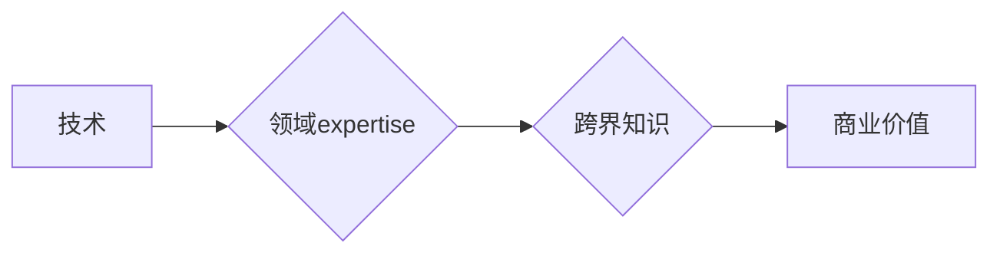

                 

## 程序员的跨界知识变现：技术+领域expertise

> 关键词：程序员、跨界知识、变现、领域expertise、技术应用、商业价值、案例分析、未来趋势

### 1. 背景介绍

在当今科技飞速发展的时代，程序员的需求量持续增长，但竞争也日益激烈。单纯依靠技术技能已经难以立足，程序员需要不断提升自身价值，寻求新的发展方向。跨界知识的学习和应用成为程序员提升竞争力的关键。

**跨界知识**是指在不同领域之间建立联系和理解，将不同领域的知识和技能融合在一起，创造新的价值。对于程序员而言，跨界知识意味着将自身的技术能力与特定领域知识相结合，从而解决更复杂、更具挑战性的问题，并创造更大的商业价值。

### 2. 核心概念与联系

**技术+领域expertise** 是程序员跨界知识变现的核心概念。

* **技术**：指程序员掌握的编程语言、软件开发工具、算法设计等技能。
* **领域expertise**：指对特定领域（如金融、医疗、教育等）的深入理解和专业知识。

两者相结合，可以赋予程序员更强的洞察力和解决问题的能力，使其能够在特定领域提供更有价值的服务。

**Mermaid 流程图**



### 3. 核心算法原理 & 具体操作步骤

**3.1 算法原理概述**

跨界知识变现的核心算法原理是**知识融合**。

知识融合是指将不同领域的知识和数据进行整合和分析，以发现新的模式和关系，从而生成新的知识和洞察。

**3.2 算法步骤详解**

1. **数据收集**: 从技术和领域两个方面收集相关数据。
2. **数据预处理**: 对收集到的数据进行清洗、转换和格式化，使其能够被算法处理。
3. **特征提取**: 从数据中提取关键特征，并进行量化处理。
4. **知识表示**: 将提取的特征和领域知识表示为可被算法理解的形式，如知识图谱、语义网络等。
5. **知识融合**: 利用机器学习、深度学习等算法，对不同领域的知识进行融合和分析，发现新的模式和关系。
6. **知识应用**: 将融合后的知识应用于实际问题中，例如开发新的产品、服务或解决方案。

**3.3 算法优缺点**

* **优点**:
    * 可以发现传统方法难以发现的知识和洞察。
    * 可以提高解决复杂问题的效率和准确性。
    * 可以为企业创造新的商业价值。
* **缺点**:
    * 需要大量的技术和领域知识。
    * 数据质量对算法结果有很大影响。
    * 算法的复杂性可能导致开发和维护成本高。

**3.4 算法应用领域**

* **金融**: 金融风险评估、欺诈检测、个性化投资建议等。
* **医疗**: 疾病诊断、药物研发、个性化医疗等。
* **教育**: 个性化学习推荐、智能辅导系统等。
* **制造业**: 预测性维护、质量控制、生产优化等。

### 4. 数学模型和公式 & 详细讲解 & 举例说明

**4.1 数学模型构建**

知识融合可以建模为一个**图论问题**。

* 节点：代表不同的知识实体，如概念、事件、实体等。
* 边：代表知识实体之间的关系，如“包含”、“相似”、“因果”等。

**4.2 公式推导过程**

可以使用**PageRank算法**来计算知识实体的重要性。PageRank算法是一种用于网页排名算法的算法，也可以应用于知识图谱中。

**PageRank公式**:

$$PR(A) = (1-d) + d \sum_{Page B links to A} \frac{PR(B)}{OutDegree(B)}$$

其中：

* $PR(A)$：知识实体A的重要性得分。
* $d$：阻尼因子，通常取值为0.85。
* $OutDegree(B)$：知识实体B的出度，即指向其他实体的边的数量。

**4.3 案例分析与讲解**

假设我们有一个知识图谱，包含了金融领域的知识实体和关系。我们可以使用PageRank算法计算每个实体的重要性得分。例如，如果一个实体与许多重要的金融概念相关联，那么它的PageRank得分就会更高。

### 5. 项目实践：代码实例和详细解释说明

**5.1 开发环境搭建**

* Python 3.x
* Jupyter Notebook
* NetworkX库

**5.2 源代码详细实现**

```python
import networkx as nx

# 创建知识图谱
graph = nx.Graph()

# 添加节点
graph.add_nodes_from(["股票", "债券", "基金", "银行", "保险"])

# 添加边
graph.add_edges_from([("股票", "银行"), ("股票", "基金"), ("债券", "银行"), ("基金", "保险")])

# 计算PageRank得分
pagerank_scores = nx.pagerank(graph)

# 打印PageRank得分
print(pagerank_scores)
```

**5.3 代码解读与分析**

* 使用NetworkX库创建知识图谱。
* 添加金融领域的知识实体和关系。
* 使用nx.pagerank()函数计算每个实体的PageRank得分。
* 打印PageRank得分。

**5.4 运行结果展示**

运行代码后，会输出每个实体的PageRank得分。得分越高，表示该实体在知识图谱中越重要。

### 6. 实际应用场景

**6.1 金融风险评估**

利用跨界知识，可以将金融数据与风险因素进行融合，构建更精准的风险评估模型。

**6.2 医疗诊断辅助**

将医学知识与患者数据融合，可以辅助医生进行疾病诊断，提高诊断准确率。

**6.3 个性化教育推荐**

根据学生的学习情况和兴趣爱好，推荐个性化的学习内容和学习路径。

**6.4 未来应用展望**

随着人工智能技术的不断发展，跨界知识变现的应用场景将会更加广泛，例如：

* 智能客服：利用自然语言处理技术和领域知识，构建更智能的客服系统。
* 智能营销：根据用户的行为数据和兴趣爱好，进行精准的营销推广。
* 智能制造：利用机器学习和工业知识，实现智能化生产和管理。

### 7. 工具和资源推荐

**7.1 学习资源推荐**

* **书籍**:
    * 《深度学习》
    * 《机器学习实战》
    * 《自然语言处理入门》
* **在线课程**:
    * Coursera
    * edX
    * Udacity

**7.2 开发工具推荐**

* **Python**: 广泛应用于数据科学和人工智能领域。
* **TensorFlow**: 深度学习框架。
* **PyTorch**: 深度学习框架。
* **Scikit-learn**: 机器学习库。

**7.3 相关论文推荐**

* **Knowledge Graph Embedding**: 知识图谱嵌入技术。
* **Transfer Learning**: 迁移学习技术。
* **Explainable AI**: 可解释人工智能技术。

### 8. 总结：未来发展趋势与挑战

**8.1 研究成果总结**

跨界知识变现是人工智能领域的重要研究方向，取得了一系列成果。

* 知识图谱技术的发展使得知识表示和融合更加高效。
* 深度学习算法的进步提高了知识发现和应用的准确性。
* 可解释人工智能技术的应用使得跨界知识变现更加透明和可信赖。

**8.2 未来发展趋势**

* **更精准的知识融合**: 利用更先进的算法和模型，实现更精准的知识融合。
* **更广泛的应用场景**: 将跨界知识变现应用于更多领域，例如医疗、教育、法律等。
* **更智能的知识应用**: 开发更智能的知识应用系统，能够自动发现和利用跨界知识。

**8.3 面临的挑战**

* **数据质量**: 跨界知识变现依赖于高质量的数据，数据质量问题是需要解决的关键挑战。
* **知识表示**: 如何更好地表示和融合不同领域的知识仍然是一个难题。
* **伦理问题**: 跨界知识变现可能涉及到伦理问题，例如数据隐私和算法偏见，需要引起重视。

**8.4 研究展望**

未来，跨界知识变现的研究将继续深入，探索更先进的算法、模型和应用场景，为社会带来更多价值。

### 9. 附录：常见问题与解答

**9.1 如何获取跨界知识？**

* 阅读相关领域的书籍和论文。
* 参加行业会议和培训课程。
* 与领域专家交流学习。

**9.2 如何评估跨界知识的价值？**

* 通过实际应用场景的测试和评估。
* 比较不同跨界知识方案的性能和效果。
* 考虑跨界知识的商业价值和社会影响。


作者：禅与计算机程序设计艺术 / Zen and the Art of Computer Programming 
<end_of_turn>

