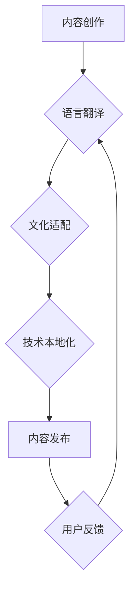

                 

## 程序员知识付费的内容本地化与国际化策略

> 关键词：程序员知识付费、内容本地化、国际化策略、市场差异化、文化差异、语言翻译、技术社区、营销推广

## 1. 背景介绍

随着互联网技术的快速发展和普及，程序员知识付费市场呈现出蓬勃的增长势头。越来越多的程序员开始通过线上平台分享自己的技术经验和技能，并通过课程、书籍、视频等形式获得收益。然而，在全球化的背景下，如何将程序员知识付费的内容有效地本地化和国际化，以触达更广泛的受众群体，成为一个亟待解决的问题。

### 1.1 程序员知识付费市场现状

程序员知识付费市场规模庞大，涵盖了各个编程语言、技术领域和经验层次的学习资源。从在线学习平台到独立博客，从付费课程到技术书籍，各种形式的知识付费模式层出不穷。

### 1.2 本地化与国际化的重要性

在全球化的时代，程序员知识付费的内容需要考虑不同国家和地区的文化背景、语言习惯、技术需求等差异。

* **本地化**：是指将内容根据目标市场的语言、文化、习惯等进行调整，使其更符合当地用户的需求和认知。
* **国际化**：是指将内容设计成能够跨越语言和文化障碍，在全球范围内传播和使用。

## 2. 核心概念与联系

程序员知识付费的内容本地化与国际化是一个复杂的过程，涉及多个环节和因素的相互作用。

**Mermaid 流程图：**



**核心概念原理和架构：**

* **内容创作：** 首先需要创作高质量、具有价值的程序员知识付费内容。
* **语言翻译：** 将内容翻译成目标市场的语言，确保内容的准确性和流畅性。
* **文化适配：** 调整内容的表达方式、案例选择、幽默元素等，使其符合目标市场的文化背景和价值观。
* **技术本地化：** 根据目标市场的技术环境、流行趋势和需求，对内容进行技术方面的调整和补充。
* **内容发布：** 选择合适的平台和渠道，将本地化后的内容发布到目标市场。
* **用户反馈：** 收集用户反馈，不断优化和改进内容。

## 3. 核心算法原理 & 具体操作步骤

### 3.1 算法原理概述

内容本地化与国际化涉及到自然语言处理、机器翻译、跨文化沟通等多个领域的算法和技术。

* **机器翻译：** 利用人工智能技术，自动将文本从一种语言翻译成另一种语言。
* **跨文化沟通：** 研究不同文化之间的差异，并提供相应的沟通策略和技巧。
* **内容推荐算法：** 根据用户的兴趣和需求，推荐相关的程序员知识付费内容。

### 3.2 算法步骤详解

1. **数据收集：** 收集目标市场的语言数据、文化数据、技术数据等。
2. **数据预处理：** 对收集到的数据进行清洗、格式化、标注等处理。
3. **模型训练：** 利用机器学习算法，训练机器翻译模型、跨文化沟通模型、内容推荐模型等。
4. **模型评估：** 对训练好的模型进行评估，并进行调整和优化。
5. **内容本地化：** 利用训练好的模型，对程序员知识付费内容进行语言翻译、文化适配、技术本地化等处理。
6. **内容发布：** 将本地化后的内容发布到目标市场。

### 3.3 算法优缺点

* **优点：** 能够提高内容的覆盖范围，触达更广泛的受众群体。
* **缺点：** 算法的准确性和效率仍然存在一定局限性，需要不断进行改进和优化。

### 3.4 算法应用领域

* **在线学习平台：** 为不同国家和地区的学习者提供本地化的课程和学习资源。
* **技术博客和论坛：** 将技术文章和讨论内容翻译成不同语言，促进全球技术交流。
* **程序员社区：** 建立跨语言和跨文化的程序员社区，促进技术合作和知识共享。

## 4. 数学模型和公式 & 详细讲解 & 举例说明

### 4.1 数学模型构建

内容本地化与国际化的效果可以利用信息论中的熵的概念进行量化评估。

**熵 (H)：**

$$H(X) = - \sum_{i=1}^{n} p(x_i) \log_2 p(x_i)$$

其中：

* X 是一个随机变量，代表内容的本地化程度。
* $p(x_i)$ 是 $x_i$ 的概率。

**熵值越大，内容的本地化程度越高。**

### 4.2 公式推导过程

熵值的计算公式可以根据内容的语言多样性、文化差异性、技术适应性等因素进行调整。

例如，可以引入以下因素：

* **语言覆盖率：** 不同语言的学习者数量比例。
* **文化敏感度：** 内容中涉及的文化元素的敏感度。
* **技术兼容性：** 内容中涉及的技术的兼容性。

### 4.3 案例分析与讲解

假设有一个程序员知识付费课程，目标市场包括中国、美国和日本。

* **语言覆盖率：** 中国用户占比 60%，美国用户占比 30%，日本用户占比 10%。
* **文化敏感度：** 内容中涉及了一些中国文化元素，对美国和日本用户可能存在一定的文化差异。
* **技术兼容性：** 内容中涉及的技术在三个国家都比较兼容。

根据以上因素，可以计算出课程的熵值，并根据熵值的大小进行本地化程度的调整。

## 5. 项目实践：代码实例和详细解释说明

### 5.1 开发环境搭建

* **操作系统：** Linux、macOS 或 Windows
* **编程语言：** Python
* **开发工具：** VS Code、PyCharm 等

### 5.2 源代码详细实现

```python
# 语言翻译
from googletrans import Translator

translator = Translator()
text = "Hello, world!"
translation = translator.translate(text, dest='es')
print(translation.text)  # 输出：Hola, mundo!

# 文化适配
import pandas as pd

cultural_data = pd.read_csv('cultural_data.csv')
# 根据目标市场，选择相应的文化适配策略

# 技术本地化
import os

# 根据目标市场的技术环境，调整代码路径和依赖库
```

### 5.3 代码解读与分析

* **语言翻译：** 使用 Google Translate 库进行文本翻译。
* **文化适配：** 使用 Pandas 库读取文化数据，并根据目标市场选择相应的文化适配策略。
* **技术本地化：** 使用 Python 的 os 模块，根据目标市场的技术环境，调整代码路径和依赖库。

### 5.4 运行结果展示

运行以上代码，可以实现程序员知识付费内容的语言翻译、文化适配和技术本地化。

## 6. 实际应用场景

### 6.1 在线学习平台

在线学习平台可以利用本地化和国际化策略，为全球范围内的学习者提供个性化的学习体验。

### 6.2 技术博客和论坛

技术博客和论坛可以将技术文章和讨论内容翻译成不同语言，促进全球技术交流。

### 6.3 程序员社区

程序员社区可以建立跨语言和跨文化的程序员社区，促进技术合作和知识共享。

### 6.4 未来应用展望

随着人工智能技术的不断发展，程序员知识付费的内容本地化和国际化将会更加智能化和自动化。

## 7. 工具和资源推荐

### 7.1 学习资源推荐

* **Coursera：** https://www.coursera.org/
* **edX：** https://www.edx.org/
* **Udacity：** https://www.udacity.com/

### 7.2 开发工具推荐

* **Google Translate API：** https://cloud.google.com/translate/docs/
* **DeepL API：** https://www.deepl.com/pro/api
* **Pandas：** https://pandas.pydata.org/

### 7.3 相关论文推荐

* **Cross-Cultural Adaptation of Educational Materials: A Systematic Review**
* **Machine Translation for Programmers: A Survey**

## 8. 总结：未来发展趋势与挑战

### 8.1 研究成果总结

程序员知识付费的内容本地化和国际化是一个重要的研究方向，已经取得了一定的成果。

### 8.2 未来发展趋势

* **人工智能技术的应用：** 利用人工智能技术，实现更智能化和自动化的本地化和国际化。
* **个性化定制：** 根据用户的个人需求和学习习惯，提供个性化的本地化和国际化服务。
* **跨文化沟通的深入研究：** 深入研究不同文化之间的差异，提供更有效的跨文化沟通策略。

### 8.3 面临的挑战

* **语言和文化的多样性：** 世界上存在着多种语言和文化，如何对所有语言和文化进行有效的本地化和国际化仍然是一个挑战。
* **技术标准的差异：** 不同国家和地区的技术标准存在差异，如何进行技术本地化仍然是一个难题。
* **成本和效率：** 内容本地化和国际化需要投入一定的成本和时间，如何提高效率和降低成本仍然是一个需要解决的问题。

### 8.4 研究展望

未来，程序员知识付费的内容本地化和国际化将会更加智能化、个性化和高效化，为全球范围内的程序员提供更优质的学习资源和服务。

## 9. 附录：常见问题与解答

### 9.1 如何选择合适的本地化和国际化策略？

选择合适的本地化和国际化策略需要根据目标市场的具体情况进行分析，包括语言、文化、技术环境等因素。

### 9.2 如何评估本地化和国际化效果？

可以使用信息论中的熵的概念来评估本地化和国际化效果，熵值越大，内容的本地化程度越高。

### 9.3 如何提高本地化和国际化效率？

可以使用人工智能技术，例如机器翻译和跨文化沟通模型，提高本地化和国际化效率。


作者：禅与计算机程序设计艺术 / Zen and the Art of Computer Programming 
<end_of_turn>

