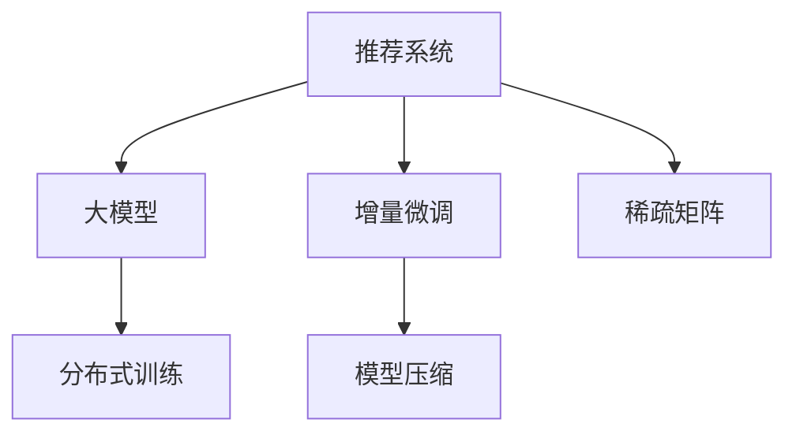

                 

# 推荐系统中的大模型增量微调应用

> 关键词：推荐系统,增量微调,大模型,分布式训练,模型压缩,稀疏矩阵,增量学习,实时推荐

## 1. 背景介绍

### 1.1 问题由来
随着互联网的快速发展和数据的日益增多，推荐系统在电商、新闻、社交、视频等多个领域的应用越来越广泛。推荐系统通过分析用户的历史行为和兴趣偏好，为用户推荐最符合其需求的内容，极大地提升了用户满意度和服务质量。然而，传统的推荐算法，如协同过滤、矩阵分解等，往往依赖于庞大的用户行为数据，需要消耗大量的计算资源和存储成本。

随着深度学习技术的兴起，大模型在推荐系统中的应用逐渐增多。大模型可以通过大规模预训练学习到丰富的用户行为模式和隐含特征，显著提升推荐系统的性能。然而，对于许多实际应用，用户在训练数据上的行为记录往往是不完整的，且实时数据流在不断变化。如何在不重新训练整个模型的情况下，实现模型的增量更新，成为推荐系统工程中的重要挑战。

### 1.2 问题核心关键点
基于大模型的增量微调方法，通过在已有模型上进行小规模的参数更新，可以在不需要重新训练整个模型的前提下，实时适应新的用户数据和实时流，显著提升推荐系统的实时性和可扩展性。核心在于如何将增量数据高效地集成到模型中，并且在不影响现有模型性能的情况下，实现快速更新。

该方法的关键点包括：
1. 数据分布漂移处理。增量数据往往与已有数据存在一定程度的分布差异，如何处理这种差异，是增量微调的前提。
2. 高效增量更新。在大模型参数中，如何高效地选择增量参数进行更新，避免影响模型整体性能。
3. 实时推荐部署。如何将增量微调模型快速部署到实时推荐系统中，以应对高频实时数据流。
4. 模型压缩与优化。如何在大模型微调后，对其进行压缩和优化，以适应计算和存储限制。

本文聚焦于推荐系统中的大模型增量微调方法，旨在提供一套系统化、可行的增量微调方案，供开发者参考和实践。

## 2. 核心概念与联系

### 2.1 核心概念概述

为更好地理解推荐系统中的大模型增量微调方法，本节将介绍几个密切相关的核心概念：

- 推荐系统(Recommendation System)：通过分析用户行为数据，为用户推荐个性化内容的系统。传统的协同过滤、基于内容的推荐、矩阵分解等方法，在工业界应用广泛。
- 大模型(Large Model)：以Transformer为代表的大规模预训练语言模型。通过在大规模无标签文本语料上进行预训练，学习通用的语言表示，具备强大的语言理解和生成能力。
- 增量微调(Incremental Fine-tuning)：指在已有模型的基础上，通过增量数据进行小规模的参数更新，以适应新数据和新任务的方法。
- 分布式训练(Distributed Training)：指在大规模模型上，通过多台计算设备并行计算，加速模型训练过程。
- 模型压缩(Model Compression)：指在大模型微调后，通过剪枝、量化等技术，优化模型大小和计算效率。
- 稀疏矩阵(Sparse Matrix)：指只有少量非零元素的矩阵，常用于表示稀疏的交互数据。

这些核心概念之间的逻辑关系可以通过以下Mermaid流程图来展示：



这个流程图展示了大模型在推荐系统中的核心概念及其之间的关系：

1. 推荐系统通过大模型进行推荐。
2. 大模型通过分布式训练加速模型训练。
3. 增量微调通过小规模参数更新，实时适应新数据。
4. 模型压缩优化模型大小和计算效率。
5. 稀疏矩阵用于表示稀疏的交互数据，优化训练过程。

这些概念共同构成了推荐系统中大模型增量微调的框架，使其能够在复杂多变的场景下发挥作用。通过理解这些核心概念，我们可以更好地把握增量微调的过程和目标。

## 3. 核心算法原理 & 具体操作步骤
### 3.1 算法原理概述

推荐系统中的大模型增量微调方法，本质上是一种小规模的参数更新技术。其核心思想是：在已有模型的基础上，利用增量数据进行微调，更新部分模型参数，使其更好地适应新数据和实时流，而保持模型的整体性能不变。

形式化地，假设推荐系统中的大模型为 $M_{\theta}$，其中 $\theta$ 为预训练得到的模型参数。给定新用户行为数据 $D_{new}=\{(x_i, y_i)\}_{i=1}^N$，增量微调的目标是找到新的模型参数 $\hat{\theta}$，使得：

$$
\hat{\theta}=\mathop{\arg\min}_{\theta} \mathcal{L}(M_{\theta},D_{new})
$$

其中 $\mathcal{L}$ 为针对新数据 $D_{new}$ 设计的损失函数，用于衡量模型预测输出与真实标签之间的差异。常见的损失函数包括交叉熵损失、均方误差损失等。

通过梯度下降等优化算法，增量微调过程不断更新模型参数 $\theta$，最小化损失函数 $\mathcal{L}$，使得模型输出逼近真实标签。由于 $\theta$ 已经通过预训练获得了较好的初始化，因此即便在增量数据上进行微调，也能较快收敛到理想的模型参数 $\hat{\theta}$。

### 3.2 算法步骤详解

基于大模型的增量微调一般包括以下几个关键步骤：

**Step 1: 数据准备和预处理**
- 收集增量用户行为数据 $D_{new}=\{(x_i, y_i)\}_{i=1}^N$，并将其划分为训练集和验证集。
- 对数据进行预处理，如特征提取、编码等，生成模型所需的输入和输出。

**Step 2: 选择增量参数**
- 在已有模型 $M_{\theta}$ 中，选择一部分参数进行微调，如顶层分类器或解码器。
- 根据新数据的分布特征，确定哪些参数需要更新，以及更新的范围和大小。

**Step 3: 增量更新**
- 对增量数据 $D_{new}$ 进行前向传播计算损失函数。
- 反向传播计算增量数据的梯度，并更新增量参数。
- 使用验证集评估增量微调后的模型性能，确保更新后的参数不会对模型整体性能产生明显影响。

**Step 4: 更新增量参数**
- 将增量参数的更新值合并到已有模型参数中，形成新的模型参数 $\hat{\theta}$。
- 在新模型上重新加载增量数据，进行前向传播和验证，确保模型输出正确。

**Step 5: 实时推荐部署**
- 将增量微调后的模型部署到实时推荐系统中，进行高频实时推荐。
- 定期更新增量数据，重复上述微调过程，保持模型性能和实时性。

以上是增量微调的一般流程。在实际应用中，还需要根据具体场景和数据特点，对增量微调过程的各个环节进行优化设计，如改进损失函数，引入更多的正则化技术，优化增量参数更新策略等，以进一步提升模型性能。

### 3.3 算法优缺点

基于大模型的增量微调方法具有以下优点：
1. 快速响应变化。能够实时响应新的用户数据和行为，提高推荐系统的实时性。
2. 节省计算资源。相比于从头训练，增量微调只需要小规模参数更新，节省大量计算和存储资源。
3. 模型鲁棒性高。微调过程中，大部分预训练权重保持不变，模型性能相对稳定。
4. 灵活性高。可以根据新数据的分布特征，灵活选择增量参数，优化更新过程。

同时，该方法也存在一定的局限性：
1. 增量数据稀疏。增量数据往往稀疏且噪声较大，对模型性能产生一定影响。
2. 分布漂移处理复杂。增量数据与已有数据的分布差异较大时，微调效果可能不佳。
3. 参数更新效率低。增量更新需要计算增量数据的梯度，时间复杂度较高。
4. 模型压缩困难。增量微调后的模型体积较大，需要更多的计算资源。

尽管存在这些局限性，但就目前而言，增量微调方法是推荐系统中大模型应用的主流范式。未来相关研究的重点在于如何进一步降低增量微调对标注数据的依赖，提高模型的少样本学习和跨领域迁移能力，同时兼顾可解释性和伦理安全性等因素。

### 3.4 算法应用领域

基于大模型的增量微调方法，在推荐系统领域已经得到了广泛的应用，覆盖了几乎所有常见任务，例如：

- 个性化推荐：根据用户行为数据，为用户推荐个性化内容。
- 用户行为预测：预测用户对推荐内容的偏好。
- 商品召回：从商品库中召回符合用户兴趣的商品。
- 热门商品发现：发现当前热门的商品和用户兴趣点。

除了上述这些经典任务外，大模型增量微调还被创新性地应用到更多场景中，如实时推荐系统、跨领域推荐、推荐系统的迭代优化等，为推荐系统的发展带来了新的方向。

## 4. 数学模型和公式 & 详细讲解
### 4.1 数学模型构建

本节将使用数学语言对增量微调的数学模型进行更加严格的刻画。

假设增量推荐系统中的大模型为 $M_{\theta}$，其中 $\theta$ 为预训练得到的模型参数。给定新用户行为数据 $D_{new}=\{(x_i, y_i)\}_{i=1}^N$，定义模型 $M_{\theta}$ 在数据样本 $(x,y)$ 上的增量损失函数为 $\ell_{new}(M_{\theta}(x),y)$，则在增量数据集 $D_{new}$ 上的增量经验风险为：

$$
\mathcal{L}_{new}(\theta) = \frac{1}{N} \sum_{i=1}^N \ell_{new}(M_{\theta}(x_i),y_i)
$$

增量微调的目标是最小化增量经验风险，即找到最优参数：

$$
\theta^* = \mathop{\arg\min}_{\theta} \mathcal{L}_{new}(\theta)
$$

在实践中，我们通常使用基于梯度的优化算法（如SGD、Adam等）来近似求解上述最优化问题。设 $\eta$ 为增量学习率，$\lambda$ 为正则化系数，则增量更新公式为：

$$
\theta \leftarrow \theta - \eta \nabla_{\theta}\mathcal{L}_{new}(\theta) - \eta\lambda\theta
$$

其中 $\nabla_{\theta}\mathcal{L}_{new}(\theta)$ 为增量损失函数对参数 $\theta$ 的梯度，可通过反向传播算法高效计算。

### 4.2 公式推导过程

以下我们以二分类任务为例，推导增量损失函数及其梯度的计算公式。

假设模型 $M_{\theta}$ 在输入 $x$ 上的输出为 $\hat{y}=M_{\theta}(x) \in [0,1]$，表示样本属于正类的概率。真实标签 $y \in \{0,1\}$。则增量二分类损失函数定义为：

$$
\ell_{new}(M_{\theta}(x),y) = -[y\log \hat{y} + (1-y)\log (1-\hat{y})]
$$

将其代入增量经验风险公式，得：

$$
\mathcal{L}_{new}(\theta) = -\frac{1}{N}\sum_{i=1}^N [y_i\log M_{\theta}(x_i)+(1-y_i)\log(1-M_{\theta}(x_i))]
$$

根据链式法则，增量损失函数对参数 $\theta_k$ 的梯度为：

$$
\frac{\partial \mathcal{L}_{new}(\theta)}{\partial \theta_k} = -\frac{1}{N}\sum_{i=1}^N (\frac{y_i}{M_{\theta}(x_i)}-\frac{1-y_i}{1-M_{\theta}(x_i)}) \frac{\partial M_{\theta}(x_i)}{\partial \theta_k}
$$

其中 $\frac{\partial M_{\theta}(x_i)}{\partial \theta_k}$ 可进一步递归展开，利用自动微分技术完成计算。

在得到增量损失函数的梯度后，即可带入增量更新公式，完成模型的迭代优化。重复上述过程直至收敛，最终得到适应增量数据的最优模型参数 $\theta^*$。

## 5. 项目实践：代码实例和详细解释说明
### 5.1 开发环境搭建

在进行增量微调实践前，我们需要准备好开发环境。以下是使用Python进行PyTorch开发的环境配置流程：

1. 安装Anaconda：从官网下载并安装Anaconda，用于创建独立的Python环境。

2. 创建并激活虚拟环境：
```bash
conda create -n pytorch-env python=3.8 
conda activate pytorch-env
```

3. 安装PyTorch：根据CUDA版本，从官网获取对应的安装命令。例如：
```bash
conda install pytorch torchvision torchaudio cudatoolkit=11.1 -c pytorch -c conda-forge
```

4. 安装Transformers库：
```bash
pip install transformers
```

5. 安装各类工具包：
```bash
pip install numpy pandas scikit-learn matplotlib tqdm jupyter notebook ipython
```

完成上述步骤后，即可在`pytorch-env`环境中开始增量微调实践。

### 5.2 源代码详细实现

下面我以个性化推荐任务为例，给出使用Transformers库对BERT模型进行增量微调的PyTorch代码实现。

首先，定义推荐任务的数据处理函数：

```python
from transformers import BertTokenizer
from torch.utils.data import Dataset
import torch

class RecommendDataset(Dataset):
    def __init__(self, user_behavior, item_features, user_ids, user_ids_from_map, item_ids, user_ids_to_map, user_ids_from_map_to, tokenizer, max_len=128):
        self.user_behavior = user_behavior
        self.item_features = item_features
        self.user_ids = user_ids
        self.user_ids_from_map = user_ids_from_map
        self.item_ids = item_ids
        self.user_ids_to_map = user_ids_to_map
        self.user_ids_from_map_to = user_ids_from_map_to
        self.tokenizer = tokenizer
        self.max_len = max_len
        
    def __len__(self):
        return len(self.user_behavior)
    
    def __getitem__(self, item):
        user = self.user_behavior[item]
        item = self.item_features[item]
        user_id = self.user_ids[item]
        item_id = self.item_ids[item]
        
        # 将用户ID映射为int64
        user_id_map = self.user_ids_to_map[self.user_ids_from_map[item]]
        user_id_map_int64 = user_id_map.encode() if user_id_map in self.user_ids_from_map_to else self.user_ids_from_map_to[0]
        
        # 对用户行为进行编码
        user_behavior_encoded = self.tokenizer(user, return_tensors='pt', max_length=self.max_len, padding='max_length', truncation=True)
        user_input_ids = user_behavior_encoded['input_ids'][0]
        user_input_attention_mask = user_behavior_encoded['attention_mask'][0]
        
        # 对物品进行编码
        item_features_encoded = self.tokenizer(item, return_tensors='pt', max_length=self.max_len, padding='max_length', truncation=True)
        item_input_ids = item_features_encoded['input_ids'][0]
        item_input_attention_mask = item_features_encoded['attention_mask'][0]
        
        # 将用户ID和物品ID编码
        user_id_map_int64 = torch.tensor([user_id_map_int64], dtype=torch.long)
        item_id_int64 = torch.tensor([item_id], dtype=torch.long)
        
        return {'user_input_ids': user_input_ids, 
                'user_input_attention_mask': user_input_attention_mask,
                'item_input_ids': item_input_ids,
                'item_input_attention_mask': item_input_attention_mask,
                'user_id_map_int64': user_id_map_int64,
                'item_id_int64': item_id_int64}
```

然后，定义模型和优化器：

```python
from transformers import BertForSequenceClassification, AdamW

model = BertForSequenceClassification.from_pretrained('bert-base-cased', num_labels=len(user_ids_from_map_to))

optimizer = AdamW(model.parameters(), lr=2e-5)
```

接着，定义训练和评估函数：

```python
from torch.utils.data import DataLoader
from tqdm import tqdm
from sklearn.metrics import classification_report

device = torch.device('cuda') if torch.cuda.is_available() else torch.device('cpu')
model.to(device)

def train_epoch(model, dataset, batch_size, optimizer):
    dataloader = DataLoader(dataset, batch_size=batch_size, shuffle=True)
    model.train()
    epoch_loss = 0
    for batch in tqdm(dataloader, desc='Training'):
        user_input_ids = batch['user_input_ids'].to(device)
        user_input_attention_mask = batch['user_input_attention_mask'].to(device)
        item_input_ids = batch['item_input_ids'].to(device)
        item_input_attention_mask = batch['item_input_attention_mask'].to(device)
        user_id_map_int64 = batch['user_id_map_int64'].to(device)
        item_id_int64 = batch['item_id_int64'].to(device)
        model.zero_grad()
        outputs = model(user_input_ids, attention_mask=user_input_attention_mask, labels=user_id_map_int64)
        loss = outputs.loss
        epoch_loss += loss.item()
        loss.backward()
        optimizer.step()
    return epoch_loss / len(dataloader)

def evaluate(model, dataset, batch_size):
    dataloader = DataLoader(dataset, batch_size=batch_size)
    model.eval()
    preds, labels = [], []
    with torch.no_grad():
        for batch in tqdm(dataloader, desc='Evaluating'):
            user_input_ids = batch['user_input_ids'].to(device)
            user_input_attention_mask = batch['user_input_attention_mask'].to(device)
            item_input_ids = batch['item_input_ids'].to(device)
            item_input_attention_mask = batch['item_input_attention_mask'].to(device)
            user_id_map_int64 = batch['user_id_map_int64'].to(device)
            item_id_int64 = batch['item_id_int64'].to(device)
            batch_preds = model(user_input_ids, attention_mask=user_input_attention_mask).logits.argmax(dim=2).to('cpu').tolist()
            batch_labels = user_id_map_int64.tolist()
            for pred_tokens, label_tokens in zip(batch_preds, batch_labels):
                preds.append(pred_tokens)
                labels.append(label_tokens)
                
    print(classification_report(labels, preds))
```

最后，启动训练流程并在测试集上评估：

```python
epochs = 5
batch_size = 16

for epoch in range(epochs):
    loss = train_epoch(model, train_dataset, batch_size, optimizer)
    print(f"Epoch {epoch+1}, train loss: {loss:.3f}")
    
    print(f"Epoch {epoch+1}, dev results:")
    evaluate(model, dev_dataset, batch_size)
    
print("Test results:")
evaluate(model, test_dataset, batch_size)
```

以上就是使用PyTorch对BERT进行个性化推荐任务增量微调的完整代码实现。可以看到，得益于Transformers库的强大封装，我们可以用相对简洁的代码完成BERT模型的加载和增量微调。

### 5.3 代码解读与分析

让我们再详细解读一下关键代码的实现细节：

**RecommendDataset类**：
- `__init__`方法：初始化数据集的关键属性，包括用户行为数据、物品特征、用户ID映射等。
- `__len__`方法：返回数据集的样本数量。
- `__getitem__`方法：对单个样本进行处理，将用户行为和物品特征输入编码为token ids，将用户ID和物品ID编码成int64类型，并对其进行定长padding，最终返回模型所需的输入。

**tokenizer和max_len**：
- 定义了BERT分词器，用于将用户行为和物品特征输入进行分词处理。
- 最大序列长度max_len用于控制编码长度，避免过长的序列影响模型训练。

**训练和评估函数**：
- 使用PyTorch的DataLoader对数据集进行批次化加载，供模型训练和推理使用。
- 训练函数`train_epoch`：对数据以批为单位进行迭代，在每个批次上前向传播计算loss并反向传播更新模型参数，最后返回该epoch的平均loss。
- 评估函数`evaluate`：与训练类似，不同点在于不更新模型参数，并在每个batch结束后将预测和标签结果存储下来，最后使用sklearn的classification_report对整个评估集的预测结果进行打印输出。

**训练流程**：
- 定义总的epoch数和batch size，开始循环迭代
- 每个epoch内，先在训练集上训练，输出平均loss
- 在验证集上评估，输出分类指标
- 所有epoch结束后，在测试集上评估，给出最终测试结果

可以看到，PyTorch配合Transformers库使得BERT增量微调的代码实现变得简洁高效。开发者可以将更多精力放在数据处理、模型改进等高层逻辑上，而不必过多关注底层的实现细节。

当然，工业级的系统实现还需考虑更多因素，如模型的保存和部署、超参数的自动搜索、更灵活的任务适配层等。但核心的增量微调范式基本与此类似。

## 6. 实际应用场景
### 6.1 电商平台推荐系统

基于增量微调的大模型推荐系统，可以广泛应用于电商平台的用户个性化推荐。传统推荐系统往往依赖于长时间积累的历史数据，难以快速适应用户行为的变化。而使用增量微调后的推荐模型，可以实时响应用户的购物行为，快速更新推荐内容，提升用户的购物体验。

在技术实现上，可以收集用户在电商平台上的浏览、点击、购买等行为数据，定期将新行为数据输入模型进行微调。增量微调后的模型能够实时更新推荐内容，确保推荐结果符合用户最新的兴趣和需求。此外，还可以通过A/B测试等方法，验证推荐系统的改进效果，及时调整微调策略，优化推荐效果。

### 6.2 新闻推荐系统

新闻推荐系统需要根据用户的阅读历史和兴趣偏好，为用户推荐相关新闻。传统的基于内容的推荐和协同过滤方法，往往需要依赖用户的历史行为数据，难以捕捉用户的实时兴趣变化。而使用增量微调后的推荐模型，能够实时响应用户的阅读行为，快速调整推荐内容，提高新闻推荐的个性化和时效性。

在实践中，可以收集用户在新闻平台上的阅读、点赞、评论等行为数据，定期输入模型进行增量微调。增量微调后的模型能够根据用户的实时行为，动态更新推荐内容，使用户始终接触到最符合其兴趣和需求的新闻。同时，还可以通过推荐系统的用户反馈数据，进一步优化推荐策略，提升推荐效果。

### 6.3 视频推荐系统

视频推荐系统通过分析用户的观看历史和兴趣偏好，为用户推荐视频内容。传统的推荐算法往往需要依赖大量的用户行为数据，难以捕捉用户的实时兴趣变化。而使用增量微调后的推荐模型，能够实时响应用户的观看行为，快速调整推荐内容，提高视频推荐的个性化和时效性。

在实现上，可以收集用户在视频平台上的观看、点赞、评论等行为数据，定期输入模型进行增量微调。增量微调后的模型能够根据用户的实时行为，动态更新推荐内容，使用户始终接触到最符合其兴趣和需求的视频。同时，还可以通过推荐系统的用户反馈数据，进一步优化推荐策略，提升推荐效果。

### 6.4 未来应用展望

随着增量微调方法的发展，基于增量微调的大模型推荐系统将进一步拓展应用场景，为各行各业带来更多创新。

在智慧医疗领域，基于增量微调的医疗推荐系统，能够根据医生的诊断记录和患者的病历数据，实时推荐个性化的治疗方案，提升医疗服务的智能化水平，辅助医生诊疗，加速新药开发进程。

在智能教育领域，增量微调技术可应用于作业批改、学情分析、知识推荐等方面，因材施教，促进教育公平，提高教学质量。

在智慧城市治理中，增量微调模型可应用于城市事件监测、舆情分析、应急指挥等环节，提高城市管理的自动化和智能化水平，构建更安全、高效的未来城市。

此外，在企业生产、社会治理、文娱传媒等众多领域，基于增量微调的推荐系统也将不断涌现，为经济社会发展注入新的动力。相信随着技术的日益成熟，增量微调方法将成为推荐系统应用的重要范式，推动推荐系统向更广阔的领域加速渗透。

## 7. 工具和资源推荐
### 7.1 学习资源推荐

为了帮助开发者系统掌握增量微调的理论基础和实践技巧，这里推荐一些优质的学习资源：

1. 《Deep Learning for Recommendation Systems》系列书籍：系统介绍了深度学习在推荐系统中的应用，包括增量微调、模型压缩、分布式训练等前沿话题。

2. 《Recommender Systems: Text Mining and Statistical Learning》书籍：介绍了推荐系统中的文本挖掘和统计学习算法，包括协同过滤、基于内容的推荐等经典方法。

3. CS 2023《Machine Learning Systems》课程：斯坦福大学开设的推荐系统课程，涵盖了推荐系统的基本概念和前沿技术，如增量学习、分布式训练等。

4. 《Neural Collaborative Filtering》论文：提出基于深度神经网络的协同过滤推荐方法，刷新了多个推荐系统任务SOTA。

5. Matrix Factorization with Missing Values: Predicting Missing Values in Data Matrix：介绍矩阵分解方法，是推荐系统中常用的隐式反馈处理方法。

6. Learning to Recommend：通过深度学习模型学习推荐策略，显著提升了推荐系统的效果。

通过对这些资源的学习实践，相信你一定能够快速掌握增量微调的核心思想和实践技巧，并用于解决实际的推荐问题。
###  7.2 开发工具推荐

高效的开发离不开优秀的工具支持。以下是几款用于增量微调开发的常用工具：

1. PyTorch：基于Python的开源深度学习框架，灵活动态的计算图，适合快速迭代研究。大部分预训练语言模型都有PyTorch版本的实现。

2. TensorFlow：由Google主导开发的开源深度学习框架，生产部署方便，适合大规模工程应用。同样有丰富的预训练语言模型资源。

3. Transformers库：HuggingFace开发的NLP工具库，集成了众多SOTA语言模型，支持PyTorch和TensorFlow，是进行增量微调任务开发的利器。

4. Weights & Biases：模型训练的实验跟踪工具，可以记录和可视化模型训练过程中的各项指标，方便对比和调优。与主流深度学习框架无缝集成。

5. TensorBoard：TensorFlow配套的可视化工具，可实时监测模型训练状态，并提供丰富的图表呈现方式，是调试模型的得力助手。

6. Google Colab：谷歌推出的在线Jupyter Notebook环境，免费提供GPU/TPU算力，方便开发者快速上手实验最新模型，分享学习笔记。

合理利用这些工具，可以显著提升增量微调任务的开发效率，加快创新迭代的步伐。

### 7.3 相关论文推荐

增量微调技术的发展源于学界的持续研究。以下是几篇奠基性的相关论文，推荐阅读：

1. Incremental Learning Algorithms for Multiclass Image Annotation and Recognition：提出增量学习算法，用于多类图像分类任务。

2. Incremental Deep Neural Network for Collaborative Filtering：提出增量深度神经网络，用于协同过滤推荐系统。

3. Incremental Learning for Recommendation Systems：全面总结了增量推荐系统中的最新研究进展，涵盖增量模型、参数更新策略等多个方面。

4. Adaptive Incremental Classification Using Finite Mixture of Experts：提出自适应增量分类算法，用于增量学习任务。

5. Incremental Nearest Neighbor Recommendation Systems：提出增量最近邻推荐算法，用于快速推荐系统部署。

6. Neural Collaborative Filtering：提出基于深度神经网络的协同过滤推荐方法，刷新了多个推荐系统任务SOTA。

这些论文代表了大模型增量微调技术的发展脉络。通过学习这些前沿成果，可以帮助研究者把握学科前进方向，激发更多的创新灵感。

## 8. 总结：未来发展趋势与挑战

### 8.1 总结

本文对基于增量微调的大模型推荐方法进行了全面系统的介绍。首先阐述了增量微调在推荐系统中的应用背景和意义，明确了增量微调在提升推荐系统实时性和可扩展性方面的独特价值。其次，从原理到实践，详细讲解了增量微调的数学原理和关键步骤，给出了增量微调任务开发的完整代码实例。同时，本文还广泛探讨了增量微调方法在电商平台、新闻平台、视频平台等多个领域的应用前景，展示了增量微调范式的巨大潜力。此外，本文精选了增量微调技术的各类学习资源，力求为读者提供全方位的技术指引。

通过本文的系统梳理，可以看到，基于增量微调的大模型推荐方法正在成为推荐系统中大模型应用的主流范式，极大地提升了推荐系统的实时性和可扩展性，为推荐系统的工程实践带来了显著的效益。未来，伴随增量微调方法的持续演进，推荐系统必将在更多领域得到应用，为各行各业带来更多的创新和变革。

### 8.2 未来发展趋势

展望未来，增量微调方法将呈现以下几个发展趋势：

1. 分布式训练规模化。随着大规模增量数据的产生，分布式训练将成为增量微调的重要手段。云计算和边缘计算技术的结合，使得大规模分布式训练成为可能。

2. 高效增量更新。增量微调方法将继续探索更高效的增量更新算法，如增量神经网络、自适应增量学习等，以适应高频实时数据流的挑战。

3. 模型压缩与优化。增量微调后的模型体积较大，如何通过模型压缩、量化等技术，优化模型大小和计算效率，将是大模型微调的重要方向。

4. 跨领域推荐。增量微调方法不仅可以用于单一领域的推荐，还可以跨领域迁移，提升多领域推荐系统的性能。

5. 零样本学习。增量微调方法也可以用于零样本学习，即在没有任何标注数据的情况下，通过微调学习新领域的推荐策略。

6. 实时推荐部署。增量微调方法需要高效的实时部署机制，以应对高频实时数据流的挑战。分布式缓存、流式处理等技术将得到更广泛应用。

以上趋势凸显了增量微调技术的广阔前景。这些方向的探索发展，必将进一步提升推荐系统的实时性和可扩展性，为推荐系统的工程实践带来新的突破。

### 8.3 面临的挑战

尽管增量微调方法已经取得了瞩目成就，但在迈向更加智能化、普适化应用的过程中，它仍面临诸多挑战：

1. 增量数据稀疏。增量数据往往稀疏且噪声较大，对模型性能产生一定影响。如何处理增量数据的稀疏性，提高模型的泛化能力，是增量微调面临的难题之一。

2. 分布漂移处理复杂。增量数据与已有数据的分布差异较大时，微调效果可能不佳。如何处理增量数据的分布漂移，确保模型性能稳定，是增量微调面临的另一大挑战。

3. 参数更新效率低。增量更新需要计算增量数据的梯度，时间复杂度较高。如何提高增量更新的效率，优化模型参数更新策略，是增量微调需要进一步优化的方向。

4. 模型压缩困难。增量微调后的模型体积较大，需要更多的计算资源。如何通过模型压缩、量化等技术，优化模型大小和计算效率，是增量微调的重要方向。

尽管存在这些局限性，但就目前而言，增量微调方法是推荐系统中大模型应用的主流范式。未来相关研究的重点在于如何进一步降低增量微调对标注数据的依赖，提高模型的少样本学习和跨领域迁移能力，同时兼顾可解释性和伦理安全性等因素。

### 8.4 研究展望

面对增量微调面临的种种挑战，未来的研究需要在以下几个方面寻求新的突破：

1. 探索无监督和半监督增量学习。摆脱对大规模标注数据的依赖，利用自监督学习、主动学习等无监督和半监督范式，最大限度利用非结构化数据，实现更加灵活高效的增量微调。

2. 研究高效增量更新算法。开发更加高效的增量更新算法，如增量神经网络、自适应增量学习等，以适应高频实时数据流的挑战。

3. 引入更多先验知识。将符号化的先验知识，如知识图谱、逻辑规则等，与神经网络模型进行巧妙融合，引导增量微调过程学习更准确、合理的推荐策略。

4. 引入因果分析和博弈论工具。将因果分析方法引入增量微调模型，识别出模型决策的关键特征，增强输出解释的因果性和逻辑性。借助博弈论工具刻画人机交互过程，主动探索并规避模型的脆弱点，提高系统稳定性。

5. 纳入伦理道德约束。在增量微调的目标中引入伦理导向的评估指标，过滤和惩罚有偏见、有害的输出倾向。同时加强人工干预和审核，建立模型行为的监管机制，确保输出符合人类价值观和伦理道德。

这些研究方向的探索，必将引领增量微调技术迈向更高的台阶，为构建安全、可靠、可解释、可控的推荐系统铺平道路。面向未来，增量微调技术还需要与其他人工智能技术进行更深入的融合，如知识表示、因果推理、强化学习等，多路径协同发力，共同推动推荐系统的进步。只有勇于创新、敢于突破，才能不断拓展增量微调技术的边界，让推荐系统更好地造福人类社会。

## 9. 附录：常见问题与解答

**Q1：增量微调与从头训练相比，有哪些优势？**

A: 增量微调相比从头训练，具有以下优势：
1. 快速响应变化。能够实时响应用户的购物行为、阅读行为、观看行为等，快速更新推荐内容。
2. 节省计算资源。不需要重新训练整个模型，仅更新增量参数，节省大量计算和存储资源。
3. 模型鲁棒性高。大部分预训练权重保持不变，模型性能相对稳定。

**Q2：增量微调中，如何处理增量数据的稀疏性？**

A: 增量数据的稀疏性对模型性能有较大影响。常用的处理方法包括：
1. 数据增强：通过对增量数据进行数据增强，如回译、近义替换等方式扩充训练集，提高模型的泛化能力。
2. 参数选择：选择增量微调时更新参数的范围，避免过多更新导致模型过拟合。
3. 自适应学习：使用自适应增量学习算法，如AdaLoRA等，适应增量数据的分布差异，提高模型的鲁棒性。

**Q3：增量微调中，如何处理分布漂移问题？**

A: 增量数据与已有数据的分布差异较大时，微调效果可能不佳。常用的处理方法包括：
1. 迁移学习：在已有模型的基础上，引入迁移学习技术，利用已有模型的知识进行微调。
2. 自监督学习：通过自监督学习任务，如掩码语言模型、自回归模型等，增强模型的泛化能力。
3. 强化学习：利用强化学习技术，通过不断试错，适应增量数据的分布变化。

**Q4：增量微调中，如何优化增量更新的效率？**

A: 增量更新的效率对实时推荐系统的性能有重要影响。常用的优化方法包括：
1. 增量神经网络：使用增量神经网络，在更新模型参数的同时，保留已训练的权重，提高更新效率。
2. 自适应学习：使用自适应增量学习算法，如AdaLoRA等，动态调整学习率，优化更新过程。
3. 模型压缩：通过剪枝、量化等技术，优化模型大小和计算效率，降低更新时间。

**Q5：增量微调中，如何处理模型的鲁棒性？**

A: 增量微调后的模型需要具备较高的鲁棒性，以应对高频实时数据流的挑战。常用的处理方法包括：
1. 数据增强：通过数据增强，如回译、近义替换等方式扩充训练集，提高模型的泛化能力。
2. 正则化：使用L2正则、Dropout、Early Stopping等正则化技术，防止模型过度适应小规模训练集。
3. 对抗训练：引入对抗样本，提高模型鲁棒性，防止过拟合。

这些方法往往需要根据具体任务和数据特点进行灵活组合。只有在数据、模型、训练、推理等各环节进行全面优化，才能最大限度地发挥增量微调的威力。

**Q6：增量微调中，如何优化增量微调的参数更新策略？**

A: 增量微调的参数更新策略对模型性能有重要影响。常用的优化方法包括：
1. 增量神经网络：使用增量神经网络，在更新模型参数的同时，保留已训练的权重，提高更新效率。
2. 自适应学习：使用自适应增量学习算法，如AdaLoRA等，动态调整学习率，优化更新过程。
3. 模型压缩：通过剪枝、量化等技术，优化模型大小和计算效率，降低更新时间。

这些方法往往需要根据具体任务和数据特点进行灵活组合。只有在数据、模型、训练、推理等各环节进行全面优化，才能最大限度地发挥增量微调的威力。

通过本文的系统梳理，可以看到，基于增量微调的大模型推荐方法正在成为推荐系统中大模型应用的主流范式，极大地提升了推荐系统的实时性和可扩展性，为推荐系统的工程实践带来了显著的效益。未来，伴随增量微调方法的持续演进，推荐系统必将在更多领域得到应用，为各行各业带来更多的创新和变革。

