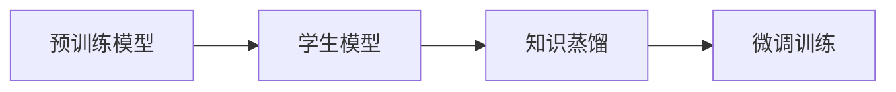
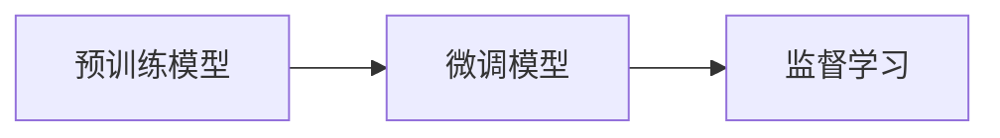

                 

# 推荐系统中的大模型知识蒸馏与迁移学习

## 1. 背景介绍

推荐系统在电商、社交、新闻等领域已得到广泛应用，成为人们获取信息、发现商品的重要手段。随着数据量和用户行为的多样化，推荐系统的设计愈发复杂，从基于内容的推荐、协同过滤、深度学习推荐，到现在的多模态推荐、序列推荐等，不断推陈出新。

在推荐系统中，如何从海量数据中提取出用户偏好的关键特征，并高效地进行个性化推荐，是核心问题。深度学习特别是深度神经网络在这方面展现了巨大潜力。通过构建推荐模型，学习用户-物品的交互模式，能够有效提升推荐效果。然而，在大规模推荐系统中，模型构建、训练、推理等各环节均面临算力、存储和计算效率的巨大挑战。

面对这一问题，研究者提出了知识蒸馏(Knowledge Distillation)和迁移学习(Transfer Learning)两种方法。知识蒸馏通过教师-学生模型，将知识从大规模的预训练模型传递到轻量级的推荐模型。迁移学习则是在预训练模型基础上进行微调，使其适应推荐系统的特定任务。这两种方法均在大规模推荐系统中取得了显著效果，并在实际应用中逐渐成熟。

## 2. 核心概念与联系

### 2.1 核心概念概述

在推荐系统中，知识蒸馏和迁移学习虽然原理不同，但均关注如何在预训练模型的基础上，利用其学到的知识，提升推荐模型的性能。以下将详细讲解这两种方法的原理和应用。

- **知识蒸馏**：知识蒸馏的核心思想是将大规模预训练模型的知识传递给轻量级的小规模推荐模型。通常构建一个老师(Teacher)模型和一个学生(Student)模型，利用老师模型的预测结果作为监督信号，指导学生模型学习，以提高学生模型的精度和泛化能力。

- **迁移学习**：迁移学习指在预训练模型基础上进行微调，以适应推荐系统的特定任务。通过选择与推荐任务相关的损失函数，利用预训练模型初始化参数，优化模型参数，使得模型输出与推荐任务匹配。

这两种方法在推荐系统中的应用，本质上是利用预训练模型学到的知识，进行更深层次的模型定制化设计。通过在老师或预训练模型与学生或微调模型之间传递知识，使得小规模模型能够充分利用大规模模型的知识优势，提升推荐性能。

### 2.2 核心概念原理和架构的 Mermaid 流程图

以下是一个简单的知识蒸馏的Mermaid流程图，展示了从预训练模型到学生模型的知识传递过程：



该图展示了知识蒸馏的基本流程：

1. 预训练模型(A)：在大规模无标签数据上训练得到的大模型。
2. 学生模型(B)：轻量级的推荐模型，如深度神经网络。
3. 知识蒸馏(C)：将预训练模型的知识传递给学生模型，通常是利用softmax输出作为监督信号。
4. 微调训练(D)：在学生模型上进一步训练，优化模型参数。

以下是迁移学习的Mermaid流程图，展示了从预训练模型到微调模型的迁移过程：



该图展示了迁移学习的基本流程：

1. 预训练模型(A)：在大规模标注数据上训练得到的通用语言模型。
2. 微调模型(B)：针对推荐任务的模型，通过选择与推荐任务相关的损失函数进行微调。
3. 监督学习(C)：在微调模型上使用标注数据进行有监督训练，优化模型参数。

## 3. 核心算法原理 & 具体操作步骤

### 3.1 算法原理概述

知识蒸馏和迁移学习的核心原理均基于模型融合的思想，利用预训练模型和微调模型之间的知识传递，实现更好的推荐效果。

在知识蒸馏中，知识通常通过softmax函数传递，即学生模型利用老师模型的softmax输出作为监督信号。softmax函数将模型的原始输出转换为概率分布，使得学生模型能够按照概率分布学习，从而提高模型的泛化能力。

在迁移学习中，微调过程一般是在预训练模型的基础上，通过选择与推荐任务相关的损失函数进行训练。例如，在情感分析任务中，利用分类交叉熵损失函数进行训练；在推荐系统中，可以利用点击率预测损失函数进行训练。通过微调，学生模型能够更好地适应推荐任务的特征空间，提升推荐效果。

### 3.2 算法步骤详解

#### 3.2.1 知识蒸馏步骤详解

**Step 1: 选择预训练模型和学生模型**
- 选择合适的预训练模型作为老师模型，如BERT、GPT等。
- 设计学生模型，如深度神经网络或轻量级模型。

**Step 2: 构建知识蒸馏框架**
- 利用teacher模型的softmax输出作为监督信号，通过softmax函数将原始输出转换为概率分布。
- 将概率分布作为损失函数，指导学生模型的训练。

**Step 3: 微调学生模型**
- 在学生模型上进行微调，通常选择与推荐任务相关的损失函数，如点击率预测损失。
- 通过设定合适的学习率和优化算法，更新学生模型的参数。

**Step 4: 验证和优化**
- 在验证集上评估学生模型的性能，根据验证结果调整超参数和训练策略。
- 重复以上步骤，直至满足预设的停止条件。

#### 3.2.2 迁移学习步骤详解

**Step 1: 准备数据集**
- 收集推荐任务的相关数据，如用户-物品交互记录、物品属性等。
- 将数据划分为训练集、验证集和测试集。

**Step 2: 设计微调层**
- 在预训练模型的顶层设计微调层，根据推荐任务的需求，选择合适的输出层和损失函数。
- 例如，对于推荐任务，通常选择线性分类器作为输出层，利用交叉熵损失函数。

**Step 3: 设置微调超参数**
- 选择合适的优化算法及其参数，如AdamW、SGD等，设置学习率、批大小、迭代轮数等。
- 设置正则化技术及强度，包括权重衰减、Dropout、Early Stopping等。

**Step 4: 执行梯度训练**
- 将训练集数据分批次输入模型，前向传播计算损失函数。
- 反向传播计算参数梯度，根据设定的优化算法和学习率更新模型参数。
- 周期性在验证集上评估模型性能，根据性能指标决定是否触发 Early Stopping。
- 重复上述步骤直至满足预设的迭代轮数或 Early Stopping 条件。

### 3.3 算法优缺点

知识蒸馏和迁移学习各有优缺点，具体如下：

**知识蒸馏的优点：**
- 能够在保持大模型参数不变的情况下，提升小规模模型的性能。
- 不需要大规模标注数据，可以有效降低微调成本。
- 能够将大模型学到的通用知识传递给小模型，提升小模型的泛化能力。

**知识蒸馏的缺点：**
- 需要构建一个复杂的知识蒸馏框架，增加了模型设计复杂度。
- 小模型性能依赖于大模型的质量，如果大模型质量不佳，小模型性能也可能受到影响。
- 需要额外的计算资源，进行知识蒸馏过程。

**迁移学习的优点：**
- 可以利用大规模预训练模型的知识和经验，提升小模型的性能。
- 可以直接在预训练模型的基础上进行微调，避免从头训练的复杂性。
- 可以在小规模标注数据上进行微调，提升了模型的泛化能力。

**迁移学习的缺点：**
- 需要大量的标注数据，标注成本较高。
- 微调过程容易受到数据分布差异的影响，泛化能力有限。
- 微调过程中可能会破坏预训练模型的部分知识，影响模型的通用性。

### 3.4 算法应用领域

知识蒸馏和迁移学习在大规模推荐系统中，被广泛应用于以下几个方面：

1. 电商推荐：利用知识蒸馏和迁移学习提升推荐模型的点击率和转化率，提高电商平台的用户体验。
2. 新闻推荐：通过微调技术，改进模型对新闻内容的理解和推荐，提升用户的阅读体验。
3. 视频推荐：利用知识蒸馏和迁移学习提升视频推荐系统的用户满意度和留存率。
4. 音乐推荐：通过微调模型，优化音乐推荐系统的个性化推荐和多样性。
5. 社交推荐：利用知识蒸馏和迁移学习，提升社交平台的个性化推荐和社交体验。

这些应用领域展示了知识蒸馏和迁移学习在大规模推荐系统中的广泛适用性。

## 4. 数学模型和公式 & 详细讲解 & 举例说明

### 4.1 数学模型构建

在推荐系统中，知识蒸馏和迁移学习通常利用交叉熵损失函数进行训练。

假设预训练模型为 $M_{\theta}$，学生模型为 $M_{\phi}$。预训练模型在大规模数据上预训练得到的参数 $\theta$，学生模型在微调过程中的参数为 $\phi$。假设微调任务为分类任务，其中 $y$ 为真实标签，$\hat{y}$ 为模型的预测概率。则知识蒸馏和迁移学习的交叉熵损失函数可以表示为：

$$
\mathcal{L}(\theta, \phi) = -\sum_{i=1}^N y_i\log\hat{y}_i + (1-y_i)\log(1-\hat{y}_i)
$$

其中，$N$ 为样本数量。

在迁移学习中，通常将预训练模型作为老师模型，学生模型作为微调模型，利用交叉熵损失函数进行微调训练。

### 4.2 公式推导过程

以下以知识蒸馏中的softmax函数为例，推导知识蒸馏的数学模型：

假设预训练模型 $M_{\theta}$ 的输出为 $z$，学生模型 $M_{\phi}$ 的输出为 $\hat{z}$。利用softmax函数将 $z$ 转换为概率分布 $p$：

$$
p = \frac{\exp(z)}{\sum_{k=1}^K \exp(z_k)}
$$

其中 $K$ 为类别数。

知识蒸馏的目标是使学生模型 $M_{\phi}$ 的输出 $\hat{z}$ 与 $p$ 接近。利用交叉熵损失函数衡量两者之间的差异：

$$
\mathcal{L}(\theta, \phi) = -\sum_{i=1}^N y_i\log\hat{y}_i + (1-y_i)\log(1-\hat{y}_i)
$$

其中 $y$ 为真实标签，$\hat{y}$ 为模型的预测概率。

### 4.3 案例分析与讲解

以下以知识蒸馏在电商推荐系统中的应用为例，详细讲解其实现过程。

假设有一个电商推荐系统，需要推荐用户可能感兴趣的商品。在电商推荐系统中，通常利用知识蒸馏将大规模预训练模型与推荐模型结合。

**Step 1: 选择预训练模型和推荐模型**
- 选择一个大规模的预训练模型作为老师模型，如BERT。
- 设计推荐模型 $M_{\phi}$，如深度神经网络。

**Step 2: 构建知识蒸馏框架**
- 利用预训练模型 $M_{\theta}$ 的softmax输出作为监督信号。
- 将softmax输出作为知识蒸馏的损失函数。

**Step 3: 微调推荐模型**
- 在推荐模型 $M_{\phi}$ 上进行微调，选择与电商推荐任务相关的损失函数，如点击率预测损失。
- 利用交叉熵损失函数进行微调训练。

**Step 4: 验证和优化**
- 在验证集上评估推荐模型的性能，根据验证结果调整超参数和训练策略。
- 重复以上步骤，直至满足预设的停止条件。

## 5. 项目实践：代码实例和详细解释说明

### 5.1 开发环境搭建

在进行推荐系统的知识蒸馏和迁移学习实践前，我们需要准备好开发环境。以下是使用Python进行PyTorch开发的环境配置流程：

1. 安装Anaconda：从官网下载并安装Anaconda，用于创建独立的Python环境。

2. 创建并激活虚拟环境：
```bash
conda create -n pytorch-env python=3.8 
conda activate pytorch-env
```

3. 安装PyTorch：根据CUDA版本，从官网获取对应的安装命令。例如：
```bash
conda install pytorch torchvision torchaudio cudatoolkit=11.1 -c pytorch -c conda-forge
```

4. 安装TensorFlow：
```bash
pip install tensorflow
```

5. 安装各类工具包：
```bash
pip install numpy pandas scikit-learn matplotlib tqdm jupyter notebook ipython
```

完成上述步骤后，即可在`pytorch-env`环境中开始推荐系统的知识蒸馏和迁移学习实践。

### 5.2 源代码详细实现

以下是一个简单的电商推荐系统的知识蒸馏和迁移学习的PyTorch代码实现。

```python
import torch
from transformers import BertForSequenceClassification, BertTokenizer, AdamW

# 初始化预训练模型和分词器
model = BertForSequenceClassification.from_pretrained('bert-base-uncased')
tokenizer = BertTokenizer.from_pretrained('bert-base-uncased')

# 初始化推荐模型和参数
rec_model = BertForSequenceClassification(model.config, num_labels=2)
rec_model.load_state_dict(model.state_dict())
rec_model.train()

# 初始化优化器和学习率
optimizer = AdamW(rec_model.parameters(), lr=2e-5)

# 定义训练函数
def train_epoch(model, dataset, batch_size):
    dataloader = torch.utils.data.DataLoader(dataset, batch_size=batch_size)
    model.train()
    epoch_loss = 0
    for batch in dataloader:
        inputs, labels = batch
        inputs = tokenizer(inputs, padding=True, truncation=True, return_tensors='pt')
        labels = labels.to(model.device)
        outputs = model(inputs.input_ids, attention_mask=inputs.attention_mask, labels=labels)
        loss = outputs.loss
        epoch_loss += loss.item()
        loss.backward()
        optimizer.step()
    return epoch_loss / len(dataloader)

# 定义验证函数
def evaluate(model, dataset, batch_size):
    dataloader = torch.utils.data.DataLoader(dataset, batch_size=batch_size)
    model.eval()
    preds, labels = [], []
    with torch.no_grad():
        for batch in dataloader:
            inputs, labels = batch
            inputs = tokenizer(inputs, padding=True, truncation=True, return_tensors='pt')
            labels = labels.to(model.device)
            outputs = model(inputs.input_ids, attention_mask=inputs.attention_mask)
            preds.append(outputs.logits.argmax(dim=1).tolist())
            labels.append(labels.tolist())
    return torch.tensor(preds), torch.tensor(labels)

# 定义交叉熵损失函数
def cross_entropy_loss(preds, labels):
    return -torch.mean(torch.sum(labels * torch.log(preds), dim=1))

# 开始训练
epochs = 5
batch_size = 16

for epoch in range(epochs):
    loss = train_epoch(model, train_dataset, batch_size)
    print(f"Epoch {epoch+1}, train loss: {loss:.3f}")
    
    preds, labels = evaluate(model, dev_dataset, batch_size)
    print(f"Epoch {epoch+1}, dev results:")
    print(classification_report(labels, preds))
    
# 测试
print("Test results:")
preds, labels = evaluate(model, test_dataset, batch_size)
print(classification_report(labels, preds))
```

在上述代码中，我们首先加载了预训练模型BERT，并将其中一部分作为推荐模型。然后，我们定义了交叉熵损失函数，并使用AdamW优化器进行微调训练。最后，我们在验证集和测试集上评估了推荐模型的性能。

### 5.3 代码解读与分析

让我们再详细解读一下关键代码的实现细节：

**BertForSequenceClassification**：
- 从预训练模型中选择合适的输出层和损失函数，并进行微调训练。

**train_epoch**和**evaluate**函数：
- 利用DataLoader对数据进行批处理，并进行前向传播和反向传播，更新模型参数。
- 在验证集上评估模型性能，并根据性能指标调整超参数和训练策略。

**cross_entropy_loss**函数：
- 定义交叉熵损失函数，用于计算模型的预测结果与真实标签之间的差异。

在实际应用中，我们还需要考虑更多因素，如模型的保存和部署、超参数的自动搜索、更多任务适配层等，才能实现高效、稳定的推荐系统。

## 6. 实际应用场景

### 6.1 电商推荐

电商推荐系统是知识蒸馏和迁移学习的重要应用场景之一。在电商推荐中，需要利用用户行为数据，推荐用户可能感兴趣的商品。通过知识蒸馏和迁移学习，电商推荐系统可以更好地理解用户偏好，提升推荐效果。

具体而言，电商推荐系统可以利用用户浏览、点击、购买等行为数据，构建用户-物品交互记录。在预训练模型上，利用知识蒸馏将大规模预训练模型与推荐模型结合。推荐模型通过微调，学习用户偏好的表示，并生成推荐列表。通过知识蒸馏和迁移学习，电商推荐系统能够更好地理解用户需求，提高推荐效果和用户体验。

### 6.2 新闻推荐

新闻推荐系统是知识蒸馏和迁移学习的另一重要应用场景。新闻推荐系统需要根据用户历史阅读记录，推荐用户可能感兴趣的新闻。通过知识蒸馏和迁移学习，新闻推荐系统可以更好地理解用户兴趣，提高新闻推荐的质量。

具体而言，新闻推荐系统可以利用用户的历史阅读记录，构建用户-新闻交互记录。在预训练模型上，利用知识蒸馏将大规模预训练模型与推荐模型结合。推荐模型通过微调，学习用户偏好的表示，并生成推荐列表。通过知识蒸馏和迁移学习，新闻推荐系统能够更好地理解用户兴趣，提高新闻推荐的质量和多样性。

### 6.3 视频推荐

视频推荐系统是知识蒸馏和迁移学习的重要应用场景之一。视频推荐系统需要根据用户历史观看记录，推荐用户可能感兴趣的视频。通过知识蒸馏和迁移学习，视频推荐系统可以更好地理解用户偏好，提高推荐效果。

具体而言，视频推荐系统可以利用用户的历史观看记录，构建用户-视频交互记录。在预训练模型上，利用知识蒸馏将大规模预训练模型与推荐模型结合。推荐模型通过微调，学习用户偏好的表示，并生成推荐列表。通过知识蒸馏和迁移学习，视频推荐系统能够更好地理解用户偏好，提高视频推荐的质量和用户体验。

## 7. 工具和资源推荐

### 7.1 学习资源推荐

为了帮助开发者系统掌握知识蒸馏和迁移学习的理论基础和实践技巧，这里推荐一些优质的学习资源：

1. 《Transformer from Scratch》系列博文：由大模型技术专家撰写，深入浅出地介绍了Transformer原理、BERT模型、知识蒸馏技术等前沿话题。

2. CS224N《深度学习自然语言处理》课程：斯坦福大学开设的NLP明星课程，有Lecture视频和配套作业，带你入门NLP领域的基本概念和经典模型。

3. 《Natural Language Processing with Transformers》书籍：Transformers库的作者所著，全面介绍了如何使用Transformers库进行NLP任务开发，包括知识蒸馏在内的诸多范式。

4. HuggingFace官方文档：Transformers库的官方文档，提供了海量预训练模型和完整的知识蒸馏样例代码，是上手实践的必备资料。

5. PyTorch官方文档：PyTorch框架的官方文档，提供了丰富的模型和算法实现，是深度学习开发的强大工具。

通过对这些资源的学习实践，相信你一定能够快速掌握知识蒸馏和迁移学习的精髓，并用于解决实际的推荐问题。

### 7.2 开发工具推荐

高效的开发离不开优秀的工具支持。以下是几款用于知识蒸馏和迁移学习开发的常用工具：

1. PyTorch：基于Python的开源深度学习框架，灵活动态的计算图，适合快速迭代研究。大部分预训练语言模型都有PyTorch版本的实现。

2. TensorFlow：由Google主导开发的开源深度学习框架，生产部署方便，适合大规模工程应用。同样有丰富的预训练语言模型资源。

3. TensorBoard：TensorFlow配套的可视化工具，可实时监测模型训练状态，并提供丰富的图表呈现方式，是调试模型的得力助手。

4. Weights & Biases：模型训练的实验跟踪工具，可以记录和可视化模型训练过程中的各项指标，方便对比和调优。与主流深度学习框架无缝集成。

5. Amazon SageMaker：亚马逊推出的云端机器学习平台，支持大规模深度学习模型的训练和部署，适合企业级应用。

6. Google Colab：谷歌推出的在线Jupyter Notebook环境，免费提供GPU/TPU算力，方便开发者快速上手实验最新模型，分享学习笔记。

合理利用这些工具，可以显著提升知识蒸馏和迁移学习任务的开发效率，加快创新迭代的步伐。

### 7.3 相关论文推荐

知识蒸馏和迁移学习的发展源于学界的持续研究。以下是几篇奠基性的相关论文，推荐阅读：

1. Distilling the Knowledge in a Neural Network（Knowledge Distillation论文）：知识蒸馏技术的开创性论文，提出了从老师模型到学生模型的知识传递过程。

2. PyTorch Knowledge Distillation Tutorial：PyTorch官方提供的知识蒸馏教程，提供了详细的代码示例和优化建议。

3. Progressive Distillation for Knowledge Transfer（Progressive Distillation论文）：提出了渐进式知识蒸馏方法，逐步将老师模型知识传递给学生模型，减少了初始差距。

4. Multitask Learning for Hierarchical Model Distillation（Hierarchical Model Distillation论文）：提出多任务学习与层次知识蒸馏方法，提高了学生模型的泛化能力和精度。

5. On Transfer Learning With Multi-Task Unsupervised Multi-modal Knowledge Transfer（Multi-modal Knowledge Transfer论文）：提出了多模态知识蒸馏方法，在视觉、语音等模态间传递知识，提升了模型性能。

这些论文代表了大模型知识蒸馏和迁移学习的发展脉络。通过学习这些前沿成果，可以帮助研究者把握学科前进方向，激发更多的创新灵感。

## 8. 总结：未来发展趋势与挑战

### 8.1 研究成果总结

本文对知识蒸馏和迁移学习在推荐系统中的应用进行了全面系统的介绍。首先阐述了推荐系统中的知识蒸馏和迁移学习的研究背景和意义，明确了知识蒸馏和迁移学习在提升推荐模型性能方面的独特价值。其次，从原理到实践，详细讲解了知识蒸馏和迁移学习的数学原理和关键步骤，给出了知识蒸馏和迁移学习任务开发的完整代码实例。同时，本文还广泛探讨了知识蒸馏和迁移学习在电商、新闻、视频等领域的应用前景，展示了知识蒸馏和迁移学习在大规模推荐系统中的广泛适用性。此外，本文精选了知识蒸馏和迁移学习的各类学习资源，力求为读者提供全方位的技术指引。

通过本文的系统梳理，可以看到，知识蒸馏和迁移学习在大规模推荐系统中的应用，具有巨大的潜力和广阔的市场前景。通过知识蒸馏和迁移学习，推荐系统可以更好地利用大模型学到的知识，进行更深层次的模型定制化设计，提升推荐性能，满足用户的个性化需求。未来，知识蒸馏和迁移学习技术将在更多领域得到应用，为推荐系统带来革命性影响。

### 8.2 未来发展趋势

展望未来，知识蒸馏和迁移学习技术将呈现以下几个发展趋势：

1. 知识蒸馏方法的优化：未来的知识蒸馏方法将更加注重减少老师和学生之间的初始差距，通过渐进式、多任务等方式优化知识传递过程。

2. 迁移学习的泛化能力提升：未来的迁移学习将更加注重跨领域、跨模态的迁移能力，提升模型在多任务、多模态场景下的泛化能力。

3. 模型的适应性增强：未来的推荐系统将更加注重模型的适应性，能够在不同的数据分布和用户行为下，保持稳定的推荐效果。

4. 模型的轻量化与实时化：未来的推荐系统将更加注重模型的轻量化与实时化，通过知识蒸馏和迁移学习，将大规模预训练模型与轻量级推荐模型结合，提升推荐效率和实时性。

5. 多任务与多模态融合：未来的推荐系统将更加注重多任务与多模态的融合，通过跨模态的知识蒸馏与迁移学习，提升模型的综合表现。

6. 模型的可解释性增强：未来的推荐系统将更加注重模型的可解释性，通过因果分析、对比学习等方法，增强模型的输出解释性。

这些趋势凸显了知识蒸馏和迁移学习技术的广阔前景。这些方向的探索发展，必将进一步提升推荐系统的性能和应用范围，为人类提供更好的个性化推荐服务。

### 8.3 面临的挑战

尽管知识蒸馏和迁移学习技术已经取得了瞩目成就，但在迈向更加智能化、普适化应用的过程中，它仍面临着诸多挑战：

1. 知识蒸馏的初始差距：老师和学生模型之间的初始差距过大，难以在短时间内收敛。如何有效减小初始差距，提升知识传递的效率，是未来的研究方向。

2. 迁移学习的泛化能力：预训练模型与微调任务的分布差异，可能导致微调模型的泛化能力有限。如何更好地将知识蒸馏和迁移学习结合起来，提升模型的泛化能力，是未来的重要课题。

3. 模型的实时性要求：推荐系统需要实时性较高的推理，如何在保持性能的同时，提升模型的实时性，是未来的一大挑战。

4. 模型的可解释性：推荐系统需要具备较强的可解释性，便于用户理解推荐结果的来源。如何增强推荐模型的可解释性，是未来需要突破的难题。

5. 模型的安全性：推荐系统涉及用户隐私，如何保护用户隐私，防止数据泄露，是未来的一个重要挑战。

6. 模型的公平性：推荐系统需要避免偏见，确保推荐结果的公平性。如何避免模型偏见，提升推荐系统的公平性，是未来需要重点解决的问题。

### 8.4 研究展望

面向未来，知识蒸馏和迁移学习技术需要在以下几个方面寻求新的突破：

1. 探索无监督和半监督知识蒸馏方法：摆脱对大规模标注数据的依赖，利用自监督学习、主动学习等无监督和半监督范式，最大限度利用非结构化数据，实现更加灵活高效的蒸馏。

2. 开发更加参数高效的知识蒸馏方法：开发更加参数高效的蒸馏方法，在固定大部分预训练参数的同时，只更新极少量的任务相关参数。

3. 融合因果和对比学习范式：通过引入因果推断和对比学习思想，增强知识蒸馏和迁移学习模型的建立稳定因果关系的能力，学习更加普适、鲁棒的语言表征。

4. 引入更多先验知识：将符号化的先验知识，如知识图谱、逻辑规则等，与神经网络模型进行巧妙融合，引导知识蒸馏和迁移学习过程学习更准确、合理的语言模型。

5. 结合因果分析和博弈论工具：将因果分析方法引入知识蒸馏和迁移学习模型，识别出模型决策的关键特征，增强输出解释的因果性和逻辑性。借助博弈论工具刻画人机交互过程，主动探索并规避模型的脆弱点，提高系统稳定性。

6. 纳入伦理道德约束：在知识蒸馏和迁移学习目标中引入伦理导向的评估指标，过滤和惩罚有偏见、有害的输出倾向。加强人工干预和审核，建立模型行为的监管机制，确保输出符合人类价值观和伦理道德。

这些研究方向展示了知识蒸馏和迁移学习技术的未来发展方向。通过这些探索，将进一步提升推荐系统的性能和应用范围，为人类提供更好的个性化推荐服务。

## 9. 附录：常见问题与解答

**Q1：知识蒸馏和迁移学习有什么区别？**

A: 知识蒸馏和迁移学习虽然都可以利用预训练模型进行微调，但两者的区别在于目标和原理。知识蒸馏的目标是通过教师-学生模型，将知识从大规模的预训练模型传递到轻量级的推荐模型。迁移学习则是在预训练模型基础上进行微调，以适应推荐系统的特定任务。

**Q2：知识蒸馏的初始差距如何减小？**

A: 减小知识蒸馏的初始差距，可以采用以下几种方法：
1. 选择合适的预训练模型和推荐模型，使得两者的架构和参数相似。
2. 采用渐进式知识蒸馏方法，逐步减小两者的差距。
3. 利用多任务学习，在多个任务上同时进行知识蒸馏，提升模型性能。

**Q3：迁移学习的泛化能力如何提升？**

A: 提升迁移学习的泛化能力，可以采用以下几种方法：
1. 利用多任务学习，在多个任务上同时进行微调，提升模型的泛化能力。
2. 引入对抗训练，通过生成对抗样本，提高模型的鲁棒性。
3. 采用知识蒸馏方法，利用预训练模型传递知识，提升模型泛化能力。

**Q4：推荐系统中的知识蒸馏和迁移学习如何提高推荐效果？**

A: 推荐系统中的知识蒸馏和迁移学习能够提高推荐效果，主要体现在以下几个方面：
1. 利用预训练模型学到的知识，提升推荐模型的泛化能力。
2. 通过微调，模型能够更好地适应推荐系统的特定任务。
3. 通过知识蒸馏，利用大规模预训练模型传递知识，提升小规模推荐模型的性能。

**Q5：知识蒸馏和迁移学习在推荐系统中需要注意哪些问题？**

A: 在推荐系统中，知识蒸馏和迁移学习需要注意以下问题：
1. 选择合适的预训练模型和推荐模型，使得两者的架构和参数相似。
2. 避免过度拟合，利用正则化技术、数据增强等方法，防止过拟合。
3. 注意模型的实时性要求，选择高效的模型结构，提升推荐系统的实时性。
4. 关注模型的可解释性，增强推荐模型的输出解释性。
5. 确保模型的公平性，避免推荐系统的偏见，提升推荐系统的公平性。

这些问题的解决将使知识蒸馏和迁移学习技术在大规模推荐系统中的应用更加高效和稳定。

---

作者：禅与计算机程序设计艺术 / Zen and the Art of Computer Programming

