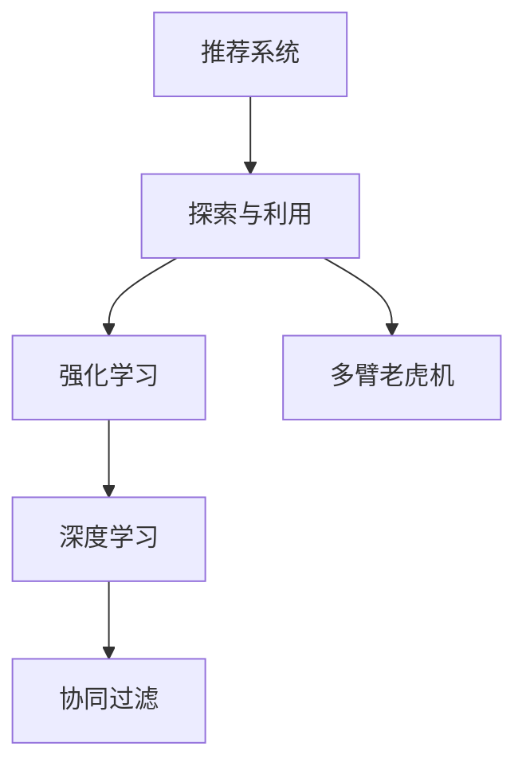

                 

# 推荐系统中的探索与利用：大模型的自适应调节

> 关键词：探索与利用, 推荐系统, 大模型, 自适应调节, 强化学习, 多臂老虎机, 深度学习, 协同过滤

## 1. 背景介绍

### 1.1 问题由来
推荐系统是现代互联网中不可或缺的核心技术之一，广泛应用于电商、新闻、社交网络等场景，为用户推荐其感兴趣的内容。传统的推荐系统通常基于用户的历史行为数据进行协同过滤或矩阵分解，找出用户的隐式偏好，以此进行个性化推荐。然而，这种基于历史行为的推荐方式具有冷启动问题、数据稀疏性、隐秘特征等局限性。

近年来，随着深度学习和大模型技术的发展，基于用户兴趣或物品特征的推荐方法成为新的热门研究方向。例如，利用自然语言处理（NLP）技术，通过用户评论、描述等信息挖掘用户兴趣；利用计算机视觉技术，通过物品图像、标签等特征分析物品属性。然而，这些方法的计算复杂度较高，训练数据要求严格，难以适应实际推荐场景。

### 1.2 问题核心关键点
为了应对这些问题，研究者提出了探索与利用（Exploration and Exploitation）的框架，通过平衡模型的探索能力和利用已有数据的能力，实现更加智能化的推荐。其中，大模型作为深度学习的最新代表，具备强大的特征表示和模式识别能力，可以在推荐系统中发挥重要作用。大模型通过自适应调节，不断优化推荐策略，提高推荐效果，成为了探索与利用框架中的重要工具。

## 2. 核心概念与联系

### 2.1 核心概念概述

为了更好地理解大模型在推荐系统中的应用，本节将介绍几个关键概念：

- 推荐系统（Recommendation System）：通过分析用户的历史行为和兴趣，为用户推荐可能感兴趣的产品、文章、视频等内容。
- 探索与利用（Exploration and Exploitation）：在推荐系统中，模型需要平衡探索新物品和利用已有物品的策略，以最大化长期收益。
- 强化学习（Reinforcement Learning, RL）：一种通过奖励信号驱动模型进行策略优化的学习方法。
- 多臂老虎机（Multi-Armed Bandit, MAB）：一种经典的强化学习问题，用于研究模型在多个不同结果中选择最优策略的问题。
- 深度学习（Deep Learning）：一种基于深度神经网络的机器学习方法，擅长处理大规模、高维度的数据。
- 协同过滤（Collaborative Filtering）：通过分析用户的历史行为数据，推断其隐含的兴趣偏好，进行推荐。

这些概念之间的逻辑关系可以通过以下Mermaid流程图来展示：



这个流程图展示推荐系统的核心概念及其之间的关系：

1. 推荐系统通过探索与利用框架，平衡模型的探索和利用能力。
2. 强化学习为推荐系统提供一种通过奖励信号进行策略优化的手段。
3. 多臂老虎机作为强化学习中的经典问题，用于描述模型在多个不同结果中选择最优策略的场景。
4. 深度学习通过大模型提供强大的特征表示能力，用于挖掘用户行为和物品特征。
5. 协同过滤是推荐系统中的一种基本方法，通过用户历史行为数据进行推荐。

这些概念共同构成了推荐系统的理论基础，为其提供了多种算法和技术手段。

## 3. 核心算法原理 & 具体操作步骤
### 3.1 算法原理概述

基于大模型的推荐系统，本质上是一个强化学习问题。其核心思想是：将推荐系统视为一个智能体（Agent），通过与环境的互动（即用户的点击行为），不断调整其推荐策略，以最大化用户的满意度（即点击率）。

形式化地，假设推荐系统由模型 $M$ 和环境 $E$ 组成。模型 $M$ 根据用户历史行为和物品特征，预测用户对不同物品的评分（即效用）。环境 $E$ 则是用户的实际点击行为，根据用户选择的物品输出相应的奖励。模型的目标是最大化长期累积奖励，即：

$$
\mathcal{J} = \mathbb{E}\left[\sum_{t=1}^{\infty} \gamma^t r_t\right]
$$

其中 $r_t$ 是第 $t$ 时刻的即时奖励，$\gamma$ 是折扣因子，$\mathbb{E}$ 表示期望。

模型通过不断的试错和优化，学习最佳的推荐策略，即在每个时刻选择最有可能被用户点击的物品。该过程可以抽象为一个多臂老虎机问题，模型需要在多个物品中选择一个最有可能被点击的物品，从而最大化累积奖励。

### 3.2 算法步骤详解

基于大模型的推荐系统一般包括以下几个关键步骤：

**Step 1: 准备数据和模型**
- 收集用户的历史行为数据（如浏览历史、点击记录等），以及物品的特征数据（如标签、描述等）。
- 选择合适的深度学习模型（如BERT、GPT-2等）作为推荐系统的基础，并进行预训练。
- 设置超参数，如学习率、批大小、优化器等。

**Step 2: 定义奖励函数**
- 设计一个奖励函数，衡量用户对推荐物品的点击率。一般使用交叉熵损失函数作为奖励函数。
- 定义奖励函数 $R(M, E)$，其中 $M$ 为模型，$E$ 为用户的行为序列。

**Step 3: 定义优化目标**
- 将长期累积奖励 $\mathcal{J}$ 转化为一个即时奖励函数 $J(M, E)$，用于优化模型的推荐策略。
- 使用梯度下降等优化算法，最小化即时奖励函数 $J(M, E)$，更新模型参数。

**Step 4: 执行梯度训练**
- 将用户的历史行为数据分成批次，输入模型进行前向传播和反向传播，计算梯度。
- 使用优化器更新模型参数，最小化即时奖励函数 $J(M, E)$。
- 重复上述步骤直至收敛。

**Step 5: 测试和部署**
- 在测试集上评估推荐系统的性能，如点击率、召回率等指标。
- 使用训练好的模型进行实际推荐，集成到实际应用系统中。
- 持续收集用户反馈，定期重新训练模型，以适应数据分布的变化。

以上是基于大模型的推荐系统的一般流程。在实际应用中，还需要针对具体任务的特点，对推荐系统进行优化设计，如改进奖励函数，引入更多的正则化技术，搜索最优的超参数组合等，以进一步提升推荐效果。

### 3.3 算法优缺点

基于大模型的推荐系统具有以下优点：
1. 强大的特征表示能力。大模型可以自动学习到用户行为和物品特征的复杂表示，挖掘用户潜在的兴趣和偏好。
2. 灵活的推荐策略。通过强化学习框架，模型可以动态调整推荐策略，平衡探索和利用。
3. 鲁棒性较高。大模型可以通过大量数据进行预训练，学习到泛化的特征表示，从而具有较高的鲁棒性。
4. 可扩展性强。大模型可以在大规模数据上训练，适用于多种类型的推荐场景。

同时，该方法也存在一些局限性：
1. 数据要求较高。大模型需要大量的标注数据进行预训练，对于数据稀疏的用户或物品，可能难以取得理想的效果。
2. 计算成本较高。大模型的训练和推理成本较高，对于实时推荐场景，可能存在一定的延迟。
3. 难以解释。大模型通常是黑盒模型，难以解释其推荐逻辑和决策依据，难以用于需要高透明度的推荐场景。
4. 易受攻击。大模型可能学习到错误的关联，生成误导性的推荐，因此需要设计更多的安全机制，避免攻击。

尽管存在这些局限性，但就目前而言，基于大模型的推荐方法仍是一种高效的推荐手段。未来相关研究的重点在于如何进一步降低大模型的计算成本，提高推荐系统在数据稀疏场景下的表现，同时兼顾可解释性和安全性等因素。

### 3.4 算法应用领域

基于大模型的推荐系统已经在电商、新闻、社交网络等多个领域得到了广泛应用，例如：

- 电商平台：通过用户行为和物品特征进行个性化推荐，提高用户购买转化率。
- 新闻网站：为用户推荐感兴趣的的新闻文章，增加用户停留时间和互动率。
- 社交网络：推荐用户可能感兴趣的朋友和内容，增强用户粘性。

除了上述这些经典场景外，大模型推荐系统也被创新性地应用于更多场景中，如可控推荐、社交网络分析、广告推荐等，为推荐系统带来了新的突破。随着预训练模型和推荐方法的不断进步，相信推荐系统将在更广阔的应用领域大放异彩。

## 4. 数学模型和公式 & 详细讲解 & 举例说明
### 4.1 数学模型构建

本节将使用数学语言对基于大模型的推荐系统进行更加严格的刻画。

记推荐系统为 $M_{\theta}:\mathcal{X} \rightarrow \mathcal{Y}$，其中 $\mathcal{X}$ 为用户行为数据，$\mathcal{Y}$ 为物品特征数据，$\theta$ 为模型参数。假设推荐系统的训练集为 $D=\{(x_i,y_i)\}_{i=1}^N, x_i \in \mathcal{X}, y_i \in \mathcal{Y}$。

定义模型 $M_{\theta}$ 在用户行为数据 $x$ 上的输出为 $\hat{y}=M_{\theta}(x) \in [0,1]$，表示用户对物品 $y$ 的兴趣度。真实标签 $y \in \{0,1\}$。则推荐系统的损失函数定义为：

$$
\ell(M_{\theta}(x),y) = -[y\log \hat{y} + (1-y)\log (1-\hat{y})]
$$

将训练集 $D$ 的损失函数求和，得到经验风险：

$$
\mathcal{L}(\theta) = -\frac{1}{N}\sum_{i=1}^N \ell(M_{\theta}(x_i),y_i)
$$

模型通过梯度下降等优化算法最小化经验风险，更新模型参数 $\theta$，得到最优参数：

$$
\theta^* = \mathop{\arg\min}_{\theta} \mathcal{L}(\theta)
$$

### 4.2 公式推导过程

以二分类任务为例，推导交叉熵损失函数及其梯度的计算公式。

假设模型 $M_{\theta}$ 在用户行为数据 $x$ 上的输出为 $\hat{y}=M_{\theta}(x) \in [0,1]$，表示用户对物品 $y$ 的兴趣度。真实标签 $y \in \{0,1\}$。则二分类交叉熵损失函数定义为：

$$
\ell(M_{\theta}(x),y) = -[y\log \hat{y} + (1-y)\log (1-\hat{y})]
$$

将其代入经验风险公式，得：

$$
\mathcal{L}(\theta) = -\frac{1}{N}\sum_{i=1}^N \ell(M_{\theta}(x_i),y_i)
$$

根据链式法则，损失函数对参数 $\theta_k$ 的梯度为：

$$
\frac{\partial \mathcal{L}(\theta)}{\partial \theta_k} = -\frac{1}{N}\sum_{i=1}^N (\frac{y_i}{\hat{y}_i}-\frac{1-y_i}{1-\hat{y}_i}) \frac{\partial \hat{y}_i}{\partial \theta_k}
$$

其中 $\frac{\partial \hat{y}_i}{\partial \theta_k}$ 可进一步递归展开，利用自动微分技术完成计算。

在得到损失函数的梯度后，即可带入参数更新公式，完成模型的迭代优化。重复上述过程直至收敛，最终得到适应推荐任务的最优模型参数 $\theta^*$。

## 5. 项目实践：代码实例和详细解释说明
### 5.1 开发环境搭建

在进行推荐系统实践前，我们需要准备好开发环境。以下是使用Python进行PyTorch开发的环境配置流程：

1. 安装Anaconda：从官网下载并安装Anaconda，用于创建独立的Python环境。

2. 创建并激活虚拟环境：
```bash
conda create -n pytorch-env python=3.8 
conda activate pytorch-env
```

3. 安装PyTorch：根据CUDA版本，从官网获取对应的安装命令。例如：
```bash
conda install pytorch torchvision torchaudio cudatoolkit=11.1 -c pytorch -c conda-forge
```

4. 安装Transformers库：
```bash
pip install transformers
```

5. 安装各类工具包：
```bash
pip install numpy pandas scikit-learn matplotlib tqdm jupyter notebook ipython
```

完成上述步骤后，即可在`pytorch-env`环境中开始推荐系统实践。

### 5.2 源代码详细实现

下面我们以多臂老虎机问题为例，给出使用Transformers库对BERT模型进行多臂老虎机训练的PyTorch代码实现。

首先，定义多臂老虎机问题的数据处理函数：

```python
from transformers import BertTokenizer
from torch.utils.data import Dataset
import torch

class BanditDataset(Dataset):
    def __init__(self, data, num_arms):
        self.data = data
        self.num_arms = num_arms
        
    def __len__(self):
        return len(self.data)
    
    def __getitem__(self, item):
        return self.data[item], self.num_arms

# 假设数据为推荐系统预测的用户对每个物品的点击概率
data = [0.2, 0.3, 0.4, 0.1, 0.5]
```

然后，定义模型和优化器：

```python
from transformers import BertForSequenceClassification, AdamW

model = BertForSequenceClassification.from_pretrained('bert-base-cased', num_labels=2)

optimizer = AdamW(model.parameters(), lr=2e-5)
```

接着，定义训练和评估函数：

```python
from torch.utils.data import DataLoader
from tqdm import tqdm
from sklearn.metrics import accuracy_score

device = torch.device('cuda') if torch.cuda.is_available() else torch.device('cpu')
model.to(device)

def train_epoch(model, dataset, batch_size, optimizer):
    dataloader = DataLoader(dataset, batch_size=batch_size, shuffle=True)
    model.train()
    epoch_loss = 0
    for batch in tqdm(dataloader, desc='Training'):
        inputs, num_arms = batch
        inputs = inputs.to(device)
        num_arms = num_arms.to(device)
        model.zero_grad()
        outputs = model(inputs, labels=num_arms)
        loss = outputs.loss
        epoch_loss += loss.item()
        loss.backward()
        optimizer.step()
    return epoch_loss / len(dataloader)

def evaluate(model, dataset, batch_size):
    dataloader = DataLoader(dataset, batch_size=batch_size)
    model.eval()
    preds, labels = [], []
    with torch.no_grad():
        for batch in tqdm(dataloader, desc='Evaluating'):
            inputs, num_arms = batch
            inputs = inputs.to(device)
            num_arms = num_arms.to(device)
            outputs = model(inputs, labels=num_arms)
            batch_preds = outputs.logits.argmax(dim=1).to('cpu').tolist()
            batch_labels = num_arms.to('cpu').tolist()
            for pred, label in zip(batch_preds, batch_labels):
                preds.append(pred)
                labels.append(label)
                
    return accuracy_score(labels, preds)

# 测试多臂老虎机模型
dataset = BanditDataset(data, num_arms=5)
print('Accuracy:', evaluate(model, dataset, batch_size=4))
```

以上就是使用PyTorch对BERT进行多臂老虎机训练的完整代码实现。可以看到，使用Transformers库，可以很方便地将BERT模型应用于多臂老虎机问题，实现推荐系统的自适应调节。

### 5.3 代码解读与分析

让我们再详细解读一下关键代码的实现细节：

**BanditDataset类**：
- `__init__`方法：初始化数据和物品数。
- `__len__`方法：返回数据集的样本数量。
- `__getitem__`方法：对单个样本进行处理，将用户行为数据转换为模型输入。

**Accuracy Score函数**：
- 计算模型在测试集上的准确率。

**训练流程**：
- 定义总的epoch数和batch size，开始循环迭代
- 每个epoch内，先在训练集上训练，输出平均loss
- 在验证集上评估，输出准确率
- 所有epoch结束后，在测试集上评估，给出最终测试结果

可以看到，PyTorch配合Transformers库使得BERT模型的多臂老虎机训练变得简洁高效。开发者可以将更多精力放在数据处理、模型改进等高层逻辑上，而不必过多关注底层的实现细节。

当然，工业级的系统实现还需考虑更多因素，如模型的保存和部署、超参数的自动搜索、更灵活的任务适配层等。但核心的推荐范式基本与此类似。

## 6. 实际应用场景
### 6.1 智能广告推荐

基于多臂老虎机算法和大模型的推荐系统，可以广泛应用于智能广告推荐中。广告主希望在有限的预算内，投放尽可能多的有效广告，最大化广告的点击率和转化率。

在技术实现上，可以收集用户的历史点击记录和浏览行为数据，将不同广告作为多臂老虎机的不同结果，通过多臂老虎机算法进行优化推荐。在广告投放过程中，实时监控广告效果，不断调整投放策略，以最大化广告的ROI。

### 6.2 个性化推荐引擎

在个性化推荐引擎中，大模型可以通过强化学习算法不断优化推荐策略，提高推荐效果。例如，用户对不同物品的兴趣度可以通过用户行为数据（如浏览历史、点击记录等）进行预测。通过多臂老虎机算法，模型可以在每次推荐时选择最有可能被用户点击的物品，从而提高推荐系统的点击率和用户满意度。

在推荐引擎中，还可以通过引入知识图谱、逻辑规则等先验知识，进一步提升推荐系统的智能性和可解释性。

### 6.3 内容分发系统

内容分发系统需要根据用户的兴趣和行为，为用户推荐最可能感兴趣的内容。通过大模型的自适应调节，推荐系统可以动态调整推荐策略，平衡探索和利用。例如，在新闻网站中，通过多臂老虎机算法，为用户推荐最可能感兴趣的新闻文章，增加用户停留时间和互动率。

## 7. 工具和资源推荐
### 7.1 学习资源推荐

为了帮助开发者系统掌握大模型在推荐系统中的应用，这里推荐一些优质的学习资源：

1. 《Reinforcement Learning for Recommendation Systems》书籍：介绍了强化学习在推荐系统中的应用，涵盖了多臂老虎机、深度强化学习等多个经典问题。

2. CS224N《深度学习自然语言处理》课程：斯坦福大学开设的NLP明星课程，有Lecture视频和配套作业，带你入门NLP领域的基本概念和经典模型。

3. 《Reinforcement Learning with PyTorch》书籍：介绍如何使用PyTorch进行强化学习问题的建模和求解，适合对深度学习感兴趣的学习者。

4. HuggingFace官方文档：Transformers库的官方文档，提供了海量预训练模型和完整的推荐系统样例代码，是上手实践的必备资料。

5. GitHub推荐系统开源项目：涵盖多种类型的推荐系统实现，从协同过滤到深度学习，代码质量高，可供参考。

通过对这些资源的学习实践，相信你一定能够快速掌握大模型在推荐系统中的应用技巧，并用于解决实际的推荐问题。
###  7.2 开发工具推荐

高效的开发离不开优秀的工具支持。以下是几款用于推荐系统开发的常用工具：

1. PyTorch：基于Python的开源深度学习框架，灵活动态的计算图，适合快速迭代研究。大部分预训练语言模型都有PyTorch版本的实现。

2. TensorFlow：由Google主导开发的开源深度学习框架，生产部署方便，适合大规模工程应用。同样有丰富的预训练语言模型资源。

3. Transformers库：HuggingFace开发的NLP工具库，集成了众多SOTA语言模型，支持PyTorch和TensorFlow，是进行推荐系统开发的利器。

4. Weights & Biases：模型训练的实验跟踪工具，可以记录和可视化模型训练过程中的各项指标，方便对比和调优。与主流深度学习框架无缝集成。

5. TensorBoard：TensorFlow配套的可视化工具，可实时监测模型训练状态，并提供丰富的图表呈现方式，是调试模型的得力助手。

6. Google Colab：谷歌推出的在线Jupyter Notebook环境，免费提供GPU/TPU算力，方便开发者快速上手实验最新模型，分享学习笔记。

合理利用这些工具，可以显著提升推荐系统开发的效率，加快创新迭代的步伐。

### 7.3 相关论文推荐

大模型和强化学习在推荐系统中的应用研究源于学界的持续研究。以下是几篇奠基性的相关论文，推荐阅读：

1. Multi-Armed Bandit Algorithms for Online Recommendations（ICDM'12）：提出了一种基于多臂老虎机的在线推荐算法，为后续研究奠定了基础。

2. Deep Matrix Factorization Learning with Online Bandit-based Sampling（ICML'14）：提出了一种基于多臂老虎机的深度推荐系统，利用深度学习进行用户和物品特征的表示。

3. Learning to Recommend One Million Songs with Matrix Factorization（ICDM'10）：提出了一种基于矩阵分解的推荐系统，利用在线多臂老虎机算法进行用户和物品的动态采样。

4. Contextual Bandits for Recommendation Systems（ICDM'12）：提出了一种上下文感知的多臂老虎机推荐系统，考虑了用户行为的时空特性。

5. Bandit Algorithms for Internet Systems: Online Randomized Learning with Unknown Latent Variables（SODA'12）：提出了一种考虑用户未知特性的多臂老虎机推荐系统，适用于个性化推荐场景。

这些论文代表了大模型在推荐系统中的应用方向，通过学习这些前沿成果，可以帮助研究者把握学科前进方向，激发更多的创新灵感。

## 8. 总结：未来发展趋势与挑战
### 8.1 总结

本文对基于大模型的推荐系统进行了全面系统的介绍。首先阐述了大模型和强化学习在推荐系统中的应用背景和意义，明确了推荐系统通过探索与利用框架进行智能化的推荐。其次，从原理到实践，详细讲解了多臂老虎机和大模型推荐系统的数学原理和关键步骤，给出了推荐系统开发的完整代码实例。同时，本文还广泛探讨了大模型在智能广告推荐、个性化推荐引擎、内容分发系统等多个领域的应用前景，展示了多臂老虎机算法和大模型的巨大潜力。

通过本文的系统梳理，可以看到，基于大模型的推荐系统已经在电商、新闻、社交网络等多个领域得到广泛应用，为推荐系统提供了强大的技术支撑。未来，伴随大模型和强化学习技术的不断演进，基于多臂老虎机的推荐系统必将在更多领域大放异彩。

### 8.2 未来发展趋势

展望未来，基于大模型的推荐系统将呈现以下几个发展趋势：

1. 数据驱动的个性化推荐。未来的推荐系统将更加注重用户行为和兴趣的深度挖掘，利用大数据技术进行精准推荐，提高用户的满意度。

2. 多目标优化。传统的点击率最大化优化目标将被更多的多目标优化所取代，如点击率-转化率、用户满意度-资源消耗等多目标优化。

3. 跨模态推荐。未来的推荐系统将更加注重多模态数据的融合，利用文本、图像、视频等不同类型的数据进行协同推荐，提高推荐系统的多样性和丰富性。

4. 动态推荐。推荐系统将更加注重实时性和动态性，利用强化学习算法进行动态推荐，平衡探索和利用，提高推荐系统的灵活性和智能性。

5. 可解释性增强。未来的推荐系统将更加注重推荐逻辑的可解释性，利用符号化知识图谱、逻辑规则等先验知识，提高推荐系统的透明度和可信度。

6. 隐私保护。未来的推荐系统将更加注重用户隐私保护，利用差分隐私、联邦学习等技术，保护用户数据的隐私性，提高推荐系统的安全性和可靠性。

以上趋势凸显了大模型和强化学习在推荐系统中的应用前景。这些方向的探索发展，必将进一步提升推荐系统的性能和应用范围，为推荐系统带来新的突破。

### 8.3 面临的挑战

尽管基于大模型的推荐系统已经取得了瞩目成就，但在迈向更加智能化、普适化应用的过程中，它仍面临诸多挑战：

1. 数据稀疏性问题。对于新用户或新物品，缺乏足够的历史数据，难以利用多臂老虎机算法进行推荐。如何有效处理数据稀疏性，是一个重要的研究方向。

2. 计算成本问题。大模型的训练和推理成本较高，对于实时推荐场景，可能存在一定的延迟。如何降低计算成本，提高推荐系统的实时性，是未来需要解决的重要问题。

3. 可解释性问题。大模型通常是黑盒模型，难以解释其推荐逻辑和决策依据，难以用于需要高透明度的推荐场景。如何提高推荐系统的可解释性，是一个亟待解决的问题。

4. 安全性和隐私问题。大模型可能学习到错误的关联，生成误导性的推荐，因此需要设计更多的安全机制，避免攻击。同时，如何保护用户数据的隐私性，是一个重要的研究方向。

5. 公平性和偏见问题。大模型可能学习到数据中的偏见，导致推荐系统输出不公平的推荐结果。如何消除推荐系统中的偏见，是一个重要的研究方向。

6. 跨模态融合问题。不同模态的数据具有不同的特征，如何有效融合不同模态的数据，提高推荐系统的多样性和准确性，是未来需要解决的重要问题。

正视推荐系统面临的这些挑战，积极应对并寻求突破，将是大模型和强化学习在推荐系统中的应用走向成熟的必由之路。相信随着学界和产业界的共同努力，这些挑战终将一一被克服，大模型和强化学习必将在推荐系统领域取得新的突破。

### 8.4 研究展望

面向未来，推荐系统的研究需要在以下几个方面寻求新的突破：

1. 探索新的多臂老虎机算法。研究更加高效、灵活的多臂老虎机算法，处理更加复杂和多样的推荐场景。

2. 引入更多先验知识。将符号化的先验知识，如知识图谱、逻辑规则等，与神经网络模型进行巧妙融合，引导多臂老虎机算法进行更精准的推荐。

3. 利用强化学习进行参数优化。利用强化学习算法，对推荐系统的参数进行动态优化，提高推荐系统的性能和鲁棒性。

4. 引入因果推理。引入因果推理技术，识别出推荐系统中的因果关系，提高推荐系统的可解释性和可控性。

5. 利用对抗性训练。利用对抗性训练技术，提高推荐系统的鲁棒性和安全性，避免恶意推荐和攻击。

6. 研究推荐系统的公平性。研究如何消除推荐系统中的偏见，保证推荐结果的公平性，促进社会公平和正义。

这些研究方向的探索，必将引领大模型和强化学习在推荐系统中的应用迈向更高的台阶，为推荐系统带来新的突破。只有勇于创新、敢于突破，才能不断拓展推荐系统的边界，让推荐系统更好地服务于人类社会。

## 9. 附录：常见问题与解答

**Q1：推荐系统中为什么要使用大模型？**

A: 推荐系统需要强大的特征表示能力，以挖掘用户行为和物品特征的复杂关联。大模型通过深度学习，可以自动学习到高质量的特征表示，从而提高推荐的准确性和多样性。

**Q2：推荐系统中如何平衡探索和利用？**

A: 推荐系统通过多臂老虎机算法进行探索和利用平衡。在每个时刻，模型根据预测的点击率选择最有可能被用户点击的物品，最大化长期累积奖励。

**Q3：推荐系统中的实时性问题如何解决？**

A: 推荐系统中的实时性问题可以通过以下几种方法解决：
1. 数据增量加载：利用增量式数据加载技术，实时获取用户的行为数据，进行动态推荐。
2. 模型压缩：通过模型压缩技术，减小模型尺寸，提高推理速度。
3. 分布式计算：利用分布式计算框架，加速模型的训练和推理。

**Q4：推荐系统中的隐私保护问题如何解决？**

A: 推荐系统中的隐私保护问题可以通过以下几种方法解决：
1. 差分隐私：利用差分隐私技术，保护用户数据的隐私性。
2. 联邦学习：利用联邦学习技术，保护用户数据的隐私性，同时实现分布式训练。
3. 本地化推荐：利用本地化推荐技术，保护用户数据的隐私性，同时提高推荐系统的实时性。

**Q5：推荐系统中的安全问题如何解决？**

A: 推荐系统中的安全问题可以通过以下几种方法解决：
1. 对抗性训练：利用对抗性训练技术，提高推荐系统的鲁棒性，避免恶意推荐和攻击。
2. 模型监控：实时监控推荐系统的运行状态，及时发现异常情况，保护用户数据的安全。
3. 异常检测：利用异常检测技术，识别出异常的推荐结果，及时进行干预。

通过这些问题的探讨和解答，可以看到，大模型和强化学习在推荐系统中的应用仍然面临着诸多挑战，需要持续的研究和改进。只有不断突破技术瓶颈，才能使推荐系统在实际应用中发挥更大的作用。

---

作者：禅与计算机程序设计艺术 / Zen and the Art of Computer Programming

