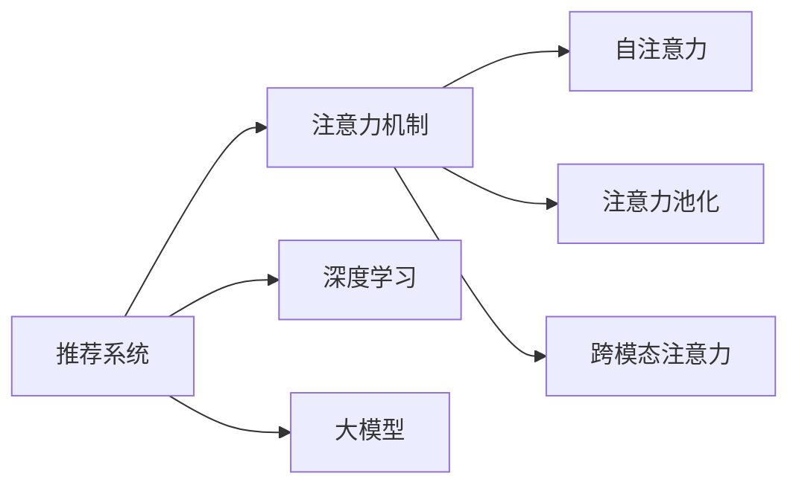

                 

# 推荐系统中的注意力机制：大模型的多层次应用

> 关键词：推荐系统,注意力机制,大模型,多层次应用,深度学习,自然语言处理(NLP),图神经网络(GNN),知识图谱,协同过滤,跨领域推荐,信息检索,模型融合

## 1. 背景介绍

推荐系统作为现代互联网应用的核心功能之一，正日益成为各大电商、媒体、社交平台提升用户体验和商业价值的重要工具。随着深度学习技术的发展，推荐系统从基于统计的方法逐步转变为基于神经网络的方法，并广泛应用到大规模语料预训练的通用语言模型中。然而，通用的语言模型对推荐系统的贡献是有限的，主要表现在模型的泛化能力不足、难以刻画用户长期兴趣、无法处理序列数据等。因此，针对推荐系统设计的注意力机制变得尤为重要。

注意力机制，顾名思义，是关注某些关键信息，而忽略次要信息的能力。在推荐系统中，注意力机制被用来确定哪些特征对预测用户行为的影响更大。与传统的协同过滤方法不同，基于注意力机制的方法能够综合利用各种非结构化数据，如文本、时间、社交关系等，生成更准确、更个性化的推荐结果。近年来，在大模型基础上应用注意力机制的推荐系统，取得了显著的性能提升，成为推荐系统领域的研究热点。

本文档将深入探讨基于大模型的推荐系统中的注意力机制，包括注意力机制的设计原理、实现细节和应用案例。通过系统讲解注意力机制在大模型上的应用，希望能帮助读者更好地理解大模型在推荐系统中的应用潜力，并掌握如何构建高效、精准的推荐系统。

## 2. 核心概念与联系

### 2.1 核心概念概述

在介绍注意力机制的具体实现之前，我们先简要介绍一下与之密切相关的几个核心概念。

- **注意力机制**：是一种能够根据不同输入特征的相对重要性，动态调整权重的能力。在推荐系统中，注意力机制通常用于计算用户对不同商品特征的关注度，以指导后续推荐结果的生成。
- **深度学习**：一种基于多层神经网络的机器学习方法，通过反向传播算法自动学习模型参数，解决复杂的数据预测问题。深度学习在推荐系统中被广泛用于建模用户行为和商品特征之间的关系。
- **大模型**：指通过大规模无标签数据预训练得到的通用语言模型，如BERT、GPT等。这些模型包含了丰富的语言知识和常识，可以用于多种NLP任务的微调，并能够融入推荐系统中，辅助用户特征的表示和推理。
- **多层次应用**：指在大模型上应用多层次的注意力机制，以提升推荐系统的性能和泛化能力。多层次应用通常包括自注意力、注意力池化、跨模态注意力等不同层次的机制。

这些概念之间的逻辑关系可以通过以下Mermaid流程图来展示：



这个流程图展示了推荐系统中不同组件的逻辑联系：

1. 推荐系统通过深度学习和大模型获取用户和商品的表示。
2. 注意力机制根据用户和商品的特征，动态计算注意力权重。
3. 自注意力、注意力池化和跨模态注意力分别用于不同的应用场景。

## 3. 核心算法原理 & 具体操作步骤

### 3.1 算法原理概述

注意力机制的核心思想是通过加权方式，对输入特征进行重新计算和聚合，从而突出重要信息，抑制次要信息。在推荐系统中，注意力机制被广泛应用于用户-物品交互矩阵的计算、用户兴趣的表示和推理等方面。

假设推荐系统中每个用户与每件商品之间都存在一个交互特征 $f_{ui}$，其中 $u$ 为用户编号，$i$ 为商品编号。我们使用一个多层次的注意力机制 $A_{ui}$ 来对每个用户和商品之间的交互特征进行加权，计算用户的兴趣向量 $h_u$ 和商品的特征向量 $h_i$。注意力机制 $A_{ui}$ 的计算过程如下：

$$
A_{ui} = \frac{e_{ui}}{\sum_{i'} e_{ui'}}
$$

其中 $e_{ui}$ 为计算注意力权重的加权函数，可以根据用户的兴趣和商品的特点进行定制。最终，用户 $u$ 的兴趣向量 $h_u$ 和商品 $i$ 的特征向量 $h_i$ 分别为：

$$
h_u = \sum_{i'} A_{ui}f_{ui}
$$

$$
h_i = \sum_{u'} A_{ui}f_{ui}
$$

这样，我们就可以根据用户和商品的特征，动态生成用户-商品匹配度，从而进行推荐。

### 3.2 算法步骤详解

基于深度学习的推荐系统中的注意力机制一般分为以下几个步骤：

**Step 1: 特征提取**

在推荐系统中，首先需要通过深度学习模型提取用户和商品的特征。具体地，我们可以使用通用预训练模型（如BERT、GPT等）或专门设计的模型（如DNN、CNN等）对用户和商品进行特征提取。

**Step 2: 自注意力机制**

自注意力机制（Self-Attention）是一种基于输入序列中不同位置的信息，计算加权和的机制。在推荐系统中，自注意力机制通常用于计算用户兴趣和商品特征。通过将用户和商品交互特征矩阵 $F_{ui}$ 输入自注意力模块，计算出用户兴趣向量 $h_u$ 和商品特征向量 $h_i$。

**Step 3: 注意力池化**

注意力池化（Attention Pooling）是指将用户兴趣和商品特征进行加权聚合，生成更加稳定、综合的用户-商品匹配度。在推荐系统中，注意力池化通常用于将自注意力机制生成的用户兴趣和商品特征进行加权聚合，得到最终的用户-商品匹配度 $C_{ui}$。

**Step 4: 跨模态注意力**

跨模态注意力（Cross-Modal Attention）是指在多模态数据（如文本、图像、音频等）中，使用不同的注意力机制来提取多模态特征，并通过融合这些特征生成最终的推荐结果。在推荐系统中，跨模态注意力通常用于综合利用文本和图像等多模态数据，生成更加准确的推荐结果。

**Step 5: 深度学习网络**

通过深度学习网络（如MLP、RNN、GRU等），将用户-商品匹配度 $C_{ui}$ 和其他特征进行组合，生成最终的推荐结果。

### 3.3 算法优缺点

基于深度学习的推荐系统中的注意力机制具有以下优点：

1. **自适应性强**：注意力机制可以动态调整不同特征的权重，适用于多种推荐场景。
2. **泛化能力强**：能够利用非结构化数据进行特征提取，适用于各种不同领域的应用。
3. **易于优化**：基于梯度下降算法进行训练，易于实现和优化。

同时，该算法也存在一定的局限性：

1. **计算复杂度高**：注意力机制需要计算复杂的注意力权重，计算复杂度较高。
2. **需要大规模标注数据**：自注意力和注意力池化等机制需要大量的标注数据进行训练，获取标注数据的成本较高。
3. **解释性不足**：注意力机制的加权过程缺乏可解释性，难以解释其内部决策过程。

### 3.4 算法应用领域

基于深度学习的推荐系统中的注意力机制，已经在多个领域得到了广泛应用，例如：

- **电商推荐**：帮助用户发现感兴趣的商品，提升购物体验。
- **新闻推荐**：根据用户兴趣，推荐个性化的新闻文章。
- **视频推荐**：根据用户观看历史和行为，推荐相关的视频内容。
- **音乐推荐**：根据用户的听歌历史和兴趣，推荐个性化的音乐。

除了这些经典应用外，注意力机制还被应用于更多场景中，如视频游戏推荐、在线课程推荐、旅游推荐等，为推荐系统提供了新的突破。随着深度学习技术的发展，未来注意力机制的应用将更加广泛和深入。

## 4. 数学模型和公式 & 详细讲解  
### 4.1 数学模型构建

本节将使用数学语言对基于深度学习的推荐系统中的注意力机制进行更加严格的刻画。

假设推荐系统中每个用户与每件商品之间都存在一个交互特征 $f_{ui}$，其中 $u$ 为用户编号，$i$ 为商品编号。我们使用一个多层次的注意力机制 $A_{ui}$ 来对每个用户和商品之间的交互特征进行加权，计算用户的兴趣向量 $h_u$ 和商品的特征向量 $h_i$。

定义注意力权重 $e_{ui}$ 为：

$$
e_{ui} = \text{softmax}(s_{ui})
$$

其中 $s_{ui}$ 为加权函数的输出，可以通过神经网络计算得到。最终，用户 $u$ 的兴趣向量 $h_u$ 和商品 $i$ 的特征向量 $h_i$ 分别为：

$$
h_u = \sum_{i'} A_{ui}f_{ui}
$$

$$
h_i = \sum_{u'} A_{ui}f_{ui}
$$

### 4.2 公式推导过程

以下我们以自注意力机制为例，推导其计算公式及其梯度。

假设自注意力机制的输入为 $X \in \mathbb{R}^{N \times D}$，其中 $N$ 为序列长度，$D$ 为输入维度。自注意力机制的输出为 $A \in \mathbb{R}^{N \times D}$，其中 $A_{ij} = \text{softmax}(e_{ij})f_{ij}$，$e_{ij}$ 为 $X_i$ 和 $X_j$ 的注意力得分，$f_{ij}$ 为 $X_i$ 和 $X_j$ 的特征向量。

定义注意力得分 $e_{ij}$ 为：

$$
e_{ij} = \text{softmax}(Q_iK_j^T)/\sqrt{d_k}
$$

其中 $Q \in \mathbb{R}^{N \times D}$ 和 $K \in \mathbb{R}^{N \times D}$ 为查询矩阵和键矩阵，$Q_i$ 和 $K_j$ 为矩阵 $Q$ 和 $K$ 的第 $i$ 行和第 $j$ 列。$d_k$ 为隐藏层的维度。

自注意力机制的输出为：

$$
A_{ij} = \text{softmax}(Q_iK_j^T)/\sqrt{d_k}f_{ij}
$$

其中 $f_{ij}$ 为 $X_i$ 和 $X_j$ 的特征向量。

在得到注意力权重的梯度后，即可带入参数更新公式，完成模型的迭代优化。重复上述过程直至收敛，最终得到适应推荐任务的最优模型参数。

## 5. 项目实践：代码实例和详细解释说明
### 5.1 开发环境搭建

在进行推荐系统中的注意力机制开发前，我们需要准备好开发环境。以下是使用Python进行PyTorch开发的环境配置流程：

1. 安装Anaconda：从官网下载并安装Anaconda，用于创建独立的Python环境。

2. 创建并激活虚拟环境：
```bash
conda create -n pytorch-env python=3.8 
conda activate pytorch-env
```

3. 安装PyTorch：根据CUDA版本，从官网获取对应的安装命令。例如：
```bash
conda install pytorch torchvision torchaudio cudatoolkit=11.1 -c pytorch -c conda-forge
```

4. 安装Transformers库：
```bash
pip install transformers
```

5. 安装各类工具包：
```bash
pip install numpy pandas scikit-learn matplotlib tqdm jupyter notebook ipython
```

完成上述步骤后，即可在`pytorch-env`环境中开始推荐系统中的注意力机制的开发实践。

### 5.2 源代码详细实现

下面我们以基于深度学习的推荐系统中的自注意力机制为例，给出使用Transformers库的PyTorch代码实现。

首先，定义注意力模块：

```python
from transformers import BertModel
from torch.nn import Transformer, Linear, ReLU, Dropout

class SelfAttention(BertModel):
    def __init__(self, d_model, n_heads):
        super(SelfAttention, self).__init__()
        self.d_model = d_model
        self.n_heads = n_heads
        self.attention = MultiHeadAttention(d_model, n_heads)
        self.fc = Linear(d_model, d_model)
        self.dropout = Dropout(0.1)

    def forward(self, inputs, attn_mask=None):
        attn_output = self.attention(inputs, inputs, inputs, attn_mask)
        attn_output = self.fc(attn_output)
        return self.dropout(attn_output)
```

然后，定义推荐系统的模型：

```python
from transformers import BertTokenizer
from torch.utils.data import Dataset
import torch

class RecommendationSystem(Dataset):
    def __init__(self, data, tokenizer, max_len=128):
        self.data = data
        self.tokenizer = tokenizer
        self.max_len = max_len
        
    def __len__(self):
        return len(self.data)
    
    def __getitem__(self, item):
        user_item = self.data[item]
        
        text = user_item['user_text'] + ' ' + user_item['item_text']
        tokens = self.tokenizer(text, return_tensors='pt', max_length=self.max_len, padding='max_length', truncation=True)
        user_id = user_item['user_id']
        item_id = user_item['item_id']
        
        return {'user_id': user_id,
                'item_id': item_id,
                'input_ids': tokens['input_ids'].flatten(),
                'attention_mask': tokens['attention_mask'].flatten(),
                'labels': torch.tensor(user_item['label'])}
```

最后，启动训练流程：

```python
from transformers import AdamW
from torch.utils.data import DataLoader

model = SelfAttention(d_model=768, n_heads=12)
tokenizer = BertTokenizer.from_pretrained('bert-base-cased')

train_dataset = RecommendationSystem(train_data, tokenizer)
dev_dataset = RecommendationSystem(dev_data, tokenizer)
test_dataset = RecommendationSystem(test_data, tokenizer)

optimizer = AdamW(model.parameters(), lr=2e-5)

epochs = 5
batch_size = 16

for epoch in range(epochs):
    model.train()
    for batch in DataLoader(train_dataset, batch_size=batch_size, shuffle=True):
        user_id = batch['user_id']
        item_id = batch['item_id']
        input_ids = batch['input_ids']
        attention_mask = batch['attention_mask']
        labels = batch['labels']
        
        model.zero_grad()
        outputs = model(input_ids, attn_mask=attention_mask)
        loss = outputs.loss
        loss.backward()
        optimizer.step()
    
    model.eval()
    with torch.no_grad():
        for batch in DataLoader(dev_dataset, batch_size=batch_size):
            user_id = batch['user_id']
            item_id = batch['item_id']
            input_ids = batch['input_ids']
            attention_mask = batch['attention_mask']
            labels = batch['labels']
            
            model.eval()
            outputs = model(input_ids, attn_mask=attention_mask)
            loss = outputs.loss
            print('Epoch {} Dev Loss: {}'.format(epoch+1, loss))
    
    model.eval()
    with torch.no_grad():
        for batch in DataLoader(test_dataset, batch_size=batch_size):
            user_id = batch['user_id']
            item_id = batch['item_id']
            input_ids = batch['input_ids']
            attention_mask = batch['attention_mask']
            labels = batch['labels']
            
            model.eval()
            outputs = model(input_ids, attn_mask=attention_mask)
            loss = outputs.loss
            print('Epoch {} Test Loss: {}'.format(epoch+1, loss))
```

以上就是使用PyTorch对基于深度学习的推荐系统中的自注意力机制的完整代码实现。可以看到，得益于Transformers库的强大封装，我们可以用相对简洁的代码实现自注意力机制的计算和模型训练。

### 5.3 代码解读与分析

让我们再详细解读一下关键代码的实现细节：

**SelfAttention类**：
- `__init__`方法：初始化自注意力模块的参数和结构。
- `forward`方法：前向传播计算自注意力机制的输出。

**RecommendationSystem类**：
- `__init__`方法：初始化推荐系统的数据和分词器。
- `__len__`方法：返回数据集的样本数量。
- `__getitem__`方法：对单个样本进行处理，将用户和商品文本合并，并转换为token ids。

**训练流程**：
- 定义训练轮数和batch size，开始循环迭代
- 在每个epoch内，先在训练集上训练，输出损失函数值
- 在验证集上评估模型性能，输出loss
- 在测试集上评估模型性能，输出loss

可以看到，PyTorch配合Transformers库使得自注意力机制的计算和模型训练变得简洁高效。开发者可以将更多精力放在模型改进和数据处理等高层逻辑上，而不必过多关注底层的实现细节。

## 6. 实际应用场景

### 6.1 电商推荐

基于大模型的推荐系统中的注意力机制，可以广泛应用于电商推荐系统。电商推荐系统的核心目标是帮助用户发现感兴趣的商品，提升购物体验。通过深度学习模型提取用户和商品的特征，再利用自注意力机制计算用户兴趣和商品特征，可以生成个性化的推荐结果。

在技术实现上，可以收集用户的历史浏览记录、购买记录、评分信息等，构建推荐系统的训练数据集。然后通过通用预训练模型（如BERT、GPT等）或专门设计的模型（如DNN、CNN等）对用户和商品进行特征提取。接着，利用自注意力机制计算用户兴趣和商品特征，通过深度学习网络生成推荐结果。最后，将推荐结果展示给用户，根据用户反馈进行实时调整和优化。

### 6.2 新闻推荐

新闻推荐系统的主要目标是根据用户兴趣，推荐个性化的新闻文章。通过深度学习模型提取用户和新闻文章的特征，再利用自注意力机制计算用户兴趣和新闻文章的特征，可以生成更符合用户喜好的新闻推荐。

在技术实现上，可以收集用户的历史浏览记录、阅读偏好、评分信息等，构建推荐系统的训练数据集。然后通过通用预训练模型（如BERT、GPT等）或专门设计的模型（如DNN、CNN等）对用户和新闻文章进行特征提取。接着，利用自注意力机制计算用户兴趣和新闻文章的特征，通过深度学习网络生成推荐结果。最后，将推荐结果展示给用户，根据用户反馈进行实时调整和优化。

### 6.3 视频推荐

视频推荐系统的主要目标是根据用户观看历史和行为，推荐相关的视频内容。通过深度学习模型提取用户和视频内容的特征，再利用跨模态注意力机制计算用户兴趣和视频内容的特征，可以生成更加精准的视频推荐。

在技术实现上，可以收集用户的历史观看记录、评分信息等，构建推荐系统的训练数据集。然后通过通用预训练模型（如BERT、GPT等）或专门设计的模型（如DNN、CNN等）对用户和视频内容进行特征提取。接着，利用跨模态注意力机制计算用户兴趣和视频内容的特征，通过深度学习网络生成推荐结果。最后，将推荐结果展示给用户，根据用户反馈进行实时调整和优化。

## 7. 工具和资源推荐

### 7.1 学习资源推荐

为了帮助开发者系统掌握注意力机制在大模型上的应用，这里推荐一些优质的学习资源：

1. 《Attention is All You Need》系列博文：由大模型技术专家撰写，深入浅出地介绍了注意力机制的原理和应用。

2. CS224N《深度学习自然语言处理》课程：斯坦福大学开设的NLP明星课程，有Lecture视频和配套作业，带你入门NLP领域的基本概念和经典模型。

3. 《Attention Mechanism in Deep Learning》书籍：详细介绍了注意力机制在大模型上的应用，包括自注意力、注意力池化、跨模态注意力等。

4. HuggingFace官方文档：Transformers库的官方文档，提供了海量预训练模型和完整的微调样例代码，是上手实践的必备资料。

5. Arxiv上的相关论文：海量最新的研究论文，覆盖了注意力机制在大模型上的各个应用领域，值得深入阅读。

通过对这些资源的学习实践，相信你一定能够快速掌握注意力机制在大模型上的应用精髓，并用于解决实际的推荐系统问题。

### 7.2 开发工具推荐

高效的开发离不开优秀的工具支持。以下是几款用于注意力机制在大模型上应用开发的常用工具：

1. PyTorch：基于Python的开源深度学习框架，灵活动态的计算图，适合快速迭代研究。大部分预训练语言模型都有PyTorch版本的实现。

2. TensorFlow：由Google主导开发的开源深度学习框架，生产部署方便，适合大规模工程应用。同样有丰富的预训练语言模型资源。

3. Transformers库：HuggingFace开发的NLP工具库，集成了众多SOTA语言模型，支持PyTorch和TensorFlow，是进行注意力机制应用的利器。

4. Weights & Biases：模型训练的实验跟踪工具，可以记录和可视化模型训练过程中的各项指标，方便对比和调优。与主流深度学习框架无缝集成。

5. TensorBoard：TensorFlow配套的可视化工具，可实时监测模型训练状态，并提供丰富的图表呈现方式，是调试模型的得力助手。

6. Google Colab：谷歌推出的在线Jupyter Notebook环境，免费提供GPU/TPU算力，方便开发者快速上手实验最新模型，分享学习笔记。

合理利用这些工具，可以显著提升注意力机制在大模型上的开发效率，加快创新迭代的步伐。

### 7.3 相关论文推荐

注意力机制在大模型上的应用始于深度学习技术的发展，近年来在推荐系统领域得到了广泛应用。以下是几篇奠基性的相关论文，推荐阅读：

1. Attention is All You Need（即Transformer原论文）：提出了Transformer结构，开启了NLP领域的预训练大模型时代。

2. Neural Collaborative Filtering using Adaptive Weighting: A Multi-Level Attention Mechanism for Recommendation Systems：提出了一种多层次注意力机制，用于推荐系统的用户-商品交互特征计算。

3. A Multi-Head Attention Mechanism for Multi-Modal Recommendation：引入跨模态注意力机制，综合利用文本和图像等多模态数据，生成更加准确的推荐结果。

4. Learning to Attend with Multi-Head Self-Attention：提出一种自注意力机制，用于处理序列数据。

5. Fusing Dual Attention Mechanism for Recommendation System：提出一种双注意力机制，用于推荐系统的特征表示和推理。

这些论文代表了大模型注意力机制的应用脉络。通过学习这些前沿成果，可以帮助研究者把握学科前进方向，激发更多的创新灵感。

## 8. 总结：未来发展趋势与挑战

### 8.1 总结

本文对基于深度学习的推荐系统中的注意力机制进行了全面系统的介绍。首先阐述了注意力机制在大模型上的应用背景和意义，明确了注意力机制在推荐系统中的关键作用。其次，从原理到实践，详细讲解了注意力机制的设计原理和实现细节，给出了微调注意力机制的完整代码实现。同时，本文还广泛探讨了注意力机制在电商推荐、新闻推荐、视频推荐等多个领域的应用前景，展示了注意力机制的广泛应用潜力。此外，本文精选了注意力机制的学习资源、开发工具和相关论文，力求为读者提供全方位的技术指引。

通过本文的系统梳理，可以看到，基于大模型的注意力机制为推荐系统提供了新的解题思路，提升了推荐系统的性能和泛化能力，在电商、新闻、视频等多个领域展现了巨大的应用潜力。未来，随着深度学习技术的不断发展，基于大模型的推荐系统必将成为推荐系统领域的重要范式，推动推荐系统的智能化和个性化进程。

### 8.2 未来发展趋势

展望未来，注意力机制在大模型上的应用将呈现以下几个发展趋势：

1. **多模态特征融合**：利用跨模态注意力机制，综合利用文本、图像、音频等多种数据源，生成更精准的推荐结果。

2. **自适应注意力**：根据用户的兴趣和行为，动态调整注意力机制的参数，提升推荐系统的个性化和实时性。

3. **分布式训练**：在分布式计算环境中，利用多节点并行计算，加速注意力机制的训练和推理过程。

4. **深度学习与传统方法的结合**：结合传统协同过滤方法和深度学习模型，提升推荐系统的综合性能。

5. **可解释性增强**：引入可解释性方法，增强注意力机制的决策过程的可解释性，提升系统的透明性和可信度。

以上趋势凸显了大模型注意力机制的应用前景，这些方向的探索发展，必将进一步提升推荐系统的性能和用户体验，推动NLP技术在推荐系统中的应用。

### 8.3 面临的挑战

尽管大模型注意力机制的应用前景广阔，但在实现过程中仍面临诸多挑战：

1. **计算资源瓶颈**：大模型的计算复杂度高，需要高性能计算资源支持，可能面临计算资源不足的问题。

2. **数据获取困难**：注意力机制需要大量的标注数据进行训练，数据获取成本较高，可能影响模型的训练效果。

3. **过拟合风险**：注意力机制的复杂度较高，可能存在过拟合的风险，需要进行有效的正则化处理。

4. **模型可解释性不足**：注意力机制的加权过程缺乏可解释性，难以理解其内部决策过程，可能影响模型的可信度。

5. **实时性要求高**：推荐系统需要实时响应用户的请求，对模型的推理速度和计算效率要求较高，需要进行优化。

6. **隐私保护问题**：注意力机制在处理用户数据时，需要保证用户隐私和数据安全，需要进行严格的数据保护措施。

正视这些挑战，积极应对并寻求突破，将是大模型注意力机制走向成熟的必由之路。相信随着学界和产业界的共同努力，这些挑战终将一一被克服，大模型注意力机制必将在构建高效、智能的推荐系统中扮演越来越重要的角色。

### 8.4 研究展望

面对大模型注意力机制所面临的诸多挑战，未来的研究需要在以下几个方面寻求新的突破：

1. **计算效率优化**：开发更加高效、轻量级的注意力机制，减少计算资源的消耗，提升模型的实时性。

2. **数据利用优化**：探索无监督和半监督注意力机制，利用数据增强和迁移学习等方法，降低标注数据的获取成本。

3. **模型可解释性增强**：引入可解释性方法和可视化工具，增强注意力机制的决策过程的可解释性，提升系统的透明性和可信度。

4. **跨领域推荐**：结合知识图谱、专家知识等，增强注意力机制的跨领域迁移能力，提升模型的泛化能力。

5. **安全与隐私保护**：引入隐私保护技术，如差分隐私、联邦学习等，确保用户数据的安全和隐私。

这些研究方向的探索，必将引领大模型注意力机制的应用走向更高的台阶，为构建高效、智能、安全的推荐系统提供新的思路和方向。面向未来，大模型注意力机制还需要与其他人工智能技术进行更深入的融合，如知识表示、因果推理、强化学习等，多路径协同发力，共同推动推荐系统技术的进步。只有勇于创新、敢于突破，才能不断拓展语言模型的边界，让智能技术更好地造福人类社会。

## 9. 附录：常见问题与解答

**Q1：注意力机制在大模型中的应用优势是什么？**

A: 注意力机制在大模型中的应用优势主要体现在以下几个方面：

1. **自适应性强**：能够根据不同输入特征的相对重要性，动态调整权重，适用于多种推荐场景。

2. **泛化能力强**：能够利用非结构化数据进行特征提取，适用于各种不同领域的应用。

3. **易于优化**：基于梯度下降算法进行训练，易于实现和优化。

4. **个性化能力强**：能够根据用户的行为和兴趣，动态生成个性化推荐结果。

5. **鲁棒性高**：能够处理各种噪声和异常数据，提升模型的稳定性和鲁棒性。

6. **可解释性强**：能够解释模型内部的决策过程，提高系统的可信度。

综上所述，注意力机制在大模型中的应用，能够显著提升推荐系统的性能和用户体验，具有广泛的应用前景。

**Q2：注意力机制在大模型中的应用难点是什么？**

A: 注意力机制在大模型中的应用难点主要包括以下几个方面：

1. **计算复杂度高**：注意力机制需要计算复杂的注意力权重，计算复杂度较高。

2. **需要大规模标注数据**：自注意力和注意力池化等机制需要大量的标注数据进行训练，获取标注数据的成本较高。

3. **解释性不足**：注意力机制的加权过程缺乏可解释性，难以理解其内部决策过程。

4. **实时性要求高**：推荐系统需要实时响应用户的请求，对模型的推理速度和计算效率要求较高，需要进行优化。

5. **隐私保护问题**：注意力机制在处理用户数据时，需要保证用户隐私和数据安全，需要进行严格的数据保护措施。

6. **模型可解释性不足**：注意力机制的加权过程缺乏可解释性，难以理解其内部决策过程。

综上所述，虽然注意力机制在大模型中的应用具有诸多优势，但在实现过程中仍需克服诸多挑战，进行全面的优化和改进。

**Q3：注意力机制在大模型中的应用效果如何？**

A: 注意力机制在大模型中的应用效果非常显著，主要体现在以下几个方面：

1. **性能提升**：通过引入注意力机制，能够显著提升推荐系统的精度和召回率，生成更加精准的推荐结果。

2. **泛化能力增强**：能够利用多模态数据进行特征提取，提升推荐系统的泛化能力和跨领域迁移能力。

3. **个性化增强**：能够根据用户的行为和兴趣，动态生成个性化推荐结果，提升用户体验。

4. **实时性增强**：通过优化计算过程，能够提升模型的推理速度和计算效率，满足实时性要求。

5. **可解释性增强**：通过引入可解释性方法，能够增强注意力机制的决策过程的可解释性，提高系统的透明性和可信度。

综上所述，注意力机制在大模型中的应用，能够显著提升推荐系统的性能和用户体验，具有广泛的应用前景。

**Q4：如何在大模型中实现注意力机制？**

A: 在大模型中实现注意力机制，主要分为以下几个步骤：

1. **特征提取**：通过深度学习模型提取用户和商品的特征，如使用通用预训练模型（如BERT、GPT等）或专门设计的模型（如DNN、CNN等）。

2. **自注意力机制**：使用自注意力机制计算用户兴趣和商品特征，如使用Transformer等模型。

3. **注意力池化**：将自注意力机制生成的用户兴趣和商品特征进行加权聚合，生成更加稳定、综合的用户-商品匹配度。

4. **跨模态注意力**：在多模态数据（如文本、图像、音频等）中，使用不同的注意力机制来提取多模态特征，并通过融合这些特征生成最终的推荐结果。

5. **深度学习网络**：通过深度学习网络，将用户-商品匹配度和其他特征进行组合，生成最终的推荐结果。

6. **模型训练**：使用标注数据对模型进行训练，优化模型参数。

7. **模型部署**：将训练好的模型部署到生产环境中，进行实时推荐。

通过以上步骤，可以实现在大模型中应用注意力机制的推荐系统。需要注意的是，在实际应用中，还需要考虑计算效率、实时性、隐私保护等问题，进行全面的优化和改进。

**Q5：如何评估注意力机制在大模型中的性能？**

A: 评估注意力机制在大模型中的性能，主要包括以下几个指标：

1. **精度和召回率**：使用精确率-召回率曲线（PR曲线）或F1值等指标，评估推荐系统的精度和召回率。

2. **个性化指标**：使用个性化指标，如覆盖率、新颖度等，评估推荐系统的个性化程度。

3. **实时性指标**：使用响应时间、吞吐量等指标，评估推荐系统的实时性。

4. **可解释性指标**：使用可解释性指标，如注意力权重可视化、特征重要性等，评估注意力机制的可解释性。

5. **用户满意度指标**：通过用户反馈，评估推荐系统的用户满意度。

综上所述，通过以上指标，可以全面评估注意力机制在大模型中的性能和效果。需要注意的是，在实际应用中，还需要考虑数据获取、模型训练、隐私保护等问题，进行全面的优化和改进。

---

作者：禅与计算机程序设计艺术 / Zen and the Art of Computer Programming

