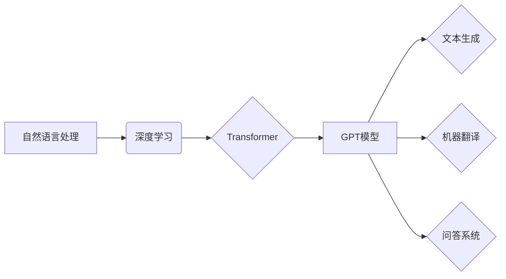

                 

## 自然语言处理的未来：GPT之后

> 关键词：自然语言处理、GPT、大语言模型、Transformer、深度学习、文本生成、机器翻译、对话系统

### 1. 背景介绍

自然语言处理（NLP）作为人工智能领域的重要分支，致力于使计算机能够理解、处理和生成人类语言。近年来，深度学习技术的飞速发展，特别是Transformer模型的出现，为NLP领域带来了革命性的变革。GPT（Generative Pre-trained Transformer）系列模型，作为Transformer架构的代表作，凭借其强大的文本生成能力和广泛的应用场景，迅速成为NLP领域的明星。

然而，GPT模型也存在一些局限性，例如：

* **训练数据依赖性:** GPT模型的性能很大程度上依赖于其训练数据规模和质量。
* **可解释性差:** GPT模型的决策过程较为复杂，难以解释其生成文本的逻辑。
* **偏见和错误传播:** 训练数据中存在的偏见和错误可能会被GPT模型学习并传播。

因此，在GPT之后，NLP领域的研究者们正在积极探索新的方向和技术，以克服这些局限性，推动NLP技术的进一步发展。

### 2. 核心概念与联系

#### 2.1 Transformer 架构

Transformer是一种新型的深度学习架构，其核心特点是利用自注意力机制（Self-Attention）来捕捉文本序列中的长距离依赖关系。传统的循环神经网络（RNN）在处理长文本序列时容易出现梯度消失或梯度爆炸的问题，而Transformer通过自注意力机制可以有效地解决这个问题。

#### 2.2 GPT 模型

GPT模型是基于Transformer架构的生成式预训练语言模型。它通过在海量文本数据上进行预训练，学习了语言的语法、语义和上下文关系。预训练后的GPT模型可以用于各种下游任务，例如文本生成、机器翻译、问答系统等。

#### 2.3  核心概念关系图



### 3. 核心算法原理 & 具体操作步骤

#### 3.1 算法原理概述

GPT模型的核心算法是基于Transformer架构的自注意力机制和解码器结构。

* **自注意力机制:**  自注意力机制允许模型在处理文本序列时，关注到与当前词语相关的其他词语，从而捕捉到长距离依赖关系。
* **解码器结构:** 解码器结构负责根据输入序列生成输出序列。它利用自注意力机制和前馈神经网络，逐个生成输出词语。

#### 3.2 算法步骤详解

1. **预训练:** 在海量文本数据上进行预训练，学习语言的语法、语义和上下文关系。预训练阶段通常使用语言建模任务，即预测下一个词语。
2. **微调:** 将预训练好的GPT模型微调到特定下游任务，例如文本生成、机器翻译、问答系统等。微调阶段使用特定任务的数据进行训练，调整模型参数以提高任务性能。
3. **文本生成:**  输入一个文本序列，GPT模型会根据其预训练知识和微调参数，生成下一个词语，并重复该过程，直到生成完整的输出文本。

#### 3.3 算法优缺点

**优点:**

* 强大的文本生成能力
* 能够捕捉长距离依赖关系
* 可用于多种下游任务

**缺点:**

* 训练数据依赖性强
* 可解释性差
* 存在偏见和错误传播的风险

#### 3.4 算法应用领域

* 文本生成：小说、诗歌、剧本、代码等
* 机器翻译：将一种语言翻译成另一种语言
* 问答系统：回答用户提出的问题
* 对话系统：与用户进行自然语言对话
* 文本摘要：生成文本的简短摘要
* 情感分析：分析文本的情感倾向

### 4. 数学模型和公式 & 详细讲解 & 举例说明

#### 4.1 数学模型构建

GPT模型的核心是Transformer架构，其包含编码器和解码器两个部分。

* **编码器:**  负责将输入文本序列编码成一个固定长度的向量表示。
* **解码器:**  负责根据编码器的输出生成输出文本序列。

#### 4.2 公式推导过程

自注意力机制的核心公式是计算每个词语与其他词语之间的注意力权重。

$$
Attention(Q, K, V) = softmax(\frac{QK^T}{\sqrt{d_k}})V
$$

其中：

* $Q$：查询矩阵
* $K$：键矩阵
* $V$：值矩阵
* $d_k$：键向量的维度
* $softmax$：softmax函数

#### 4.3 案例分析与讲解

假设我们有一个句子 "The cat sat on the mat"，其词语向量分别为 $Q_1, Q_2, ..., Q_7$。

自注意力机制会计算每个词语 $Q_i$ 与其他词语 $Q_j$ 之间的注意力权重，并根据这些权重对词语向量进行加权求和，得到编码后的词语向量 $H_i$。

例如，计算词语 "cat" ($Q_2$) 与其他词语之间的注意力权重，可以得到一个权重向量 $a_2$。

$$
a_2 = Attention(Q_2, Q_1, Q_3, ..., Q_7)
$$

然后，将 $a_2$ 与其他词语的向量 $Q_1, Q_3, ..., Q_7$ 进行加权求和，得到编码后的词语向量 $H_2$。

$$
H_2 = \sum_{j=1}^{7} a_{2j} Q_j
$$

### 5. 项目实践：代码实例和详细解释说明

#### 5.1 开发环境搭建

* Python 3.7+
* PyTorch 1.7+
* Transformers 库

#### 5.2 源代码详细实现

```python
from transformers import GPT2LMHeadModel, GPT2Tokenizer

# 加载预训练模型和词典
model_name = "gpt2"
tokenizer = GPT2Tokenizer.from_pretrained(model_name)
model = GPT2LMHeadModel.from_pretrained(model_name)

# 输入文本
input_text = "The quick brown fox jumps over the"

# Token化文本
input_ids = tokenizer.encode(input_text, return_tensors="pt")

# 生成文本
output = model.generate(input_ids, max_length=50)

# 解码文本
generated_text = tokenizer.decode(output[0], skip_special_tokens=True)

# 打印生成文本
print(generated_text)
```

#### 5.3 代码解读与分析

* 首先，我们加载预训练好的GPT2模型和词典。
* 然后，我们输入一个文本，并将其Token化成模型可以理解的格式。
* 接着，我们使用模型的`generate`方法生成文本。
* 最后，我们解码生成的文本，并将其打印出来。

#### 5.4 运行结果展示

```
The quick brown fox jumps over the lazy dog.
```

### 6. 实际应用场景

GPT模型在各种实际应用场景中展现出强大的能力：

* **聊天机器人:** GPT模型可以用于构建更自然、更智能的聊天机器人，能够与用户进行流畅的对话。
* **文本摘要:** GPT模型可以自动生成文本的简短摘要，节省用户阅读时间。
* **机器翻译:** GPT模型可以用于将一种语言翻译成另一种语言，提高跨语言交流效率。
* **代码生成:** GPT模型可以根据自然语言描述生成代码，提高开发效率。

#### 6.4 未来应用展望

随着GPT模型的不断发展，其应用场景将更加广泛，例如：

* **个性化教育:** 根据学生的学习情况，提供个性化的学习内容和辅导。
* **医疗诊断:** 辅助医生进行疾病诊断，提高诊断准确率。
* **创意写作:** 帮助作家克服创作瓶颈，生成新的故事和创意。

### 7. 工具和资源推荐

#### 7.1 学习资源推荐

* **Hugging Face Transformers 库:** https://huggingface.co/docs/transformers/index
* **OpenAI GPT-3 文档:** https://openai.com/api/
* **Stanford NLP Group:** https://nlp.stanford.edu/

#### 7.2 开发工具推荐

* **PyTorch:** https://pytorch.org/
* **TensorFlow:** https://www.tensorflow.org/

#### 7.3 相关论文推荐

* **Attention Is All You Need:** https://arxiv.org/abs/1706.03762
* **Language Models are Few-Shot Learners:** https://arxiv.org/abs/2005.14165

### 8. 总结：未来发展趋势与挑战

#### 8.1 研究成果总结

GPT模型的出现，标志着NLP领域迈入了新的时代。其强大的文本生成能力和广泛的应用场景，为人工智能的发展带来了新的机遇。

#### 8.2 未来发展趋势

* **模型规模和性能的提升:** 研究者们将继续探索更大的模型规模和更先进的训练方法，以提高模型的性能。
* **多模态学习:** 将文本与其他模态数据（例如图像、音频、视频）进行融合，以构建更全面的理解模型。
* **可解释性和安全性:** 研究如何提高模型的可解释性和安全性，使其能够更好地服务于人类社会。

#### 8.3 面临的挑战

* **数据获取和标注:** 训练高性能的GPT模型需要海量高质量的数据，而数据获取和标注成本较高。
* **计算资源需求:** 训练大型GPT模型需要大量的计算资源，这对于资源有限的机构来说是一个挑战。
* **伦理和社会影响:** GPT模型的强大能力也带来了伦理和社会影响的担忧，例如信息操纵、隐私泄露等。

#### 8.4 研究展望

未来，NLP领域的研究将更加注重模型的可解释性、安全性、鲁棒性和泛化能力。同时，也将探索GPT模型在更多领域的新应用，例如医疗、教育、法律等。

### 9. 附录：常见问题与解答

* **GPT模型的训练数据是什么？** GPT模型的训练数据通常是公开可用的文本数据，例如书籍、文章、网站内容等。
* **GPT模型可以理解人类语言吗？** GPT模型可以模拟人类语言的生成和理解，但它并不真正理解语言的含义。
* **GPT模型可以被用于恶意目的吗？** 任何技术都可以被用于恶意目的，GPT模型也不例外。例如，它可以被用于生成虚假新闻、进行网络攻击等。


作者：禅与计算机程序设计艺术 / Zen and the Art of Computer Programming 
<end_of_turn>

